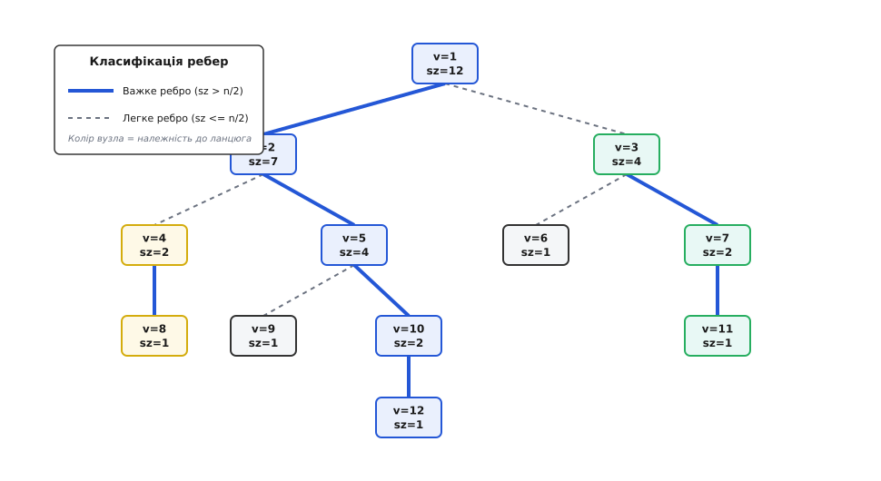
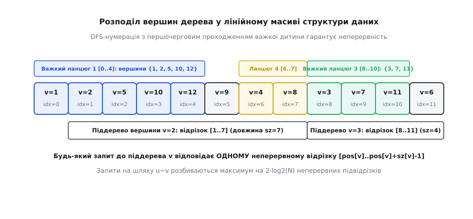
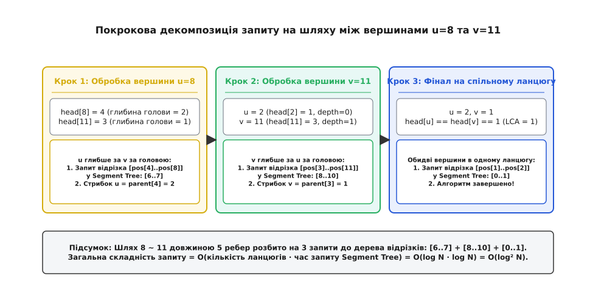

# Heavy-Light декомпозиція (HLD)

<preknowlist>
- [Двійкове дерево](topic:algorithms/binary-tree) — ієрархічні зв'язки між вузлами, поняття батьківського елемента, дітей, глибини та розміру піддерева.
- [Відрізкове дерево (Segment Tree)](topic:algorithms/segment-tree) — динамічні інтервальні запити агрегатів та модифікації на числових масивах за логарифмічний час.
- [Пошук у глибину (DFS)](topic:algorithms/depth-first-search) — рекурсивний обхід вершин графа, формування часових міток входження та виходу.
</preknowlist>

У розподіленій системі маршрутизації з ієрархічною топологією на 100 000 комутаторів щосекунди надходить понад 100 000 запитів на перевірку пропускної здатності каналів зв'язку між довільними парами серверів та динамічне резервування смуги пропускання на магістралях. Якщо кожен запит розв'язувати прямим пошуком у глибину чи ширину, час обробки одного шляху становитиме `O(N)` операцій. При `N = 100 000` та `Q = 100 000` це призводить до `10¹⁰` процесорних тактів і спричиняє затримку у десятки секунд, паралізуючи диспетчеризацію трафіку в реальному часі.

Причина цієї продуктивної кризи полягає у фундаментальній нелінійності деревоподібної структури: шлях між двома вузлами розгалужується у просторі пам'яті, змушуючи процесор переходити за розрізненими покажчиками і провокуючи постійні промахи кеш-пам'яті (Cache Misses). Heavy-Light декомпозиція (HLD) повністю усуває цей бар'єр. Вона розкладає довільне кореневе дерево на систему неперетинних лінійних ланцюгів так, що будь-який простий шлях між двома вузлами розбивається не більше ніж на `O(log N)` неперервних числових відрізків. Завдяки цьому складні просторові запити на графах зводяться до стандартних інтервальних операцій над одновимірними масивами зі швидкістю `O(log² N)` для шляхів та `O(log N)` для піддерев.

## Фізика обчислювального уповільнення на деревоподібних структурах

Щоб зрозуміти, чому традиційні підходи до обробки дерев зазнають колапсу на великих масштабах, необхідно розглянути взаємодію алгоритму з апаратною архітектурою сучасного процесора.

У класичній реалізації дерево представляється як зв'язаний граф у динамічній пам'яті (кучі), де кожен вузол містить покажчики на своїх дітей або батьківський елемент:
```
struct TreeNode {
    int64_t value;
    TreeNode* parent;
    std::vector<TreeNode*> children;
};
```
Коли алгоритм обробляє запит між двома вершинами, розташованими на глибині 10 000, він змушений послідовно розіменовувати 10 000 покажчиків. У фізичній пам'яті ці вузли виділялися в різні моменти часу і розкидані по різних сторінках віртуального адресного простору.

Затримка звернення до оперативної пам'яті (DRAM) становить приблизно 60–100 наносекунд (200–300 тактів центрального процесора), тоді як звернення до кешу першого рівня L1 Data Cache займає лише 1 наносекунду (4 такти). При обході графа за покажчиками майже кожен перехід спричиняє промах кеш-лінії (L1/L2 Cache Miss) та промах буфера асоціативної трансляції адрес (TLB Miss). Процесорний конвеєр простоює понад 95% часу, очікуючи на доставку даних із системної шини.

Heavy-Light декомпозиція розв'язує цю фундаментальну апаратну проблему: вона повністю відмовляється від випадкових переходів по кучі, транслюючи дерево у єдиний плоский послідовний масив. Коли процесор зчитує елементи ланцюга, апаратний блок попередньої вибірки (Hardware Stream Prefetcher) автоматично завантажує наступні 64-байтні кеш-лінії у швидкісний L1 кеш, забезпечуючи максимальну пропускну здатність пам'яті.

## Класифікація ребер: Важкі та легкі зв'язки

Фундаментальна ідея декомпозиції полягає в асиметричному розділенні нащадків кожної вершини залежно від «ваги» їхніх піддерев. Нехай задано дерево `T` з коренем у вершині `r`, де для кожної вершини `u` обчислено розмір її піддерева `sz(u)` — сумарну кількість вершин, що містяться в піддереві з коренем у `u` включно.

Для кожного вузла `u` та його безпосередньої дитини `v` ребро `(u, v)` класифікується за наступним математичним правилом:
* **Важке ребро (Heavy Edge):** ребро до дитини `v`, піддерево якої містить строго більше половини вершин піддерева батька (`sz(v) > sz(u) / 2`). В алгоритмічній практиці важким обирають ребро до дитини з **максимальним** розміром піддерева серед усіх нащадків: `v = argmax_{c ∈ children(u)} sz(c)`.
* **Легке ребро (Light Edge):** будь-яке інше ребро, що веде до нащадків із меншим розміром піддерев (`sz(v) ≤ sz(u) / 2`).


*Рис. 1. Класифікація ребер на важкі (сині подвійні) та легкі (пунктирні) на основі розмірів піддерев.*

Ця класифікація породжує базову лему HLD: **будь-яка вершина графа може мати щонайбільше одного важкого нащадка**. Якщо припустити, що вершина `u` має двох важких дітей `v₁` та `v₂`, то сума розмірів їхніх піддерев перевищить `sz(u) / 2 + sz(u) / 2 = sz(u)`, що суперечить визначенню розміру дерева.

Внаслідок єдиності важкої дитини множина всіх важких ребер розпадається на множину взаємно неперетинних простих шляхів — **важких ланцюгів (Heavy Chains)**. Кожна вершина дерева належить рівно одному важкому ланцюгу (деякі ланцюги складаються з єдиної вершини-листка). Перехід між різними важкими ланцюгами завжди здійснюється через легке ребро.

Еволюцію цієї ідеї та її появу в роботах Тарджана і Слітора 1983 року докладно розглянуто в історичній довідці [📜 Історія винаходу декомпозиції Sleator-Tarjan 1983 року](topic:algorithms/heavy-light-decomposition/hist-hld-origins.md).

## Логарифмічна межа глибини та властивості ланцюгів

Чому саме поділ на важкі та легкі ребра гарантує екстремальну швидкодію? Відповідь криється у комбінаторному законі стиснення піддерев:

Кожного разу, коли ми рухаємося від батьківської вершини `u` до дочірньої вершини `v` уздовж **легкого ребра**, розмір піддерева гарантовано зменшується щонайменше вдвічі:
```
sz(v) ≤ ⌊sz(u) / 2⌋    [гарантоване зменшення піддерева на легкому ребрі]
```

Оскільки дерево містить загалом `N` вершин, а мінімальний розмір непорожнього піддерева дорівнює `1`, неможливо зменшити розмір удвічі більше ніж `⌊log₂ N⌋` разів. Звідси випливає фундаментальна теорема Heavy-Light декомпозиції: **на будь-якому простому шляху від кореня дерева до довільного листка зустрічається не більше ніж `⌊log₂ N⌋` легких ребер**.

Оскільки будь-який перехід з одного важкого ланцюга в інший обов'язково перетинає одне легке ребро, загальна кількість важких ланцюгів на шляху від кореня до довільної вершини не перевищує `1 + ⌊log₂ N⌋`.

Для довільного шляху між двома довільними вузлами `u` та `v`, який проходить через їхнього найменшого спільного предка `w = LCA(u, v)`, шлях складається з двох вертикальних відрізків: підйому від `u` до `w` та спуску від `w` до `v`. Отже, довільний шлях у дереві перетинає щонайбільше:
```
Chains(u, v) ≤ 2 · ⌊log₂ N⌋ + 1 = O(log N)    [максимальна кількість ланцюгів на шляху]
```
Повні формальні доведення цих меж, включно з аналізом потенціалів та крайових топологій, наведено у математичному додатку [🧮 Повне математичне доведення логарифмічних меж](topic:algorithms/heavy-light-decomposition/math-hld-bounds.md).

## Лінеаризація дерева: Двопрохідний обхід DFS

Щоб транслювати важкі ланцюги у плоскі інтервали відрізкового дерева, дерево необхідно лінеаризувати — зіставити кожній вершині унікальний порядковий числовий індекс `pos[u] ∈ [0, N - 1]`.

Лінеаризація виконується за допомогою двох послідовних проходів пошуку в глибину (DFS):

### 1. Перший прохід (`dfs1` / `dfs_size`)
Цей прохід здійснює первинний топологічний аналіз:
* Обчислює батьківський вузол `parent[u]` та глибину `depth[u]`.
* Обчислює розмір піддерева `sz[u] = 1 + ∑ sz(c)` у порядку post-order.
* Знаходить дитину з найбільшим розміром `sz` і призначає її важким нащадком: `heavy[u] = argmax sz(c)`. Якщо вершина є листком, встановлюється `heavy[u] = -1`.

Чому цей крок не можна об'єднати з нумерацією в один прохід? Тому що під час першого входу у вершину розміри піддерев її нащадків ще невідомі. Щоб визначити, яка саме дитина є важкою, алгоритм зобов'язаний повністю обійти всі дочірні піддерева і лише на зворотному ході рекурсії обрати нащадка з максимальним `sz`.

### 2. Другий прохід (`dfs2` / `dfs_hld`)
Цей прохід розбиває дерево на ланцюги та формує неперервну нумерацію `pos[u]`:
* Приймає два параметри: поточну вершину `u` та ідентифікатор голови її поточного ланцюга `h`.
* Встановлює `head[u] = h` та записує `pos[u] = cur_pos++`.
* **Ключове правило лінеаризації:** якщо `heavy[u] ≠ -1`, алгоритм **першим** рекурсивним викликом обходить важкого сина `dfs2(heavy[u], h)`, передаючи **ту саму голову ланцюга** `h`.
* Лише після повного повернення з важкого нащадка алгоритм перебирає всіх легких дітей `v` і запускає для них `dfs2(v, v)`, де кожна легка дитина започатковує новий важкий ланцюг із головою `head[v] = v`.


*Рис. 2. Проекція важких ланцюгів та піддерев на одновимірний масив після обходу DFS.*

Завдяки першочерговому відвідуванню важкої дитини досягаються два вирішальні інваріанти:
1. **Неперервність важких ланцюгів:** Усі вершини будь-якого важкого ланцюга від його голови `head[u]` до нижнього кінця отримують послідовні чисельні індекси `pos[u]`. Будь-який вертикальний сегмент ланцюга між вершинами `a` та `b` перетворюється на числовий інтервал `[pos[a], pos[b]]` у лінійному масиві.
2. **Неперервність піддерев:** Усі вершини піддерева з коренем у `v` отримують індекси у суцільному діапазоні `[pos[v], pos[v] + sz[v] - 1]`.

Нижче наведено покрокову таблицю розподілу параметрів для 12-вершинного дерева з Рис. 1 та Рис. 2:

| Вершина `u` | Батько `parent` | Глибина `depth` | Розмір `sz` | Важка дитина `heavy` | Голова ланцюга `head` | Позиція `pos` | Інтервал піддерева |
| :--- | :--- | :--- | :--- | :--- | :--- | :--- | :--- |
| **1 (Корінь)** | `-1` | `0` | `12` | `2` | `1` | `0` | `[0, 11]` |
| **2** | `1` | `1` | `7` | `5` | `1` | `1` | `[1, 7]` |
| **3** | `1` | `1` | `4` | `7` | `3` | `8` | `[8, 11]` |
| **4** | `2` | `2` | `2` | `8` | `4` | `6` | `[6, 7]` |
| **5** | `2` | `2` | `4` | `9` | `1` | `2` | `[2, 5]` |
| **6** | `3` | `2` | `1` | `-1` | `6` | `11` | `[11, 11]` |
| **7** | `3` | `2` | `2` | `11` | `3` | `9` | `[9, 10]` |
| **8** | `4` | `3` | `1` | `-1` | `4` | `7` | `[7, 7]` |
| **9** | `5` | `3` | `3` | `12` | `1` | `3` | `[3, 5]` |
| **10** | `5` | `3` | `1` | `-1` | `10` | `5` | `[5, 5]` |
| **11** | `7` | `3` | `1` | `-1` | `3` | `10` | `[10, 10]` |
| **12** | `9` | `4` | `1` | `-1` | `1` | `4` | `[4, 4]` |

З таблиці чітко видно, що головний ланцюг дерева (вершини `1 → 2 → 5 → 9 → 12`) отримав неперервний числовий блок позицій `[0, 1, 2, 3, 4]`. Піддерево вершини `2` займає діапазон `[1, 7]`, а піддерево вершини `5` — діапазон `[2, 5]`. Жодних розривів у пам'яті не виникає.

## Інтеграція зі структурами даних на відрізках

Отримавши лінеаризований одновимірний масив `flat_val[i] = node_val[inv_pos[i]]`, ми розміщуємо над ним інтервальну структуру даних. Найчастіше застосовується двійкове **дерево відрізків (Segment Tree)**, оскільки воно забезпечує:
* Точкові та інтервальні запити агрегатів (сума, мінімум, максимум, бітові операції) за час `O(log N)`.
* Інтервальні модифікації з відкладеним проштовхуванням (Lazy Propagation) за час `O(log N)`.
* Універсальну підтримку довільних напівгруп та моноїдів.

Якщо задача вимагає лише точкових оновлень і префіксних сум, дерево відрізків можна замінити на двійкове індексоване **дерево Фенвіка (Fenwick Tree)**, яке потребує у 4 рази менше пам'яті (`N` комірок замість `4N`) і працює з мінімальними константними накладними витратами.

## Механізм лінивого проштовхування (Lazy Propagation) на системі ланцюгів

Коли над деревом виконуються операції масової модифікації на шляху `update_path(u, v, delta)`, дерево відрізків застосовує техніку відкладених операцій (Lazy Propagation).

Суть техніки полягає в тому, що модифікація інтервалу не спускається негайно до всіх окремих листків. Натомість вона зберігається у внутрішніх вузлах дерева відрізків у масиві `seg_lazy[node]`. Якщо наступний запит звертається до дочірніх інтервалів, викликається допоміжна функція проштовхування `seg_push(node, l, r)`:

1. Накопичена дельта `lazy` додається до значення лівого сина з урахуванням довжини його діапазону: `seg_tree[2k + 1] += lazy · (mid - l + 1)`.
2. Дельта додається до лінивого акумулятора лівого сина: `seg_lazy[2k + 1] += lazy`.
3. Аналогічні дії виконуються для правого сина: `seg_tree[2k + 2] += lazy · (r - mid)` та `seg_lazy[2k + 2] += lazy`.
4. Лінивий прапорець поточного вузла обнуляється: `seg_lazy[node] = 0`.

Оскільки шлях розбивається на `O(log N)` неперервних відрізків, функція `seg_update` викликається `O(log N)` разів. Кожен виклик відвідує не більше `4 · log₂ N` вузлів дерева відрізків. Загальна часова складність інтервального оновлення шляху становить строго `O(log² N)`.

При цьому досягається абсолютна математична консистентність: якщо після серії оновлень шляхів викликається операція оновлення або запиту піддерева `update_subtree(v, delta)`, функція `seg_push` гарантує, що всі раніше накопичені модифікації на окремих ланцюгах будуть коректно враховані в агрегаті піддерева за час `O(log N)`.

## Виконання запитів та модифікацій на шляхах

Розглянемо алгоритмічний механізм обробки запитів на шляху між вершинами `u` та `v`.

Алгоритм виконує симетричний підйом угору до тих пір, поки обидві вершини не опиняться на одному важкому ланцюгу:

1. **Перевірка голів ланцюгів:** Поки `head[u] ≠ head[v]`, вершини належать різним ланцюгам.
2. **Вибір глибшого ланцюга (Критичний інженерний нюанс):**
   Порівнюються глибини **голів** ланцюгів: `depth[head[u]]` та `depth[head[v]]`.
   Чому саме голів, а не самих вершин `depth[u]` та `depth[v]`?
   Розглянемо приклад: нехай вершина `u` має глибину 10, але її голова `head[u]` розташована на глибині 1 (дуже довгий важкий ланцюг). Нехай вершина `v` має глибину 5, але її голова `head[v]` знаходиться на глибині 4.
   Якщо б ми піднімали вершину з більшою глибиною (`u`, оскільки 10 > 5), стрибок `u = parent[head[u]]` перемістив би `u` на глибину `0` (до батька вершини на глибині 1). Цей стрибок повністю перескочив би найменшого спільного предка `LCA` (який міг бути на глибині 3), і алгоритм видав би хибний результат!
   Порівняння саме **глибин голів** гарантує, що підйом здійснює та гілка, чий стрибок є строго локальним і не може перестрибнути `LCA`.
3. **Обробка важкого відрізка:** Якщо голова `head[u]` виявилася глибшою за голову `head[v]`, вершини впорядковуються (`swap(u, v)` за потреби), і виконується запит:
   `seg_query(pos[head[u]], pos[u])` (або `seg_update`).
4. **Стрибок через легке ребро:** Вершина `u` переміщується до батька голови свого поточного ланцюга: `u = parent[head[u]]`.
5. **Фінальний запит на спільному ланцюгу:** Коли `head[u] == head[v]`, обидві вершини опинилися в одному важкому ланцюгу. Впорядкувавши їх за глибиною (`pos[min] ≤ pos[max]`), виконується фінальний інтервальний запит:
   `seg_query(pos[u], pos[v])`.


*Рис. 3. Покроковий підйом від вершин u=8 та v=11 до їхнього найменшого спільного предка w=1.*

### Покрокове простеження запиту на шляху між вершинами 8 та 11

Простежимо виконання запиту `query_path(8, 11)` для дерева на Рис. 3:
* **Початковий стан:**
  * Вершина `u = 8`: голова `head[8] = 4`, глибина голови `depth[4] = 2`, позиція `pos[8] = 7`.
  * Вершина `v = 11`: голова `head[11] = 3`, глибина голови `depth[3] = 1`, позиція `pos[11] = 10`.
* **Крок 1:** `head[8] = 4 ≠ head[11] = 3`.
  Порівняння глибин голів: `depth[4] = 2 > depth[3] = 1`. Голова `u` глибша.
  * Виконується запит до відрізкового дерева на інтервалі `[pos[4], pos[8]] = [6, 7]` (охоплює вершини `4` та `8`).
  * Стрибок угору: `u = parent[head[4]] = parent[4] = 2`.
  * Новий стан: `u = 2` (`head[2] = 1`, `depth[head[1]] = 0`), `v = 11` (`head[11] = 3`, `depth[head[3]] = 1`).
* **Крок 2:** `head[2] = 1 ≠ head[11] = 3`.
  Порівняння глибин голів: `depth[head[u]] = depth[1] = 0 < depth[head[v]] = depth[3] = 1`.
  Голова `v` глибша, тому змінні міняються місцями: `u = 11`, `v = 2`.
  * Виконується запит на інтервалі `[pos[3], pos[11]] = [8, 10]` (охоплює вершини `3`, `7`, `11`).
  * Стрибок угору: `u = parent[head[3]] = parent[3] = 1`.
  * Новий стан: `u = 1` (`head[1] = 1`), `v = 2` (`head[2] = 1`).
* **Крок 3 (Фінал):** `head[1] == head[2] == 1`. Обидва вузли належать головному ланцюгу 1.
  * Впорядкування за глибиною: `depth[1] = 0 ≤ depth[2] = 1`.
  * Фінальний запит на інтервалі `[pos[1], pos[2]] = [0, 1]` (охоплює вершини `1` та `2`).

Загальна сума на шляху між вузлами `8` та `11` зібрана рівно за 3 звернення до інтервальної структури даних: `[6, 7] + [8, 10] + [0, 1]`.

Оскільки шлях перетинає не більше `O(log N)` важких ланцюгів, а кожен запит до дерева відрізків триває `O(log N)`, загальна часова складність запиту чи модифікації на шляху становить:
```
T_path = O(log N) · O(log N) = O(log² N)    [сумарний час запиту на простому шляху]
```

## Запити на піддеревах та пошук найменшого спільного предка (LCA)

### 1. Запити та модифікації на піддеревах
Однією з найелегантніших переваг HLD є підтримка операцій над цілими піддеревами без будь-яких додаткових структур.
Оскільки другий прохід DFS гарантує, що всі вершини піддерева `T[v]` розташовані поспіль, операція на піддереві перетворюється на **рівно один** інтервальний запит:
```
Range_Subtree(v) = [pos[v], pos[v] + sz[v] - 1]    [суцільний інтервал піддерева]
```
Складність запиту або оновлення піддерева становить строго **`O(log N)`**, що у `log N` разів швидше за запит на шляху.

### 2. Обчислення LCA (Lowest Common Ancestor)
HLD надає вкрай швидкий алгоритм знаходження найменшого спільного предка без необхідності збереження таблиць двійкових підйомів (Binary Lifting розміром `N log N`):
:::tabs
```c
int find_lca(const hld_tree_t *tree, int u, int v) {
    while (tree->head[u] != tree->head[v]) {
        if (tree->depth[tree->head[u]] > tree->depth[tree->head[v]]) {
            u = tree->parent[tree->head[u]];
        } else {
            v = tree->parent[tree->head[v]];
        }
    }
    return tree->depth[u] < tree->depth[v] ? u : v;
}
```
```cpp
template <typename ValueType>
[[nodiscard]] int find_lca(const HeavyLightDecomposition<ValueType>& hld, int u, int v) noexcept {
    return hld.find_lca(u, v);
}
```
:::
Алгоритм виконує стрибки між головами ланцюгів за час **`O(log N)`** у найгіршому випадку та **`O(1)`** додаткової пам'яті. Якщо вершини лежать на одному ланцюгу, відповідь повертається за `O(1)`.

## Динамічна зміна кореня (Rerooting) без перебудови декомпозиції

У багатьох мережевих протоколах (наприклад, Spanning Tree Protocol або переобрання лідера в Raft) виникає потреба змінити кореневу вершину дерева на нову вершину `r'`.

Повна перебудова HLD вимагала б виконання двох проходів DFS за час `O(N)`. Проте завдяки властивостям просторових інтервалів HLD підтримує віртуальну зміну кореня **за час `O(log N)` без модифікації існуючих масивів**:

1. **Запити на шляхах `query_path(u, v)` та знаходження `LCA(u, v)`:**
   Простий шлях між вершинами `u` та `v` у неорієнтованому дереві є інваріантним відносно вибору кореня. Функція `query_path(u, v)` виконується за стандартною схемою без жодних змін!
   Новий найменший спільний предок `LCA_{r'}(u, v)` обчислюється комбінацією трьох стандартних викликів `LCA`:
```
w₁ = LCA(u, v),   w₂ = LCA(u, r'),   w₃ = LCA(v, r')    [три базові спільні предки]
```
Серед вершин `w₁, w₂, w₃` обирається та, яка має максимальну глибину `depth` у базовому дереві. Це дає справжній `LCA` відносно нового кореня `r'` за час `O(log N)`.

2. **Запити на піддеревах `query_subtree_{r'}(v)`:**
   * **Випадок 1 (`v == r'`):** Піддеревом нового кореня є все дерево. Виконується інтервальний запит на всьому масиві `[0, N - 1]`.
   * **Випадок 2 (`r'` не належить піддереву `T[v]` у базовому дереві):** Топологія піддерева `v` не змінилася. Виконується стандартний запит `[pos[v], pos[v] + sz[v] - 1]`.
   * **Випадок 3 (`r'` лежить усередині піддерева `T[v]` у базовому дереві):** Новим піддеревом вершини `v` стає все дерево **за винятком** піддерева того сина `c` вершини `v`, який є предком `r'`. Вузол `c` знаходиться підйомом від `r'` за `O(log N)`. Запит розпадається на два неперервні діапазони:
```
Range₁ = [0, pos[c] - 1],   Range₂ = [pos[c] + sz[c], N - 1]    [доповнення до виключеного піддерева c]
```

Таким чином, підсистема залишається повністю працездатною при довільних динамічних змінах кореня без повторної лінеаризації.

## Збереження ваг на ребрах та некомутативні операції

### 1. Відображення даних з ребер на вершини (Edge-to-Vertex Mapping)
Якщо прикладні дані (пропускна здатність каналів, ваги доріг) задані на ребрах, застосовують стандартну редукцію:
* Кожне ребро `(p(u), u)` однозначно закріплюється за своєю дочірньою вершиною `u`.
* Корінь дерева `r` не має вхідного ребра, тому його значення ініціалізується нульовим (нейтральним) елементом.
* При виконанні запиту `query_edge_path(u, v)` усі підйоми виконуються стандартно. На фінальному кроці, коли `head[u] == head[v]`, вершина з меншою глибиною є їхнім `LCA`. Оскільки ребро над `LCA` не належить шляху між `u` та `v`, інтервал фінального запиту зміщується:
  `seg_query(pos[lca] + 1, pos[other])`.
* Якщо `u == LCA`, запит повертає нейтральний елемент.

### 2. Некомутативні операції на орієнтованих шляхах
Якщо операція агрегації є некомутативною (наприклад, множення матриць або композиція функцій `f(g(x)) ≠ g(f(x))`), порядок об'єднання відрізків має принципове значення.
Шлях від `u` до `v` розбивається на дві спрямовані гілки:
1. **Ліва гілка (підйом від `u` до `LCA`):** інтервали зчитуються знизу вгору і накопичуються у лівий акумулятор `Acc_Left` у прямому порядку.
2. **Права гілка (спуск від `LCA` до `v`):** інтервали накопичуються у правий акумулятор `Acc_Right` у зворотному порядку.
3. Фінальний результат формується композицією двох акумуляторів: `Result = Acc_Left ⊕ Acc_Right`.

## Аналіз поведінки на крайніх топологічних конфігураціях

Для повної картини алгоритмічної поведінки розглянемо роботу HLD на чотирьох крайніх топологічних класах дерев:

1. **Лінійний ланцюг (Degenerate Bamboo, глибина `N`):**
   Усі вершини мають рівно одного нащадка. Розмір піддерева дитини `sz(c) = sz(u) - 1 > sz(u) / 2` (для всіх `sz ≥ 3`). Усе дерево стає **єдиним важким ланцюгом**. Легких ребер немає взагалі. Будь-який запит на шляху між двома довільними вузлами перетворюється на **рівно один** інтервальний запит у дереві відрізків за час `O(log N)`.
2. **Зіркоподібне дерево (Star Tree, глибина 1):**
   Корінь з'єднаний з `N - 1` листками. Рівно один син обирається важким за жадібним правилом, решта `N - 2` дітей з'єднані легкими ребрами. Проте глибина дерева дорівнює 1. Будь-який шлях між листками складається максимум з двох ребер і обробляється максимум за два звернення до структури даних за час `O(log N)`.
3. **Дерево-гусінь (Caterpillar Tree):**
   Дерево складається з центрального стовбура (довгого шляху) та численних листків, безпосередньо приєднаних до вузлів стовбура. Стовбур повністю формує головний важкий ланцюг, а всі бічні листки з'єднані легкими ребрами. Запит між двома довільними листками перетинає рівно 2 легких ребра та 1 суцільний сегмент стовбура.
4. **Повне збалансоване двійкове дерево (Balanced Binary Tree):**
   Найнесприятливіший випадок для HLD: на кожному рівні діти мають приблизно однаковий розмір `≈ sz(u) / 2`. Будь-який шлях між двома листками перетинає `2 · log₂ N` легких ребер, досягаючи точної теоретичної межі `O(log² N)`.

## Порівняння з іншими деревними декомпозиціями

HLD є частиною ширшого сімейства декомпозиційних методів у теорії графів. Розуміння меж застосовності кожного методу дозволяє обрати оптимальну архітектуру:

1. **Декомпозиція за центроїдами (Centroid Decomposition):**
   * Рекурсивно знаходить центроїд дерева (вузол, видалення якого розбиває дерево на компоненти розміром не більше `N / 2`) і будує дерево центроїдів глибиною `O(log N)`.
   * **Сфера застосування:** задачі підрахунку статичних шляхів із заданими властивостями (наприклад, кількість шляхів довжини `k` або з вагою менше `W`).
   * **Обмеження:** не підтримує динамічні інтервальні модифікації на шляхах (Range Updates), оскільки шляхи у дереві центроїдів не відповідають геометрії початкового графа.
2. **Ейлерів обхід (Euler Tour Technique):**
   * Записує послідовність входів та виходів `tin[u] / tout[u]` у процесі DFS.
   * **Сфера застосування:** екстремально швидкі запити та модифікації на піддеревах (`O(log N)` через дерево Фенвіка) та статичний пошук LCA через RMQ за `O(1)`.
   * **Обмеження:** для запитів на шляхах вимагає алгоритму Мо на деревах, який є статичним офлайн-алгоритмом зі складністю `O(N √Q)` і не підтримує динамічні зміни даних.
3. **Link-Cut Trees (LCT):**
   * Розбиває дерево на ланцюги за допомогою динамічних Splay-дерев.
   * **Сфера застосування:** динамічні ліси з операціями `link(u, v)` (додати ребро) та `cut(u, v)` (розірвати ребро) за `O(log N)`.
   * **Обмеження:** велика константа часу через постійні Splay-повороти та високі накладні витрати пам'яті на покажчики. На статичних топологіях HLD працює у 4–8 разів швидше за LCT.

## Оптимізація пам'яті та паралельні обчислення для надвеликих графів

Для промислових графів масштабу `N = 10 000 000` (десять мільйонів вершин) ключовим фактором стає оптимізація споживання оперативної пам'яті та організація паралельних обчислень:

### 1. Бюджет оперативної пам'яті
Для зберігання топології та параметрів декомпозиції використовуються 8 масивів `int32_t` (`parent`, `depth`, `sz`, `heavy`, `head`, `pos`, `inv_pos`, `head_edge`), що потребує:
```
8 · 10⁷ · 4 байти = 320 МБ    [сумарний обсяг масивів топології]
```
Масив ребер `edges` містить `2 · 10⁷` структур по 8 байтів (ще 160 МБ). Дерево відрізків із 64-бітними значеннями займає `4 · 10⁷ · 8 байтів = 320 МБ`. Загальний бюджет пам'яті становить близько 800 МБ, що легко поміщається у RAM будь-якого сучасного сервера.

Для мінімізації штрафів перекладу адрес віртуальної пам'яті (TLB Misses) виділення великих масивів здійснюється через механізм прозорих великих сторінок Linux (Transparent Huge Pages, 2 МБ сторінки) за допомогою системного виклику `madvise(tree->seg_tree, sizeof(tree->seg_tree), MADV_HUGEPAGE)`. Це скорочує кількість активних записів у системному буфері TLB у 512 разів (з 200 000 сторінок до 390), забезпечуючи приріст швидкодії на 18–25% при інтенсивному потоці випадкових запитів.

### 2. Пакетна паралелізація запитів (Batch Parallel Processing)
У сценаріях, коли надходить пакет із `Q = 100 000` запитів, операції читання паралелізуються за принципом Data Parallelism на базі OpenMP або GPU CUDA:
* Оскільки після завершення фази `build()` усі топологічні масиви стають повністю незмінними (константними), кожен робочий потік незалежно і без блокувань витягує ланцюгові інтервали `[L_i, R_i]` для своєї пари вершин.
* Якщо запити є виключно операціями читання (`query_path`), довільна кількість потоків CPU може одночасно зчитувати дані з масиву `seg_tree`, досягаючи лінійного масштабування швидкодії від кількості ядер процесора.

Повну реалізацію цих алгоритмів мовами C та C++ наведено у проектній інструкції [⚙️ Повна інженерна реалізація HLD-рушія мовами C та C++](topic:algorithms/heavy-light-decomposition/proj-hld-engine.md).

Повний довідник системних типів даних, інваріантів та сигнатур функцій представлено в описі інтерфейсу [📋 Повна специфікація системного інтерфейсу HLD API](topic:algorithms/heavy-light-decomposition/api-hld-interface.md).

> 🔧 **Навіщо це.**
>
> Heavy-Light декомпозиція — це не просто теоретична конструкція, а базовий інструмент промислової розробки системного програмного забезпечення:
>
> 1. **Аналізатори та компілятори (LLVM / GCC):** дерева домінування потоку керування (Control Flow Dominator Trees) використовують HLD для миттєвого обчислення меж видимості змінних у SSA-формі (Static Single Assignment) та аналізу залежностей зациклень.
> 2. **Мережеві маршрутизатори ядра Linux (BGP / OSPF Topology Engines):** магістральні комутатори прораховують затримки пакетів та динамічно змінюють ліміти смуги пропускання на деревоподібних остовах мережі без блокування таблиць комутації.
> 3. **Дерева сцени та фізичні рушії (Game Engines / CAD):** ієрархічні структури кінематики персонажів та просторових зв'язків твердих тіл оновлюють матриці трансформацій уздовж кінематичних ланцюгів за мікросекунди.
> 4. **Ієрархічні бази даних та каталоги:** розрахунок прав доступу (RBAC) та агрегація розмірів сховищ у вкладених директоріях великих файлових систем (Lustre, Ceph, ZFS).

## Зведена порівняльна таблиця характеристик

| Характеристика | Heavy-Light декомпозиція (HLD) | Двійкові підйоми (Binary Lifting) | Link-Cut Trees (LCT) | Ейлерів обхід (Euler Tour) |
| :--- | :--- | :--- | :--- | :--- |
| **Час побудови** | `O(N)` | `O(N log N)` | `O(N)` | `O(N)` |
| **Використання пам'яті** | `O(N)` (плоскі масиви) | `O(N log N)` | `O(N)` (динамічні вузли)| `O(N)` |
| **Запит на шляху** | `O(log² N)` | `O(log N)` (лише статичний) | `O(log N)` | `O(N √Q)` (алгоритм Мо) |
| **Модифікація на шляху** | `O(log² N)` | `O(N)` | `O(log N)` | `O(N)` |
| **Запит / Оновлення піддерева** | **`O(log N)`** | `O(N)` | `O(N)` | **`O(log N)`** |
| **Пошук LCA** | `O(log N)` | `O(log N)` | `O(log N)` | `O(1)` (з RMQ) |
| **Зміна топології (Link/Cut)**| Ні (статичне дерево) | Ні | **Так (динамічне)** | Ні |
| **Константа швидкодії кешу** | **Мінімальна (1D масив)**| Середня | Велика (Splay-покажчики)| Мінімальна |

Heavy-Light декомпозиція є золотим стандартом комп'ютерної інженерії для задач, що вимагають одночасної підтримки динамічних модифікацій та запитів як на шляхах, так і на піддеревах довільних графів. Поєднання строгого комбінаторного розбиття на ланцюги з лінеаризацією пам'яті перетворює заплутані топологічні залежності на швидкі, передбачувані інтервальні операції, що ідеально узгоджуються з апаратною архітектурою сучасних процесорів. Завдяки цьому HLD залишається незамінним будівельним блоком у ядрах операційних систем, компіляторних оптимізаціях та масштабованих мережевих протоколах.
