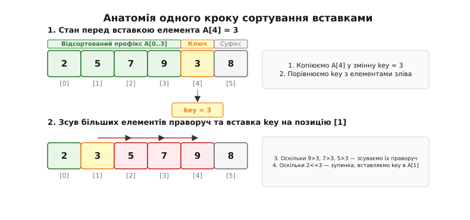
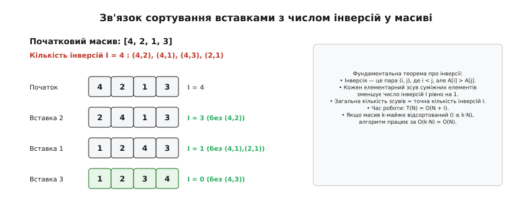
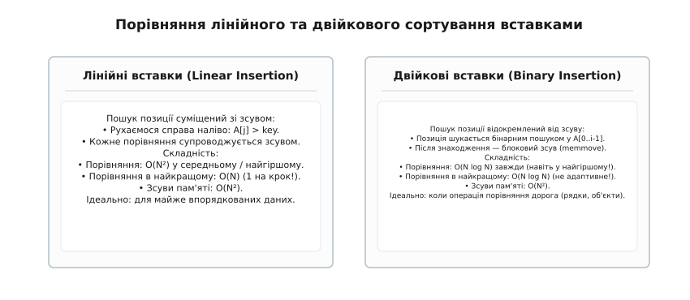
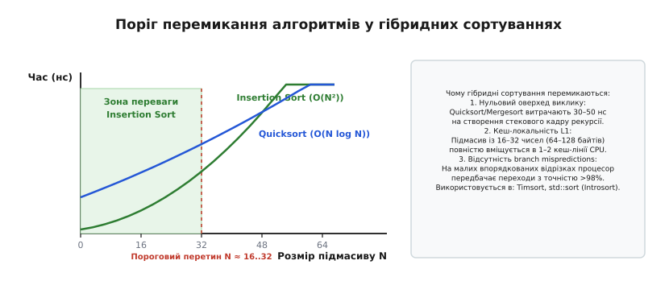

# Сортування вставками (Insertion Sort)

<preknowlist>
- [Масив і вектор](topic:algorithms/array) — організація послідовного блоку пам'яті та адресація за індексами.
- [Асимптотична складність](topic:algorithms/asymptotic-complexity) — поняття O-нотації, найкращий, середній та найгірший випадки.
- [Стійкість сортування](topic:algorithms/sorting-stability) — збереження взаємного порядку елементів з однаковими ключами.
- [Двійковий пошук](topic:algorithms/binary-search) — знаходження позиції елемента у впорядкованому масиві за O(log N).
- [Швидке сортування](topic:algorithms/quicksort) — розбиття масиву на підмасиви та рекурсивне сортування.
</preknowlist>

У високочастотній системі обробки біржових транзакцій або черзі завдань ядра операційної системи реального часу щосекунди надходить потік із десятків тисяч подій, згрупованих у невеликі пакети по 16–32 записи. У 99% випадків ці дані вже майже впорядковані за часовими мітками або містять лише кілька запізнілих пакетів через незначний мережевий джитер. Якщо для кожного такого мікропакета викликати універсальне [швидке сортування](topic:algorithms/quicksort) чи сортування злиттям зі складністю `O(N log N)`, система витрачатиме левову частку процесорного часу не на перестановку значень, а на службові накладні витрати: виділення стекових кадрів рекурсії, розрахунки опорних елементів і постійні промахи передбачення розгалужень (branch mispredictions).

На масивах малого розміру алгоритми з теоретично кращою асимптотикою виявляються у два-три рази повільнішими за найпростіший послідовний зсув даних у межах однієї кеш-лінії центрального процесора. Коли розмір вхідного масиву не перевищує 32 елементи, вирішальну роль відіграє не асимптотичний клас алгоритму при прямуванні `N` до нескінченності, а абсолютна константа накладних витрат процесорного конвеєра, просторова локальність даних та ступінь початкової впорядкованості послідовності.

Алгоритм, який розв'язує цю задачу з максимальною апаратною ефективністю, називається **сортуванням вставками** (англ. *Insertion Sort*). Він здійснює покрокову побудову відсортованої частини послідовності, по черзі виймаючи кожен наступний елемент і пересуваючи його на належне місце серед раніше впорядкованих значень.

## Анатомія механізму: динамічне розширення відсортованого префіксу

Головний принцип сортування вставками полягає у поділі вихідного масиву на дві суміжні функціональні зони, межа між якими поступово зсувається зліва направо:

1. **Відсортований префікс `A[0...i-1]`:** ліва частина масиву, елементи якої вже розташовані у строго неспадному порядку. На початку роботи алгоритму (при `i = 1`) префікс складається лише з одного першого елемента `A[0]`, який за визначенням є тривіально відсортованим.
2. **Невідсортований суфікс `A[i...N-1]`:** права частина масиву, елементи якої ще не були оброблені й можуть перебувати в довільному початковому стані.



*Анатомія одного кроку сортування вставками: вилучення поточного ключа в тимчасовий регістр, зсув більших елементів префікса праворуч та фіксація ключа у звільненій комірці.*

На кожному зовнішньому кроці `i` (де `i` послідовно змінюється від `1` до `N - 1`) виконується трикрокова послідовність дій:

1. **Вилучення ключового елемента (Key Extraction):** Значення `A[i]` копіюється в тимчасову змінну `key` (у машинному коді це значення завантажується безпосередньо в регістр процесора). Комірка `A[i]` стає логічно вільною.
2. **Пошук позиції та зсув більших значень (Shift Phase):** Алгоритм сканує відсортований префікс справа наліво, починаючи з індексу `j = i - 1`. Кожен елемент `A[j]`, значення якого є строго більшим за `key`, пересувається на одну позицію вправо в комірку `A[j + 1]`. Цей зсув звільняє місце ліворуч від переміщеного елемента.
3. **Фіксація ключа (Insertion):** Сканування зупиняється в момент, коли знайдено елемент `A[j] <= key`, або коли індекс `j` стає меншим за `0` (що означає, що `key` є меншим за всі елементи префіксу). Значення `key` записується у звільнену комірку `A[j + 1]`.

У результаті довжина відсортованого префіксу зростає на одиницю (`i -> i + 1`). Коли індекс `i` досягає значення `N`, весь масив перетворюється на єдиний відсортований префікс.

### Відмінність від сортування вибором та сортування бульбашкою

Хоча сортування вставками, сортування вибором ([Selection Sort](topic:algorithms/selection-sort)) та [сортування бульбашкою](topic:algorithms/bubble-sort) належать до квадратичного класу складності `O(N^2)`, внутрішня механіка переміщення даних між ними відрізняється докорінно:

- **Сортування вибором** переглядає *весь залишковий невідсортований суфікс*, щоб знайти глобальний мінімум, і робить рівно один дальній обмін `swap`. Воно завжди виконує фіксовану кількість порівнянь незалежно від впорядкованості масиву.
- **Сортування бульбашкою** багаторазово проходить масив від початку до кінця, піднімаючи найбільші елементи шляхом сотень суміжних обмінів, що супроводжується великою кількістю непотрібних операцій запису в пам'ять.
- **Сортування вставками** бере *перший ліпший черговий елемент* із суфіксу і шукає його правильне місце *всередині вже відсортованого префіксу*. Воно негайно зупиняє внутрішній цикл, щойно знайдено елемент, менший або рівний за ключ. Завдяки цьому алгоритм взагалі не виконує зайвих дій на вже впорядкованих даних.

## Покрокове трасування роботи алгоритму

Для детального розуміння простежимо виконання алгоритму на конкретному масиві з 8 цілих чисел: `[7, 3, 5, 8, 2, 9, 4, 1]`.

```
Початковий стан: [ 7 | 3, 5, 8, 2, 9, 4, 1 ]  (префікс: [7], суфікс: [3, 5, 8, 2, 9, 4, 1])
```

### Крок 1 (`i = 1`, `key = 3`):
- Префікс: `[7]`. Порівнюємо `A[0] = 7` із `key = 3`.
- Оскільки `7 > 3`, зсуваємо `7` на позицію `A[1]`: `[ 7, 7, 5, 8, 2, 9, 4, 1 ]`.
- Досягнуто ліву межу масиву (`j = -1`). Записуємо `key = 3` у комірку `A[0]`.
- Стан масиву: `[ 3, 7 | 5, 8, 2, 9, 4, 1 ]`.

### Крок 2 (`i = 2`, `key = 5`):
- Префікс: `[3, 7]`. Порівнюємо `A[1] = 7` із `key = 5`.
- Оскільки `7 > 5`, зсуваємо `7` на позицію `A[2]`: `[ 3, 7, 7, 8, 2, 9, 4, 1 ]`.
- Порівнюємо `A[0] = 3` із `key = 5`. Оскільки `3 <= 5`, внутрішній цикл негайно зупиняється.
- Записуємо `key = 5` у комірку `A[1]`.
- Стан масиву: `[ 3, 5, 7 | 8, 2, 9, 4, 1 ]`.

### Крок 3 (`i = 3`, `key = 8`):
- Префікс: `[3, 5, 7]`. Порівнюємо `A[2] = 7` із `key = 8`.
- Оскільки `7 <= 8`, зупинка на першому ж порівнянні! Жодного зсуву пам'яті не відбувається.
- Записуємо `key = 8` назад у комірку `A[3]`.
- Стан масиву: `[ 3, 5, 7, 8 | 2, 9, 4, 1 ]`.

### Крок 4 (`i = 4`, `key = 2`):
- Префікс: `[3, 5, 7, 8]`. Значення `key = 2` менше за всі елементи префіксу.
- Послідовно зсуваються `8 -> A[4]`, `7 -> A[3]`, `5 -> A[2]`, `3 -> A[1]`.
- Записуємо `key = 2` у позицію `A[0]`.
- Стан масиву: `[ 2, 3, 5, 7, 8 | 9, 4, 1 ]`.

### Крок 5 (`i = 5`, `key = 9`):
- Префікс: `[2, 3, 5, 7, 8]`. Порівнюємо `A[4] = 8` із `key = 9`. Оскільки `8 <= 9`, зупинка (0 зсувів).
- Стан масиву: `[ 2, 3, 5, 7, 8, 9 | 4, 1 ]`.

### Крок 6 (`i = 6`, `key = 4`):
- Префікс: `[2, 3, 5, 7, 8, 9]`. Зсуваються `9`, `8`, `7`, `5`. Зупинка на `3 <= 4`.
- Записуємо `key = 4` у комірку `A[2]`.
- Стан масиву: `[ 2, 3, 4, 5, 7, 8, 9 | 1 ]`.

### Крок 7 (`i = 7`, `key = 1`):
- Префікс: `[2, 3, 4, 5, 7, 8, 9]`. Значення `1` є абсолютним мінімумом. Усі 7 елементів зсуваються вправо.
- Записуємо `key = 1` у комірку `A[0]`.
- Фінальний стан: `[ 1, 2, 3, 4, 5, 7, 8, 9 ]`.

Масив повністю відсортовано за 7 зовнішніх ітерацій.

## Формальний інваріант циклу та доведення коректності

Для суворого доведення того, що алгоритм завжди видає коректний відсортований результат, сформулюємо **інваріант циклу** (Loop Invariant) за схемою індукції Флойда–Хоара.

**Твердження інваріанта:** На початку кожної ітерації зовнішнього циклу `for` для довільного індексу `i` (де `1 <= i <= N`):
1. Підмасив `A[0...i-1]` складається з тих самих елементів, які початково займали перші `i` комірок масиву (тобто є їхньою перестановкою).
2. Підмасив `A[0...i-1]` є повністю впорядкованим за неспападанням: `A[0] <= A[1] <= ... <= A[i-1]`.

Доведемо істинність цього твердження на трьох обов'язкових етапах:

1. **Ініціалізація (База індукції, `i = 1`):**
   Перед виконанням першого кроку зовнішнього циклу `i = 1`. Підмасив `A[0...0]` містить рівно один елемент. Будь-який одноелементний підмасив завжди тривіально впорядкований і складається з початкового елемента масиву на нульовій позиції. Інваріант істинний.
2. **Збереження (Індукційний крок, перехід від `i` до `i + 1`):**
   Припустимо, що на початку кроку `i` підмасив `A[0...i-1]` був впорядкований. Тіло циклу вилучає `key = A[i]`. Внутрішній цикл зсуває праворуч усі елементи префіксу, які строго перевищують `key`, звільняючи точну позицію `k` (де `0 <= k <= i`), для якої одночасно виконується:
   - `A[m] <= key` для всіх `0 <= m < k`;
   - `key < A[m]` для всіх `k < m <= i`.
   Запис `key` у комірку `A[k]` відновлює цілісність масиву, причому підмасив `A[0...i]` містить усі вихідні елементи плюс новий елемент `key` і задовольняє умову `A[0] <= A[1] <= ... <= A[i]`. Інваріант зберігається для наступної ітерації `i + 1`.
3. **Завершення роботи (Фінал, `i = N`):**
   Зовнішній цикл завершується, коли лічильник `i` досягає значення `N`. Підставивши `i = N` в інваріант, отримуємо, що підмасив `A[0...N-1]` (тобто весь масив цілком) складається з усіх початкових елементів і є повністю відсортованим: `A[0] <= A[1] <= ... <= A[N-1]`.

Алгоритм гарантовано зупиняється за скінченну кількість кроків і продукує математично строгий відсортований результат. Повне комбінаторне виведення властивостей перестановки та розподілу інверсій наведено у вставці [Математичний аналіз інверсій та складності сортування вставками](topic:algorithms/insertion-sort/math-inversions.md).

## Аналіз складності: найкращий, найгірший та середній випадки

Часова складність сортування вставками визначається сумарною кількістю операцій порівняння та фізичних зсувів комірок пам'яті.

### 1. Найкращий випадок (Best Case) — `O(N)`
Найкращий випадок виникає, коли вхідний масив **вже повністю відсортований** за зростанням (наприклад, `[1, 2, 3, 4, 5]`).

На кожній ітерації `i` елемент `A[i-1]` одразу виявляється меншим або рівним за `key = A[i]`. Внутрішній цикл виконує рівно одне порівняння `A[i-1] <= key` і негайно зупиняється, роблячи `0` зсувів даних.

Загальна кількість порівнянь для масиву довжини `N`:

```
C_best
= ∑ 1                      [сума 1 порівняння для i від 1 до N - 1]
= N - 1                    [строго лінійна кількість перевірок]
```

Загальна кількість переміщень пам'яті: `0` зсувів (плюс `N - 1` копіювань ключа в регістр і назад).
Часова складність у найкращому випадку становить **строго `O(N)`**.

### 2. Найгірший випадок (Worst Case) — `O(N^2)`
Найгірший випадок виникає, коли масив **відсортований у строго зворотному порядку** (наприклад, `[5, 4, 3, 2, 1]`).

На кожній ітерації `i` значення `key = A[i]` є меншим за всі `i` елементів попереднього префіксу. Внутрішній цикл змушений виконати `i` порівнянь і `i` зсувів елементів праворуч, доки не дійде до лівого краю масиву.

Загальна кількість порівнянь та зсувів обчислюється як сума арифметичної прогресії:

```
C_worst
= ∑ i                      [сума для i від 1 до N - 1]
= 1 + 2 + 3 + ... + (N - 1) [розкриття суми арифметичного ряду]
= N · (N - 1) / 2          [формула суми перших N-1 чисел]
= (N² - N) / 2 = O(N²)     [квадратична часова складність]
```

На масиві з `10 000` елементів у зворотному порядку алгоритм виконає близько `50 000 000` порівнянь і стільки ж операцій зсуву комірок.

### 3. Середній випадок (Average Case) — `O(N^2)`
Для випадкового масиву, де всі `N!` перестановок елементів є рівноймовірними, новий елемент `key` із рівною ймовірністю може потрапити в будь-яку з `i + 1` позицій префіксу.

У середньому на кроці `i` алгоритм переглядає половину елементів префіксу (`i / 2` порівнянь і `i / 2` зсувів).

Сумарна очікувана кількість операцій:

```
C_avg
= ∑ (i / 2)                [сума для i від 1 до N - 1]
= (1 / 2) · ∑ i            [винесення константи 1/2 за дужки]
= (1 / 2) · (N · (N - 1) / 2) [підстановка формули суми ряду]
= N · (N - 1) / 4 = O(N²)  [середня квадратична складність]
```

Хоча середня складність залишається квадратичною `O(N^2)`, константа при старшому члені (`1/4`) є вдвічі меншою, ніж у сортування вибором (`1/2`) і значно меншою, ніж у сортування бульбашкою.

### Поведінка на масивах із дублікатів (All-Equal Keys)

Важливою перевагою сортування вставками над наївними версіями Quicksort є поведінка на масивах, що складаються з однакових елементів (наприклад, `[4, 4, 4, 4, 4]`).

Оскільки умова `A[j - 1] > key` повертає `false` на першому ж кроці, внутрішній цикл виконує рівно 1 порівняння і 0 зсувів для кожного елемента. Сортування вставками обробляє масив із однакових значень за **строго лінійний час `O(N)`**, тоді як Quicksort зі схемою Ломуто без тристороннього розбиття вироджується на дублікатах у квадратичний час `O(N^2)`.

## Адаптивність та фундаментальний зв'язок із кількістю інверсій

Головною якісною перевагою сортування вставками над іншими квадратичними алгоритмами є його **адаптивність** (Adaptivity) — здатність автоматично прискорюватися пропорційно до ступеня початкової впорядкованості вхідних даних.

Щоб математично виміряти цей ступінь, введемо поняття інверсії.

**Означення інверсії:** Інверсією в масиві `A` називається пара індексів `(i, j)`, для якої одночасно виконується `i < j`, але `A[i] > A[j]`. Кількість інверсій `I` є строгою мірою невпорядкованості послідовності.



*Зв'язок сортування вставками з числом інверсій: кожен елементарний зсув суміжних елементів усуває рівно одну інверсію, забезпечуючи час роботи T(N) = O(N + I).*

**Фундаментальна теорема:** Кожен елементарний зсув суміжного елемента вправо у внутрішньому циклі сортування вставками зменшує загальну кількість інверсій у масиві рівно на одиницю і не змінює статус взаємного розташування жодної іншої пари елементів.

Звідси випливає фундаментальний закон: **загальна кількість зсувів елементів, виконаних алгоритмом за весь час роботи, строго дорівнює точній кількості інверсій `I` у вихідному масиві**.

Часова складність алгоритму виражається формулою:

```
T(N) = O(N + I)
```

де доданок `N` відповідає за прохід зовнішнього циклу, а доданок `I` — за всі виконані зсуви.

### k-майже відсортовані масиви

У практичній інженерії часто зустрічаються масиви, де кожен елемент зміщений від своєї остаточної позиції у відсортованому стані не більше ніж на `k` позицій (так звані `k`-майже відсортовані масиви).

Для такого масиву кожен елемент може утворювати не більше `k` інверсій, а сумарна кількість інверсій обмежена зверху величиною `I <= k · N`.

Підставивши це обмеження у формулу складності, отримуємо:

```
T(N) = O(N + k · N) = O(k · N)
```

Якщо `k` є фіксованою невеликою константою (наприклад, `k = 2` або `k = 5`), сортування вставками виконує повне впорядкування за **строго лінійний час `O(N)`**, значно випереджаючи навіть Quicksort (`O(N log N)`).

Типові сценарії виникнення `k`-майже відсортованих даних:
- **Мережеві буфери пакетів:** Потокові пакети аудіо та відео, що надходять через протокол UDP/RTP, отримують часові мітки. Через невеликий джитер маршрутизації пакети прибувають із мінімальним переставленням (де `k <= 3`).
- **Транзакційні журнали (Write-Ahead Logs, WAL):** Записи подій у розподілених базах даних генеруються паралельними потоками з монотонно зростаючими мітками часу.
- **Фізичні симуляції (N-body / Particle Systems):** При моделюванні руху частинок із малим кроком інтегрування за часом `dt` координати тіл змінюються неперервно, тому порядок частинок уздовж просторової осі змінюється лише між найближчими сусідами.

> 🔧 **Навіщо це.** Сортування вставками є безальтернативним лідером для задач інкрементального оновлення списків: наприклад, коли до вже відсортованого списку користувачів додається один новий клієнт, або коли в системі моніторингу супутників періодично перераховується черга зближення орбіт. Замість повного пересортування за `O(N log N)` сортування вставками інтегрує нові елементи за один швидкий прохід за `O(N)`.

## Стійкість (Stability) сортування: анатомія умови порівняння

Сортування називається **стійким** (Stable), якщо воно гарантовано зберігає початковий відносний порядок розташування елементів із однаковими ключами.

Розглянемо практичний приклад: у базі даних співробітників компанії записи спочатку впорядковано за алфавітом прізвищ. Потім ми викликаємо сортування за стажем роботи. Якщо алгоритм стійкий, співробітники з однаковим стажем залишаться впорядкованими за прізвищем. Якщо алгоритм нестійкий, їхні прізвища перемішаються у хаотичному порядку.

Сортування вставками є **природно стійким алгоритмом**. Стійкість забезпечується строгим знаком порівняння у внутрішньому циклі:

:::tabs
```c
/* Строгий знак > забезпечує стійкість дублікатів */
while (j > 0 && arr[j - 1] > key) {
    arr[j] = arr[j - 1];
    --j;
}
```
```cpp
// Ідіоматична перевірка в C++: comp(key, data[j - 1]) еквівалентна data[j - 1] > key
while (j > 0 && comp(key, data[j - 1])) {
    data[j] = std::move(data[j - 1]);
    --j;
}
```
:::

Коли алгоритм зустрічає в префіксі елемент `arr[j - 1]`, значення якого точно дорівнює `key`, умова `arr[j - 1] > key` повертає `false`. Внутрішній цикл негайно зупиняється, і новий дублікат `key` сідає на позицію `A[j]` — тобто **строго праворуч** від раніше вставленого рівного елемента.

> ⚠️ **Поширена помилка, що руйнує стійкість:** Якщо програміст помилково запише умову як `arr[j - 1] >= key`, алгоритм почне зсувати праворуч навіть рівні елементи. У результаті дублікат із більшим початковим індексом буде вставлений *ліворуч* від попереднього, і відносний порядок однакових ключів зміниться на протилежний. Стійкість буде повністю знищена, а кількість непотрібних зсувів пам'яті зросте.

## Модифікація двійковими вставками (Binary Insertion Sort)

У класичному сортуванні вставками пошук позиції для `key` та фізичний зсув елементів об'єднані в один лінійний прохід. Оскільки префікс `A[0...i-1]` уже є повністю відсортованим, правильну точку вставки можна знайти значно швидше — за допомогою [двійкового пошуку](topic:algorithms/binary-search).



*Порівняння лінійного та двійкового сортування вставками: поєднання пошуку зі зсувом проти відокремленого логарифмічного пошуку з блоковим копіюванням.*

Двійковий пошук локалізує позицію вставки в префіксі розміром `i` за `⌈log₂ (i + 1)⌉` порівнянь. Загальна кількість порівнянь для всього масиву скорочується з `O(N^2)` до теоретико-інформаційного мінімуму:

```
C_total
= ∑ ⌈log₂ (i + 1)⌉         [сума порівнянь для i від 1 до N - 1]
= ⌈log₂ (N!)⌉ ≈ N log₂ N - 1.44 · N = O(N log N)
```

Проте виникає алгоритмічний парадокс: **хоча кількість порівнянь зменшується до `O(N log N)`, загальна часова складність Binary Insertion Sort усе одно залишається квадратичною `O(N^2)`**.

Причина полягає в тому, що після знаходження індексу вставки `pos` елементи підмасиву `A[pos...i-1]` все одно необхідно фізично зсунути вправо на одну позицію. Кількість операцій переміщення пам'яті визначається кількістю інверсій і в найгіршому випадку дорівнює `N(N - 1) / 2`.

### Коли двійкові вставки дають реальний виграш

Binary Insertion Sort стає значно вигіднішим за класичний варіант у сценаріях, де **операція порівняння є обчислювально дорогою, а операція переміщення байтів у пам'яті — надзвичайно дешевою**:

1. **Порівняння важких об'єктів:** Довгі текстові рядки, багатовимірні матриці, криптографічні ключі або об'єкти з користувацькими предикатами.
2. **Апаратна оптимізація зсуву:** Замість покрокового циклу зсув відрізка масиву виконується однією низькорівневою апаратною інструкцією `memmove` (яка використовує 256-бітні векторні регістри AVX2 або команду `rep movsb`), копіюючи по 32 байти за такт процесора.

Саме двійкове сортування вставками з блоковим зсувом використовується у рушії Timsort для добудови коротких серій даних до розміру `minrun`.

## Сортування зв'язних списків вставками

Коли структура даних організована не як суцільний масив у пам'яті, а як однозв'язний або двозв'язний список ([Linked List](topic:algorithms/linked-list)), сортування вставками набуває унікальних характеристик:

- **Нульове копіювання пам'яті:** Щоб вставити вузол списку в нову позицію, не потрібно зсувати сусідні елементи. Достатньо змінити два адресні покажчики `prev->next = node` та `node->next = next_node`. Фізична вставка виконується за строго константний час `O(1)`.
- **Втрата двійкового пошуку:** Оскільки зв'язний список не підтримує довільного доступу за індексом за `O(1)` (random access), реалізувати двійковий пошук неможливо. Пошук позиції вставки завжди залишається лінійним скануванням за `O(N)`.

Сортування зв'язного списку вставками є вкрай ефективним для невеликих списків у ядрі операційної системи (наприклад, списки таймерів або дескрипторів відкритих файлів), оскільки воно не вимагає виділення жодного байта додаткової пам'яті в купі.

Повний вихідний код реалізацій класичного, двійкового, спискового сортування та варіанта з вартовим на мовах C та C++ розібрано у вставці [Практична реалізація сортування вставками та двійкових модифікацій](topic:algorithms/insertion-sort/proj-insertion-variants.md).

## Інженерна оптимізація: сортування з вартовим (Sentinel)

У внутрішньому циклі класичного сортування вставками процесор на кожній ітерації перевіряє дві окремі умови:
1. `j > 0` (перевірка виходу за ліву межу масиву);
2. `arr[j - 1] > key` (порівняння значень).

Це створює два умовні переходи в машинному коді. На сучасних конвеєрних процесорах непередбачені розгалуження призводять до простою конвеєра інструкцій.

**Механізм вартового (Sentinel):** Перед початком основного сортування алгоритм робить один швидкий лінійний прохід по масиву, знаходить абсолютний мінімальний елемент і міняє його місцями з найпершим елементом `arr[0]`.

Після цього елемент `arr[0]` стає непереборним бар'єром (вартовим): він гарантовано менший або рівний за будь-який можливий `key` у масиві. Внутрішній цикл тепер ніколи не зможе вийти за межі індексу `0`, і перевірку `j > 0` можна повністю видалити з коду:

:::tabs
```c
/* Внутрішній цикл без перевірки лівої межі */
while (arr[j - 1] > key) {
    arr[j] = arr[j - 1];
    --j;
}
```
```cpp
// Внутрішній цикл C++ без перевірки j > 0
while (comp(key, data[j - 1])) {
    data[j] = std::move(data[j - 1]);
    --j;
}
```
:::

Видалення однієї умови скорочує кількість асемблерних інструкцій у гарячому циклі на 30–40% і повністю усуває ймовірність помилкового передбачення переходу на виході з лівого краю масиву.

## Узагальнення до сортування Шелла (Shellsort)

Сортування вставками має очевидне обмеження: якщо найменший елемент спочатку розташований у самому кінці масиву на позиції `N - 1`, йому доведеться зробити `N - 1` поодиноких суміжних кроків, щоб дістатися початку.

У 1959 році Дональд Шелл запропонував проривну ідею: виконувати сортування вставками не лише між сусідніми елементами, а між елементами, що розташовані на відстані кроку `h` (так зване `h`-сортування). Поступово зменшуючи крок `h` (наприклад, за послідовністю Седжвіка або Кнута `h = 3h + 1`), алгоритм спочатку робить «широкі стрибки», переміщуючи елементи на великі дистанції за одну операцію, а на фінальному кроці при `h = 1` викликає звичайне сортування вставками на вже майже впорядкованому масиві. Це дозволяє подолати квадратичний бар'єр і досягти складності `O(N^(4/3))` або `O(N log^2 N)`.

## Чому Insertion Sort незамінний у реальному світі: гібридні алгоритми

У сучасній практиці розробки високопродуктивного програмного забезпечення сортування вставками практично ніколи не застосовується для сортування мільйонних масивів самостійно. Натомість воно є критично важливим фундаментом усіх сучасних **гібридних алгоритмів сортування** (Hybrid Sorting Algorithms).



*Поріг перемикання в гібридних сортуваннях Timsort та Introsort: при малих N (до 16–32 елементів) сортування вставками випереджає алгоритми O(N log N) через нульовий оверхед та локальність L1 кешу.*

Розглянемо, де саме і чому використовується сортування вставками:

1. **Introsort (`std::sort` у C++ STL):** Класична реалізація `std::sort` у бібліотеках GNU libstdc++, LLVM libc++ та Microsoft STL запускає Quicksort, але щойно розмір підмасиву в рекурсивній гілці стає меншим або рівним `16` (або `32`), рекурсія негайно зупиняється. Усі малі підмасиви досортовуються фінальним проходом сортування вставками.
2. **Timsort (стандарт у Python, Java, Android):** Timsort розбиває вхідні дані на природні монотонні блоки `minrun` (розміром від 32 до 64 елементів), впорядковує кожен блок за допомогою Binary Insertion Sort, після чого зливає їх модифікованим сортуванням злиттям.
3. **pdqsort (Pattern-Defeating Quicksort у Rust `slice::sort_unstable`):** Використовує сортування вставками з вартовим для всіх блоків розміром `N <= 24`.

### Фізичні причини непереможності Insertion Sort на малих розмірах

Чому на відрізках `N <= 32` сортування вставками завжди перемагає Quicksort та Mergesort?

1. **Нульові накладні витрати (Zero Function Call Overhead):** Quicksort та Mergesort вимагають створення стекових кадрів рекурсії, розрахунку медіан, збереження регістрів та перевірок умов зупинки. На масиві з 16 елементів накладні витрати на саму рекурсію забирають 60–70% усього часу виконання. Сортування вставками виконується простим плоским циклом без жодного виклику функцій.
2. **Ідеальна просторова локальність та кеш L1:** Масив із 16 32-бітних чисел займає рівно `64 байти` — це розмір однієї кеш-лінії процесора (L1 Data Cache Line). Після першого звернення вся лінія завантажується в надшвидкий кеш L1 (доступ за 4 такти процесора). Жодного звернення до повільної оперативної пам'яті DRAM (200 тактів) не відбувається.
3. **Ефективність буфера запису (Store Buffer & Write Combining):** Коли алгоритм виконує зсув `arr[j] = arr[j - 1]`, операції запису здійснюються за послідовними суміжними адресами пам'яті. Контролер кешу ядра процесора автоматично коалесціює (об'єднує) ці записи в буфері запису (Store Queue), не викликаючи конфліктів когерентності та блокувань конвеєра.
4. **Передбачення розгалужень (Branch Prediction):** На малих або частково впорядкованих блоках апаратний блок передбачення переходів CPU (Branch Target Buffer) досягає точності понад `98%`, завдяки чому конвеєр інструкцій працює на повній швидкості без зупинок (Pipeline Stalls).

## Поведінка на специфічних профілях даних

Окрім класичних випадкових та майже відсортованих послідовностей, продуктивність алгоритму демонструє високу чутливість до форми розподілу даних:

- **Пилоподібні послідовності (Sawtooth distribution):** Якщо масив складається з кількох монотонно зростаючих відрізків (наприклад, конкатенація результатів періодичних вимірювань), сортування вставками швидко інтегрує кожен новий відрізок, оскільки всередині кожної локальної серії кількість інверсій дорівнює нулю.
- **Органні труби (Organ-pipe profile):** Послідовності, де значення спочатку зростають до максимуму в центрі, а потім спадають до кінця (наприклад, `[1, 3, 5, 6, 4, 2]`), містять рівно половину максимальної кількості інверсій. Insertion sort ефективно опрацьовує ліву половину за лінійний час, а на правій виконує регулярні зсуви без деградації кешу.
- **Окремі викиди (Outliers):** Якщо у відсортований масив з 1 000 000 чисел випадково потрапляє одне мале число в самий кінець, сортування вставками перемістить цей єдиний елемент на початок за рівно 1 000 000 зсувів, що займе менше 1 мілісекунди. Натомість для неадаптивного сортування купою чи злиттям знадобиться повний цикл із 20 000 000 операцій.

Детальний опис історичного шляху алгоритму від перших лекцій Джона Моклі для комп'ютера EDVAC 1946 року до робіт Дональда Кнута наведено у вставці [Історія виникнення сортування вставками та перфокарткові витоки](topic:algorithms/insertion-sort/hist-insertion-sort.md).

Повну специфікацію програмних інтерфейсів, концептів C++20, контрактів безпеки та вимог для вбудованих систем викладено у вставці [Інтерфейсна специфікація та контракт сортування вставками](topic:algorithms/insertion-sort/api-insertion-sort.md).

## Зведена синтетична характеристика

Для цілісного розуміння місця сортування вставками в ієрархії алгоритмів впорядкування наведемо порівняльну таблицю ключових характеристик:

| Алгоритм сортування | Найкращий час | Середній час | Найгірший час | Пам'ять | Стійкість | Адаптивність до інверсій | Оптимальний діапазон |
| :--- | :--- | :--- | :--- | :--- | :--- | :--- | :--- |
| **Insertion Sort** | **`O(N)`** | `O(N²)` | `O(N²)` | **`O(1)`** | **Так** | **Так (`T = O(N + I)`)** | **`N <= 32`, майже відсортовані** |
| **Selection Sort** | `O(N²)` | `O(N²)` | `O(N²)` | **`O(1)`** | Ні | Ні (завжди `N²/2` порівнянь)| Дорогий запис у пам'ять (Flash/EEPROM) |
| **Bubble Sort** | `O(N)` (з прапорцем)| `O(N²)` | `O(N²)` | **`O(1)`** | **Так** | Частково | Навчальні цілі (не для виробництва) |
| **Quicksort** | `O(N log N)` | `O(N log N)` | `O(N²)` | `O(log N)` стек| Ні | Ні | Великі випадкові масиви `N > 64` |
| **Mergesort** | `O(N log N)` | `O(N log N)` | `O(N log N)` | `O(N)` буфер | **Так** | Ні | Стабільне сортування, зв'язні списки |
| **Heapsort** | `O(N log N)` | `O(N log N)` | `O(N log N)` | **`O(1)`** | Ні | Ні | Системи жорсткого реального часу |
| **Timsort** | **`O(N)`** | `O(N log N)` | `O(N log N)` | `O(N)` | **Так** | **Так (знаходить runs)** | Загальні дані у високорівневих мовах |

Сортування вставками — це зразок алгоритмічного мінімалізму, де простота структури безпосередньо транслюється у максимальну фізичну продуктивність апаратного забезпечення на малих обсягах даних.
