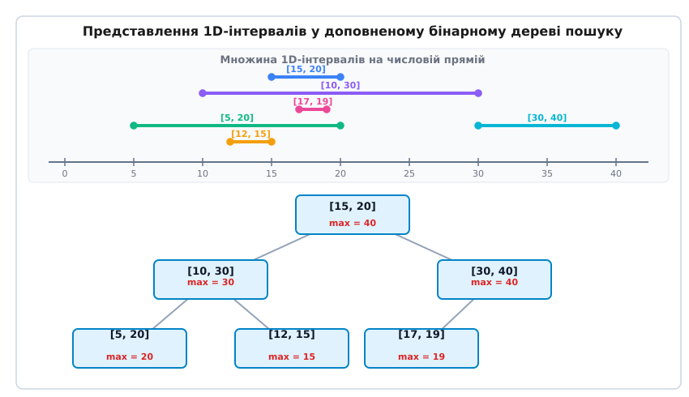
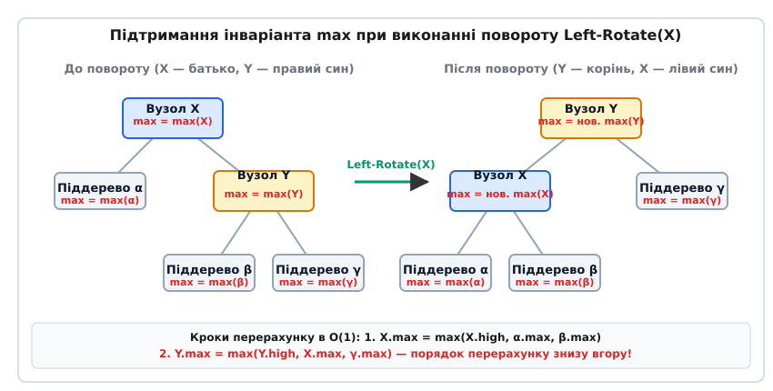
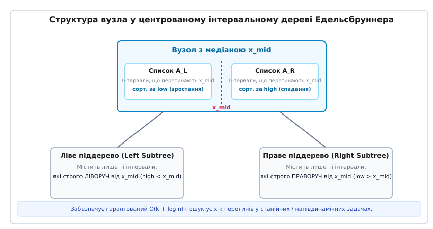

# Інтервальне дерево (Interval Tree)

<preknowlist>
- [Бінарне дерево пошуку](topic:algorithms/binary-search-tree) — порядок розташування ключів та базові операції пошуку.
- [Червоно-чорне дерево](topic:algorithms/red-black-tree) — механізм самобалансування, колірні інваріанти та повороти.
</preknowlist>

Класичні структури даних (бінарні дерева пошуку, AVL-дерева, червоно-чорні дерева, хеш-таблиці) розроблялися для ефективної обробки скалярних ключів — поодиноких чисел або рядків. Вони дозволяють за логарифмічний час `O(log n)` перевірити наявність точного значення чи вибрати ключі у діапазоні `[x, y]`. Проте у сучасному системному програмуванні, геометричних обчисленнях, системах автоматизованого проектування мікросхем (CAD/VLSI), підсистемах віртуальної пам'яті ядер операційних систем та базах даних фундаментальною одиницею інформації є не просто точка, а **протяжний інтервал** (від англ. *interval* — проміжок та *tree* — дерево) — неперервний відрізок на числовій осі, заданий парою координат `[low, high]`.

Коли виникає потреба знайти всі події, що відбувалися протягом певного часового вікна, визначити область пам'яті, якій належить адреса сторінкового збою, або виявити геометричні перетини провідників на друкованій платі, звичайний скалярний пошук виявляється безсилим. Зберігання інтервалів у масиві або зв'язаному списку змушує виконувати повний перебір усіх `n` елементів, що вимагає лінійного часу `O(n)` на кожен запит. Якщо множина містить мільйони елементів, парна перевірка перетинів розганяє складність до квадратичного часу `O(n²)`, що робить обробку даних неприпустимо повільною.

З іншого боку, така структура як відрізкове дерево (Segment Tree) вимагає попереднього відома всіх кінцевих точок і оперує у статичному або дискретному домені. Якщо ж інтервали додаються та вилучаються динамічно у реальному часі із довільними дійсними або 64-бітними адресовими координатами, потрібна гнучка самобалансована структура.

Інтервальне дерево (Interval Tree) розв'язує цю задачу шляхом **аугментації** (розширення) балансованого бінарного дерева пошуку. Воно зберігає динамічну множину інтервалів, забезпечує вставку та вилучення за логарифмічний час `O(log n)` і дозволяє виконувати пошук перетинів із запитовим інтервалом за час `O(log n)`.

Детальний процес історичного створення цієї структури — від завдань верифікації топології мікросхем у лабораторіях Xerox PARC до фундаментальних праць Едварда МакКрейта та Герберта Едельсбруннера — висвітлено у вставці [Історія виникнення та еволюція інтервальних дерев](topic:algorithms/interval-tree/hist-interval-tree.md).

---

## Першопричина: Геометричний пошук у 1D-просторі

Щоб зрозуміти, чому звичайне бінарне дерево пошуку не здатне швидко знаходити перетини інтервалів, розглянемо алгебраїчну природу відношення перетину у одновимірному просторі.

Замкнений одновимірний інтервал `i` описується парою дійсних чисел `[l[i], r[i]]`, де `l[i]` відповідає лівій (нижній) межі, а `r[i]` — правій (верхній) межі, причому завжди виконується математичний інваріант:

```
l[i] ≤ r[i]
```

Два інтервали `i = [l[i], r[i]]` та `q = [l[q], r[q]]` перетинаються (`Overlap(i, q)`), якщо вони мають принаймні одну спільну точку на числовій прямій. У термінах кінцевих координат це відношення описується кон'юнкцією двох нерівностей:

```
Overlap(i, q) = (l[i] ≤ r[q]) ∧ (r[i] ≥ l[q])
```

Два інтервали **не перетинаються** (`¬Overlap(i, q)`), якщо і тільки якщо один із них розташований строго ліворуч від іншого:

```
r[i] < l[q]   (інтервал i знаходиться строго ліворуч від q)
l[i] > r[q]   (інтервал i знаходиться строго праворуч від q)
```

У звичайному бінарному дереві пошуку вузли впорядковуються за єдиним скалярним ключем — наприклад, за лівою межею `l[i]`. Це гарантує стандартний інваріант BST: для будь-якого вузла `x` усі елементи його лівого піддерева `Subtree(left[x])` мають ліві межі `l ≤ l[x]`, а елементи правого піддерева `Subtree(right[x])` — ліві межі `l ≥ l[x]`.

Проте сам по собі порядок за `l[i]` не дає можливості прийняти однозначне рішення про те, у яке піддерево згортати при пошуку перетину. Інтервал `i` із дуже малою лівою межею `l[i]` може мати величезну протяжність і досягати далеко праворуч, перетинаючи запит `q`. Натомість сусідній інтервал із такою ж лівою межею може бути коротким і закінчуватися задовго до початку `q`.

Звичайне дерево пошуку змушене було б рекурсивно перевіряти обидві гілки (і ліву, і праву) у кожному вузлі. У найгіршому випадку це призводить до повного обходу всіх `n` вершин за лінійний час `O(n)`.

Для того щоб алгоритм міг принципово відсікати безперспективні гілки піддерев, у кожен вузол дерева необхідно додати додатковий геометричний інваріант.

---

## Анатомія вузла та ключовий інваріант `max`

Інтервальне дерево конструюється шляхом аугментації базового самобалансованого бінарного дерева пошуку (найчастіше червоно-чорного дерева).

Кожен вузол `x` інтервального дерева містить наступний набір полів:
1. **Інтервальний об'єкт:** `int[x] = [l[x], r[x]]`.
2. **Ключ впорядкування BST:** ліву межу `l[x]` (за замовчуванням вузли впорядковані за зростанням `l[x]`).
3. **Деревні вказівники:** `left[x]`, `right[x]` та `p[x]` (батьківський вузол).
4. **Атрибут аугментації `max`:** числовий атрибут `max[x]`, який за означенням дорівнює точній верхній межі (супремуму) правих кінців серед усіх інтервалів, збережених у піддереві з коренем у `x`.

Математично інваріант `max[x]` формулюється наступним чином:

```
max[x] = max { r[y] | y ∈ Subtree(x) }
```

Оскільки піддерево `Subtree(x)` складається з самого вузла `x`, його лівого піддерева `Subtree(left[x])` та правого піддерева `Subtree(right[x])`, атрибут `max[x]` виражається за допомогою локальної рекурентної формули:

```
max[x] = max( r[x], max[left[x]], max[right[x]] )
```

де за домовленістю для порожнього фіктивного листка `NIL` покладається значення `max[NIL] = -∞`.


*Верхня частина: множина 1D-інтервалів на числовій осі. Нижня частина: доповнене бінарне дерево пошуку з ключем low та розрахованим атрибутом max у кожному вузлі.*

Значення `max[x]` визначає максимальне праве досягнення всього піддерева. Якщо виявляється, що `max[left[x]] < l[q]`, це дає строгу математичну гарантію: **жоден** інтервал у лівому піддереві вузла `x` не досягає початку запиту `l[q]`, а отже, існування перетину у лівому піддереві є повністю неможливим.

---

## Алгоритм пошуку перетину (`Interval_Search`)

Розглянемо алгоритм пошуку **одного** (довільного) інтервалу у дереві `T`, який перетинається із запитом `q = [l[q], r[q]]`.

Пошук починається від кореня дерева `root[T]` і виконує ітеративний спуск за таким правилом:

```
Interval_Search(T, q):
    x = root[T]
    while x ≠ NIL and not Overlap(int[x], q):
        if left[x] ≠ NIL and max[left[x]] ≥ l[q]:
            x = left[x]
        else:
            x = right[x]
    return x
```

### Покрокова розшифровка логіки прийняття рішень

На кожному кроці циклу `while`:
1. Перевіряється, чи перетинає поточний інтервал `int[x]` запит `q`. Якщо `Overlap(int[x], q) == true`, пошук негайно зупиняється і повертає вузол `x`.
2. Якщо перетину немає, алгоритм аналізує лівого сина `left[x]`:
   - Якщо ліве піддерево існує (`left[x] ≠ NIL`) і його максимальна права межа досягає лівого краю запиту (`max[left[x]] ≥ l[q]`), алгоритм **гарантовано переходить у ліве піддерево** (`x = left[x]`).
   - В іншому випадку алгоритм **переходить у праве піддерево** (`x = right[x]`).

![Покрокова трасування пошуку перетину для Q = [21, 23]](/book/algorithms/data-structures/interval-tree/img/interval-search-trace.svg)
*Приклад трасування пошуку для Q = [21, 23]: алгоритм перевіряє корінь [15, 20], бачить max лівого сина (30) ≥ 21 і повертає ліворуч до [10, 30], де знаходить перетин.*

Чому якщо `max[left[x]] ≥ l[q]`, ми повертаємо ліворуч і не перевіряємо праве піддерево? Постійний вибір лівої гілки є математично доведеним і безпечним.

---

## Теорема коректності: Чому однопрохідний пошук є достатнім

Головний теоретичний результат для доповненого інтервального дерева формулюється у вигляді фундаментальної теореми про коректність однопрохідного пошуку.

### Формулювання теореми

**Теорема.** *Для довільного інтервалу запиту `q` процедура `Interval_Search(T, q)` повертає вузол `x`, що перетинає `q`, або повертає `NIL`, якщо у дереві `T` не існує жодного інтервалу, який би перетинав `q`.*

### Інтуїтивне та формальне доведення

Для доведення розглядаються два можливі випадки при виборі напрямку у вузлі `x`:

#### Case 1: Перехід у ліве піддерево (`max[left[x]] ≥ l[q]`)

Нехай алгоритм вирішив повернути ліворуч. Потрібно довести: якщо в усьому піддереві `Subtree(x)` взагалі існує бодай один інтервал, що перетинає `q`, то принаймні один такий інтервал **обов'язково існує у лівому піддереві** `Subtree(left[x])`.

1. За означенням `max`, у лівому піддереві існує якийсь конкретний вузол `y ∈ Subtree(left[x])`, чия права межа дорівнює максимуму цього піддерева:
   ```
   r[y] = max[left[x]] ≥ l[q]
   ```
2. Оскільки дерево впорядковане за лівими межами (`l`), а вузол `y` лежить у лівому піддереві від `x`, його ліва межа не перевищує ліву межу `x`:
   ```
   l[y] ≤ l[x]
   ```
3. Оскільки поточний інтервал `int[x]` не перетинає `q`, але знаходиться зліва або справа від нього:
   - Якби `l[x] > r[q]`, то оскільки `l[y] ≤ l[x]`, для `y` виконувалося б `l[y] ≤ r[q]`.
   - Якби `l[x] ≤ r[q]`, то тим більше `l[y] ≤ r[q]`.
4. Зіставляючи `r[y] ≥ l[q]` та `l[y] ≤ r[q]`, отримуємо за означенням:
   ```
   (l[y] ≤ r[q]) ∧ (r[y] ≥ l[q])   ⇒   Overlap(int[y], q) = true
   ```

Отже, вузол `y` у лівому піддереві гарантовано перетинає `q`. Навіть якщо у правому піддереві теж є збіги, вибір лівої гілки є математично безпечним: ми ніколи не опинимося у безвихідному куті.

#### Case 2: Перехід у праве піддерево (`max[left[x]] < l[q]`)

Нехай алгоритм вирішив повернути праворуч. Потрібно довести: у лівому піддереві **немає жодного** інтервалу, що перетинає `q`.

1. За означенням `max`, для будь-якого вузла `z ∈ Subtree(left[x])` його права межа обмежена:
   ```
   r[z] ≤ max[left[x]] < l[q]   ⇒   r[z] < l[q]
   ```
2. Якщо права межа `r[z]` менша за початок запиту `l[q]`, інтервал `z` лежить строго ліворуч від `q` і перетинатися з ним не може.

Отже, у лівому піддереві перетини відсутні, і перехід у праве піддерево є єдино правильним рішенням.

Повне доведення з алгебраїчними інваріантами та оцінкою крайових випадків наведено у вставці [Математичне доведення коректності інтервального дерева](topic:algorithms/interval-tree/math-interval-correctness.md).

---

## Динамічні операції: Вставка, вилучення та підтримання `max`

Модифікація доповненого дерева (вставка нового інтервалу або вилучення існуючого) складається з двох етапів:
1. Стандартна операція бінарного дерева пошуку (BST insert / delete) з подальшим коригуванням інваріантів балансування (наприклад, перефарбування та повороти червоно-чорного дерева).
2. Оновлення атрибута `max` у вузлах, топологія або вміст яких змінилися.

### Оновлення `max` при поворотах дерева

Під час балансування червоно-чорного дерева виконуються малі повороти (`Left-Rotate` та `Right-Rotate`). При виконанні повороту змінюються батьківсько-дитячі відношення лише між двома вузлами — `X` та `Y`.


*Перерахунок атрибутів max при виконанні лівого повороту Left-Rotate(X). Спочатку оновлюється нижній вузол X, потім новий корінь Y.*

Для обчислення нових значень `max` після повороту `Left-Rotate(X)` застосовується двокрокова процедура:
1. Спочатку оновлюється вузол `X` (який опустився нижче):
   ```
   max[X] = max( r[X], max[left[X]], max[right[X]] )
   ```
2. Потім оновлюється вузол `Y` (який піднявся на місце `X`):
   ```
   max[Y] = max( r[Y], max[left[Y]], max[right[Y]] )
   ```

Оскільки оновлення стосується лише двох вершин і спирається на вже розраховані значення `max` дочірніх піддерев, кожен поворот вимагає точно `O(1)` операцій.

Оскільки кількість поворотів при вставці або вилученні елемента у червоно-чорному дереві обмежена величиною `O(1)`, а довжина шляху від вставленого листка до кореня дорівнює висоті дерева `h = O(log n)`, загальний час виконання вставки та вилучення становить `O(log n)`.

Повну програмну реалізацію алгоритмів вставки, вилучення та пошуку мовами C та C++ наведено у вставці [Практична реалізація інтервального дерева](topic:algorithms/interval-tree/proj-interval-tree.md).

> 🔧 **Навіщо це.**
> Інтервальні дерева є основою підсистеми управління віртуальною пам'яттю (VMA — Virtual Memory Areas) ядра Linux. Коли процес звертається до адреси пам'яті, що викликає сторінковий збій (Page Fault), ядро за допомогою інтервального дерева за кілька наносекунд (`O(log n)`) знаходить, якій саме ділянці пам'яті (стеку, купі чи відображеному файлу `mmap`) належить дана адреса. Інше важливе застосування — індексування часових інтервалів у СУБД (PostgreSQL) та перевірка перетинів у графічних ігрових рушіях.

---

## Практичний розбір задачі: Планування завантаження серверів та розподіл ресурсів

Для кращого розуміння прикладного застосування інтервальних дерев розглянемо конкретну задачу з обчислювальних хмарних систем — **автоматичний розподіл серверних ресурсів (Cloud Resource Scheduling)**.

У хмарному середовищі клієнти бронюють віртуальні машини на певні часові інтервали. Кожна заявка описується часовим проміжком `[t_start, t_end]`.

Планувальник повинен розв'язувати дві ключові операції:
1. **Перевірка конфліктів (Conflict Check):** При надходженні нового запиту `Q = [t_start, t_end]` визначити, чи не перетинається він із вже підтвердженими бронюваннями даного фізичного сервера.
2. **Обчислення пікового навантаження (Peak Load Computation):** Визначити всі бронювання, що діють у задану хвилину або протягом часового вікна.

### Покроковий приклад виконання запиту перевірки бронювання

Нехай у системі вже зареєстровано 6 бронювань:
- `R₁ = [15.00, 20.00]` (сервер 1)
- `R₂ = [10.00, 30.00]` (сервер 1)
- `R₃ = [17.00, 19.00]` (сервер 1)
- `R₄ = [5.00, 20.00]`  (сервер 1)
- `R₅ = [12.00, 15.00]` (сервер 1)
- `R₆ = [30.00, 40.00]` (сервер 1)

Побудоване доповнене бінарне дерево містить корінь `R₁ [15, 20]` з `max = 40`.

#### Сценарій A: Запит нового бронювання Q₁ = [21.00, 23.00]
1. Крок 1: Перевірка кореня `R₁ [15, 20]`. Перетин: `(15 ≤ 23) ∧ (20 ≥ 21)` → `false`.
2. Перевірка лівого сина `R₂ [10, 30]`: `max[R₂] = 30`. Оскільки `30 ≥ 21`, алгоритм переходить у ліве піддерево.
3. Крок 2: Перевірка вузла `R₂ [10, 30]`. Перетин: `(10 ≤ 23) ∧ (30 ≥ 21)` → `true`.
4. **Результат:** Знайдено конфліктне бронювання `R₂ [10, 30]`. Нова заявка `Q₁` відхиляється за `O(log n)` часу.

#### Сценарій B: Запит нового бронювання Q₂ = [24.00, 28.00]
1. Крок 1: Корінь `R₁ [15, 20]`. Перетин: `false`. `max[R₂] = 30 ≥ 24` → перехід уліво до `R₂`.
2. Крок 2: Вузол `R₂ [10, 30]`. Перетин: `(10 ≤ 28) ∧ (30 ≥ 24)` → `true`.
3. **Результат:** Знайдено конфлікт із `R₂`.

Завдяки інтервальній структурі хмарний центр обробки даних може обробляти мільйони запитів бронювання за секунду без створення затримок для користувачів.

---

## Детальний механізм балансування червоно-чорної основи

Оскільки доповнене інтервальне дерево конструюється на базі червоно-чорного дерева, кожен його вузол володіє колірним атрибутом (Червоний або Чорний) і задовольняє п'яти фундаментальним інваріантам:
1. Кожен вузол є червоним або чорним.
2. Корінь дерева завжди чорний.
3. Усі фіктивні листки `NIL` є чорними.
4. Якщо вузол червоний, обоє його дітей є чорними.
5. Усі шляхи від довільного вузла до його `NIL`-листків містять однакову кількість чорних вузлів (чорна висота `bh`).

### Збереження атрибута `max` при перефарбуванні та поворотах

Під час вставки нового червоного вузла можуть виникнути два типи порушень:
- **Порушення 4-го інваріанта:** червоний батько має червону дитину (конфлікт Red-Red).
- **Зміна `max_high` у батьківському ланцюзі.**

#### Алгоритм подвійного відновлення

1. **Етап 1 (Локальне перефарбування):** Якщо дядько нового вузла є червоним, батько та дядько перефарбовуються у чорний колір, а дідусь — у червоний. Перефарбування змінює лише кольори і **не змінює геометрію деревних зв'язків**. Тому значення `max_high` у вузлах не потребують перерахунку.
2. **Етап 2 (Локальні повороти):** Якщо дядько є чорним, виконуються повороти (`Left-Rotate` чи `Right-Rotate`). При виконанні повороту змінюється геометрія зв'язків між батьком та сином. У цей момент негайно викликається функція `update_node_max()`, спочатку для опущеного вузла, потім для піднятого вузла.
3. **Етап 3 (Підйом по ланцюгу):** Алгоритм піднімається до кореня дерева, оновлюючи `max_high` у кожному відвіданому вузлі.

Це гарантує, що і колірні інваріанти червоно-чорного дерева, і атрибут `max` підтримуються в ідеальному узгодженні за час `O(log n)`.

---

## Оптимізація кеш-локальності та блокові алокатори пам'яті

При практичному розгортанні інтервальних дерев у високопродуктивних інженерних системах (наприклад, у графічних рушіях реального часу чи верифікаторах мікросхем) критичним вузьким місцем виявляється не кількість математичних порівнянь, а **продуктивність підсистеми пам'яті (Memory Subsystem Performance)**.

У класичній реалізації мовами C або C++ кожен вузол `IntervalNode` виділяється у динамічній пам'яті (купі) окремим викликом `malloc()` або `std::make_unique()`. В результаті вузли дерева опиняються розкиданими по різних сторінках оперативної пам'яті (Heap Fragmentation).

Під час обходу дерева від кореня до листків процесор змушений завантажувати нову лінію кешу (Cache Line) на кожному кроці спуску. Виникають регулярні промахи кешу першого та другого рівнів (L1/L2 Cache Misses), що сповільнює обробку запитів у 3-5 разів.

### Інженерні рішення покращення кеш-локальності

Для усунення цього недоліку застосовуються два промислові підходи:
1. **Алокатор блоків (Arena / Pool Allocator):** Пам'ять під вузли виділяється великими неперервними блоками (наприклад, по 1000 вузлів за викликом `malloc`). Вузли розміщуються у пам'яті суцільно один за одним. Це підвищує ймовірність того, що дочірній вузол уже знаходиться у L2/L3 кеші процесора.
2. **Плоске масивне інтервальне дерево (Implicit Array Interval Tree):** Для статичних або напівдинамічних задач дерево будується всередині єдиного масиву `std::vector<IntervalNode>`. Лівий син вузла `k` розташовується за індексом `2k + 1`, а правий — за індексом `2k + 2`. Це гарантує ідеальну кеш-локальність при спуску від верхніх рівнів.

---

## Обробка дублікатів та стратегії стабільності ключів

У реальних наборах даних часто виникають ситуації, коли кілька різних інтервалів мають абсолютно однакове значення лівої межі `low` (наприклад, `I₁ = [10, 20]` та `I₂ = [10, 30]`).

Для збереження суворості порядку бінарного дерева пошуку застосовується одна з трьох стратегій стабільності:

1. **Праве розміщення дублікатів (Right Tie-Breaking):** Усі елементи з однаковою лівою межею `it.low == node.interval.low` направляються у праве піддерево за умовою `it.low ≥ node.interval.low`. Це найпростіший підхід, який зберігає інваріант `max` без додаткових витрат пам'яті.
2. **Вторинне сортування за правою межею (`high`):** У випадку рівності `l[i] = l[j]` ключем порівняння стає права межа `r[i]`. Інтервал із більшою правою межею розміщується вище або праворуч.
3. **Групування однакових ключів u мульти-вузли (Multi-Interval Nodes):** Якщо у системі є багато тотожних інтервалів, вузол дерева зберігає не один об'єкт, а динамічний масив чи список усіх інтервалів із даною лівою межею. Значення `max` для такого вузла дорівнює максимальному правому кінцю серед усіх його елементів.

Дотримання чіткої стратегії обробки дублікатів запобігає виродженню дерева у незбалансовані гілки та гарантує передбачуваний час виконання запитів `O(log n)`.

---

## Простеження підсистеми VMA в ядрі Linux через procfs

Щоб побачити інтервальне дерево VMA в дії на реальній системі Linux, можна оглянути вміст файлу `/proc/<pid>/maps` або скористатися утилітою `pmap`.

Кожен рядок файлу `/proc/self/maps` описує один інтервал віртуальних адрес `[vm_start, vm_end]`:

```
00400000-00452000 r-xp 00000000 08:01 1234567    /usr/bin/app  (код)
00651000-00652000 r--p 00051000 08:01 1234567    /usr/bin/app  (RO-дані)
00652000-00653000 rw-p 00052000 08:01 1234567    /usr/bin/app  (RW-дані)
01a2b000-01a4c000 rw-p 00000000 00:00 0          [heap]        (купа)
7fff81200000-7fff81221000 rw-p 00000000 00:00 0  [stack]       (стек)
```

Всередині структур даних ядра (файл `mm/mmap.c` та `include/linux/mm_types.h`) ці структури `vm_area_struct` об'єднані в доповнене червоно-чорне інтервальне дерево `mm->mm_rb`.

Коли потік звертається до віртуальної адреси (наприклад, `0x01a35000`), MMU процесора викликає обробник `do_page_fault()`. Ядро здійснює пошук інтервалу у дереві VMA за допомогою функції `find_vma()`:

1. Якщо адреса лежить всередині одного з інтервалів `[vm_start, vm_end]`, ядро підтягує відповідну фізичну сторінку.
2. Якщо адреса не належить жодному інтервалу (наприклад, спроба запису за межі масиву), ядро генерує сигнал `SIGSEGV` (Segmentation Fault).

Завдяки інтервальному дереву перевірка довільної адреси серед сотень тисяч відображених сторінок вимагає лише `O(log n)` операцій порівняння.

---

## Багатовимірні розширення: 2D/3D Інтервальні дерева та комбінація з k-d деревами

У багаторазових геометричних застосуваннях (наприклад, обробка прямокутних вікон у 2D-просторі чи опрацювання 3D-моделей у томографії) 1D-інтервальне дерево слугує базовим будувальним блоком для створення багатовимірних геопросторових індексів.

### Двовимірне інтервальне дерево (2D Interval Tree)

Для пошуку перетинів прямокутників `[x1, x2] × [y1, y2]` конструюється двошарова структура:
1. Первинне інтервальне дерево будується за координатою `X`.
2. Кожен вузол первинного дерева містить вказівник на **вторинне інтервальне дерево**, побудоване за координатою `Y` для тих елементів, які потрапили до даного вузла `X`.

Складність пошуку перетину 2D-прямокутників у такій структурі становить `O(log² n + k)` за часом при обсязі пам'яті `O(n log n)`.

### Альтернативи: R-дерева та K-d дерева

Для задач із 2D/3D просторовими даними часто використовуються альтернативні рішення:
- **R-дерево (R-Tree):** групує сусідні прямокутники у мінімальні обмежувальні прямокутники (Bounding Boxes). Воно оптимізовано для багатовузлових дискових СУБД (PostgreSQL / PostGIS).
- **k-d дерево (k-d Tree):** циклічно поділяє простір гіперплощинами уздовж координатних осей. Воно ідеально підходить для пошуку найближчих сусідів (Nearest Neighbor Search), але поступається інтервальним деревам при роботі з протяжними об'єктами змінного розміру.

---

## Паралелізм та синхронізація RCU в ядрі Linux

У сучасних багатоядерних процесорах (де кількість ядер сягає сотень) звичайне блокування інтервального дерева через м'ютекс створює високу запеклість (Contention).

Для подолання цієї проблеми підсистема віртуальної пам'яті ядра Linux застосовує механізм **RCU (Read-Copy-Update)**:

1. **Безблокувальне читання (Lock-Free Read):** Обхід інтервального дерева при обробці сторінкових збоїв виконується без захоплення жодних блокувань за допомогою RCU-вказівників. Потік читає вузол дерева за допомогою `rcu_dereference()`.
2. **Модифікація через копіювання (Update):** При додаванні чи вилученні VMA потік-модифікатор створює копію вузла, атомарно замінює вказівник і викликає `call_rcu()` для безпечного звільнення старого вузла після завершення всіх поточних читань.

Це дозволяє підсистемі VMA виконувати мільйони паралельних запитів пошуку адрес на всіх ядрах процесора із нульовими затримками на синхронізацію.


---

## Алгоритм вибірки всіх перетинів (`Report-All-Overlaps`)

Якщо задача вимагає знайти не один, а **всі** `k` інтервалів, які перетинають запит `q`, однопрохідний спуск узагальнюється до рекурсивного обходу піддерев з відсіканням гілок.

```
Interval_Search_All(x, q, results):
    if x == NIL:
        return
        
    # 1. Перевірка поточного вузла
    if Overlap(int[x], q):
        results.append(int[x])
        
    # 2. Рекурсія у ліве піддерево
    if left[x] ≠ NIL and max[left[x]] ≥ l[q]:
        Interval_Search_All(left[x], q, results)
        
    # 3. Рекурсія у праве піддерево
    if right[x] ≠ NIL and l[x] ≤ r[q] and max[right[x]] ≥ l[q]:
        Interval_Search_All(right[x], q, results)
```

### Складність та відсікання гілок

У цій процедурі:
- Праве піддерево відсікається, якщо `l[x] > r[q]` (оскільки всі елементи правого піддерева мають ще більші значення `low` і не можуть досягти `q`).
- Ліве піддерево відсікається, якщо `max[left[x]] < l[q]`.

Загальний час виконання процедури `Interval_Search_All` становить `O(k · log n)`, де `k` — кількість знайдених інтервалів-відповідей. Кожен відвіданий вузол або додається до результатів, або належить до шляху розгалуження довжиною `O(log n)`.

---

## Крайові випадки та тонкощі інженерної реалізації

При розробці практичних бібліотек інтервальних дерев необхідно враховувати кілька важливих крайових випадків:

1. **Точкові інтервали (`l = r`):** Якщо інтервал представляє поодиноку точку (наприклад, `[5, 5]`), предикат `Overlap([5, 5], [4, 6])` обчислюється як `(5 ≤ 6) ∧ (5 ≥ 4) = true`. Алгоритм некоректно не відфільтровує точкові об'єкти.
2. **Дотичні інтервали (`r[i] = l[j]`):** Для замкнених інтервалів `[10, 20]` та `[20, 30]` умова перетину дає `true` (дотик у точці 20). Якщо система працює з напіввідкритими інтервалами `[l, r)`, нерівності у предикаті слід змінити на суворі `l[i] < r[q] ∧ r[i] > l[q]`.
3. **Дублікати лівих меж (`l[i] = l[j]`):** Якщо у дерево вставляються інтервали з однаковими лівими кінцями (наприклад, `[10, 15]` та `[10, 30]`), класичний порядок BST розміщує дублікати у правому піддереві за умовою `l[it] ≥ l[node]`. Атрибут `max` оновлюється коректно і не ламає інваріанти.
4. **Помилки плаваючої крапки (Floating-Point Precision):** При роботі з дійсними числами типів `float` або `double` порівняння `l[i] == l[j]` слід заміняти порівнянням із допуском `|l[i] - l[j]| < ε` для запобігання втраті точності.

---

## Альтернативна геометрія: Центроване інтервальне дерево Едельсбруннера

Поряд із доповненими бінарними деревами пошуку існує другий класичний підхід до організації інтервалів — **Центроване інтервальне дерево** (Centered Interval Tree), розроблене Гербертом Едельсбруннером у 1980 році.

Якщо доповнене дерево МакКрейта базується на ключі `low` та атрибуті `max`, то центроване дерево спирається на рекурсивний поділ простору медіанною лінією `x_mid`.


*Структура вузла у центрованому інтервальному дереві: медіана x_mid, списки A_L і A_R для перетинаючих інтервалів та два піддерева для лівих і правих елементів.*

### Принцип побудови центрованого дерева

1. Для заданої множини інтервалів обирається медіанне значення `x_mid` серед усіх кінцевих точок.
2. Інтервали розподіляються на три категорії:
   - Інтервали, що лежать строго ліворуч від `x_mid` (`high < x_mid`), передаються у ліве піддерево.
   - Інтервали, що лежать строго праворуч від `x_mid` (`low > x_mid`), передаються у праве піддерево.
   - Інтервали, які перетинають медіану `x_mid` (`low ≤ x_mid ≤ high`), зберігаються безпосередньо у поточному вузлі.
3. Інтервали поточного вузла зберігаються у двох списках:
   - Список `A_L`, відсортований за зростанням лівих меж `low`.
   - Список `A_R`, відсортований за спаданням правих меж `high`.

### Переваги центрованого підходу

Під час пошуку перетинів із точкою `p < x_mid` алгоритм сканує список `A_L` від початку до першого елемента з `low > p`. Усі переглянуті елементи до цього моменту гарантовано перетинають `p`.

Це забезпечує строго оптимальний час пошуку всіх `k` перетинів за **`O(k + log n)`** часу при лінійному обсязі пам'яті `O(n)`.

Повний опис програмного інтерфейсу обидвох варіантів структур наведено у вставці [Довідник API інтервального дерева](topic:algorithms/interval-tree/api-interval-tree.md).

---

## Систематичне порівняння та сфери застосування

Вибір оптимальної структури даних для роботи з геометричними проміжками залежить від характеру задач (динамічні вставки проти статичних вибірок) та вимірності простору.

### Порівняльна таблиця геометричних структур даних

| Критерій порівняння | Доповнене BST (Interval Tree) | Центроване дерево (Edelsbrunner) | Відрізкове дерево (Segment Tree) | R-дерево (R-Tree) |
| :--- | :--- | :--- | :--- | :--- |
| **Домен координат** | Неперервний (дійсні числа) | Неперервний (дійсні числа) | Дискретний / фіксований | Багатовимірний (2D/3D) |
| **Час вставки/вилучення**| `O(log n)` | `O(n log n)` (перебудова) | `O(log N)` | `O(log n)` (середній) |
| **Час пошуку 1 перетину**| `O(log n)` | `O(log n)` | N/A (Point Query) | `O(log n)` (середній) |
| **Час пошуку всіх k збігів**| `O(k log n)` | **`O(k + log n)`** | `O(k + log N)` | `O(k + log n)` (avg) |
| **Витрата пам'яті** | `O(n)` | `O(n)` | `O(n log n)` | `O(n)` |
| **Основні сфери** | Ядра ОС (VMA), СУБД, CAD | ГІС, стаційні карти | Запити покриття точок | 2D/3D геопросторові БД |

### Підсумковий висновок

Доповнене інтервальне дерево продемонструвало один із найпробудовіших інженерних принципів комп'ютерних наук: **не обов'язково розробляти нову складну структуру з нуля — часто достатньо доповнити існуюче балансоване дерево пошуку всього одним обчисленим атрибутом та зберегти локальний інваріант.** Завдяки цьому інтервальні дерева залишаються фундаментальним стандартом побудови високопродуктивних систем вже понад чотири десятиліття.
