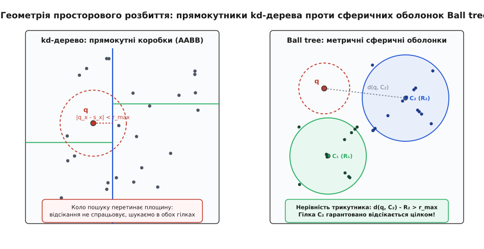
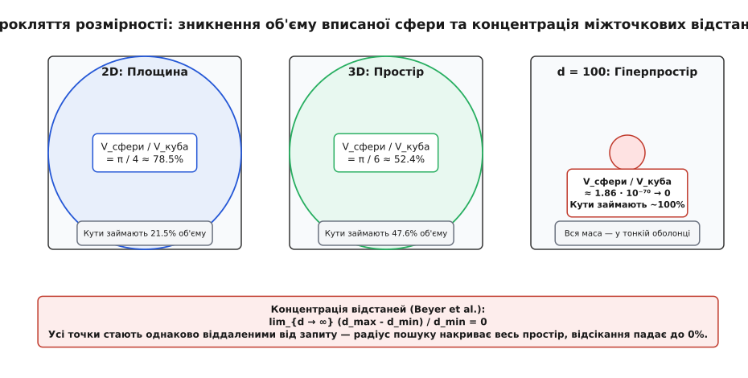
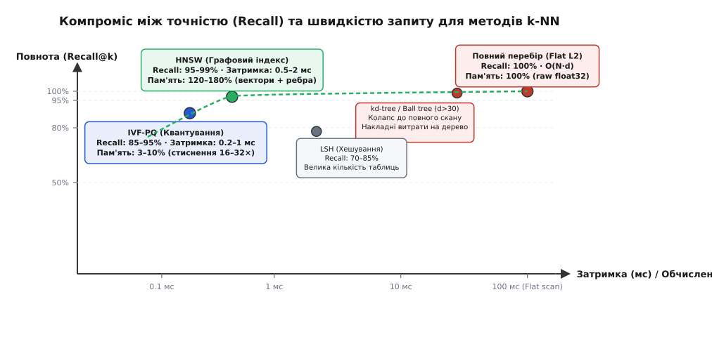
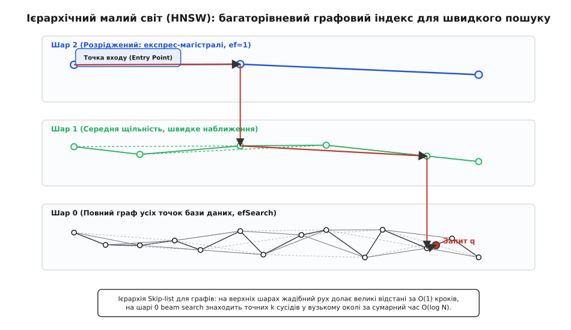
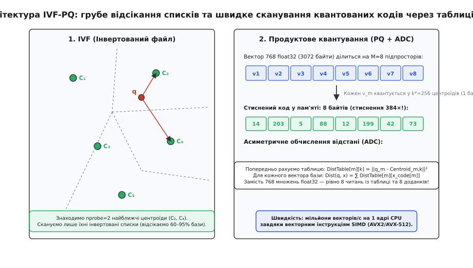

# Пошук найближчих сусідів: просторові дерева, прокляття розмірності та векторні індекси

<preknowlist>
- [kd-дерево](topic:algorithms/kd-tree) — циклічний поділ простору гіперплощинами та відсікання піддерев за відстанню до осі.
- [Черга з пріоритетом](topic:algorithms/priority-queue) — купа, яка зберігає поточні топ-k кандидатів і виштовхує найвіддаленішого.
- [Косинусна відстань](topic:algorithms/cosine-distance) — кутова метрика між нормалізованими векторами та її відмінність від евклідової відстані.
- [Прокляття розмірності](topic:algorithms/curse-of-dimensionality) — чому геометрія багатовимірних просторів ламає просторові дерева.
- [Локально-чутливе хешування](topic:algorithms/locality-sensitive-hashing) — випадкові проекції, що зіштовхують схожі вектори в однакові кошики.
</preknowlist>

Сучасна пошукова система або модуль генерації відповідей (RAG, англ. *Retrieval-Augmented Generation*) зберігає базу знань у вигляді десяти мільйонів векторних ембедингів (англ. *embeddings* — векторні представлення смислу) розмірністю 768 чисел із рухомою комою кожне. Коли користувач ставить запитання, нейромережа перетворює запит на такий самий 768-вимірний вектор. Щоб знайти релевантні документи, система мусить знайти `k = 10` векторів бази даних, які мають найменшу геометричну відстань до вектора запиту.

Лобове розв'язання — обчислити відстань від запиту до кожного з десяти мільйонів векторів. Для одного запиту це вимагає `10⁷ · 768 ≈ 7.68 · 10⁹` операцій множення та додавання (FLOPs). На сучасному серверному процесорі з продуктивністю ядра 100 GFLOPS повне сканування одного запиту триває 76 мілісекунд. Якщо система обслуговує потік у 1000 запитів на секунду, для підтримки такого навантаження знадобиться щонайменше 76 процесорних ядер, зайнятих виключно обчисленням евклідових відстаней у пам'яті обсягом понад 30 гігабайтів.

Задача пошуку `k` найближчих сусідів (англ. *k-Nearest Neighbors*, скорочено *k-NN*) полягає у побудові таких структур даних та алгоритмів, які дозволяють знайти шукані точки за логарифмічний або сублінійний час `O(log N)` чи `O(k · log N)`, уникаючи перевірки абсолютної більшості елементів вибірки.

### Метричний простір та аксіоми відстані

Будь-який просторовий пошук спирається на поняття відстані. Формально множина об'єктів `X` разом із функцією відстані `d(x, y)` утворює метричний простір (лат. *metricus* — вимірний), якщо для будь-яких трьох точок виконуються чотири фундаментальні аксіоми:

```
1. d(x, y) ≥ 0               [невід'ємність відстані]
2. d(x, y) = 0  ⇔  x = y     [тотожність нерозрізненних]
3. d(x, y) = d(y, x)         [симетрія]
4. d(x, z) ≤ d(x, y) + d(y, z) [нерівність трикутника]
```

Саме четверта аксіома — **нерівність трикутника** — є головним математичним рушієм просторової індексації. Вона дозволяє встановити строгу нижню межу відстані від запиту до цілої групи точок через відстань до їхнього спільного центру, не обчислюючи координат кожного індивідуального вектора. Повний математичний апарат і строгі доведення меж відсікання винесено в окрему вставку [математичні межі метричного відсікання](topic:algorithms/k-nearest-neighbors/math-metric-pruning.md).

У практичних задачах машинного навчання та обробки сигналів найчастіше використовують три метрики:

1. **Евклідова відстань (`L2`-метрика):**
   Геометрична довжина прямого відрізка між двома точками у просторі:

```
d_L2(x, y) = √( ∑_{i=1}^d (x_i − y_i)² )
```

   На практиці під час пошуку найближчих сусідів обчислюють не сам корінь, а квадрат евклідової відстані `d_L2²(x, y) = ∑ (x_i − y_i)²`. Оскільки функція `f(t) = √t` є монотонно зростаючою для `t ≥ 0`, порядок сортування кандидатів за квадратом відстані строго ідентичний порядку за дійсною відстанлю, що дозволяє зекономити дорогі апаратні інструкції квадратного кореня.

2. **Мангеттенська відстань (`L1`-метрика, відстань міських кварталів):**
   Сума абсолютних різниць координат:

```
d_L1(x, y) = ∑_{i=1}^d |x_i − y_i|
```

   Ця метрика менш чутлива до поодиноких екстремальних викидів у координатах, ніж `L2`, оскільки різниці не підносяться до квадрата.

3. **Косинусна подібність та косинусна відстань:**
   Косинус кута між двома векторами визначає ступінь їхньої кутової співнапрямленості незалежно від їхньої абсолютної довжини:

```
cos_sim(x, y) = (x · y) / ( ||x|| · ||y|| ) = ( ∑ x_i · y_i ) / ( √(∑ x_i²) · √(∑ y_i²) )
d_cos(x, y)   = 1 − cos_sim(x, y)
```

   Між евклідовою відстанлю та косинусною подібністю існує прямий ізоморфізм. Якщо всі вектори попередньо нормалізувати до одиничної довжини (`||x|| = 1`, `||y|| = 1`), квадрат евклідової відстані виражається через скалярний добуток:

```
||x − y||² = ||x||² + ||y||² − 2·(x · y) = 1 + 1 − 2·cos_sim(x, y) = 2 · (1 − cos_sim(x, y)) = 2 · d_cos(x, y)
```

   Це означає, що задача максимізації скалярного добутку (англ. *Maximum Inner Product Search*, MIPS) для нормалізованих векторів є абсолютно еквівалентною пошуку найближчого сусіда за евклідовою відстанлю на поверхні одиничної гіперсфери.

---

### Точний пошук: просторові дерева та гіперплощини

Щоб знайти `k` найближчих точок швидше за повний перебір, множину точок розбивають на ієрархічні просторові групи. Головний інструмент класичного точного пошуку — [kd-дерево](topic:algorithms/kd-tree) (англ. *k-dimensional tree*).

Кожен вузол kd-дерева обирає одну координатну вісь і ділить точки площиною, що проходить через медіану цієї осі. Усі вузли на глибині ділять простір на прямокутні паралелепіпеди (коробки AABB, англ. *Axis-Aligned Bounding Boxes*), що щільно вкривають простір без перекриттів.

Пошук `k` сусідів у такому дереві організовано навколо обмеженої [черги з пріоритетом](topic:algorithms/priority-queue) (Max-Heap) фіксованої місткості `k`. У купі зберігаються пари `(точка, відстань)`:

1. Алгоритм рекурсивно спускається деревом до листка, у комірку якого потрапляє точка запиту `q`.
2. Усі точки листка вставляються в купу. Якщо купа заповнюється до `k` елементів, її верхівка (корінь) завжди містить кандидата з найбільшою відстанлю серед поточно знайдених топ-k — позначимо цю відстань як `r_max`.
3. Під час повернення по стеку рекурсії в кожному внутрішньому вузлі виконується перевірка. Нехай вузол ділить простір за координатою `a` значенням `s`. Мінімально можлива відстань від запиту `q` до будь-якої точки в протилежному піддереві дорівнює перпендикулярному відступу від запиту до розділової площини:

```
d_min = |q_a − s|
```

4. **Правило відсікання:** Якщо `|q_a − s| ≥ r_max` і купа містить рівно `k` елементів, жодна точка у протилежному піддереві не може бути ближчою за вже знайдених кандидатів. Усе протилежне піддерево відкидається за одну операцію. Якщо ж `|q_a − s| < r_max`, куля пошуку радіуса `r_max` перетинає площину, і алгоритм зобов'язаний спуститися в другу гілку.

У просторах низької розмірності (`d = 2..4`) такий підхід працює за середній час `O(k · log N)`. Проте коли точки утворюють витягнуті скупчення, орієнтовані діагонально до координатних осей, прямокутні коробки AABB охоплюють великі порожні області, змушуючи алгоритм перевіряти зайві гілки.

---

### Метричні сферичні оболонки: Ball Tree

Для подолання обмежень прямокутних розрізів використовують дерево сферичних оболонок — **Ball Tree** (дерево куль).

Замість прямокутників, орієнтованих за осями, кожен вузол Ball Tree визначає замкнену метричну кулю `B(c, R)`, де `c` — просторовий центр (центроїд або півот), а `R` — радіус, що дорівнює відстані до найвіддаленішої точки, що належить цьому піддереву:

```
R = max_{p ∈ Subtree} d(c, p)
```

Кулі дочірніх вузлів можуть вільно нахилятися, зміщуватися та навіть частково перекриватися, що дозволяє підлаштовувати форму оболонки під природну геометрію даних у довільному метричному просторі.


*Зліва: прямокутне розбиття kd-дерева прив'язане до осей координат і змушене перевіряти обидві гілки, коли сфера пошуку перетинає площину. Справа: сферичні оболонки Ball tree відсікають кластер C₂ за нерівністю трикутника d(q, C₂) − R₂ > r_max незалежно від орієнтації простору.*

#### Механізм відсікання в Ball Tree

Під час пошуку `k` найближчих сусідів для запиту `q` та поточному радіусі відсікання `r_max`:

1. Обчислюється відстань від запиту до центру кулі вузла `d(q, c)`.
2. За нерівністю трикутника мінімальна можлива відстань від `q` до будь-якої точки всередині кулі `B(c, R)` становить:

```
d_min(q, B) = max( 0, d(q, c) − R )
```

3. **Критерій відсікання:** Якщо `d_min(q, B) ≥ r_max`, жодна точка цієї кулі не може покращити поточний результат. Піддерево відкидається цілком.
4. **Порядок обходу:** Якщо піддерево не відсікається, алгоритм обчислює відстані до центрів обох дочірніх куль `d(q, c_left)` та `d(q, c_right)` і **першим відвідує ближчий вузол**. Це дозволяє якнайшвидше знайти хороших кандидатів і зменшити `r_max`, що підвищує ймовірність відсікання другого піддерева при поверненні.

Повну програмну реалізацію побудови дерева та точного k-NN пошуку мовами C та C++ наведено у вставці [побудова та пошук у Ball Tree](topic:algorithms/k-nearest-neighbors/proj-ball-tree-knn.md).

---

### Прокляття розмірності: чому точні дерева колапсують

Незважаючи на геометричну витонченість kd-дерев та Ball tree, обидві структури повністю деградують, коли розмірність простору перевищує `d > 15..20`. При розмірності `d = 128` або `d = 768` пошук по дереву працює **повільніше за простий лінійний перебір масиву**, оскільки алгоритм відвідує 95–100% усіх листків, витрачаючи додатковий час на переходи за вказівниками та розгортання стека.

Ця деградація спричинена двома фундаментальними геометричними явищами [прокляття розмірності](topic:algorithms/curse-of-dimensionality).


*При зростанні вимірності об'єм вписаної гіперсфери експоненційно зникає порівняно з кубом, а відносна різниця між мінімальною та максимальною міжточковими відстанями прямує до нуля.*

#### 1. Зникнення об'єму кулі та зосередження маси в кутах

Розглянемо `d`-вимірний гіперкуб зі стороною `2R` (об'єм `V_cube = (2R)^d = 2^d · R^d`) та вписану в нього гіперсферу радіуса `R`. Об'єм гіперсфери виражається через гамма-функцію:

```
V_sphere(d, R) = ( π^(d/2) / Γ(d/2 + 1) ) · R^d
```

Для парної розмірності `d = 2m` співвідношення об'ємів дорівнює:

```
V_sphere / V_cube = (π / 4)^m / m!
```

При зростанні розмірності знаменник `m!` зростає значно швидше за чисельник `(π/4)^m`:
- У просторі `d = 2` вписане коло займає `78.5%` площі квадрата.
- У просторі `d = 3` вписана сфера займає `52.4%` об'єму куба.
- У просторі `d = 10` сфера займає лише `0.25%` об'єму.
- У просторі `d = 100` співвідношення падає до `1.86 · 10⁻⁷⁰`.

У високій розмірності практично 100% об'єму простору зосереджено в тонких кутах гіперкуба за межами вписаної сфери. Просторові розрізи осями або сферами більше не можуть ізолювати скупчення точок, оскільки майже всі дані розмазуються вздовж тонких діагональних кутів.

#### 2. Феномен концентрації відстаней (Теорема Байєра)

Другий нищівний ефект відкрили Байєр та співавтори у 1999 році (англ. *Beyer et al.*). Якщо координати точок генеруються незалежними випадковими розподілами, дисперсія відстаней між точками росте як `O(1)`, тоді як середнє значення відстані зростає як `O(√d)`.

У результаті відносна різниця між найвіддаленішою точкою `d_max` та найближчим сусідом `d_min` для будь-якої точки запиту прямує до нуля при `d → ∞`:

```
lim_{d → ∞} (d_max − d_min) / d_min = 0
```

Усі точки простору стають майже однаково віддаленими від точки запиту. Радіус пошуку найближчого сусіда `r_max` розширюється настільки, що сфера запиту накриває майже всі розрізи та оболонки дерева: умова `d_min ≥ r_max` перестає виконуватися для будь-якого піддерева. Відсоток відсікання падає до нуля, і дерево перетворюється на дорогий спосіб обходу лінійного масиву.

---

### Наближений пошук найближчих сусідів (ANN)

Оскільки точний пошук у високих вимірностях неможливо виконати швидше за лінійне сканування `O(N · d)`, парадигма пошуку змінюється: ми відмовляємося від вимоги 100% гарантії абсолютно точного результату на користь колосального прискорення.

Алгоритми **наближеного пошуку найближчих сусідів** (англ. *Approximate Nearest Neighbors*, скорочено **ANN**) знаходять точки, відстань до яких не більше ніж у `(1 + ε)` разів перевищує відстань до справжнього найближчого сусіда:

```
d(q, p_found) ≤ (1 + ε) · d(q, p_true)
```

Якість роботи ANN-індексу вимірюється метрикою повноти — **Recall@k**:

```
Recall@k = | Знайдені_k ∩ Справжні_k | / k
```

Якщо для `k = 10` алгоритм повернув 9 точок із числа справжніх 10 найближчих сусідів, `Recall@10 = 90%`.


*Простір компромісів: лінійний перебір (Flat) дає 100% Recall ціною високої затримки; точні дерева деградують при d > 30; сучасні методи HNSW та IVF-PQ досягають 90–99% Recall із затримками менше 1 мілісекунди.*

Сучасні індекси ANN будуються за трьома основними парадигмами:
1. **Графові індекси (HNSW, Vamana, NSG)** — навігація по графах малих світів.
2. **Інвертовані індекси з продуктовим квантуванням (IVF-PQ, ScaNN)** — стиснення векторів у пам'яті та табличне обчислення відстаней.
3. **Локально-чутливе хешування (LSH)** — проекції у хеш-таблиці.

---

### Ієрархічні малі світи: графовий індекс HNSW

Найпопулярнішим і найшвидшим графовим індексом у векторних базах даних є **HNSW** (англ. *Hierarchical Navigable Small World* — ієрархічний навігаційний малий світ), запропонований Юрієм Мальковим та Дмитром Яшуніним у 2018 році.

#### Концепція навігаційного малого світу (NSW)

У теорії графів феномен «малого світу» (англ. *Small World*, експеримент Мілгрема про шість рукостискань) описує мережі, де середня довжина найкоротшого шляху між двома вершинами зростає пропорційно логарифму кількості вершин `O(log N)`, тоді як коефіцієнт локальної кластеризації залишається високим.

Якщо з'єднати кожну точку вектора з її найближчими геометричними сусідами (локальні зв'язки) та додати невелику частку випадкових довгих зв'язків (магістралі), пошук найближчого сусіда перетворюється на **жадібну маршрутизацію**:
- Починаємо з довільної точки входу.
- Перевіряємо всіх сусідів по графу і переходимо у вершину, яка знаходиться найближче до запиту `q`.
- Повторюємо крок, доки жоден із сусідів поточної вершини не буде ближчим за неї саму (локальний мінімум).

Проблема простого NSW полягає у тому, що на ранніх етапах побудови довгі зв'язки можуть створювати локальні пастки або вимагати часу пошуку `O(log² N)` через невдалий старт жадібного спуску.

#### Ієрархія шарів HNSW

HNSW вирішує цю проблему, переносячи концепцію пропускного списку ([Skip List](topic:algorithms/skip-list)) на багатовимірні графи.


*Структура HNSW: верхні розріджені шари виконують роль експрес-магістралей для швидкого наближення до околу запиту q за O(1) кроків, а нульовий шар виконує локальний beam search по повному графу.*

Індекс будується як багатошарова структура:
- **Шар 0 (Layer 0):** Містить абсолютно **всі** `N` точок бази даних, з'єднаних густим графом найближчих сусідів (кожна вершина має до `M` ребер).
- **Шар 1, 2, ..., L (верхні шари):** Містять експоненційно меншу підмножину точок. Кожна точка під час вставки випадково отримує максимальний рівень `l`, що генерується за експоненційним розподілом:

```
l = ⌊ −ln( uniform(0, 1) ) · m_L ⌋
```

де параметр нормування `m_L = 1 / ln(M)`. Імовірність потрапляння точки на рівень `l` дорівнює `(1/M)^l`.

#### Алгоритм пошуку в HNSW

1. Пошук стартує з фіксованої вершини — точки входу (англ. *Entry Point*) на найвищому рівні `L_max`.
2. На кожному рівні `l > 0` виконується жадібний спуск із розміром черги `ef = 1`: алгоритм крокує по ребрах поточного шару, доки не знайде локальний мінімум — точку, найближчу до `q` на цьому рівні.
3. Знайдений локальний мінімум стає точкою входу для спуску на наступний нижчий рівень `l − 1`. Завдяки довгим ребрам верхніх шарів алгоритм долає величезні просторові відстані всього за 2–4 переходи.
4. На **Шар 0** алгоритм переходить до променевого пошуку (**Beam Search**) із розміром черги `efSearch`:
   - Підтримується черга відвіданих вершин `v` та динамічний список кандидатів.
   - Алгоритм досліджує сусідів поточних найкращих кандидатів, поки вони покращують результат.
   - Після завершення обходу повертаються `k` найближчих елементів.

Параметр `efSearch` безпосередньо контролює компроміс: збільшення `efSearch` підвищує Recall аж до 99.5%, пропорційно збільшуючи час запиту.

#### Евристика відбору ребер: правило відносного сусідства (RNG)

Критичною деталлю HNSW є евристика вибору `M` сусідів під час вставки вершини. Якщо з'єднувати вершину `u` просто з `M` найближчими точками, усі ребра утворять щільний локальний пучок в одному напрямку, що призведе до ізоляції сусідніх просторових кластерів.

HNSW використовує евристику графа відносного сусідства (англ. *Relative Neighborhood Graph*, RNG rule):
- Кандидати сортуються за зростанням відстані до нової вершини `u`.
- Кандидат `e` додається до списку ребер вершини `u` тоді й лише тоді, коли він знаходиться ближче до `u`, ніж до **будь-якого вже обраного сусіда** зі списку:

```
d(u, e) < min_{v ∈ Selected} d(e, v)
```

Це правило відкидає трикутні надлишкові зв'язки і примусово обирає сусідів у різних кутових секторах навколо вершини, забезпечуючи високу зв'язність і здатність графа прокладати маршрути між різними скупченнями даних.

---

### Інвертовані індекси та продуктове квантування: IVF-PQ

Графи HNSW забезпечують найвищу швидкість і точність, але вимагають зберігання всіх векторів у сирому вигляді float32 разом зі списками сусідів (120–180% додаткової оперативної пам'яті). Для бази на 100 мільйонів 768-вимірних векторів це вимагає понад 400 ГБ RAM.

Алгоритм **IVF-PQ** (поєднання інвертованого файлового індексу та продуктового квантування) розв'язує проблему пам'яті, стискаючи вектори у 16–32 рази безпосередньо в оперативній пам'яті.


*IVF ділить простір на комірки Вороного та сканує лише nprobe списків; Product Quantization розбиває кожен 768-вимірний вектор на 8 байтових індексів, замінюючи векторні множення читанням із таблиці ADC.*

#### 1. Інвертований файл (IVF — Inverted File Index)

Множина точок розбивається на `K` просторових кластерів методом k-середніх (англ. *k-means*). Кожен кластер визначається своїм центроїдом `C_1, C_2, ..., C_K` (комірки Вороного).
- Під час індексації кожен вектор прив'язується до свого найближчого центроїда і записується у відповідний інвертований список (кошик).
- Під час пошуку вектор запиту `q` спочатку порівнюється з `K` центроїдами, і обираються `nprobe` найближчих центроїдів (наприклад, `nprobe = 16` з `K = 4096`).
- Скануються **лише** інвертовані списки, прив'язані до цих `nprobe` центроїдів. Решта `(K − nprobe) / K ≈ 99.6%` бази даних відсікається без звернення до пам'яті.

#### 2. Продуктове квантування (Product Quantization, PQ)

Навіть після відсікання списків сканування 100 000 сирих векторів float32 вимагає зчитування сотень мегабайтів пам'яті. Продуктове квантування (Hervé Jégou et al., 2011) стискає самі вектори:

1. `d`-вимірний вектор розрізається на `M` рівних частин (підвекторів) розмірністю `d' = d / M`. Наприклад, вектор розмірності `d = 768` ділиться на `M = 96` підвекторів довжиною `d' = 8`.
2. Для кожного з `M` підпросторів окремо будується словник (англ. *codebook*) із `K* = 256` підцентроїдів.
3. Кожен 8-вимірний підвектор замінюється індексом його найближчого підцентроїда у словнику. Оскільки `K* = 256 = 2⁸`, один індекс займає рівно **1 байт**.
4. Вектор розмірністю 768 float32 (3072 байти) перетворюється на компактний код із **96 байтів** — досягається стиснення у **32 рази**!

#### 3. Асиметричне обчислення відстані (ADC — Asymmetric Distance Computation)

Головна перевага PQ полягає в тому, що відстань від запиту до квантованого вектора можна обчислити **без його декодування**:

1. Запит `q` залишається у точній формі float32. Перед початком сканування списку будується таблиця відстаней розміром `M × 256`:

```
DistTable[m][k] = || q_m − Centroid_{m, k} ||²
```

   де `q_m` — `m`-й підвектор запиту, а `Centroid_{m, k}` — `k`-й центроїд `m`-го словника.
2. Для будь-якого вектора бази даних, збереженого у вигляді байтового коду `code = [c_1, c_2, ..., c_M]`, відстань обчислюється простою сумою вибірок із таблиці:

```
Dist(q, code) = ∑_{m=1}^M DistTable[ m ][ code[m] ]
```

3. Замість 768 множень чисел із рухомою комою процесор виконує 96 читань за індексом і 96 цілочисельних додавань, які ідеально векторизуються за допомогою SIMD-інструкцій (AVX2, AVX-512 або ARM NEON), досягаючи швидкості сканування понад 10 мільйонів векторів за секунду на одне ядро CPU.

#### 4. Анізотропне квантування: ScaNN

У задачах ранжування за скалярним добутком (MIPS) класичне продуктове квантування має недолік: воно мінімізує середньоквадратичну похибку `||x − x̃||²` рівномірно в усіх напрямках. Однак похибка, паралельна до напрямку самого вектора `x`, спотворює результат скалярного добутку значно сильніше, ніж ортогональна похибка.

Алгоритм **ScaNN** (англ. *Scalable Nearest Neighbors*, Google Research, 2020) застосовує анізотропне квантування, яке при навчанні центроїдів штрафує поздовжню похибку у 4–10 разів сильніше за поперечну. Завдяки цьому ScaNN досягає вдвічі більшої швидкості запиту порівняно зі звичайним IVF-PQ при однаковому рівні Recall.

---

### Локально-чутливе хешування (LSH)

Алгоритми [локально-чутливого хешування](topic:algorithms/locality-sensitive-hashing) (англ. *Locality-Sensitive Hashing*, LSH) використовують сімейство ймовірнісних хеш-функцій `h(x)`, у яких імовірність колізії (потрапляння двох точок в один хеш-кошик) пропорційна їхній геометричній близькості:

```
P[ h(x) = h(y) ] = f( sim(x, y) )
```

Для косинусної подібності використовують **SimHash** на основі випадкових гіперплощин (метод Харікара, англ. *Charikar*). Генерується випадковий нормальний вектор `r ~ N(0, I)`. Хеш-біт визначається знаком скалярного добутку:

```
h_r(x) = sign( r · x )
```

Імовірність того, що дві точки опиняться по один бік від випадкової гіперплощини, прямо залежить від кута `θ` між ними:

```
P[ h_r(x) = h_r(y) ] = 1 − θ / π
```

Щоб зменшити кількість хибних спрацьовувань, комбінують `B` випадкових бітів у єдиний складний ключ (AND-конструкція), а для запобігання втрати сусідів будують `L` незалежних хеш-таблиць (OR-конструкція).

Незважаючи на наявність строгих теоретичних гарантій складності, у високих вимірностях LSH на практиці суттєво поступається HNSW та IVF-PQ за кривою компромісу «швидкість / Recall», оскільки для досягнення Recall > 90% вимагає створення десятків або сотень паралельних хеш-таблиць, що перевантажує оперативну пам'ять.

---

### Архітектура сучасних векторних баз даних (Milvus, Qdrant, FAISS)

Сучасні векторні СКБД та бібліотеки векторного пошуку реалізують ці алгоритми на рівні високопродуктивних рушіїв:

1. **FAISS (Facebook AI Similarity Search):**
   Еталонна C++/CUDA бібліотека для векторного пошуку. Реалізує апаратно оптимізовані ядра для Flat L2, IVF-PQ, ScaNN та HNSW з підтримкою паралельних обчислень на GPU. Вектори упаковуються у неперервні байти з вирівнюванням по 64 байти під AVX-512.

2. **Qdrant:**
   Векторна база даних мовою Rust. Оптимізована під роботу в режимі реального часу: сегментна архітектура з механізмом Copy-on-Write, підтримка відображення файлів у пам'ять (`mmap`), скалярне квантування (SQ8) та вбудована фільтрація за метаданими.

3. **Milvus:**
   Хмарна розподілена векторна база даних. Відокремлює рівень збереження (MinIO/S3) від рівня обчислювальних вузлів (Query Nodes). Використовує асинхронні черги повідомлень (Apache Pulsar/Kafka) для обробки мільярдних векторних корпусів.

4. **DiskANN (Microsoft Research):**
   Графовий індекс (граф Vamana), оптимізований для збереження на твердотільних накопичувачах NVMe SSD. В оперативній пам'яті тримаються лише стиснені PQ-вектори, а сирі вектори читаються з диска через асинхронні системні виклики `io_uring` пакетами по 1–4 КБ, що дозволяє індексувати мільярдні корпуси на одному сервері з 64 ГБ RAM.

#### Проблема фільтрованого пошуку (Filtered Vector Search)

У реальних бізнес-задачах векторний пошук майже ніколи не виконується у вакуумі: користувач шукає найближчі вектори з додатковою умовою на метадані, наприклад: *«знайти 5 найсхожіших статей, опублікованих у 2026 році зі статусом "public"»*.

Існує три підходи до поєднання векторного пошуку зі скалярними фільтрами:

```
1. Пре-фільтрація (Pre-filtering):
   Спочатку скалярна БД знаходить ID усіх документів, що задовольняють фільтр.
   Потім векторний індекс сканує лише ці ID.
   [Проблема]: Якщо фільтр залишає 0.1% точок, графовий індекс HNSW
   розпадається на незв'язні фрагменти — маршрутизація ламається.

2. Пост-фільтрація (Post-filtering):
   Векторний індекс знаходить топ-k найближчих сусідів у всій базі.
   Потім результати фільтруються за метаданими.
   [Проблема]: Якщо фільтр дуже суворий (селективний), усі знайдені топ-k
   будуть відкинуті, і система поверне порожній результат.

3. Однопрохідна фільтрація під час обходу графа (In-engine Traversal Filtering):
   Граф HNSW обходиться як зазвичай, але черга відповідей приймає лише вершини,
   бітова маска яких відповідає скалярному предикату.
   Це забезпечує 100% збереження топології графа та гарантію видачі рівно k результатів.
```

#### Гібридний пошук та злиття рангів (RRF)

У багатьох пошукових системах чистого векторного пошуку недостатньо: семантичний ембединг чудово знаходить тексти за загальним смислом («як полагодити гальма»), але погано справляється з точним пошуком унікальних ідентифікаторів, номерів помилок чи артикулів (наприклад, «ERR-4092-B»).

Тому сучасні рушії об'єднують семантичний ANN-пошук (Dense Retrieval) із класичним текстовим пошуком за ключовими словами на основі інвертованого індексу BM25 (Sparse Retrieval).

Для об'єднання двох списків відповідей застосовують метод **взаємного злиття рангів** (англ. *Reciprocal Rank Fusion*, RRF):

```
RRF_Score(d) = ∑_{m ∈ {Dense, Sparse}} 1 / ( k_rrf + Rank_m(d) )
```

де `Rank_m(d)` — порядковий номер документа `d` у списку видачі методу `m`, а `k_rrf` — стала згладжування (зазвичай `k_rrf = 60`). Документи, що отримали високі позиції в обох списках одночасно, піднімаються на верхівку підсумкової видачі.

#### Апаратний бар'єр пам'яті (Memory Wall)

Продуктивність сучасних ANN-систем лімітується не швидкістю обчислювальних ядер CPU/GPU, а пропускною здатністю оперативної пам'яті:
- Читання з кешу L1: затримка ~1 наносекунда, пропускна здатність понад 2 ТБ/с.
- Читання з кешу L3: затримка ~10–15 наносекунд, пропускна здатність ~500 ГБ/с.
- Довільне читання з DDR5 DRAM: затримка ~70–90 наносекунд, пропускна здатність каналу пам'яті лише 50–80 ГБ/с.

Під час обходу графа HNSW кожен перехід до сусідньої вершини є випадковим стрибком за покажчиком у просторі пам'яті (Random Memory Pointer Chase). Якщо граф перевищує розмір L3 кешу (32–128 МБ), процесорні ядра проводять до 70% часу в очікуванні завантаження ліній кешу з DRAM. Саме тому квантування (IVF-PQ та SQ8) та упакування графів у неперервні блоки пам'яті дають кратно більший приріст продуктивності, ніж математичні оптимізації алгоритмів.

---

### Порівняльний аналіз та критерії вибору структури

Вибір конкретного алгоритму або структури даних для k-NN визначається трьома параметрами системи: вимірністю простору `d`, обсягом вибірки `N` та бюджетом пам'яті.

| Структура / Метод | Тип індексу | Вимірність `d` | Складність запиту | Recall | Витрати пам'яті (RAM) | Підтримка вставок |
| :--- | :--- | :--- | :--- | :--- | :--- | :--- |
| **Flat Scan (L2)** | Точний масив | Будь-яка | `O(N · d)` | 100% | 100% (raw float32) | Миттєва `O(1)` |
| **kd-tree** | Просторове дерево | `d < 15` | `O(k · log N)` | 100% | ~110% (дерево) | Потребує ребалансу |
| **Ball Tree** | Метричне дерево | `d < 20` | `O(k · log N)` | 100% | ~120% (оболонки) | Потребує ребалансу |
| **HNSW** | Навігаційний граф | `d > 20` | `O(log N)` | 95–99.5% | 130–180% (вектори + граф) | Динамічна `O(log N)` |
| **IVF-PQ** | Кластери + Квантування| `d > 20` | `O(nprobe · N/K)` | 85–95% | 3–10% (стиснення 16–32×) | Потребує перенавчання |
| **ScaNN** | Анізотропне PQ | `d > 20` | `O(nprobe · N/K)` | 90–98% | 5–12% (квантування) | Пакетне оновлення |
| **DiskANN (Vamana)**| Граф на SSD NVMe | `d > 20` | `O(log N)` | 95–99% | 10–15% RAM + SSD | Пакетна перебудова |

**Практичні рекомендації щодо архітектурного вибору:**
- Якщо `N < 50 000` точок: використовуйте **Flat Scan** із SIMD-векторизацією (AVX2/AVX-512) — це дасть 100% точність із мікросекундною затримкою без витрат пам'яті на індекси.
- Якщо дані живуть у фізичному просторі `d = 2..4` (робототехніка, геодезія, GIS, лідарні хмари): використовуйте **kd-дерево** або **Ball Tree**.
- Якщо `N > 100 000`, вимірність ембедингів `d = 128..1536`, а головна вимога — мінімальна затримка (< 2 мс) та максимальна точність (Recall > 95%): використовуйте **HNSW** у Qdrant або Milvus.
- Якщо база містить сотні мільйонів векторів, а бюджет оперативної пам'яті обмежений: використовуйте **IVF-PQ** або **DiskANN**, де стиснені квантовані коди зберігаються в RAM, а повні вектори підтягуються з NVMe-диска лише для фінального переранжування (англ. *reranking*) топ-100 кандидатів.
