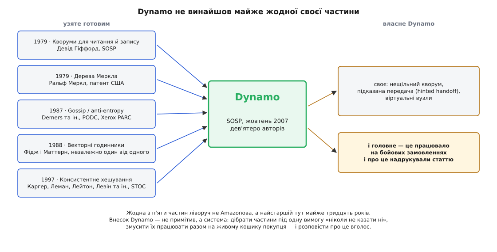
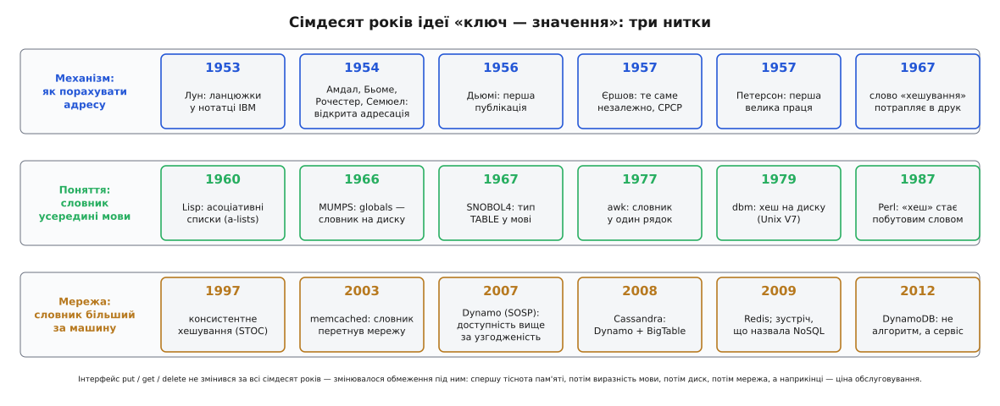

# 📜 Від асоціативного масиву до Dynamo

<preknowlist>
- [Консистентне хешування](book:algorithms/consistent-hashing) — ключі й вузли розкладають на спільному кільці, ключ дістається найближчому вузлу за годинниковою стрілкою, і поява чи зникнення вузла зачіпає лише сусідів, а не всіх. Без цього не видно, що саме Dynamo узяв 2007 року готовим і чому кеш LiveJournal перестав витиратися щоразу, коли до нього додавали сервер.
</preknowlist>

Сьогодні словник — найнудніша річ у мові програмування. Його дають у першому розділі підручника, поруч із циклом, і жоден студент не питає, звідки він узявся: ну є й є, `d["ключ"]`. Тим часом за цією буденністю стоїть історія, у якій та сама трирядкова ідея встигла народитися в чотирьох місцях нарізно, чотирнадцять років соромитися власної назви, тихо крутити американські лікарні з 1966 року — і врешті стати тим, на чому тримається кошик покупця в Amazon.

Тут не про те, як влаштована хеш-таблиця. Тут про те, **звідки взялося саме поняття** — і що воно кожного разу мусило пережити, щоб дорости до наступного масштабу.

## Ім'я проти адреси

Почнімо з незручності, яка нікуди не поділася й досі.

Пам'ять обчислювальної машини вміє рівно одне: віддати вміст комірки за її **номером**. «Комірка 4096» — миттєво. «Комірка, у якій лежить `LOOP`» — машина не розуміє питання: такої операції в неї немає й ніколи не було.

А люди пишуть іменами. Асемблер, який 1954 року складала група в IBM для машини IBM 701, мусив пам'ятати, за якою адресою стоїть мітка `LOOP`, що означає `COUNT` і куди веде `START`. Кілька тисяч імен — і на кожну згадку в програмі треба віддати адресу.

Виходів було два, і обидва кепські. Перебирати таблицю імен підряд — тоді кожна згадка коштує всієї таблиці. Тримати імена відсортованими — пошук пришвидшиться, зате кожне нове ім'я доведеться вставляти в середину, зсуваючи решту. На машині, де пам'ять міряли тисячами слів, обидва варіанти означали одне: асемблер длубатиметься довше, ніж людина писала ту програму.

І тоді хтось перевернув питання. Не **шукати** ім'я — а **порахувати** з нього адресу. Хай саме ім'я скаже, де йому лежати.

Ось чому асоціативний масив народився не в базі даних, а всередині транслятора. Його найперша робота в цьому світі — пам'ятати, що означають слова, які понавигадували програмісти.

## Січень 1953-го: ідея, що спала на думку кільком групам нарізно

Найповніший опис тих подій лишив Дональд Кнут (Donald Knuth) у третьому томі «Мистецтва програмування», і його виклад тут — найнадійніше джерело, бо писався за живими учасниками й документами.

Першим, схоже, був **Ганс Петер Лун** (Hans Peter Luhn) — німець із Бармена, що переїхав до США й працював інженером IBM. У січні 1953 року він написав внутрішню записку IBM, де запропонував розкидати записи по **кошиках** і зчіплювати ті, що потрапили в один кошик, у ланцюжок. За Кнутом, це заразом одне з найперших застосувань зв'язних списків узагалі: Лун винаходив хешування й зв'язний список практично одним рухом.

Хеш-функції Луна були цифрові — він складав сусідні пари цифр ключа за модулем 10:

```
ключ:        3 1 4 1 5 9 2 6
пари:         31   41   59   26
сума mod 10:  3+1 = 4
              4+1 = 5
              5+9 = 14  →  4      (беремо остачу від 10)
              2+6 = 8
хеш:         4548
```

Вісім цифр стиснулися до чотирьох — і ці чотири стали адресою кошика. Записка лишилася внутрішньою й не була опублікована, тож жодного «пріоритету за публікацією» Лун не має — має первинність задуму, засвідчену документом.

Приблизно тоді ж, **нічого не знаючи про Луна**, до тієї самої ідеї дійшла інша група айбіемівців: **Джин Амдал** (Gene M. Amdahl), **Ілейн Бьоме** (Elaine M. Boehme, по чоловікові — McGraw), **Натаніел Рочестер** (Nathaniel Rochester) і **Артур Семюел** (Arthur L. Samuel). Вони саме будували той асемблер для IBM 701, і таблиця символів була їхньою практичною бідою. Розв'язувати колізії ланцюжком вони не стали — Амдал придумав інше: якщо кошик зайнятий, іти далі по таблиці, доки не трапиться вільний. Так з'явилася **відкрита адресація з лінійним пробуванням**.

На ім'я Ілейн Бьоме варто зупинитися окремо, бо з переказів воно випадає найчастіше — лишається «хеш-таблиця Амдала». Її взяли до IBM 1953 року (брав саме Амдал), і реалізація таблиці символів була дорученою **їй** задачею. Кнут перелічує всіх чотирьох.

Першим у **відкритому друці** хешування описав **Арнольд Дьюмі** (Arnold I. Dumey) — журнал *Computers and Automation*, том 5, число 12 (грудень 1956), сторінки 6–9. Саме він першим згадав те, що сьогодні здається очевидним: ділити на **просте число** й брати остачу як адресу. Про ланцюжки Дьюмі писав, про відкриту адресацію — ні.

А 1957 року відкриту адресацію винайшли ще раз — незалежно й окремо. **Андрій Єршов** (Andrey Ershov), радянський математик, дійшов до лінійної відкритої адресації сам і опублікував результат у «Доповідях АН СРСР», том 118 (1958), сторінки 427–430. Він навів дослідні виміри числа проб і **правильно** припустив межу:

```
N / M  <  2/3   →   середнє число проб на вдалий пошук  <  2
```

Кнут визнає за Єршовим саме незалежне співвідкриття — не першість (Амдалова група була на три роки раніше), але й не переспів: Єршов дійшов сам, опублікував із вимірами й угадав правильну оцінку. Це той випадок, коли внесок треба назвати рівно таким, яким він був, — без применшення й без дописування зайвого.

Нарешті **Веслі Петерсон** (W. Wesley Peterson) у *IBM Journal of Research and Development*, том 1 (1957), сторінки 130–146, дав першу велику працю про пошук у великих файлах: означив відкриту адресацію загально, розібрав рівномірне пробування. Петерсон там зауважив, що спосіб надто природний, аби його не придумав хтось іще — сам того не знаючи, він точно описав власну епоху: ідея справді спадала на думку всім, хто впирався в ту саму стіну.

І остання деталь, у якій уся вдача цієї історії. Слово **«хешування»** (від англ. *hash* — сікти, кришити) у нинішньому значенні не потрапляло в друк аж до 1967 року — уперше воно з'явилося в книжці Герберта Геллермана (Herbert Hellerman) «Digital Computer System Principles», на 152-й сторінці. До того Кнут знайшов його лише в неопублікованій записці Петерсона 1961 року. Тобто чотирнадцять років усі це робили, всі це так називали між собою — і ніхто не наважувався надрукувати таке несолідне слівце. Прийом був фольклором раніше, ніж став літературою. Впливовий огляд Роберта Морріса (Robert Morris) у *CACM* 11 (1968), 38–44, уже просто застав термін готовим.

## Ліспова інтуїція: словник як частина мови

Поки в IBM рахували адреси, у Массачусетському технологічному відбувалося щось геть інше — і, як з'ясується, теж про ключ і значення.

1960 року **Джон Маккарті** (John McCarthy) опублікував у *Communications of the ACM* статтю «Recursive Functions of Symbolic Expressions and Their Computation by Machine, Part I» — опис Лісп для машини IBM 704. Серед іншого там є **асоціативний список** (a-list): просто список пар, і функція `assoc`, що йде по ньому й повертає значення за ключем. На асоціативному списку в Ліспі тримається `EVAL`: щоб дізнатися, чому дорівнює `x`, інтерпретатор шукає `x` в a-list поточного оточення.

Тут ховається розріз, який пояснює всю подальшу історію. **Асоціативний список — це лінійний перебір.** Жодного хешу, жодної сталої вартості: `assoc` чесно йде по парах підряд. З погляду швидкості Лісп 1960 року робив рівно те, від чого тікав Амдал.

Але Лісп дав інше — те, чого не було в асемблера. Він зробив відповідність «ключ → значення» **річчю мови**: її можна створити, передати у функцію, повернути, розширити, покласти всередину іншої. У асемблері таблиця символів була нутрощами транслятора, які ніхто не бачив. У Ліспі словник став тим, чим програміст оперує руками.

Отже, **поняття й механізм народилися в різних кімнатах**, років за сім одне від одного, і довго не зналися. Інтерфейс прийшов від дизайну мов; швидкість — від системного програмування. Усе, що було далі, — це історія їхнього поступового одруження.

Першою мовою, де асоціативний масив став **окремим типом даних** із власним іменем, стала SNOBOL4. Роботу над нею почали в лютому 1966-го в Bell Labs — **Ральф Грізволд** (Ralph E. Griswold), **Джеймс Поудж** (J. F. Poage) та **Іван Полонський** (Ivan P. Polonsky); першу реалізацію починали на IBM 7094, а докінчили на IBM 360 уже 1967 року. Тип називався `TABLE` — масив, індексований чим завгодно, найчастіше рядком. Не «структура всередині компілятора», а тип, який оголошує програміст.

## MUMPS: база даних, що прикинулася змінною

А тепер найменш відома і, як на мене, найдивовижніша сторінка.

Того самого 1966 року в Лабораторії комп'ютерних наук Массачусетської загальної лікарні (MGH) **Ніл Паппалардо** (Neil Pappalardo), **Роберт Ґрінз** (Robert Greenes) і **Курт Марбл** (Curt Marble) під орудою **Окто Барнетта** (G. Octo Barnett) писали на міні-машині PDP-7 систему для медичних записів. Назвали її MUMPS — Massachusetts General Hospital Utility Multi-Programming System.

Головна вигадка MUMPS — **globals**. Пишеш змінну з дашком:

```
^Patient("Іваненко","dob") = "1978-03-14"
```

— і це вже не змінна в пам'яті, а запис **на диску**. Він переживе кінець програми, перезапуск і вимкнення живлення. Індекс — довільний рядок, вкладеність — яка треба, порожні комірки місця не займають, а зміни йдуть транзакційно. Ані окремої мови запитів, ані драйвера, ані бази як окремої речі: **сховище «ключ — значення» вбудували просто в синтаксис змінної**.

Тобто стійке транзакційне сховище «ключ — значення» працювало в лікарні за президентства Джонсона — за сорок з гаком років до того, як цю ідею оголосили революцією. І це не музейний експонат: нащадки MUMPS (Epic, VistA) досі крутять помітну частку американських лікарень — вони пережили більшість стартапів, які 2009 року повідомляли світові про новий клас баз.

Мораль тут не «все вже було вигадано». Мораль тонша: **ідея приходить туди, де тисне потреба**, і сидить там, поки потреба не почне тиснути деінде. Медицині стійкий словник був потрібен 1966-го — вона його зробила й спокійно ним користувалася. Решті світу він знадобився за півстоліття.

## Unix робить словник буденним

До 1970-х асоціативний масив був річчю або вченою (Лісп), або лікарняною (MUMPS). Буденним його зробив Unix.

1977 року **Альфред Ахо** (Alfred Aho), **Пітер Вайнберґер** (Peter Weinberger) і **Браян Керніган** (Brian Kernighan) у Bell Labs зробили awk — мову, названу власними ініціалами (опис вийшов у *Software: Practice and Experience* 1979 року). Асоціативний масив у ній не подія, а дрібниця, яку пишуть між іншим:

```awk
{ count[$1]++ }
END { for (k in count) print k, count[k] }
```

Порахувати, скільки разів трапилося кожне слово, — рядок коду. Не «оголосити структуру», не «виділити пам'ять», не «вибрати розмір таблиці»: просто пиши в `count[...]`, воно саме заведеться. Тут словник уперше став **настільки дешевим у вжитку, що перестав відчуватися структурою даних**. Він став розділовим знаком.

За два роки, 1979-го, **Кен Томпсон** (Ken Thompson) додав до сьомої редакції Unix бібліотеку **dbm** — хеш-таблицю **на диску** з інтерфейсом «поклади значення за ключем, дістань значення за ключем». Від неї пішла ціла лінія вбудованих сховищ: ndbm, gdbm, Berkeley DB. Словник, який переживає перезапуск, став для програміста звичайним викликом бібліотеки.

А наприкінці 1987-го **Ларрі Волл** (Larry Wall) випустив у групу новин `comp.sources.misc` перший Perl (18 грудня 1987) — мову, що успадкувала асоціативні масиви від awk і рознесла їх по всьому вебу дев'яностих разом із їхньою побутовою назвою: **хеш**.

Отут і є та точка, з якої починається справжня історія. Близько 1990 року асоціативний масив — нудна вбудована штука мови, яку ніхто не називає базою даних і про яку нема чого сказати. Дно його гідності. Наступні п'ятнадцять років він з цього дна забере собі інтернет.

## memcached: словник перетинає мережу

2003 рік, LiveJournal — величезної популярності сайт, зроблений на копійки. База MySQL тоне: той самий профіль користувача дістають із диска тисячі разів на хвилину, і машина здихає не від складності, а від повторюваності.

**Бред Фіцпатрик** (Brad Fitzpatrick) 22 травня 2003 року в Danga Interactive пише прототип — **мовою Perl** (він і сам потім викладав той первісний код). А в C його переписує **Анатолій Воробей** (Anatoly Vorobey), програміст LiveJournal із Тель-Авіва. Вийшов memcached, під ліцензією BSD.

На цю подвійність варто зважати щоразу, коли кажуть «Фіцпатрик написав memcached». Задум і перший прототип — Фіцпатрикові; те, що сьогодні крутиться у Facebook, Wikipedia, YouTube і Reddit, — C-реалізація Воробея. Це різні внески, і обидва потрібні.

Змістовний стрибок тут ось у чому. На питання «база не тягне» відповіли **не кращою базою**. Відповіли так: поставмо перед нею величезний асоціативний масив, склавши його з **вільної пам'яті машин, які в нас уже є**. У вебсерверів RAM недовантажена — зберімо її докупи.

І тоді словник **перетнув межу машини**. `get(ключ)` тепер іде по мережі. А головне — memcached зумисне **нічого не гарантує**: запис може зникнути будь-якої миті, стійкості немає, цілісності немає. Це не недоробка, це вибір. Втрачений запис кешу коштує одного запиту до бази; обіцянка стійкості коштувала б складності, заради якої все й затівалося.

Лишалося дрібне питання: **на якому саме сервері** лежить ключ. Наївне «номер сервера = хеш ключа за кількістю серверів» має жорстоку ваду: додав сервер — і майже всі ключі поїхали, тобто кеш витерся весь. Причому витерся рівно тієї миті, коли ви **додавали потужність**, бо не витягували навантаження. Ліки прийшли з теорії: 10 квітня 2007 року **Річард Джонс** (Richard Jones, RJ), тодішній технічний директор Last.fm, випустив бібліотеку `libketama` — консистентне хешування для клієнтів memcached, і зробив це з цілком приземленої потреби: возити сервери між дата-центрами, не витираючи кеш.

Отже, консистентне хешування ввійшло в щоденну практику **через кеш, а не через базу**. І прийшло воно вже неновим.

## Теорія, що чекала десять років

Бо придумали його 1997 року.

На симпозіумі STOC (29-й ACM Symposium on Theory of Computing), сторінки 654–663, вийшла праця «Consistent Hashing and Random Trees: Distributed Caching Protocols for Relieving Hot Spots on the World Wide Web» — **Девід Каргер** (David Karger), **Ерік Леман** (Eric Lehman), **Том Лейтон** (Tom Leighton), **Метью Левайн** (Matthew Levine), **Деніел Левін** (Daniel Lewin) і **Ріна Паніграгі** (Rina Panigrahy), MIT.

Задача, яку вони брали, — не бази даних. Це «гаряча точка» вебу: сторінка раптом стає популярною, і сервер під нею лягає. Куди класти копії, якщо набір кешів увесь час змінюється?

Про **Денні Левіна** (Danny Lewin) варто сказати окремо. Американо-ізраїльський математик, народжений 14 травня 1970 року; ключові алгоритми ввійшли в його магістерську роботу в MIT під керівництвом Тома Лейтона, за яку 1998 року він дістав інститутську премію Морріса Джозефа Левіна (Morris Joseph Levin Award — прізвище лише схоже, з Денні Левіном нічим не пов'язане) за найкращу презентацію магістерської роботи. Того ж 1998-го вони з Лейтоном заснували на цих алгоритмах Akamai. 11 вересня 2001 року Левін летів рейсом American Airlines 11; за наявними свідченнями, він був першою людиною, вбитою того дня.

Алгоритм, придуманий для кешів вебу, десять років лежав здебільшого як теорія — і став хребтом розподілених баз даних, про які його автори не писали. Так буває частіше, ніж здається: теорія чекає на своїй полиці, доки хтось не впреться в задачу, для якої вона й була.

## Dynamo: коли «ні» коштує дорожче за «неправильно»

Тепер до Amazon.

Різдвяний сезон 2004 року дався взнаки низкою збоїв, і, за власним викладом технічного директора Amazon **Вернера Фоґельса** (Werner Vogels), корінь був той самий: комерційні бази даних розтягували далеко за межу, на яку їх будували.

Придивімося до кошика покупця, бо в ньому вся суть. Кошик мусить **прийняти запис**. Завжди. Кошик, який відповідає «спробуйте пізніше», — це гроші, яких уже не буде: недоступність або просто повільність тут негайно видно в касі.

Тридцять років баз даних учили протилежного: краще відмовити, ніж збрехати. Узгодженість над усе. Dynamo для цього конкретного випадку перевернув правило: **краще прийняти й помирити копії потім**. Бо для кошика подвоєний товар — дрібна прикрість, яку видно й легко виправити, а відмова покласти товар — втрачений продаж.

Ось що насправді ховається за словами «остаточна узгодженість»: не технічна хитрість, а **господарське рішення, записане алгоритмом**. Хтось порахував, у що обходиться «ні» проти «неправильно», і саме цей підрахунок — а не математика — вирішив архітектуру.

Статтю «Dynamo: Amazon's Highly Available Key-value Store» подали на SOSP'07 — 21-й симпозіум ACM SIGOPS з принципів операційних систем, 14–17 жовтня 2007 року, Стівенсон, штат Вашингтон. Авторів **дев'ятеро**: Джузеппе Декандія (Giuseppe DeCandia), Деніз Гасторун (Deniz Hastorun), Мадан Джампані (Madan Jampani), Ґунавардган Какулапаті (Gunavardhan Kakulapati), Авінаш Лакшман (Avinash Lakshman), Алекс Пілчин (Alex Pilchin), Свамінатан Сівасубраманян (Swaminathan Sivasubramanian), Пітер Фоссголл (Peter Vosshall) і Вернер Фоґельс.

## Система, зібрана з чужих частин

А тепер найкорисніше, що є в цій історії для того, хто вчиться читати заяви про першість.

**Dynamo не винайшов майже жодної своєї частини.**


*Кожну з п'яти частин ліворуч зробили не в Amazon і не 2007 року — найстаршій майже тридцять років на момент статті. Унесок Dynamo — праворуч: дещиця власного, робоча система під одну-єдину вимогу «ніколи не казати ні» — і стаття, яку прочитали всі.*

Розберімо по одній:

- **кворуми на читання й запис** — Девід Гіффорд (David K. Gifford), «Weighted Voting for Replicated Data», SOSP 1979;
- **[дерева Меркла](book:algorithms/merkle-tree)** для звіряння копій без повного перегляду — Ральф Меркл (Ralph Merkle), заявка на патент США подана 5 вересня 1979 року (US 4 309 569, виданий 1982-го);
- **gossip / anti-entropy** — Демерс та інші (Alan Demers et al.), «Epidemic Algorithms for Replicated Database Maintenance», PODC 1987, Xerox PARC;
- **векторні годинники** — скалярні логічні годинники Леслі Лемпорта (Leslie Lamport) 1978 року, а векторний вигляд — незалежно один від одного Колін Фідж (Colin Fidge, лютий 1988) і Фрідеман Маттерн (Friedemann Mattern, жовтень 1988);
- **консистентне хешування** — Каргер та інші, STOC 1997.

Власного Dynamo додав небагато: нещільний кворум, підказану передачу (hinted handoff), віртуальні вузли. Усе інше — чуже й готове, а найстаріші дві частини — кворуми Гіффорда й дерева Меркла, обидві 1979 року — старші за сам веб, задля якого Dynamo зрештою й будували.

То в чому ж унесок? У двох речах, і обидві важливі. Перша: **система**. Дібрати п'ять чужих частин під одну-єдину вимогу, змусити їх працювати разом і витримати живий кошик покупця на різдвяному навантаженні — це не те саме, що мати кожну з частин окремо. Друга: **публікація**. Amazon міг цього не робити. Він зробив — і саме стаття, а не сама система, перекроїла галузь.

> 🔧 **Навіщо це.** Ця історія — готовий інструмент для перевірки будь-якого «X винайшов Y». Питайте не «хто перший?», а **що саме зробив кожен**: подав ідею (Лун, записка 1953-го — не опублікована); дійшов до неї незалежно (Амдалова група; Єршов 1957-го); першим надрукував (Дьюмі, грудень 1956-го); дав першу серйозну теорію (Петерсон, 1957); придумав примітив (Каргер та інші, 1997); зібрав із примітивів робочу систему (Dynamo, 2007); зробив із системи послугу, якою користуються не герої (DynamoDB, 2012). Це різні внески, вони не заступають один одного й майже ніколи не належать одній людині чи одній країні. Хешування спало на думку щонайменше **трьом** групам нарізно, у двох країнах, за чотири роки. Коли наступного разу вам розкажуть, що щось «винайшов один», — майже напевно вам переказують не історію, а її зручний переказ.

## Усередині Amazon Dynamo не злетів

І тут — найкраща іронія в усій цій справі.

18 січня 2012 року, оголошуючи DynamoDB, Фоґельс розповів те, чого не було в статті 2007-го. Dynamo давав інженерам Amazon усе обіцяне — надійність, швидкодію, масштаб, — але **не зменшував складності обслуговування**. Тримати таку систему живою треба було руками: постачати залізо, ділити дані, розподіляти їх наново, налаштовувати. І власні інженери Amazon від нього… відмахувалися. Вони обирали свідомо гірші архітектурні рішення на S3 і SimpleDB — аби лиш не поратися з базою самотужки. За словами Фоґельса, розробники «проголосували ногами»: простота виявилася дорожчою за тонке керування. Їм потрібна була **послуга**, а не алгоритм.

DynamoDB (18 січня 2012) і став відповіддю: узяти від Dynamo поступове нарощування й передбачувану швидкодію, а від SimpleDB — легкість керованої хмарної послуги й таблиці. Показово, що всередині DynamoDB пішов на реплікацію з одним лідером — не тим безлідерним шляхом, яким славився Dynamo.

Отже: **стаття Dynamo змінила світ за межами Amazon сильніше, ніж Dynamo змінив сам Amazon.** Це не курйоз, це закон жанру. Ідеї подорожують легше за системи — бо систему треба обслуговувати, а ідею досить прочитати.

## Хвиля, яку назвали помилково

За межами Amazon статтю прочитали дуже уважно.

**Cassandra.** У Facebook над пошуком у «Вхідних» працювали **Авінаш Лакшман** (Avinash Lakshman) — **один зі співавторів статті Dynamo** — і **Прашант Малік** (Prashant Malik). Вони зробили відверту гібридну річ: **розподіл** узяли від Dynamo (консистентне хешування, gossip, налаштовна узгодженість), а **модель даних і рушій зберігання** — від Google BigTable (memtable, SSTable, [LSM-дерево](book:algorithms/lsm-tree) — те, що дописує послідовно й зливає у фоні). Facebook відкрив код у липні 2008 року на Google Code; у березні 2009-го проєкт пішов в Apache Incubator, а 17 лютого 2010-го став проєктом верхнього рівня.

Зверніть увагу, **як саме** переїхала ідея з Amazon у Facebook: не файлом і не ліцензією. Вона переїхала **в голові людини**, яка писала ту статтю. Так ідеї й ходять.

**Project Voldemort.** LinkedIn, на чолі з **Джеєм Крепсом** (Jay Kreps); розробка з 2008-го, випуск 2009 року під Apache 2.0 — відверто за Dynamo.

**Riak.** Basho Technologies, мовою Erlang, за принципами Dynamo, з відкритим кодом від 2009-го.

А слово? Слово вийшло непорозумінням — двічі.

Уперше **NoSQL** ужив 1998 року **Карло Строцці** (Carlo Strozzi) — так він назвав свою легку базу, яка **була реляційною**, просто не мала інтерфейсу SQL. Удруге слово витягли 2009-го: **Йоган Оскарссон** (Johan Oskarsson) із Last.fm збирав у Сан-Франциско зустріч про відкриті розподілені бази — 11 червня 2009 року, — а **Ерік Еванс** (Eric Evans) із Rackspace запропонував назву-хештег. На тій-таки зустрічі Крепс доповідав Voldemort. Назву брали **на один захід** — вона втекла й охрестила ціле десятиліття.

Строцці згодом зауважив, що рух радше слід було звати «NoREL» — «не реляційні», бо річ була не в SQL. Тобто ім'я цілого класу баз даних: (1) вкрадене в системи, яка сама реляційна, і (2) вигадане для одної вечірки. Далеко не найгірше, що траплялося з термінологією, але добре нагадування, що назви в нашому ремеслі беруться не з логіки, а з випадку.

## Redis: гілка, що пішла в інший бік

І майже водночас з'явилася річ, яку в цю хвилю записують за компанію, хоча вона зовсім не звідти.

**Сальваторе Санфіліппо** (Salvatore Sanfilippo, у мережі — antirez), італієць із Сицилії, робив LLOOGG — сервіс аналітики вебу в реальному часі. MySQL не встигала за його візерунком доступу: раз у раз штовхати нові події й читати останні перегляди. Санфіліппо спершу зробив дослідний зразок мовою Tcl, потім переписав у C; перший випуск — 26 лютого 2009 року. Назва — REmote DIctionary Server, «віддалений сервер словників»; словник у самому імені.

Redis — не дитя Dynamo. Він пішов рівно в протилежний бік: **одна машина, один потік, усе в пам'яті**. Ніякого кільця, ніякої остаточної узгодженості, ніякої відмовостійкості з коробки.

Зате він поставив питання по іншій осі. У Dynamo значення — непрозорий шматок байтів; уся кмітливість у тому, як розкидати його по тисячі машин. Санфіліппо спитав інакше: **а що, як значення саме буде структурою даних?** Хай за ключем лежить не грудка, а список, множина, впорядкована множина, лічильник, хеш — і хай сервер уміє їх штовхати, різати й перетинати на місці. Замість `get`/`put` — `LPUSH`, `SADD`, `ZADD`, `INCR`.

Родина розділилася на дві гілки, і обидві питали про той самий трирядковий інтерфейс. Dynamo: **як розтягнути словник на тисячу машин?** Redis: **а що, як кожне значення саме — структура?** Обидві відповіді змінили ремесло, і жодна не скасувала іншої: сьогодні в одній системі спокійно стоять і те, і те.

## Що показує ця історія


*Сімдесят років, три нитки. Верхня — механізм: як порахувати адресу. Середня — поняття: як зробити словник частиною мови й лишити його на диску. Нижня — мережа: що робити, коли словник більший за машину. Ниток три, а інтерфейс під ними весь час той самий.*

Найдивовижніше тут — те, чого **не** сталося. За сімдесят років інтерфейс не змінився ні на йоту: покласти значення за ключем, дістати його, прибрати. Те, що писала Ілейн Бьоме для таблиці символів IBM 701, і те, що робить `get` у DynamoDB, — те саме з точністю до слів.

Змінювався не інтерфейс. Змінювалося **обмеження під ним** — і кожен стрибок цієї історії починався не з розумнішої структури даних, а з нового обмеження:

- **1953** — пам'яті мало, перебирати нíколи → рахуймо адресу з ключа;
- **1960** — потрібно виражати зв'язок «ім'я → значення» в самій мові → асоціативні списки;
- **1966** — дані мусять пережити програму → globals MUMPS на диску;
- **1977–79** — це має бути в один рядок → awk; і має лежати на диску → dbm;
- **2003** — вузьке місце не структура, а база → memcached, і словник іде по мережі;
- **2007** — машини замало, і казати «ні» не можна → Dynamo, узгодженість міняють на доступність;
- **2012** — платимо вже не за алгоритм, а за обслуговування → DynamoDB, послуга замість системи.

І друге, що видно з цієї відстані: **робили це всі разом**. Хешування спало на думку принаймні трьом групам нарізно (Лун; Амдалова четвірка; Єршов) — у двох країнах, за чотири роки, і Кнут це чесно задокументував. У memcached задум одного, а C — іншого. Dynamo має дев'ятьох авторів і позичив п'ять ідей із чотирьох десятиліть. Cassandra переїхала з Amazon у Facebook у голові Лакшмана. А стійкий словник, що його 2009 року подавали як новину, крутив лікарні з 1966-го — і крутить досі.

Скромний тип даних став хребтом інтернет-масштабних систем не тому, що ускладнився. Він лишився рівно таким простим, яким був у таблиці символів IBM 701, — три дії. Виросло не воно. Виросло те, що йому доводиться витримувати.
