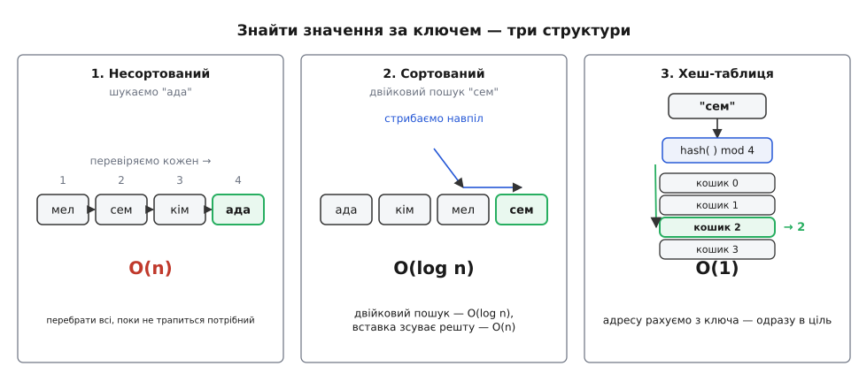
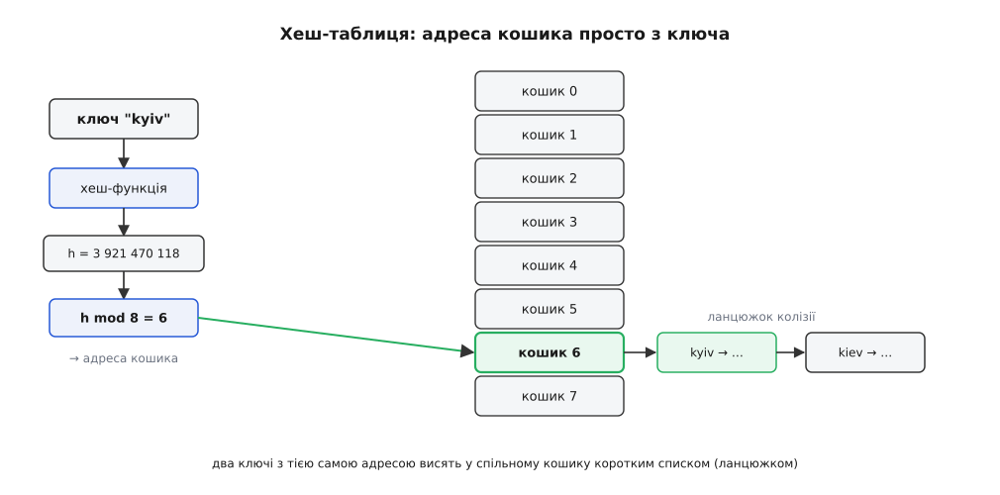
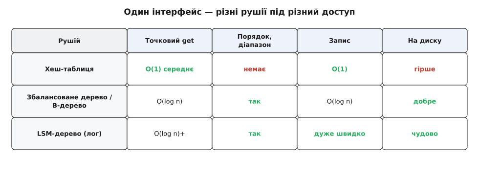
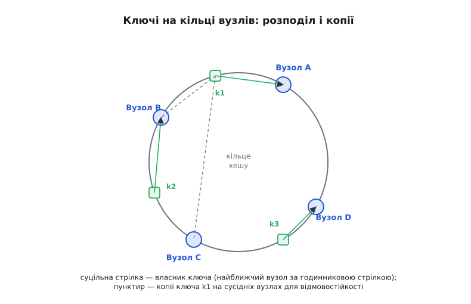

# Сховище «ключ — значення»

<preknowlist>
- [Асимптотична складність](topic:algorithms/asymptotic-complexity) — як читати O(1), O(log n), O(n): що означає «стала», «логарифмічна» чи «лінійна» вартість операції й чому саме вона вирішує, годиться структура чи ні.
</preknowlist>

Уявіть телефонну книгу на мільйон записів. Ви знаєте ім'я — треба номер. Або сервер, що на кожен запит дістає ідентифікатор користувача й мусить віддати його профіль. Або інтерпретатор мови, який зустрів слово `x` і має знайти, яке значення за ним стоїть. Або систему доменних імен, що з рядка `example.com` витягує IP-адресу. Задача щоразу та сама: є **ключ** — те, що ви знаєте, — і за ним треба швидко дістати **значення**, те, що з ним пов'язане. Структуру, яка це вміє, називають **сховищем «ключ — значення»**, або **асоціативним масивом** (лат. *associare* — поєднувати): вона поєднує ключ зі значенням і дозволяє дістати значення назад за ключем.

Її інтерфейс оманливо короткий — лише три дії:

- `put(ключ, значення)` — покласти нову пару або оновити наявну;
- `get(ключ)` — дістати значення за ключем;
- `delete(ключ)` — прибрати пару.

Настільки часто це потрібно, що майже кожна мова дає таке сховище вбудованим типом — під іменами *словник*, *мапа*, *hash* чи *object*:

:::tabs
```py
phone = {}                    # порожнє сховище
phone["Ада"] = "+380 44 ..."  # put
number = phone["Ада"]         # get  → "+380 44 ..."
del phone["Ада"]              # delete
```
```go
phone := map[string]string{}  // порожнє сховище
phone["Ада"] = "+380 44 ..."  // put
number := phone["Ада"]        // get
delete(phone, "Ада")          // delete
```
:::

За цією скромністю ховається, мабуть, найуживаніша структура даних узагалі. Але саме поняття доступу за ключем нічого не каже про те, **як** сховище влаштоване всередині — а від цього залежить, чи знайдеться значення за наносекунду, чи за півсекунди. Тож справжнє питання не «що це», а «як зробити так, щоб `get` був швидкий, і `put` теж, і водночас це вмістилося в пам'ять чи на диск». Різні відповіді на це питання й породжують різні рушії сховищ — від хеш-таблиці в оперативній пам'яті до розподіленої бази на тисячі машин.

## Чому це не задарма

Найпростіше сховище — просто список пар. Кладемо нову пару в кінець масиву; шукаємо — перебираємо всі підряд, поки не натрапимо на потрібний ключ. `put` тут блискавичний, зате `get` у найгіршому разі проходить **увесь** масив: для мільйона записів — мільйон порівнянь. Це O(n), і воно нестерпно повільне рівно там, де сховище й потрібне — на великих обсягах.

Природна думка: тримати ключі **відсортованими**. Тоді значення шукається [двійковим пошуком](topic:algorithms/binary-search) — щоразу відкидаємо половину діапазону, і мільйон звужується до потрібного ключа приблизно за двадцять кроків: O(log n). Чудово для `get` — але пастка чекає на `put`. Щоб зберегти порядок, нову пару треба **вставити в середину**, а це означає зсунути всі наступні елементи вбік. Одна вставка знову коштує O(n). Ми виграли пошук і програли запис.


*Той самий запит «знайти значення за ключем», розв'язаний трьома структурами. У **несортованому масиві** доводиться перевірити кожен елемент — O(n). У **сортованому** двійковий пошук стрибає навпіл і сходиться за O(log n), але вставка нового ключа зсуває решту, і сам запис стає O(n). **Хеш-таблиця** обчислює з ключа адресу кошика й потрапляє в ціль одним стрибком — O(1) у середньому і для пошуку, і для запису. Саме цей третій шлях робить сховище «ключ — значення» практичним.*

Отже, наївні підходи ставлять перед вибором: або швидкий пошук, або швидкий запис, але не одразу. Виправити це можна, лише відмовившись від ідеї зберігати ключі поспіль у пам'яті й натомість **обчислювати** з ключа те місце, де лежить його значення.

## Хеш-таблиця: адреса просто з ключа

Ось ідея, яка ламає компроміс. Замість шукати ключ, **порахуймо** з нього число — і вживімо це число як адресу кошика (комірки) у масиві. Функцію, що перетворює ключ будь-якої природи на число обмеженого діапазону, називають **хеш-функцією** (англ. *hash* — сікти, кришити: вона «кришить» ключ на, здавалося б, випадкове число). Якщо і той, хто кладе, і той, хто шукає, беруть **ту саму** хеш-функцію, вони обчислять **ту саму** адресу — і значення знайдеться без жодного перебору.

**Приклад (куди лягає ключ).** Візьмімо таблицю на 8 кошиків і навмисно простеньку хеш-функцію: складімо коди літер ключа й візьмімо остачу від ділення на 8 (остача завжди в межах 0…7 — рівно стільки, скільки кошиків).

```
ключ "cat":  c=99  a=97  t=116
             сума = 99 + 97 + 116 = 312
             312 mod 8 = 0            → кошик 0

ключ "dog":  d=100 o=111 g=103
             сума = 100 + 111 + 103 = 314
             314 mod 8 = 2            → кошик 2

ключ "cot":  c=99  o=111 t=116
             сума = 99 + 111 + 116 = 326
             326 mod 8 = 6            → кошик 6
```

Три ключі — три різні кошики; кожен знайшовся б за один стрибок, незалежно від того, скільки ще пар у таблиці. У цьому вся сила: вартість `get` більше не залежить від кількості записів. Але придивімося до слабкого місця нашої хеш-функції. Ключ `"act"` — ті самі літери, що й `"cat"`, лише переставлені — дає ту саму суму 312 і ту саму адресу, кошик 0. Два ключі претендують на одне місце. Це **колізія** (лат. *collisio* — зіткнення), і навколо неї крутиться вся інженерія хеш-таблиць. (Наш приклад тому й поганий, що не зважає на **порядок** літер; справжні хеш-функції домішують позицію кожного символу, щоб анаграми розліталися по різних кошиках.)

Колізії неминучі за самою арифметикою: ключів може бути мільярд, а кошиків — мільйон, тож комусь доведеться ділити комірку. Найпростіший вихід — **ланцюжок**: у кошику лежить не одна пара, а короткий список усіх пар, чий ключ дав цю адресу. Тоді `get` обчислює кошик, а далі перебирає його ланцюжок — але ланцюжок короткий (кілька елементів), тож це майже стала робота.


*Механізм хеш-таблиці. Ключ проходить крізь хеш-функцію, яка видає велике число; остача від ділення на розмір таблиці стискає його до адреси кошика. За цією адресою в масиві й лежить значення — дістатися до нього можна одним стрибком, не торкаючись інших записів. Коли два ключі дають однакову адресу (колізія), обидві пари висять у спільному кошику коротким ланцюжком, і серед них іде добіркою вже лінійний пошук — але по кількох елементах, а не по всій таблиці.*

Щоб ланцюжки лишалися короткими, стежать за **коефіцієнтом заповнення** — відношенням кількості пар до кількості кошиків. Щойно він переростає поріг (типово близько 0.75), таблицю **розширюють**: заводять удвічі більший масив і перекладають усі пари в нові кошики. Одне таке розширення дороге — O(n), — але воно трапляється рідко, і якщо розмазати його вартість на всі попередні дешеві вставки, на кожну операцію припадає стала частка. Тому кажуть, що `put` у хеш-таблиці коштує O(1) **амортизовано** — усереднено за багато операцій, попри поодинокі дорогі сплески. Чому саме подвоєння дає сталу амортизовану вартість і як коефіцієнт заповнення керує довжиною ланцюжків, розписано у [виведенні через коефіцієнт заповнення](topic:algorithms/key-value-store/math-load-factor.md): там показано, що середня довжина ланцюжка дорівнює якраз коефіцієнту заповнення, а сумарна вартість серії вставок із подвоєнням лишається лінійною.

> 🔧 **Навіщо це.** Стала вартість доступу — причина, чому хеш-таблиця стоїть усередині майже кожної програми, часто непомітно. Кеш, що пам'ятає вже пораховані відповіді; таблиця символів компілятора, де за іменем змінної лежить її тип і адреса; лічильник унікальних відвідувачів; індекс бази даних у пам'яті; сесії вебсервера за токеном — усе це той самий `get`/`put` за O(1). Коли ви бачите, що система «просто пам'ятає» щось за ідентифікатором і віддає миттєво, — під сподом майже напевно хеш-таблиця. Її внутрішній устрій — вибір хеш-функції, стратегії розв'язання колізій, політики розширення — розібрано в окремій статті про [хеш-таблицю](topic:algorithms/hash-table); а робоче сховище «ключ — значення» на її основі, з `put`/`get`/`delete`, ланцюжками й розширенням, зібрано покроково в [проєкті-реалізації](topic:algorithms/key-value-store/proj-hash-kv-store.md).

## Коли потрібен порядок

Хеш-таблиця платить за свою швидкість однією важливою втратою: вона **розкидає** ключі по кошиках без ладу. Сусідні за змістом ключі — `2024-01-01` і `2024-01-02`, чи `user_500` і `user_501` — після хешування опиняються в цілком різних кінцях таблиці. Тому хеш-сховище нездатне на цілий клас запитів: «дай усі ключі між X та Y», «дай найменший ключ», «пройдися ключами по порядку». Для нього таких запитань просто не існує — воно знає лише точну адресу точного ключа.

Коли порядок потрібен, повертаються до **дерев пошуку** — але збалансованих, щоб не виродитися в той самий довгий список. Збалансоване дерево (червоно-чорне, AVL) тримає ключі впорядкованими й дає і `get`, і `put` за O(log n) — трохи повільніше за хеш, зате порядок збережено, і діапазонні запити стають природними: спустився до нижньої межі й ідеш деревом угору, поки не перетнеш верхню. Коли ж дані живуть **на диску**, а не в пам'яті, дерево роблять «широким» — це **B-дерево**, де кожен вузол містить сотні ключів, щоб одне звертання до диска приносило одразу цілу пачку. B-дерева лежать в основі індексів майже всіх класичних баз даних саме тому, що мінімізують найдорожчу тут операцію — читання з диска.

## Коли пишуть лавиною

Є задачі, де записів **набагато** більше, ніж читань: журнали подій, ряди вимірів із давачів, метрики, стрічки повідомлень. Тут навіть B-дерево пасує, бо кожна вставка змушує диск сіпатися туди-сюди, оновлюючи вузол у випадковому місці, — а випадковий запис на диск повільний. Вихід — перевернути пріоритети: **не** тримати дані впорядкованими на диску, а просто **дописувати** кожну нову пару в кінець журналу. Послідовний запис — найшвидше, що вміє будь-який носій. Свіжі дані водночас складають у невелику впорядковану структуру в пам'яті; коли вона виростає, її одним махом скидають на диск окремим відсортованим файлом, а такі файли час від часу зливають у більші у фоні. Це **LSM-дерево** ([log-structured merge-tree](topic:algorithms/lsm-tree)) — рушій, що жертвує трохи швидкістю читання заради колосальної швидкості запису.

За читання LSM платить тим, що ключ доводиться шукати в кількох файлах-рівнях. Щоб не чіпати ті файли, де ключа напевно нема, перед кожним ставлять [фільтр Блума](topic:algorithms/bloom-filter) — крихітну структуру, яка швидко й майже завжди правильно каже «цього ключа тут точно немає», відсікаючи зайві звертання до диска. Саме на LSM-деревах побудовані RocksDB, LevelDB, Cassandra — сховища, створені ковтати потоки записів.


*Три рушії під одним інтерфейсом «ключ — значення», порівняні за тим, що для них головне. Хеш-таблиця неперевершена в точковому `get` і `put`, але не вміє ні діапазонів, ні порядку. Збалансоване дерево / B-дерево трохи повільніше на точці, зате дає порядок і діапазони й добре лягає на диск. LSM-дерево впорядковане, як і дерево, але заточене під шалений темп записів ціною дещо дорожчого читання. «Найкращого» рушія немає — є найкращий під ваш **візерунок доступу**.*

## Коли не вміщається на одну машину

Поки сховище живе на одному комп'ютері, ми міряємося наносекундами доступу. Та коли даних більше, ніж влазить у машину, або коли сховище має пережити її поломку, задача змінює масштаб: пари треба **розкидати по багатьох вузлах** і при цьому вміти знаходити, на якому вузлі лежить конкретний ключ. Найгрубіший спосіб — «вузол = хеш ключа за кількістю вузлів» — має жорстоку ваду: варто додати чи втратити один вузол, і майже всі ключі мусять переїхати. Ліки — [консистентне хешування](topic:algorithms/consistent-hashing): і ключі, і вузли розкладають на уявному кільці, а ключ віддають найближчому вузлу за годинниковою стрілкою, тож поява чи зникнення вузла зачіпає лише його сусідів.


*Сховище, розтягнуте на багато машин. Вузли й ключі розкладені на одному кільці; кожен ключ належить найближчому вузлу за годинниковою стрілкою. Щоб пережити поломку вузла, кожну пару додатково копіюють на кілька наступних вузлів (реплікація, показана пунктиром), — тоді втрата однієї машини не втрачає даних. Так інтерфейс `get`/`put` лишається тим самим, але за ним стоїть уже не комірка пам'яті, а домовленість багатьох вузлів.*

Цей крок від однієї машини до багатьох виявився поворотним для всієї галузі. Праця Amazon про сховище **Dynamo** (симпозіум SOSP, 2007) показала, що величезну, завжди доступну базу можна побудувати саме як розподілене сховище «ключ — значення» на консистентному хешуванні й реплікації, свідомо поступившись миттєвою узгодженістю копій. Ця робота запустила хвилю **NoSQL**-баз — Cassandra, Riak, Voldemort, — а згодом і публічний сервіс DynamoDB (2012). Розподіл ставить нові питання — як лагодити розбіжності між копіями, не звіряючи їх цілком, — і тут у пригоді [дерева Меркла](topic:algorithms/merkle-tree), що дають вузлам швидко знайти, де саме їхні копії розійшлися. Як скромний асоціативний масив виріс від змінних інтерпретатора до хребта інтернет-масштабних систем — окрема [історія](topic:algorithms/key-value-store/hist-associative-to-dynamo.md).

## Пам'ятати чи зберегти

Лишається вимір, ортогональний до всіх попередніх: чи має сховище **пережити** вимкнення живлення. Сховище в оперативній пам'яті (як Redis, створений Сальваторе Санфіліппо 2009 року, чи memcached Бреда Фіцпатрика, 2003) блискавично швидке, але з утратою живлення все зникає — це вибір для кешу й тимчасового стану. Щоб дані пережили перезапуск, їх скидають на диск: або журналом усіх змін (кожен `put` дописується в кінець файлу, і після збою стан відновлюють, програвши журнал заново), або періодичними знімками всього сховища. Знімок великого сховища роблять, не спиняючи роботи, за принципом [копіювання-під-час-запису](topic:algorithms/copy-on-write-structures): знімок ділить сторінки з живими даними, аж поки котрусь не змінять — і лише тоді копіюють саме її. На тій самій ідеї незмінних версій ґрунтуються [персистентні структури даних](topic:programming/immutability/proj-persistent-structures.md), які дають дешево тримати багато версій сховища одночасно; а загальні прийоми надійного [енергонезалежного зберігання](topic:programming/persistent-storage) визначають, наскільки безпечно переживе збій кожен окремий `put`.

> 🔧 **Навіщо це.** «Яке сховище ключ — значення взяти» — питання не про моду, а про **візерунок доступу**, і відповідь майже завжди виводиться з нього. Точкові пошуки за ідентифікатором і жодних діапазонів → хеш-таблиця (в пам'яті) чи хеш-індекс. Треба порядок, діапазони, «топ-N» → збалансоване дерево або B-дерево. Записів набагато більше, ніж читань, і вони ллються потоком → LSM-дерево. Даних більше, ніж машина, або потрібна відмовостійкість → розподілене сховище на консистентному хешуванні. Дані тимчасові й головне — швидкість → пам'ять; мусять пережити збій → журнал або знімки на диску. Один і той самий трирядковий інтерфейс `put`/`get`/`delete` покриває всі ці випадки — тому, обираючи «базу», інженер насправді обирає рушій під свій візерунок, а не назву продукту.

---

Сховище «ключ — значення» — це передусім **інтерфейс**: покласти значення за ключем, дістати його назад, прибрати. Уся глибина — під ним, у рушії. Наївний список змушує вибирати між швидким пошуком і швидким записом; хеш-таблиця ламає цей компроміс, обчислюючи адресу просто з ключа й даючи O(1) в обидва боки — ціною втрати порядку. Повертають порядок збалансовані дерева й B-дерева (O(log n), зате діапазони й сортування); потоки записів приборкує LSM-дерево, що дописує послідовно й зливає у фоні; масштаб і відмовостійкість дає розподіл ключів по вузлах консистентним хешуванням; а довговічність — журнали й знімки на диску. Немає одного правильного сховища — є правильний рушій під конкретний візерунок доступу, і весь фокус у тому, щоб цей візерунок чесно розгледіти, перш ніж вибирати.

---
