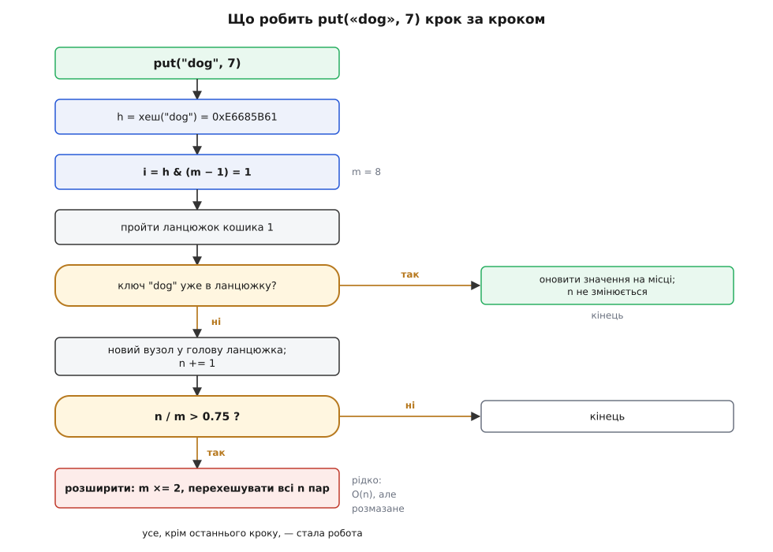
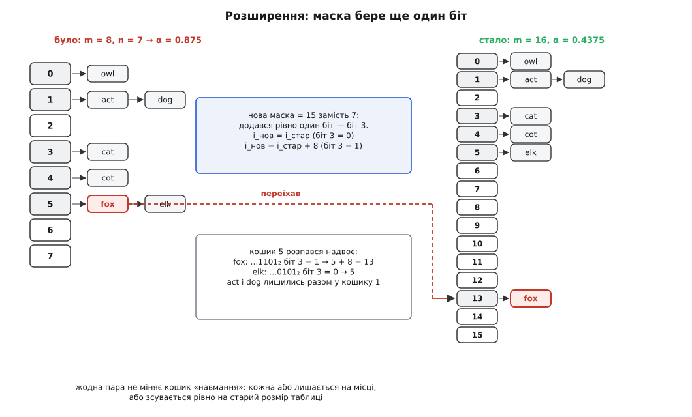

# ⚙️ Сховище «ключ — значення» на хеш-таблиці: робочий код

Майже кожна мова дає таке сховище вбудованим типом, і спокуса ніколи не писати своє — цілком розумна: бібліотечна мапа майже завжди швидша й надійніша за саморобну. Але вбудований тип ховає рівно три рішення, а саме вони й вирішують, чи піде `get` за двадцять наносекунд, чи за двадцять мікросекунд: **як із ключа зробити число**, **як із числа зробити адресу кошика** і **коли таблиця завелика для своєї місткості**. Написати сховище один раз — маленьке, повне, робоче — означає побачити ці три рішення на власні очі. Після цього чужу мапу читаєш інакше: розумієш, чому вона раптом просіла на певних ключах і що з цим робити.

Тож зберімо його по-справжньому: сховище в оперативній пам'яті, ключі — рядки, колізії — окремими ланцюжками (англ. *separate chaining*), місткість росте сама. Не начерк і не псевдокод, а повна реалізація — усе, що потрібно, щоб воно працювало.

## Контракт: що саме будуємо

Три дії й нічого більше:

- `put(ключ, значення)` — покласти пару; якщо ключ уже є, **замінити** його значення;
- `get(ключ)` — дістати значення або чесно сказати, що ключа немає;
- `delete(ключ)` — прибрати пару; сказати, чи було що прибирати.

За цим інтерфейсом мусять постійно триматися чотири твердження — саме вони й роблять структуру правильною:

```
1. кожен ключ присутній у таблиці РІВНО один раз
2. n — справжня кількість пар (не «скільки разів викликали put»)
3. місткість m — степінь двійки
4. α = n / m ≤ 0.75 одразу після кожної операції
```

Перші два — про правильність, другі два — про швидкість. Четверте твердження і є двигуном усієї конструкції: щойно воно ось-ось порушиться, таблиця сама себе перебудовує. Тримаючи його, ми тримаємо й довжину ланцюжків, а отже — сталу вартість доступу.

## Крок 1. З рядка — число

Уся споруда стоїть на хеш-функції, і вимог до неї рівно три: той самий ключ **завжди** дає те саме число (інакше покладене не знайдеться); рахується вона швидко (бо це робота на **кожен** `get`); і розкидає різні ключі якомога рівномірніше.

Спокусливо взяти найпростіше — скласти коди байтів ключа. Порахуймо, чого це коштує насправді. Візьмімо 5000 ключів `user1000`…`user5999`, таблицю на 8192 кошики й порахуймо, скільки в середньому порівнянь потребує один успішний `get`:

```
хеш                        кошиків зайнято   найдовший ланцюжок   порівнянь на get
сума байтів                 32 із 8192              365                133.77
FNV-1a                    3666 із 8192                5                  1.33
```

Різниця стократна — і це не про «трохи повільніше». Сума байтів перетворила O(1) на дещо, дуже схоже на O(n): з 8192 кошиків живі 32, решта таблиці — порожній баласт. Причина проста. Додавання **комутативне**, тож порядок байтів для нього не існує (`"cat"` і `"act"` дають ту саму суму). Ба гірше — воно не переносить інформацію вгору: у наших ключів сума байтів лежить між 640 і 671, тобто всього тридцять два різні значення на п'ять тисяч ключів. Ключі тиснуться в суцільну смужку сусідніх кошиків — і ось найгірше: **збільшення таблиці цього не лікує**. Хоч подвойте місткість, хоч подесятеріть — смужка так і лишиться завширшки тридцять два кошики, бо ширшою її робить не таблиця, а хеш.

Потрібна дія, що **перемішує**. Така є — множення. Помножити число на непарну сталу означає додати до нього кілька його ж зсунутих копій, а зсув — це і є перенесення інформації з молодших розрядів у старші. На цьому й стоїть **FNV-1a**: два кроки на кожен байт.

```
h = 2166136261                       ← базис (offset basis), 32 біти
для кожного байта b ключа:
    h = h XOR b                      ← вкидаємо байт
    h = h · 16777619   (mod 2³²)     ← FNV-просте: розмазуємо його по числу
```

XOR вкидає байт у молодші розряди, множення розмазує його по всьому числу — і наступний байт лягає вже на перемішане. Саме тому порядок тепер важить: у `"cat"` літера `c` встигає перемішатися **двічі** після себе, а в `"act"` — лише раз. Анаграми розлітаються.

**Приклад (як народжується хеш `"cat"`).** Простежмо всі шість кроків:

```
старт            h = 0x811C9DC5
'c' = 0x63   XOR → 0x811C9DA6
             ·p  → 0xE60C2C52
'a' = 0x61   XOR → 0xE60C2C33
             ·p  → 0x58299449
't' = 0x74   XOR → 0x5829943D
             ·p  → 0x06745C07
                        ↑ FNV-1a("cat")
```

Перевіримо на анаграмі: `FNV-1a("act") = 0x2D4A458B`. Ті самі три літери — цілком інше число. Множення зробило те, чого не вміло додавання.

Ім'я функції — від трьох її авторів. Ідею **Ґлен Фаулер** і **К'єм-Фонґ Во** надіслали 1991 року як зауваження рецензентів до комітету IEEE POSIX P1003.2; у наступному раунді голосування **Лендон Курт Нолл** її поліпшив — звідси Fowler/Noll/Vo. Варіант **FNV-1a** переставляє XOR і множення місцями (спершу XOR, потім множення) і дає помітно кращий розкид на коротких даних, ніж первісний FNV-1; саме тому беруть його. Це історія показова тим, що «винахідник» тут не один: була ідея двох, було поліпшення третього, і лише разом вони склали те, чим користуються досі. Важливо й що FNV-1a — **не криптографічна** функція: вона розкидає, але не боронить (до цього ми ще повернемося нижче, коли мова піде про найгірший випадок).

## Крок 2. З числа — кошик

Хеш — це до чотирьох мільярдів, а кошиків у нас вісім. Число треба стиснути до діапазону `0…m−1`. Способів два:

```
i = h mod m          ← будь-яке m; ділення — десятки тактів
i = h & (m − 1)      ← лише m = степінь двійки; одна інструкція
```

Коли `m` — степінь двійки, обидва вирази дають **те саме** число, але маска коштує один такт замість ділення. Ось чому місткість тримають степенем двійки: це не естетика, а швидкодія на найгарячішому шляху програми.

Платня за це є, і про неї варто знати. Маска дивиться **лише на молодші** `log₂m` бітів хешу, а все, що вище, викидає. Отже, хеш мусить бути добрим саме внизу — а FNV-1a саме внизу має документовану ваду. Погляньмо, чому.

FNV-просте `16777619` — **непарне**. А множення на непарне ніколи не змінює нульового біта: молодший біт добутку дорівнює молодшому біту множеного. Тобто вся перемішувальна робота FNV **обходить біт 0 стороною** — його чіпає лише XOR. Розкрутивши це на весь ключ, отримуємо:

```
біт 0 хешу = біт 0 базису ⊕ біт 0 b₁ ⊕ біт 0 b₂ ⊕ … ⊕ біт 0 bₖ
           = 1 ⊕ парність молодших бітів усіх байтів ключа
```

Це вже не хеш, а **біт парності**. І він досяжний: візьмімо 10 000 ключів, складених лише з літер із парним кодом (`b`, `d`, `f`, `h`, …). Молодші біти всіх байтів — нулі, парність — нуль, отже біт 0 хешу дорівнює одиниці **завжди**. Усі десять тисяч ключів лягають у **непарні** кошики; половина таблиці мертва ще до першої вставки.

Ліки коштують дві інструкції — домішати старші біти в молодші перед маскою:

```
h = h ^ (h >> 16)
```

Старша половина (де перемішування FNV якраз добре) лягає XOR-ом на молодшу. Той самий прийом із тієї самої причини стоїть у `HashMap` мови Java — там це `h ^ (h >>> 16)`.

Але будьмо чесні щодо того, скільки це дає. Виміряймо обидва набори ключів:

```
ключі                          хеш              кошиків зайнято   порівнянь на get
user1000…user5999          FNV-1a               3666 із 8192            1.33
user1000…user5999          FNV-1a + домішування 3704 із 8192            1.32
лише парні літери, 10 000  FNV-1a               3835 із 8192            2.13
лише парні літери, 10 000  FNV-1a + домішування 5714 із 8192            1.64
```

На звичайних текстових ключах домішування не дає **нічого** — 1.33 проти 1.32 — і той, хто написав би тут «без цього рядка все розсиплеться», просто збрехав би. На ключах зі структурою в молодших бітах воно економить третину порівнянь. Тобто це дешева **страховка**, а не ліки від усього: два такти на кожен `get` за те, щоб клас поганих ключів не робив із таблиці решето. Ми беремо її саме на цих підставах.

> 🔧 **Навіщо це.** Хеш-функцію й спосіб стискання не можна вибирати нарізно — вони працюють у парі. Маска `& (m−1)` вимагає доброго хешу **в молодших бітах**; остача `mod m` із простим `m` перемішує сама, тож пробачає слабший хеш, але коштує ділення. Класична пастка — узяти хеш, розрахований на остачу за простим модулем, і подати його на маску степеня двійки: функція чудова «загалом», а таблиця стоїть, бо все добро лишилося у викинутих старших бітах. Побачивши, що мапа сповільнилася на певному класі ключів, дивіться передусім сюди — на стик хешу з маскою.

## Крок 3. Ланцюжок: покласти, знайти, прибрати

Колізії неминучі: ключів більше, ніж кошиків. Тож у кошику лежить не пара, а **голова однозв'язного списку** всіх пар із цією адресою. Три операції на ньому виглядають так.

**`get`** рахує хеш, бере індекс, іде ланцюжком і порівнює **повний ключ** — не хеш. Це не педантизм. Хеш має 32 біти, тож за парадоксом днів народження вже на **77 тисячах** ключів шанс, що якась пара збіжиться хешами, дорівнює половині, а на ста тисячах — 69 %. Той, хто звіряє лише хеші, на такому обсязі **гарантовано** колись поверне чуже значення — і цей збій буде невідтворюваний, бо залежить від того, які саме ключі трапилися разом.

**`put`** спершу проходить ланцюжок: якщо ключ уже там — міняє значення **на місці** й **виходить**, не чіпаючи `n`. Якщо ні — чіпляє новий вузол у **голову** (ми вже пройшли ланцюжок, тож нічого не шукаємо повторно; та й свіжі ключі частіше гарячі), збільшує `n` і перевіряє, чи не час рости.

**`delete`** мусить знати **попередній** вузол, щоб перечепити його `next` через видалений. Тому ланцюжком ідуть парою вказівників — поточний і попередній; коли попереднього немає, це голова, і перечіпляти треба сам кошик.


*Один `put` цілком. Кроки до першої розвилки — стала робота: порахувати хеш, накласти маску, ступити в кошик. Перша розвилка вирішує долю `n`: наявний ключ **оновлюється** й лічильник не рушає з місця — переплутати це означає зіпсувати всі подальші рішення про розширення. Друга розвилка спрацьовує рідко, зате дорого: коли пар стало більше трьох чвертей від місткості, таблиця перебудовується цілком.*

## Крок 4. Розширення: маска бере ще один біт

Поки `n` росте, а `m` стоїть, коефіцієнт заповнення `α = n/m` повзе вгору — і разом із ним довжина ланцюжків. За `α = 0.75` ланцюжок має в середньому три чверті елемента, за `α = 10` — десять: `get` став удесятеро повільніший, хоча код не змінився ні на рядок. Тому `α` тримають у шорах: щойно `4n > 3m` (те саме `n/m > 0.75`, лише без дробів), місткість подвоюється, і **всі** пари перераховуються під новий `m`.

Перерахувати доводиться саме тому, що індекс залежить від `m`: та сама пара за іншої місткості належить іншому кошику. Просто скопіювати масив не можна.

Подвоєння тут — не примха. Якби ми доростали на **сталу** добавку `c`, перебудова траплялася б кожні `c` вставок, і сумарна робота на `n` вставок вийшла б порядку `n²/c` — квадрат. Подвоєння робить перебудови дедалі рідшими рівно тією мірою, якою вони дорожчають: сумарне копіювання за всю історію таблиці не перевищує `2n`, тож на одну вставку припадає стала частка. Звідси й береться **амортизована** O(1). Повне виведення — і чому середня довжина ланцюжка дорівнює саме `α`, і як геометрична сума дає ті `2n` — розписано в [аналізі коефіцієнта заповнення](book:algorithms/key-value-store/math-load-factor.md).

А тепер найприємніше. Коли `m` подвоюється, маска `m−1` набуває рівно **одного** нового біта. Розкладімо новий індекс:

```
i_нов = h & (2m − 1) = (h & (m − 1)) | (h & m) = i_стар + (h & m)
```

Отже, кожна пара або **лишається на місці**, або зсувається **рівно на старий розмір таблиці** — і вирішує це один-єдиний біт хешу, той, що доти був за маскою. Ніякої «випадкової перетасовки»: кожен ланцюжок акуратно розпадається щонайбільше надвоє.


*Сьома вставка переповнює таблицю на вісім кошиків (`4·7 = 28 > 24 = 3·8`), і місткість подвоюється. Ланцюжок кошика 5 розпадається: у `fox` новий біт 3 дорівнює одиниці — він переїжджає на `5 + 8 = 13`; у `elk` цей біт нульовий — він лишається на місці. А `act` і `dog` мають нульовий біт 3 обидва, тож їхній ланцюжок переїзд не зачіпає взагалі. Коефіцієнт заповнення падає з 0.875 до 0.4375 — і ланцюжки знову куці.*

Одна тонкість, через яку спотикаються найчастіше: **перебудова не має права звати `put`**. Здається ж зручно — пройти старі пари й покласти кожну в нову таблицю. Але `put` збільшує `n`, тож лічильник подвоївся б на порожньому місці, а далі `put` побачив би перевищений `α` й запустив **ще одну** перебудову зсередини поточної. Тому перебудова **перечіплює** вузли напряму й `n` не чіпає: пари переїхали, нових не додалося.

## Повний код

Ті самі рішення трьома мовами. Це не переклад слово в слово: кожна каже це по-своєму, і в цих розбіжностях — найцікавіше.

:::tabs
```go
package kv

const (
	fnvOffset = 2166136261
	fnvPrime  = 16777619
	initCap   = 8 // степінь двійки
)

type node struct {
	key  string
	val  int
	next *node
}

type Map struct {
	buckets []*node
	n       int
}

func New() *Map { return &Map{buckets: make([]*node, initCap)} }

// FNV-1a + домішування старших бітів у молодші.
// Індексуємо БАЙТИ: key[i] — це байт. А `for _, r := range key` віддавало б
// руни, і на не-ASCII ключах хеш вийшов би інший.
func hash(key string) uint32 {
	h := uint32(fnvOffset)
	for i := 0; i < len(key); i++ {
		h ^= uint32(key[i])
		h *= fnvPrime // переповнення uint32 тут навмисне
	}
	return h ^ (h >> 16)
}

func (m *Map) index(h uint32) int { return int(h & uint32(len(m.buckets)-1)) }

func (m *Map) Get(key string) (int, bool) {
	for p := m.buckets[m.index(hash(key))]; p != nil; p = p.next {
		if p.key == key { // звіряємо ПОВНИЙ ключ, не хеш
			return p.val, true
		}
	}
	return 0, false
}

func (m *Map) Put(key string, val int) {
	i := m.index(hash(key))
	for p := m.buckets[i]; p != nil; p = p.next {
		if p.key == key {
			p.val = val // оновлення наявного: n НЕ росте
			return
		}
	}
	m.buckets[i] = &node{key: key, val: val, next: m.buckets[i]} // у голову
	m.n++
	if 4*m.n > 3*len(m.buckets) { // α > 0.75
		m.grow()
	}
}

func (m *Map) Delete(key string) bool {
	i := m.index(hash(key))
	var prev *node
	for p := m.buckets[i]; p != nil; p = p.next {
		if p.key == key {
			if prev == nil {
				m.buckets[i] = p.next // видаляємо голову
			} else {
				prev.next = p.next
			}
			m.n--
			return true
		}
		prev = p
	}
	return false
}

func (m *Map) grow() {
	old := m.buckets
	m.buckets = make([]*node, len(old)*2) // нова місткість — ДО переіндексації
	for _, head := range old {
		for p := head; p != nil; {
			next := p.next // зберегти: зараз перечепимо p.next
			i := m.index(hash(p.key))
			p.next = m.buckets[i]
			m.buckets[i] = p
			p = next
		}
	}
	// m.n не чіпаємо: пари переїхали, нових не з'явилося
}

func (m *Map) Len() int { return m.n }
```
```rust
const FNV_OFFSET: u32 = 2166136261;
const FNV_PRIME: u32 = 16777619;
const INIT_CAP: usize = 8; // степінь двійки

pub struct Map {
    // ланцюжок — вектор пар, а не список на вказівниках: пари кошика лежать
    // поспіль, тож прохід ланцюжком — це прохід суцільною пам'яттю
    buckets: Vec<Vec<(String, i64)>>,
    n: usize,
}

fn hash(key: &str) -> u32 {
    let mut h = FNV_OFFSET;
    for b in key.as_bytes() {
        h ^= *b as u32;
        h = h.wrapping_mul(FNV_PRIME); // переповнення тут навмисне, не помилка
    }
    h ^ (h >> 16)
}

impl Map {
    pub fn new() -> Self {
        Map { buckets: vec![Vec::new(); INIT_CAP], n: 0 }
    }

    fn index(&self, h: u32) -> usize { h as usize & (self.buckets.len() - 1) }

    pub fn get(&self, key: &str) -> Option<&i64> {
        let i = self.index(hash(key));
        self.buckets[i]
            .iter()
            .find(|(k, _)| k == key) // звіряємо ПОВНИЙ ключ
            .map(|(_, v)| v)
    }

    pub fn put(&mut self, key: &str, val: i64) {
        let i = self.index(hash(key));
        if let Some(slot) = self.buckets[i].iter_mut().find(|(k, _)| k == key) {
            slot.1 = val; // оновлення наявного: n НЕ росте
            return;
        }
        self.buckets[i].push((key.to_string(), val));
        self.n += 1;
        if 4 * self.n > 3 * self.buckets.len() {
            self.grow();
        }
    }

    pub fn remove(&mut self, key: &str) -> bool {
        let i = self.index(hash(key));
        match self.buckets[i].iter().position(|(k, _)| k == key) {
            // порядок усередині кошика не значить нічого,
            // тож викидаємо за O(1), не зсуваючи хвіст
            Some(p) => { self.buckets[i].swap_remove(p); self.n -= 1; true }
            None => false,
        }
    }

    fn grow(&mut self) {
        let new_cap = self.buckets.len() * 2; // рахуємо ДО того, як позичимо buckets
        let old = std::mem::replace(&mut self.buckets, vec![Vec::new(); new_cap]);
        for chain in old {
            for (k, v) in chain {
                let i = self.index(hash(&k)); // індекс — за НОВОЮ місткістю
                self.buckets[i].push((k, v));
            }
        }
        // self.n не чіпаємо
    }

    pub fn len(&self) -> usize { self.n }
}
```
```cpp
#include <cstdint>
#include <optional>
#include <string>
#include <utility>
#include <vector>

class Map {
    struct Node {
        std::string key;
        int64_t val;
        Node* next;
    };

    static constexpr size_t kInitCap = 8; // степінь двійки

    std::vector<Node*> buckets_;
    size_t n_;

    // Байти беремо як unsigned char: у char (знаковому на більшості платформ)
    // байт ≥ 128 розширився б знаком і зіпсував старші біти хешу.
    static uint32_t hash(const std::string& key) {
        uint32_t h = 2166136261u;
        for (unsigned char c : key) {
            h ^= c;
            h *= 16777619u; // переповнення uint32 тут навмисне
        }
        return h ^ (h >> 16);
    }

    size_t index(uint32_t h) const { return h & (buckets_.size() - 1); }

    void grow() {
        std::vector<Node*> old = std::move(buckets_);
        buckets_.assign(old.size() * 2, nullptr); // нова місткість — ДО переіндексації
        for (Node* p : old) {
            while (p) {
                Node* next = p->next; // зберегти: зараз перечепимо p->next
                size_t i = index(hash(p->key));
                p->next = buckets_[i];
                buckets_[i] = p;
                p = next;
            }
        }
        // n_ не чіпаємо: вузли переїхали, нових пар не з'явилося
    }

public:
    Map() : buckets_(kInitCap, nullptr), n_(0) {}

    ~Map() {
        for (Node* p : buckets_)
            while (p) { Node* next = p->next; delete p; p = next; }
    }

    // вузли тримаємо сирими вказівниками — копіювання дало б подвійне звільнення
    Map(const Map&) = delete;
    Map& operator=(const Map&) = delete;

    std::optional<int64_t> get(const std::string& key) const {
        for (Node* p = buckets_[index(hash(key))]; p; p = p->next)
            if (p->key == key) // звіряємо ПОВНИЙ ключ, не хеш
                return p->val;
        return std::nullopt;
    }

    void put(const std::string& key, int64_t val) {
        size_t i = index(hash(key));
        for (Node* p = buckets_[i]; p; p = p->next)
            if (p->key == key) {
                p->val = val; // оновлення наявного: n_ НЕ росте
                return;
            }
        buckets_[i] = new Node{key, val, buckets_[i]}; // у голову
        ++n_;
        if (4 * n_ > 3 * buckets_.size()) grow();
    }

    bool remove(const std::string& key) {
        size_t i = index(hash(key));
        Node* prev = nullptr;
        for (Node* p = buckets_[i]; p; prev = p, p = p->next)
            if (p->key == key) {
                if (prev) prev->next = p->next;
                else buckets_[i] = p->next; // видаляємо голову
                delete p;                   // без цього — витік пам'яті
                --n_;
                return true;
            }
        return false;
    }

    size_t size() const { return n_; }
};
```
:::

Три вкладки — три різні відповіді на одні й ті самі питання, і кожна показує щось своє.

**«Ключа немає» кожна мова каже своєю граматикою.** Go повертає другим значенням `bool`, Rust — `Option<&i64>`, C++ — `std::optional`. Спільне тут головне: відсутність ключа — це **не** нуль і не порожній рядок, а окремий стан. Мапа, що на відсутній ключ повертає нуль, не дає відрізнити «немає» від «є, і воно нуль» — і саме на цьому виростає окремий клас багів.

**Ланцюжок не конче список на вказівниках.** Go і C++ чіпляють вузли `next`-вказівниками — це класика, і в кошику видно самі комірки. Rust натомість тримає `Vec<(String, i64)>`, і це не обхід позичальника, а свідомо краще: пари кошика лежать у пам'яті **поспіль**, тож прохід ланцюжком читає суцільну ділянку, а не стрибає за випадковими адресами. Список на вказівниках платить окремим виділенням на кожен вузол і промахом [кешу](book:programming/cache) на кожному кроці — а кеш карає за стрибки набагато дошкульніше, ніж за зайве порівняння. Не випадково `swap_remove` у Rust-варіанті викидає пару за O(1): порядок усередині кошика не значить **нічого**, тож переставити останню пару на місце видаленої — цілком чесно.

**Хто прибирає за вузлами.** Go має збирача сміття: від'єднав вузол — і забув. Rust звільняє `Vec` разом із таблицею автоматично. У C++ за це відповідаєте ви: `delete` у `remove`, деструктор для решти, заборонене копіювання — щоб копія не звільнила чужі вузли вдруге. Це та сама структура на [купі](book:programming/heap-dynamic-memory) в усіх трьох, просто дві мови ведуть облік за вас, а третя дивиться, як ви ведете його самі. Хто хоче побачити ланцюжок геть упритул — там, де вузол це буквально адреса в пам'яті, — знайде цю механіку в [адресах і покажчиках](book:programming/addresses-pointers).

## Що це коштує

```
операція   середнє (α ≤ 0.75)         найгірше
get        O(1 + α)  →  O(1)          O(n)
put        O(1 + α)  →  O(1)          O(n)
           амортизовано (з подвоєнням)
delete     O(1 + α)  →  O(1)          O(n)
пам'ять    O(n + m),  m < 2n / 0.75
```

Середній випадок читається просто: одиниця — це порахувати хеш і стрибнути в кошик (робота, що не залежить від `n` узагалі), а `α` — очікувана довжина ланцюжка. Тримаючи `α ≤ 0.75`, ми тримаємо другий доданок сталим, і вся операція стає O(1). Це не теорія: на тих самих 5000 ключах за `m = 8192` (тобто `α = 0.61`) найдовший ланцюжок виявився **п'ять**, а середній успішний `get` коштував 1.32 порівняння.

А от найгірший випадок — не формальність. O(n) настає, коли всі ключі падають в один кошик, і ланцюжок стає тим самим лінійним списком, від якого ми тікали. Своїми ключами ви до цього дійдете хіба випадково — а от **чужими** дійдете напевно, і це вже не гіпотеза. На конгресі 28C3 (2011) **Александер Клінк** і **Юліан Вельде** показали атаку **hash-flooding**: сервер, що складає в мапу ключі з запиту (поля форми, параметри), а хеш має сталий і всім відомий, можна покласти, надіславши кілька тисяч ключів з однаковим хешем — кожна вставка стає O(n), а разом вони дають O(n²), і процесор з'їдено кількома кілобайтами тіла запиту. Уразливими виявилися майже всі тодішні PHP, Ruby, Python, Java, ASP.NET, v8 — не через помилку в коді, а через саму конструкцію.

Лікували це **випадковим зерном** (англ. *seed*) на кожен запуск процесу: хеш стає непередбачуваним, і заздалегідь підібрати колізії неможливо. Проте вже 2012-го на 29C3 показали, що для слабких функцій самого зерна замало — його дістають диференціальним криптоаналізом. Тоді **Жан-Філіпп Омассон** і **Даніель Бернстайн** запропонували **SipHash**: функцію з ключем, стійку до такого добору й водночас швидку — її й узяли Rust, Ruby, Perl 5, Python. Тож коли ключі приходять **ззовні**, FNV-1a вже не годиться: нам потрібне не лише розкидання, а й непередбачуваність. Для внутрішніх ключів (шлях у файлі, ім'я змінної, ідентифікатор із власної бази) FNV-1a — правильний вибір: він швидший і робить рівно те, що треба.

## Пастки

Ось те, на чому саморобна мапа ламається найчастіше — і чому саме.

- **Слабка хеш-функція.** Найдорожча помилка й найтихіша: код правильний, тести зелені, структура «працює» — просто в сто разів повільніше. Сума байтів дала 133.77 порівняння замість 1.33. Хеш ніколи не оцінюють на око — його міряють: скільки кошиків зайнято й який найдовший ланцюжок.
- **Забути, що ключ уже є.** Якщо `put` не пройде ланцюжок, а одразу чіпляє вузол у голову, той самий ключ опиниться в таблиці двічі. Далі все розлазиться тихо: `n` бреше (а отже, розширення спрацьовує не тоді), `get` повертає то нове значення, то старе — залежно від того, який вузол трапиться перший, — а `delete` прибирає лише один із двох, і ключ «видалився, але лишився». Той самий підступ має і **забутий `return`** після оновлення: значення оновилося, а виконання пішло далі й додало дубль.
- **Звіряти хеші замість ключів.** Спокуса зрозуміла — порівняти два числа дешевше, ніж два рядки. Ціна — чуже значення на вашому ключі, десь після сімдесяти семи тисяч записів, невідтворювано. Хеш звужує пошук до кошика; вирок виносить лише повне порівняння ключа.
- **Розширення.** Тут одразу чотири різні способи схибити: порахувати індекс за **старим** `m` (пари ляжуть не туди, і `get` їх більше не знайде); не зберегти `next` перед тим, як перечепити вузол (решта ланцюжка загубиться назавжди); покликати `put` замість прямого перечіплення (подвоєний `n` і перебудова всередині перебудови); не звільнити старий масив у C++ (витік, що росте разом із таблицею).
- **Байти проти символів.** У Go `for _, r := range key` віддає **руни**, а не байти, — хеш того самого рядка вийде інший, ніж у сусідній реалізації, і сховище перестане бути сумісним саме на не-ASCII ключах. У C++ `char` на більшості платформ **знаковий**, тож байт `0xC3` перетвориться на `-61`, знак розширить його до `0xFFFFFFC3` і зіпсує весь хеш. Обидві мови вимагають сказати «байт» явно.
- **Тримати посилання на значення через `put`.** Будь-який `put` може запустити перебудову, а вона рухає вузли. Вказівник, узятий до `put`, після нього може дивитися в нікуди. Go і C++ дозволять вам це зробити й нічого не скажуть; Rust просто не скомпілює — і має рацію.

Останнє, що варто тримати в голові: усе, що ми тут зібрали, тримається на чесності хеш-функції, а вона нічого не обіцяє на ключах, дібраних проти неї. Хеш-таблиця — це структура, яка дає O(1) **в середньому за припущення, що ключі не змовляються**. Поки ключі ваші власні — припущення виконується, і сховище літає. Щойно ключі почав добирати хтось інший — воно перестає виконуватися, і разом із ним зникає та сама стала вартість, заради якої все й будувалося.
