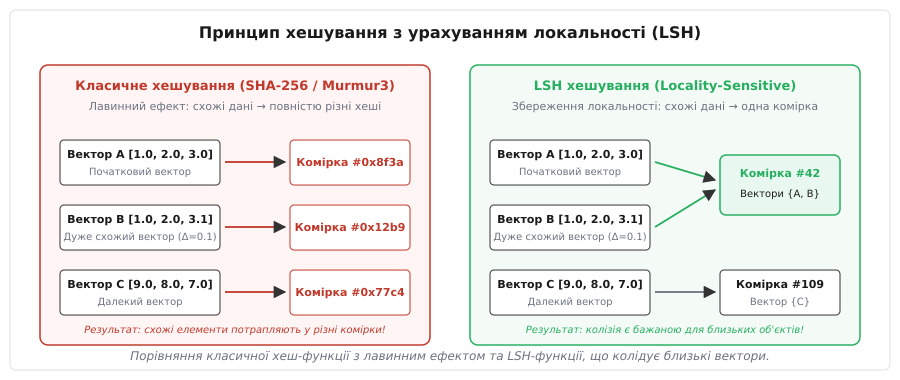
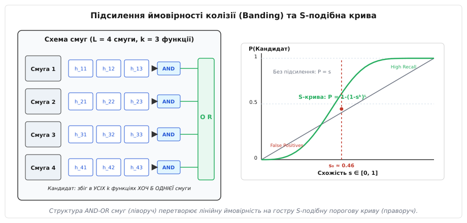
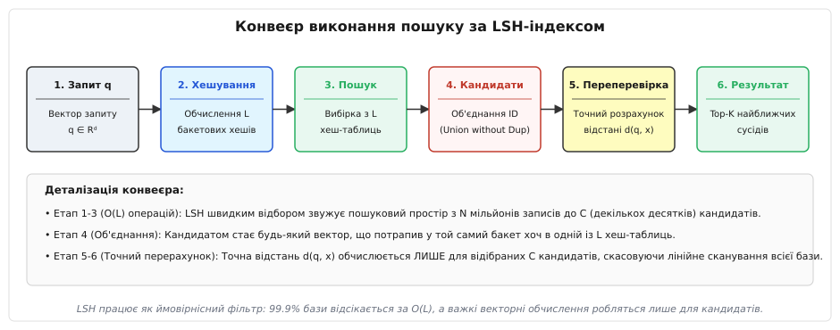

# Хешування з урахуванням локальності (Locality-Sensitive Hashing)

<preknowlist>
- [Хеш-таблиці](book:algorithms/hash-table) — базова структура даних для швидкого пошуку за точним збігом.
- [Індекс Жаккара](book:math/jaccard-index) — міра схожості двох множин на основі їхнього перетину та об'єднання.
- [Косинусна відстань](book:math/cosine-distance) — кутова міра схожості двох векторів у багатовимірному просторі.
- [Векторний простір](book:math/vector-space) — математичне представлення об'єктів у вигляді точок або векторів.
- [Пошук найближчих сусідів](book:algorithms/k-nearest-neighbors) — задача знаходження елементів, найближчих за обраною метрикою.
</preknowlist>

Уявіть сучасну високонавантажену пошукову систему, сервіс рекомендацій або векторну базу даних, що зберігає 100 мільйонів ембеддингів зображень, аудіозаписів та текстових документів. Кожен об'єкт у такій системі представлений дійсним вектором високої вимірності (наприклад, 1536 вимірів у сучасних нейронних моделях OpenAI text-embedding-3 чи BERT). Коли користувач надсилає запит, система повинна знайти `K` найближчих векторів у цьому 1536-вимірному просторі за обмежений інтервал часу в декілька мілісекунд.

Прямий розрахунок евклідової або косинусної відстані між вектором запиту та кожним із 100 мільйонів об'єктів бази даних вимагає послідовного сканування (Linear Scan). Для одного запиту це означає виконання `10⁸ × 1536 ≈ 1.5 × 10¹¹` операцій з плаваючою комою. Навіть на потужному серверному процесорі таке сканування займе від декількох секунд до хвилин. Класичні просторові дерева пошуку (`kd-дерева` чи `R-дерева`) виявляються повністю безсилими: при зростанні вимірності понад 20 вимірів об'єм простору зростає експоненціально, і дерева повністю втрачають здатність відсікати гілки, вироджуючись у те саме послідовне сканування. Це явище відоме в інформатиці як «прокляття вимірності» (Curse of Dimensionality).

Для розв'язання цієї кризи застосовують **хешування з урахуванням локальності (Locality-Sensitive Hashing, LSH)** — клас ймовірнісних алгоритмів та структур даних, які докорінно змінюють фундаментальну властивість класичного хешування. Замість усунення колізій LSH навпаки робить колізії **бажаними** для близьких об'єктів і малоймовірними для далеких. Хронологічному розвитку цього підходу — від перших рішень дедуплікації веб-сторінок у 1990-х роках до сучасних векторних індексів — присвячено вставку [📜 Історія LSH](book:algorithms/locality-sensitive-hashing/hist-lsh.md).

## Проблема класичного хешування у задачах схожості

У традиційному програмуванні хеш-функції (наприклад, MD5, SHA-256, MurmurHash3 або FNV-1a) проектують вхідні дані довільної довжини у фіксоване ціле число. Головною вимогою до таких функцій є забезпечення **лавинного ефекту (Avalanche Effect)**: якщо вхідні дані змінюються хоча б на один біт, вихідне хеш-значення повинно змінитися докорінно й випадковим чином (приблизно 50% бітів змінюють свій стан).

Лавинний ефект є критично важливим для криптографії та класичних хеш-таблиць, оскільки він забезпечує рівномірний розподіл елементів по комірках і запобігає кластеризації. Однак для задач пошуку за схожістю ця властивість є руйнівною. Два вектори `A = [1.0, 2.0, 3.0]` та `B = [1.0, 2.0, 3.1]` знаходяться геометрично дуже близько один до одного, але їхні класичні хеш-значення виявляться абсолютно різними числами (наприклад, `0x8f3a...` та `0x12b9...`). У результаті схожі елементи потрапляють у повністю різні бакети хеш-таблиці, що унеможливлює використання класичного хешування для індексування метричних просторів.


*Порівняння класичної хеш-функції з лавинним ефектом та LSH-функції, що колідує близькі вектори.*

LSH скасовує лавинний ефект. Замість цього LSH проектує точки високовимірного простору у низьковимірний простір відбитків таким чином, щоб ймовірність колізії двох елементів була монотонно зростаючою функцією від їхньої схожості (або спадною функцією від відстані між ними):

```
Якщо Distance(x, y) мала   ──► Ймовірність P(h(x) == h(y)) ВЕЛИКА
Якщо Distance(x, y) велика ──► Ймовірність P(h(x) == h(y)) МАЛА
```

## Математичне обґрунтування та прокляття вимірності

Щоб зрозуміти, чому звичайні дерева пошуку ламаються у високовимірному просторі, розглянемо геометрію `d`-вимірного куба зі стороною 1. Об'єм цього куба дорівнює `1ᵈ = 1`. Якщо ми впишемо у цей куб `d`-вимірну гіперсферу радіуса `R = 0.5`, її об'єм обчислюється як:

```
V_sphere(d) = (π^(d/2) / Γ(d/2 + 1)) · Rᵈ
```

При зростанні `d` об'єм вписаної гіперсфери прямує до нуля із вражаючою швидкістю. Наприклад, для `d = 20` об'єм сфери становить менше 0.000025 від об'єму куба. Це означає, що майже весь об'єм високовимірного куба зосереджений у його «кутках».

Більше того, за лемою про концентрацію міри (Measure Concentration Phenomenon), у просторах високої вимірності відстані між будь-якою парою випадково вибраних точок стають майже однаковими. Відношення стандартного відхилення відстаней до середнього значення прямує до нуля при `d → ∞`. Через це традиційні геометричні межі (наприклад, поділ простору гіперплощинами у `kd-дереві`) втрачають вибіркову здатність: практично кожна куля запиту перетинає абсолютно всі перегородки дерева, вимагаючи обходу 100% вузлів.

LSH обходить цю фундаментальну перешкоду шляхом переходу від детермінованого геометричного розбиття до **імовірнісного відбору кандидатів**. Замість того, щоб гарантувати повернення абсолютно найближчого сусіда у 100% випадків, LSH гарантує повернення сусіда з високою ймовірністю `1 - δ` за підлінійний час.

## Формальна математична модель LSH-сімейства

Нехай `(M, d)` — метричний простір з функцією відстані `d(x, y)`. Сімейство функцій хешування `H = {h: M → U}` називається **`(r₁, r₂, p₁, p₂)`-чутливим** відносно метрики `d`, якщо для будь-яких двох точок `x, y ∈ M` та для випадково обраної функції `h ∈ H` виконуються дві фундаментальні умови:

1. Якщо відстань між точками не перевищує межу близькості `r₁` (`d(x, y) ≤ r₁`), то ймовірність збігу їхніх хеш-значень є не меншою за `p₁`:
   `P[h(x) = h(y)] ≥ p₁`.
2. Якщо відстань між точками є не меншою за межу віддаленості `r₂` (`d(x, y) ≥ r₂`), то ймовірність збігу їхніх хеш-значень не перевищує `p₂`:
   `P[h(x) = h(y)] ≤ p₂`.

При цьому вимагається, щоб `r₁ < r₂` та `p₁ > p₂`. Інтервал між `r₁` та `r₂` називається зоною невизначеності. Чим більша різниця між ймовірностями `p₁` та `p₂`, тим легше відокремити релевантні сусідні вектори від випадкового шуму. Строгі математичні доведення для різних метричних просторів наведені у вставці [🧮 Математичні основи LSH-сімейств](book:algorithms/locality-sensitive-hashing/math-lsh-family.md).

## Ключові сімейства LSH за типом метрики

Конструкція LSH-функції фундаментально залежить від геометричної метрики, якою вимірюється схожість об'єктів. Існує три основних класи LSH-функцій для найуживаніших метрик.

### 1. MinHash (для множин та метрики Жаккара)

Коли об'єкти представлені дискретними множинами (наприклад, множини слів у документі, бінарні ознаки або `k`-грами), схожість вимірюється коефіцієнтом Жаккара:

```
J(A, B) = |A ∩ B| / |A ∪ B|
```

Відстань Жаккара дорівнює `d_J(A, B) = 1 - J(A, B)`.

Для побудови хеш-функції MinHash генерується випадкова перестановка `π` простору всіх можливих елементів універсуму. Значенням хеш-функції `h_π(A)` є найменший номер елемента множини `A` після застосування перестановки `π`:

```
h_π(A) = min_{x ∈ A} π(x)
```

Математично доведено, що ймовірність колізії двох MinHash-значень точно дорівнює коефіцієнту Жаккара:

```
P[h_π(A) == h_π(B)] = J(A, B)
```

Сформувавши вектор із `K` таких мінімальних хешів для різних випадкових перестановок `π₁, π₂, ..., π_K`, отримують **сигнатуру MinHash**, яка дозволяє стиснути дискретну множину будь-якого розміру до фіксованого вектора цілих чисел.

На практиці замість явного генерування гігантських перестановок `π` використовують `K` хеш-функцій вигляду `h_i(x) = (a_i · x + b_i) mod P`, де `a_i, b_i` — випадкові коефіцієнти, а `P` — велике просте число.

### 2. SimHash / Random Hyperplanes (для кутової та косинусної відстані)

Для векторів у дійснозначному просторі `Rᵈ` схожість найчастіше оцінюють косинусом кута `θ` між ними. Косинусна відстань визначається як `d_cos(u, v) = 1 - cos(u, v)`.

Мозес Чарікар запропонував метод випадкових гіперплощин (SimHash). Випадкова хеш-функція задається випадковим вектором `r`, компоненти якого згенеровані з стандартного нормального розподілу `N(0, 1)`. Цей вектор задає гіперплощину, яка проходить через початок координат і є перпендикулярною до `r`.

Значення хешу дорівнює `1`, якщо вектор `u` лежить по один бік від гіперплощини, і `0`, якщо по інший:

```
h_r(u) = 1,  якщо (r · u) ≥ 0
         0,  якщо (r · u) < 0
```

Ймовірність того, що випадкова гіперплощина НЕ розділить два вектори `u` та `v`, прямо пропорційна куту `θ` між ними:

```
P[h_r(u) == h_r(v)] = 1 - θ / π
```

Набір із `B` таких гіперплощин перетворює багатовимірний вектор у `B`-бітний бінарний код (Fingerprint). Відстань Хеммінга (кількість відмінних бітів) між двома бінарними кодами є прямо пропорційною геометричному куту між вихідними векторами.

Завдяки використанню апаратної інструкції `POPCNT` (Population Count) обчислення відстані Хеммінга між двома 64-бітними або 256-бітними бінарними кодами виконується за єдиний такт процесора, що забезпечує колосальну швидкість первинного порівняння.

### 3. p-Стабільні проекції (для евклідової відстані L2 та норми L1)

Для класичної евклідової відстані `L2` (`||x - y||₂`) застосовують проектування на випадкові прямі з використанням `p`-стабільних розподілів ймовірностей.

Розподіл `D` називається `p`-стабільним, якщо для незалежних випадкових величин `X₁, ..., X_n ~ D` та будь-яких дійсних коефіцієнтів `a₁, ..., a_n` сума `∑ a_i X_i` має такий самий розподіл, як і величина `(∑ |a_i|^p)^(1/p) · X`.

* Для норми `L2` (`p = 2`) `p`-стабільним є стандартний нормальний розподіл Гаусса `N(0, 1)`.
* Для норми `L1` (`p = 1`) `p`-стабільним є розподіл Коші.

Одновимірна пряма розбивається на відрізки (бакети) однаковою ширини `w` із випадковим зсувом `b ∈ [0, w]`. Хеш-функція обчислюється як індекс бакета, у який потрапляє проекція вектора `x`:

```
h_{a, b}(x) = floor((a · x + b) / w)
```

Де `a ~ N(0, I)` — випадковий вектор напрямку проекції. Ширина бакета `w` регулює роздільну здатність: мале значення `w` робить хеш дуже чутливим до найменших відхилень, а велике `w` групує ширші околиці точок.

## Підсилення ймовірностей через смуги (Banding / AND-OR Конструкція)

Один біт хешу або одна хеш-функція забезпечує надто м'яке відокремлення: ймовірність колізії змінюється лінійно, через що виникає величезна кількість як хибнопозитивних (False Positive), так і хибнонегативних (False Negative) помилок.

Щоб сформувати круту порогову характеристику відбору кандидатів, застосовують двоуровневу схему **Banding (групування у смуги)**:

1. Генерують загалом `M = k × L` незалежних LSH-функцій.
2. Розділяють ці функції на `L` незалежних **смуг (Bands)**, кожна з яких містить `k` функцій.
3. Об'єкт `x` індексується у кожній із `L` смуг окремо. Хешем смуги є комбінація (композиція) усіх `k` хеш-значень цієї смуги.
4. **Правило відбору кандидатів**: два об'єкти `x` та `y` вважаються кандидатами на найближчих сусідів, якщо вони повністю колідують по всіх `k` функціях **принаймні в одній** із `L` смуг (Логічна схема **AND всередині смуги, OR між смугами**).


*Структура AND-OR смуг (ліворуч) перетворює лінійну ймовірність на гостру S-подібну порогову криву (праворуч).*

Обчислимо підсумкову ймовірність того, що два об'єкти зі схожістю `s = P[h(x) == h(y)]` будуть відібрані як кандидати:

```
1. P(збіг в усіх k функціях 1 смуги) = sᵏ               [правило AND]
2. P(НЕзбіг у 1 смузі)             = 1 - sᵏ
3. P(НЕзбіг у ВСІХ L смугах)       = (1 - sᵏ)ᴸ          [правило добутку для L смуг]
4. P(Кандидат: збіг хоча б у 1)    = 1 - (1 - sᵏ)ᴸ       [підсумкова S-крива]
```

Ця формула створює характерну **S-подібну криву (S-Curve)**. Точка перегіну функції (поріг схожості `s₀`) обчислюється як:

```
s₀ ≈ (1 / L)^(1 / k)
```

Якщо схожість об'єктів `s > s₀`, ймовірність потрапляння у кандидати стрімко прямує до `1.0` (високий Recall). Якщо схожість `s < s₀`, ймовірність колізії падає майже до `0.0` (мінімальна кількість хибних спрацьовувань). Змінюючи параметри `k` та `L`, інженер може точно налаштовувати поріг схожості системи під конкретні вимоги бізнесу.

## Анатомія LSH-індексу та конвеєр обробки запиту

На практиці LSH-індекс реалізується у вигляді масиву з `L` хеш-таблиць `T₁, T₂, ..., T_L`.


*Конвеєр виконання пошуку за LSH-індексом.*

### Етап 1: Індексування даних (Insertion)
Коли у базу додається новий вектор `v` із вказаним ідентифікатором `ID`:
1. Для кожної смуги `b ∈ [1, L]` обчислюється `k` хеш-значень `h_{b,1}(v), ..., h_{b,k}(v)`.
2. Комбінований хеш смуги `H_b(v) = Combine(h_{b,1}, ..., h_{b,k})` використовується як ключ для вставки `ID` у хеш-таблицю `T_b`.

### Етап 2: Виконання запиту (Query Pipeline)
Коли надходить вектор запиту `q` для пошуку `K` найближчих сусідів:
1. **Обчислення хешів запиту**: Для вектора `q` обчислюються ті самі `L` бакетових хешів `H₁(q), H₂(q), ..., H_L(q)`.
2. **Первинна вибірка з L таблиць**: Система дістає списки ідентифікаторів векторів із відповідних бакетів кожної з `L` хеш-таблиць: `Bucket_1 = T₁[H₁(q)], ..., Bucket_L = T_L[H_L(q)]`.
3. **Формування множини кандидатів**: Обчислюється об'єднання дедуплікованих ідентифікаторів: `Candidates = Bucket_1 ∪ Bucket_2 ∪ ... ∪ Bucket_L`. Завдяки LSH розмір множини кандидатів `|Candidates|` становить незначну частку від загального обсягу бази `N` (наприклад, декілька десятків або сотень елементів замість 100 мільйонів).
4. **Точний реранкінг (Exact Reranking)**: Для кожного елемента з множини `Candidates` зчитується його повнорозмірний вектор і обчислюється ТОЧНА відстань `d(q, candidate)`.
5. **Сортування та повернення Top-K**: Кандидати сортуються за зростанням точної відстані, і `K` найближчих об'єктів повертаються користувачеві.

Готові реалізації цього конвеєра з вичерпними коментарями та контрольними прикладами наведені у вставках:
* [⚙️ Практична реалізація LSH-індексу](book:algorithms/locality-sensitive-hashing/proj-lsh-index.md) — робочий код мовами C та C++.
* [📋 Інтерфейс та контракт LSH-бібліотеки](book:algorithms/locality-sensitive-hashing/api-lsh.md) — повний контракт системного C-ABI та C++20 API.

## Багатопробовий LSH (Multi-Probe LSH)

Класичний LSH шукає кандидатів **тільки** в тих бакетах хеш-таблиць, хеш яких тотожно збігається з хешем запиту `H_b(q)`. Якщо вектор запиту лежить близько до межі бакета, його найближчий сусід може потрапити у суміжний сусідній бакет. Щоб перекрити це розходження, класичному LSH потрібна велика кількість смуг `L` (наприклад, `L = 50...100`), що пропорційно збільшує витрати оперативної пам'яті.

У 2007 році Кін Лв (Qin Lv), Вільям Джозефсон (William Josephson), Чже Ван (Zhe Wang), Мозес Чарникар (Moses Charikar) та Кай Лі (Kai Li) запропонували алгоритм **Multi-Probe LSH**.

Ідея Multi-Probe LSH полягає у тому, що замість перевірки єдиного бакета `H_b(q)` алгоритм оцінює ймовірність потрапляння точки у сусідні бакети і перевіряє декілька найбільш ймовірних суміжних комірок хеш-таблиці. Для хеш-функцій проекції це відповідає перевірці сусідніх бакетів `H_b(q) ± 1`, `H_b(q) ± 2`.

Завдяки Multi-Probe LSH вдається досягти такого самого рівня точності (Recall) при зменшенні кількості хеш-таблиць `L` у 10–15 разів. Це зменшує обсяг оперативної пам'яті індексу з гігабайтів до сотень мегабайтів.

## Несиметричний LSH (ALSH) для скалярного добутку (MIPS)

У багатьох задачах машинного навчання (наприклад, рекомендаційні системи або факторизація матриць) виникає потреба шукати вектори, що максимізують **скалярний добуток** (Maximum Inner Product Search, MIPS): `argmax_{v} (u · v)`.

Скалярний добуток `u · v = ||u|| ||v|| cos(u, v)` залежить не лише від кута між векторами, а й від їхніх довжин (норм). Через це він не задовольняє аксіоми метрики, і класичний LSH безпосередньо до нього не застосовується.

У 2014 році Аншумал Шиврамакаря (Anshumali Shrivastava) та Пін Лі (Ping Li) розробили **Несиметричний LSH (Asymmetric LSH, ALSH)**.

Вони створили математичне перетворення (трансформацію векторів), яке перетворює задачу пошуку найбільшого скалярного добутку у задачу евклідової відстані в просторі трохи вищої вимірності. Вектор запиту `u` та вектор бази даних `v` проектуються у розширений простір різними несиметричними відображеннями:

```
u' = [ u / max_norm,  0, 0, ... ]
v' = [ v / max_norm,  sqrt(1 - ||v||² / max_norm²), ... ]
```

Після такого перетворення мінімізація евклідової відстані `||u' - v'||₂²` у розширеному просторі виявляється еквівалентною максимізації скалярного добутку `u · v` у вихідному просторі, що дозволяє застосовувати класичні індекси LSH для MIPS.

## Порівняльний аналіз: LSH проти HNSW та IVF-PQ

У сучасній інженерії векторного пошуку існує три основних класи індексів:
1. **LSH (Locality-Sensitive Hashing)**: Рандомізоване хешування.
2. **HNSW (Hierarchical Navigable Small World)**: Ієрархічні графи малого світу.
3. **IVF-PQ (Inverted File with Product Quantization)**: Інвертований індекс із векторним квантуванням.

| Критерій | LSH (Locality-Sensitive) | HNSW (Графовий) | IVF-PQ (Квантування) |
| :--- | :--- | :--- | :--- |
| **Швидкість пошуку (QPS)** | Висока (при малих `L`) | Екстремально висока | Висока |
| **Витрати RAM на індекс** | Помірні (`O(N · L)`) | Дуже високі (`O(N · degree)`) | Найнижчі (стиснення у 8-16 разів) |
| **Час побудови індексу** | Екстремально швидкий `O(N · L)` | Повільний `O(N log N)` | Повільний (потребує k-means) |
| **Динамічні вставки (Streaming)** | **Ідеальні `O(L)` (без блокувань)** | Важкі (перебудування графа) | Середні (додавання в кластер) |
| **Дискретні / бінарні ознаки** | **Найкращі (MinHash/SimHash)** | Неідеальні | Не підходять |

LSH залишається беззаперечним лідером у системах із високою інтенсивністю потокових оновлень (Streaming Dynamic Data), а також при роботі з бінарними відбитками та дискретними множинами ознак.

## Практичні пастки та граничні випадки

При практичній експлуатації LSH-індексів у високонавантажених системах виникають наступні нюанси:

1. **Дисбаланс розміру бакетів (Heavy Hitters)**: За наявності популярних векторів або частих слів окремі бакети хеш-таблиць можуть розростатися до десятків тисяч елементів. Це призводить до сплеску затримок (Latency Spikes) при реранкінгу. Захистом є введення жорсткої межі на максимальну кількість кандидатів (`max_candidates`), після досягнення якої збір зупиняється.
2. **Вибір ширини бакета `w` у евклідовому LSH**: Якщо обрати `w` занадто малим, суміжні точки потраплятимуть у сусідні бакети й втрачатимуть збіг; якщо занадто великим — усі вектори опиняться в одному бакеті, що зведе вибіркову здатність до нуля. Оптимальне `w` зазвичай становить від 2 до 6 середніх міжвекторних відстаней.
3. **Обсяг оперативної пам'яті**: Збереження `L` хеш-таблиць вимагає пам'яті під вказівники та вузли списків. При `L = 100` накладні витрати пам'яті можуть перевищити розмір самих векторів даних.

> 🔧 **Навіщо це.**
> LSH є незамінним у сценаріях, де розмірність даних перевищує сотні вимірів, а база даних постійно доповнюється в реальному часі (Streaming Data). На відміну від графових індексів (таких як HNSW), які вимагають складного глобального перебудування графів суміжності при додаванні векторів, LSH-індекс дозволяє виконувати миттєву вставку за `O(L)` без блокування всього індексу.

## Підсумок

Хешування з урахуванням локальності перетворює задачу пошуку найближчих сусідів із точної детермінованої проблеми складності `O(N · d)` на ймовірнісний двостадійний процес. LSH виконує роль надшвидкого гейткіпера: за час `O(L · d)` він відсікає 99.9% нерелевантної бази даних, залишаючи вузьке коло кандидатів для точного підрахунку відстаней.
