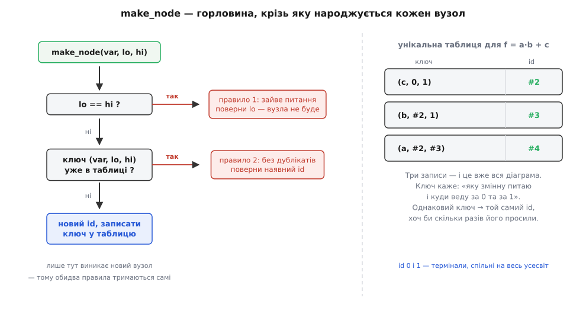
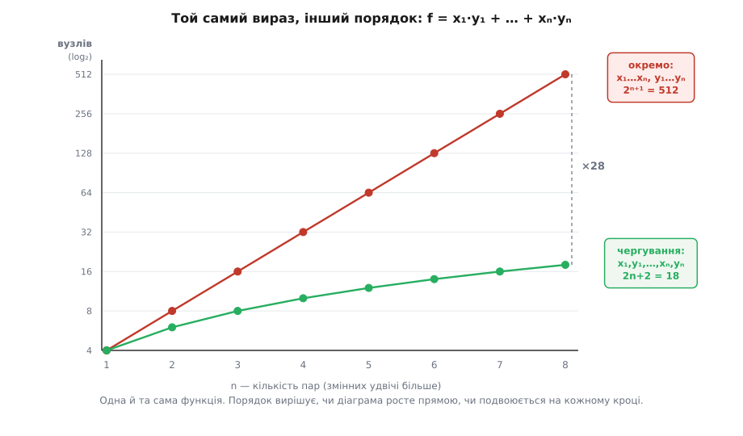
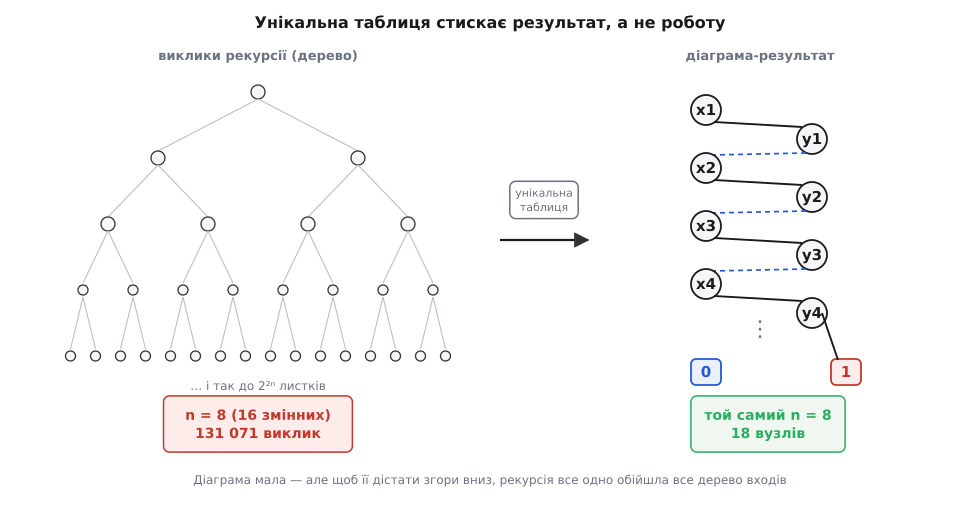

# ⚙️ Будуємо BDD: одна горловина, два правила й ціна порядку

<preknowlist>
- [Двійкова діаграма рішень (BDD)](topic:algorithms/binary-decision-diagram) — граф, де кожен вузол питає про одну змінну й має дві гілки; два правила скорочення (викинути вузол, коли обидві гілки ведуть в одне; не тримати двох однакових вузлів); за фіксованого порядку змінних скорочена діаграма канонічна.
- [Розклад Шеннона](topic:math/shannon-expansion) — тотожність `f = ¬v·f₀ + v·f₁`: розтин функції за однією змінною на два простіші кофактори `f₀` і `f₁`.
- [Хеш-таблиця](topic:algorithms/hash-table) — сховище «ключ → значення» з пошуком за сталий усереднений час: ключ проганяють крізь хеш-функцію, та вказує кошик; коли таблиця заповнюється, її доводиться рехешувати.
- [LUT](topic:electronics/lut) — крихітна пам'ять, що на кожну комбінацію входів тримає готовий біт-відповідь; її вміст — це просто стовпчик таблиці істинності.
</preknowlist>

**Задача.** На вході — булева функція у вигляді звичайної програми (дай їй нулі та одиниці, дістанеш нуль або одиницю) і порядок змінних. На виході — **скорочена впорядкована діаграма**, причому без проміжного повного дерева, яке ми потім чистили б. Рушій має вміти три речі: сказати, скільки в діаграмі вузлів; віддати стовпчик таблиці істинності будь-якого вузла — це і є прошивка LUT; і показати на числах, як той самий вираз від зміни порядку змінних то росте прямою лінією, то подвоюється на кожному кроці.

**Ідея.** Два правила скорочення звучать як прибирання: збудуй дерево, потім обійди його й виполи зайве. У коді все навпаки — і це головне, що варто винести звідси. Ми проженемо **всі** народження вузлів крізь одну-єдину функцію `make_node`, і крізь неї неможливо пройти, не пред'явивши обидва правила. А коли іншого способу створити вузол у програмі просто немає, слово «скорочена» перестає бути наслідком прибирання й стає **інваріантом**: не існує моменту, коли діаграма нескорочена. Прибирати нема чого — сміття не з'являється.


*Горловина, крізь яку народжується кожен вузол. Спершу питання «а чи цей вузол щось вирішує?» — якщо обидві гілки ведуть в одне місце, вузол не створюється взагалі, повертається сама гілка. Далі питання «а такого ще не було?» — ключ `(змінна, гілка-0, гілка-1)` шукається в унікальній таблиці, і на збіг повертається наявний id. Новий вузол виникає лише на третьому кроці — тільки якщо він і потрібен, і справді новий. Праворуч — уся таблиця для `f = a·b + c`: три записи, і це вже вся діаграма.*

## Осердя: два правила в одній функції

Вузол ми не робитимемо ні об'єктом, ні структурою з вказівниками. Вузол — це **число**: `0` і `1` зарезервовані за терміналами, решта — індекси. Це не економія заради економії. По-перше, перевірка правила «обидві гілки однакові» стає звичайним порівнянням чисел `lo == hi`, а не порівнянням об'єктів, де легко переплутати «те саме значення» з «та сама комірка». По-друге, термінали виходять спільними на весь усесвіт самі собою: нуль — це `0`, іншого нуля не буває. По-третє, `u <= 1` — це готова перевірка «чи ми вже на листку».

Ключ до унікальної таблиці — трійка `(змінна, гілка-0, гілка-1)`. Цього досить, щоб упізнати вузол **повністю**, і ось чому: гілки вже є канонічними id, бо самі народилися з цієї ж горловини. Тобто ми пізнаємо вузол не за тим, як він виглядає, а за тим, з чого зроблений, — і будуємо канонічність знизу вгору, шар за шаром.

:::tabs
```python
FALSE, TRUE = 0, 1                # два термінали на весь усесвіт — просто числа


class BDD:
    def __init__(self, order):
        self.order = list(order)                        # порядок змінних, згори вниз
        self.rank = {v: i for i, v in enumerate(self.order)}
        self.node = {}                                  # id -> (var, lo, hi)
        self.unique = {}                                # (var, lo, hi) -> id
        self._next = 2                                  # 0 і 1 уже зайняті

    def make_node(self, var, lo, hi):
        if lo == hi:                                    # правило 1: зайве питання
            return lo
        key = (var, lo, hi)
        found = self.unique.get(key)                    # правило 2: без дублікатів
        if found is not None:
            return found
        uid = self._next
        self._next += 1
        self.node[uid] = key
        self.unique[key] = uid
        return uid
```
```cpp
#include <cstddef>
#include <cstdint>
#include <unordered_map>
#include <vector>

enum : uint32_t { FALSE_ID = 0, TRUE_ID = 1 };   // не FALSE/TRUE: то макроси у <windows.h>

// Вузол — три 32-бітні поля, 12 байтів. Жодних вказівників: id вузла — це індекс
// у векторі, тож він удвічі вужчий за вказівник і не з'їжджає після realloc.
struct Node {
    uint32_t var, lo, hi;
    bool operator==(const Node& o) const noexcept {
        return var == o.var && lo == o.lo && hi == o.hi;
    }
};

struct NodeHash {                                 // FNV-подібне змішування трьох полів
    std::size_t operator()(const Node& n) const noexcept {
        uint64_t h = 0xCBF29CE484222325ull;
        h = (h ^ n.var) * 0x100000001B3ull;
        h = (h ^ n.lo)  * 0x100000001B3ull;
        h = (h ^ n.hi)  * 0x100000001B3ull;
        return static_cast<std::size_t>(h ^ (h >> 29));
    }
};

class Bdd {
public:
    Bdd() {
        nodes_.resize(2);                         // 0 і 1 — термінали, тіла їм не треба
        unique_.reserve(1u << 16);                // місце наперед: рехеш на гарячому шляху дорогий
    }

    uint32_t make_node(uint32_t var, uint32_t lo, uint32_t hi) {
        if (lo == hi) return lo;                                  // правило 1
        const Node key{var, lo, hi};
        if (auto it = unique_.find(key); it != unique_.end())
            return it->second;                                    // правило 2
        const uint32_t id = static_cast<uint32_t>(nodes_.size());
        nodes_.push_back(key);
        unique_.emplace(key, id);
        return id;
    }

    const Node& at(uint32_t id) const { return nodes_[id]; }
    bool terminal(uint32_t id) const { return id <= TRUE_ID; }
    std::size_t size() const { return nodes_.size(); }

private:
    std::vector<Node> nodes_;
    std::unordered_map<Node, uint32_t, NodeHash> unique_;
};
```
:::

Різниця між вкладками — не в синтаксисі, а в тому, за що кожна платить. Пайтонівський словник `unique` тримає ключ-кортеж як окремий об'єкт: три посилання плюс заголовок, десятки байтів на вузол. У C++ той самий вузол — рівно 12 байтів у суцільному векторі, а `unordered_map` тримає ключ у собі. Для мільйонних діаграм — а в перевірці апаратури вони саме такі — ця різниця вирішує, влізе задача в пам'ять чи ні; тому усталені рушії діаграм написані на C: CUDD Фабіо Соменці, BuDDy Йорна Лінда-Нільсена, багатоядерний Sylvan Тома ван Дейка. Ще одна дрібниця з тієї ж опери: `reserve` наперед. Унікальна таблиця — найгарячіше місце програми, і рехешування мільйона записів посеред побудови коштує більше, ніж уся решта роботи.

## Розклад Шеннона згори вниз

Тепер рекурсія, і вона до смішного коротка. Спускаємося змінними по порядку, на кожному рівні питаємо обидва значення поточної змінної, а з двох відповідей складаємо вузол. Дно рекурсії — коли змінних не лишилося: тоді набір повністю визначений, і функцію можна просто **порахувати**.

```python
    def build(self, fn):
        """fn(env) -> bool, де env — словник {змінна: 0|1}."""
        def rec(i, env):
            if i == len(self.order):
                return TRUE if fn(env) else FALSE       # дно: одне значення функції
            v = self.order[i]
            env[v] = 0
            lo = rec(i + 1, env)                        # кофактор при v = 0
            env[v] = 1
            hi = rec(i + 1, env)                        # кофактор при v = 1
            del env[v]
            return self.make_node(v, lo, hi)            # обидва правила — тут
        return rec(0, {})
```

Зверніть увагу, чого тут **немає**. Немає перевірки «а чи не залежить функція від цієї змінної». Немає пошуку однакових піддерев. Немає другого проходу. Уся розумність сидить у `make_node`, а рекурсія лишається тупою й чесною: спитай ліворуч, спитай праворуч, віддай горловині. Запустімо на знайомому виразі:

```python
b = BDD(["a", "b", "c"])
f = b.build(lambda e: (e["a"] and e["b"]) or e["c"])

print(f, len(b.node))            # 4 3   — корінь #4, а вузлів-питань усього три
for uid in sorted(b.node):
    print(uid, b.node[uid])
# 2 ('c', 0, 1)
# 3 ('b', 2, 1)
# 4 ('a', 2, 3)
```

Прочитаймо це вголос. Вузол `#4` питає про `a`: за нулем веде на `#2`, за одиницею — на `#3`. А `#2` — це «спитай `c`», тобто кофактор при `a = 0` дорівнює `c`. Вузол `#3` питає `b`: за одиницею — одразу термінал `1`, за нулем — знову `#2`, тобто `c`. Разом `f₁ = b + c`. Точно те, що дає алгебра.

Але цікавіше — чого не сталося. Рекурсія чотири рази незалежно дійшла до рівня `c` і чотири рази попросила вузол. Першого разу народився `#2`; ще двічі правило 2 віддало **той самий** `#2` — тому й `f₀`, і гілка `b = 0` фізично вказують на одну комірку. А вчетверте, під `a = 1, b = 1`, обидві гілки виявилися одиницями: виклик `make_node("c", 1, 1)` до таблиці навіть не дійшов — правило 1 згорнуло його в термінал `1`. Так само зникло питання про `b` під `a = 0`: `make_node("b", 2, 2)` побачило `lo == hi` й повернуло `2`, тож вузла `b` там не існує ніколи. Дерево на п'ятнадцять вузлів не будувалося й не чистилося — його просто не було.

Найкоротший спосіб побачити, що діаграма канонічна, — попросити ту саму функцію двічі, різними словами:

```python
b2 = BDD(["a", "b", "c"])
print(b2.build(lambda e: (e["a"] and e["b"]) or e["c"]))              # 4
print(b2.build(lambda e: (e["c"] or e["a"]) and (e["c"] or e["b"])))  # 4  ← той самий вузол
print(b2.build(lambda e: (e["a"] and e["b"]) or (not e["c"])))        # 7  ← інша функція
```

Другий вираз — це перший, розкритий за законом дистрибутивності. Синтаксично інший, семантично той самий, і рушій повертає **буквально те саме число**. Перевірка еквівалентності двох схем щойно звелася до `==` на двох цілих.

## Стовпчик таблиці істинності — це прошивка LUT

Тепер збираємо біти. Обчислити функцію за діаграмою — це один спуск від вузла до термінала: на кожному кроці дивимось значення змінної й робимо крок за потрібною гілкою. Довжина спуску не залежить від розміру діаграми — лише від кількості змінних.

```python
    def value(self, u, env):
        while u > TRUE:                                 # один шлях згори до листка
            v, lo, hi = self.node[u]
            u = hi if env[v] else lo
        return u == TRUE

    def support(self, root):
        """Змінні, яких вузол справді торкається, у порядку діаграми."""
        seen, stack, vs = set(), [root], []
        while stack:
            u = stack.pop()
            if u in seen or u <= TRUE:
                continue
            seen.add(u)
            v, lo, hi = self.node[u]
            if v not in vs:
                vs.append(v)
            stack += [lo, hi]
        return sorted(vs, key=lambda v: self.rank[v])

    def bits(self, root, vs=None):
        """Прошивка LUT: біт k = значення функції на адресі k (перша змінна — старша)."""
        vs = self.support(root) if vs is None else vs
        n = len(vs)
        word = 0
        for addr in range(1 << n):
            env = {v: (addr >> (n - 1 - k)) & 1 for k, v in enumerate(vs)}
            if self.value(root, env):
                word |= 1 << addr
        return word
```

Функція `support` тут не для краси. Вузол діаграми — це самостійна функція від **своїх** змінних, і зазвичай їх менше, ніж усіх: `#2` бачить лише `c`, `#3` — лише `b` і `c`. А кількість входів — це і є те, що вирішує, у LUT якого розміру вузол влізе. Пройдімося по всіх трьох:

```python
for uid in sorted(b.node):
    print(uid, b.support(uid), "0x%02X" % b.bits(uid))
# 2 ['c']           0x02
# 3 ['b', 'c']      0x0E
# 4 ['a', 'b', 'c'] 0xEA
```

Корінь дає `0xEA` — рівно ту вісімку бітів, якою прошивають тривходовий LUT для `f = a·b + c`. Домовленість про порядок бітів варто прочитати уважно, бо вона зазвичай і плутає: біт номер `k` — це значення функції на адресі `k`, а перша змінна порядку йде старшим бітом адреси. Тож `abc = 110` — це адреса 6, функція там дорівнює `1`, отже шостий біт слова — одиниця. Складіть усі вісім: `11101010` = `0xEA`. Якщо ж читати стовпчик таблиці істинності згори вниз, від рядка `000` до `111`, вийде `01010111` — те саме слово, лише навпаки, бо перший рядок таблиці — це наймолодший біт прошивки.

Вузол `#3` дає `0x0E`: він від двох входів, тож значущі лише чотири біти — `1110`. Прочитані стовпчиком, вони дають `0111`, і це готова прошивка двовходового LUT з операцією OR. Ось де діаграма й залізо стикаються без жодного перекладача: **будь-який вузол діаграми, у якого не більше `k` входів, — це готовий LUT на `k` входів**, а `bits` віддає його прошивку.

## Порядок змінних: 2n+2 проти 2ⁿ⁺¹

Тепер найдорожчий урок цієї структури, і його треба не прочитати, а **побачити на числах**. Візьмімо приклад із самої статті Рендала Браянта (*Bryant*) 1986 року — тієї, що ввела скорочені впорядковані діаграми й довела їхню канонічність (IEEE Transactions on Computers, C-35(8), с. 677–691; **усталений факт**). Функція проста до незручності:

```
f  =  x₁·y₁ + x₂·y₂ + … + xₙ·yₙ
```

Питання одне: чи знайдеться пара, у якій обидва біти — одиниці. Порівнюємо два порядки. **Чергування** `x₁, y₁, x₂, y₂, …` — читаємо пару, вирішуємо, йдемо далі. **Окремо** `x₁, …, xₙ, y₁, …, yₙ` — спершу всі `x`, потім усі `y`.

```python
def bryant(n):
    return lambda e: any(e["x%d" % i] and e["y%d" % i] for i in range(1, n + 1))


print(" n | чергування | окремо | 2n+2 | 2^(n+1)")
for n in range(1, 9):
    inter = [v for i in range(1, n + 1) for v in ("x%d" % i, "y%d" % i)]
    separ = ["x%d" % i for i in range(1, n + 1)] + ["y%d" % i for i in range(1, n + 1)]
    a, s = BDD(inter), BDD(separ)
    print("%2d | %10d | %6d | %4d | %7d"
          % (n, a.size(a.build(bryant(n))), s.size(s.build(bryant(n))),
             2 * n + 2, 2 ** (n + 1)))
```

Тут `size` — це обхід від кореня, що рахує досяжні вузли разом із терміналами:

```python
    def size(self, root):
        seen, stack = set(), [root]
        while stack:
            u = stack.pop()
            if u in seen:
                continue
            seen.add(u)
            if u > TRUE:
                _, lo, hi = self.node[u]
                stack += [lo, hi]
        return len(seen)
```

Друк:

```
 n | чергування | окремо | 2n+2 | 2^(n+1)
 1 |          4 |      4 |    4 |       4
 2 |          6 |      8 |    6 |       8
 3 |          8 |     16 |    8 |      16
 4 |         10 |     32 |   10 |      32
 5 |         12 |     64 |   12 |      64
 6 |         14 |    128 |   14 |     128
 7 |         16 |    256 |   16 |     256
 8 |         18 |    512 |   18 |     512
```

Обидва стовпчики лягли на формули **точно**, без єдиного відхилення: чергування дає `2n+2`, окремий порядок — `2ⁿ⁺¹`. Дванадцять рядків `make_node` відтворили числа зі статті 1986 року один в один.


*Та сама функція, той самий рушій, різниця лише в порядку читання змінних. Вісь вузлів — логарифмічна, тому подвоєння виглядає прямою: окремий порядок додає новий поверх на кожну пару. Чергування натомість повзе ледь помітно вгору — і на n = 8 розрив уже двадцятивосьмикратний, а далі росте без стелі. Числа — з реального прогону коду, і збігаються з формулами Браянта до одиниці.*

Причина фізична, і її варто відчути пальцями. Діаграма читає змінні строго за порядком і не має пам'яті, крім самої своєї структури: **усе, що треба пам'ятати про прочитане, мусить бути закодоване в тому, у якому вузлі ти опинився**. За чергування після кожної пари треба пам'ятати рівно один біт — «уже знайшли збіг чи ще ні». Два стани — два вузли на рівень, звідси лінія. За окремого порядку, дочитавши всі `x`, треба пам'ятати **весь вектор** `x₁…xₙ`, бо кожен його біт ще знадобиться на своєму `y`. А запам'ятати `n` бітів можна лише `2ⁿ` різними вузлами — інших комірок пам'яті в діаграми немає. Ширина рівня — це буквально кількість станів, які треба розрізняти.

Звідси й три сумні наслідки, які варто знати наперед. Перший: підібрати найкращий порядок — задача **NP-повна** (Беате Болліг і Інґо Веґенер, IEEE Transactions on Computers, 45(9), 1996, с. 993–1002), тож рушії користуються евристиками на кшталт просіювання, а не оптимумом. Другий: є функції, де малої діаграми немає **за жодного порядку** — Браянт довів 1991 року, що середній біт добутку двох `n`-бітних чисел вимагає щонайменше `2^(n/8)` вузлів хоч як переставляй змінні (IEEE Transactions on Computers, 40, с. 205–213). Тому множник перевіряють іншими засобами, і це не хиба реалізації, а стеля самого подання. Третій, практичний: якщо ваша діаграма несподівано вибухла — спершу подивіться на порядок, а вже потім на код.

## Пастка: мала діаграма ≠ мала робота

А тепер найтонше місце, на якому спотикаються всі, хто пише таке вперше. Додаймо до попереднього досліду лічильник викликів `rec` — і подивімося на нього поруч із розміром результату:

```
n=4   вузлів=10   викликів=511
n=6   вузлів=14   викликів=8191
n=8   вузлів=18   викликів=131071
n=10  вузлів=22   викликів=2097151
```

Вісімнадцять вузлів — і сто тридцять одна тисяча викликів. Двадцять два вузли — і два мільйони. Унікальна таблиця чесно зробила свою роботу: **результат** вийшов канонічний і крихітний. Але **робота** лишилася експоненційною, бо рекурсія все одно спустилася в кожен листок повного дерева входів — просто на зворотному шляху майже всі її знахідки виявилися тим самим вузлом. Ми ловимо збіги **після** того, як заплатили за спуск.


*Ліворуч — те, що робить рекурсія: повне дерево наборів, `2²ⁿ` листків. Праворуч — те, що з цього лишається: вузька драбинка на `2n+2` вузли. Унікальна таблиця стоїть між ними й склеює однакове, але склеює вона **результати**, а не **виклики**: щоб дізнатися, що два піддерева однакові, рекурсія спершу спустилася в обидва. Тому побудова згори вниз від довільної функції-програми лишається придатною хіба для десятка-другого змінних.*

Спокуслива латка — почепити мемоїзацію на `rec`. Не спрацює, і причина повчальна: ключем мемо може бути лише те, що ми маємо **на вході**, тобто набір присвоєнь або форма виразу. Але два різні набори дають той самий кофактор, а синтаксично різні вирази — ту саму функцію. Саме тому, що синтаксична форма не канонічна, ми й будуємо діаграму. Мемо на вході — евристика; унікальна таблиця точна, бо працює **знизу вгору**, на вже канонічних дітях.

Справжня відповідь — не спускатися згори взагалі. Будуймо функцію з малих шматків тими самими операціями, якими її записано, а рекурсію ведімо не по наборах входів, а **по парі вже готових діаграм**. Це класичний `apply`, і йому потрібна друга таблиця — таблиця обчисленого:

```python
    def var(self, v):
        return self.make_node(v, FALSE, TRUE)

    def apply(self, op, u, v):
        key = (op, u, v)
        got = self.computed.get(key)                    # таблиця обчисленого
        if got is not None:
            return got
        if u <= TRUE and v <= TRUE:                     # обидва — термінали: рахуємо
            return {"and": u & v, "or": u | v, "xor": u ^ v}[op]
        top = len(self.order)                           # ранг «нижче за все»
        ru = self.rank[self.node[u][0]] if u > TRUE else top
        rv = self.rank[self.node[v][0]] if v > TRUE else top
        r = min(ru, rv)                                 # старша зі змінних двох вершин
        ulo, uhi = (self.node[u][1], self.node[u][2]) if ru == r else (u, u)
        vlo, vhi = (self.node[v][1], self.node[v][2]) if rv == r else (v, v)
        res = self.make_node(self.order[r],
                             self.apply(op, ulo, vlo),
                             self.apply(op, uhi, vhi))
        self.computed[key] = res
        return res
```

Ключ `(операція, u, v)` — це **два id**, а не набір входів. І ось тут канонічність повертає борг із відсотками: раз однакові функції мають однакові id, то мемо влучає щоразу, коли ця пара підфункцій уже траплялася. Тому пар буває щонайбільше `|u|·|v|` — добуток розмірів операндів, а не `2ⁿ`. Додайте `self.computed = {}` у конструктор і зберіть ту саму функцію знизу вгору:

```python
n = 100
order = [v for i in range(1, n + 1) for v in ("x%d" % i, "y%d" % i)]
bdd = BDD(order)
acc = FALSE
for i in range(1, n + 1):
    acc = bdd.apply("or", acc, bdd.apply("and", bdd.var("x%d" % i), bdd.var("y%d" % i)))

print(bdd.size(acc), 2 * n + 2, len(bdd.computed))   # 202 202 10598
```

Двісті змінних, двісті два вузли, десять тисяч записів у мемо — мить. Побудова згори вниз на цьому ж місці попросила б `2²⁰¹` викликів, тобто ніколи. Обидва шляхи дають **той самий id** — це легко перевірити на малому `n`, де встигають обидва, — але один коштує як розмір відповіді, а другий як розмір усесвіту. Ось чому справжні рушії діаграм не мають функції «збудуй BDD із таблиці істинності» як головного входу: вони будують знизу вгору зі змінних і операцій, і повна таблиця істинності ніколи не матеріалізується.

## Складність і решта пасток

| Дія | Ціна | Що варто пам'ятати |
|---|---|---|
| `make_node` | O(1) усереднено | одне хешування трійки; це найгарячіше місце всієї програми |
| `value` — обчислити на одному наборі | O(n) | довжина одного шляху згори до листка; **не** залежить від розміру діаграми |
| `build` згори вниз | Θ(2ⁿ) викликів | незалежно від того, наскільки малим вийде результат |
| `apply(op, u, v)` | O(\|u\|·\|v\|) | завдяки таблиці обчисленого; без неї — експонента |
| `bits` для вузла з `k` входами | O(2ᵏ·k) | стільки ж, скільки бітів у прошивці LUT — менше не буває |
| Пам'ять на вузол | 12 Б у C++ | у Python — десятки байтів на кортеж-ключ |

І чотири пастки, кожна з яких коштувала комусь вечора.

**Термінали мусять бути спільні.** Якщо кожен листок робити новим об'єктом — `Leaf(0)`, `Leaf(0)`, — то правило 1 не спрацює жодного разу: `lo == hi` порівняє різні комірки й скаже «різні». Не спрацює й правило 2, бо ключі з різними дітьми ніколи не збіжаться. Обидва правила тихо вимкнуться, діаграма розгорнеться в повне дерево на `2ⁿ` вузлів, і програма не впаде — вона просто з'їсть пам'ять і не поясниться. Термінали як числа `0` і `1` роблять цю помилку неможливою.

**Без унікальної таблиці лишається лише половина скорочення.** Спокуса викинути таблицю («правило 1 і так спрацьовує») коштує ось скільки — це той самий код, у якому `make_node` завжди створює новий вузол:

```
n=2   з таблицею=4    без таблиці=9
n=4   з таблицею=8    без таблиці=93
n=6   з таблицею=12   без таблиці=849
n=8   з таблицею=16   без таблиці=7653
```

Шістнадцять проти семи з половиною тисяч на восьми парах — і це ще при живому правилі 1. Розділення спільного, а не викидання зайвого, дає левову частку стиснення.

**Змінна у ключі — обов'язкова.** Ключ `(lo, hi)` без змінної здається достатнім і навіть працює на перших прикладах. Але два вузли з однаковими гілками, що питають про **різні** змінні, — це різні функції, і склеїти їх означає тихо зіпсувати результат. Канонічність зникне, а `==` почне брехати. У реальних рушіях у ключі тримають не ім'я, а **рівень** — ціле число, яке ще й порівнюється дешевше.

**Вузли живуть вічно.** Наш `make_node` ніколи нічого не звільняє, і для навчального коду це правильно. Але в справжньому рушії проміжні діаграми, на які вже ніхто не посилається, лишаються в унікальній таблиці назавжди й тримають пам'ять. Тому пакети рахують посилання й час від часу вимітають недосяжні вузли — а сама можливість такого вимітання є саме тому, що вузли незмінні: комірку, яку ніхто не редагує, безпечно ділити між усіма охочими й безпечно викинути, коли охочих не лишилося.

І останнє, про сам прийом. Ідея «перш ніж створити — спитай таблицю, чи такий уже є» називається **хеш-консинг** (*hash consing*), і вона помітно старша за той світ, у якому її зазвичай зустрічають. Її описав радянський програміст Андрій Єршов (*Ershov*, 1931–1988; народився в Москві, з 1961 року працював у Новосибірську) у статті «On programming of arithmetic operations» (Communications of the ACM, 1(8), с. 3–6) — як спосіб знаходити й не переобчислювати спільні підвирази в арифметиці. Назва ж прийшла пізніше й з іншого боку: її закріпили лісп-системи 1970-х, зокрема робота японського дослідника Ейїті Ґото (*Goto*) «Monocopy and Associative Algorithms in an Extended Lisp» (Токійський університет, TR 74-03, 1974). Обидві атрибуції — **усталений факт**, і в них є маленька іронія з датами: Єршова надрукували в серпні 1958-го, тобто ще до того, як тієї ж осені в Массачусетському технологічному взялися втілювати Лісп, і за півтора року до того, як Джон Маккарті описав мову друком. Прийом, чия назва звучить суто по-ліспівськи, з'явився раніше за Лісп і зовсім не для нього. Наш `make_node` — це той самий Єршов 1958-го, тільки трійка `(змінна, гілка-0, гілка-1)` замість арифметичного підвиразу.
