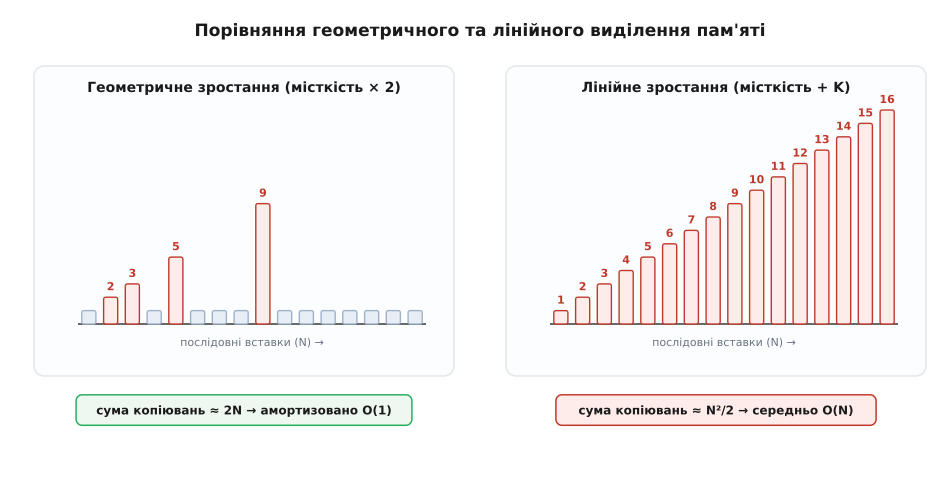
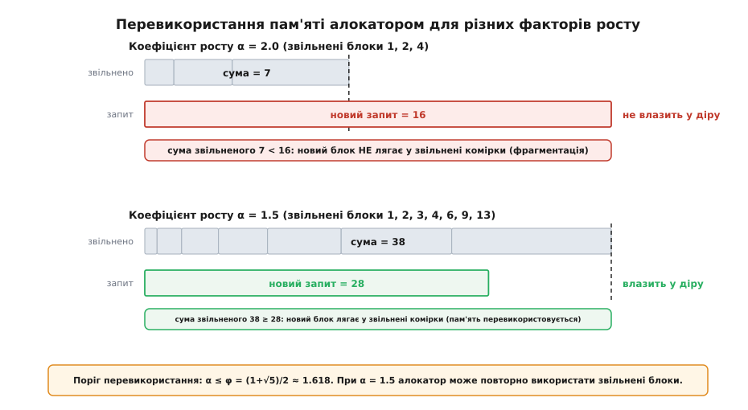
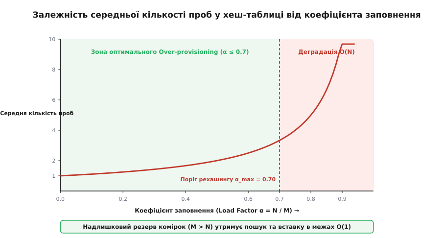
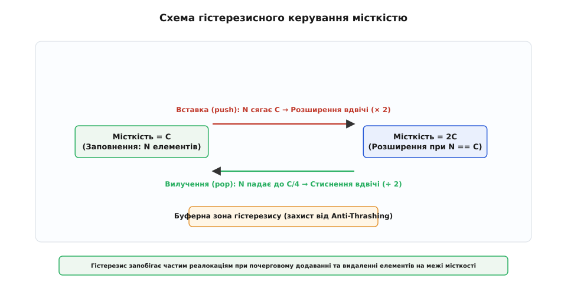

# Over-provisioning

<preknowlist>
- [Амортизований аналіз](book:algorithms/amortized-analysis) — як обчислюють середню вартість операцій у послідовності за допомогою розмазування витрат на геометричну прогресію.
- [Асимптотична складність](book:algorithms/asymptotic-complexity) — що означають O(1), O(N), O(N²) та різниця між найгіршим і середнім випадком.
</preknowlist>

Уяви, що ти будуєш міський архів для зберігання паперових справ. Щоразу, коли приходить один новий документ, ти купуєш крихітну шафу рівно під одну папку. Поки документів п'ять, це здається економним. Але коли їх стає тисяча, черговий документ змушує тебе купувати шафу на тисячу одну папку, перевозити туди всі тисячу старих документів із попередньої шафи й лише потім класти новий. На перенесення папок іде цілий день, хоча саму папку можна покласти за секунду. Якщо чинити так на кожному документі, операція додавання перетвориться на суцільне перетягування вантажів.

У комп'ютерній пам'яті відбувається точно те саме. Неперервний масив вимагає, щоб усі його елементи лежали в оперативній пам'яті суцільним, нерозривним блоком. Коли масив заповнюється, ти не можеш просто «приписати» новий елемент у наступну комірку: за кінцем вашого блоку вже можуть лежати чужі дані інших змінних або операційної системи. Єдиний спосіб розширити масив — попросити в алокатора новий, більший блок пам'яті, скопіювати туди геть усе зі старого блоку, віддати новий елемент і звільнити старий.

Надлишкове виділення пам'яті, або **Over-provisioning** (від англ. *over* — «понад, надмір» та *provision* — «забезпечення, резервування», від латин. *provisio* — «передбачливість, заготовлення наперед»), — це фундаментальний архітектурний прийом, за якого структура даних свідомо запитує в операційної системи більше пам'яті, ніж їй потрібно для збереження поточних елементів. Цей «спальний» резерв невикористаних комірок перетворює щоразу дороге копіювання на рідкісну подію, розмазуючи його вартість по сотнях і тисячах дешевих операцій.

---

## 1. Першопричина: Фізична ціна реалокації та викликів ОС

Щоб зрозуміти, чому надлишкова пам'ять є не марнотратством, а суворою необхідністю, слід подивитися, що відбувається під капотом комп'ютера при кожному запиті на зміну розміру блоку.

Коли програма викликає функцію виділення пам'яті (наприклад, `malloc` чи `realloc` у C або `new` у C++), виконання не обмежується простою зміною лічильника в процесорі. Відбувається цілий ланцюжок важких системних дій:

1. **Пошук у таблицях системного алокатора**: Менеджер купи (Heap Allocator, наприклад `ptmalloc` — системний алокатор у glibc на основі dlmalloc, `jemalloc` — алокатор із поділом пам'яті на арени для зменшення контеншену потоків у FreeBSD та Rust, або `tcmalloc` у Google) мусить перебрати свої внутрішні арени (Arenas), біни (Bins) та списки вільних блоків (Free Lists або Buddy Blocks у Buddy Allocator — алокаторі, який розбиває пам'ять на блоки ступенів двійки для швидкого злиття суміжних блоків), щоб знайти підрядний шматок адресної пам'яті потрібного розміру.
2. **Системні виклики до ядра ОС**: Якщо у внутрішніх аренах алокатора немає вільної підрядної ділянки потрібної довжини, алокатор здійснює системний виклик (`brk` або `mmap` у POSIX-системах чи `VirtualAlloc` у Windows). Ядро операційної системи виконує важке перемикання контексту процесора з режиму користувача (User Mode) у режим ядра (Kernel Mode), модифікує зони віртуальної пам'яті процесу (VMA — Virtual Memory Areas), шукає вільні фізичні сторінки пам'яті й змінює таблиці сторінок (Page Tables).
3. **Байтове копіювання та руйнування кешу**: Програмі доводиться прочитати кожну комірку зі старого блоку й записати її в новий. При цьому шина пам'яті завантажується повноцінним перекачуванням байтів, а кеш-пам'ять процесора L1/L2/L3 повністю вимивається (Cache Pollution), замінюючись даними, які щойно скопіювали. Крім того, це спричиняє перезавантаження буфера обходу трансляції адреси (TLB — Translation Lookaside Buffer), оскільки дані переїхали на нові віртуальні сторінки.

Якщо робити це на кожній вставці одного елемента, то додавання `N` елементів у порожній масив вимагатиме копіювання:

```
копіювання: 1 + 2 + 3 + ... + (N - 1)
          = N · (N - 1) / 2          [сума арифметичної прогресії]
          = (N² - N) / 2             [розкриття дужок]
          = Θ(N²)                    [головний член асимптотики]
```

Загальний час виконання зростає квадратично. Додати мільйон елементів таким способом означає виконати близько 500 мільярдів операцій копіювання. Програма витратить 99.99% свого часу не на корисну роботу, а на перекладання байтів з одного місця в інше.

---

## 2. Механіка геометричного зростання: лінія проти квадрата

Єдиний математичний вихід із квадратичної пастки — збільшувати місткість не на фіксоване число комірок, а в **геометричній прогресії**.

Розрізняють дві фундаментально різні стратегії розширення місткості (Capacity):

* **Лінійне розширення (`+K`)**: Щоразу при переповненні до місткості додається фіксована кількість комірок `K` (наприклад, `+100`).
* **Геометричне розширення (`× α`)**: Щоразу при переповненні поточна місткість множиться на коефіцієнт росту `α > 1` (наприклад, `α = 2.0` або `α = 1.5`).


*Геометричне та лінійне резервування ємності: реалокаційні сплески та сумарні витрати копіювання.*

При геометричному зростанні з множником `α = 2.0` масив починає з місткості 1, далі росте до 2, 4, 8, 16, 32, 64 і так далі. Дорогі операції реалокації трапляються дедалі рідше: проміжки між ними подвоюються.

Порахуємо сумарне число копіювань елементів при вставці `N` елементів для `α = 2.0`:

```
копіювання при рості:  1 + 2 + 4 + 8 + … + N/2
                     = N − 1                  [сума геометричної прогресії]
дешеві записи:         N                      [прямий запис у вільну комірку]
разом операцій:        N + (N − 1) < 2N       [сума копіювань та записів]
на один push_back:     2N / N = 2 = O(1)      [ділення на кількість елементів]
```

Завдяки надлишковому виділенню сумарна робота з вставки `N` елементів впала з квадратичної `Θ(N²)` до строго лінійної `Θ(N)`. Розділивши цю суму на `N` операцій, ми отримуємо підтвердження: середня амортизована вартість одного додавання становить **`O(1)`**.

> 🔧 **Навіщо це.** Саме тому в стандартних бібліотеках усіх сучасних мов програмування — `std::vector` у C++, `ArrayList` у Java, `list` у Python, зрізи (slices) у Go — застосовують саме геометричний over-provisioning. Використання лінійного додавання `+K` перетворило б звичайний цикл збирання даних на квадратичне гальмо.

Детальний фокус із [історію визрівання динамічного виділення](book:algorithms/over-provisioning/hist-over-provisioning.md) показує, як розробники перших системних контейнерів наступали на ці граблі, доки геометричне резервування не стало стандартом.

---

## 3. Битва коефіцієнтів: чому 2.0 заважає повторному використанню пам'яті

На перший погляд здається, що подвоєння місткості (`α = 2.0`) — ідеальний вибір. Його легко обчислювати через побітовий зсув ліворуч (`cap << 1`), і воно робить реалокації максимально рідкісними. Проте в реальних операційних системах `α = 2.0` ховає підступну ахіллесову п'яту, пов'язану з **фрагментацією купової пам'яті**.

Коли масив розширюється, старий блок пам'яті звільняється й повертається алокаторові. Виникає питання: чи зможе системний алокатор (наприклад, buddy allocator — алокатор, що ділить купу на дворазово зростаючі блоки) у майбутньому використати ці звільнені блоки для розміщення *наступного* реалокаційного запиту того самого масиву?

Проведемо математичний розрахунок для `α = 2.0`. Нехай початковий розмір масиву дорівнює 1. Послідовність виділених і потім звільнених блоків має вигляд:

```
звільнені блоки:  1, 2, 4, 8, 16, ..., 2ᵏ⁻¹
```

Сума всіх раніше звільнених блоків після `k` розширень дорівнює:

```
1 + 2 + 4 + 8 + ... + 2ᵏ⁻¹ = 2ᵏ − 1
```

А новий необхідний розмір блоку для наступного розширення дорівнює `C_new = 2ᵏ`.

Зверни увагу на нерівність: `2ᵏ − 1 < 2ᵏ`. Сума розмірів **усіх раніше звільнених блоків за всю історію існування масиву** на одиницю менша за розмір наступного запиту!

Це означає, що при факторі росту `α = 2.0` новий блок пам'яті **ніколи не зможе поміститися у простір, який звільнили попередні кроки цього масиву**. Алокатор змушений щоразу відрізати свіжий шматок пам'яті на самій верхівці купи (Heap Top). Верхня межа адресної пам'яті програми постійно повзе вгору, спричиняючи важку фрагментацію.


*Повторне використання звільнених блоків пам'яті алокатором при факторі росту 1.5 порівняно з фактором 2.0.*

Тепер розглянемо менший множник, наприклад `α = 1.5`. Послідовність розмірів блоків (округлено):

```
розміри блоків: 1, 2, 3, 4, 6, 9, 13, 19, 28, 42, ...
```

На 8-му кроці сума раніше звільнених блоків становить:

```
1 + 2 + 3 + 4 + 6 + 9 + 13 + 19 = 57
```

А новий запит становить `28 · 1.5 = 42`. Сума звільненого (57) виявилася **більшою** за необхідний запит (42)!

Починаючи з певного кроку, алокатор пам'яті зможе об'єднати раніше звільнені сусідні блоки й виділити новий розмір прямо у «старій дірі», не розширюючи загальну верхню межу адресної пам'яті процесу.

Точна математична межа, за якої сума попередніх членів геометричної прогресії доганяє наступний член, виводиться з нерівності:

```
(αᵏ⁻¹ − 1) / (α − 1) ≥ αᵏ    [умова перекриття суми блоків]
⇒ α² − α − 1 ≤ 0            [межове квадратне нерівняння]
⇒ α ≤ (1 + √5) / 2 = φ ≈ 1.618  [знаходження кореня золотого перетину]
```

Поріг золотого перетину `φ ≈ 1.618` є межею:
* Якщо `α > φ` (як-от `α = 2.0`), пам'ять контейнера ніколи не перевикористовується на місці.
* Якщо `α ≤ φ` (як-от `α = 1.5`), алокатор отримує можливість повторного використання накопичених звільнених блоків.

Саме тому в реалізації MSVC STL для C++ та у високопродуктивній бібліотеці `folly::fbvector` від інженерів Facebook використовується коефіцієнт росту **`α = 1.5`**.

Строге виведення цієї межі та розрахунок втрат пам'яті подано в [математичному аналізі коефіцієнтів зростання та межі золотого перетину](book:algorithms/over-provisioning/math-amortized-growth.md).

---

## 4. Over-provisioning у хеш-таблицях: Коефіцієнт заповнення (Load Factor)

Принцип надлишкового виділення стосується не лише неперервних масивів. У хеш-таблицях він є головним умовою збереження константної швидкості пошуку `O(1)`.

Хеш-таблиця складається з масиву бакетів (Buckets) місткістю `M`, у які за допомогою хеш-функції розподіляються `N` збережених елементів. Відношення кількості елементів до кількості бакетів називають **коефіцієнтом заповнення** (Load Factor):

```
α_load = N / M
```

Якщо не застосовувати надлишкове виділення пам'яті й дозволити `α_load` наближатися до `1.0` (або перевищувати `1.0` у випадку ланцюжкового хешування), у таблиці виникає катастрофічний вибух колізій.

У хеш-таблицях із відкритою адресацією (Open Addressing, наприклад Linear Probing або Hopscotch Hashing) середня кількість проб для пошуку елемента описується формулою:

```
E[проб] ≈ 1 / (1 − α_load)
```


*Залежність кількості проб при пошуку у хеш-таблиці від коефіцієнта заповнення (Load Factor).*

Як видно з графіка, коли заповненість таблиці сягає 90% (`α_load = 0.9`), середня кількість проб зростає до 10, а при 99% — до 100 проб на кожен пошук. Хеш-таблиця перетворюється на повільний лінійний список.

Щоб утримати пошук у межах `O(1)`, застосовують **динамічний over-provisioning хеш-таблиці (Rehashing)**:

1. Встановлюють максимально допустимий поріг заповненості `α_max` (зазвичай від 0.70 до 0.75).
2. Поки `N / M ≤ α_max`, таблиця працює з гарантованим надлишком вільного простору у 25–30% комірок, що забезпечує в середньому лише 2–3 проби на операцію.
3. Як тільки `N / M` перевищує `α_max`, відбувається рехашинг: виділяється новий масив бакетів подвійного розміру (`M_new = 2M`), усі існуючі елементи перехешовуються й розкидаються по нових бакетах, а старий масив бакетів звільняється.

Завдяки амортизації ця дорога операція перехешування розмазується по всіх попередніх вставках, залишаючи середню складність `insert`, `lookup` та `delete` рівною **`O(1)`**.

---

## 5. Надлишкове виділення у вузлах дерев, Gap Buffers та кільцевих буферах

Концепція надлишкового виділення не обмежується масивами та хеш-таблицями. Вона є ключовим інструментом побудови цілої низки спеціалізованих структур даних:

### А. Вузли B-дерев та B+ дерев (Storage Engines)

У дискових структурах даних (таких як B-дерева в системах керування базами даних SQLite, PostgreSQL, InnoDB та WiredTiger) кожен вузол відповідає за збереження даних у межах одного дискового блоку або сторінки (наприклад, 4 КБ або 16 КБ).

Замість того щоб тримати суворо необхідну кількість ключів, кожен вузол B-дерева має **надлишковий резерв комірок**. Вузол порядку `t` може вміщувати від `t - 1` до `2t - 1` ключів. Цей over-provisioning дозволяє додавати та видаляти ключі всередині вузла без розщеплення (Split) або об'єднання (Merge) сусідніх вузлів. Розщеплення вузла відбувається лише тоді, коли надлишковий резервний простір вузла повністю вичерпано.

### Б. Gap Buffer у текстових редакторах

У текстових редакторах (на кшталт Emacs чи Sublime Text) текст зберігається не як зв'язаний список символів і не як простий масив, а за допомогою **буфера з зазором (Gap Buffer)** — масивної структури даних із надлишковим резервним зазором невикористаного простору безпосередньо у місці поточного редагування.

Gap Buffer утримує надлишковий резервний простір не в кінці масиву, а **безпосередньо у точці курсора редагування**. Коли користувач набирає текст із клавіатури, нові символи записуються у цей зазор за миттєвий час `O(1)` без зсуву решти тексту файлу. При переміщенні курсора стрілками зазор прозоро переміщується у нову позицію курсора. Over-provisioning зазору робить набір тексту миттєвим, усуваючи затримки введення.

### В. Двобічні черги `std::deque` та чанковані масиви

У контейнері `std::deque` (Double-ended Queue) надлишкове виділення реалізовано у вигляді чанків (Chunked Arrays) — фіксованих блоків пам'яті (наприклад, по 512 байтів), об'єднаних центральною таблицею вказівників.

Коли елемент додається у початок або кінець черги, `std::deque` виділяє цілий новий надлишковий чанк пам'яті. Це забезпечує амортизовану складність `O(1)` для операцій `push_front` та `push_back` без необхідності суцільного копіювання всього масиву.

---

## 6. Гістерезис деалокації: захист від каскадного гальмування (Anti-thrashing)

Що відбудеться, якщо структура даних намагатиметься бути «занадто бережливою» й одразу звільнятиме надлишкову пам'ять при видаленні елементів?

Уяви динамічний масив місткістю `C = 1000`, у якому зараз лежить `N = 1000` елементів. Масив заповнений на 100%.

Розглянемо алгоритм без надлишкового запасу на зменшення:
* Користувач робить `push_back()`: масив переповнюється, викликає реалокацію до `C = 2000` і копіює 1000 елементів (`O(N)`).
* Одразу після цього користувач робить `pop_back()`: елемент вилучається, і якщо програма одразу вирішить стиснути місткість до `C = 1000`, вона знову виконає реалокацію й копіювання 999 елементів (`O(N)`).
* Наступний виклик `push_back()` знову викликає реалокацію до 2000 (`O(N)`).

Якщо програма виконує послідовність чергованих операцій `push_back()` та `pop_back()` на межі місткості, **кожна поодинока операція коштуватиме `O(N)`**! Вся перевага амортизованого аналізу повністю руйнується. Такий патологічний стан нескінченного перекачування пам'яті називають **буксуванням пам'яті** або **Thrashing**.

Ліки проти буксування — **гістерезис** (від грецьк. *hysteresis* — «запізнення, відставання»).


*Захист від каскадної реалокації пам'яті (anti-thrashing) за допомогою двопорогового гістерезису.*

Правило гістерезисного керування ємністю полягає в розведенні порогів розширення та стиснення:

1. **Поріг розширення**: Масив збільшує місткість удвічі (`× 2`) лише при 100% заповненні (`N = C`).
2. **Поріг стиснення**: Масив зменшує місткість удвічі (`÷ 2`) лише тоді, коли кількість елементів падає до **25% від місткості** (`N ≤ C / 4`).

Завдяки цьому між точкою розширення та точкою стиснення виникає велика буферна зона (проміжок у 50% ємності). Щоб викликати наступну реалокацію після стиснення, користувачеві доведеться виконати щонайменше `C / 4` послідовних вставок або видалень. Це гарантує, що операції вилучення `pop_back()` також мають амортизовану складність **`O(1)`**.

---

## 7. Приклад реалізації: надлишковий буфер мовами C та C++

Наведений нижче приклад демонструє створення динамічного буфера з конфігурованим надлишковим розширенням та двопороговим гістерезисом деалокації.

:::tabs
```c
#include <stdio.h>
#include <stdlib.h>
#include <stdbool.h>

typedef struct {
    int *data;
    size_t size;
    size_t capacity;
    size_t realloc_count;
} DynamicBufferC;

DynamicBufferC* buffer_create(size_t initial_cap) {
    DynamicBufferC *buf = (DynamicBufferC*)malloc(sizeof(DynamicBufferC));
    if (!buf) return NULL;

    buf->size = 0;
    buf->capacity = initial_cap > 0 ? initial_cap : 4;
    buf->realloc_count = 0;
    buf->data = (int*)malloc(buf->capacity * sizeof(int));
    if (!buf->data) {
        free(buf);
        return NULL;
    }
    return buf;
}

bool buffer_push(DynamicBufferC *buf, int value) {
    // 1. Розширення при 100% заповненні (Over-provisioning x1.5)
    if (buf->size == buf->capacity) {
        size_t new_cap = buf->capacity + (buf->capacity >> 1); // x1.5
        int *new_data = (int*)realloc(buf->data, new_cap * sizeof(int));
        if (!new_data) return false;

        buf->data = new_data;
        buf->capacity = new_cap;
        buf->realloc_count++;
    }
    buf->data[buf->size++] = value;
    return true;
}

bool buffer_pop(DynamicBufferC *buf, int *out_val) {
    if (buf->size == 0) return false;

    buf->size--;
    if (out_val) *out_val = buf->data[buf->size];

    // 2. Гістерезисне стиснення лише при падінні заповненості нижче 25%
    if (buf->size > 0 && buf->size <= buf->capacity / 4 && buf->capacity > 16) {
        size_t new_cap = buf->capacity / 2;
        int *new_data = (int*)realloc(buf->data, new_cap * sizeof(int));
        if (new_data) {
            buf->data = new_data;
            buf->capacity = new_cap;
            buf->realloc_count++;
        }
    }
    return true;
}

void buffer_free(DynamicBufferC *buf) {
    if (buf) {
        free(buf->data);
        free(buf);
    }
}
```
```cpp
#include <iostream>
#include <memory>
#include <span>
#include <expected>
#include <string_view>

template <typename T>
class DynamicBufferCPP {
public:
    explicit DynamicBufferCPP(std::size_t initial_capacity = 4)
        : capacity_(initial_capacity > 0 ? initial_capacity : 4),
          data_(std::make_unique<T[]>(capacity_)) {}

    void push_back(const T& value) {
        // 1. Геометричний Over-provisioning x1.5
        if (size_ == capacity_) {
            std::size_t new_capacity = capacity_ + (capacity_ >> 1);
            reallocate(new_capacity);
        }
        data_[size_++] = value;
    }

    std::expected<T, std::string_view> pop_back() {
        if (size_ == 0) {
            return std::unexpected("Buffer is empty");
        }
        T val = std::move(data_[--size_]);

        // 2. Гістерезисне стиснення при заповненій менше 25%
        if (size_ > 0 && size_ <= capacity_ / 4 && capacity_ > 16) {
            reallocate(capacity_ / 2);
        }
        return val;
    }

    [[nodiscard]] std::size_t size() const noexcept { return size_; }
    [[nodiscard]] std::size_t capacity() const noexcept { return capacity_; }
    [[nodiscard]] std::size_t reallocations() const noexcept { return realloc_count_; }
    [[nodiscard]] std::span<const T> view() const noexcept { return {data_.get(), size_}; }

private:
    void reallocate(std::size_t new_capacity) {
        auto new_data = std::make_unique<T[]>(new_capacity);
        for (std::size_t i = 0; i < size_; ++i) {
            new_data[i] = std::move(data_[i]);
        }
        data_ = std::move(new_data);
        capacity_ = new_capacity;
        realloc_count_++;
    }

    std::size_t size_{0};
    std::size_t capacity_{4};
    std::size_t realloc_count_{0};
    std::unique_ptr<T[]> data_;
};
```
:::

Повний варіант коду з порівняльним бенчмарком продуктивності, вимірюванням часових затримок у мікросекундах та підрахунком реалокацій подано у [практичному проєкті з вимірюванням затримок та порівнянням режимів](book:algorithms/over-provisioning/proj-over-provisioning.md).

---

## 8. Фізичний Over-provisioning: Апаратура та SSD

Принцип надлишкового виділення виходить далеко за межі оперативної пам'яті комп'ютера. У сучасних твердотільних накопичувачах (SSD) **Hardware Over-provisioning** є головним умовою фізичного виживання пристрою.

Фізика флеш-пам'яті NAND влаштована так, що дані можна читати й записувати невеликими сторінками (Pages по 4–16 КБ), але модифікувати вже записані сторінки безпосередньо неможливо. Щоб перезаписати одну сторінку, SSD контролер мусить зтерти цілий **фізичний блок** (Block по 128 КБ – 8 МБ), який складається з сотень сторінок.

Якщо SSD заповнений користувацькими даними на 100%, контролер FTL (Flash Translation Layer) потрапляє у ту саму квадратичну пастку: кожен новий запис викликає важкий цикл «зчитати весь блок → зтерти блок → записати блок заново з новими даними». Це спричиняє так зване **посилення запису** (Write Amplification Factor, WAF), яке виражається формулою:

```
WAF = Flash Writes / Host Writes
```

Без надлишкового простору WAF може сягати 10–20, що швидко зношує комірки флеш-пам'яті й знижує швидкість накопичувача в сотні разів.

Для запобігання цьому всі SSD накопичувачі мають **апаратний Over-provisioning**:

* Фізична ємність чипів NAND на платі завжди більша за логічну ємність, яку бачить операційна система.
* На звичайних споживчих SSD апаратний надлишок становить **7%** (наприклад, фізично на платі встановлено 512 ГБ, але користувачеві доступно лише 480 ГБ або 500 ГБ).
* На серверних SSD для баз даних та високонавантажених систем надлишок може сягати **28%** або навіть **50%** від логічної ємності.

Цей прихований резервний простір контролер FTL використовує для трьох критичних завдань:
1. **Garbage Collection (збирання сміття)**: FTL прозоро у тлі копіює дійсні сторінки в надлишкові блоки й готує порожні блоки під нові записи без затримки поточних операцій I/O.
2. **Wear Leveling (вирівнювання зносу)**: FTL рівномірно розподіляє операції запису по всіх фізичних комірках, щоб жоден блок не вийшов із ладу раніше за інші.
3. **Bad Block Replacement (заміна битих блоків)**: коли фізичний блок вичерпує свій ресурс P/E (Program/Erase cycles), FTL непомітно вимикає його й замінює новим блоком із надлишкового резерву.

---

## 9. Просторовий трейд-оф: скільки пам'яті витрачається марно?

Надлишкове виділення пам'яті — це класичний інженерний компроміс (Trade-off): **ми жертвуємо простором заради часу**.

Витрачена марно пам'ять називається **внутрішньою фрагментацією** або **холостим простором** (Slack Space).

Оцінимо середній обсяг втраченої пам'яті для динамічного масиву з фактором росту `α`:

* **Найгірший випадок**: Одразу після реалокації масив розміром `N = C_old + 1` займає місткість `C_new = α · C_old`. Частка невикористаної пам'яті сягає:

```
Slack_max = 1 − 1 / α
```

  Для `α = 2.0` у найгіршому разі марно висить **50%** виділеної пам'яті.
  Для `α = 1.5` у найгіршому разі марно висить **33%** пам'яті.

* **Середній випадок**: При рівномірному розподілі розміру масиву середня частка невикористаної пам'яті становить близько **38%** для `α = 2.0` та близько **31%** для `α = 1.5`.

### Коли надлишкове виділення НЕ ПОТРІБНЕ:

1. **Вбудовані мікроконтролери з суворими обмеженнями RAM**: Якщо у мікроконтролера STM32 є всього 16 КБ оперативної пам'яті, утримувати 50% "спального" резерву — неприпустиме марнотратство. Там застосовують статичні буфери фіксованого розміру.
2. **Константні або персистентні структури даних**: Якщо розмір масиву відомий заздалегідь і більше не змінюватиметься, після формування масиву слід виконати `shrink_to_fit()`, віддавши надлишок системі.
3. **Високощільна серіалізація та мережеві пакети**: На рівні мережевих протоколів (TCP/IP, Protobuf) кожен байт передається по каналу зв'язку, тому пакувальні структури формуються суворо «стик-у-стик» без жодного надлишку.

Для всіх інших випадків — високопродуктивних серверних застосунків, баз даних, графічних рушіїв та операційних систем — надлишкове виділення є головним інструментом, що перетворює важкі квадратичні реалокації на миттєві амортизовані операції `O(1)`.

Повний опис системних функцій C та C++ для керування місткістю міститься у [довіднику системного інтерфейсу керування місткістю](book:algorithms/over-provisioning/api-capacity-interface.md).
