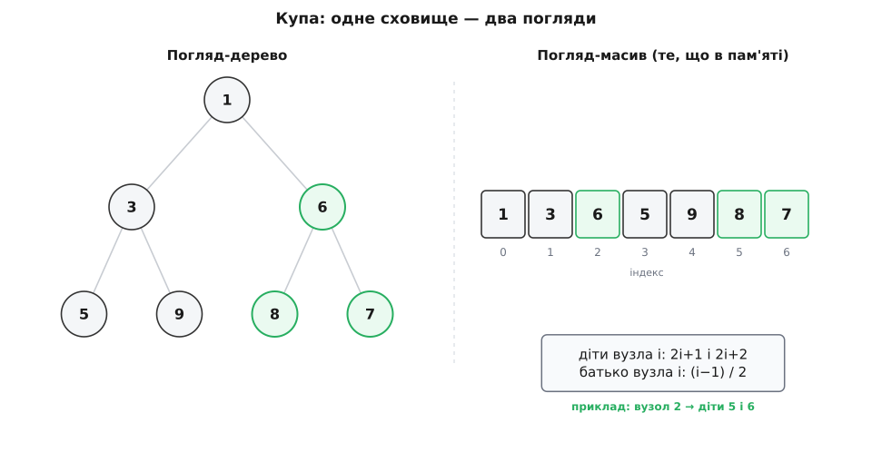
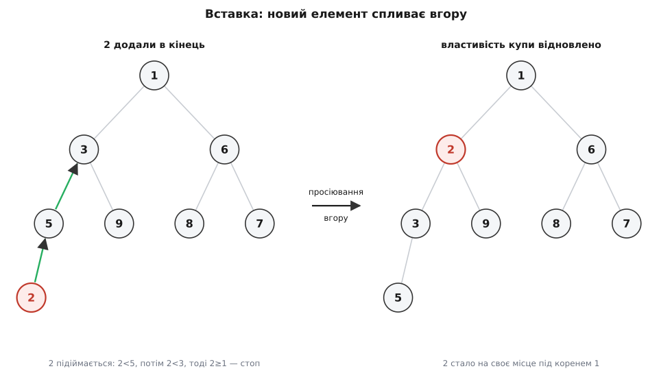
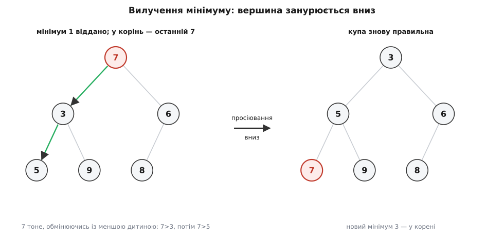

# Черга з пріоритетом (купа)

<preknowlist>
- [Асимптотична складність](topic:algorithms/asymptotic-complexity) — що означають O(log n), O(n), O(n log n) і як за ними порівнюють вартість операцій.
- [Двійкове дерево](topic:algorithms/binary-tree) — вузол, корінь, лист, рівень і висота; що таке *повне* двійкове дерево (усі рівні заповнені, крім, можливо, останнього).
</preknowlist>

Уяви приймальню невідкладної допомоги. Пацієнти приходять у випадковому порядку, але лікар бере не того, хто зайшов першим, а того, кому найгірше. Порядок обслуговування диктує не час прибуття, а **пріоритет**. Так само поводиться планувальник задач в операційній системі, черга подій у симуляції, вибір найближчої ще не пройденої вершини в пошуку найкоротшого шляху. Усім їм потрібна та сама структура: колекція, яка вміє швидко віддавати **найважливіший** елемент і так само швидко приймати нові.

Це і є **черга з пріоритетом** (пріоритет — від лат. *prior*, «старший, попередній»). Від звичайної [черги FIFO](topic:algorithms/queue-fifo), що видає елементи рівно в порядку надходження, вона відрізняється саме цим: віддає за важливістю, а не за часом приходу.

## Що структура має вміти

Черга з пріоритетом — це не конкретний код, а **абстракція**: набір операцій, а не спосіб їх виконати. Операцій усього три:

```
push(x)   — покласти елемент x
pop()     — вилучити й повернути найпріоритетніший (домовмось: найменший)
peek()    — підглянути найменший, не чіпаючи чергу
```

Домовитися, що «найважливіший» — це найменший чи найбільший, можна як завгодно: обидва варіанти дзеркальні, різниця лише в знаку порівняння. Структуру, де вершина — мінімум, звуть **min-купою**; де максимум — **max-купою**. Далі говоримо про min-купу, а щоб дістати max, досить скрізь поміняти «менше» на «більше».

Уся хитрість — зробити всі три операції дешевими **одночасно**. Саме тут наївні рішення й ламаються.

## Чому наївне рішення впирається в стіну

Найпростіше — тримати елементи в масиві. Але тоді доводиться вибрати, який кінець зробити зручним.

Якщо масив **не сортувати**, покласти елемент легко — дописати в кінець за O(1). Зате знайти найменший — це пройти геть усі n елементів: `pop` коштує O(n).

Якщо масив **тримати відсортованим**, навпаки: найменший завжди скраю, `pop` за O(1) — але кожен `push` мусить знайти правильне місце і зсунути хвіст, а це знову O(n).

```
                неврозсортований    відсортований
                масив               масив
push            O(1)                O(n)
pop-min         O(n)                O(1)
```

Куди не кинь — одна з двох операцій O(n). А коли черга обробляє мільйони подій, кожна операція за O(n) перетворює весь прогін на O(n²) — це смерть. [Збалансоване двійкове дерево пошуку](topic:algorithms/binary-search-tree) дало б обидві операції за O(log n), але це важча конструкція з вузлами й вказівниками, і для «дай мінімум» вона надлишкова.

Ключ ось у чому: щоб **завжди мати найменший**, повний порядок нам не потрібен. Потрібно рівно стільки впорядкованості, щоб мінімум було легко знайти і легко відновити після того, як його забрали. Оце «рівно стільки» — і є ідея купи.

## Купа: саме стільки порядку, скільки треба

**Купа** (англ. *heap* — стос, безладна купа; не плутати з «купою» динамічної пам'яті — це різні речі з однаковою назвою) — це повне двійкове дерево з однією властивістю:

> **Властивість купи (min):** кожен вузол не більший за обох своїх дітей.

Наслідок миттєвий: якщо батько завжди ≤ дітей, то, спускаючись від будь-якого вузла вниз, значення тільки зростають — отже, **найменший елемент усієї колекції сидить у корені**. Дістати мінімум — це просто глянути на вершину.

І водночас це набагато слабше за сортування. Сусіди-брати між собою **не впорядковані**; лівий листок може бути більшим за правого діда з іншої гілки. Купа знає лише вертикальні відношення «батько–дитина», і байдужа до горизонтальних. Ось ця слабкість — не вада, а весь фокус: **зміна торкається лише одного шляху від кореня до листа**, а не всієї структури, тому вставка й вилучення коштують лише O(log n).

> 🔧 **Навіщо це.** Повний порядок дорогий: вставити елемент у відсортований масив — це зсунути півмасиву. Купа тримає *частковий* порядок — рівно той, що потрібен, аби вершина завжди була мінімумом, — і платить за це лише висотою дерева. Обмін «менше знань — дешевше оновлення» тут ідеально збалансований під задачу «завжди дай найменший».

## Дерево, якого немає: купа живе в масиві

Слово «дерево» наводить на думку про вузли й вказівники. Але купа зберігається **в звичайному масиві, без жодного вказівника** — і це друга половина її краси.

Секрет — у слові *повне*. Раз у дереві немає дірок (усі рівні заповнені, а останній добивається зліва направо), його вузли можна занумерувати по порядку — рівень за рівнем, зліва направо, починаючи з 0 у корені. Тоді зв'язок «батько–дитина» перетворюється на просту арифметику з індексами:

```
діти вузла i:   2i+1  (лівий) ,  2i+2  (правий)
батько вузла i: (i−1) / 2      (ціла частина від ділення)
```



*Ту саму купу видно як дерево (ліворуч) і як плаский масив (праворуч). Дерево — це фікція: жодних вузлів у пам'яті немає, «спуститися до дитини» означає порахувати 2i+1.*

Ніякого виділення пам'яті на вузол, ніяких переходів за вказівниками. Дерево існує тільки в нашій голові й у формулах; у пам'яті лежить щільний масив.

> 🔧 **Навіщо це.** Масив із сусідніх комірок процесор читає набагато швидше, ніж розкидані по пам'яті вузли: сусіди підтягуються в кеш разом. Плюс купа займає вдвічі менше пам'яті, ніж дерево на вказівниках (нема службових полів `left`/`right`), і не смітить купу-пам'ять алокаціями. Тому саме на купі будують швидкі планувальники й симулятори, де операцій — мільйони.

## Вставка: просіювання вгору

Новий елемент кладемо туди, де дерево лишиться повним, — у першу вільну комірку, тобто в кінець масиву. Але він міг сісти під меншого батька й порушити властивість купи. Тоді запускаємо **просіювання вгору**: порівнюємо новачка з батьком і, якщо він менший, міняємо їх місцями; повторюємо, поки новачок або не впреться в корінь, або не стане не меншим за свого батька.

Розгляньмо купу `[1, 3, 6, 5, 9, 8, 7]` і додаймо число `2`.

**Умова: вставляємо 2 в купу [1, 3, 6, 5, 9, 8, 7].**

```
кладемо 2 в кінець (індекс 7), під батька 5 (індекс 3):
   2 < 5  →  міняємо  →  2 підіймається на індекс 3
батько тепер 3 (індекс 1):
   2 < 3  →  міняємо  →  2 підіймається на індекс 1
батько тепер 1 (індекс 0):
   2 ≥ 1  →  стоп
підсумок: [1, 2, 6, 3, 9, 8, 7, 5]
```



*Просіювання вгору: новачок 2 підіймається лише вздовж однієї гілки, обмінюючись із кожним більшим батьком, і зупиняється під коренем 1.*

Шлях від листа до кореня має довжину, що дорівнює висоті дерева, а висота повного дерева з n вузлів — це ⌊log₂ n⌋. Тому обмінів найбільше стільки ж: вставка коштує **O(log n)**.

## Вилучення мінімуму: просіювання вниз

Мінімум — це корінь, його й повертаємо. Але на його місці лишається дірка, а дерево має бути повним. Тому в корінь ставимо **останній** елемент масиву (він точно з дозволеного місця) і скорочуємо масив. Тепер уже цей великий елемент, найпевніше, порушує властивість — він завеликий, щоб бути батьком. Запускаємо **просіювання вниз**: дивимося на двох дітей, беремо **меншу** з них, і якщо вона менша за наш елемент — міняємо їх; повторюємо, поки елемент не сяде на лист або не стане не більшим за обох дітей.

**Умова: вилучаємо мінімум із купи [1, 3, 6, 5, 9, 8, 7].**

```
забираємо корінь 1; на його місце — останній елемент 7:
   [7, 3, 6, 5, 9, 8]
діти 7 — це 3 і 6; менша 3:
   7 > 3  →  міняємо  →  7 опускається до дітей 5 і 9
менша дитина 5:
   7 > 5  →  міняємо  →  7 стає листком, дітей немає
   стоп
підсумок: повернуто 1, купа [3, 5, 6, 7, 9, 8]
```



*Просіювання вниз: елемент 7 з вершини занурюється, щоразу обмінюючись саме з **меншою** дитиною, аж поки не знайде свій рівень.*

Тут ховається класична пастка: міняти треба саме з **меншою** дитиною. Якщо, скажімо, поміняти 7 із 6 (більшою), то 6 стане батьком 3 — і властивість купи знову зламана. Спуск теж іде вздовж однієї гілки, тож вилучення коштує **O(log n)**.

А `peek` — підглянути мінімум, не вилучаючи, — це просто прочитати корінь, **O(1)**.

## Код серця купи

Обидві операції — це короткі цикли навколо масиву. Ось min-купа з нуля; ідея всюди та сама, показана мовою з ручним контролем пам'яті (C++, як у справжніх планувальниках) і читкою мовою для наочності (Python).

:::tabs
```py
def _sift_up(h, i):
    while i > 0:
        parent = (i - 1) // 2
        if h[i] >= h[parent]:
            break
        h[i], h[parent] = h[parent], h[i]
        i = parent

def _sift_down(h, i):
    n = len(h)
    while True:
        smallest = i
        l, r = 2 * i + 1, 2 * i + 2
        if l < n and h[l] < h[smallest]:
            smallest = l
        if r < n and h[r] < h[smallest]:
            smallest = r
        if smallest == i:
            break
        h[i], h[smallest] = h[smallest], h[i]
        i = smallest

def push(h, x):
    h.append(x)
    _sift_up(h, len(h) - 1)

def pop_min(h):
    top = h[0]
    last = h.pop()
    if h:                 # якщо ще лишилися елементи
        h[0] = last
        _sift_down(h, 0)
    return top
```
```cpp
#include <vector>
#include <utility>   // std::swap

void sift_up(std::vector<int>& h, int i) {
    while (i > 0) {
        int parent = (i - 1) / 2;
        if (h[i] >= h[parent]) break;
        std::swap(h[i], h[parent]);
        i = parent;
    }
}

void sift_down(std::vector<int>& h, int i) {
    int n = (int)h.size();
    for (;;) {
        int smallest = i, l = 2 * i + 1, r = 2 * i + 2;
        if (l < n && h[l] < h[smallest]) smallest = l;
        if (r < n && h[r] < h[smallest]) smallest = r;
        if (smallest == i) break;
        std::swap(h[i], h[smallest]);
        i = smallest;
    }
}

void push(std::vector<int>& h, int x) {
    h.push_back(x);
    sift_up(h, (int)h.size() - 1);
}

int pop_min(std::vector<int>& h) {
    int top = h[0];
    h[0] = h.back();
    h.pop_back();
    if (!h.empty()) sift_down(h, 0);
    return top;
}
```
:::

У бойовому коді цю купу зазвичай не пишуть руками: у C++ є `std::priority_queue` (за замовчуванням max-купа), у Python — модуль `heapq` (min-купа над звичайним списком). Але всередині в них — рівно ці два цикли. Повнішу реалізацію з побудовою за один раз, зменшенням ключа й типовими граблями розібрано в [окремому проєкті-купі](topic:algorithms/priority-queue/proj-binary-heap.md).

## Побудова купи за один прохід

Часто в купу треба скласти одразу n готових елементів. Найпряміший спосіб — n разів викликати `push` — дає O(n log n). Але є краще. Кинь усі елементи в масив як є (це вже «дерево», тільки поки без порядку) і пройди **просіюванням вниз** кожен внутрішній вузол, з кінця до початку — від індексу n/2−1 до 0. Виходить купа, і коштує це, всупереч інтуїції, лише **O(n)**, а не O(n log n).

Чому так дешево? Бо більшість вузлів сидять біля дна: рівно половина — це листки, яким просіювати нікуди (0 роботи); чверть — на один рівень вище (щонайбільше 1 крок); і так далі. Дорогих вузлів угорі одиниці. Зважена сума швидко збігається — [точне виведення цієї O(n)-межі та решти оцінок](topic:algorithms/priority-queue/math-heap-analysis.md) розібрано окремо.

## Зменшення ключа й швидші родичі

Є ще одна корисна операція — **зменшити ключ**: підвищити пріоритет елемента, який уже в купі (наприклад, ми знайшли коротший шлях до вершини). Це просто просіювання вгору з його позиції, теж O(log n) — **якщо ми знаємо, де він лежить**. А щоб знати, доводиться тримати збоку карту «елемент → його індекс» і оновлювати її при кожному обміні. Саме зменшення ключа — те, на що спирається [алгоритм Дейкстри](topic:algorithms/dijkstra), коли послаблює оцінки відстаней.

Звичайна двійкова купа — не єдина. Існують **d-арні купи** (у кожного вузла не 2, а d дітей: дерево нижче, спуск довший на кожному рівні, зате менше рівнів — виграш там, де зменшень ключа багато). Є [фібоначчієва купа](topic:algorithms/fibonacci-heap), що дає зменшення ключа за O(1) в [амортизованому](topic:algorithms/amortized-analysis) сенсі — теоретично це прискорює Дейкстру до O(E + V·log V), — але з великими сталими накладними, тож на практиці її обходять. Для переважної більшості коду проста двійкова купа виграє саме простотою й малою сталою: кілька рядків, щільний масив, дружба з кешем.

## Де живе купа

Купа — робоча конячка всюди, де треба раз по раз брати найкраще з мінливого набору:

- [Сортування купою (heapsort)](topic:algorithms/heapsort) — скласти все в max-купу і по одному виймати максимум; сортування на місці за O(n log n) без рекурсії. Саме заради нього купу й винайшли.
- [Алгоритм Дейкстри](topic:algorithms/dijkstra) та A* — щоразу дістати найближчу ще не пройдену вершину.
- [Кодування Гаффмана](topic:algorithms/huffman-coding) — раз по раз зливати два найрідші символи.
- Симуляція подій — обробляти події в порядку часу настання.
- Злиття k відсортованих потоків, вибір k найбільших, планувальники задач.

Спільна риса всіх цих задач — «дай наступний найкращий і прийми нові», і купа відповідає на неї за O(log n) на операцію з мізерною сталою. Історію винаходу — як купа народилася зі спроби посортувати на місці й хто дав їй остаточну форму — розказано [окремо](topic:algorithms/priority-queue/hist-heap-birth.md).

Підсумок вартості операцій, поряд із наївними масивами:

```
операція       неврозсорт.   відсорт.     купа
               масив         масив
push           O(1)          O(n)         O(log n)
peek-min       O(n)          O(1)         O(1)
pop-min        O(n)          O(1)         O(log n)
побудова з n   O(n)          O(n log n)   O(n)
```

Купа не найшвидша в жодному окремому стовпчику — але єдина, у якої **немає жодного O(n)**. Саме тому, коли потрібні і швидкі вставки, і швидкий доступ до найважливішого, відповідь майже завжди — купа.
