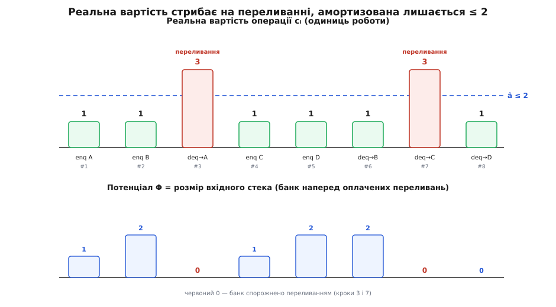
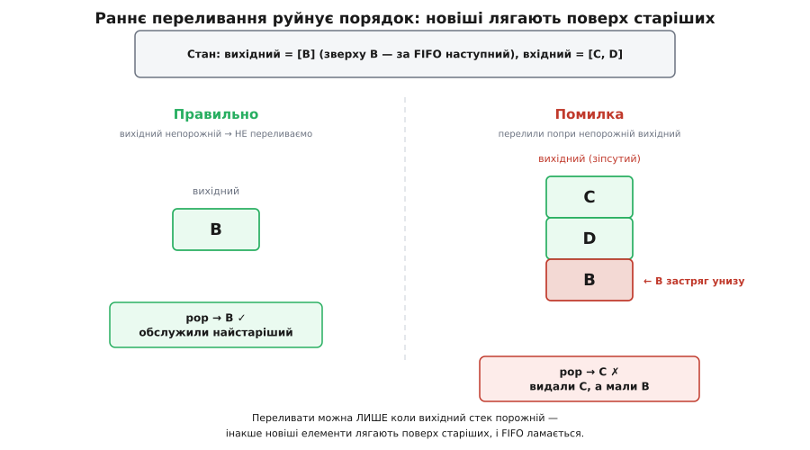

# ⚙️ Черга з двох стеків: код і амортизація

<preknowlist>
- [Стек](book:programming/stack-lifo) — кладемо й знімаємо з одного кінця (`push`/`pop`), останній покладений виходить першим (LIFO). Уся конструкція нижче складена з двох таких стеків і більше нічого не використовує.
- [Амортизований аналіз](book:algorithms/amortized-analysis) — спосіб довести, що низка операцій коштує O(n) сумарно, навіть коли окрема буває дорогою; метод потенціалу, який ми тут застосуємо на живому прикладі.
</preknowlist>

Уявімо, що стека в нас є, а черги — немає, і зробити її треба **тільки зі стеків**. Обмеження звучить як капризна умова співбесіди, але воно цілком реальне: у мовах, де дані незмінні, єдина дешева структура — однобічний список, а він поводиться рівно як стек (додаєш і знімаєш з одного кінця). Черги там немає в принципі; її доводиться будувати з того, що є. Отже, питання не штучне: **чи можна з дисципліни «останній прийшов — перший вийшов» зібрати протилежну — «перший прийшов — перший вийшов»?**

Можна, і платити за це майже нічого. Ключ — єдина властивість стека: він **перевертає** порядок. Що зайшло першим, лежить на дні й вийде останнім. А тепер спостереження, на якому тримається все: якщо перевернути двічі, порядок **відновиться**. Перекладіть колоду карт зі стосу в стос, знімаючи по одній згори, — і вона ляже задом наперед. Перекладіть її так само ще раз — і повернеться, як була. Черга з двох стеків — це просто акуратно організовані два таких перекладання.

## Ідея: два стеки й одне правило

Тримаємо два стеки. Один назвемо **вхідним** — у нього тільки кладуть. Другий **вихідним** — з нього тільки знімають.

- **Покласти** (`enqueue`) — пхнути елемент у вхідний стек. Усе. Найдешевша операція, яка може бути.
- **Забрати** (`dequeue`) — глянути у вихідний. Якщо там щось лежить, зняти згори: це вже найстаріший елемент у правильному, FIFO-порядку. Якщо ж вихідний **порожній** — спершу **перелити** в нього весь вхідний (по одному знімаємо з вхідного й кладемо у вихідний), а тоді знімати.

Чому після переливання елементи у вихідному лягають правильно? Бо вхідний уже тримав їх перевернутими — останній покладений зверху. Переливання знімає їх згори (спочатку найновіший) і кладе у вихідний — тобто перевертає **вдруге**. Друге перевертання скасовує перше: найстаріший елемент, що лежав на дні вхідного, опиняється зверху вихідного й виходить першим. Порядок надходження відновлено.

Уся коректність тримається на одному інваріанті, який варто промовити вголос:

> 🔧 **Навіщо це.** Інваріант: **вихідний стек завжди тримає найстаріші елементи, вже в правильному порядку, найстаріший — зверху**. Вхідний тримає новіші, ще не розвернуті. Переливання дозволене **лише** тоді, коли вихідний спорожнів дощенту, — інакше свіжі елементи ляжуть *поверх* старих і випередять їх. Тому «переливай, тільки коли вихідний порожній» — це не оптимізація, а умова правильності. Порушиш її — і черга почне видавати елементи не в тому порядку (нижче побачимо, як саме).

## Робочий код

Ось повна черга. Стек тут — звичайний динамічний масив (у Python — `list`, у C++ — `std::vector`, у TypeScript — `Array`, у Go — зріз): додати в кінець і зняти з кінця кожна з цих мов уміє дешево. Переливання винесене в окремий метод `_transfer`, і він **сам** береже головне правило — торкається вихідного, лише коли той порожній. Через це один-єдиний рядок-сторож захищає і `dequeue`, і `peek` від однакової помилки.

:::tabs
```py
class Queue:
    def __init__(self):
        self._in = []          # сюди пхаємо (enqueue)
        self._out = []         # звідси знімаємо (dequeue / peek)

    def enqueue(self, x):
        self._in.append(x)     # просто на вершину вхідного

    def _transfer(self):
        # переливаємо ЛИШЕ коли вихідний порожній — інакше зламаємо порядок
        if not self._out:
            while self._in:
                self._out.append(self._in.pop())   # друге перевертання

    def dequeue(self):
        self._transfer()
        if not self._out:
            raise IndexError("черга порожня")
        return self._out.pop()

    def peek(self):
        self._transfer()       # peek теж мусить перелити, якщо вихідний порожній
        if not self._out:
            raise IndexError("черга порожня")
        return self._out[-1]

    def __len__(self):
        return len(self._in) + len(self._out)
```
```cpp
#include <vector>
#include <stdexcept>

template <typename T>
class Queue {
    std::vector<T> in_;    // сюди пхаємо (enqueue)
    std::vector<T> out_;   // звідси знімаємо (dequeue / peek)

    void transfer() {
        // переливаємо ЛИШЕ коли вихідний порожній — інакше зламаємо порядок
        if (out_.empty()) {
            while (!in_.empty()) {
                out_.push_back(in_.back());   // друге перевертання
                in_.pop_back();
            }
        }
    }

public:
    void enqueue(const T& x) {
        in_.push_back(x);          // просто на вершину вхідного
    }

    T dequeue() {
        transfer();
        if (out_.empty()) throw std::out_of_range("черга порожня");
        T top = out_.back();
        out_.pop_back();
        return top;
    }

    const T& peek() {
        transfer();                // peek теж мусить перелити, якщо вихідний порожній
        if (out_.empty()) throw std::out_of_range("черга порожня");
        return out_.back();
    }

    std::size_t size() const {
        return in_.size() + out_.size();
    }
};
```
```ts
class Queue<T> {
  #in: T[] = [];               // сюди пхаємо (enqueue)
  #out: T[] = [];              // звідси знімаємо (dequeue / peek)

  enqueue(x: T): void {
    this.#in.push(x);          // просто на вершину вхідного
  }

  #transfer(): void {
    // переливаємо ЛИШЕ коли вихідний порожній
    if (this.#out.length === 0) {
      while (this.#in.length > 0) {
        this.#out.push(this.#in.pop()!);   // друге перевертання
      }
    }
  }

  dequeue(): T {
    this.#transfer();
    if (this.#out.length === 0) throw new Error("черга порожня");
    return this.#out.pop()!;
  }

  peek(): T {
    this.#transfer();          // peek теж змушує переливання
    if (this.#out.length === 0) throw new Error("черга порожня");
    return this.#out[this.#out.length - 1];
  }

  get size(): number {
    return this.#in.length + this.#out.length;
  }
}
```
```go
type Queue[T any] struct {
    in  []T // сюди пхаємо (Enqueue)
    out []T // звідси знімаємо (Dequeue / Peek)
}

func (q *Queue[T]) Enqueue(x T) {
    q.in = append(q.in, x) // просто на вершину вхідного
}

func (q *Queue[T]) transfer() {
    if len(q.out) == 0 { // переливаємо ЛИШЕ коли вихідний порожній
        for len(q.in) > 0 {
            top := q.in[len(q.in)-1]
            q.in = q.in[:len(q.in)-1]
            q.out = append(q.out, top) // друге перевертання
        }
    }
}

// Dequeue за звичаєм Go повертає (значення, ok): ok=false на порожній черзі.
func (q *Queue[T]) Dequeue() (T, bool) {
    q.transfer()
    var zero T
    if len(q.out) == 0 {
        return zero, false
    }
    top := q.out[len(q.out)-1]
    q.out = q.out[:len(q.out)-1]
    return top, true
}

func (q *Queue[T]) Peek() (T, bool) {
    q.transfer() // Peek теж змушує переливання
    var zero T
    if len(q.out) == 0 {
        return zero, false
    }
    return q.out[len(q.out)-1], true
}

func (q *Queue[T]) Len() int { return len(q.in) + len(q.out) }
```
:::

Чотири реалізації однакові по суті й відрізняються лише характером мови: Python, C++ і TypeScript кидають виняток на порожній черзі, Go за своїм звичаєм повертає другим значенням `ok`. Скрізь `enqueue` — це один рядок, а вся хитрість схована в `_transfer` за сторожем `if порожній`.

## Прогін крок за кроком

Наберемо послідовність, у якій дешеві й дорогі забори перемішані, і простежимо обидва стеки. Позначаю вершину стека праворуч.

```
                       вхідний      вихідний   що сталося
enqueue(A)             [A]          []         пхнули у вхідний
enqueue(B)             [A, B]       []          -//-
dequeue() → A          []           [B]        вихідний порожній →
                                               перелили B,A; зняли A
enqueue(C)             [C]          [B]         пхнули
enqueue(D)             [C, D]       [B]         -//-
dequeue() → B          [C, D]       []          вихідний мав B — просто зняли
dequeue() → C          []           [D]        вихідний порожній →
                                               перелили D,C; зняли C
dequeue() → D          []           []          вихідний мав D — просто зняли
```

Вийшли **A, B, C, D** — рівно в порядку надходження. Придивімося до двох забарних місць. На третьому кроці вихідний був порожній, тож `dequeue` заплатив за переливання двох елементів. А от `B`, що потрапив у вихідний саме тоді, спокійно долежав там крізь два наступні `enqueue` і зійшов **дешево** на шостому кроці — жодного повторного переливання. Кожен елемент переливають **один раз за життя**; далі він лише чекає своєї черги на вершині вихідного.

Це і є вся суть майбутнього доказу: дорога робота (переливання) трапляється зрідка, а між нею — купа дешевих операцій, і одне окуповує інше. Намалюймо цю нерівномірність.


*Верхня панель — скільки роботи насправді коштує кожна операція: два переливання (кроки 3 і 7) підскакують до 3, решта — рівно 1. Нижня — «банк»: потенціал Φ дорівнює розміру вхідного стека, підростає на кожному `enqueue` (кладемо туди монету наперед) і миттєво спорожняється на переливанні. Дорогий стрибок оплачено накопиченим — тому в перерахунку кожна операція не дорожча за стелю â ≤ 2.*

## Чому це O(1): метод потенціалу

Спокуса сказати «O(1)» тут небезпечна, бо окрема операція O(1) **не** є. Наберіть у чергу мільйон елементів, потім заберіть один — і цей єдиний `dequeue` перелле весь мільйон. У найгіршому разі одна операція коштує O(n), і жодне красиве слово цього не сховає. Правильне твердження інше: **будь-яка послідовність з m операцій коштує O(m) сумарно**, тож у перерахунку на операцію виходить сталий час. Саме таку «дешеву в середньому по низці» вартість називають амортизованою, а найчистіший спосіб її довести — [метод потенціалу](book:algorithms/amortized-analysis).

Ідея методу — банківська. Введемо «рахунок» Φ (потенціал) — число, що вимірює приховану, ще не витрачену роботу, яка сидить у структурі. Дорогі операції не беруть роботу з повітря — вони **знімають** її з рахунку, який дешеві операції заздалегідь поповнили. Формально кожній операції приписують **амортизовану вартість**:

```
â = (реальна вартість) + (Φ після − Φ до)
```

Дешева операція, що відкладає щось про запас, «переплачує»: її â більше за реальну вартість, бо вона ще й підняла Φ. Дорога, що витрачає запас, «недоплачує»: її â менше за реальну, бо Φ впав. Якщо підібрати Φ так, щоб кожне â вийшло сталим, — справу зроблено.

Тут напрошується разюче простий вибiр: **Φ = розмір вхідного стека**. Логіка прозора: кожен елемент, що лежить у вхідному, — це одне неминуче майбутнє переливання, за яке хтось мусить заплатити. Хай платить той, хто його туди поклав. За одиницю роботи візьмемо одне торкання елемента: покласти його, перенести під час переливання або зняти — кожне коштує одну одиницю. Перевіримо три випадки.

**Покласти (`enqueue`).** Реальна робота — одне пхання у вхідний: 1. Вхідний виріс на елемент, тож Φ зросло на 1.

```
â = 1 + (+1) = 2
```

**Забрати, коли вихідний непорожній.** Реальна робота — одне зняття з вихідного: 1. Вхідного не торкалися, Φ не змінилось.

```
â = 1 + 0 = 1
```

**Забрати, коли вихідний порожній, а у вхідному k елементів.** Реальна робота — перенести k елементів плюс зняти відповідь: k + 1. Вхідний спорожнів, Φ упало з k до 0, тобто на −k.

```
â = (k + 1) + (−k) = 1
```

Ось де магія: дороге переливання коштує k, але рівно стільки ж потенціалу воно й вивільняє, і в амортизованому підрахунку k **скорочується**. Лишається +1. Усі три випадки дали сталу величину — не більшу за 2.

Тепер зберемо це в підсумкову нерівність. Сума реальних вартостей по всіх m операціях дорівнює сумі амортизованих мінус загальна зміна потенціалу:

```
Σ (реальна) = Σ â − (Φ_кінцеве − Φ_початкове)
```

Порожня черга стартує з Φ = 0, а розмір стека ніколи не буває від'ємним, тож Φ_кінцеве ≥ 0. Отже, від'ємник тільки зменшує праву частину, і

```
Σ (реальна) ≤ Σ â ≤ 2m
```

Уся послідовність з m операцій коштує щонайбільше 2m одиниць — це O(m). Поділивши на m операцій, маємо **O(1) амортизовано на операцію**. Що й треба було довести.

Той самий висновок можна побачити зовсім без формул, простим підрахунком: за все життя елемент торкаються тричі — раз кладуть у вхідний, раз переносять у вихідний, раз знімають з вихідного. Три торкання на елемент, n елементів — 3n торкань, O(n) сумарної роботи. Метод потенціалу — лише строгий каркас навколо цього очевидного «кожного носять рівно раз».

Дві чесні примітки, щоб доказ не здавався фокусом.

*Що таке «одиниця».* Ми полічили перенесення одного елемента за одну одиницю, хоча всередині це і зняти, і покласти — дві машинні дії. Якщо рахувати їх нарізно, кожне переливання подорожчає вдвічі; тоді беруть Φ = 2 × (розмір вхідного), і стала в оцінці стане 3 замість 2. Число інше — висновок O(1) той самий.

*На чому стоїть сам стек.* Ми припустили, що `push` і `pop` коштують O(1). Динамічний масив дає це лише амортизовано (зрідка він перевиділяється й копіюється) — виходить амортизація поверх амортизації, що бентежить. Хочете чистоти — покладіть стек на однобічний список: тоді `push`/`pop` — O(1) **у найгіршому разі**, і вся амортизація черги тримається виключно на переливанні, ні на чому іншому.

## Пастки

**Переливати, лише коли вихідний порожній.** Це найгрубша й найпідступніша помилка, бо ламає не швидкодію, а **правильність**. Спокусливо написати `dequeue` простіше: «завжди перелий вхідний у вихідний, тоді зніми». Поки забори йдуть підряд — начебто працює. Але щойно `enqueue` втрутиться між заборами — вихідний ще не спорожнів, а ми доливаємо в нього свіже, і свіже лягає **поверх** старого, випереджаючи його.


*Стан: у вихідному лежить `B` (наступний за FIFO), у вхідному — `C, D`. Ліворуч — правильна поведінка: вихідний непорожній, переливання пропускаємо, знімаємо `B`. Праворуч — хибне раннє переливання: `C` і `D` лягають поверх `B`, і `dequeue` віддає `C`, тимчасом як `B` застрягає на дні. Порядок зламано мовчки — черга й далі щось видає, просто не те.*

**`peek` теж змушує переливання.** Легко забути, що «підглянути голову» — така сама операція читання з вихідного, як і `dequeue`. Якщо вихідний порожній, а вхідний ні, то потрібний елемент фізично лежить *на дні вхідного* — під усіма іншими, догори дриґом. Прочитати вершину вихідного (порожню) чи вершину вхідного (там найновіший, не найстаріший) — обидва дадуть неправду. Тому `peek` мусить викликати той самий `_transfer` перед тим, як дивитися. У коді вище це так і зроблено — один спільний сторож і для `dequeue`, і для `peek`.

**Не обіцяйте O(1) у найгіршому разі.** Амортизація каже про низку операцій, а не про кожну окремо. Якщо ваш код працює там, де важить **кожна** операція — драйвер переривань, обробка звуку, керування в реальному часі, — черга з двох стеків не годиться: одне переливання здатне з'їсти час, розрахований на тисячу дешевих кроків, і зірвати дедлайн. Там, де потрібен гарантований сталий час на кожен виклик, беруть [кільцевий буфер](book:algorithms/ring-buffer) або спеціальні черги реального часу (про них — нижче).

**Амортизація ламається під час повторного використання старих версій.** Ця пастка тонша й вилазить лише в незмінному (persistent) світі. Наш доказ мовчки припускав, що структуру використовують «лінійно»: зробили операцію — далі працюють уже з новим станом, старий забули. А якщо зберегти версію черги *перед* дорогим переливанням і викликати з неї `dequeue` тисячу разів поспіль? Щоразу вихідний порожній, щоразу переливається весь вхідний — тисяча дорогих операцій замість однієї. Накопичений потенціал витрачається знову й знову, бо кожна гілка «майбутнього» бачить той самий повний рахунок. Проста амортизація на це не розрахована.

## Де це справді потрібно

Найпрактичніший дім цього прийому — мови з **незмінними** даними. Там немає стека-масиву, який можна псувати `push`-ом на місці; є лише однобічний [незмінний список](book:programming/immutability) — а він і є стек: `cons` додає голову (аналог `push`), взяти голову й хвіст — аналог `pop`. Черга з двох таких списків — стандартний спосіб дістати ефективну FIFO там, де інакше її просто немає.

Канонічно це описав [Кріс Окасакі (Chris Okasaki)](https://www.cs.cmu.edu/~rwh/students/okasaki.pdf) — спершу в докторській дисертації в університеті Карнеґі-Меллона (CMU-CS-96-177, 1996), а тоді в книжці «Purely Functional Data Structures» (Cambridge University Press, 1998), що стала класикою функційного програмування. Він же чесно розкрив і четверту пастку вище, і її розв'язок. Наївна двосписна черга під повторним використанням версій втрачає свою амортизовану оцінку; Окасакі відновлює її **лінивими обчисленнями**: переливання стає відкладеним обчисленням, яке форсується щонайбільше раз, а результат поділяється між усіма гілками (його «черга банкіра», *banker's queue*). А щоб дістати сталий час не в середньому, а **гарантовано на кожну операцію**, він застосовує прийом «розкладу» (*scheduling*) — потроху додається реального переливання на кожному кроці, тож жодна операція не вибухає (черга реального часу, *real-time queue*). Це вже інша, глибша конструкція, але росте вона з того самого зерна: два стеки й друге перевертання. *(Статус: задокументований факт — дисертація й книжка Окасакі є першоджерелами й доступні відкрито.)*

І навіть поза функційним світом двостекова черга варта того, щоб її знати. Вона — найчистіший навчальний приклад амортизації: дві прості структури, складені докупи, дають третю з новою поведінкою, а її вартість неможливо зрозуміти, дивлячись на одну операцію, — тільки на життя елемента загалом. Хто розібрав цей приклад до кінця, той уже по-справжньому зрозумів, що означає «O(1) в середньому».
