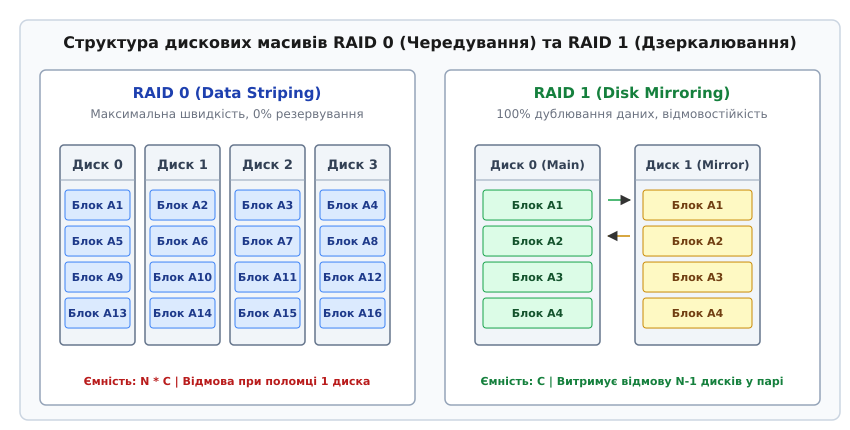
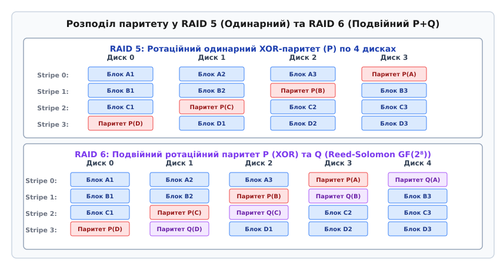
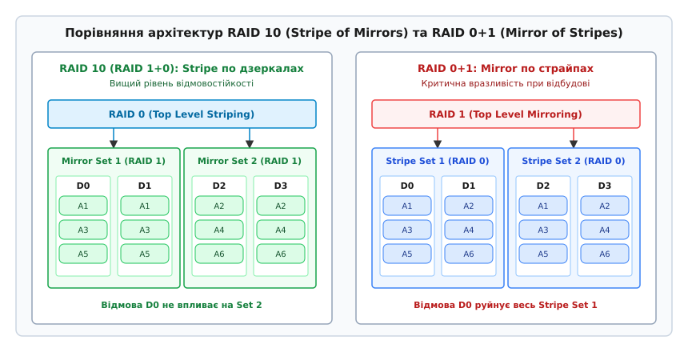
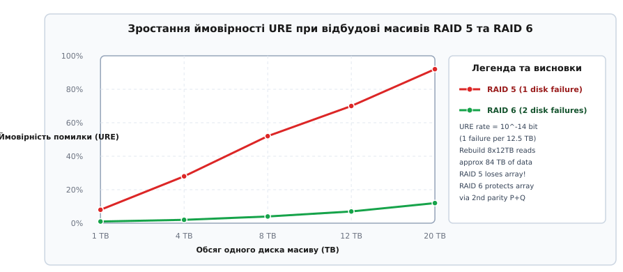

# Рівні RAID (RAID Levels)

<preknowlist>
- [Порозрядні операції](book:programming/bitwise-operations) — операція XOR (виключне «АБО») для обчислення контрольних сум паритету.
- [Асимптотична складність](book:algorithms/asymptotic-complexity) — поняття часової складності та пропускної здатності операцій введення-виведення.
- [B-дерево](book:algorithms/b-tree) — структура даних файлових систем та баз даних для розміщення індексів на дисках.
</preknowlist>

Кожен фізичний жорсткий диск (HDD) або твердотілий накопичувач (SSD) має два суворі апаратні обмеження: граничну пропускну здатність операцій введення-виведення на секунду (IOPS) та скінченний середній час між відмовами (MTTF, Mean Time To Failure). Якщо обчислювальна система вимагає зберігання петабайтів даних із високою швидкістю доступу, один фізичний диск фізично не здатний забезпечити потрібну пропускну здатність через затримки позиціонування головок зчитування та ліміти системної шини. Проте просте об'єднання `N` незалежних дисків у єдиний простір без надлишковості створює катастрофічну дилему надійності: ймовірність відмови принаймні одного накопичувача зростає експоненціально залежно від їхньої кількості.

Якщо ймовірність виходу з ладу одного диска протягом року становить `p`, то ймовірність збереження працездатності всіх `N` дисків дорівнює `(1 - p)ᴺ`. Відповідно, ймовірність катастрофічної поломки хоча б одного з `N` дисків у нерезервованому просторі обчислюється за формулою:

```
P_failure_array = 1 - (1 - p)ᴺ                          [ймовірність відмови масиву без резерву]
```

При помірній кількості дисків `N = 16` та типовій річній ймовірності відмови одного диска `p = 0.05` (5%) масив втрачатиме цілісність даних з ймовірністю:

```
P_failure_array = 1 - (1 - 0.05)¹⁶ = 1 - (0.95)¹⁶ ≈ 1 - 0.4401 = 0.5599 (56%)
```

Це означає, що більше половини дискових масивів такого розміру зазнають безповоротної втрати інформації вже у перший рік експлуатації.

Розв'язанням цієї дилеми є об'єднання кількох фізичних накопичувачів у єдину логічну систему за допомогою спеціалізованих алгоритмів розподілу даних та обчислення надлишковості. Таку архітектуру називають **RAID** (Redundant Array of Independent Disks — надлишковий масив незалежних дисків).

Головне завдання RAID полягає у маскуванні фізичної структури дисків від операційної системи. Для драйверів файлової системи масив RAID виглядає як єдиний суцільний віртуальний блоковий пристрій із лінійною адресацією секторів.

Детальніше про [історію виникнення RAID, папір Паттерсона 1988 року та еволюцію від мейнфреймів SLED до програмних сховищ SDS](book:algorithms/raid-levels/hist-raid-history.md) можна прочитати у відповідній історичній вставці.

## Базові примітиви побудови RAID: Чередування, Дзеркалювання та Парність

Будь-яка конфігурація RAID будується на комбінації трьох фундаментальних алгоритмічних примітивів: чередуванні даних (Striping), дзеркалюванні (Mirroring) та обчисленні контрольних сум паритету (Parity).

### 1. Чередування даних (Striping)

Чередування розбиває суцільний потік логічних даних на блоки фіксованого розміру — **страйп-юніти** (Stripe Units, зазвичай від 4 КБ до 1 МБ), які послідовно цикрулюють по `N` фізичних дисках. Сукупність `N` страйп-юнітів, розташованих за однаковим зсувом на всіх дисках масиву, називається **страйпом** (Stripe).

Адресація логічного блоку `L` у страйповому масиві описується алгебраїчними формулами:

```
Stripe_Index = L / Stripe_Unit                         [індекс страйпа у масиві]
Disk_Index = Stripe_Index mod N                        [номер фізичного диска]
Disk_Offset = (Stripe_Index / N) · Stripe_Unit + (L mod Stripe_Unit)  [зсув на диску]
```

Завдяки розпаралелюванню операцій зчитування та запису між `N` незалежними контролерами дисків, теоретична пропускна здатність системи масштабується лінійно:

```
Bandwidth_total = N · Bandwidth_disk                    [ідеальне паралельне читання/запис]
```

Чередування забезпечує найвищу швидкість обміну даними, оскільки контролер блокового пристрою може одночасно надсилати запити на читання до всіх `N` шпинделів або каналів Flash-пам'яті. Проте чередування не має жодної надлишковості. Вихід з ладу будь-якого одного накопичувача руйнує весь масив даних.

### 2. Дзеркалювання даних (Mirroring)

Дзеркалювання повністю дублює кожен логічний блок даних на два або більше фізичних дисків. При отриманні запису контролер дублює команду на всі фізичні накопичувачі дзеркальної групи.

При записі операція підтверджується лише після того, як дані фізично збережено на всіх дзеркальних копіях:

```
T_write = max(T_disk1, T_disk2, ..., T_diskN)           [затримка запису визначається найповільнішим диском]
```

Зчитування ж може виконуватися паралельно з будь-якого справного диска пари. Це дозволяє контролеру RAID розподіляти запити читання між дисками, подвоюючи ефективний IOPS на читання. Корисна ємність масиву при дзеркалюванні становить лише `1/N` від загального фізичного обсягу дисків (для 2 дисків — 50%).

### 3. Контроль парності (Parity)

Парність дає змогу відновити вміст одного втраченого диска без повного дублювання даних. Вона спирається на побітову операцію XOR (виключне «АБО», позначається `⊕`).

Нехай страйп складається з `N - 1` блоків даних `D₀, D₁, ..., Dⲛ₋₂`. Блок паритету `P` обчислюється як:

```
P = D₀ ⊕ D₁ ⊕ D₂ ⊕ ... ⊕ Dⲛ₋₂                           [обчислення блоку паритету]
```

Якщо диск із блоком даних `Dⲕ` виходить з ладу, його вміст миттєво реконструюється шляхом застосування операції XOR до решти справних блоків даних і блоку `P`:

```
Dⲕ = P ⊕ (⨁_{i ≠ k} Dᵢ)                                 [формула відновлення втраченого блоку]
```

Обчислення паритету дозволяє зберегти корисну ємність на рівні `(N - 1) / N`, витрачаючи обсяг лише одного диска на надлишковість.


*Візуальне порівняння компонування блоків даних у RAID 0 (чередування для максимальної швидкості) та RAID 1 (дзеркалювання для надійності).*

## Стандартні рівні RAID: Від RAID 0 до RAID 6

На основі зазначених примітивів сформовано стандартизовану архітектуру рівнів RAID.

### RAID 0 (Data Striping без надлишковості)

RAID 0 об'єднує `N` дисків виключно методом чередування. Усі блоки даних `A1, A2, A3, A4...` розподіляються циклічно по дисках.

- **Корисна ємність:** `N · C_disk` (100% фізичного обсягу).
- **Продуктивність:** Читання та запис досягають `N · IOPS_disk`.
- **Відмовостійкість:** 0 дисків. Поломка будь-якого диска призводить до повної безповоротної втрати масиву.

### RAID 1 (Disk Mirroring)

RAID 1 створює повну точну копію накопичувача на втором (або декількох) дисках.

- **Корисна ємність:** `1/N · C_total` (для 2 дисків — 50%).
- **Продуктивність:** Читання досягає `N · IOPS_disk` за рахунок паралельних запитів; запис обмежений швидкістю одного диска `1 · IOPS_disk` з додатковими накладними витратами на дворазову відправку команд.
- **Відмовостійкість:** Витримує відмову `N - 1` дисків у межах дзеркальної групи.

### Історичні рівні RAID 2, RAID 3 та RAID 4

- **RAID 2:** Чередує дані на рівні окремих бітів і використовує код Хеммінга (ECC) для виправлення помилок. Вимагає жорсткої синхронізації обертання шпинделів усіх дисків. Застарів, оскільки всі сучасні жорсткі диски мають вбудований апаратний ECC на рівні секторів.
- **RAID 3:** Чередує дані на рівні байтів і виділяє один фізичний диск під паритет. Вимагає синхронізації шпинделів. Не здатний виконувати паралельні незалежні I/O запити.
- **RAID 4:** Чередує дані на рівні блоків із виділеним окремим диском паритету. Дозволяє паралельні операції читання з дисків даних. Проте має критичний дефект продуктивності — **Parity Disk Bottleneck**: будь-яка операція запису на будь-який диск даних вимагає оновлення блоку паритету на єдиному диску `P`. Внаслідок цього диск паритету стає вузьким місцем, що обмежує продуктивність запису всього масиву швидкістю одного диска.

### RAID 5 (Block Striping з ротаційним паритетом)

RAID 5 розв'язує проблему вузького місця RAID 4 шляхом розподілу блоків паритету `P` по всіх `N` дисках масиву за коловою схемою (Rotating Parity).


*Динамічний ротаційний розподіл блоку паритету P у RAID 5 та подвійного паритету P/Q у RAID 6 вздовж страйпів дискового масиву.*

У кожному страйпі позиція блоку паритету зміщується на один диск ліворуч або праворуч. Завдяки цьому навантаження на запис паритету рівномірно розсіюється по всіх накопичувачах.

#### Проблема 4-кратного штрафу на запис (Write Penalty)

При послідовному записі цілого страйпа контролер обчислює паритет `P = D₀ ⊕ D₁ ⊕ D₂` безпосередньо в оперативній пам'яті за один прохід (Full Stripe Write).

Проте при випадковому частковому записі одного блоку `Dᵢ` (Partial Stripe Write) контролер змушений оновити блок паритету `P` за формулою:

```
P_new = P_old ⊕ D_old ⊕ D_new                           [формула швидкого оновлення паритету]
```

Для цього контролер виконує **4 операції введення-виведення** на фізичних дисках:
1. **Read** старого значення даних `D_old` з диска даних.
2. **Read** старого значення паритету `P_old` з диска паритету.
3. **Write** нового значення даних `D_new` на диск даних.
4. **Write** нового значення паритету `P_new` на диск паритету.

Це явище називається **Штрафом на запис RAID 5 (Write Penalty = 4)**. 

Ефективна продуктивність IOPS масиву RAID 5 під випадковим навантаженням обчислюється за формулою:

```
IOPS_effective = (N · IOPS_disk) / (r + 4 · w)          [де r — частка читання, w — частка запису]
```

Якщо навантаження містить 50% читання та 50% запису (`r = 0.5, w = 0.5`), знаменник дорівнює `0.5 + 4 · 0.5 = 2.5`. Масив із 8 дисків замість теоретичних 8000 IOPS видасть лише `8000 / 2.5 = 3200 IOPS`.

### RAID 6 (Block Striping з подвійним паритетом P+Q)

У міру зростання обсягу жорстких дисків часовий інтервал відбудови RAID 5 зростав з годин до діб. Ймовірність виходу з ладу другого диска під час відбудови стане катастрофічною. Для захисту від двох одночасних відмов створено RAID 6.

RAID 6 додає другий незалежний блок ротаційного паритету `Q`. Для кожного страйпа обчислюються дві контрольні суми:
- **Паритет P:** Звичайний побітовий XOR-паритет.
- **Паритет Q:** Контрольна сума на основі коду Ріда-Соломона у полі Галуа `GF(2^8)` або діагонального паритету.

```
P = D₀ ⊕ D₁ ⊕ ... ⊕ Dⲛ₋₃
Q = g⁰·D₀ ⊕ g¹·D₁ ⊕ ... ⊕ gⁿ⁻³·Dⲛ₋₃                     [де g — генератор поля GF(2^8)]
```

Детальніше про [математичний апарат полів Галуа GF(2⁸), матриці Коші та розрахунок ймовірностей URE](book:algorithms/raid-levels/math-parity-gf28.md) можна прочитати у математичній вставці.

- **Корисна ємність:** `(N - 2) · C_disk`.
- **Відмовостійкість:** Гарантований захист від одночасної відмови **будь-яких 2 дисків**.
- **Write Penalty:** При випадковому записі вимагається читання старого блоку даних, двох паритетів та запис трьох нових блоків (натиск 6 I/O операцій: **Write Penalty = 6**).

## Комбіновані (Вкладені) рівні RAID

Для об'єднання високої продуктивності чередування з високою відмовостійкістю дзеркалювання або паритету застосовують вкладені ієрархічні рівні (Nested RAID).


*Порівняльна ієрархічна структура RAID 10 (дзеркала на нижньому рівні, страйп на верхньому) та RAID 0+1 (страйпи на нижньому рівні, дзеркало на верхньому).*

### RAID 10 (RAID 1+0: Stripe of Mirrors) проти RAID 0+1 (Mirror of Stripes)

Попри схожість назв, RAID 10 та RAID 0+1 суттєво відрізняються за топологією відмовостійкості:

- **RAID 10 (Stripe of Mirrors):** Диски об'єднуються у пари дзеркал RAID 1 на нижньому рівні, а над цими дзеркальними парами будується масив чередування RAID 0.
- **RAID 0+1 (Mirror of Stripes):** Диски об'єднуються у великі масиви чередування RAID 0 на нижньому рівні, після чого два страйпові масиви об'єднуються дзеркалюванням RAID 1.

#### Чому RAID 10 принципово кращий за RAID 0+1

Припускаємо масив із 4 дисків (`D0, D1, D2, D3`). Нехай диск `D0` фізично вийшов з ладу.

1. У **RAID 0+1**: Відмова `D0` руйнує весь перший підмасив RAID 0. Система переходить у деградований стан, де вся надійність тримається лише на другому підмасиві (`D2+D3`). Якщо під час відбудови відбудеться збій диска `D2` або `D3`, масив повністю втрачено. Ймовірність фатальної відмови при другій поломці становить **100%**.
2. У **RAID 10**: Відмова `D0` виводить з ладу лише першу дзеркальну пару (`D0+D1`). Друга дзеркальна пара (`D2+D3`) продовжує працювати абсолютно штатно. Масив витримає другу поломку диска `D2` або `D3` з імовірністю **66.6%** (критичною є лише поломка парного диска `D1`).

Саме тому в промислових системах зберігання даних використовується виключно **RAID 10**.

### RAID 50 та RAID 60

- **RAID 50 (RAID 5+0):** Масив чередування RAID 0, побудований над кількома підгрупами RAID 5. Дозволяє прискорити відбудову великих дискових масивів (понад 16 дисків), обмеживши домен відбудови межами однієї групи RAID 5.
- **RAID 60 (RAID 6+0):** Чередування над кількома групами RAID 6. Забезпечує найвищий рівень корпоративної надійності для масивів із десятків і сотень накопичувачів.

## Крайові випадки, пастки та апаратні ризики

Проектування та експлуатація дискових масивів пов'язана з декількома критичними інженерними пастками.

### 1. Проблема «діри запису» (Write Hole Problem)

При виконанні Partial Stripe Write у RAID 5/6 контролер спочатку змінює блок даних, а потім оновлює блок паритету. Якщо в проміжку між цими двома операціями відбудеться аварійне вимкнення живлення або збій ядра ОС (Kernel Panic), масив опиниться у неузгодженому стані: блок даних буде новим, а блок паритету — старим.

Цей дефект називають **Write Hole** (діра запису). При наступній відмові будь-якого диска масив спробує реконструювати дані через некоректний паритет, що призведе до прихованого пошкодження даних (Silent Data Corruption).

Способи розв'язання проблеми Write Hole:
- **Апаратні RAID-контролери:** Застосування кешу запису з акумуляторним або конденсаторним захистом (BBU / Flash-Backed Write Cache), який завершує незавершені страйпи після подачі живлення.
- **Linux mdadm:** Застосування спеціального лог-диска (`--write-journal`) для журналювання страйпів перед записом.
- **ZFS / RAID-Z:** Відмова від статичного розміру страйпа. ZFS використовує динамічний розмір страйпа та транзакційний механізм Copy-on-Write (CoW), що робить діру запису математично неможливою.

### 2. Загроза URE при відбудові (Rebuild / Resilver)

Під час відбудови масиву RAID 5 після заміни збійного диска система зчитує 100% секторів з усіх решти дисків.


*Графік зростання ймовірності виникнення невідновної помилки читання (URE) під час відбудови RAID 5 та захисний ефект подвійного паритету RAID 6.*

Для сучасних дисків ємністю 12–20 ТБ обсяг зчитування під час відбудови сягає десятків терабайтів. З огляду на специфікацію невідновних помилок читання (URE rate `10⁻¹⁴` бітів), ймовірність зустріти пошкоджений сектор під час відбудови RAID 5 з 8 дисків по 12 ТБ наближається до **99.8%**. Будь-який URE-сектор під час відбудови RAID 5 призводить до зупинки процесу або втрати даних. 

> 🔧 **Навіщо це.**
> У сучасній інфраструктурі зберігання даних (Storage Engineering) використання RAID 5 для накопичувачів обсягом понад 2 ТБ **суворо заборонено**. Для великих HDD обов'язковим стандартом є RAID 6, RAID 10 або триплексні алгоритми RAID-Z2 / RAID-Z3 у ZFS.

Детальніше про [практичну реалізацію емулятора RAID 0, 1, 5 із підтримкою відбудови та деградованого режиму на мовах C та C++](book:algorithms/raid-levels/proj-raid-simulator.md) можна дізнатися у відповідній програмній вставці.

Детальніше про [інтерфейс утиліти mdadm, структуру procfs та тонке налаштування параметрів ядра Linux через sysfs](book:algorithms/raid-levels/api-linux-md.md) розписано у довідниковій вставці.

## Сучасний стан: Declustered RAID та Erasure Coding

У сучасних дата-центрах із тисячами накопичувачів класичний RAID поступається місцем декластеризованому RAID (**dRAID**) та алгоритмам стирання кодуванням (**Erasure Coding**).

У традиційному RAID 6 вихід диска з ладу навантажує відбудовою лише сусідні `N - 1` дисків того самого масиву. У **dRAID** (що використовується в ZFS 2.1+ та Ceph) страйпи паритету псевдовипадково розподіляються по сотнях дисків всієї стійки. При відмові одного диска в відбудові беруть участь одночасно 100 дисків сховища. Внаслідок цього час відбудови 16 ТБ накопичувача скорочується з 36 годин до 15 хвилин, що практично нівелює ризик повернення URE.

## Порівняльна характеристика рівнів RAID

У таблиці нижче зведено ключові інженерні параметри основних рівнів RAID для масиву з `N` однакових дисків ємністю `C` та продуктивністю `I` (IOPS):

| Рівень RAID | Мін. дисків (`N`) | Корисна ємність | Відмовостійкість (дисків) | Штраф запису (Write Penalty) | Швидкість читання | Швидкість запису | Сфера застосування |
| :--- | :--- | :--- | :--- | :--- | :--- | :--- | :--- |
| **RAID 0** | 2 | `N · C` | 0 (немає) | 1 | `N · I` | `N · I` | Тимчасові дані, кеш, відеорендеринг. |
| **RAID 1** | 2 | `1/N · C_total` | `N - 1` | 2 | `N · I` | `1 · I` | ОС, бази даних, критичні системні розділи. |
| **RAID 5** | 3 | `(N - 1) · C` | 1 | 4 | `(N - 1) · I` | `(N / 4) · I` | Файлові сервери, файлові сховища малих обсягів. |
| **RAID 6** | 4 | `(N - 2) · C` | 2 | 6 | `(N - 2) · I` | `(N / 6) · I` | Сховища великої ємності (SATA/SAS HDD > 4TB). |
| **RAID 10**| 4 | `N/2 · C` | Від 1 до `N/2` | 2 | `N · I` | `(N / 2) · I` | Високонавантажені СУБД (OLTP, PostgreSQL, MySQL). |
| **RAID 50**| 6 | `(N - 2) · C` | 1 на кожну групу | 4 | `(N - 2) · I` | `(N / 4) · I` | Великі корпоративні дискові масиви. |
