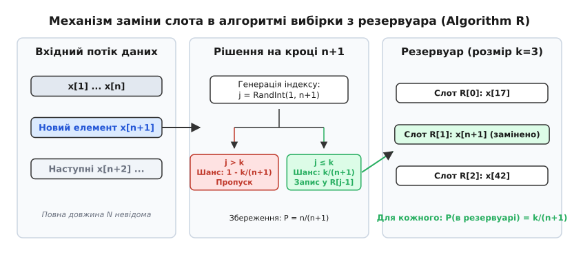
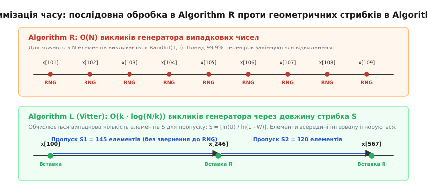
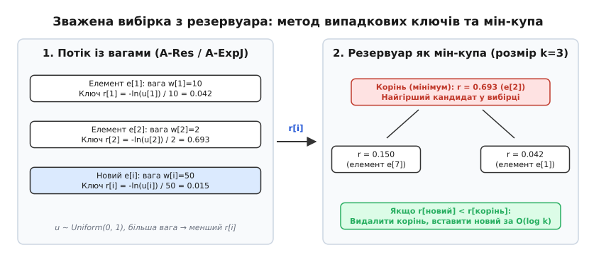

# Вибірка з резервуара

<preknowlist>
- [Масив](book:algorithms/array) — неперервне розміщення елементів однакового типу в пам'яті з доступом за індексом за `O(1)`.
- [Пріоритетна черга](book:algorithms/priority-queue) — абстрактна структура даних на базі двійкової купи для швидкого отримання екстремального елемента.
- [Асимптотична складність](book:algorithms/asymptotic-complexity) — формальний аналіз часових та просторових витрат алгоритмів.
- [Гармонічні числа](book:algorithms/harmonic-numbers) — суми обернених натуральних чисел та їхній логарифмічний асимптотичний розклад.
</preknowlist>

Уявімо мережевий процесор магістрального комутатора в центрі обробки даних, через який проходить транзитний потік мережевих пакетів на швидкості 100 Гбіт/с. За одну секунду через комутатор пролітає понад 14 мільйонів пакетів, а добовий обсяг трафіку налічує сотні мільярдів одиниць. Інженерам з кібербезпеки необхідно безперервно підтримувати репрезентативну випадкову вибірку рівно з 10 000 пакетів для детального статистичного аудиту протокольних заголовків, виявлення нових типів атак та оцінки завантаження каналів зв'язку.

Ця інженерна задача стикається з трьома нездоланними фізичними обмеженнями:

1. **Невідома тривалість і обсяг потоку**: Сесія моніторингу може тривати хвилину, годину, добу або бути перерваною аварійним вимкненням живлення. Загальна кількість вхідних записів `N` наперед невідома в жоден момент часу.
2. **Неможливість повторного читання (Single-pass stream)**: Мережеві пакети, транзакційні події у брокерах повідомлень (Apache Kafka) чи аудіовізуальні стріми надходять послідовно через сокети та безповоротно зникають із системних черг після обробки. Повернутися назад і прочитати потік удруге неможливо.
3. **Жорсткі обмеження оперативної пам'яті**: Пам'ять спеціалізованого мережевого процесора або вбудованого модуля eBPF обмежена кількома мегабайтами швидкої статичної пам'яті SRAM. Зберегти всі сотні гігабайтів сирих даних в оперативній пам'яті для подальшого виконання випадкового сортування фізично неможливо.

Спроба застосувати наївний фільтр Бернуллі — наприклад, зберігати кожен вхідний пакет із фіксованою апріорною ймовірністю `p = 0.0001` — закінчується катастрофою. Оскільки фактична кількість відібраних елементів є випадковою величиною з біноміальним розподілом із математичним сподіванням `p · N` та дисперсією `p · (1 - p) · N`, результат повністю залежить від тривалості потоку. Якщо потік виявиться коротшим за прогноз, вибірка міститиме лише десяток елементів, що унеможливить будь-яку достовірну статистику; якщо ж потік затягнеться, виділений масив переповниться за лічені секунди, спричинивши аварійне скидання або переривання сесії.

Потрібна алгоритмічна конструкція, яка підтримує вибірку строго фіксованого розміру `k` елементів за один-єдиний послідовний прохід по вхідному потоку довільної довжини `N` із використанням пам'яті `O(k)`, гарантуючи, що в будь-яку мить зупинки кожен із уже оброблених елементів перебуває у вибірці з абсолютно однаковою та незміщеною ймовірністю `k / N`.

Цю фундаментальну задачу розв'язує сімейство алгоритмів **вибірки з резервуара** (Reservoir Sampling, від латинського *reservare* — зберігати, утримувати про запас).

## Механізм рівномірного заміщення слотів: Алгоритм R

Щоб зрозуміти внутрішню логіку роботи методу, розглянемо базовий випадок: формування випадкової вибірки рівно з одного елемента (`k = 1`) із нескінченної послідовності `x_1, x_2, x_3, ...`.

* Коли надходить перший елемент `x_1`, ми беззастережно записуємо його в наш єдиний слот пам'яті (резервуар). Його ймовірність перебувати в резервуарі на першому кроці становить `1/1 = 1`.
* Коли надходить другий елемент `x_2`, загальна довжина потоку стає рівною 2. Щоб забезпечити рівні шанси для обох кандидатів, ми замінюємо поточний вміст слота на `x_2` з імовірністю `1/2`. У разі успіху в резервуарі опиняється `x_2` (з шансом `1/2`), а в разі невдачі там залишається `x_1` (із шансом `1 - 1/2 = 1/2`). Обидва елементи мають строго рівні шанси.
* Коли надходить третій елемент `x_3`, ми генеруємо випадковий вибір і приймаємо `x_3` до слота з імовірністю `1/3`, а з імовірністю `2/3` залишаємо попередній стан слота незмінним.

Простежимо ймовірність збереження перших двох елементів після третього кроку:
* Елемент `x_3` опиняється в слоті з імовірністю `1/3` за прямим правилом.
* Елемент `x_1` опиниться в слоті після третього кроку лише тоді, коли виконуються дві незалежні умови: він перебував у слоті після другого кроку (ймовірність `1/2`) І не був витіснений третім елементом (ймовірність `1 - 1/3 = 2/3`). За правилом множення умовних ймовірностей його підсумковий шанс становить:
  ```text
  P(x_1 в резервуарі) = (1 / 2) · (2 / 3) = 1 / 3
  ```
* Точно так само для елемента `x_2`: його шанс залишитися становить `(1 / 2) · (2 / 3) = 1 / 3`.

Поширюючи цей крок на довільний номер елемента `n`, ми отримуємо універсальне динамічне правило: новий елемент `x_n` повинен заміщувати резервуар з імовірністю `1/n`. Тоді будь-який елемент, що вже перебував у слоті, залишається з імовірністю `(1 / (n - 1)) · (1 - 1/n) = (1 / (n - 1)) · ((n - 1) / n) = 1/n`. Усі елементи на кожному кроці зберігають строго симетричні шанси.

Узагальнення цієї ймовірнісної схеми на довільний розмір вибірки `k > 1` сформулював Алан Вотерман у 1962 році, а Дональд Кнут у 1969 році канонізував цей метод під назвою **Algorithm R**:

1. **Фаза ініціалізації**: Перші `k` елементів вхідного потоку `x_1, x_2, ..., x_k` беззастережно записуються у виділений масив резервуара, повністю заповнюючи його слоти від `0` до `k - 1`.
2. **Фаза потокового оновлення**: Для кожного наступного елемента `x_n` із порядковим номером `n > k` генерується випадкове ціле число `j` із рівномірного дискретного розподілу на інтервалі `[1, n]`.
3. **Прийняття рішення**:
   * Якщо `j ≤ k`, елемент `x_n` вважається обраним і записується у комірку резервуара з індексом `j - 1`, безповоротно витісняючи старий елемент, що зберігався там раніше.
   * Якщо `j > k`, елемент `x_n` ігнорується, а стан резервуара залишається абсолютно незмінним.


*Потоковий конвеєр: елементи надходять послідовно, кожен новий запис із порядковим номером `n` претендує на потрапляння в резервуар з імовірністю `k/n`, заміщуючи випадковий слот.*

Історія виникнення цієї ідеї у контексті обробки магнітних стрічок та еволюція потокових алгоритмів детально розібрана в історичному нарисі: [Еволюція вибірки з резервуара: від магнітних стрічок до розподілених потоків](book:algorithms/reservoir-sampling/hist-reservoir-sampling.md).

### Покрокове трасування роботи алгоритму

Щоб у деталях побачити процес заміщення в динаміці, простежимо роботу Algorithm R для резервуара розміром `k = 3` на вхідному потоці з восьми символьних елементів `[A, B, C, D, E, F, G, H]`:

```text
Крок n │ Елемент │ Згенероване j │ Умова j ≤ 3? │ Дія над резервуаром          │ Стан резервуара R_n │ Шанс кожного
───────┼─────────┼───────────────┼──────────────┼──────────────────────────────┼─────────────────────┼──────────────
   1   │    A    │       —       │     Так      │ Прямий запис у слот R[0]     │ [A,  ?,  ?]         │     1/1
   2   │    B    │       —       │     Так      │ Прямий запис у слот R[1]     │ [A,  B,  ?]         │     2/2
   3   │    C    │       —       │     Так      │ Прямий запис у слот R[2]     │ [A,  B,  C]         │     3/3
   4   │    D    │     j = 2     │     Так      │ Заміна слота R[1] (B → D)    │ [A,  D,  C]         │     3/4
   5   │    E    │     j = 5     │      Ні      │ Елемент E відкинуто          │ [A,  D,  C]         │     3/5
   6   │    F    │     j = 1     │     Так      │ Заміна слота R[0] (A → F)    │ [F,  D,  C]         │     3/6
   7   │    G    │     j = 4     │      Ні      │ Елемент G відкинуто          │ [F,  D,  C]         │     3/7
   8   │    H    │     j = 3     │     Так      │ Заміна слота R[2] (C → H)    │ [F,  D,  H]         │     3/8
```

На кожному кроці `n` маргінальна ймовірність присутності будь-якого з оброблених елементів у поточному стані резервуара строго дорівнює `k / n = 3 / n`.

Математична строгість цього інваріанта базується на тому, що шанс витіснення конкретного збереженого елемента дорівнює добутку ймовірності прийняття нового кандидата `k / n` на ймовірність вибору саме його слота серед `k` можливих `1 / k`. У результаті ймовірність вибуття дорівнює `(k / n) · (1 / k) = 1 / n`, а ймовірність уціліти становить `1 - 1/n = (n - 1) / n`. Множачи це на індуктивну ймовірність присутності на попередньому кроці `k / (n - 1)`, отримуємо точне значення `(k / (n - 1)) · ((n - 1) / n) = k / n`.

Повне покрокове виведення методом повної математичної індукції, аналіз спільного розподілу ймовірностей (Joint Distribution) та доведення рівноймовірності кожної з `C(n, k)` можливих підмножин наведено у математичному додатку: [Математичний апарат вибірки з резервуара: індукція, стрибки та ваги](book:algorithms/reservoir-sampling/math-reservoir-proof.md).

## Обчислювальний бар'єр Algorithm R та аналіз кількості замін

Попри бездоганну теоретичну простоту, класичний Algorithm R містить приховане вузьке місце, яке призводить до різкої деградації продуктивності при масштабуванні на великі потоки даних.

Нехай ми аналізуємо системний журнал вебсервера з `N = 100 000 000` записів із розміром резервуара `k = 1000`. На кожній ітерації циклу програма генерує псевдовипадкове число `j` та виконує порівняння. Отже, генератор псевдовипадкових чисел (PRNG) викликається рівно 100 мільйонів разів.

Проте скільки елементів насправді потрапляють у резервуар і спричиняють реальну модифікацію пам'яті? Позначимо подію заміни на кроці `m` індикаторною випадковою величиною `I_m ∈ {0, 1}`. Ймовірність заміни на кроці `m` дорівнює `k / m`. За лінійністю математичного сподівання загальна очікувана кількість замін після обробки `N` елементів становить:

```text
E[T_N]
= k + ∑_{m=k+1}^N (k / m)
= k · (1 + H_N - H_k)
≈ k · (1 + ln(N / k))
```

де `H_N` — `N`-те гармонічне число, яке асимптотично наближається до натурального логарифма `ln(N)`.

Підставимо наші числові параметри:

```text
E[T_N] ≈ 1000 · (1 + ln(100 000 000 / 1000)) = 1000 · (1 + ln(100 000)) ≈ 1000 · (1 + 11.51) ≈ 12 513
```

Серед 100 мільйонів оброблених записів лише близько 12 513 елементів реально змінюють стан пам'яті резервуара. Решта 99 987 487 ітерацій (99.987% усього часу виконання) витрачають такти процесора на генерацію випадкових чисел та операції цілочисельного ділення лише для того, щоб негайно відкинути елемент.

Крім того, кожна операція взяття остачі `rand() % n` спирається на апаратну інструкцію ділення `div`, яка на процесорах архітектури x86-64 виконується за 15–25 тактів і не піддається векторній оптимізації SIMD. У конвеєрах обробки гігабітних потоків генерація випадкових чисел стає головним обчислювальним гальмом, що штучно обмежує пропускну здатність системи.

## Оптимізація часу: геометричні стрибки та Algorithm L (Джеффрі Віттер)

У 1985 році професор комп'ютерних наук Браунського університету Джеффрі Віттер опублікував фундаментальну працю, у якій запропонував змінити саму філософію потокової вибірки: замість того щоб на кожному кроці перевіряти, чи потрібно зберегти поточний елемент, обчислювати наперед **довжину інтервалу пропуску** `S` — кількість записів, які гарантовано не потраплять у резервуар до настання наступної реальної заміни.

Випадкова величина `S` моделює кількість послідовних невдач до настання чергового успіху. Функція виживання цієї величини дорівнює добутку ймовірностей відхилення:

```text
P(S > s) = ∏_{j=1}^{s+1} (1 - k / (n + j))
```

У неперервному наближенні Віттер довів, що цей розподіл поводиться як геометричний закон із динамічною випадковою вагою `W = exp(ln(U) / k)`, де `U` — рівномірна випадкова величина на інтервалі `(0, 1)`.

Застосовуючи метод зворотного перетворення розподілу (Inverse Transform Sampling), Віттер розробив сімейство алгоритмів (Algorithm X, Y, Z та L). Найбільш практичним і швидким став **Algorithm L**:

1. На етапі ініціалізації масив резервуара заповнюється першими `k` елементами, після чого генерується початковий випадковий ваговий коефіцієнт:
   ```text
   W = exp(ln(U) / k),  де U ~ Uniform(0, 1)
   ```
2. Довжина наступного стрибка пропуску розраховується за аналітичною формулою в один крок:
   ```text
   S = ⌊ln(U') / ln(1 - W)⌋,  де U' ~ Uniform(0, 1)
   ```
3. Семплер миттєво пропускає `S` вхідних елементів потоку, не виконуючи жодних обчислень PRNG (простий декремент лічильника або швидкісний зсув покажчика масиву).
4. Елемент із порядковим номером `n + S + 1` записується у випадково обраний слот резервуара `R[RandInt(0, k-1)]`.
5. Ваговий параметр оновлюється за мультиплікативним правилом `W ← W · exp(ln(U'') / k)`, після чого розраховується новий інтервал стрибка `S`.


*Оптимізація часу: послідовні звернення до генератора випадкових чисел в Algorithm R проти аналітичного пропуску інтервалів бездіяльності в Algorithm L.*

Завдяки геометричним стрибкам загальна кількість викликів генератора випадкових чисел падає з `O(N)` до строго асимптотичного значення `O(k · (1 + log(N/k)))`. Для нашого прикладу зі 100 мільйонами елементів це скорочує кількість звернень до PRNG з 100 000 000 до приблизно 25 000 операцій — скорочення навантаження у понад 4000 разів без найменшого спотворення рівномірності вибірки.

## Зважена вибірка: нерівні ймовірності та Algorithm A-Res

У багатьох практичних задачах елементи потоку мають принципово різну фізичну, метричну або фінансову вагу:
* У моніторингу мережевого навантаження пакети розміром 1500 байтів формують основний трафік каналу, тоді як службові пакети розміром 64 байти несуть мінімальне навантаження.
* В оптимізаторах СУБД важкі аналітичні SQL-запити з часом виконання понад 10 секунд вимагають частішого потрапляння у діагностичну вибірку, ніж швидкі точкові запити.
* У телеметрії розподілених додатків спалахи помилок із кодами `5xx` мають значно вищий пріоритет для аналізу, ніж успішні відповіді `200 OK`.

Якщо кожен елемент `x_i` має індивідуальну додатну вагу `w_i > 0`, наївна спроба замінити ймовірність включення в Algorithm R на `w_n / ∑_{i=1}^n w_i` зазнає невдачі: ймовірність витіснення елемента, який уже перебуває в буфері, залежить від ваг усіх ще не бачених елементів, які надійдуть у майбутньому.

Фундаментальне розв'язання задачі **зваженої вибірки з резервуара без повернення** (Weighted Random Sampling without replacement, WRS) у 2006 році запропонували Павлос Ефраімідіс та Пол Спіракіс, створивши алгоритм **A-Res**.

### Метод випадкових експоненційних ключів

Замість відстеження змінних кумулятивних сум ваг алгоритм A-Res призначає кожному вхідному елементу випадковий ключ.

Для кожного елемента `x_i` з відомою вагою `w_i` генерується рівномірне випадкове число `u_i ∈ (0, 1)`, після чого обчислюється степеневий ключ:

```text
k_i = u_i^(1 / w_i)
```

Або в еквівалентній логарифмічній шкалі, яка забезпечує чисельну стійкість обчислень із плаваючою комою:

```text
r_i = -ln(u_i) / w_i
```

Величина `-ln(u_i)` має стандартний експоненційний розподіл `Exp(1)`, а величина `r_i` підпорядковується експоненційному розподілу `Exp(w_i)` з параметром інтенсивності, рівним вазі елемента. З фундаментальних властивостей математичної статистики відомо: **мінімум із множини незалежних експоненційних випадкових величин реалізується з імовірністю, строго пропорційною їхнім вагам `w_i`**:

```text
P(r_i = min(r_1, ..., r_m)) = w_i / (∑_{j=1}^m w_j)
```

Завдяки властивості відсутності післядії експоненційного закону, послідовний вибір `k` найменших ключів `r_i` (або `k` найбільших ключів `k_i`) строго еквівалентний послідовному зваженому вибору без повернення в один прохід потоку.

### Мін-купа як динамічний сепаратор вибірки

Для швидкої підтримки вибірки з `k` найкращих елементів резервуар організовують як двійкову купу (Priority Queue):
1. Перші `k` елементів записуються в купу з розрахунком їхніх ключів `r_i`.
2. Корінь купи містить елемент із найбільшим значенням ключа `r_max` серед поточних `k` збережених кандидатів (найгірший кандидат у вибірці).
3. Для кожного наступного елемента розраховується його ключ `r_new`.
4. Якщо `r_new ≥ r_max`, новий елемент миттєво відкидається за час `O(1)`.
5. Якщо `r_new < r_max`, корінь купи заміщується новим елементом, після чого викликається операція відновлення інваріанта купи `sift_down` за час `O(log k)`.


*Зважена вибірка з резервуара: експоненційні випадкові ключі та використання двійкової купи для динамічного відсікання елементів із малими вагами.*

Для конвеєрів із сотнями мільйонів зважених подій Ефраімідіс і Спіракіс розробили стрибкову версію **A-ExpJ** (A-Res with Exponential Jumps). Вона відстежує випадкову квоту сумарної ваги елементів, які гарантовано не зможуть перевершити поточний корінь купи, дозволяючи пропускати мільйони дрібних подій без генерації випадкових ключів.

Детальні інженерні реалізації алгоритмів R, L, A-Res та A-ExpJ мовами C і C++, бенчмарки пропускної здатності та аналіз продуктивності мікропроцесорного кешу наведено у практичному посібнику: [Практична реалізація потокових семплерів: Algorithm R, Algorithm L, A-Res та розподілене злиття](book:algorithms/reservoir-sampling/proj-reservoir-stream.md).

## Розподілена вибірка та злиття резервуарів (Reservoir Merging)

У сучасних розподілених архітектурах обробки великих даних (Apache Spark, Apache Flink, ClickHouse, Google BigQuery) терабайтні масиви інформації фрагментовані по сотнях робочих вузлів кластера. Передавати весь потік сирих даних на єдиний центральний сервер технічно неможливо через вичерпання пропускної здатності мережевої інфраструктури.

Рішення полягає у використанні двохетапного розподіленого шаблону (MapReduce / Tree Reduce):
1. **Локальна фаза (Map)**: Кожен робочий вузол кластера незалежно запускає локальний семплер розміру `k` для свого фрагмента потоку довжиною `N_m`.
2. **Фаза агрегації (Reduce)**: Вузли відправляють лише свої компактні локальні резервуари на вузол-координатор, який виконує операцію зваженого злиття (Weighted Reservoir Merge).

Якщо перший вузол обробив `N_1` елементів, а другий — `N_2`, то кожен елемент із першого резервуара репрезентує частку `N_1 / k` загального масиву, а елемент із другого — `N_2 / k`.

Координатор призначає елементам першого резервуара вагу `w = N_1 / k`, елементам другого — `w = N_2 / k`, і запускає зважений алгоритм A-Res для вибору фінальних `k` записів.

Математично доведено, що результуюча ймовірність потрапляння будь-якого первинного елемента до фінального резервуара дорівнює:

```text
P(елемент у вибірці) = (k / N_m) · ( (N_m / k) / N ) · k = k / N
```

де `N = ∑ N_m` — сумарна кількість елементів на всіх вузлах. Двоетапне злиття зберігає ідеальну незміщеність вибірки, скорочуючи обсяг переданих мережею даних на багато порядків.

У дворівневих або багаторівневих ієрархічних мережах (наприклад, деревоподібна агрегація в центрах обробки даних між стійковими комутаторами Top-of-Rack) злиття резервуарів виконується рекурсивно на кожному вузлі агрегації, гарантуючи збереження незміщеного ймовірнісного розподілу незалежно від топології кластера.

Крім того, у системах із підтримкою контрольних точок стану (Stateful Stream Processing, як-от чекпоїнти у RocksDB для Apache Flink) стан резервуара є детермінованою структурою фіксованого розміру. Під час відновлення після збоїв кластера потоковий стан резервуара миттєво повертається з останнього снепшоту без необхідності повторного сканування терабайтних журналів подій.

## Оцінювання характеристик потоку за вибіркою (Оцінювач Горвіца — Томпсона)

Сформований резервуар є не просто набором випадкових записів, а потужним інструментом для оцінки сумарних і середніх показників усього гігантського потоку без повного збереження даних.

Нехай нам потрібно оцінити суму деякої функції `f(x)` по всьому невідомому потоку:

```text
Y = ∑_{i=1}^N f(x_i)
```

Оскільки кожен елемент потрапляє до вибірки з відомою граничною ймовірністю включення `π_i = k / N`, застосовується класичний статистичний **оцінювач Горвіца — Томпсона** (Horvitz — Thompson estimator):

```text
Ŷ = ∑_{x_i ∈ R} (f(x_i) / π_i) = (N / k) · ∑_{x_i ∈ R} f(x_i)
```

Математичне сподівання цього оцінювача строго дорівнює дійсному значенню суми `E[Ŷ] = Y`, тобто оцінка є абсолютно незміщеною.

Для вибіркового середнього `μ = (1/N) · ∑_{i=1}^N f(x_i)` оцінювач спрощується до середнього арифметичного елементів резервуара:

```text
μ̂ = (1 / k) · ∑_{x_i ∈ R} f(x_i)
```

### Теоретичний розрахунок необхідного обсягу вибірки

За допомогою нерівності Чебишова та центральної граничної теореми можна розрахувати мінімально необхідний розмір резервуара `k` для гарантування заданої відносної похибки оцінки `ε` із довірчою ймовірністю `1 - δ`:

```text
k ≥ (z_{1 - δ/2} · σ / (ε · μ))²
```

де `z_{1 - δ/2}` — квантиль стандартного нормального розподілу, а `σ / μ` — коефіцієнт варіації досліджуваної величини в потоці.

Нижче наведено розрахункові вимоги до розміру резервуара `k` для типових інженерних сценаріїв (при помірній варіації даних `σ / μ ≈ 1`):

```text
Бажана похибка ε │ Рівень довіри 1 - δ │ Квантиль z │ Необхідний розмір резервуара k
─────────────────┼─────────────────────┼────────────┼───────────────────────────────
      10.0%      │         90%         │    1.645   │              271
       5.0%      │         95%         │    1.960   │            1 537
       2.0%      │         95%         │    1.960   │            9 604
       1.0%      │         99%         │    2.576   │           66 358
       0.1%      │         99%         │    2.576   │        6 635 776
```

Важливий інженерний закон: **необхідний розмір резервуара `k` визначається виключно бажаною точністю `ε` та рівнем надійності `δ`, і зовсім не залежить від загальної довжини потоку `N`**. Для оцінки середнього чека в потоці з 10 мільярдів банківських транзакцій із похибкою 1% потрібен точно такий самий розмір вибірки, як і для потоку з 10 тисяч операцій.

> 🔧 **Навіщо це.**
> У реляційній СУБД PostgreSQL під час виконання команди `ANALYZE` планувальник запитів не читає багатогігабайтну таблицю повністю. Замість цього він використовує резервуарну вибірку фіксованого розміру (параметр `default_statistics_target`, за замовчуванням 100–300 слотів на стовпчик), потоково зчитуючи випадкові сторінки таблиці за один прохід. На базі отриманого резервуара СУБД будує гістограми розподілу значень та розраховує селективність предикатів `WHERE`, витрачаючи частки секунди замість годин повного сканування диску.

## Застосування у навчанні моделей машинного навчання

У системах потокового машинного навчання (Online Machine Learning та Reinforcement Learning) моделі навчаються на безперервному потоці нових прикладів. Пряме навчання лише на останніх даних призводить до явища «катастрофічного забування» (Catastrophic Forgetting), коли нейромережа втрачає здатність класифікувати старі патерни.

Для збереження стабільності моделі застосовують буфер відтворення досвіду (Experience Replay Buffer), організований як вибірка з резервуара. Резервуар ємністю `k = 50 000` зразків гарантує, що навчальний міні-батч (Mini-batch) містить як свіжі події, так і випадкові історичні приклади у точній пропорції їхнього надходження. Це забезпечує стаціонарність розподілу ознак та запобігає деградації градієнтного спуску.

## Вибірка у ковзних вікнах та часове затухання ваг

Класичні алгоритми вибірки з резервуара трактують усі елементи від початку історії потоку як рівноцінні. Проте в задачах оперативного моніторингу застарілі дані втрачають актуальність: інженерам потрібна випадкова вибірка з «останніх 10 хвилин» або «останніх `W` подій» (Sliding Window Reservoir Sampling).

Якщо просто видаляти найстаріші елементи з масиву в міру їхнього старіння, ймовірнісний інваріант руйнується, оскільки елементи, що вибули раніше, більше не можуть повернутися у вибірку, а шанс присутності залишкових елементів стає зміщеним.

Для розв'язання цієї проблеми застосовують дві альтернативні стратегії:

1. **Пріоритетна черга за часовими мітками (Time-based Priority Sampling)**: Кожен елемент зберігається разом із міткою часу `t_i`. Замість єдиного резервуара підтримується багаторівнева структура блоків експоненційного розміру (Exponential Histograms).
2. **Алгоритм з експоненційним затуханням ваг (Decaying Reservoir Sampling)**: Кожному елементу призначається ефективна вага, яка експоненційно згасає в часі за законом:
   ```text
   w_i(t) = exp(-λ · (t_now - t_i))
   ```
   де `λ > 0` — коефіцієнт швидкості затухання.

Завдяки властивостям логарифмічних ключів алгоритму A-Res ключ елемента з урахуванням часу набуває вигляду:
```text
r_i = -ln(u_i) / exp(λ · t_i)
```
Оскільки поточний час `t_now` скорочується як спільний множник для всіх елементів, алгоритм не вимагає перерахунку ключів старих елементів у купі. Завдяки цьому зважений семплер A-Res автоматично адаптується до часового затухання з нульовими додатковими витратами процесорного часу.

## Апаратна оптимізація та організація пам'яті

Для досягнення максимальної пропускної здатності в промислових системах архітектура семплера повинна враховувати особливості роботи кеш-пам'яті сучасних багатоядерних процесорів:

1. **Вирівнювання кеш-ліній (Cache Line Alignment)**: Масив резервуара вирівнюється за 64-байтною межею (`alignas(64)` у C++ або `posix_memalign` у C). Це усуває розщеплені звернення до пам'яті (Split Accesses), коли одне 64-бітне число перетинає межу двох фізичних кеш-ліній.
2. **Усунення помилкового розділення пам'яті (False Sharing)**: У багатопотокових системах із NUMA-архітектурою кожен робочий потік повинен працювати з повністю ізольованим екземпляром семплера, розташованим у локальному вузлі пам'яті. Якщо лічильники двох різних потоків потраплять в одну 64-байтну лінію кешу, протокол когерентності MESI постійно блокуватиме кеші ядер, сповільнюючи виконання у 20–50 разів.
3. **Передбачення переходів у конвеєрі CPU (Branch Prediction)**: В алгоритмі L внутрішній цикл є тривіальним декрементом лічильника без розгалужень у тілі циклу. Це дозволяє блоку передбачення переходів CPU досягати точності понад 99.99%, забезпечуючи повне завантаження інструкційних конвеєрів та суперскалярне виконання до 4–5 інструкцій за такт.
4. **Використання eBPF в ядрі Linux (In-kernel XDP Sampling)**: Для захоплення мережевих пакетів на швидкості 100G резервуарний семплер вбудовується безпосередньо у драйвер мережевої карти за допомогою XDP (eXpress Data Path). Семплер використовує структуру мапи `BPF_MAP_TYPE_PERCPU_ARRAY`, що виключає атомарні блокування між ядрами процесора і дозволяє відбирати пакети до потрапляння в мережевий стек ядра Linux.

## Порівняльний аналіз сімейства алгоритмів

Вибір конкретного алгоритму вибірки з резервуара визначається компромісом між обчислювальною складністю, витратами пам'яті та характером вхідних даних:

| Алгоритм | Складність за часом (CPU) | Додаткова пам'ять | Викликів PRNG на потік | Підтримка нерівних ваг | Сфера застосування |
| :--- | :--- | :--- | :--- | :--- | :--- |
| **Algorithm R** (Knuth) | `O(N)` | `O(k)` (масив) | `N` викликів | Ні (лише рівномірна) | Невеликі потоки, де простота коду важливіша за такти ALU |
| **Algorithm L** (Vitter) | `O(k · log(N/k))` | `O(k)` (масив) | `O(k · log(N/k))` | Ні (лише рівномірна) | Високошвидкісні однорідні потоки (мережеві сокети, системні логи) |
| **Algorithm A-Res** | `O(N · log k)` | `O(k)` (двійкова купа) | `N` викликів | Так (довільні `w_i > 0`) | Зважена потокова аналітика з помірною швидкістю надходження |
| **Algorithm A-ExpJ** | `O(k · log(N/k) · log k)` | `O(k)` (двійкова купа) | `O(k · log(N/k))` | Так (довільні `w_i > 0`) | Високонавантажені зважені конвеєри (пакети 100G, білінгові транзакції) |
| **Reservoir Merge** | `O(M · k · log k)` | `O(k)` на вузол | `O(M · k)` | Так (рівномірні й зважені) | Розподілені кластери (MapReduce, Apache Spark, ClickHouse) |

## Інженерні пастки та межі застосування

Під час практичної реалізації та експлуатації потокових семплерів слід остерігатися кількох поширених помилок:

1. **Переповнення 32-бітного лічильника потоку**: Якщо потік перевищує 4.29 мільярда елементів (`2³² - 1`), лічильник `uint32_t` переповнюється і повертається до нуля. Це миттєво руйнує ймовірності заміни або призводить до винятку ділення на нуль (`SIGFPE`). Лічильник потоку `n` **завжди** повинен бути 64-бітним беззнаковим цілим числом (`uint64_t`).
2. **Втрата точності у просторі дійсних чисел**: Пряме обчислення ключа `u_i^(1 / w_i)` для великих ваг `w_i > 1000` призводить до того, що показник степеня прямує до нуля, а значення ключа потрапляє у машинну нерозрізненість `1.0 - ε`. Використання логарифмічного перетворення `r_i = -ln(u_i) / w_i` є обов'язковим для збереження 53 біт мантиси стандарту IEEE 754.
3. **Гонка даних у багатопотоковому середовищі**: Якщо кілька робочих потоків записують елементи в один екземпляр семплера без синхронізації, стан генератора випадкових чисел та масив резервуара зазнають руйнування. Блокування семплера м'ютексом знижує швидкість у десятки разів через постійне очікування блокувань. Єдине правильне рішення — виділення локального резервуара на кожен робочий потік із подальшим злиттям через Reservoir Merging.
4. **Короткий потік (`N < k`)**: Якщо вхідне джерело несподівано вичерпалося або містило менше елементів, ніж цільова місткість `k`, метод отримання вибірки повинен коректно повертати `N` фактично накопичених записів. Звернення до неініціалізованої пам'яті від `N` до `k - 1` спричиняє витік невизначених даних і сегментаційні помилки.

## Підсумок

Вибірка з резервуара перетворює проблему обробки нескінченних інформаційних потоків із нерозв'язної задачі накопичення пам'яті на компактний детермінований процес із фіксованим обсягом ресурсів `O(k)`.

Від класичного поелементного алгоритму R через оптимізовані геометричні стрибки алгоритму L до зважених ключів A-Res та розподіленого злиття — ця родина алгоритмів поєднує витончену ймовірнісну теорію з максимальною продуктивністю низькорівневого апаратного забезпечення.
