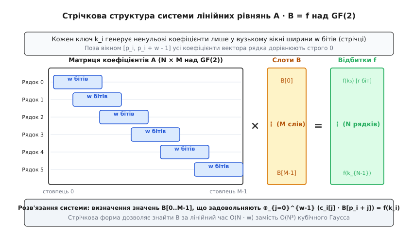
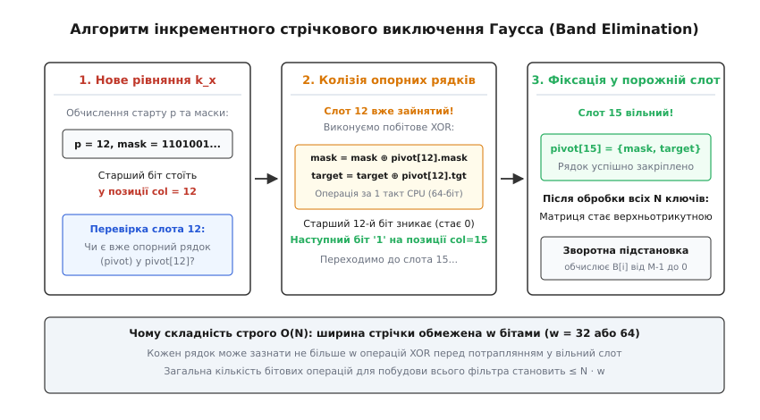
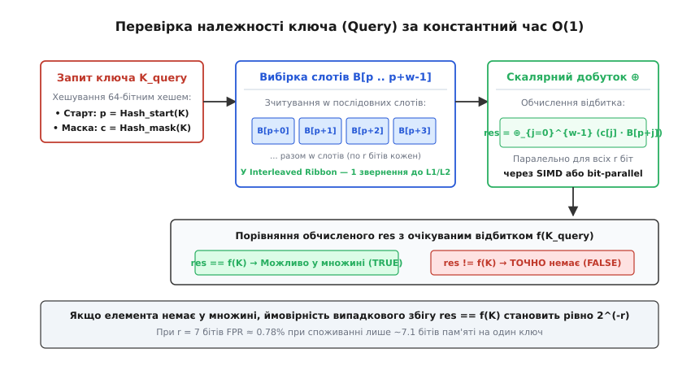
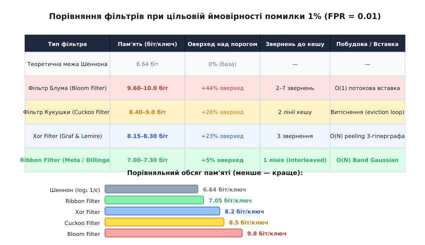

# Стрічковий фільтр (Ribbon Filter)

<preknowlist>
- [Хеш-таблиця](topic:algorithms/hash-table) — організація асоціативних масивів та розділення колізій.
- [Фільтр Блума](topic:algorithms/bloom-filter) — ймовірнісна структура перевірки належності на основі бітового масиву.
- [Фільтр Кукушки](topic:algorithms/cuckoo-filter) — відбиткові фільтри на основі хешування зозулею.
- [LSM-дерево](topic:algorithms/lsm-tree) — незмінні SSTable-файли, дискова ампліфікація читання та блокові фільтри.
- [Скінченні поля (поля Галуа)](topic:algorithms/finite-field-arithmetic) — арифметика поля GF(2), операції XOR та множення.
- [Операція Popcount](topic:algorithms/popcount-rank) — апаратний підрахунок одиничних бітів у машинному слові.
- [Біти й порядок байтів](topic:programming/bits-bytes-endianness) — побітові маски, зсуви та представлення слів у пам'яті.
- [SIMD і векторизація](topic:programming/simd-vectorization) — паралельна обробка векторних регістрів процесора.
</preknowlist>

У високонавантажених сховищах даних на основі структури LSM-дерева (таких як RocksDB, ClickHouse чи Apache Cassandra) операції точкового читання змушені послідовно перевіряти десятки незмінних файлів таблиць (SSTables) на твердотільному накопичувачі. Кожне випадкове звернення до NVMe SSD займає від 10 до 50 мікросекунд, а до класичного магнітного диска — від 5 до 10 мілісекунд. Якщо запитуваного ключа немає у файлі, це зчитування перетворюється на марно витрачений ресурс вводу-виводу (Read Amplification).

Щоб відсікати відсутні ключі до звернення до диска, кожен SSTable-файл супроводжується компактним імовірнісним фільтром належності. Класичний фільтр Блума вимагає близько 9.6–10.0 бітів на кожен ключ для забезпечення 1% ймовірності хибнопозитивного спрацьовування (False Positive Rate, FPR). У базі даних на 10 мільярдів ключів такий фільтр займає близько 11.6–12.0 гігабайтів оперативної пам'яті. Оскільки фільтри гарячих рівнів повинні постійно перебувати в RAM, значна частка пам'яті сервера витрачається не на кешування реальних даних, а на службові бітові масиви.

Стрічковий фільтр (Ribbon Filter), розроблений інженерами компанії Meta для ядра RocksDB, долає цю надлишковість. Перетворюючи задачу перевірки належності на систему лінійних алгебраїчних рівнянь над скінченним полем `GF(2)` із вузькою стрічковою матрицею коефіцієнтів, він знижує витрати пам'яті до 7.1–7.3 біта на ключ при тому самому 1% помилок. Це дає змогу заощадити від 25% до 30% оперативної пам'яті та дискового простору при збереженні константного часу запиту `O(1)` та строго лінійної швидкості побудови `O(N)`.

## Теоретична межа Шеннона та «податок Блума»

Компактні структури перевірки належності є ймовірнісними: вони гарантують нульову ймовірність хибнонегативних відповідей (якщо елемент був доданий, фільтр ніколи не скаже «ні»), але допускають контрольовану частку хибнопозитивних спрацьовувань `ε` (для відсутнього елемента фільтр може з імовірністю `ε` помилково відповісти «так»).

З погляду теорії інформації Клода Шеннона, мінімальна кількість бітів, необхідна для збереження множини з `N` елементів із допустимим рівнем помилок `ε`, визначається ентропією простору відповідей:

```
S_min = N · log₂(1/ε)     [теоретична межа Шеннона]
```

Для стандартного інженерного порогу хибних спрацьовувань 1% (`ε = 0.01`):

```
log₂(1 / 0.01)
= log₂(100)
≈ 6.6438 біта на ключ     [абсолютний теоретичний мінімум]
```

Класичний фільтр Блума використовує бітовий масив розміру `m` та `k` незалежних хеш-функцій. Математичний аналіз показує, що при оптимальній кількості хеш-функцій `k = ln 2 · (m / N)` фактичні витрати пам'яті становлять:

```
m / N
= (1 / ln 2) · log₂(1/ε)
≈ 1.4427 · log₂(1/ε)     [витрати фільтра Блума: +44.27% надлишку]
```

Для 1% помилки це вимагає `1.4427 · 6.6438 ≈ 9.58` біта на ключ (на практиці, через нерівномірність та блочне розбиття, близько 10 бітів). Додаткові 44.3% пам'яті — це інформаційний «податок Блума». Він виникає через стохастичну природу незалежного встановлення бітів: випадкові колізії призводять до багаторазового перезапису тих самих комірок масиву, через що ентропійна щільність заповнення бітів падає.

Спроби наблизитися до межі Шеннона робилися неодноразово. Фільтр Кукушки (Cuckoo Filter) зменшив витрати до 8.4–9.0 бітів на ключ завдяки збереженню коротких відбитків, проте зіткнувся з нестабільністю вставок при заповненні понад 95% та довгими ланцюжками витіснень. Xor-фільтр (Xor Filter) знизив обсяг до 8.15–8.30 бітів на ключ шляхом лущення 3-гіперграфів, але вимагав фіксованого надлишку слотів `M = 1.23 · N` через наявність циклічних 2-ядер у графі. Детальний хронологічний розвиток цих підходів викладено у вставці [📜 Еволюція фільтрів належності: від бітових векторів Блума до стрічкових систем Meta](topic:algorithms/ribbon-filter/hist-ribbon-filter.md).

## Переосмислення задачі: лінійне відновлення над полем GF(2)

Стрічковий фільтр змінює саму парадигму перевірки належності. Замість встановлення незалежних бітів або переміщення відбитків за таблицями задача формулюється як побудова статичного словника відновлення (Static Retrieval) над скінченним двійковим полем Галуа `GF(2)`.

Поле `GF(2)` складається лише з двох чисел `{0, 1}`. Додавання у цьому полі еквівалентне побітовому виключному АБО (`XOR`, `⊕`), а множення — логічному І (`AND`, `·`).

Нехай задано множину `S`, що містить `N` унікальних ключів:

```
S = {x₀, x₁, x₂, ..., x_{N-1}}
```

Для кожного ключа `x_i` псевдовипадкова хеш-функція обчислює цільовий бінарний відбиток `f(x_i)` довжини `r` бітів (де `r = ⌈log₂(1/ε)⌉`). Фільтр створює масив `B`, що складається з `M` слотів (де `M ≥ N`), причому кожен слот містить `r` бітів.

Інша хеш-функція зіставляє кожному ключу `x_i` двійковий рядок коефіцієнтів `a(x_i) = (a₀, a₁, ..., a_{M-1}) ∈ GF(2)^M`.

Умова коректності фільтра вимагає, щоб для кожного ключа `x_i ∈ S` скалярний добуток вектора коефіцієнтів `a(x_i)` на масив слотів `B` у просторі `GF(2)^r` точно дорівнював його відбитку:

```
⨁_{j=0}^{M-1} (a_j(x_i) · B[j]) = f(x_i),    ∀ x_i ∈ S
```

У матричному записі це утворює систему лінійних алгебраїчних рівнянь над `GF(2)`:

```
A · B = F
```

Тут `A` — матриця розміру `N × M`, рядками якої є вектори коефіцієнтів ключів, `B` — шукана матриця слотів розміру `M × r`, а `F` — матриця цільових відбитків розміру `N × r`.

Якщо невідомий ключ `y ∉ S` перевіряється на належність, фільтр обчислює скалярний добуток `a(y) · B` і порівнює його з `f(y)`. Оскільки вектор `a(y)` та відбиток `f(y)` згенеровані незалежно від матриці `B`, результат скалярного добутку є рівномірно розподіленим випадковим вектором у просторі `GF(2)^r`. Ймовірність того, що випадковий вектор збіжиться з `f(y)`, становить рівно:

```
P(a(y) · B = f(y)) = 1 / (2^r) = 2^(-r)
```

Строге математичне доведення цієї теореми та аналіз розв'язності лінійних систем над скінченними полями наведено у вставці [🧮 Математичний апарат стрічкового фільтра та розв'язання систем над GF(2)](topic:algorithms/ribbon-filter/math-band-elimination.md).

## Стрічкове обмеження (Band Constraint)

Якщо матриця `A` є довільною випадковою матрицею над `GF(2)`, розв'язання системи `A · B = F` класичним методом виключення Гаусса вимагає `O(N³)` операцій. Для таблиці з 10 мільйонів ключів виконання `10²¹` операцій зайняло б роки процесорного часу.

Стрічковий фільтр усуває цей бар'єр за допомогою просторової локалізації коефіцієнтів. Для кожного ключа `x` пара хеш-функцій генерує:
1. **Початковий зсув (Start Index)** `p(x) ∈ [0, M - w]`.
2. **Стрічкову маску (Band Bitmask)** `c(x) ∈ {0, 1}^w` фіксованої ширини `w` бітів (де `w` зазвичай становить 32, 64 або 128 бітів).

Рядок коефіцієнтів `a(x)` формується так, що ненульові значення можуть з'являтися виключно у вікні `[p(x), p(x) + w - 1]`. Поза цим вікном усі елементи рядка тотожно дорівнюють нулю:

```
Рядок a(x): [0, ..., 0, c₀, c₁, c₂, ..., c_{w-1}, 0, ..., 0]
                       ▲                         ▲
                    p(x)                    p(x) + w - 1
```

Ширина вікна `w = 64` ідеально відповідає розрядності стандартного регістра сучасних 64-бітних процесорів (x86-64, ARM64, RISC-V), завдяки чому вся стрічка коефіцієнтів зберігається в одному числі `uint64_t`.


*Стрічкова структура системи лінійних рівнянь: кожен ключ генерує ненульовий вектор коефіцієнтів лише у вузькому вікні ширини w бітів, що дозволяє розв'язати систему за лінійний час.*

Така геометрія перетворює `A` на стрічкову матрицю (band matrix). При операціях виключення рядків ненульові біти ніколи не виходять за межі локального вікна, що запобігає розповсюдженню одиниць по всьому масиву.

## Інкрементне стрічкове виключення Гаусса (Band Gaussian Elimination)

Завдяки стрічковій структурі матриця розв'язується інкрементно за один послідовний прохід. Алгоритм не зберігає матрицю `A` повністю в пам'яті, а використовує масив опорних рядків (pivots) розміру `M`:

```
pivots[0 .. M-1] = { mask: uint64_t, target: uint8_t, occupied: bool }
```

### Прямий хід: інкрементна редукція рядків

Кожен вхідний ключ `x_i ∈ S` обробляється за таким алгоритмом:

1. **Ініціалізація**: початковий стовпець `col = p(x_i)`, маска `mask = c(x_i)`, цільовий відбиток `target = f(x_i)`.
2. **Нормалізація**: за допомогою апаратної інструкції підрахунку нульових бітів `ctz` (`tzcnt` на x86-64 або `clz` на ARM) визначається зміщення наймолодшої одиниці в масці: `offset = ctz(mask)`. Стовпець оновлюється `col += offset`, а маска зсувається вправо `mask >>= offset`.
3. **Перевірка слота `col`**:
   * **Слот вільний (`occupied == false`)**: поточний рядок фіксується як новий опорний вектор: `pivots[col] = { mask, target, true }`. Обробка ключа успішно завершена.
   * **Слот зайнятий (`occupied == true`)**: відбувається колізія провідних одиниць. Виконується побітове виключення Гаусса:
     ```
     mask = mask ⊕ pivots[col].mask
     target = target ⊕ pivots[col].target
     ```
     Оскільки обидва рядки мали одиницю в нульовому розряді, після операції `XOR` молодший біт гарантовано перетворюється на нуль (`1 ⊕ 1 = 0`). Алгоритм повертається до кроку 2 для нової маски.
4. **Перевірка сумісності**: якщо після кількох операцій `XOR` маска повністю обнулилася (`mask == 0`):
   * Якщо `target == 0` — рівняння виявилося лінійно залежним і сумісним (тотожність `0 = 0`), воно просто ігнорується.
   * Якщо `target ≠ 0` — виникла лінійна суперечність (`0 = target`), система не має розв'язку. Алгоритм змінює генераторний `seed` і перезапускає побудову.


*Інкрементне стрічкове виключення Гаусса: колізії опорних рядків розв'язуються за одну побітову операцію XOR над 64-бітними регістрами.*

Оскільки початкова ширина маски становить `w = 64` біти, кожен рядок може зазнати щонайбільше 64 операцій редукції перед тим, як або знайде вільний слот, або обнулиться. Сумарна кількість операцій для всіх `N` ключів не перевищує `N · w`, що забезпечує строго лінійний час побудови `O(N)`.

### Зворотний хід: зворотна підстановка (Back-Substitution)

Після обробки всіх `N` ключів масив `pivots` утворює верхньотрикутну стрічкову систему. Значення результуючого масиву фільтра `B[0 .. M-1]` обчислюються у зворотному порядку від індексу `M - 1` вниз до `0`:

1. Якщо слот `pivots[i]` порожній (вільна змінна), йому присвоюється значення `B[i] = 0`.
2. Якщо слот `pivots[i]` зайнятий опорним рядком:
   ```
   accum = ⨁_{bit=1}^{w-1} (pivots[i].mask[bit] · B[i + bit])
   B[i] = pivots[i].target ⊕ accum
   ```

Зворотний хід також виконується за лінійний час `O(M · w) = O(N · w)`.

Повну реалізацію алгоритму мовами C та C++ з детальним аналізом структур даних наведено у вставці [⚙️ Реалізація стрічкового фільтра: побудова, гаусове виключення та побітовий пошук](topic:algorithms/ribbon-filter/proj-ribbon-filter.md).

## Фазовий перехід, оверхед та ширина стрічки `w`

Ймовірність успішної побудови стрічкового фільтра підпорядковується закону фазового переходу. Розмір масиву слотів визначається як:

```
M = (1 + ε) · N
```

де `ε` — коефіцієнт надлишковості (оверхед слотів над кількістю ключів).

Якщо `ε` нижче за критичний поріг `ε_{crit}(w)`, щільність випадкових стрічкових перекриттів викликає локальні колізії, і система стає лінійно залежною з високою ймовірністю. Якщо `ε > ε_{crit}(w)`, система успішно розв'язується майже напевно:

| Ширина стрічки `w` | Критичний оверхед `ε_{crit}` | Практичний запас `ε` | Оверхед над межею Шеннона |
| :--- | :--- | :--- | :--- |
| `w = 16` бітів | 28.0% | 30.0% | +30.0% |
| `w = 32` біти | 11.5% | 13.0% | +13.0% |
| `w = 64` біти | 2.4% | 4.0% | +4.0% |
| `w = 128` бітів | 0.6% | 1.2% | +1.2% |

Ширина `w = 64` є оптимальним інженерним компромісом: вона забезпечує мізерний оверхед у 4% над теоретичним мінімумом Шеннона і повністю вкладається в один 64-бітний машинний регістр процесора. При `w = 64` і `ε = 0.04` система розв'язується з першої спроби у 98.2% випадків, а середня кількість спроб становить лише 1.02.

### Однорідне стрічкове масштабування (Homogeneous Ribbon)

У найпростішому варіанті фільтра початковий індекс `p(x)` генерується рівномірно на дискретному інтервалі `[0, M - w]`. Це породжує крайовий ефект: комірки біля індексів `0` та `M-1` перекриваються значно меншою кількістю випадкових стрічок, ніж слоти в середині масиву.

У результаті щільність рівнянь у центрі масиву виявляється завищеною, що підвищує ймовірність локальних колізій і вимагає тримати оверхед `ε` на рівні 4–5%.

Для нейтралізації крайового дисбалансу застосовується техніка однорідного стрічкового масштабування (Homogeneous Ribbon):
1. Початкова координата `p(x)` розраховується через неперервне зважене відображення `p(x) = ⌊(hash(x) / 2⁶⁴) · (M - w + 1)⌋`.
2. Граничні слоти доповнюються невеликим фіксованим буфером вирівнювання (boundary padding).

Це вирівнює локальну щільність рівнянь по всій довжині масиву, дозволяючи безпечно знизити практичний запас `ε` для `w = 64` до 2.5%, що скорочує витрати пам'яті майже впритул до абсолютної межі Шеннона.

## Швидка перевірка запиту (Query) за константний час

Операція перевірки належності ключа `Query(key)` повинна виконуватися максимально швидко, оскільки вона знаходиться на критичному шляху кожного читацького запиту до бази даних.

Алгоритм перевірки складається з чотирьох послідовних кроків:
1. За допомогою хешування ключа обчислюються початковий індекс `start_pos = p(key)`, 64-бітна стрічкова маска `mask = c(key)` та очікуваний відбиток `expected_target = f(key)`.
2. З масиву `B` витягується неперервний блок із `w` слотів `B[start_pos .. start_pos + w - 1]`.
3. Обчислюється скалярний добуток маски на вектор слотів у просторі `GF(2)^r`:
   ```
   res = ⨁_{j=0}^{w-1} (mask[j] · B[start_pos + j])
   ```
4. Якщо `res == expected_target`, функція повертає `true` (елемент можливо є у множині). Якщо `res ≠ expected_target`, повертається `false` (елемента гарантовано немає).


*Перевірка належності ключа у стрічковому фільтрі: побітове обчислення скалярного добутку над GF(2) та порівняння з відбитком за 15–20 наносекунд.*

### Покроковий числовий приклад перевірки запиту

Розглянемо числовий приклад перевірки ключа з відбитком довжини `r = 8` бітів при ширині стрічки `w = 64`:

1. Нехай для ключа `K_valid` хешер згенерував значення:
   * Зміщення: `start_pos = 100`.
   * Маска: `mask = 0x8000000000000003` (встановлені біти 0, 1 та 63).
   * Очікуваний відбиток: `f(K_valid) = 0xA5` (`10100101₂`).
2. Алгоритм витягує з масиву `B` відповідні слоти:
   * `B[100] = 0x33` (`00110011₂`)
   * `B[101] = 0x55` (`01010101₂`)
   * `B[163] = 0xC3` (`11000011₂`)
3. Обчислюється побітовий `XOR` над полем `GF(2)^8`:
   ```
   res = B[100] ⊕ B[101] ⊕ B[163]
   = 0x33 ⊕ 0x55 ⊕ 0xC3
   = 0x66 ⊕ 0xC3
   = 0xA5
   ```
4. Оскільки `res == 0xA5`, результат збігся з `f(K_valid)`: фільтр повертає `true`.

Якщо ж запитується відсутній ключ `K_invalid`, для якого маска та слоти дають випадкову комбінацію (наприклад, `0x7B`), порівняння `0x7B == 0xA5` поверне `false`, скасувавши дискове зчитування.

### Оптимізація представлення в пам'яті: Interleaved Ribbon

Якщо масив слотів зберігати у вигляді послідовних байтів, зчитування 64 слотів вимагає читання 64 байтів. Якщо ці байти перетинають межу двох 64-байтних кеш-ліній процесора, запит викличе два звернення до кешу L1/L2.

Для досягнення максимальної апаратної швидкодії у RocksDB застосовується структура Interleaved Ribbon Filter:
* Масив розбивається на фіксовані блоки розміром рівно 64 байти (одна лінія кешу CPU).
* Бітові площини відбитків чергуються всередині блоку так, що всі дані, необхідні для обчислення відбитка довільного ключа, гарантовано вміщуються в межах однієї кеш-лінії.
* Запит виконує рівно 1 апаратне звернення до пам'яті.

При використанні біто-площинного представлення (Bit-Plane) обчислення скалярного добутку зводиться до операцій порозрядного `AND` та апаратного підрахунку кількості одиниць `popcount`:

```
bit_k = popcount(Plane_k[word_idx] & mask) & 1
```

Інструкція `POPCNT` на архітектурі x86-64 або `VCNT` на ARM виконується за один такт процесора, що забезпечує повний час перевірки запиту в межах 15–20 наносекунд.

Специфікацію структур конфігурації, бінарні формати збереження та правила інтеграції у RocksDB наведено у вставці [📋 Програмний інтерфейс та параметри стрічкового фільтра](topic:algorithms/ribbon-filter/api-ribbon-filter.md).

## Векторизація SIMD та паралельна обробка пакетів

У сучасних багатоядерних процесорах запити до сховища зазвичай надходять пачками (батчами) під час обробки аналітичних SQL-запитів або фонового злиття даних.

Стрічковий фільтр відмінно піддається векторизації за допомогою інструкцій AVX2 та AVX-512:
* Регістр `__m256i` утримує одночасно 4 стрічкові маски по 64 біти, а `__m512i` — 8 масок.
* Інструкція векторного підрахунку встановлених бітів `_mm512_popcnt_epi64` разом із векторним виключним АБО `_mm512_xor_si512` дозволяє одночасно обчислювати скалярні добутки для 8 незалежних ключів за один конвеєрний крок процесора.
* Це усуває розгалуження (Branchless Execution) і підвищує сумарну пропускну здатність фільтрації до понад 120 мільйонів перевірок на секунду на кожне обчислювальне ядро.

## Порівняння ймовірнісних фільтрів належності

Вибір структури фільтра для промислової системи визначається компромісом між споживанням пам'яті, кількістю промахів кешу при читанні, швидкістю побудови та можливістю динамічних модифікацій:


*Порівняння ключових параметрів імовірнісних фільтрів: стрічковий фільтр забезпечує мінімальні витрати пам'яті (7.1–7.3 біт/ключ) при швидкодії, порівнянній із фільтром Блума.*

| Характеристика | Фільтр Блума (Bloom) | Фільтр Кукушки (Cuckoo) | Xor-фільтр (Xor) | Стрічковий фільтр (Ribbon) |
| :--- | :--- | :--- | :--- | :--- |
| **Пам'ять при 1% FPR** | **9.6–10.0 біт/ключ** | **8.4–9.0 біт/ключ** | **8.15–8.30 біт/ключ** | **7.10–7.30 біт/ключ** |
| **Оверхед над Шенноном** | +44.3% | +26.0% | +22.7% | **+4.0%** |
| **Звернень до кешу (Query)** | 2–7 незалежних бітів | 2 бакети (1–2 лінії) | 3 слоти (3 лінії) | **1 лінія (Interleaved)** |
| **Час перевірки запиту** | 20–35 нс | 15–25 нс | 25–40 нс | **15–20 нс** |
| **Швидкість побудови** | Найшвидша (потокова) | Середня (витіснення) | Швидка (peeling) | **Швидка (Band Gaussian)** |
| **Динамічні операції** | Лише вставка (Add) | Вставка та видалення | Лише незмінний | **Лише незмінний** |
| **Гарантія побудови** | 100% (детермінована) | Можливий збій (>95%) | Збій при 2-ядрах | **98.2% (seed retry)** |

### Ключові висновки порівняння:
1. **Фільтр Блума** залишається найкращим вибором там, де потрібна динамічна потокова вставка елементів по одному у змінний масив (наприклад, у MemTable оперативної пам'яті).
2. **Фільтр Кукушки** незамінний, якщо структура вимагає підтримки операцій динамічного видалення ключів без повної перебудови таблиці.
3. **Xor-фільтр** забезпечує хорошу щільність, але страждає від необхідності 3 випадкових звернень до пам'яті під час кожного запиту.
4. **Стрічковий фільтр** є абсолютним лідером для незмінних блоків даних (SSTables у LSM-деревах, статичні словники, індекси пошукових систем): він споживає найменше пам'яті серед усіх відомих структур із константним часом запиту і виконує запит за одне звернення до кеш-лінії.

## Застосування у RocksDB та високонавантажених LSM-деревах

У класичній архітектурі LSM-дерева дані спочатку накопичуються в оперативній пам'яті у структурі MemTable. Коли обсяг MemTable досягає ліміту (наприклад, 64 МБ), вона скидається на диск (Flush) як незмінний SSTable-файл нульового рівня (`L0`). У міру накопичення файлів фонові потоки виконують каскадне злиття та впорядкування (Compaction), переміщуючи дані на глибші рівні (`L1` → `L2` → ... → `L6`).

У такій багаторівневій ієрархії понад 95% усього обсягу даних зосереджено на рівнях `L2`–`L6`. Файли на цих рівнях є абсолютно незмінними і живуть годинами або днями до наступної компактифікації.

```
Клієнтський запит: db->Get("key_4096")
                    │
                    ▼
┌────────────────────────────────────────────────────────┐
│ 1. Пошук у MemTable (активна та незмінні в RAM)        │ ──► Знайдено: миттєве повернення
└───────────────────┬────────────────────────────────────┘
                    │ Не знайдено
                    ▼
┌────────────────────────────────────────────────────────┐
│ 2. Пошук на рівні L0 (Фільтр Блума, швидкий Flush)     │ ──► Відсутній за фільтром: 0 IO
└───────────────────┬────────────────────────────────────┘
                    │ Не знайдено
                    ▼
┌────────────────────────────────────────────────────────┐
│ 3. Пошук на рівнях L2..L6 (Interleaved Ribbon Filter)  │
│    • Зчитування 1 кеш-лінії фільтра                    │
│    • Порозрядний XOR скалярного добутку                │
└───────────────────┬────────────────────────────────────┘
                    │
         ┌──────────┴──────────┐
         │                     │
    Повернув false        Повернув true
         │                     │
         ▼                     ▼
┌─────────────────┐   ┌──────────────────────────────────┐
│ Ключа точно     │   │ Ключ імовірно є:                 │
│ немає у файлі:  │   │ Зчитування Data Block з NVMe SSD │
│ 0 операцій I/O  │   │ (1 операція читання з диска)     │
└─────────────────┘   └──────────────────────────────────┘
```

### Гібридна стратегія фільтрування RocksDB

У релізі RocksDB 7.0 інженери впровадили гібридну політику `RibbonFilterPolicy(bloom_equivalent_bits, bloom_before_level)`:
* **Рівні L0 та L1 (`level < bloom_before_level`)**: використовують класичний блочний фільтр Блума. Оскільки файли на L0 створюються дуже часто під час скидання пам'яті, для них критично важлива максимальна швидкість побудови з нульовою ймовірністю повторних спроб.
* **Рівні L2–L6 (`level ≥ bloom_before_level`)**: автоматично використовують стрічковий фільтр Interleaved Ribbon Filter. Оскільки компактифікація на глибших рівнях є тривалим фоновим процесом, додаткові кілька мілісекунд на розв'язання лінійної системи Гаусса становлять менше 0.5% загального часу злиття файлів, забезпечуючи 30% економії пам'яті на терабайтах даних.

### Профілювання системних метрик та апаратних подій

Під час промислової експлуатації ефективність стрічкового фільтра контролюється за допомогою стандартних лічильників ядра Linux (`perf stat`) та внутрішньої телеметрії СУБД:
* `rocksdb.bloom.filter.useful`: фіксує кількість випадків, коли фільтр повернув `false`, успішно запобігши дорогому дисковому зчитуванню.
* `rocksdb.bloom.filter.full.positive`: фіксує кількість випадків, коли фільтр повернув `true`, і ключ дійсно був знайдений у блоці даних SSTable.
* `rocksdb.bloom.filter.full.true.positive`: співвідношення корисних спрацьовувань до загальної кількості дискових звернень.

Апаратне профілювання інструкцій показує, що завдяки 64-байтному вирівнюванню масиву слотів кількість промахів асоціативного буфера трансляції адрес (`dTLB-load-misses`) та промахів кешу даних L1 (`L1-dcache-load-misses`) при використанні Interleaved Ribbon є ідентичною до показників оптимізованого фільтра Блума, незважаючи на значно вищу інформаційну щільність упаковки.

> 🔧 **Навіщо це.**
> У розподілених СУБД (RocksDB, Cassandra, ClickHouse) фільтри Блума кешуються в RAM, щоб запобігти дисковому читанню на промахах (Read Amplification). На кожні 10 мільярдів ключів фільтр Блума вимагає ~11.6 ГБ оперативної пам'яті (при 1% помилки). Заміна на стрічковий фільтр (Ribbon Filter) скорочує цей обсяг до ~8.4 ГБ, вивільняючи понад 3 ГБ дорогоцінної пам'яті на кожному серверному вузлі для кешу гарячих даних без втрати швидкості запитів.

## Стійкість до атак та дедуплікація ключів

У промислових системах важливо враховувати сценарії змагальних навантажень (Adversarial Workloads) та наявності дублікатів:

### 1. Захист від спрямованих колізій (Hash Flooding Attacks)
Якщо зловмисник спробує підібрати набір ключів, що генерують лінійно залежні рівняння, він міг би спробувати спричинити нескінченні перезапуски побудови фільтра (Denial of Service).

Стрічковий фільтр надійно захищений від цієї вразливості: генераторний `seed` обирається псевдовипадково під час кожної побудови за допомогою криптографічно стійкого генератора або системного джерела ентропії (`/dev/urandom`). Зловмисник не може знати майбутній `seed`, тому ймовірність успішного підбору штучно суперечливої системи залишається нехтовно малою (`< 2^(-64)`).

### 2. Взаємодія із сортуванням та дедуплікацією в LSM
Вхідний потік ключів під час скидання MemTable або компактифікації вже проходить обов'язкову фазу сортування за ключем (Merge Sort).

Це дозволяє усувати дублікати ключів безпосередньо перед передачею в лінійний розв'язувач. Якщо два записи мають однаковий ключ (наприклад, стара версія та оновлення запису), фільтр отримує лише один екземпляр ключа, що гарантує точний розрахунок розміру масиву `M = (1 + ε) · N` без марного перевитрачання пам'яті.

### Взаємодія з віртуальною пам'яттю, `mmap` та буфером TLB

У сучасних операційних системах доступ до файлів SSTable часто здійснюється через механізм відображення файлів у пам'ять (`mmap`) із системними підказками `madvise(MADV_RANDOM)` або `madvise(MADV_WILLNEED)`:
* **Зниження навантаження на TLB**: класичний фільтр Блума при перевірці ключа виконує від 7 до 10 випадкових звернень до різних ділянок бітового масиву, що при великих розмірах фільтра (сотні мегабайтів) викликає часті промахи буфера трансляції адрес (Translation Lookaside Buffer, TLB). Стрічковий фільтр завжди звертається до одного локалізованого вікна довжиною 64 слоти, що гарантовано знаходиться в межах однієї сторінки пам'яті (4 КБ або 2 МБ HugePage). Це усуває вторинні промахи TLB і суттєво стабілізує 99-й перцентиль затримки (p99 latency).
* **Сумісність із Direct I/O**: під час фонової компактифікації та запису нових SSTable-файлів на диск дані фільтра генеруються послідовно і записуються з прапорцем `O_DIRECT`, оминаючи сторінковий кеш ядра операційної системи. Оскільки двійковий заголовок фільтра та масив слотів вирівняні за межею 4096 байтів, операції прямого запису виконуються без накладних витрат на вирівнювання блоків у ядрі.

## Економічний ефект у масштабних дата-центрах

У масштабах хмарних провайдерів та глобальних інтернет-сервісів (таких як інфраструктура Meta з сотнями петабайтів даних під управлінням MyRocks та ZippyDB) економія 30% обсягу фільтрів транслюється у значний економічний ефект:
1. **Зниження капітальних витрат (CapEx)**: зменшення споживання RAM дозволяє розміщувати більше шардингованих баз даних на одному фізичному сервері, скорочуючи необхідну кількість серверних стійок.
2. **Зниження зносу флеш-пам'яті (SSD Endurance)**: менший розмір метаданих SSTable скорочує загальний обсяг запису на накопичувачі при кожній компактифікації, знижуючи коефіцієнт ампліфікації запису (Write Amplification Factor) та подовжуючи фізичний термін служби накопичувачів NVMe.
3. **Енергоефективність (OpEx)**: зменшення кількості процесорних тактів очікування пам'яті та скорочення загального енергоспоживання модулів DRAM дає змогу оптимізувати показник PUE (Power Usage Effectiveness) сучасних центрів обробки даних.

## Практичні рекомендації щодо вибору параметрів

Під час налаштування стрічкового фільтра у власних архітектурах слід керуватися такими інженерними критеріями:

1. **Розмір вибірки ключів `N`**:
   * Для малих блоків (`N < 500` ключів) статистична дисперсія колізій вища, тому коефіцієнт надлишковості слотів слід встановлювати на рівні `overhead = 10%`.
   * Для середніх та великих блоків (`N ≥ 10 000` ключів) дисперсія різко спадає, що дозволяє безпечно використовувати мінімальний оверхед `overhead = 3.5–4.0%`.

2. **Вибір ширини стрічки `w`**:
   * На 64-бітних серверах x86-64 та ARM64 безальтернативним вибором є `w = 64`. Будь-яке зменшення до `w = 32` збільшує витрату пам'яті на 9%, не даючи виграшу у швидкості.
   * Збільшення до `w = 128` має сенс лише в ультращільних сховищах «холодних» архівних даних, де критичний кожен мегабайт, а наявність інструкцій AVX-512 компенсує витрати на емуляцію 128-бітних операцій.

3. **Вимоги до хеш-функцій**:
   * Хеш-функція повинна забезпечувати строгу рівномірність розподілу бітів. Алгоритми MurmurHash3, XXH3 або FarmHash ідеально підходять для генерації 64-бітних зміщень та масок. Використання слабких поліноміальних хешів категорично не рекомендується, оскільки кореляції між бітами призводять до лавиноподібного зростання лінійних суперечностей під час виключення Гаусса.

## Висновок: баланс ентропії та апаратної ефективності

Стрічковий фільтр демонструє, як суворе обмеження топології розв'язувача дозволяє обійти фундаментальні обчислювальні бар'єри. Зведення задачі перевірки належності до стрічкової системи лінійних рівнянь над скінченним полем `GF(2)` забезпечує одночасне досягнення трьох критичних цілей системного інжинірингу:
1. **Інформаційна щільність**: наближення до абсолютної межі Шеннона з мізерним оверхедом у 2–4% (проти 44.3% у фільтрі Блума).
2. **Лінійна побудова**: розв'язання системи за час `O(N)` через інкрементну редукцію Гаусса над 64-бітними регістрами.
3. **Апаратна локальність**: виконання запиту за константний час `O(1)` з одним зверненням до лінії кешу процесора за допомогою інструкцій `popcount`.

Для сучасних сховищ незмінних даних, аналітичних СУБД та хмарних баз даних стрічковий фільтр встановлює новий стандарт компактності та енергоефективності індексних структур.
