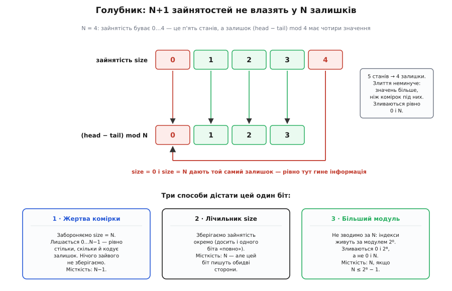
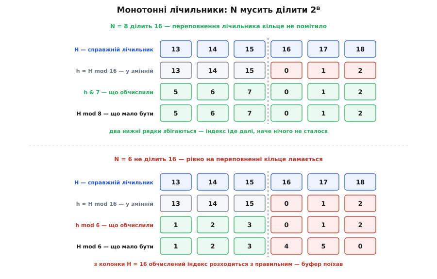

# 🧮 Індексна арифметика кільця

## Остача, яку ніхто не рахує

Усе кільце тримається на одній операції — взятті остачі. Але перш ніж щось про неї доводити, варто помітити, що саме́ її означення містить більше, ніж здається на око, і що вся кмітливість кільцевої індексації витягається саме з цього «більшого».

Теорема про ділення з остачею каже: для будь-якого цілого `a` й будь-якого натурального `N > 0` існує **єдина** пара цілих `q` і `r`, для якої

```
a = q·N + r,    0 ≤ r < N
```

Наголос — на слові «єдина». Існування нікого не дивує: поділив — подивився, що лишилось. А от єдиність — це важіль, і саме він робить далі всю роботу. Сила його ось у чому: щоб знайти остачу, **ділити не обов'язково**. Досить будь-яким способом — здогадом, хитрощами, поглядом збоку — пред'явити пару `q` і `r`, яка задовольняє обидві умови. Єдиність гарантує: пред'явлене `r` і є остача. Іншої просто немає.

Це не абстракція, а те, що кожен робить із дитинства, не помічаючи. Скільки буде `1234 mod 100`? Ніхто не ділить. Дивишся на дві останні цифри: 34. Чому це законно?

```
1234 = 12·100 + 34
       └──┬──┘  └┬┘
        q = 12   r = 34,   і 0 ≤ 34 < 100  ✔
```

Обидві умови справдилися — отже за єдиністю 34 і є остача, крапка. «Подивитися на останні цифри» — не фокус і не наближення: це та сама теорема, застосована миттєво. Ділити не довелося, бо десятковий запис уже носить відповідь готовою: остача за модулем 100 лежить у числі окремим шматком, треба лише вміти його побачити.

> 🔧 **Навіщо це.** Далі буде три різні на вигляд твердження: про маску замість ділення, про беззнакове віднімання лічильників і про те, чому місткість мусить бути степенем двійки. Здається, що це три окремі трюки, які треба завчити нарізно. Насправді це та сама дія, виконана тричі: пред'яви розклад → переконайся, що остача в межах → пошлися на єдиність. Хто побачив важіль, тому не треба пам'ятати жодного з трьох — він виведе їх на місці. Хто не побачив — той завчає три й безпорадний перед четвертим.

## Маска — це «останні цифри», записані двійкою

Тепер повторімо десятковий трюк у двійковій системі — і вийде маска. Хай `N = 2ᵏ`. Розпишімо `pos` за розрядами й розріжмо суму рівно на розряді `k`:

```
pos = Σ bᵢ·2ⁱ  (за всіма i)

pos = ( b_{k}·2ᵏ + b_{k+1}·2ᵏ⁺¹ + … )  +  ( b₀·2⁰ + … + b_{k−1}·2ᵏ⁻¹ )
      └──────────── старші ────────────┘    └──────── молодші k ───────┘
                    =  A                            =  B
```

Пред'явлення розкладу — це вже майже все. Погляньмо на обидва шматки.

**Старший шматок `A`.** Кожен його доданок має множник `2ⁱ` з `i ≥ k`, тобто ділиться на `2ᵏ`. Винесімо:

```
A = 2ᵏ·( b_{k}·2⁰ + b_{k+1}·2¹ + … ) = N·q,   де q — ціле
```

Отже `A` — це чесне `q·N`.

**Молодший шматок `B`.** Він невід'ємний, це очевидно. Але яка його найбільша можлива вартість? Вона досягається, коли всі `k` молодших бітів — одиниці, а це сума геометричної прогресії:

```
1 + 2 + 4 + … + 2ᵏ⁻¹ = 2ᵏ − 1 = N − 1
```

Отже `0 ≤ B ≤ N − 1`, тобто `0 ≤ B < N`. Друга умова теореми теж справдилася.

Розклад `pos = q·N + B` із `0 ≤ B < N` пред'явлено — за єдиністю `B = pos mod N`. **Остача за модулем `2ᵏ` — це рівно `k` молодших бітів числа**, точнісінько як остача за модулем `100` — це рівно дві останні цифри. Та сама теорема, інша основа.

Лишилося з'ясувати, чому `pos & (N−1)` дістає саме ці `k` бітів. Тут спрацьовує та сама щойно виписана рівність, прочитана справа наліво: `N − 1 = 2ᵏ − 1 = 1 + 2 + 4 + … + 2ᵏ⁻¹`. Тобто в двійковому записі `N − 1` — це `k` одиниць поспіль і нулі в усіх старших розрядах. Побітове І лишає біт `i` тоді й лише тоді, коли в масці на позиції `i` стоїть одиниця; отже воно лишає рівно розряди `0…k−1` і обнуляє всі старші. А це дослівно означення `B`.

```
N = 8 = 2³,  маска = N − 1 = 7 = 0b0111  (три одиниці — три молодші розряди)

pos = 13 = 0b1101 = 1·8 + 5
              ↑└┬┘
              A  B          A = 0b1000 = 8   (ділиться на 8 → q = 1)
                            B = 0b101  = 5   (0 ≤ 5 < 8  ✔)

13 & 7 = 0b1101 & 0b0111 = 0b0101 = 5   =   13 mod 8   ✔
```

Про механіку модульної арифметики окремо — у [модульній арифметиці](book:math/modular-arithmetic): це остача від ділення, конгруентність за модулем і те, що додавання й множення з остачею можна брати в будь-якому порядку. Тут нам знадобиться саме єдиність остачі й те, що конгруентні числа в одному діапазоні завжди рівні.

**Де це ламається.** Придивімося, чого маска насправді не вміє. Маскування — це завжди «лишити набір розрядів», а лишити розряди `0…k−1` означає звести за модулем `2ᵏ` і нічого іншого. **Модулі, які маска здатна виразити, — це рівно степені двійки.** Тут нема чого налаштовувати: не існує маски за модулем 6, бо 6 не є степенем двійки, тож не існує й розрядного розрізу, який дав би розклад `6·q + r`. Найближча маска `N − 1 = 5 = 0b101` дає щось інше:

```
7 & 5 = 0b111 & 0b101 = 0b101 = 5,    але   7 mod 6 = 1
```

Не «неточно» — просто інша величина, без жодного зв'язку з потрібною.

## Чому лічильники беззнакові

Є тонкість, через яку «`& (N−1)` — це те саме, що `% N`» справджується не завжди, і саме вона диктує тип лічильників.

Річ у тім, що остача, яку дає теорема, — **евклідова**: вона за означенням лежить у `0 ≤ r < N`, завжди невід'ємна. Оператор `%` у C дає **не її**. Починаючи з C99 (§6.5.5) ділення цілих обрізається в бік нуля: дробову частину відкидають, а остача мусить задовольняти `(a/b)·b + a%b == a`. Звідси остача переймає знак **діленого**:

```
у C (C99 і далі):       −1 / 8  =  0        →   −1 % 8  =  −1
евклідова остача:      −1 = (−1)·8 + 7      →   0 ≤ 7 < 8   →   r = 7
у Python (округлення вниз):                     −1 % 8  =   7

маска ж завжди дає невід'ємне:                  −1 & 7  =   7
```

(До C99 поведінка `%` для від'ємних була означена реалізацією; C99 її закріпив і C11 лишив без змін.)

Маска не має вибору: вона фізично лишає `k` бітів, а `k` бітів — це завжди число з `0…2ᵏ−1`. Тобто **маска завжди повертає евклідову остачу**, а знаковий `%` у C — ні. Для невід'ємного `pos` вони збігаються; для від'ємного розходяться.

Наслідок практичний і жорсткий. Компілятор **не має права** замінити знакове `x % 8` на `x & 7` — це змінило б результат для від'ємних `x`, тож він змушений дописати виправлення знака зайвими інструкціями. Оголоси лічильники беззнаковими — і залишиться одна-єдина інструкція `and`, бо для беззнакового типу від'ємних значень не існує й розходитися нема з чим.

Але дешевизна тут — не головне. Індекс `−1` у масиві означає не «повільно», а вихід за межі буфера. Беззнаковий тип — це не мікрооптимізація, а тип, у якому арифметика **означає саме те, що нам треба**: вона працює по колу від природи, а не всупереч їй.

## Один біт, якого бракує

Тепер до головного. Про два індекси зазвичай кажуть: «`head == tail` — і незрозуміло, повно чи порожньо». Це спостереження. Його можна перетворити на висновок — і тоді видно не лише що біда є, а й **скільки саме** її, і чому виходів рівно три.

Візьмімо схему в найчистішому вигляді: увесь стан — це пара `(h, t)`, обидва індекси зведені за модулем `N`. Жодних інших змінних. Зайнятість `size` мусить бути **функцією від цього стану** — більше її нема звідки взяти.

Ця вимога вже майже все визначає. Подивімося, як `size` мусить поводитися. Позначмо `d = (h − t) mod N` і простежмо за обома величинами:

```
запис:    h → h+1  ⟹  d → d+1 (mod N),   і   size → size+1
читання:  t → t+1  ⟹  d → d−1 (mod N),   і   size → size−1
```

Обидві операції зсувають `size` і `d` **на однакову величину в один бік**. Отже різниця `size − d` не змінюється (за модулем `N`) від жодної операції — це інваріант. У початковому стані буфер порожній: `size = 0` і `d = 0`, тож `size − d ≡ 0`. Раз інваріант тримається завжди, то

```
size ≡ (h − t)   (mod N)      — при будь-якому досяжному стані
```

Це не домовленість і не вибір реалізації: **інакше бути не може**. Зайнятість змушена дорівнювати різниці індексів за модулем `N`.

А тепер порахуймо. `size` набуває значень `0, 1, …, N` — це **N+1** різних станів. Залишок `d` набуває значень `0, 1, …, N−1` — це **N** значень. За принципом голубника `N+1` значень не влазять у `N` комірок: якісь два стани зіллються. Злиття неминуче — не через недбалість, а через рахунок.

Причому видно, які саме зіллються. Раз `size ≡ d (mod N)` і `0 ≤ size ≤ N`, то для заданого `d` можливі рівно `size = d` та `size = d + N`. Друге допустиме лише коли `d + N ≤ N`, тобто коли `d = 0`. Отже:

```
d ≠ 0   →   size = d           — визначено однозначно
d = 0   →   size ∈ {0, N}      — і тільки тут двозначність
```


*Зайнятість змушена дорівнювати `(head − tail) mod N`, а цей залишок бере лише `N` значень, тоді як зайнятостей `N+1`. Голубник: злиття неминуче. Виведення показує й місце злиття — рівно `size = 0` і `size = N` лягають на залишок 0, решта станів взаємно однозначна. Бракує не «ясності», а **одного біта**, і рівно в одному стані — тож три способи розрізнити повне й порожнє насправді відповідають на одне питання: звідки взяти цей біт.*

Ось точне формулювання проблеми: бракує **рівно одного біта інформації**, і бракує його **рівно в одному стані**. Усі інші зайнятості читаються з пари індексів бездоганно. І тепер видно, що три класичні способи — не три випадкові хитрощі, а три відповіді на одне питання: **звідки взяти цей біт**.

## Три інваріанти

Розберімо кожен спосіб як формальну конструкцію: інваріант, доведення точності обох присудків («порожньо», «повно») і ціна.

### Спосіб 1: жертва комірки

**Інваріант:** `0 ≤ size ≤ N−1`.

Замість шукати біт — зменшуємо потребу. Забороняємо стан `size = N`: запис дозволено лише коли `size < N−1`, тож `size = N` просто недосяжний.

**Коректність.** З інваріанта `size ≤ N−1`, а `d` теж лежить у `0…N−1`. Обидва числа конгруентні за модулем `N` (доведено вище) і обидва в діапазоні `0…N−1` — а конгруентні числа з одного проміжку довжиною `N` рівні. Отже `size = d` **тотожно**, без жодної двозначності. Далі присудки виводяться самі:

```
порожньо ⟺ size = 0     ⟺ d = 0     ⟺ h == t
повно    ⟺ size = N−1   ⟺ d = N−1   ⟺ (h + 1) mod N == t
```

Останню рівносильність варто розписати: `d = N−1` означає `h − t ≡ −1`, тобто `h + 1 − t ≡ 0`, тобто `(h+1) mod N == t`. Обидва присудки точні.

**Інваріант зберігається:** запис іде лише при `size < N−1`, отже `size+1 ≤ N−1` ✔; читання — лише при `size > 0`, отже `size−1 ≥ 0` ✔.

**Ціна:** місткість `N−1`, одна комірка не використовується ніколи. Але тут варто сказати те, що зазвичай проминають: жертва **однієї** комірки — не зручний вибір, а **найкраще можливе**. Залишок кодує `N` значень, отже для місткості `C` треба `C+1 ≤ N`, звідки `C ≤ N−1`. Більшої місткості без додаткового стану не існує. Спосіб не просто працює — він оптимальний у своєму класі.

### Спосіб 2: лічильник

**Інваріант:** `0 ≤ size ≤ N`, причому `size` зберігається явно й `size ≡ (h − t) (mod N)`.

Тут біт не економлять, а **доплачують пам'яттю**: зайнятість не виводять зі стану, а пам'ятають.

**Коректність** стає майже беззмістовною — і це саме́ й є суть способу. Присудки `size == 0` і `size == N` точні за побудовою: ми не здогадуємося про зайнятість, ми її зберігаємо. Індекси лишаються тільки адресами: елементи лежать у комірках `(t + j) mod N` для `j = 0…size−1`. Двозначності нема, бо ніхто нічого не виводить.

**Ціна.** Місткість повна, `N`. Але додано `⌈log₂(N+1)⌉` бітів там, де бракувало **одного**. Мінімальна ж полагодка — саме один біт, прапорець `full`:

```c
/* запис */   buf[h] = x;  h = (h + 1) & MASK;  full = (h == t);
/* читання */ *out = buf[t];  t = (t + 1) & MASK;  full = false;

порожньо ⟺ (h == t) && !full
повно    ⟺ (h == t) &&  full
```

Прапорець доплачує рівно той біт, якого бракує, — і не більше. Перевіримо на межі: старт `h = t = 0`, `full = false` — порожньо ✔. Після `N` записів `h` обійшов коло й дорівнює `t`, а `full` став `true` — повно ✔. Після будь-якого читання `full` гасне ✔. Лічильник `size` — просто зручніша й ситніша версія того самого біта.

Справжня ціна тут не в байтах, а в **спільному записі**. У способі з монотонними індексами `head` пише лише виробник, `tail` — лише споживач. І `size`, і прапорець `full` пишуть **обидві** сторони: це вже спільна змінна, її треба оновлювати атомарною операцією читання-зміни-запису, а це змагання за одну лінію кеша й справжня точка синхронізації. Один біт зручності коштує тієї самої властивості, заради якої кільце часто й беруть, — [порядку пам'яті без замків](book:programming/std-atomic).

### Спосіб 3: монотонні індекси

**Інваріант:** `head ≥ tail` і `head − tail ≤ N`.

Тут не зменшують потребу й не доплачують пам'яттю — **збільшують модуль**. Індекси не зводять за `N` узагалі: `head` рахує, скільки всього елементів колись покладено, `tail` — скільки забрано, обидва тільки зростають.

**Коректність** найпрозоріша з трьох, бо `size` — не виведена величина, а сама означення. Кожен елемент, який поклали й ще не забрали, лежить у буфері, отже

```
size = head − tail     — точна рівність, БЕЗ жодного mod
```

Обидві частини інваріанта підтримують сторожі: читати можна лише при `head > tail` (не забереш більше, ніж поклав) — звідси `head ≥ tail`; писати лише при `head − tail < N` — звідси `head − tail ≤ N`. Присудки точні й місткість повна:

```
порожньо ⟺ head == tail
повно    ⟺ head − tail == N
```

Усе бездоганно — і геть неможливо: `head` і `tail` зростають без межі, а машинна змінна скінченна. Ось тут і починається справжня математика способу.

## Переповнення як механізм

Нехай `H` і `T` — справжні, необмежені лічильники, а в пам'яті лежать беззнакові `B`-бітові змінні. Тоді там насправді не `H` і `T`, а

```
M = 2ᴮ  — модуль машинного типу
h = H mod M
t = T mod M
```

Стандарт C гарантує саме це, а не «як пощастить»: §6.2.5 каже, що обчислення з беззнаковими операндами **не може переповнитися**, бо результат, який не влазить у тип, зводиться за модулем «на одиницю більшим за найбільше подаване значення» — тобто за `2ᴮ`. Це означене поводження, на якому можна будувати доведення. (Знакове переповнення в C, навпаки, — невизначене поводження: компілятор має право припускати, що його не буває, і оптимізувати виходячи з цього. Тому беззнаковий тут — умова коректності, а не смаку. Докладно про це — у [беззнаковому переповненні](book:programming/unsigned-overflow).)

**Твердження.** Беззнакове віднімання `(h − t) mod M` дорівнює справжній зайнятості `H − T`, поки `0 ≤ H − T ≤ M − 1`.

**Доведення** — той самий важіль утретє. `h ≡ H (mod M)` і `t ≡ T (mod M)`, отже `h − t ≡ H − T (mod M)`. Беззнакове віднімання в C дає канонічний залишок, тобто число з `0…M−1`. Величина `H − T` за умовою теж лежить у `0…M−1`. Два числа конгруентні за модулем `M` і обидва в проміжку довжиною `M` — отже рівні. ∎

Умова `H − T ≤ M − 1` при `N ≤ M − 1` виконується сама, бо інваріант дає `H − T ≤ N`. Для `kfifo` у ядрі Linux: `B = 32`, `M = 2³²`, а найбільший допустимий розмір черги — `2³¹`, тож запас щонайменше вдвічі, а на практиці — величезний.

Найцікавіше тут — що переповнення не терплять, **ним користуються**. Погляньмо на мить, коли `h` уже загорнувся, а `t` ще ні (візьмімо для наочності `B = 4`, `M = 16`, `N = 8`):

```
H = 17, T = 12      →      справжня зайнятість  H − T = 5

у змінних:  h = 17 mod 16 = 1        t = 12 mod 16 = 12
                    h < t  (!)  — «голова» числом менша за «хвіст»

h − t = 1 − 12 = −11 ≡ 5 (mod 16)   →   беззнакове віднімання дає 5   ✔
```

Числом `h` менше за `t` — знакове віднімання дало б `−11`, тобто «мінус одинадцять елементів у буфері». Беззнакове дає 5, і це правильна відповідь. Не «попри» загортання, а **завдяки** йому: загортання лічильника й загортання кільця — та сама модульна арифметика, тож перше точно компенсує друге.

І тут варто побачити те, що зазвичай лишається непоміченим. Спосіб 3 **не усунув** двозначності — він її **пересунув**. Якби `H − T` дійшло до `M`, ми знову дістали б залишок 0 при повному буфері й та сама пастка клацнула б рівно так само, просто поверхом вище. Тобто спосіб 3 — це **спосіб 1, застосований до модуля `M` замість `N`**: жертвуємо станами `size = M`, `M+1`, …, тобто `M − N` «примарних комірок». Різниця лише в тому, що жертвувати комірку з восьми — це віддати восьму частину пам'яті, а жертвувати `2³² − 256` неіснуючих станів лічильника — це не віддати нічого. Уся елегантність способу в цьому: він платить ту саму ціну, але у валюті, якої не шкода.

## Чому N мусить ділити 2ᴮ

Різниця вціліла. Лишилося друге, і саме тут ховається те, чого не видно з розмов про швидкість.

Нам потрібен індекс у масиві — це `H mod N`. Але `H` у нас немає: у змінній лежить `h = H mod M`. Тож питання точне:

```
чи справджується    (H mod M) mod N  =  H mod N   ?
```

**Так — тоді й лише тоді, коли N ділить M.**

**Якщо `N | M`.** Тоді `M = c·N` для цілого `c`. Розпишімо `H` через `M`:

```
H = q·M + h = q·c·N + h
    └───┬──┘
   ділиться на N  ⟹  H ≡ h (mod N)  ⟹  H mod N = h mod N   ✔
```

Зведення за `M` просто відкинуло щось, кратне `N`, — а для остачі за модулем `N` таке відкидання невидиме.

**Якщо `N ∤ M`.** Досить одного контрприкладу: візьмімо `H = M`. Тоді `H mod N = M mod N ≠ 0` (бо `N` не ділить `M`). Але у змінній `h = M mod M = 0`, звідки `h mod N = 0`. Величини різні — обчислений індекс не той, що потрібен. ✘

Отже `N` мусить бути дільником `M = 2ᴮ`. А дільники степеня двійки — це рівно `1, 2, 4, …, 2ᴮ`. **Місткість зобов'язана бути степенем двійки — і не заради швидкості, а заради правильності.**

Це варто вимовити чітко, бо тут суть. Твердження «степінь двійки — щоб маска замість ділення» правдиве, але описує лише вигоду. У способі з монотонними лічильниками степінь двійки — **вимога коректності**: постав `N = 6`, чесно рахуй повільним `%`, не бери жодної маски — і буфер однаково зламається. Не повільніше працюватиме, а зламається.


*Той самий хід лічильника `H` через переповнення при `B = 4` (`M = 16`). Угорі `N = 8` ділить 16: обчислений з машинної змінної індекс збігається з правильним у кожній колонці — кільце навіть не помітило, що лічильник загорнувся. Унизу `N = 6` не ділить 16: до переповнення все гаразд, а з колонки `H = 16` індекс мав піти `4, 5, 0`, натомість пішов `0, 1, 2`. Кільце перескочило дві комірки й повернулося на вже зайняті — вміст поїхав.*

Розберімо нижню панель докладно, бо саме вона показує, як це виглядає в житті:

```
B = 4, M = 16, N = 6

H:                 13   14   15   16   17   18
h = H mod 16:      13   14   15    0    1    2      ← тут лічильник загорнувся
h mod 6 (маємо):    1    2    3    0    1    2
H mod 6 (треба):    1    2    3    4    5    0
                                   ↑
                        розходження починається рівно тут
```

До переповнення обидва рядки збігаються — буфер працює бездоганно скільки завгодно довго. У мить загортання індекс мав перейти `3 → 4`, а перейшов `3 → 0`: комірки 4 і 5 пропущено, натомість перезаписано ті, де ще лежать непрочитані дані. Порядок FIFO порушено, елементи загублено — і жодного натяку на причину.

Тепер про масштаб. При `B = 32` це стається раз на `2³² ≈ 4.3·10⁹` операцій. Для скромного потоку в сто тисяч операцій на секунду — приблизно раз на **дванадцять годин**:

```
2³² / 100 000 = 42 950 с ≈ 11.9 год
```

Помилка, що з'являється двічі на добу, щоразу в іншому місці, і переживає будь-який тест, який ганяють хвилину. Знайти її, не знаючи цієї теореми, майже неможливо.

Саме тому ядро Linux не лишає розміру на розсуд того, хто викликає. У `kfifo` поля `in`, `out` і `mask` — усі `unsigned int`; довжина рахується як `in - out`, порожнеча — як `in == out`. А при виділенні `__kfifo_alloc` округлює розмір угору до степеня двійки, і коментар над цим рядком пояснює причину прямо: прийом із загортанням індексів «works only in this case» — працює тільки в цьому разі. `__kfifo_init`, який бере вже готовий буфер і не може його збільшити, округлює вниз — але степеня двійки не поступається однаково.

І тут важливо не змішати способи. Вимога `N | 2ᴮ` — **тільки для монотонних лічильників**. Способи 1 і 2 зводять індекси за `N` на кожному кроці (`h = (h + 1) % N`), тож жодна змінна ніколи не доростає до `2ᴮ` і машинного переповнення просто не буває; там степінь двійки — суто питання швидкості, і `N = 6` цілком законне, лише повільніше. Жорстке зобов'язання породжує саме той спосіб, що живиться переповненням: хто користується загортанням типу, той мусить узгодити з ним свій модуль.

## O(1) у найгіршому разі — і чому це не «амортизовано O(1)»

Лишилася остання властивість, і вона теж точніша, ніж здається з формули.

Про зростаючий масив кажуть «додавання — O(1) амортизовано». Подивімося, що це означає буквально. При подвоєнні перевиділення стаються на розмірах `1, 2, 4, …, 2ᵐ ≤ n`, і всі копіювання разом коштують

```
1 + 2 + 4 + … + 2ᵐ = 2ᵐ⁺¹ − 1 < 2n

усього за n додавань:   n (самі записи) + 2n (копіювання)  ≤  3n
```

Отже сума справді лінійна, амортизована ціна — стала. Але придивімося, про що це твердження: воно **про суму**, а не про доданок. Найдорожча ж окрема операція коштує:

```
амортизовано O(1):     Σ cost(i) = O(n)          — про послідовність
у найгіршому разі O(1): max cost(i) = O(1)        — про кожну операцію окремо
```

Друге строго сильніше: з `max cost(i) = O(1)` сума `O(n)` випливає негайно, а навпаки — ні. І зростаючий масив — саме той випадок, де «навпаки» не діє: `max cost(i) = Θ(n)`. У мить перевиділення масиву на `2²⁰` елементів одне-єдине додавання копіює **1 048 576** елементів. Середнє при цьому лишається чудовим.

Кільце ж не має чого амортизувати. Обидві його операції — прямолінійний код: перевірка сторожа, запис у комірку, приріст двох лічильників. Жодного циклу, жодного повторення, залежного від даних чи від `n`. Число кроків обмежене сталою, яку видно просто з тексту, — тому `max cost(i) = O(1)`, у найгіршому разі, а не в середньому. І пам'ять — рівно `O(N)`, відома наперед не як оцінка, а як точне число.

Чому ця відмінність — не педантизм, а вся суть, видно там, де кільце й живе: у [системах реального часу](book:algorithms/real-time-systems), де правильність означає не лише «дає вірний результат», а «дає його до строку». Звуковий виклик на 48 кГц із буфером на 128 кадрів має строк

```
128 / 48 000 = 0.00267 с = 2.67 мс
```

Промахнувся раз — і в колонці клацнуло. Амортизована оцінка обіцяє, що **в середньому** все гаразд, — але колонка грає не середнє. Величина, яка важить, — це `max`, а амортизований аналіз про `max` не каже нічого взагалі. Дві оцінки не «трохи різні за строгістю»: одна вимірює те, що потрібно, а друга — те, що ні.

Є й друга, тонша різниця. Амортизована оцінка — це властивість **послідовності**, і тому вона залежить від усієї історії та від припущень про неї. Класичний приклад крихкості: якщо масив зростає при заповненні й стискається рівно на половині, то супротивник, що чергує додавання й вилучення на самій межі, змушує перевиділення **на кожній операції** — `Θ(n)` на кожну, `Θ(n²)` разом. Амортизована оцінка не просто погіршилася — вона зникла. Лагодять це гістерезисом (стискати на чверті), але сам урок лишається: доведення трималося на припущенні про поводження викликача.

Оцінка кільця — властивість **операції**. Вона не залежить від історії, від порядку викликів, від того, звідки почали й хто чергує. Немає послідовності — немає й супротивника, який її зіпсує.

За це, звісно, платять — місткістю. Зростаючий масив ніколи не каже «ні», кільце каже «ні» на `N`. Але це не вада, а той самий обмін, лише названий прямо: кільце перетворює необмежену й непередбачувану ціну в часі на обмежене й **явне** рішення про пам'ять, ухвалене наперед. Саме цього й хоче система зі строком — відмовити видимо, дешево й у відомій точці, а не мовчки, дорого й невідомо коли.
