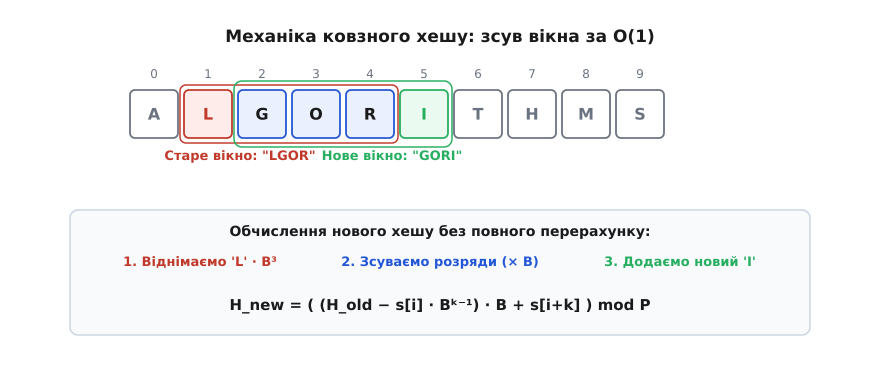
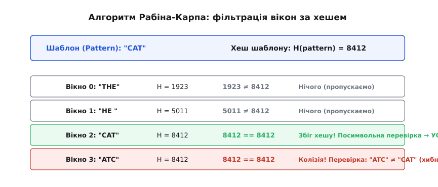
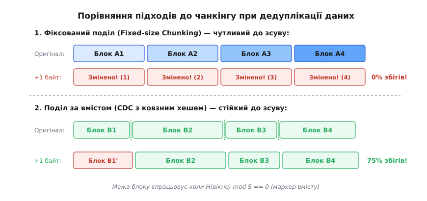

# Ковзний хеш (rolling hash)

<preknowlist>
- [Хеш-таблиця](book:algorithms/hash-table) — принцип відображення довільних даних у числове значення та керування колізіями.
- [Асимптотична складність](book:algorithms/asymptotic-complexity) — нотація O великого, аналіз часу виконання та просторової складності.
</preknowlist>

Уявіть, що перед вами стоїть завдання знайти фрагмент тексту у величезному архіві документів обсягом у кілька гігабайтів, або визначити, які саме блоки файлу змінилися після редагування, щоб передати мережею лише дельту. Наївний підхід вимагає посимвольного порівняння або переобчислення хеш-функції для кожного можливого зсуву вікна. Якщо довжина шуканого фрагмента становить тисячі байтів, а розмір архіву — мільярди, традиційний обрахунок швидко виснажує обчислювальні ресурси центрального процесора.

Ковзний хеш (rolling hash) розв'язує цю проблему за допомогою алгебраїчного трюку. Він дозволяє обчислити хеш-значення для початкового вікна даних, а при зсуві вікна на один символ праворуч — оновити хеш за сталий час O(1), не перечитуючи весь вміст вікна наново.

---

## 1. Мотивація: ціна статичного огляду у світі даних

У класичних задачах обробки рядків і потоків даних часто виникає потреба аналізувати сканувальне вікно фіксованої довжини `k`, що послідовно переміщується вздовж тексту довжиною `N`.

Розглянемо, що відбувається при застосуванні звичайної хеш-функції (наприклад, MD5, SHA-256 або стандартного скалярного хешу рядка). На кожній позиції `i` від `0` до `N - k` ми виділяємо підрядок `s[i .. i + k - 1]` і повністю прораховуємо його хеш-значення від першого до останнього символу.

Обчислення хешу для одного вікна довжиною `k` вимагає `k` операцій читання й арифметичного додавання або множення. Оскільки у тексті довжиною `N` існує `N - k + 1` можливих позицій вікна, загальна часова складність такого процесу становить:

T(N, k) = O((N - k + 1) · k) = O(N · k)

Якщо `N` вимірюється гігабайтами (10⁹ байтів), а довжина вікна `k` становить 10 кілобайтів (10⁴ байтів), загальна кількість арифметичних операцій перевищить 10¹³ (десять трильйонів). Навіть сучасний процесор із частотою 3 ГГц витратить на таке завдання понад годину суцільних обчислень.

Проблема полягає у повторюваній роботі: зсунувши вікно всього на один символ праворуч, ми викидаємо з розгляду один символ зліва і додаємо один символ справа. Решта `k - 2` символів усередині вікна залишаються тими самими й розташовані в тій самій послідовності. Проте звичайна хеш-функція «не пам'ятає» попередній стан і змушена знову перечитувати всі `k` символів від початку до кінця.

Якби ми мали алгоритмічний механізм, який дозволяє відняти алгебраїчний внесок символу, що вибув, і додати внесок нового символу, час оновлення зменшився б від `O(k)` до `O(1)`. Тоді загальна складність обробки всього потоку знизилася б до лінійної:

T(N, k) = O(N + k) = O(N)

Саме цю ідею реалізує ковзний хеш.

---

## 2. Фізична й логічна модель: концепція «зсуву без переобчислення»

Щоб побудувати логічну модель ковзного хешу, уявіть бігову доріжку або кільцевий екранований буфер, крізь який рухається стрічка із символами.

Нехай у нас є рядок символів `s = "ALGORITHMS"` і вікно довжиною `k = 4`.
На першому кроці вікно охоплює підрядок на індексах `[1 .. 4]`: `"LGOR"`.

Зсунемо вікно на один крок праворуч. Тепер воно охоплює індекси `[2 .. 5]`: `"GORI"`.

*Механіка ковзного вікна: зсув на один символ вимагає лише видалення лівого елемента та додавання правого без перерахунку всього вікна.*

Проаналізуємо зміни складників усередині вікна:
1. Символ `'L'` (індекс 1) виходить з лівого краю вікна.
2. Символи `'G'`, `'O'`, `'R'` (індекси 2, 3, 4) залишаються всередині вікна, але змінюють свої відносні позиції: кожен із них зсувається на один розряд ліворуч стосовно нового правого краю.
3. Символ `'I'` (індекс 5) входить у вікно з правого краю на наймолодшу позицію.

Якщо хеш-функція спроєктована так, що кожен символ робить свій внесок у підсумкове значення відповідно до позиційного коефіцієнта (подібно до розрядів у десятковій або двійковій системі числення), процес оновлення зводиться до трьох послідовних кроків:
- **Видалення:** Від початкового значення хешу віднімається внесок найстаршого символу, що залишає вікно.
- **Зсув:** Значення, що залишилося, множиться на основу системи числення `B` (зсув усіх розрядів на один крок ліворуч).
- **Додавання:** До результату додається значення нового символу, що зайняв наймолодший розряд.

Завдяки цьому алгебраїчному розкладу нам не потрібно знати вміст внутрішніх `k - 2` символів під час переходу. Вони зберігають свій відносний порядок і автоматично множаться на основу `B` разом з усім хешем.

---

## 3. Поліноміальне хешування як алгебраїчний рушій

Найпоширенішою та математично обґрунтованою реалізацією ковзного хешу є **поліноміальне хешування** (polynomial rolling hash).

### Алгебраїчне визначення
Подамо підрядок `s[i .. i + k - 1]` як поліном від основи `B` за модулем `P`. Кожен символ `s[j]` розглядається як числове значення (наприклад, його ASCII- або Unicode-код).

Хеш-значення вікна довжиною `k`, що починається з індексу `i`, визначається за формулою:

H(s[i .. i + k - 1]) = (s[i] · Bᵏ⁻¹ + s[i+1] · Bᵏ⁻² + s[i+2] · Bᵏ⁻³ + ... + s[i+k-1] · B⁰) mod P

Тут:
- `B` — основа полінома (ціле число, зазвичай більше за розмір алфавіту `|Σ|`);
- `P` — модуль хешування (велике просте число для рівномірного розподілу залишків);
- `Bᵏ⁻¹` — вага найстаршого (лівого) символу у вікні.

### Формула ковзного оновлення
Нехай ми вже знаємо значення хешу `H_old` для вікна `s[i .. i + k - 1]`. Ми хочемо обчислити `H_new` для наступного вікна `s[i+1 .. i + k]`.

Записавши обидва поліноми, бачимо:

H_old = (s[i] · Bᵏ⁻¹ + s[i+1] · Bᵏ⁻² + ... + s[i+k-1] · B⁰) mod P

H_new = (s[i+1] · Bᵏ⁻¹ + s[i+2] · Bᵏ⁻² + ... + s[i+k] · B⁰) mod P

Виконаємо алгебраїчний перехід від `H_old` до `H_new`:

1. Віднімаємо внесок найстаршого символу `s[i]`:
   H' = (H_old - s[i] · Bᵏ⁻¹) mod P

2. Множимо результат на основу `B`, підвищуючи степені всіх інших членів на 1:
   H'' = (H' · B) mod P = (s[i+1] · Bᵏ⁻¹ + s[i+2] · Bᵏ⁻² + ... + s[i+k-1] · B¹) mod P

3. Додаємо значення нового символу `s[i+k]`, який входить на позицію `B⁰ = 1`:
   H_new = (H'' + s[i+k]) mod P

Об'єднуючи всі три кроки в одну підсумкову формулу, отримуємо:

H_new = ((H_old - s[i] · Bᵏ⁻¹) · B + s[i+k]) mod P

### Числовий приклад
Розглянемо практичний числовий приклад. Нехай основа `B = 10`, модуль `P = 97`, а довжина вікна `k = 3`.
Нехай числові коди символів підрядка `"CAT"` дорівнюють `s[0] = 3` ('C'), `s[1] = 1` ('A'), `s[2] = 4` ('T').
Початкове вікно `"CAT"` (індекси 0..2):
- `H_old = (3 · 10² + 1 · 10¹ + 4 · 10⁰) mod 97 = (300 + 10 + 4) mod 97 = 314 mod 97 = 23`.

Тепер вікно зсувається: вибуває символ `s[0] = 3` ('C'), а з правого боку входить новий символ `s[3] = 2` ('E'). Нове вікно — `"ATE"` (`[1, 4, 2]`).
Множник найстаршого розряду `E = Bᵏ⁻¹ mod P = 10² mod 97 = 100 mod 97 = 3`.

Застосуємо формулу зсуву:
1. Віднімаємо старший символ: `H' = (23 - 3 · 3) mod 97 = (23 - 9) mod 97 = 14`.
2. Зсуваємо розряд (× 10): `H'' = (14 · 10) mod 97 = 140 mod 97 = 43`.
3. Додаємо новий символ (2): `H_new = (43 + 2) mod 97 = 45`.

Перевіримо результат безпосереднім обчисленням для підрядка `"ATE"` (`[1, 4, 2]`):
`H_direct = (1 · 10² + 4 · 10¹ + 2 · 10⁰) mod 97 = (100 + 40 + 2) mod 97 = 142 mod 97 = 45`.

Значення `45 == 45` збігаються достеменно! Ми отримали той самий результат всього за 3 арифметичні операції без переобчислення всієї суми.

---

## 4. Сфера застосування: від алгоритму Рабіна-Карпа до rsync

Ковзний хеш є базовим побудовним блоком для цілої низки фундаментальних алгоритмів у галузі пошуку текстових даних, мережевих протоколів та систем зберігання.

### 1. Алгоритм Рабіна-Карпа для пошуку підрядків
Класичною ілюстрацією застосування ковзного хешу є алгоритм Рабіна-Карпа (Rabin-Karp algorithm), створений Майклом Рабіном та Річардом Карпом у 1987 році.

Задача полягає у пошуку всіх входжень шаблону `pattern` довжиною `M` у тексті `text` довжиною `N`.

*Схема алгоритму Рабіна-Карпа: фільтрація незбіжних вікон за хешем із точковою перевіркою потенційних кандидатів.*

Алгоритм працює за такою схемою:
1. Спочатку обчислюється хеш шаблону `H_pattern = H(pattern[0 .. M-1])`.
2. Обчислюється хеш першого вікна тексту `H_text = H(text[0 .. M-1])`.
3. Потім вікно зсувається вздовж тексту від `i = 0` до `N - M`:
   - Якщо `H_text != H_pattern`, підрядок у поточному вікні точно не дорівнює шаблону. Вікно зсувається далі за `O(1)`.
   - Якщо `H_text == H_pattern`, виник збіг хешів. Оскільки хеш-функція може давати колізії, виконується посимвольна перевірка підрядка `text[i .. i + M - 1]` із `pattern`. Якщо посимвольна перевірка підтверджує збіг, ми знайшли входження!
   - Обчислюється хеш наступного вікна `H_text` за формулою ковзного оновлення за `O(1)`.

Оскільки більшість вікон у реальному тексті не збігаються із шаблоном і відсікаються за нерівністю хешів за `O(1)`, середня часова складність Рабіна-Карпа становить `O(N + M)`.

Докладніше про історію створення алгоритму та його еволюцію дивіться у вставці 📜 [Винайдення алгоритму Рабіна-Карпа та застосування у дедуплікації](book:algorithms/rolling-hash/hist-rabin-karp.md).

### 2. Дедуплікація даних та Content-Defined Chunking (CDC)
У сучасних системах збереження даних (таких як ZFS, restic, Borg Backup) та мережевих протоколах синхронізації (наприклад, `rsync`) ковзний хеш використовується для виявлення однакових блоків у файлах.

Уявіть, що ви редагуєте текстовий документ обсягом 100 мегабайтів і додаєте лише один новий символ на початку першої сторінки.

Якщо розбивати файл на блоки **фіксованого розміру** (наприклад, по 4096 байтів):
- Перший блок зміниться через доданий символ.
- Усі наступні блоки змістяться на 1 байт праворуч.
- З погляду системи збереження, **100% блоків файлу змінили свій вміст**, хоча фактично змінився лише один байт! Фіксований чанкінг ламається при найменшому зсуві даних.

*Порівняння фіксованого чанкінгу та Content-Defined Chunking: ковзний хеш зберігає більшість спільних блоків при додаванні даних.*

Розв'язанням цієї проблеми є **поділ на блоки за вмістом (Content-Defined Chunking, CDC)**:
1. Вікно ковзного хешу малого розміру (наприклад, `k = 64` байти) сканує файл байт за байтом від початку до кінця.
2. На кожному кроці перевіряється спеціальна умова на значення ковзного хешу:
   H(window) mod S == 0
   де `S` — бажаний середній розмір блоку (наприклад, `S = 4096`).
3. Коли умова виконується, поточна позиція оголошується межею (маркером) блоку.

Оскільки умова виконання залежить суто від місцевого вмісту даних у вікні `k`, додавання символу на початку файлу змінить лише межу першого блоку. Як тільки сканувальне вікно пройде місце вставки й дійде до старого тексту, ковзний хеш знову знайде ті самі маркери меж! Усі наступні блоки залишаться повністю ідентичними, гарантуючи коефіцієнт дедуплікації понад 99%.

### 3. Виявлення плагіату та система Winnowing
При порівнянні сирцевого коду програм або студентських робіт на наявність запозичень неможливо покладатися на точний пошук підрядків, адже автор міг змінити імена змінних або додати пробіли.

Алгоритми типу Winnowing обчислюють ковзний хеш для всіх послідовних n-грам (k-періодів) документа і з кожного вікна обраного розміру обирають мінімальне хеш-значення. Набір цих мінімумів формує компактний цифровий відбиток (fingerprint) документа. Якщо два документи мають значний відсоток спільних хеш-відбитків, це свідчить про плагіат або спільне походження коду.

---

## 5. Колізії, вибір модулю P та основи B, подвійне хешування

Хеш-функція відображає нескінченну множину можливих рядків у скінченну множину цілих чисел від `0` до `P - 1`. Згідно з принципом Діріхле (box principle), колізії (коли два різних рядки `S₁ != S₂` мають однакові хеш-значення `H(S₁) == H(S₂)`) є неминучими.

В алгоритмах із ковзним хешем колізії призводять до:
- Хибних спрацьовувань (false positives) в алгоритмі Рабіна-Карпа, що вимагають зайвих посимвольних перевірок і уповільнюють роботу.
- Помилкового об'єднання різних блоків при дедуплікації.

### Оптимальний вибір математичних параметрів
Щоб мінімізувати ймовірність колізій, параметри поліноміального хешу вибирають за суворими математичними правилами:

1. **Основа `B` (Base):**
   - Значення `B` має бути строго більшим за кількість можливих значень елемента алфавіту (`B > |Σ|`). Для довільних байтових даних, де елемент лежить у діапазоні `0 .. 255`, обирають `B >= 256` (наприклад, `B = 257` або `B = 313`).
   - У змагальному програмуванні або системній розробці основу `B` часто вибирають псевдовипадковим чином на старті програми. Це унеможливлює проведення цілеспрямованих хеш-атак (Anti-Hash tests), коли зловмисник спеціально генерує строки з колізіями під фіксовану основу `B`.

2. **Модуль `P` (Modulus):**
   - Значення `P` має бути великим простим числом. Просте число гарантує, що степені `B⁰, B¹, B², ...` утворюють рівномірний розподіл залишків у кільці відрахувань і не згортаються у короткі цикли.
   - Популярні значення для 32-бітної арифметики: `P = 10⁹ + 7` або `P = 10⁹ + 9`.
   - Популярні значення для 64-бітної арифметики: числа Мерсенна, наприклад `P = 2³¹ - 1 = 2147483647` або `P = 2⁶¹ - 1`. Застосування чисел Мерсенна дозволяє замінити повільну операцію ділення за модулем `%` на надшвидкі бітові операції побітового І `&` та зсуву `>>`.

Докладний математичний аналіз оцінки ймовірностей колізій за лемою Шварца-Зіппеля наведено у вставці 🧮 [Математика поліноміального хешування, колізії та вибір модулю P](book:algorithms/rolling-hash/math-poly-hash-mod.md).

### Техніка подвійного хешування (Double Hashing)
Якщо ймовірність колізії для одного модуля `P ≈ 10⁹` становить приблизно `1 / 10⁹` (що занадто багато при обробці мільярдів вікон), застосовують **подвійне хешування**.

Ми обчислюємо паралельно два незалежних ковзних хеші з різними парами параметрів:
- Перший хеш: `H₁` з основою `B₁` та модулем `P₁ = 10⁹ + 7`.
- Другий хеш: `H₂` з основою `B₂` та модулем `P₂ = 10⁹ + 9`.

Підсумковим хешем є пара `(H₁, H₂)`. Колізія виникає лише тоді, коли одночасно збігаються обидва значення `H₁` та `H₂`. Оскільки `P₁` та `P₂` є взаємно простими числами, ймовірність випадкової колізії за китайською теоремою про залишки дорівнює:

P(collision) ≈ 1 / (P₁ · P₂) ≈ 1 / 10¹⁸

Імовірність `10⁻¹⁸` є настільки мізерною, що вона менша за ймовірність апаратної помилки збою біта в оперативній пам'яті (Single Event Upset) під дією космічних променів.

### Модулярна арифметика та запобігання від'ємним залишкам
У мовах програмування високого та низького рівня (C, C++, Java, Python) операція взяття за модулем `%` для від'ємних чисел може повертати від'ємний результат (наприклад, `-5 % 7` у C++ дає `-5`, а не `2`).

Під час ковзного оновлення операція віднімання `H_old - s[i] · Bᵏ⁻¹` може дати від'ємне значення. Щоб уникнути помилкових розрахунків, віднімання завжди корегують додаванням модуля `P`:

H' = (H_old - (s[i] · E) % P + P) % P

Цей прийом гарантує, що проміжне значення завжди залишається додатним числом у діапазоні `[0 .. P - 1]`.

---

## 6. Порівняльний аналіз ковзних хешів

Поліноміальне хешування є найбільш гнучким, але не єдиним представником сімейства ковзних хешів. У таблиці нижче наведено порівняння основних математичних конструкцій ковзного хешування:

| Алгоритм | Математичний принцип | Швидкодія | Стійкість до колізій | Основне застосування |
| :--- | :--- | :--- | :--- | :--- |
| **Поліноміальний хеш** | Поліном `Σ s[j]·Bᵏ⁻¹⁻ʲ mod P` | Висока | Дуже висока (з `P ≈ 10⁹`) | Пошук Рабіна-Карпа, змагальний аналіз |
| **Adler-32 (rsync)** | Пара суматорів `s1 = Σ x_i`, `s2 = Σ (k-i) x_i` | Надзвичайно висока | Посередня (модуль 65521) | Протокол `rsync`, сканування блоків |
| **Buzhash** | Табличні побітові XOR та циклічні зсуви | Надзвичайно висока | Середня | Ранні версії систем CDC |
| **Gear Hash (FastCDC)** | Табличні зсуви за масивом вихідних значень | Максимальна (нативна для CPU) | Задовільна для чанкінгу | Швидкісний чанкінг у новітніх сховищах |

Докладні приклади реалізації поліноміального хешування та алгоритму rsync-чанкінгу мовами C/C++ та Python дивіться у вставці ⚙️ [Практична реалізація ковзного хешу: Рабін-Карп та rsync-чанкінг](book:algorithms/rolling-hash/proj-rolling-hash-c.md).

---

## 7. Систематичний підсумок та типові пастки

Ковзний хеш — це елегантний алгоритмічний інструмент, який перетворює важку задачу порівняння сканувальних вікон з квадратичної складності `O(N · k)` на прозору лінійну `O(N)`.

> 🔧 **Навіщо це.**
> Ковзний хеш є основою для алгоритму пошуку підрядків Рабіна-Карпа, інструментів синхронізації файлів (`rsync`), систем підрахунку дельта-копій, дедуплікації у хмарних і локальних сховищах (ZFS, restic, Borg Backup), а також систем автоматичного виявлення плагіату та порівняння геномних послідовностей.

### Пастки при реалізації
1. **Ігнорування переповнення цілих чисел:** Множення `s[i] · Bᵏ⁻¹` або `H' · B` може виходити за межі 32-бітних чи 64-бітних типів `int`. Використовуйте 64-бітні типи (`uint64_t` або `unsigned long long`) і виконуйте обчислення за модулем на кожному проміжному кроці.
2. **Забута корекція від'ємних значень:** При відніманні старшого розряду результат може стати від'ємним. Додавання модуля `+ P` перед остаточним `% P` є обов'язковим.
3. **Плутанина з криптографічними хешами:** Ковзний хеш **не є криптографічно стійким**. Зловмисник може легко сконструювати колізію для фіксованої пари `(B, P)`. Ніколи не використовуйте ковзні хеші для підпису паролів або цифрових сертифікатів безпеки.

Завдяки розумінню принципу ковзного хешу розробники отримують можливість проектувати надшвидкі алгоритми обробки масивних текстових і бінарних потоків даних.
