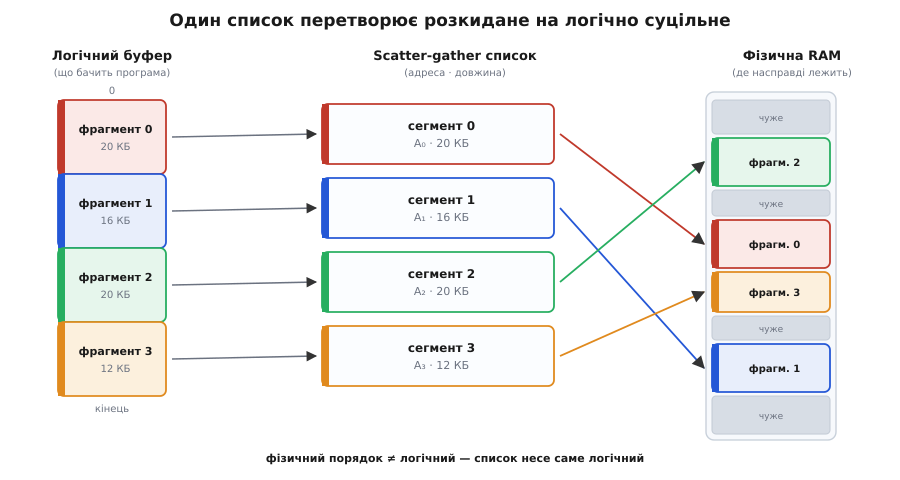
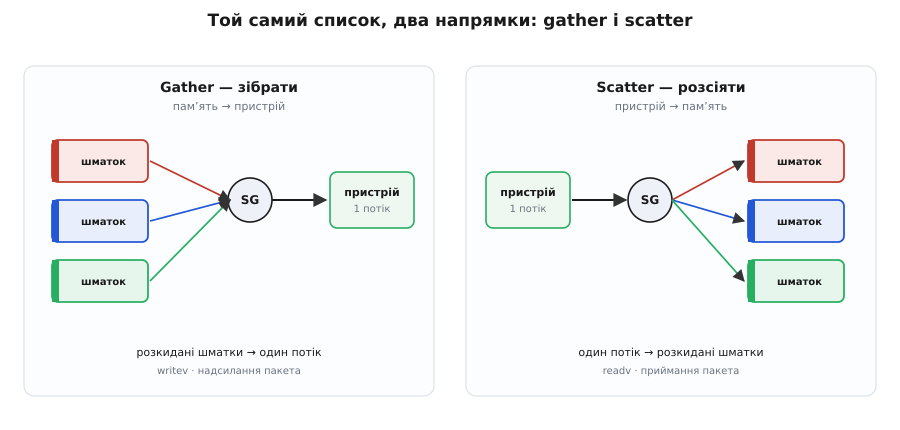
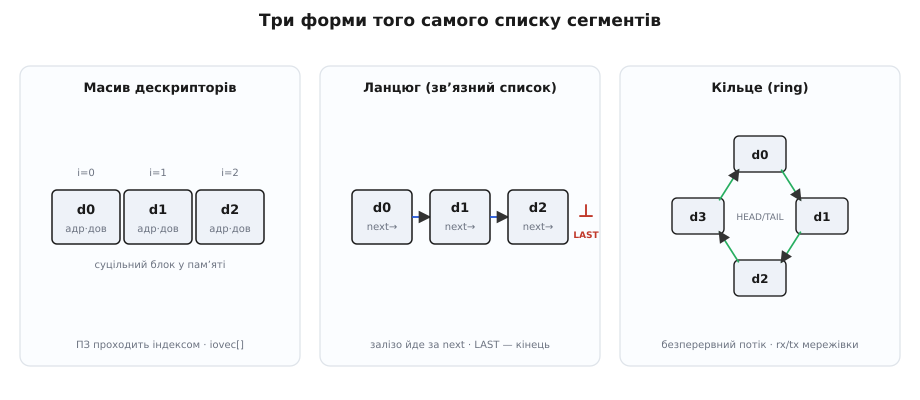
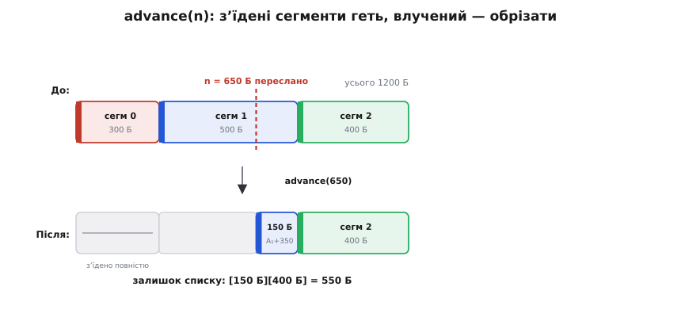

# Scatter-gather DMA

<preknowlist>
- [Віртуальна пам'ять](topic:programming/virtual-memory) — програма бачить суцільний адресний простір, а фізично він розкладений сторінками по RAM у довільному порядку.
- [DMA-контролер](topic:programming/dma-controller) — окремий рушій, що переганяє дані між пам'яттю й пристроєм, орудуючи фізичними адресами й не турбуючи процесор.
- [DMA-дескриптор](topic:programming/dma-channels) — один запис-завдання для рушія: звідки взяти, куди покласти, скільки байтів. Scatter-gather виростає саме з ланцюжка таких записів.
</preknowlist>

Уявімо звичайну сцену. Програма просить у системи мегабайт пам'яті під буфер — скажімо, під кадр із камери чи блок для запису на диск. У коді це один суцільний масив: покажчик на початок, довжина, і все, що між ними, лежить підряд. Так його бачить програма, і так їй зручно.

А тепер придивімося, де ці байти опинилися **насправді**. [Віртуальна пам'ять](topic:programming/virtual-memory) дала програмі ілюзію суцільності, але фізично вона нарізала буфер на сторінки по 4 кілобайти й розкидала їх по RAM де завгодно: одна сторінка тут, наступна — за десять мегабайтів звідси, третя — ще деінде, у проміжках чуже. Мегабайт — це до 256 таких клаптів, і жоден не зобов'язаний лежати поряд із сусідом за логікою буфера. Процесору байдуже: він ходить віртуальними адресами, а апаратний блок трансляції на льоту переводить кожне звертання у правильну фізичну сторінку.

Клопіт починається, коли цей буфер треба віддати **пристрою**. [DMA-контролер](topic:programming/dma-controller), мережева карта чи диск не ходять через таблицю сторінок процесора — вони орудують **фізичними** адресами напряму. Для них немає ніякого «суцільного мегабайта»: є 256 не пов'язаних між собою шматків, розсипаних по пам'яті. Виникає розрив: те, що для програми — один об'єкт, для заліза — жменя фрагментів. Як віддати рушієві логічно суцільний потік, якого фізично не існує?

### Три відповіді, і чому виграє третя

Перша спокуса — **зібрати все докупи копіюванням**. Виділити десь один по-справжньому суцільний фізичний блок, позносити в нього всі 256 клаптів, а тоді вже нацькувати DMA на цей акуратний блок. Працює, але руйнує саму мету. Копіювання мегабайта — це та сама марудна робота перекладання байтів, заради позбавлення від якої DMA й затівали. Ба більше, для запису доведеться копіювати двічі (у блок і назад), а знайти суцільний фізичний мегабайт у роздрібненій пам'яті часом просто ніде. Такий проміжний блок називають **буфером-відскоком** (*bounce buffer*), і вмикають його лише з розпачу — коли інакше ніяк.

Друга відповідь — апаратна: поставити між пристроєм і пам'яттю власний блок трансляції адрес, [**IOMMU**](topic:programming/iommu), який для пристрою робить те саме, що звичайний [MMU](topic:electronics/mmu) робить для процесора — показує розкидані сторінки як суцільний діапазон. Гарно, коли така апаратура є. Але на мікроконтролері, у простому контролері периферії чи в дешевій карті її немає, а розрив нікуди не дівається.

Третя відповідь — не зносити й не приховувати, а **описати**. Не чіпаємо жодного байта на місці. Натомість складаємо рушієві короткий список-маршрут: «логічний потік — це шматок за адресою A₀ завдовжки L₀, потім шматок за A₁ завдовжки L₁, потім за A₂…». Рушій іде цим списком і переганяє фрагмент за фрагментом, поводячись із їхньою склейкою як з одним неперервним потоком. Жодної зайвої копії: дані лишаються там, де лежать, а рухається лише крихітний опис.

Цей список — і є **scatter-gather список** (англ. *scatter* — розсіяти, *gather* — зібрати). Він увесь і є структура даних цієї теми.


*Один рівень непрямості замість копіювання. Ліворуч — буфер, яким його бачить програма: суцільний. Праворуч — фізична RAM: ті самі чотири фрагменти лежать розкидано й у зовсім іншому порядку, поміж чужими даними. Посередині — scatter-gather список: чотири записи (адреса · довжина), що йдуть у **логічному** порядку. Стрілки від списку до RAM перетинаються — саме в цьому вся суть: список несе логічну послідовність, хай як фізично перемішані сторінки.*

### Що це за структура

По суті це впорядкований список **сегментів**, де кожен сегмент — проста пара `(базова адреса, довжина)`. Один сегмент описує один суцільний фізичний клапоть; увесь список описує логічний буфер як їхню конкатенацію. Це рівно один рівень непрямості між «одним логічним потоком з N байтів» і «K фізичними фрагментами» — і вся сила прийому в цьому одному рівні.

[Окремий DMA-дескриптор](topic:programming/dma-channels) уже вміє сказати рушієві «перекинь L байтів з адреси A» — це один сегмент. Scatter-gather нічого нового не винаходить: він просто **зчіплює багато таких дескрипторів у список**, і рушій опрацьовує їх поспіль, як одне завдання. Тому scatter-gather DMA — це не окремий механізм, а дескриптор, доведений до списку.

> 🔧 **Навіщо це.** Саме на цьому списку тримається **zero-copy** — робота з даними без зайвого копіювання. Мережевий стек надсилає пакет, не склеюючи заголовок і корисне навантаження в один буфер: заголовок лежить в одному шматку пам'яті, тіло — в іншому (часто прямо в кеші застосунку), а scatter-gather список каже картці зібрати їх на льоту при відправці. Диск читає файл одразу в розкидані сторінки кешу сторінок, не проганяючи все через проміжний буфер. Скрізь, де дані перетинають межу «процесор ↔ пристрій», зайва копія — головний ворог пропускної здатності, і список сегментів — головна зброя проти неї.

### Дві сторони однієї медалі: gather і scatter

Назва склеєна з двох слів, бо список працює у двох напрямках, і напрям задає, котре з них доречне.

Коли дані течуть **із пам'яті до пристрою**, список працює на **збирання** (*gather*): рушій обходить розкидані фрагменти й зливає їх в один вихідний потік. Так відправляється мережевий пакет, склеєний із заголовка й тіла; так пишеться на диск буфер, нарізаний по сторінках.

Коли дані течуть **із пристрою в пам'ять**, список працює на **розсіювання** (*scatter*): один вхідний потік розкладається по розкиданих клаптях. Так прийнятий пакет лягає заголовком в один буфер, а тілом — одразу в буфер застосунку; так читання з диска розходиться по сторінках кешу.


*Той самий список, два напрямки. **Gather** (ліворуч): багато шматків пам'яті → один потік до пристрою (надсилання, `writev`). **Scatter** (праворуч): один потік від пристрою → багато шматків пам'яті (приймання, `readv`). Структура одна — різниться лише, куди спрямований рух.*

Ця симетрія — не випадковість, а сама причина, чому обидва слова стоять поряд у назві: список сегментів однаково добре описує і мету збирання, і мету розсіювання.

### Три форми того самого списку

Список сегментів живе фізично трьома способами, і вибір форми диктує, **хто** його обходить.

**Масив дескрипторів.** Найпростіше — покласти сегменти суцільним масивом і йти по ньому індексом. Так влаштований юніксовий `iovec`: масив структур `{ покажчик, довжина }`, який передають системному виклику. Обходить його **програма** (чи ядро) звичайним циклом. Кеш-дружній, простий, але фіксований на момент подачі.

**Ланцюг (зв'язний список).** Кожен дескриптор несе, крім адреси й довжини, **покажчик на наступний** (`next`) і кілька прапорців — зокрема «останній» (*LAST*). Тоді вже **саме залізо** йде за `next` від дескриптора до дескриптора, доки не впреться в прапорець кінця. Процесор один раз будує ланцюг у пам'яті, дає рушієві адресу першої ланки — і вивільняється. Це класична структура «зв'язний список», тільки вузлами якої ходить апаратний автомат, а не код.

**Кільце (*ring*).** Якщо зімкнути ланцюг у кільце й додати два покажчики — куди залізо дійшло й куди програма дописала нові завдання, — виходить [кільцевий буфер](topic:algorithms/ring-buffer) дескрипторів для **безперервного** потоку. Так влаштовані приймальне й передавальне кільця мережевої карти: драйвер доливає завдання з одного боку, карта вичерпує з іншого, і потік не спиняється.


*Одна структура — три втілення. **Масив**: програма проходить індексом (`iovec[]`). **Ланцюг**: залізо йде за `next` до прапорця LAST. **Кільце**: замкнений ланцюг із покажчиками голови й хвоста для нескінченного потоку. Форму диктує задача: разова передача — масив, апаратний обхід — ланцюг, безперервний потік — кільце.*

### Операції над списком

Оскільки перед нами структура даних, корисно глянути на неї як на абстрактний тип із набором операцій — і одна з них геть не очевидна.

**Сумарна довжина** — просто сума довжин сегментів, `O(K)` за кількістю сегментів. Скільки байтів несе весь список — питання одного проходу.

**Побудова зі суцільного буфера** — пройти віртуальний буфер сторінка за сторінкою й видати сегмент на кожен суцільний фізичний пробіг; якщо дві фізичні сторінки випадково лежать поряд, їх варто **злити** в один сегмент. Для буфера з B байтів і сторінки P кількість сегментів не перевищить `⌈B/P⌉ + 1` — по одному на сторінку, плюс можливі неповні краї.

Найцікавіша операція — **`advance(n)`: обрізати список після часткового пересилання**. Реальна передача рідко завершується рівно на межі сегмента: пристрій прийняв чи віддав `n` байтів, і `n` майже завжди влучає **всередину** якогось сегмента. Треба з рештою продовжити. Операція проста, але саме вона робить список придатним для потоку: викидаємо повністю з'їдені сегменти, а той, у який `n` влучив, **обрізаємо** — зсуваємо базу вперед і зменшуємо довжину.


*`advance(n)` на списку `[300][500][400]` після пересилання 650 байтів. Сегмент 0 (300 Б) з'їдено повністю — геть. У сегмент 1 `n` влучив на 350-му байті: база зсувається на +350, довжина стає 150. Сегмент 2 цілий. Залишок — `[150][400]` = 550 байтів. Це щоразу робить сокет, коли `send` віддав не все.*

Ось увесь список і `advance` реальним кодом. Код — системний, з фізичними адресами й на гарячому шляху вводу-виводу, тож природна мова тут — C:

```c
struct sg_seg { uintptr_t addr; size_t len; };   // сегмент: адреса + довжина

size_t sg_total(const struct sg_seg *v, int n) {  // сумарна довжина
    size_t s = 0;
    for (int i = 0; i < n; i++) s += v[i].len;     // O(n)
    return s;
}

// «зʼїсти» переслані bytes: повернути індекс першого несплаченого сегмента
int sg_advance(struct sg_seg *v, int n, size_t bytes) {
    int i = 0;
    while (i < n && bytes >= v[i].len) {            // цілі сегменти — геть
        bytes -= v[i].len;
        i++;
    }
    if (i < n && bytes > 0) {                       // влучений — обрізати
        v[i].addr += bytes;                         // база вперед
        v[i].len  -= bytes;                         // довжина менша
    }
    return i;                                       // звідси продовжити
}
```

`sg_advance` коштує `O(числа повністю з'їдених сегментів)` — не всього списку, а лише пройденої голови. [Робочий проєкт зі складнішими операціями](topic:algorithms/scatter-gather/proj-sglist-c.md) — злиття сусідніх сегментів, збиральне й розсіювальне копіювання як запасний шлях, обхід граничних випадків — розібрано окремо з аналізом складності.

### Коли список окупається, а коли ні

Прийом не безкоштовний: кожен сегмент — це дескриптор, який хтось мусить записати, а рушій — прочитати. Порахуймо, де межа.

**Приклад (коли scatter-gather виграє в буфера-відскоку).** Буфер 1 МБ, роздроблений на ~200 фізичних фрагментів.

```
буфер-відскок (bounce):
  копіювати 1 МБ у суцільний блок       ≈ 100 мкс  (пропускна ~10 ГБ/с)
  для читання — ще копіювати назад       ≈ 100 мкс
  разом марної роботи процесора          ≈ 200 мкс
  + треба знайти суцільний фізичний 1 МБ (у роздрібненій RAM — часто ніде)

scatter-gather:
  записати 200 дескрипторів × ~16 Б      = 3200 Б   ≈ одиниці мкс
  рушій обходить список сам, копій нема
  виграш                                 ≈ 200 мкс + зникає клопіт із суцільністю
```

Для великого роздробленого буфера список виграє з розгромом. Але терези хитнуться, щойно фрагменти стануть **дрібними**: 64 байти у двох клаптях. Тоді два дескриптори з їхнім набором (запис у пам'ять, вибірка рушієм, окремий стан автомата на кожен) можуть коштувати дорожче, ніж просто скопіювати ті 64 байти. Тому реальні стеки для крихітних сегментів або **зливають** їх, або взагалі падають на копіювання — межа між «описати» й «скопіювати» лежить там, де вартість зайвого дескриптора зрівнюється з вартістю зайвої копії.

### Одна структура під багатьма іменами

Варто впізнавати цей список у різних кутках системи — це щоразу він.

- **Системні виклики** `readv`/`writev` і масив `iovec` — той самий список сегментів на рівні файлового вводу-виводу.
- **Мережеві буфери** — ланцюги `mbuf` у BSD і `sk_buff` у Linux: пакет живе розкиданими фрагментами (заголовки окремо, тіло окремо) й ніколи не склеюється в один суцільний буфер без потреби.
- **Ядерний DMA** — `struct scatterlist` у Linux і шар DMA-відображення, що будує апаратні списки з віртуальних буферів.
- **Апаратні кільця дескрипторів** — у мережевих картах, у NVMe-накопичувачах (списки PRP/SGL), у графічних процесорах.

Скрізь одна й та сама думка: **логічний потік байтів, зібраний з розкиданих фрагментів через опис, а не копіювання**. Вона зринає всюди, де дані мусять перетнути межу, а копіювання на цій межі — розкіш. І думка ця стара: [той самий список сегментів жив ще в канальних програмах IBM System/360](topic:algorithms/scatter-gather/hist-scatter-gather-lineage.md), задовго до того, як став системним викликом Unix — структура виявилася настільки природною, що її незалежно перевідкривали з кожним новим поколінням заліза.

### Пастки

**Когерентність кеша.** Дані в розкиданих фрагментах можуть сидіти в кеші процесора, а DMA ходить повз кеш, прямо в RAM. Перед збиранням (пам'ять → пристрій) кожен фрагмент треба **скинути** з кеша в пам'ять; після розсіювання (пристрій → пам'ять) — **знедійснити** кешовані копії, щоб процесор не читав застаріле. І робити це доводиться **на кожен сегмент** окремо. Механізм і граблі детально розібрано у [когерентності кеша й DMA](topic:programming/cache-coherency-dma).

**Закріплення сторінок.** Поки рушій ходить фізичними адресами, система не має права ні витіснити ці сторінки у своп, ні пересунути їх. На час передачі їх **закріплюють** (*pinning*) — інакше фізична адреса в дескрипторі протухне посеред транзакції.

**Стеля на кількість сегментів.** Апаратні таблиці дескрипторів скінченні, а `iovec` обмежений системною сталою `IOV_MAX`. Надто роздроблений буфер доводиться або розбивати на кілька передач, або зливати сегменти.

**Вирівнювання.** Багато рушіїв вимагають, щоб база й довжина сегмента були кратні кільком байтам (чи цілій сторінці). Невирівняний хвіст — знову привід для копії.

---

Підсумок простий, а сягає далеко. Scatter-gather список — це один рівень непрямості: упорядкований набір пар `(адреса, довжина)`, що перетворює фізично розкидану пам'ять на логічно суцільний потік. Він живе трьома формами — масивом, зв'язним ланцюгом, кільцем, — читається у двох напрямках (gather при виході, scatter при вході), а його ключова операція `advance(n)` дає рано обривати й продовжувати потік. Ціна прийому — жменя дескрипторів; виграш — дані перетинають межу «процесор ↔ пристрій» через **опис**, а не через копію. Через це той самий список сегментів упізнається скрізь: від `readv` до кілець мережевої карти.
