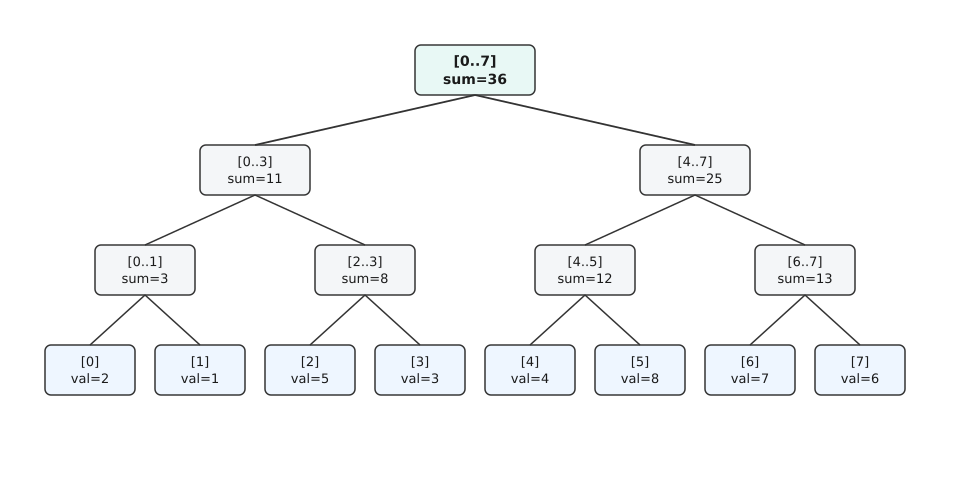
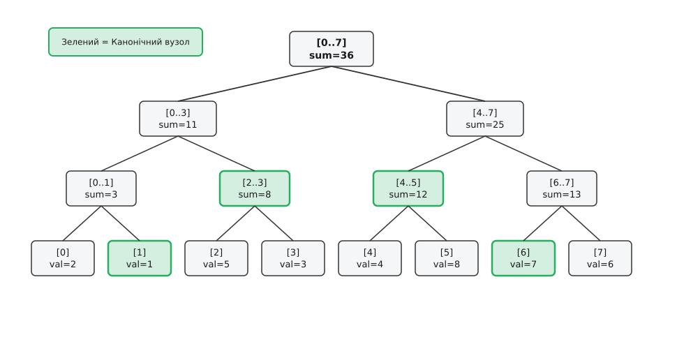
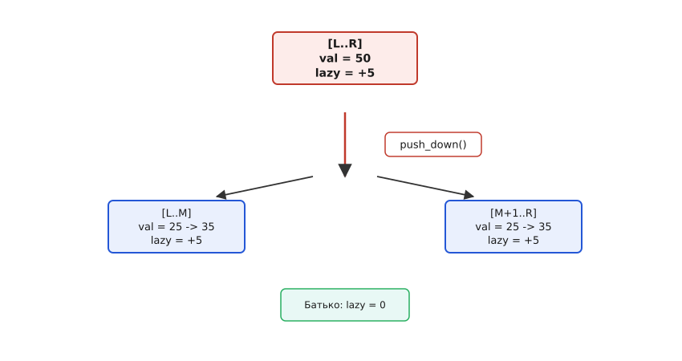

# Відрізкове дерево (Segment Tree)

<preknowlist>
- [Двійкове дерево](topic:algorithms/binary-tree) — ієрархічна структура даних, де кожен вузол має не більше двох дочірніх елементів.
- [Масив](topic:algorithms/array) — послідовна область пам'яті з константним доступом O(1) за індексом.
- [Дерево Фенвіка](topic:math/fenwick-tree) — компактна структура для динамічних префіксних сум.
</preknowlist>

Сервер телеметрії високонавантаженої біржової системи отримує 100 000 оновлень цін акцій на секунду і одночасно обробляє 100 000 запитів аналітиків щодо мінімальної ціни, максимуму або суми обсягів торгів за довільні проміжки часу. Якщо зберігати дані у звичайному масиві, точкова зміна ціни виконується за константний час `O(1)`, але обчислення мінімуму на відрізку довжиною `N = 10⁶` вимагає повного лінійного обходу за час `O(N)`. При 100 000 запитів це дає `10¹¹` операцій на секунду, що призводить до повного замикання обчислювального ядра. Натомість спроба використати масив префіксних сум робить запит суми константним `O(1)`, але будь-яке точкове оновлення змушує перераховувати весь масив за `O(N)`, створюючи аналогічний затик на операціях запису.

Ця фундаментальна дилема — вибір між швидкими змінами й повільним читанням або швидким читанням і повільними змінами — розв'язується за допомогою структури даних, відомої як відрізкове дерево (англ. *Segment Tree*, від латинського *segmentum* — відрізок, висічка). Вона забезпечує симетричну логарифмічну складність `O(log N)` як для операцій точкової чи інтервальної модифікації даних, так і для агрегатних запитів на довільних підінтервалах.

Повний історичний огляд винайдення цієї структури, її еволюції від геометричного алгоритму Джона Бентлі 1977 року до сучасного промислового застосування наведено у вставці [📜 Історія розвитку інтервальних дерев та алгоритмів моноїдного агрегування](topic:algorithms/segment-tree/hist-segment-tree.md).

## 1. Дилема динамічних інтервальних запитів

У комп'ютерній інженерії та аналізі даних часто виникає задача обслуговування динамічного масиву елементів `A[0..N-1]`, над яким виконуються дві фундаментальні операції:

1. **Модифікація (Update):** зміна значення елемента `A[i] = x` або масове оновлення значень на відрізку `A[i] = A[i] + v` для всіх `i ∈ [L, R]`.
2. **Агрегатний запит (Range Query):** обчислення узагальненої функції `f(A[L], A[L+1], ..., A[R])` на довільному неперервному підінтервалі `[L, R]`, де `f` може бути сумою, мінімумом, максимумом, найбільшим спільним дільником чи довільним алгебраїчним агрегатом.

Розглянемо три прості базові підходи та їх алгоритмічні обмеження:

### Підхід A. Неструктурований динамічний масив
Елементи зберігаються в звичайному масиві. Точкова зміна елемента виконується негайно за константний час `O(1)`. Проте для відповіді на запит агрегації на відрізку `[L, R]` алгоритм змушений послідовно ітеруватися по всіх `R - L + 1` елементах, що у найгіршому випадку вимагає `O(N)` операцій. При виконанні `M` запитів читання загальна складність досягає `O(M · N)`.

### Підхід B. Статичний масив префіксних сум
Для вхідного масиву `A` будується масив префіксних сум `P[i] = A[0] + A[1] + ... + A[i]`. Сума на довільному інтервалі `[L, R]` обчислюється як `P[R] - P[L-1]` за константний час `O(1)`. Проте будь-яка зміна одного елемента `A[i]` вимагає оновлення всіх префіксних сум `P[i], P[i+1], ..., P[N-1]`, що потребує `O(N)` операцій. При виконанні `K` оновлень загальна складність становить `O(K · N)`.

### Підхід C. Таблиця Sparse Table
Таблиця Sparse Table зберігає попередньо обчислені значення для всіх інтервалів довжиною `2ᵏ`. Вона забезпечує обчислення запиту мінімуму/максимуму за константний час `O(1)` з виділенням пам'яті `O(N log N)`. Проте Sparse Table є повністю статичною структурою даних: будь-яка модифікація елемента вимагає повного перебудування всієї таблиці за час `O(N log N)`.

| Структура даних | Складність оновлення | Складність запиту | Необхідна пам'ять | Можливість модифікацій |
| :--- | :--- | :--- | :--- | :--- |
| **Звичайний масив** | `O(1)` | `O(N)` | `N` | Висока |
| **Префіксні суми** | `O(N)` | `O(1)` | `N` | Низька (лише оборотні) |
| **Таблиця Sparse Table** | `O(N log N)` | `O(1)` | `N log N` | Відсутня (статична) |
| **Відрізкове дерево** | `O(log N)` | `O(log N)` | `4N` | Повна (дискретна та Lazy) |

Відрізкове дерево пропонує ідеальний збалансований компроміс: воно гарантує час `O(log N)` як для точкових й інтервальних оновлень, так і для будь-яких агрегатних запитів.

## 2. Концепція двійкового розбиття інтервалу

Ідея відрізкового дерева полягає в ієрархічному діленні дискретного інтервалу елементів навпіл за принципом «розділяй і володарюй» (англ. *divide and conquer*).

Нехай маємо послідовність із `N` елементів `A[0..N-1]`. Побудуємо над цим масивом повне двійкове дерево (лат. *binarius* — подвійний). Листки цього дерева зберігають окремі елементи вичаткового масиву `A[i]`, відповідаючи за одноелементні інтервали `[i, i]`. Кожен внутрішній вузол дерева відповідає за відрізок `[L, R]` і зберігає попередньо обчислене агреговане значення (суму, мінімум, максимум або іншу операцію) для всіх елементів `A[L..R]`.

Якщо внутрішній вузол покриває інтервал `[L, R]`, його середина обчислюється як `M = L + (R - L) / 2`. Його ліва дитина відповідає за ліву половину відрізка `[L, M]`, а права дитина — за праву половину `[M+1, R]`.


*Двійкове розбиття масиву на канонічні інтервали та агреговані значення вузлів.*

Як видно з діаграми, кожен рівень дерева утворює повне покриття вичаткового масиву, а висота дерева строго обмежена величиною `H = ⌈log₂ N⌉`. Саме ця логарифмічна висота визначає верхню межу кількості кроків для будь-яких операцій пошуку та модифікації.

## 3. Представлення у пам'яті: Від вказівників до плоского масиву

У класичному теоретичному описі деревні структури моделюються вузлами з динамічними вказівниками вида `Node* left, *right`. Проте на сучасній архітектурі процесорів використання вказівників у кучі супроводжується важкими системними витратами: фрагментацією пам'яті, додатковими 8 байтами на кожен вказівник та постійними промахами кеш-пам'яті (англ. *cache misses*).

Замість цього відрізкове дерево реалізують у формі некоординатного плоского масиву (англ. *flat array layout*), аналогічно до двійкової купи (Heap).

### 3.1. Схема індексації плоского масиву

Кожен вузол дерева отримує цілочисловий індекс `v` у суцільному масиві `tree[]`:
- Корінь дерева розміщується за індексом `v = 0` і покриває весь інтервал `[0, N-1]`.
- Для вузла з індексом `v` ліва дитина розташовується за адресою `2*v + 1`.
- Права дитина розташовується за адресою `2*v + 2`.
- Батьківський вузол за адресою `(v - 1) / 2`.

Завдяки такій обчислювальній індексації перехід між батьками й дітьми виконується за одну тактову операцію процесора без звернення до пам'яті за вказівником.

### 3.2. Розрахунок обсягу пам'яті `4N`

Якщо розмірність масиву `N` не є точним ступенем двійки, дерево на нижньому рівні має неповні відгалуження. Для безпечного розміщення всіх вузлів без ризику виходу за межі allocated пам'яті використовується масив розмірності `4N`.

Формальний доказ того, чому масив розміром `4N` гарантовано вміщує всі вузли двійкового дерева для довільного `N`, наведено у математичному матеріалі [🧮 Алгебраїчна теорія відрізкового дерева: моноїди, комбінаторика та інваріанти](topic:algorithms/segment-tree/math-segment-tree.md).

### 3.3. Апаратна кеш-локальність та SIMD-векторизація

Розміщення даних у суцільному масиві гарантує високу кеш-локальність (англ. *spatial locality*). Під час виконання операцій читання чи оновлення процесор завантажує в кеш L1/L2 цілу кеш-лінію (64 байти), яка містить одразу кілька сусідніх вузлів дерева.

Сучасні процесори з векторними розширеннями (AVX2, AVX-512, ARM Neon) здатні виконувати бінарні операції над сусідніми вузлами паралельно за один тактовий цикл, що забезпечує додаткове прискорення обчислень у 2–4 рази порівняно зі вказівниковою моделлю.

## 4. Ітеративне відрізкове дерево (Bottom-Up Segment Tree)

Хоча рекурсивний підхід зверху вниз (top-down) є найпоширенішим завдяки своїй наочності та гнучкості, для точкових оновлень існує більш компактна й швидка ітеративна альтернатива снизу вгору (bottom-up), відома як алгоритм Зерновкіна-Кротора.

### 4.1. Схема 1-індексації та масив розміром `2N`

В ітеративному дереві масив `tree` виділяється розмірністю рівно `2N`:
- Елементи вичаткового масиву `A[0..N-1]` копіюються в листки за адресами від `N` до `2N - 1`: `tree[N + i] = A[i]`.
- Внутрішні вузли займають позиції від `1` до `N - 1`. Корінь розташовується за індексом `1`.
- Для будь-якого вузла `i` його батько обчислюється як `i >> 1` (ділення на 2).
- Ліва дитина знаходиться за адресою `i << 1`, а права дитина за адресою `(i << 1) | 1`.

### 4.2. Алгоритм ітеративного запиту суми на відрізку `[l, r]`

Для обчислення суми на піввідкритому інтервалі `[l, r)` (де `l` та `r` зсунуті на `N`):

```
l += N
r += N
sum = 0

поки l < r:
    якщо l парне (l % 2 != 0):
        sum += tree[l]
        l++
    якщо r парне (r % 2 != 0):
        r--
        sum += tree[r]
    l >>= 1
    r >>= 1
```

Ітеративний підхід має дві ключові переваги:
1. **Зменшення пам'яті у 2 рази:** замість `4N` елементів використовується лише `2N`.
2. **Повна відсутність рекурсії:** обчислення виконуються в одному компактному циклі, що дає прискорення до 30–50% на мікроархітектурах процесорів із глибокими конвеєрами.

Проте для операцій із відкладеною пропогацією (lazy propagation) ітеративний підхід вимагає складного prošтовхування поміток зверху вниз перед початком циклу, тому для масових інтервальних оновлень зазвичай обирають рекурсивну схему.

## 5. Операція точкового оновлення (Point Update)

Точкове оновлення модифікує значення одного елемента `A[i] = new_val`. Оскільки значення елемента `A[i]` входить до агрегатів лише тих вузлів, які лежать на прямому шляху від листка `i` до кореня дерева, нам достатньо оновити тільки ці вузли.

### 5.1. Алгоритм точкового оновлення

1. Рекурсивний спуск починається з кореня `v = 0`, що відповідає інтервалу `[0, N-1]`.
2. На кожному кроці обчислюється середина `M = L + (R - L) / 2`. Якщо цільовий індекс `i <= M`, рекурсія повертає в ліву дитину `2*v + 1`. Інакше рекурсія повертає в праву дитину `2*v + 2`.
3. При досягненні листка (`L == R == i`) значення вузла оновлюється: `tree[v] = new_val`.
4. Під час зворотного ходу рекурсії (post-order traversal) значення кожного батьківського вузла перераховується на основі вже оновлених дочірніх вузлів:

```
tree[v] = tree[2*v + 1] ⊕ tree[2*v + 2]
```

### 5.2. Покроковий приклад точкового оновлення

Розглянемо вхідний масив із `N = 8` елементів: `A = [2, 1, 5, 3, 4, 8, 7, 6]`. Потрібно оновити значення за індексом `3` з `3` на `10`.

Траєкторія оновлення у відрізковому дереві:
- Корінь `[0..7]` (індекс `v = 0`): середина `M = 3`. Оскільки індекс оновлення `3 <= 3`, переходимо в ліву дитину `[0..3]` (індекс `v = 1`).
- Вузол `[0..3]` (`v = 1`): середина `M = 1`. Оскільки `3 > 1`, переходимо в праву дитину `[2..3]` (індекс `v = 4`).
- Вузол `[2..3]` (`v = 4`): середина `M = 2`. Оскільки `3 > 2`, переходимо в праву дитину `[3..3]` (індекс `v = 10`).
- Листок `[3..3]` (`v = 10`): встановлюємо нове значення `tree[10] = 10`.
- Зворотний хід рекурсії:
  - Вузол `[2..3]` (`v = 4`): `tree[4] = tree[9] + tree[10] = 5 + 10 = 15`.
  - Вузол `[0..3]` (`v = 1`): `tree[1] = tree[3] + tree[4] = 3 + 15 = 18`.
  - Корінь `[0..7]` (`v = 0`): `tree[0] = tree[1] + tree[2] = 18 + 25 = 43`.

Оскільки висота дерева дорівнює `⌈log₂ N⌉`, алгоритм відвідує рівно по одному вузлу на кожному рівні. Отже, часова складність точкового оновлення становить строго `O(log N)`.

## 6. Алгоритм інтервального запиту (Range Query)

Інтервальний запит `query(L, R)` повинен повернути результат агрегації елементів `A[L] ⊕ A[L+1] ⊕ ... ⊕ A[R]` для довільних `0 <= L <= R < N`.

Наївний підхід вимагав би проходу до всіх листків у діапазоні `[L, R]`. Проте відрізкове дерево використовує попередньо обчислені агрегати у внутрішніх вузлах. Запит спускається від кореня й розбиває інтервал `[L, R]` на мінімальну кількість канонічних підінтервалів.

### 6.1. Три випадки взаємного розташування інтервалів

Під час відвідування вузла `v`, який відповідає за інтервал `[tl, tr]`, відносно запиту `[l, r]` можливі три геометричні ситуації:

1. **Повне розходження (Disjoint):** інтервал вузла `[tl, tr]` взагалі не перетинається із запитом `[l, r]` (`tr < l` або `tl > r`). Алгоритм припиняє обхід цієї гілки й повертає нейтральний елемент моноїда `e` (наприклад, `0` для суми, `+∞` для мінімуму).
2. **Повне покриття (Full Containment):** інтервал вузла `[tl, tr]` повністю лежить всередині запиту `[l, r]` (`l <= tl` та `tr <= r`). Алгоритм негайно повертає вже збережене значення `tree[v]` без подальшого спуску до дітей.
3. **Частковий перетин (Partial Overlap):** інтервал вузла `[tl, tr]` частково перетинається із запитом `[l, r]`. Алгоритм ділить задачу навпіл, викликаючи рекурсію для лівого й правого дочірніх вузлів, і комбінує їх результати за допомогою бінарної операції `⊕`.


*Виділення канонічних вузлів для обчислення відповіді на відрізку за час O(log N).*

### 6.2. Покроковий приклад виконання запиту `query(1, 6)`

Розглянемо той самий масив `A = [2, 1, 5, 3, 4, 8, 7, 6]` і виконаймо запит суми на інтервалі `[1, 6]`.

- Корінь `[0..7]` (`v = 0`): частково перетинає `[1, 6]`. Ділимо навпіл: рекурсія у дитину `[0..3]` та дитину `[4..7]`.
- Вузол `[0..3]` (`v = 1`): частково перетинає `[1, 6]`. Рекурсія у `[0..1]` та `[2..3]`.
  - Вузол `[0..1]` (`v = 3`): частково перетинає `[1, 6]`. Рекурсія у `[0..0]` (розходження, повертає `0`) та `[1..1]` (повне покриття, повертає `1`). Результат `1`.
  - Вузол `[2..3]` (`v = 4`): повністю лежить всередині `[1, 6]` (`2 >= 1` та `3 <= 6`). Повертає збережене значення `sum = 8`.
- Вузол `[4..7]` (`v = 2`): частково перетинає `[1, 6]`. Рекурсія у `[4..5]` та `[6..7]`.
  - Вузол `[4..5]` (`v = 5`): повністю лежить всередині `[1, 6]`. Повертає збережене значення `sum = 12`.
  - Вузол `[6..7]` (`v = 6`): частково перетинає `[1, 6]`. Рекурсія у `[6..6]` (повне покриття, повертає `7`) та `[7..7]` (розходження, повертає `0`). Результат `7`.

Підсумкова сума обчислюється об'єднанням канонічних відповідей: `1 + 8 + 12 + 7 = 28`.

### 6.3. Доведення логарифмічної складності запиту

На кожному рівні дерева алгоритм може відвідати не більше 4 вузлів (з яких не більше 2 піддаються подальшому розгалуженню). Загальна кількість відвіданих вузлів не перевищує `4 ⌈log₂ N⌉`.

Таким чином, складність виконання інтервального запиту становить `O(log N)`, що робить обчислення практично миттєвим навіть для масивів із сотень мільйонів елементів.

## 7. Відкладена пропогація (Lazy Propagation) для масових оновлень

Якщо задача вимагає модифікувати не один елемент, а цілий діапазон `[L, R]` (наприклад, додати константу `V` до всіх елементів від `L` до `R`), застосування точкового оновлення для кожного елемента вимагатиме `O((R - L + 1) log N)`, що у найгіршому випадку перетворюється на `O(N log N)`.

Для збереження логарифмічної складності `O(log N)` застосовують механізм відкладеної пропогації (англ. *lazy propagation*, від латинського *propagare* — поширювати).

### 7.1. Принцип відкладеного виконання

Ідея полягає в тому, щоб не проштовхувати оновлення до самих листків негайно. Якщо під час модифікації `update_range(L, R, V)` вузол `v` повністю покривається інтервалом `[L, R]`, ми:
1. Модифікуємо збережене значення `tree[v]` з урахуванням кількості елементів у піддереві: `tree[v] += V * (tr - tl + 1)`.
2. Записуємо величину модифікації `V` у спеціальний масив відкладених поміток `lazy[v] += V`.
3. Негайно припиняємо рекурсивний спуск нижче цього вузла.

Помилка відкладеної модифікації залишається у вузлі `v` доти, доки майбутній запит читання чи оновлення не звернеться безпосередньо до дочірніх піддерев вузла `v`.


*Проштовхування відкладеної помітки lazy вниз до дочірніх вузлів при обході.*

### 7.2. Функція `push_down`

Перед тим як рекурсивна функція звертається до дітей вузла `v` (`2*v + 1` та `2*v + 2`), вона викликає процедуру проштовхування `push_down(v)`:
- Якщо `lazy[v] != 0`, помітка передається до масивів `lazy` лівої та правої дитини.
- Значення `tree` дочірніх вузлів перераховуються.
- Помітка `lazy[v]` у батьківському вузлі скидається в `0`.

Завдяки відкладеній пропогації інтервальне оновлення масиву дістає сувору оцінку складності `O(log N)`.

Повні програмні реалізації точкових та інтервальних оновлень мовами C та C++ з урахуванням вимог кеш-локальності та сучасних стандартів зведено у практичному посібнику [⚙️ Практична реалізація відрізкового дерева: від точкових запитів до відкладеної пропогації](topic:algorithms/segment-tree/proj-segment-tree.md).

## 8. Стиснення координат (Coordinate Compression)

При обробці геодезичних точок чи великих числових ключів діапазон значень елементів може сягати від `-10⁹` до `+10⁹`, тоді як реальна кількість унікальних точок `N` не перевищує `10⁵`.

Пряма побудова динамічного дерева для таких значень вимагає оверхеду вказівників. Техніка стиснення координат (англ. *Coordinate Compression*) дозволяє спростити задачу до класичного масиву:
1. Збираються всі унікальні координати точок та меж запитів.
2. Масив точок сортується та видаляються дублікати (`std::unique` в C++).
3. Кожна початкова координата `X` замінюється її 0-орієнтованим порядковим індексом у відсортованому масиві за допомогою двійкового пошуку (`std::lower_bound`).

Після стиснення координат простір ключів обмежується розміром `[0, N-1]`, що дозволяє побудувати класичне плоске відрізкове дерево на `4N` елементів із максимальною апаратною швидкістю.

## 9. Просунуті алгоритмічні патерни: Двійковий пошук по відрізковому дереву та Segment Tree Beats

Окрім класичних операцій читання та запису, відрізкове дерево є основою для двох високотехнологічних алгоритмічних патернів.

### 9.1. Двійковий пошук по відрізковому дереву (Tree Walk у `O(log N)`)

Припустимо, потрібно знайти першу позицію `i >= L` у масиві, для якої елемент `A[i] >= X`. Звичайний двійковий пошук із запитами `query(L, mid)` вимагав би `O(log² N)` часу.

Проте, спускаючись безпосередньо по вузлах відрізкового дерева (Tree Walk), ми знаходимо відповідну позицію за `O(log N)`:
1. У кожному вузлі дивимося на значення `max` у лівій дитині.
2. Якщо ліва дитина містить елемент `>= X` і її інтервал перетинається з `[L, N-1]`, ідемо в ліву дитину.
3. Інакше переходимо в праву дитину.

Цей патерн дозволяє ефективно розв'язувати задачі динамічного вибору ресурсів та моделювання черг обслуговування.

### 9.2. Метод Segment Tree Beats (Алгоритм Чжи Жуї)

У 2016 році китайський інформатик Чжи Жуї (Ji Ruyi) запропонував техніку Segment Tree Beats для виконання некомутативних інтервальних операцій, таких як `A[i] = min(A[i], X)` для всіх `i ∈ [L, R]`.

Замість збереження одного значення `max`, кожен вузол зберігає перший максимум `max1`, другий максимум `max2` та кількість перших максимумів `cnt`. Під час оновлення:
- Якщо `X >= max1`, оновлення взагалі не змінює інтервал.
- Якщо `max2 < X < max1`, оновлення змінює лише перші максимуми, що дозволяє застосувати lazy-помітку `lazy = X`.
- Якщо `X <= max2`, рекурсія продовжує спуск нижче.

Амортизована складність таких некомутативних інтервальних оновлень становить `O(log N)`.

## 10. Застосування відрізкового дерева на графах: Деревна декомпозиція (Heavy-Light Decomposition)

Відрізкове дерево функціонує не лише на одновимірних масивах. Завдяки техніці декомпозиції дерев воно стає ключовим обчислювальним компонентом для задач на довільних графах та деревах.

### 10.1. Сутність Heavy-Light Decomposition (HLD)

Нехай дано дерево з `N` вершин. Потрібно обробляти запити вигляду: додати число `V` до всіх вершин на шляху між вершинами `u` та `v`, або обчислити суму/мінімум на шляху `u -> v`.

Метод HLD декомпозує дерево на множину неперетинних просто лінійних шляхів (англ. *heavy paths*):
1. Для кожної вершини визначається «важке» ребро (англ. *heavy edge*), яке веде до піддерева з найбільшою кількістю вершин.
2. Сукупність важких ребер утворює набір лінійних ланцюгів.
3. Усі вершини дерева впорядковуються в один плоский масив за допомогою обходу в глибину (DFS), так що кожен важкий ланцюг займає суцільний неперервний відрізок у цьому масиві.

### 10.2. Агрегація шляхів через відрізкове дерево

Після побудови HLD довільний шлях між `u` та `v` складається з не більше ніж `log₂ N` суцільних відрізків у плоському масиві.

Побудувавши одне відрізкове дерево над плоским масивом HLD, ми обробляємо запит на шляху між `u` та `v` шляхом виконання `O(log N)` інтервальних запитів до відрізкового дерева. Загальна складність запиту на шляху в дереві становить `O(log² N)`.

## 11. Багатопотокова паралелізація побудови (Parallel Segment Tree Construction)

У великих аналітичних системах побудова відрізкового дерева над масивом із `N = 10⁸` елементів може ставати вузьким місцем. Оскільки ліве й праве піддерева кореня є повністю незалежними, побудова дерева ідеально паралелиться за допомогою стандарту OpenMP або пулу потоків (thread pool).

Алгоритм паралельної побудови:
- Якщо розмір підінтервалу `tr - tl + 1` перевищує поріг паралелізму `GRAIN_SIZE` (наприклад, 100 000 елементів), виклики побудови лівого й правого дітей виконуються в окремих паралельних задачах (`#pragma omp task`).
- Коли розмір підінтервалу стає меншим за `GRAIN_SIZE`, алгоритм переходить до послідовної побудови.

Завдяки паралелізації побудова дерева над 100 мільйонами елементів на 8-ядерному процесорі прискорюється в 6–7 разів, досягаючи складності `O(N / P)`, де `P` — кількість обчислювальних ядер.

## 12. Стиснення та персистентність для часових баз даних (Time-Series Databases)

У сучасних промислових рушіях обробки часових рядів (таких як TimescaleDB, InfluxDB, Prometheus) відрізкові дерева застосовуються для швидкої агрегації журналів подій (Event Logs) за довільні часові вікна.

Використання персистентного відрізкового дерева дозволяє підтримувати кілька паралельних версій системного журналу без дублювання даних. Кожен новий блок логів створює лише логарифмічну кількість нових вузлів, зберігаючи повну історію для часових запитів вида «знайти максимальне навантаження процесора між 14:00 та 14:30 у середу».

В умовах багатопотокового доступу атомарні операції C++20 (`std::atomic`) у поєднанні з бар'єрами релізу та аквізиції `std::memory_order_release` дозволяють читати версії персистентного дерева без блокування м'ютексами.

## 13. Узагальнення на алгебраїчні моноїди

Відрізкове дерево не прив'язане до арифметичної суми. Воно працює з будь-якою множиною елементів `S` та бінарною операцією `⊕`, яка утворює алгебраїчний моноїд (грец. *monas* — одиниця).

Моноїд вимагає виконання двох основних умов:
1. **Асоціативність:** `(a ⊕ b) ⊕ c = a ⊕ (b ⊕ c)`.
2. **Наявність нейтрального елемента `e`:** `a ⊕ e = e ⊕ a = a`.

Зверніть увагу: **комутативність (`a ⊕ b = b ⊕ a`) не вимагається!** Завдяки суворо впорядкованій структурі двійкового дерева некомутативні операції (такі як множення матриць або об'єднання строкових блоків) обчислюються абсолютно коректно, якщо дотримуватися порядку об'єднання «лівий результат ⊕ правий результат».

Детальний аналіз алгебраїчних вимог, доведення теорем та приклад застосування для алгоритму Кадане (максимальний підмасив) винесено у математичну вставку [🧮 Алгебраїчна теорія відрізкового дерева: моноїди, комбінаторика та інваріанти](topic:algorithms/segment-tree/math-segment-tree.md).

## 14. Динамічні та персистентні розширення

Класичне відрізкове дерево будується над статичним діапазоном пам'яті. Проте у складних інженерних задачах застосовують три просунуті модифікації структури.

### 14.1. Динамічне (Неявне) відрізкове дерево (Sparse Segment Tree)

Якщо індекси елементів лежать у величезному діапазоні (наприклад, `0 <= i <= 10⁹`), побудувати плоский масив на `4N` елементів неможливо через брак оперативної пам'яті.

У динамічному відрізковому дереві вузли не створюються заздалегідь. Початково існує лише корінь `[0, 10⁹]`. Нові вузли створюються динамічно в пам'яті (за допомогою вказівників) лише тоді, коли точкове оновлення або запит відвідує відповідну гілку.

Просторова складність динамічного дерева становить `O(Q log N)`, де `Q` — кількість виконаних операцій оновлення. Це дозволяє працювати з інтервалами до `10¹⁸` при мінімальних витратах пам'яті.

### 14.2. Персистентне відрізкове дерево (Persistent Segment Tree)

Персистентна структура даних (від латинського *persistere* — залишатися, тривати) дозволяє звертатися до будь-якої попередньої версії масиву після виконання серії модифікацій.

Замість перезапису значень у вузлах, точкове оновлення використовує метод копіювання шляху (англ. *path copying*):
1. Створюється новий корінь для версії `t`.
2. Усі вузли на шляху від кореня до зміненого листка копіюються (`log₂ N` нових вузлів).
3. Вказівники на незмінні дочірні піддерева спрямовуються на вузли попередньої версії `t-1`.

Персистентне відрізкове дерево зберігає нову версію масиву за час `O(log N)` та вимагає лише `O(log N)` додаткової пам'яті на кожне оновлення. Це є основою алгоритмів розв'язання задачі про k-у порядкову статистику на довільному відрізку (алгоритм Катайми).

### 14.3. Двовимірне відрізкове дерево (2D Segment Tree)

У двовимірному просторі для матриці розміром `N × M` відрізкове дерево будується за принципом «дерево відрізкових дерев» (англ. *tree of segment trees*).

Зовнішнє відрізкове дерево відповідає за декомпозицію рядків `[R1, R2]`, а кожен його вузол сам є повноцінним внутрішнім відрізковим деревом, побудованим над стовпчиками `[C1, C2]`. Двовимірний прямокутний запит сум чи мінімуму обчислюється за час `O(log N · log M)` з витратами пам'яті `16 N M` вузлів.

## 15. Системне порівняння з альтернативними структурами даних

Вибір інструменту для інтервальних запитів залежить від характеру операцій, вимог до пам'яті та можливості модифікації даних.

| Структура даних | Складність запиту | Складність оновлення | Витрати пам'яті | Підтримувані операції |
| :--- | :--- | :--- | :--- | :--- |
| **Звичайний масив** | `O(N)` | `O(1)` | `N` | Довільні |
| **Префіксні суми** | `O(1)` | `O(N)` | `N` | Лише оборотні |
| **Таблиця Sparse Table**| `O(1)` | Немає (статична) | `N log N` | Ідемпотентні (Min/Max/GCD) |
| **Дерево Фенвіка (BIT)**| `O(log N)` | `O(log N)` | `N` | Лише оборотні моноїди |
| **Відрізкове дерево** | `O(log N)` | `O(log N)` | `4N` | Довільні моноїди + Lazy Update |
| **Splay Tree / Treap** | `O(log N)` | `O(log N)` | `O(N)` | Динамічні зміни довжини масиву |

Повну специфікацію програмних інтерфейсів, параметрів функцій та контрактів надійності винесено у системний довідник [📋 Специфікація інтерфейсу та системний контракт Відрізкового Дерева](topic:algorithms/segment-tree/api-segment-tree.md).

> 🔧 **Навіщо це в реальній розробці.**
> 1. **Геоінформаційні системи (GIS):** швидке визначення сумарної кількості об'єктів у прямокутній області карти за допомогою 2D відрізкових дерев або алгоритму замітаючої лінії (Sweep-Line Algorithm).
> 2. **Аналітика часових рядів (Time-Series DB):** швидке обчислення ковзних агрегатів (Min/Max/Sum) у потоках телеметрії без повторного перерахунку всього вікна.
> 3. **Системи версіонування та компілятори:** персистентне відрізкове дерево використовується в оптимізувальних компіляторах для аналізу потоків даних (Data-Flow Analysis) та збереження станів таблиць символів.
> 4. **Комп'ютерна графіка та ігрові рушії:** ієрархічні структури на основі відрізкових дерев виконують швидке відсікання невидимих об'єктів (Occlusion Culling) та виявлення колізій між фізичними тілами.
