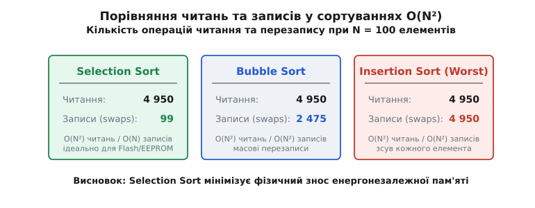

# 🧮 Математичний аналіз сортування вибором

Математична краса та строгість сортування вибором (Selection Sort) полягає в його повній детермінованості за кількістю порівнянь і суворо обмеженій кількості перезаписів пам'яті. У той час як більшість інших алгоритмів сортування адаптують свою поведінку залежно від початкового порядку елементів, сортування вибором виконує фіксовану кількість порівнянь незалежно від того, чи є вхідний масив вже впорядкованим, випадковим або відсортованим у зворотному порядку.

Цей розділ містить строгі математичні виведення складності, аналіз сподіваної кількості оновлень індексу мінімуму через гармонічні числа, доведення інваріантів циклу за допомогою математичної індукції, а також математичний розрахунок зменшення кількості порівнянь у двосторонній модифікації (Min-Max Selection Sort).

## 1. Точний підрахунок кількості порівнянь

Нехай масив `A` містить `N` елементів з індексами від `0` до `N - 1`. На кожній зовнішній ітерації `i` (де `i` змінюється від `0` до `N - 2`) алгоритм шукає мінімальний елемент у невідсортованому суфіксі `A[i...N-1]`.

Для фіксованого `i` внутрішній цикл порівнює елемент `A[j]` з поточним мінімумом для кожного `j` від `i + 1` до `N - 1`. Кількість порівнянь на ітерації `i` дорівнює точно `N - 1 - i`.

Загальна кількість порівнянь `C(N)` є сумою арифметичної прогресії по всіх `N - 1` проходах:

```
C(N)
= (N - 1) + (N - 2) + (N - 3) + ... + 2 + 1     [сума порівнянь по всіх ітераціях i]
= Σ_{i=0}^{N-2} (N - 1 - i)                      [запис через знак суми]
= N · (N - 1) / 2                                [формула суми арифметичної прогресії]
= (N² - N) / 2                                   [розкриття дужок]
```

Звідси випливає точна оцінка асимптотичної складності за кількістю порівнянь:

```
C(N) = 1/2 · N² - 1/2 · N = Θ(N²)
```

Важливий математичний висновок з цього виведення полягає в тому, що всі три класи складності збігаються:
- **Найкращий випадок (Best Case):** `C_{best}(N) = (N² - N) / 2`
- **Середній випадок (Average Case):** `C_{avg}(N) = (N² - N) / 2`
- **Найгірший випадок (Worst Case):** `C_{worst}(N) = (N² - N) / 2`

Кількість порівнянь є константним поліномом другого степеня і не залежить від перестановок вхідних даних.

## 2. Аналіз кількості обмінів (Swaps) та оновлень індексу

Кожна зовнішня ітерація `i` завершується не більше ніж одним обміном елемента `A[i]` з елементом `A[min_idx]`.

Загальна кількість обмінів `S(N)` задовільняє нерівність:

```
S(N) ≤ N - 1
```

Якщо додати перевірку `if (min_idx != i)` перед обміном, то у випадку, коли елемент вже стоїть на своєму місці, обмін не виконується взагалі. Це означає, що у найкращому випадку (коли масив відсортований) кількість обмінів дорівнює нулю: `S_{best}(N) = 0`. У найгіршому випадку робиться точно `N - 1` обмінів.

### Математичне сподівання кількості оновлень мінімуму

Хоча кількість обмінів елементів у масиві не перевищує `N - 1`, локальна змінна `min_idx` під час лінійного сканування суфіксу може оновлюватися декілька разів у регістрі процесора.

Розглянемо випадкову перестановку `N` унікальних елементів. На ітерації `i` розглядається суфікс довжиною `k = N - i`. Змінна `min_idx` оновлюється кожного разу, коли зустрічається елемент, менший за всі попередньо розглянуті в цьому суфіксі.

У випадковій перестановці елемент на позиції `j` у суфіксі є мінімумом серед перших `j` елементів із ймовірністю `1 / j`.

Отже, сподівана кількість оновлень `U(k)` у суфіксі довжиною `k` становить:

```
E[U(k)]
= Σ_{j=1}^{k} (1 / j)                            [сума ймовірностей знаходження нового мінімуму]
= H_k                                            [k-те гармонічне число]
```

Загальна сподівана кількість оновлень змінної `min_idx` по всіх `N - 1` ітераціях дорівнює:

```
E[U_{total}(N)]
= Σ_{k=2}^{N} H_k                                [сума гармонічних чисел]
= Σ_{k=2}^{N} Σ_{j=1}^{k} (1 / j)               [розкриття за означенням]
= (N + 1) · H_N - 2 · N                         [точна закрита формула суми]
≈ N · ln(N) + (γ - 1) · N                        [асимптотичне наближення, γ ≈ 0.577215]
```

Звідси випливає, що в середньому змінна `min_idx` оновлюється `Θ(N log N)` разів у реєстрі процесора, проте фізичних записів у пам'ять (операцій `swap`) робиться не більше `N - 1`.


*Порівняння кількості операцій читання та перезапису пам'яті для сортування вибором, бульбашкою та вставками при N = 100.*

## 3. Математичне доведення інваріанта циклу

Для доведення коректності сортування вибором використаємо метод математичної індукції за допомогою інваріанта циклу.

### Інваріант зовнішнього циклу
Перед початком кожної ітерації `i` (де `0 ≤ i ≤ N - 1`) виконуються дві умови:
1. Підмасив `A[0...i-1]` містить `i` найменших елементів вхідного масиву, впорядкованих за незменшенням (`A[0] ≤ A[1] ≤ ... ≤ A[i-1]`).
2. Кожен елемент відсортованого префіксу `A[0...i-1]` не перевищує будь-якого елемента з невідсортованого суфіксу `A[i...N-1]`.

```
∀ k ∈ [0, i-1], ∀ m ∈ [i, N-1] : A[k] ≤ A[m]
```

### Кроки доведення:

1. **Ініціалізація (база індукції):**
   При `i = 0` префікс `A[0...-1]` є порожнім. Умова 1 і Умова 2 виконуються тривіально, оскільки порожній підмасив є впорядкованим, а відношення порожньої множини до решти елементів є істинним.

2. **Збереження (індукційний крок):**
   Припустимо, інваріант виконується перед ітерацією `i`. Внутрішній цикл знаходить індекс `min_idx` такий, що `A[min_idx]` є найменшим елементом у суфіксі `A[i...N-1]`:

   ```
   A[min_idx] = min { A[j] | i ≤ j ≤ N - 1 }
   ```

   Після обміну `A[i]` та `A[min_idx]`:
   - Новий елемент `A[i]` є найменшим серед усіх елементів `A[i...N-1]`.
   - Зважаючи на індукційне припущення, елементи `A[0...i-1]` вже були не більшими за всі елементи `A[i...N-1]`. Оскільки `A[i]` взято з `A[i...N-1]`, отримуємо `A[i-1] ≤ A[i]`.
   - Таким чином, префікс `A[0...i]` містить `i + 1` найменших елементів у впорядкованому стані.
   - Збільшення `i` на `1` зберігає інваріант для наступної ітерації.

3. **Завершення:**
   Цикл завершується, коли `i = N - 1`. За інваріантом, підмасив `A[0...N-2]` містить `N - 1` найменших елементів масиву у впорядкованому вигляді. Єдиний залишковий елемент `A[N-1]` є найбільшим або дорівнює `A[N-2]`.
   Отже, увесь масив `A[0...N-1]` є повністю відсортованим. `Q.E.D.`

## 4. Математика двостороннього вибору (Min-Max Selection Sort)

Двостороннє сортування вибором шукає одночасно мінімум і максимум у невідсортованому суфіксі на кожному кроці.

Нехай межі невідсортованої зони визначені індексами `left` та `right` (початково `left = 0`, `right = N - 1`). На кожному проході елементи порівнюються парами, що дозволяє знайти мінімум і максимум за 3 порівняння на кожні 2 елементи замість 4.

Загальна кількість порівнянь обчислюється як:

```
C_{double}(N)
= Σ_{k=1}^{N/2} (3/2 · (N - 2k))                 [попарне порівняння елементів суфіксу]
= 3/4 · N² - O(N)                                [сумування та розкладання]
```

Кількість порівнянь зменшується з `0.5 · N²` до `0.375 · N²`, що дає теоретичну економію обчислень приблизно на `25%` порівняно з одностороннім вибором, хоча асимптотичний клас залишається `Θ(N²)`.

## 5. Доведення нестійкості прямого сортування вибором

Алгоритм називається **стійким** (stable), якщо він зберігає відносний порядок елементів із однаковими ключами.

Доведемо нестійкість прямого сортування вибором контрприкладом.

Розглянемо масив із 3 елементів, де ключ подано числом, а початковий індекс — літерою у верхньому індексі:

```
A = [ 2ᵃ, 2ᵇ, 1ᶜ ]
```

Простежимо виконання кроків сортування вибором:

```
[2ᵃ, 2ᵇ, 1ᶜ]
= [1ᶜ, 2ᵇ, 2ᵃ]     [ітерація i=0: min=1ᶜ (idx 2); swap A[0] ⇄ A[2]]
= [1ᶜ, 2ᵇ, 2ᵃ]     [ітерація i=1: min=2ᵇ (idx 1); swap A[1] ⇄ A[1]]
```

Підсумковий стан масиву: `[1ᶜ, 2ᵇ, 2ᵃ]`.

У початковому масиві елемент `2ᵃ` передував елементу `2ᵇ` (`a < b`). У відсортованому масиві елемент `2ᵇ` опинився раніше за `2ᵃ`. Відносний порядок однакових ключів порушено.

Отже, пряме сортування вибором із дистанційним обміном `swap` є **нестійким** алгоритмом. `Q.E.D.`

## 6. Математична ціна стійкої модифікації (Stable Selection Sort)

Щоб зробити сортування вибором стійким, замість обміну елементів `swap(A[i], A[min_idx])` застосовують зсув підмасиву `A[i...min_idx]` праворуч на 1 позицію та вставку `A[min_idx]` на позицію `i`.

Підрахуємо кількість операцій запису у пам'ять для цієї модифікації:
У найгіршому випадку (коли мінімум кожного суфіксу знаходиться на самому кінці) кількість зсувів на ітерації `i` дорівнює `N - 1 - i`.

Загальна кількість записів у пам'ять `W_{stable}(N)` становить:

```
W_{stable}(N)
= Σ_{i=0}^{N-2} (N - 1 - i + 1)                 [зсув елементів + 1 вставка]
= (N² - N) / 2 + (N - 1)                        [сумування]
= (N² + N - 2) / 2 = Θ(N²)                      [квадратична кількість записів]
```

Таким чином, математичний аналіз доводить фундаментальний трейд-офф: збереження стійкості у сортуванні вибором перетворює кількість операцій запису з лінійної `O(N)` на квадратичну `Θ(N²)`, руйнуючи головну інженерну перевагу цього алгоритму.
