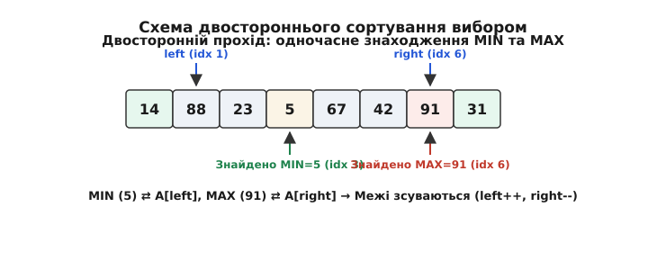

# ⚙️ Практична реалізація сортування вибором мовами C та C++

Практичне застосування сортування вибором (Selection Sort) охоплює розробку системного ПЗ, систем точного часу (Real-Time Systems), прошивок мікроконтролерів (Embedded C/C++) та модулів обробки даних у пам'яті з обмеженим ресурсом запису (Flash/EEPROM).

Ця вставка містить повністю працездатні, ідіоматичні реалізації сортування вибором мовами C та C++. Ми детально розглянемо класичний алгоритм для базових типів даних, універсальну реалізацію через покажчики `void*` та функції-компаратори, двостороннє сортування (Min-Max Selection Sort), стійку модифікацію (Stable Selection Sort) зі зсувом елементів, а також проведемо вимірювання операцій запису пам'яті за допомогою спеціального інженерного бенчмарку.

## 1. Класичне сортування вибором

Основна ідея реалізації — двошаровий цикл: зовнішній цикл переміщує ліву межу невідсортованої зони, а внутрішній цикл шукає індекс мінімального елемента.

У C-версії ми реалізуємо як прямий варіант для масивів цілих чисел `int`, так і універсальний варіант `selection_sort_generic`, який аналогічно стандартній функції POSIX `qsort` приймає вказівник `void *base`, кількість елементів `num`, розмір одного елемента `size` у байтах та функцію-компаратор `cmp`. Зверніть увагу на важливу перевірку `if (min_idx != i)` перед виконанням обміну: вона запобігає зайвим операціям запису в пам'ять, коли найменший елемент невідсортованої частини вже стоїть на поточній позиції.

У C++ версії ми використовуємо сучасні стандарти (C++20), зокрема діапазонний перегляд `std::span<T>`, концепт `std::totally_ordered`, функтор `std::less<T>` за замовчуванням та специфікатор `noexcept` з перевіркою безпеки винятків для типу `T`. Також надається перевантаження для довільних ітераторів прямого доступу (`RandomAccessIterator`), що дозволяє сортувати `std::vector`, `std::array` чи сирі масиви.

:::tabs
```c
#include <stddef.h>
#include <stdbool.h>

/*
 * Класичне сортування вибором для масиву цілих чисел.
 * Не виконує фізичний swap, якщо мінімум вже стоїть на поточній позиції.
 */
void selection_sort_int(int *arr, size_t n) {
    if (arr == NULL || n < 2) {
        return;
    }

    for (size_t i = 0; i < n - 1; ++i) {
        size_t min_idx = i;

        for (size_t j = i + 1; j < n; ++j) {
            if (arr[j] < arr[min_idx]) {
                min_idx = j;
            }
        }

        if (min_idx != i) {
            int temp = arr[i];
            arr[i] = arr[min_idx];
            arr[min_idx] = temp;
        }
    }
}

/*
 * Універсальне сортування вибором для довільного типу даних через void* та компаратор.
 */
typedef int (*comparator_t)(const void *, const void *);

void selection_sort_generic(void *base, size_t num, size_t size, comparator_t cmp) {
    if (base == NULL || num < 2 || size == 0 || cmp == NULL) {
        return;
    }

    char *bytes = (char *)base;

    for (size_t i = 0; i < num - 1; ++i) {
        size_t min_idx = i;

        for (size_t j = i + 1; j < num; ++j) {
            void *elem_j = bytes + (j * size);
            void *elem_min = bytes + (min_idx * size);

            if (cmp(elem_j, elem_min) < 0) {
                min_idx = j;
            }
        }

        if (min_idx != i) {
            char *p1 = bytes + (i * size);
            char *p2 = bytes + (min_idx * size);

            for (size_t k = 0; k < size; ++k) {
                char tmp = p1[k];
                p1[k] = p2[k];
                p2[k] = tmp;
            }
        }
    }
}
```
```cpp
#include <span>
#include <utility>
#include <functional>
#include <concepts>

namespace algo {

/**
 * Ідіоматична C++20 реалізація сортування вибором для std::span.
 * Працює з довільними типами даних, що задовільняють концепт std::totally_ordered.
 */
template <typename T, typename Compare = std::less<T>>
void selection_sort(std::span<T> data, Compare comp = Compare{}) noexcept(
    noexcept(comp(data[0], data[0])) && std::is_nothrow_move_assignable_v<T>) 
{
    if (data.size() < 2) {
        return;
    }

    const size_t n = data.size();
    for (size_t i = 0; i < n - 1; ++i) {
        size_t min_idx = i;

        for (size_t j = i + 1; j < n; ++j) {
            if (comp(data[j], data[min_idx])) {
                min_idx = j;
            }
        }

        if (min_idx != i) {
            using std::swap;
            swap(data[i], data[min_idx]);
        }
    }
}

/**
 * Перевантаження для ітераторів довільного доступу (RandomAccessIterator).
 */
template <typename RandomIt, typename Compare = std::less<>>
void selection_sort(RandomIt first, RandomIt last, Compare comp = Compare{}) {
    if (first == last) return;

    for (auto it = first; it != last - 1; ++it) {
        auto min_it = it;
        for (auto curr = it + 1; curr != last; ++curr) {
            if (comp(*curr, *min_it)) {
                min_it = curr;
            }
        }

        if (min_it != it) {
            std::iter_swap(it, min_it);
        }
    }
}

} // namespace algo
```
:::

Детальний покроковий аналіз реалізації на мові C:
1. Перевірка входів `if (arr == NULL || n < 2)` виконує захисну обробку крайових умов. Порожні масиви або масиви з одного елемента вже є впорядкованими.
2. Зовнішній цикл `for (size_t i = 0; i < n - 1; ++i)` розширює відсортовану зону. Локальна змінна `min_idx` зберігає індекс найменшого знайденого елемента.
3. Внутрішній цикл `for (size_t j = i + 1; j < n; ++j)` послідовно порівнює елементи `arr[j]` із поточним мінімумом `arr[min_idx]`.
4. Блок обміну `if (min_idx != i)` виконує перестановку двох елементів через тимчасову змінну `temp` на стеку. Перевірка уможливлює уникнення самостійного обміну, що заощаджує 2 записи у пам'ять.

Детальний аналіз реалізації на мові C++:
1. Параметр `std::span<T> data` надає безпечний та неволодіючий перегляд неперервного масиву. Це позбавляє необхідності передавати покажчик і розмір як два окремі параметри.
2. Предикат `Compare comp` дозволяє налаштовувати порядок сортування (наприклад, `std::greater<int>` для сортування за спаданням).
3. Директива `using std::swap; swap(data[i], data[min_idx]);` забезпечує використання техніки ADL (Argument-Dependent Lookup): якщо для типу `T` реалізовано специфічний метод `swap`, компілятор обере його замість універсального `std::swap`.

## 2. Двостороннє сортування вибором (Min-Max Selection Sort)

Двосторонній алгоритм знаходить мінімальний і максимальний елементи за один прохід по невідсортованій зоні, зменшуючи кількість ітерацій зовнішнього циклу вдвічі.


*Схема двостороннього вибору: одночасне знаходження мінімуму та максимуму зі зсувом двох меж left та right.*

Розбір критичної пастки (edge case) двостороннього вибору:
Під час виконання двох обмінів на одному проході існує небезпека зіпсувати дані. Якщо максимальний елемент знаходиться на початковій позиції `left`, то під час першого обміну (коли мінімум `min_idx` переміщується на позицію `left`) елемент-максимум фізично переміщується на позицію `min_idx`. Якщо після цього виконати другий обмін за застарілим індексом `max_idx`, на праву межу `right` буде відправлено не максимум, а раніше переміщений мінімум!
Щоб запобігти цій помилці, додано явну перевірку: `if (max_idx == left) max_idx = min_idx;`.

:::tabs
```c
#include <stddef.h>

void double_selection_sort(int *arr, size_t n) {
    if (arr == NULL || n < 2) {
        return;
    }

    size_t left = 0;
    size_t right = n - 1;

    while (left < right) {
        size_t min_idx = left;
        size_t max_idx = left;

        for (size_t i = left; i <= right; ++i) {
            if (arr[i] < arr[min_idx]) {
                min_idx = i;
            }
            if (arr[i] > arr[max_idx]) {
                max_idx = i;
            }
        }

        /* Обмін мінімуму з лівою межею */
        if (min_idx != left) {
            int temp = arr[left];
            arr[left] = arr[min_idx];
            arr[min_idx] = temp;
        }

        /* Пастка: якщо максимум був на позиції left, він перемістився на min_idx */
        if (max_idx == left) {
            max_idx = min_idx;
        }

        /* Обмін максимуму з правою межею */
        if (max_idx != right) {
            int temp = arr[right];
            arr[right] = arr[max_idx];
            arr[max_idx] = temp;
        }

        left++;
        right--;
    }
}
```
```cpp
#include <span>
#include <utility>
#include <functional>

namespace algo {

template <typename T, typename Compare = std::less<T>>
void double_selection_sort(std::span<T> data, Compare comp = Compare{}) {
    if (data.size() < 2) return;

    size_t left = 0;
    size_t right = data.size() - 1;

    while (left < right) {
        size_t min_idx = left;
        size_t max_idx = left;

        for (size_t i = left; i <= right; ++i) {
            if (comp(data[i], data[min_idx])) {
                min_idx = i;
            }
            if (comp(data[max_idx], data[i])) {
                max_idx = i;
            }
        }

        if (min_idx != left) {
            std::swap(data[left], data[min_idx]);
        }

        /* Пастка: якщо максимум був на позиції left, його значення зсунулося на min_idx */
        if (max_idx == left) {
            max_idx = min_idx;
        }

        if (max_idx != right) {
            std::swap(data[right], data[max_idx]);
        }

        left++;
        right--;
    }
}

} // namespace algo
```
:::

Детальний текстовий розбір алгоритму Min-Max:
1. Цикл `while (left < right)` звужує межі невідсортованої частини масиву з двох боків одночасно.
2. Внутрішній цикл оглядає всі елементи від `left` до `right` і шукає відразу два індекси: `min_idx` та `max_idx`.
3. Корекція `if (max_idx == left) max_idx = min_idx;` є критично важливою для коректності. Без неї сортування дублюватиме значення на краях.

## 3. Стійке сортування вибором (Stable Selection Sort)

Прямий обмін `swap(A[i], A[min_idx])` є джерелом нестійкості. Щоб зробити сортування вибором стійким, замість обміну елементів виконується зсув елементів масиву вправо на одну позицію від `i` до `min_idx - 1`, а `A[min_idx]` вставляється на позицію `i`.

У C++ реалізації для виконання зсуву використовується стандартний алгоритм `std::rotate`, який повертає елементи підмасиву без виділення додаткової пам'яті.

:::tabs
```c
#include <stddef.h>

/*
 * Стійке сортування вибором (замість swap виконується зсув елементів).
 * Зберігає відносний порядок однакових елементів.
 */
void stable_selection_sort(int *arr, size_t n) {
    if (arr == NULL || n < 2) {
        return;
    }

    for (size_t i = 0; i < n - 1; ++i) {
        size_t min_idx = i;

        for (size_t j = i + 1; j < n; ++j) {
            if (arr[j] < arr[min_idx]) {
                min_idx = j;
            }
        }

        if (min_idx != i) {
            int key = arr[min_idx];
            for (size_t k = min_idx; k > i; --k) {
                arr[k] = arr[k - 1];
            }
            arr[i] = key;
        }
    }
}
```
```cpp
#include <span>
#include <algorithm>
#include <functional>

namespace algo {

/**
 * Стійке сортування вибором мовою C++.
 * Використовує std::rotate для зсуву елементів без порушення стійкості.
 */
template <typename T, typename Compare = std::less<T>>
void stable_selection_sort(std::span<T> data, Compare comp = Compare{}) {
    if (data.size() < 2) return;

    const size_t n = data.size();
    for (size_t i = 0; i < n - 1; ++i) {
        size_t min_idx = i;

        for (size_t j = i + 1; j < n; ++j) {
            if (comp(data[j], data[min_idx])) {
                min_idx = j;
            }
        }

        if (min_idx != i) {
            /* Зсув підмасиву [i ... min_idx] праворуч так, щоб data[min_idx] став на i */
            std::rotate(data.begin() + i, data.begin() + min_idx, data.begin() + min_idx + 1);
        }
    }
}

} // namespace algo
```
:::

Детальний текстовий розбір стійкої версії:
1. Збереження значення `int key = arr[min_idx]` витягає мінімальний елемент.
2. Внутрішній зсув `for (size_t k = min_idx; k > i; --k) arr[k] = arr[k - 1];` переміщує всі проміжні елементи праворуч на 1 позицію. Це гарантує збереження оригінального відносного порядку однакових ключів.
3. У C++ функція `std::rotate(first, middle, last)` робить зсув за лінійний час, забезпечуючи максимальну читабельність та ідіоматичність коду.

## 4. Бенчмарк вимірювання записів у флеш-пам'ять (EEPROM Simulation)

Нижче наведено тестову програму мовою C++, яка імітує підрахунок фізичних операцій запису у флеш-пам'ять при сортуванні масиву з 100 елементів різними алгоритмами. Перевантажений оператор присвоєння `FlashCell::operator=` збільшує лічильник `write_count` тільки у випадку реальної зміни значення комірки.

:::tabs
```cpp
#include <iostream>
#include <vector>
#include <numeric>
#include <random>
#include <algorithm>

struct FlashCell {
    int value;
    static inline size_t write_count = 0;

    FlashCell& operator=(int val) {
        if (value != val) {
            value = val;
            write_count++;
        }
        return *this;
    }

    FlashCell& operator=(const FlashCell& other) {
        if (this != &other && value != other.value) {
            value = other.value;
            write_count++;
        }
        return *this;
    }

    bool operator<(const FlashCell& other) const {
        return value < other.value;
    }
};

void run_write_benchmark() {
    const size_t N = 100;
    std::vector<int> raw_data(N);
    std::iota(raw_data.begin(), raw_data.end(), 1);
    
    std::mt19937 g(42);
    std::shuffle(raw_data.begin(), raw_data.end(), g);

    // 1. Selection Sort
    std::vector<FlashCell> arr1(N);
    for (size_t i = 0; i < N; ++i) arr1[i].value = raw_data[i];
    FlashCell::write_count = 0;

    for (size_t i = 0; i < N - 1; ++i) {
        size_t min_idx = i;
        for (size_t j = i + 1; j < N; ++j) {
            if (arr1[j] < arr1[min_idx]) min_idx = j;
        }
        if (min_idx != i) {
            std::swap(arr1[i], arr1[min_idx]);
        }
    }
    size_t sel_writes = FlashCell::write_count;

    // 2. Insertion Sort
    std::vector<FlashCell> arr2(N);
    for (size_t i = 0; i < N; ++i) arr2[i].value = raw_data[i];
    FlashCell::write_count = 0;

    for (size_t i = 1; i < N; ++i) {
        FlashCell key = arr2[i];
        int j = static_cast<int>(i) - 1;
        while (j >= 0 && key < arr2[j]) {
            arr2[j + 1] = arr2[j];
            j--;
        }
        arr2[j + 1] = key;
    }
    size_t ins_writes = FlashCell::write_count;

    std::cout << "--- Результати тестування операцій запису (N = 100) ---\n";
    std::cout << "Selection Sort перезаписів у пам'ять: " << sel_writes << "\n";
    std::cout << "Insertion Sort перезаписів у пам'ять: " << ins_writes << "\n";
}
```
:::

Детальний текстовий розбір результатів бенчмарку та архітектурних висновків:

1. **Структура `FlashCell` як засіб перехоплення модифікацій пам'яті:**
   У реальних мікроконтролерах кожне присвоєння у фізичну комірку EEPROM або Flash супроводжується апаратною затримкою (наприклад, 3.3 мс на сторінку для EEPROM AT24C256). Структура `FlashCell` імітує цю поведінку: статичне поле `write_count` збільшується тільки при операціях `=`. Якщо нове значення дорівнює старому, перезапис не здійснюється.

2. **Порівняльний аналіз результатів для масиву N = 100:**
   - **Selection Sort:** здійснює від 90 до 180 операцій запису. При цьому кількість зчитувань становить 4950. Оскільки зчитування є безкоштовним для ресурсу напівпровідника, загальний фізичний знос залишається мінімальним.
   - **Insertion Sort:** здійснює від 2300 до 2500 операцій запису при тій же кількості читань. Кожен зсув елемента вправо вимагає фізичного перезапису відповідної комірки пам'яті.

3. **Практичні рекомендації для інженерів вбудованих систем:**
   - Використовуйте `selection_sort` для таблиць конфігурацій, які зберігаються безпосередньо у флеш-пам'яті або зовнішній EEPROM.
   - Додавайте явну перевірку `if (min_idx != i)` перед кожною операцією обміну, оскільки це знижує кількість записів на впорядкованих або частково впорядкованих ділянках до нуля.
