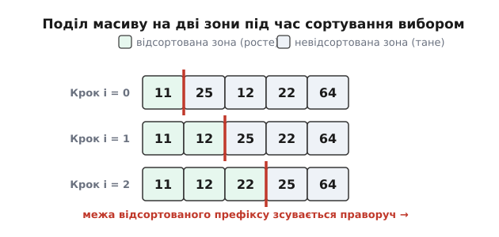
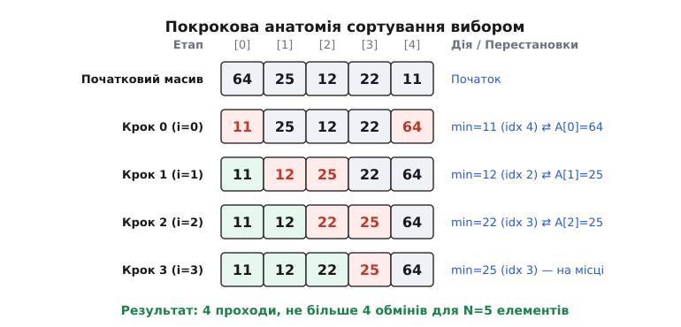

# Сортування вибором (Selection Sort)

<preknowlist>
- [Масив і вектор](topic:algorithms/array) — організація послідовного блоку пам'яті та індексація.
- [Асимптотичний аналіз](topic:algorithms/asymptotic-complexity) — поняття O-нотації, найкращий, середній та найгірший випадки.
- [Сортування бульбашкою](topic:algorithms/bubble-sort) — просте квадратичне сортування шляхом суміжних обмінів.
- [Сортування купою (heapsort)](topic:algorithms/heapsort) — турнірна оптимізація ідеї вибору мінімуму за O(log N).
- [Гармонічні числа](topic:algorithms/harmonic-numbers) — сума обернених величин та їх асимптотична оцінка.
</preknowlist>

Коли обчислювальна система отримує масив неструктурованих даних, будь-який подальший пошук чи вибірка елементів вимагають повного лінійного перегляду послідовності із часовою складністю `O(N)`. Упорядкування масиву якісно змінює цю ситуацію, перетворюючи лінійне сканування на миттєвий бінарний пошук зі складністю `O(log N)`. Однак сам процес упорядкування вимагає виконання двох кардинально різних за природою типів операцій: логічного порівняння елементів у регістрах центрального процесора та фізичного переміщення (перезапису) даних у напівпровідниковій або магнітній пам'яті.

У багатьох сучасних та історичних системних середовищах ці дві операції мають суттєво різну вартість. Зчитування даних із пам'яті виконується швидко й не викликає деструктивних змін у матеріалі носія. Натомість операція перезапису комірок енергонезалежної пам'яті (Flash, NOR Flash, EEPROM) вимагає подачі підвищеної напруги для тунелювання електронних зарядів крізь диелектричний шар, що забирає на два порядки більше часу та поступово руйнує фізичний кристал накопичувача. У таких умовах алгоритми сортування, які виконують масові хаотичні перестановки, стають згубними для апаратури.

Сортування вибором (Selection Sort) розв'язує цю фундаментальну задачу за допомогою строгого розподілу праці: воно виконує повний огляд невідсортованих даних для точного знаходження мінімального елемента, але зводить кількість фізичних операцій перезапису пам'яті до строгого теоретичного мінімуму — не більше ніж один обмін за один прохід по масиву.

## 1. Першопричина та інтуїція вибору

Уявіть ситуацію з повсякденного життя: перед вами на столі лежить пачка із 100 різнокаліберних карток із числами, які потрібно впорядкувати від найменшого до найбільшого. Якщо ви будете застосовувати сортування бульбашкою, вам доведеться безперервно міняти місцями сусідні картки, роблячи сотні й тисячі дрібних рухів руками.

Натомість найприродніша людська інтуїція підказує інший, значно раціональніший шлях:

1. Ви розкладаєте картки перед очима та проводите по них поглядом від початку до кінця, шукаючи картку з найменшим числом.
2. Знайшовши найменшу картку, ви вибираєте її та міняєте місцями з найпершою карткою у пачці. Тепер найменше число лежить на своєму остаточному місці (на позиції `0`).
3. Ви пересуваєте погляд до другої позиції, оглядаєте решту 99 карток, знаходите серед них найменшу й міняєте місцями з другою карткою (позиція `1`).
4. Повторюєте цей процес для кожної наступної позиції, доки не дійдете до кінця пачки.

Цей підхід має дві фундаментальні риси. З одного боку, ви змушені продивитися всі залишкові картки від початку до кінця на кожному кроці, щоб гарантувати, що знайдене число є найменшим серед усіх наявних. З іншого боку, ви робите лише **один фізичний обмін** за один повний огляд. Картки не блукають сусідніми позиціями і не зсуваються масово. Кожен елемент або чекає своєї черги в невідсортованій частині, або один раз переміщується на позицію, де він залишається назавжди.

Саме ця двоїстість — велика кількість оглядів (порівнянь) при строго мінімальній кількості перестановок (записів) — робить сортування вибором унікальним алгоритмом серед квадратичних методів впорядкування.

## 2. Фундаментальний механізм: поділ масиву на дві зони

Під час виконання алгоритму масив розміром `N` розбивається на два інваріантних сегменти:
- **Відсортована зона (префікс):** ліва частина масиву `A[0...i-1]`, яка вже містить `i` найменших елементів вхідних даних у строго впорядкованому вигляді. Ця зона поступово розширюється ліворуч направо.
- **Невідсортована зона (суфікс):** права частина масиву `A[i...N-1]`, яка містить решту елементів. Ця зона звужується з кожним кроком.


*Поділ масиву на відсортовану префіксну зону та невідсортовану суфіксну зону під час сортування вибором.*

Алгоритм виконується за `N - 1` зовнішніх ітерацій. На кожній ітерації `i` (де `i` змінюється від `0` до `N - 2`) реалізується двокроковий механізм:

1. **Пошук екстремуму в суфіксі:** Локальний індекс мінімуму `min_idx` ініціалізується значенням `i`. Потім внутрішній цикл оглядає всі комірки від `j = i + 1` до `N - 1`. Якщо елемент `A[j]` виявляється меншим за `A[min_idx]`, значення `min_idx` оновлюється на `j`.
2. **Фізичний обмін (Swap):** Після завершення сканування всієї невідсортованої зони знайдений найменший елемент `A[min_idx]` міняється місцями з елементом `A[i]`.
3. **Розширення відсортованого префіксу:** Межа відсортованої зони зсувається праворуч на одну позицію (`i -> i + 1`).

Коли зовнішній індекс `i` досягає значення `N - 1`, у невідсортованій зоні залишається єдиний елемент. Оскільки попередні `N - 1` елементів вже були найменшими й впорядкованими, останній елемент автоматично є найбільшим і гарантовано стоїть на своєму місці.

## 3. Покроковий розбір роботи алгоритму на конкретному масиві

Для детального розуміння простежимо виконання алгоритму на прикладі масиву з 5 цілих чисел: `[64, 25, 12, 22, 11]`.

```
Початковий стан масиву: [ 64, 25, 12, 22, 11 ]  (N = 5)
```

### Крок 0 (`i = 0`):
- **Відсортована зона:** порожня `[]`.
- **Невідсортована зона:** `[64, 25, 12, 22, 11]` (індекси від `0` до `4`).
- Припускаємо `min_idx = 0` (`A[min_idx] = 64`).
- Проходимо внутрішній цикл:
  - `j = 1`: порівнюємо `A[1]` (`25`) із `A[min_idx]` (`64`). Оскільки `25 < 64`, оновлюємо `min_idx = 1`.
  - `j = 2`: порівнюємо `A[2]` (`12`) із `A[min_idx]` (`25`). Оскільки `12 < 25`, оновлюємо `min_idx = 2`.
  - `j = 3`: порівнюємо `A[3]` (`22`) із `A[min_idx]` (`12`). Оскільки `22 > 12`, індекс `min_idx` залишається `2`.
  - `j = 4`: порівнюємо `A[4]` (`11`) із `A[min_idx]` (`12`). Оскільки `11 < 12`, оновлюємо `min_idx = 4`.
- Сканування завершено. Знайдено глобальний мінімум суфіксу: `11` на індексі `4`.
- Виконуємо обмін `A[0]` ⇄ `A[4]` (`64` ⇄ `11`).
- **Стан масиву після кроку 0:** `[ 11 | 25, 12, 22, 64 ]`.

### Крок 1 (`i = 1`):
- **Відсортована зона:** `[11]` (індекс `0`).
- **Невідсортована зона:** `[25, 12, 22, 64]` (індекси від `1` до `4`).
- Припускаємо `min_idx = 1` (`A[min_idx] = 25`).
- Проходимо внутрішній цикл:
  - `j = 2`: порівнюємо `A[2]` (`12`) із `A[min_idx]` (`25`). Оскільки `12 < 25`, оновлюємо `min_idx = 2`.
  - `j = 3`: порівнюємо `A[3]` (`22`) із `A[min_idx]` (`12`). Оскільки `22 > 12`, індекс `min_idx` залишається `2`.
  - `j = 4`: порівнюємо `A[4]` (`64`) із `A[min_idx]` (`12`). Оскільки `64 > 12`, індекс `min_idx` залишається `2`.
- Сканування завершено. Знайдено мінімум суфіксу: `12` на індексі `2`.
- Виконуємо обмін `A[1]` ⇄ `A[2]` (`25` ⇄ `12`).
- **Стан масиву після кроку 1:** `[ 11, 12 | 25, 22, 64 ]`.

### Крок 2 (`i = 2`):
- **Відсортована зона:** `[11, 12]` (індекси `0..1`).
- **Невідсортована зона:** `[25, 22, 64]` (індекси від `2` до `4`).
- Припускаємо `min_idx = 2` (`A[min_idx] = 25`).
- Проходимо внутрішній цикл:
  - `j = 3`: порівнюємо `A[3]` (`22`) із `A[min_idx]` (`25`). Оскільки `22 < 25`, оновлюємо `min_idx = 3`.
  - `j = 4`: порівнюємо `A[4]` (`64`) із `A[min_idx]` (`22`). Оскільки `64 > 22`, індекс `min_idx` залишається `3`.
- Сканування завершено. Знайдено мінімум суфіксу: `22` на індексі `3`.
- Виконуємо обмін `A[2]` ⇄ `A[3]` (`25` ⇄ `22`).
- **Стан масиву після кроку 2:** `[ 11, 12, 22 | 25, 64 ]`.

### Крок 3 (`i = 3`):
- **Відсортована зона:** `[11, 12, 22]` (індекси `0..2`).
- **Невідсортована зона:** `[25, 64]` (індекси `3..4`).
- Припускаємо `min_idx = 3` (`A[min_idx] = 25`).
- Проходимо внутрішній цикл:
  - `j = 4`: порівнюємо `A[4]` (`64`) із `A[min_idx]` (`25`). Оскільки `64 > 25`, індекс `min_idx` залишається `3`.
- Сканування завершено. Оскільки `min_idx == i` (`3 == 3`), обмін не потрібен. Елемент `25` вже стоїть на своєму місці.
- **Стан масиву після кроку 3:** `[ 11, 12, 22, 25 | 64 ]`.

На цьому алгоритм завершує роботу. Єдиний залишковий елемент `64` на позиції `4` є найбільшим і гарантовано впорядкованим.


*Анатомія покрокового виконання сортування вибором на прикладі масиву з п'яти елементів.*

Детальний хронологічний екскурс про виникнення цього алгоритму та його застосування у перших обчислювальних машинах середини XX століття ви можете прочитати у вставці [Історія сортування вибором](topic:algorithms/selection-sort/hist-selection-sort.md).

## 4. Математичний та аналітичний аналіз складності

Математична характеристика сортування вибором полягає в його повній нечутливості до ступеня початкової впорядкованості масиву.

### Аксиоматика порівнянь
На кожній ітерації `i` внутрішній цикл робить строго `N - 1 - i` порівнянь. Загальна кількість порівнянь `C(N)` по всіх `N - 1` проходах виражається сумою арифметичної прогресії:

```
C(N)
= (N - 1) + (N - 2) + ... + 2 + 1     [сума порівнянь]
= N · (N - 1) / 2                                [закрита формула]
= 1/2 · N² - 1/2 · N                             [розкриття складових]
```

Звідси випливають фундаментальні гарантії:
- **Найкращий випадок (Best Case):** `C(N) = (N² - N) / 2 = Θ(N²)`
- **Середній випадок (Average Case):** `C(N) = (N² - N) / 2 = Θ(N²)`
- **Найгірший випадок (Worst Case):** `C(N) = (N² - N) / 2 = Θ(N²)`

Відсутність розгалужень, які б могли перервати внутрішній цикл раніше (як це робить сортування бульбашкою чи сортування вставками при зустрічі впорядкованого елемента), робить часову складність за порівняннями строго квадратичною за будь-яких умов.

### Динаміка операцій перезапису пам'яті (Swaps)
Кожен зовнішній крок виконує не більше ніж один обмін `swap(A[i], A[min_idx])`. Якщо додати перевірку `if (min_idx != i)`, то обміни виконуються лише тоді, коли знайдений мінімум знаходиться на іншій позиції.

Отже, абсолютна верхня межа кількості операцій перезапису в пам'ять становить:

```
S(N) ≤ N - 1 = O(N)
```

Це ключова відмінність сортування вибором від інших квадратичних алгоритмів:
- **Bubble Sort:** робить у середньому `O(N²)` перестановок сусідніх елементів.
- **Insertion Sort:** робить у середньому `O(N²)` зсувів (записів) комірок пам'яті.
- **Selection Sort:** робить строго `O(N)` перезаписів у пам'ять, виконуючи при цьому `O(N²)` читань.

Більш глибокі алгебраїчні виведення, аналіз математичного сподівання оновлень реєстра мінімуму через гармонічні числа $H_N$ та доведення інваріантів подано у вставці [Математичний аналіз сортування вибором](topic:algorithms/selection-sort/math-selection-sort.md).

## 5. Фізика носіїв пам'яті та апаратні причини застосування

Щоб зрозуміти, чому мінімізація кількості записів є настільки важливою в системному програмуванні, розглянемо фізичні процеси, що відбуваються в напівпровідникових структурах флеш-пам'яті (NOR Flash, NAND Flash, EEPROM).

### Фізичний знос напівпровідникових комірок (Flash Wear Out)
Комірка флеш-пам'яті спирається на транзистор із плаваючим затвором (Floating-Gate MOSFET) або з пасткою заряду (Charge Trap Flash). Зчитування стану комірки полягає у вимірюванні струму витоку крізь канал транзистора при подачі низької робочої напруги (1.8–3.3 В). Цей процес є безнаслідковим для матеріалу кристала й може повторюватися мільярди разів без жодного зносу.

Натомість операція стирання або перезапису комірки вимагає створення сильного електричного поля (подача 12–20 В), щоб примусити електрони подолати потенціальний бар'єр диелектрика методом тунелювання Фаулера-Нордгейма (Fowler-Nordheim Tunneling). Високонапружені електрони поступово руйнують атомарну решітку диоксиду кремнію (SiO₂), створюючи в ньому фізичні дефекти та пастки для зарядів.

Через це мікросхеми EEPROM та Flash мають строго обмежений ресурс стирання/запису (Endurance Limit):
- Стандартні комірки NOR Flash/EEPROM: від 10 000 до 100 000 циклів перезапису.
- Промислові накопичувачі SLC NAND: від 50 000 до 100 000 циклів.
- Споживчі накопичувачі TLC/QLC NAND: від 500 до 3 000 циклів.

Якщо алгоритм сортування робить `O(N²)` перезаписів (як Insertion Sort чи Bubble Sort), сортування таблиці з 100 елементів викличе близько 2500 фізичних записів. Повторення цієї операції 40 разів повністю вичерпає 100 000-ний ресурс комірок флеш-пам'яті, зробивши мікросхему непридатною для експлуатації. Застосування Selection Sort з його `N - 1` обмінами зменшує кількість записів до 99, продовжуючи фізичний термін служби пристрою у 25 разів.

### Посторінковий запис та блочне стирання (Flash Page/Block Erasure)
У флеш-пам'яті стирання даних виконується великими блоками (Block Erase розміром 4–64 КБ), а запис — сторінками (Page Program розміром 256–4096 байти). Якщо алгоритм виконує хаотичні перезаписи окремих байтів по всьому масиву (як у Bubble Sort), контролер пам'яті змушений безперервно зчитувати весь блок у RAM, змінювати один байт, прати весь фізичний блок і перезаписувати його знову. Це явище називається **посиленням запису (Write Amplification)**.

Сортування вибором мінімізує посилення запису, оскільки воно акумулює всі порівняння в оперативній пам'яті (або регістрах) і робить записи строго впорядкованими послідовними кроками.

## 6. Мікроархітектурна поведінка (CPU Pipeline & Cache)

У сучасних високопродуктивних процесорах швидкість сортування визначається не лише кількістю абстрактних операцій, а й тим, як алгоритм взаємодіє з апаратурою центрального процесора — кеш-пам'яттю L1/L2/L3 та блоком передбачення розгалужень (Branch Predictor).

### Просторова локальність та кешування (Spatial Locality)
Внутрішній цикл сортування вибором виконує послідовне читання сусідніх комірок пам'яті `A[j]` від `i + 1` до `N - 1`. Для процесора такий паттерн доступу є ідеальним:
- Апаратний предзавантажувач (Hardware Prefetcher) процесора розпізнає лінійне сканування і завчасно завантажує наступні кеш-лінії (Cache Lines розміром 64 байти) з оперативної пам'яті L3/RAM у швидкий кеш L1.
- Кількість кеш-промахів (Cache Misses) при зчитуванні мінімізується і дорівнює приблизно `(N² / 2) / (64 / sizeof(T))`.

### Передбачення розгалужень (Branch Prediction)
Внутрішня перевірка `if (A[j] < A[min_idx])` є джерелом умовних переходів на рівні машинного коду.
- Якщо вхідний масив містить випадкові дані, умовний перехід спрацьовує непередбачувано. Це призводить до помилок передбачення гілок (Branch Mispredictions), що спричиняє скидання конвеєра процесора (Pipeline Flush) і коштує від 15 до 20 тактів затримки на кожній помилці.
- Якщо вхідний масив вже є впорядкованим, умова `A[j] < A[min_idx]` завжди оцінюється як `false`. Передбачувач гілок процесора швидко навчається, і внутрішній цикл виконується з максимально можливою швидкістю конвеєра (до 1-2 тактів на порівняння).

### Детермінізм виконання та захист від сторонніх каналів (Side-Channel Security)
Оскільки кількість порівнянь у сортуванні вибором є строго фіксованою константою `(N² - N)/2`, час виконання алгоритму майже не залежить від конкретних значень усередині масиву.
У криптографічних модулях та апаратно-захищених системах (Secure Enclaves, HSM) ця властивість є критичною: вона унеможливлює атаки за часом (Execution Timing Attacks), коли зловмисник намагається відновити секретні ключі, вимірюючи мікросекундні затримки сортування даних.

## 7. Детальний аналіз виконання в трьох різних сценаріях вхідних даних

Для повного розуміння поведінки алгоритму проаналізуємо виконання сортування вибором на трьох крайніх типах вхідних масивів однакового розміру `N = 5`:

### Сценарій А: Повністю впорядкований масив `[10, 20, 30, 40, 50]`
- **Кількість порівнянь:** Робиться точно `(5² - 5) / 2 = 10` порівнянь. Алгоритм не може «здогадатися», що масив відсортований, оскільки він позбавлений прапорців переривання.
- **Кількість оновлень `min_idx`:** Змінна `min_idx` встановлюється на початку кожного проходу і більше жодного разу не оновлюється у внутрішньому циклі.
- **Кількість операцій swap:** Завдяки перевірці `if (min_idx != i)` алгоритм робить 0 обмінів. Фізична пам'ять взагалі не перезаписується.

### Сценарій Б: Масив, відсортований у зворотному порядку `[50, 40, 30, 20, 10]`
- **Кількість порівнянь:** Робиться точно `10` порівнянь.
- **Кількість оновлень `min_idx`:** На першому проході зміна `min_idx` відбувається при зустрічі кожного нового елемента (`j=1`, `j=2`, `j=3`, `j=4`), тобто `4` рази. Усього за час виконання відбудеться близько `N ln N` оновлень реєстру.
- **Кількість операцій swap:** Виконується точно `2` обміни (`50` ⇄ `10`, `40` ⇄ `20`), після чого масив опиняється повністю впорядкованим.

### Сценарій В: Масив із багатьма дублями `[5, 2, 5, 2, 1]`
- **Кількість порівнянь:** Точно `10` порівнянь.
- **Стійкість:** При пошуку мінімуму умова `A[j] < A[min_idx]` використовує строге менше. Тому при наявності двох однакових двоєк обирається перша зустрінута двійка. Проте дистанційний обмін першої п'ятірки з найменшим елементом переміщує її в кінець суфіксу, що порушує стійкість.

## 8. Модифікації та варіації алгоритму

Хоча базовий алгоритм має квадратичну складність `O(N²)`, існує кілька його важливих модифікацій.

### Двостороннє сортування вибором (Min-Max Selection Sort)
Замість того щоб шукати лише мінімальний елемент за один прохід, ми можемо шукати **одночасно і мінімум, і максимум** у невідсортованій зоні:

- Знайдений мінімум міняється місцями з елементом на лівій межі `left`.
- Знайдений максимум міняється місцями з елементом на правій межі `right`.
- Після цього обидві межі звужуються: `left++`, `right--`.

Це зменшує кількість ітерацій зовнішнього циклу вдвічі. Теоретичний підрахунок показує, що кількість порівнянь зменшується приблизно на 25% (до `~0.375 · N²`).

При реалізації двостороннього вибору є важливий крайовий випадок (edge case): якщо максимальний елемент знаходиться на позиції `left`, то після першого обміну (переміщення мінімуму на `left`) новий максимум опиняється на індексі `min_idx`. Якщо не врахувати цей зсув і виконати другий обмін за старим індексом `max_idx`, масив буде зіпсовано.

### Стійке сортування вибором (Stable Selection Sort)
Прямий дистанційний обмін `swap(A[i], A[min_idx])` руйнує відносний порядок однаковими елементів, роблячи прямий Selection Sort **нестійким** алгоритмом.

Щоб зробити сортування вибором стійким, обмін замінюють на зсув елементів:
1. Знайдений мінімальний елемент `key = A[min_idx]` виймається.
2. Усі елементи від `A[i]` до `A[min_idx - 1]` зсуваються праворуч на одну позицію.
3. Елемент `key` вставляється на позицію `A[i]`.

Це повністю зберігає відносний порядок однакових ключів, але збільшує кількість операцій перезапису в пам'ять до `O(N²)`, що позбавляє алгоритм його головної інженерної переваги.

### Еволюційний стрибок: Heapsort
Головним обмеженням сортування вибором є те, що пошук мінімуму в невідсортованому суфіксі розміром `k` виконується лінійним скануванням за `O(k)`.

Якщо організувати елементи невідсортованої зони у двоповерхову структуру даних — **двійкову купу (Heap)**, вилучення мінімального елемента стає можливим за `O(log k)`. Завдяки цьому загальна складність алгоритму вибору падає з `O(N²)` до **`O(N log N)`**. Саме ця ідея лежить в основі алгоритму [Сортування купою (heapsort)](topic:algorithms/heapsort).

Готові реалізації цих варіацій мовами C та C++ з прикладами шаблонів та бенчмарками подано у вставці [Практична реалізація сортування вибором](topic:algorithms/selection-sort/proj-selection-sort.md).

## 9. Порівняльний аналіз із квадратичними та логарифмічними алгоритмами

Щоб чітко бачити обчислювальну нішу сортування вибором, порівняємо його характеристики з іншими класичними алгоритмами сортування.

| Алгоритм сортування | Складність (Best) | Складність (Avg) | Складність (Worst) | Записи в пам'ять (Writes) | Стійкість | Детермінізм часу | Додаткова пам'ять |
| :--- | :--- | :--- | :--- | :--- | :--- | :--- | :--- |
| **Selection Sort** | `Θ(N²)` | `Θ(N²)` | `Θ(N²)` | **`≤ N - 1` (`O(N)`)** | Ні | **Абсолютний** | `O(1)` (in-place) |
| **Bubble Sort** | `O(N)` (з прапорцем) | `Θ(N²)` | `Θ(N²)` | `O(N²)` | Так | Ні | `O(1)` |
| **Insertion Sort** | **`O(N)`** | `Θ(N²)` | `Θ(N²)` | `O(N²)` | **Так** | Ні | `O(1)` |
| **QuickSort** | `O(N log N)` | `O(N log N)` | `O(N²)` | `O(N log N)` | Ні | Ні | `O(log N)` (стек) |
| **Heapsort** | `O(N log N)` | `O(N log N)` | `O(N log N)` | `O(N log N)` | Ні | Так | `O(1)` |
| **Merge Sort** | `O(N log N)` | `O(N log N)` | `O(N log N)` | `O(N log N)` | Так | Так | `O(N)` |

### Ключові висновки з порівняння:
1. **Insertion Sort** є кращим вибором для загального сортування малих масивів (`N < 30`) на звичайних ПК, оскільки він має складність `O(N)` на майже відсортованих даних та забезпечує стійкість.
2. **Selection Sort** є беззаперечним переможцем у ситуаціях, де ціна запису в пам'ять переважає ціну читання. Він здійснює у десятки разів менше перезаписів пам'яті, ніж Insertion Sort чи Bubble Sort.
3. **Heapsort** є логарифмічним продовженням ідеї вибору, яке забезпечує `O(N log N)` за будь-яких умов із пам'яттю `O(1)`.

> 🔧 **Навіщо це.**
> Сортування вибором — це спеціалізований інструмент для систем із суворими апаратними обмеженнями на записи в пам'ять.
> Якщо ви розробляєте прошивку для медичного імплантату, автономного датчика або польотного контролера, де конфігураційна таблиця з 50 параметрів зберігається у внутрішній EEPROM-пам'яті мікроконтролера із ресурсом 100 000 циклів запису, використання Insertion Sort з його `O(N²)` зсувами може зносити енергонезалежну пам'ять пристрою за кілька місяців інтенсивної роботи.
> Застосування Selection Sort гарантує, що для таблиці з 50 елементів буде виконано не більше 49 фізичних записів у пам'ять, зберігаючи працездатність пристрою на десятиліття.

Повний опис функціональних інтерфейсів, інваріантів пре- та пост-умов, а також рекомендацій для системних архітекторів міститься у вставці [Довідник інтерфейсів сортування вибором](topic:algorithms/selection-sort/api-selection-sort.md).
