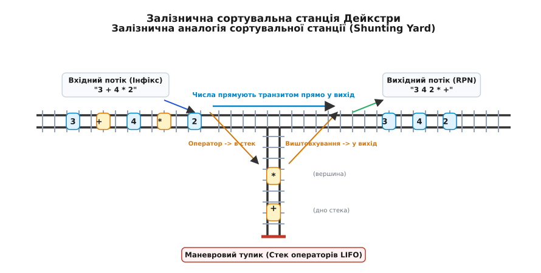
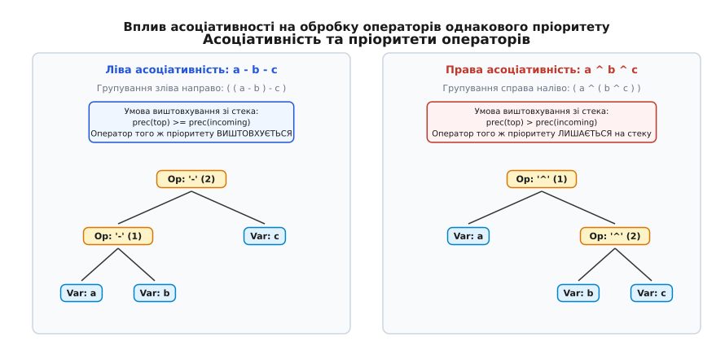
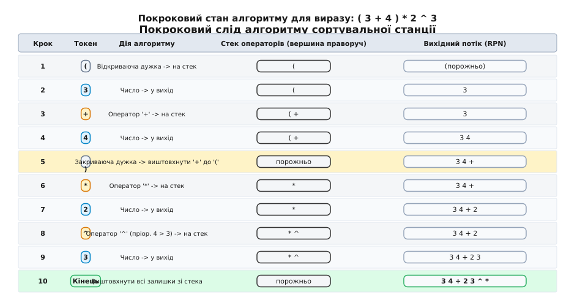
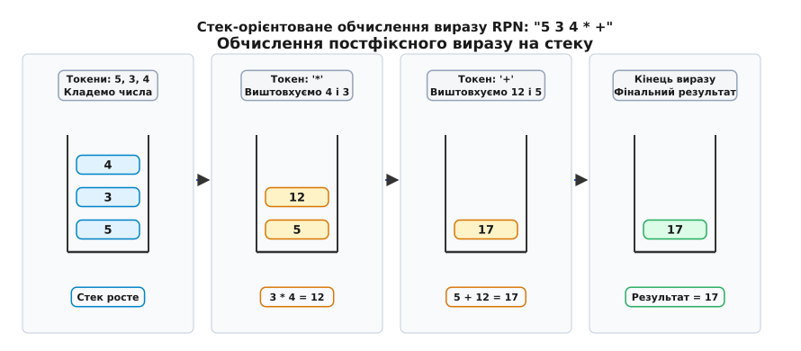
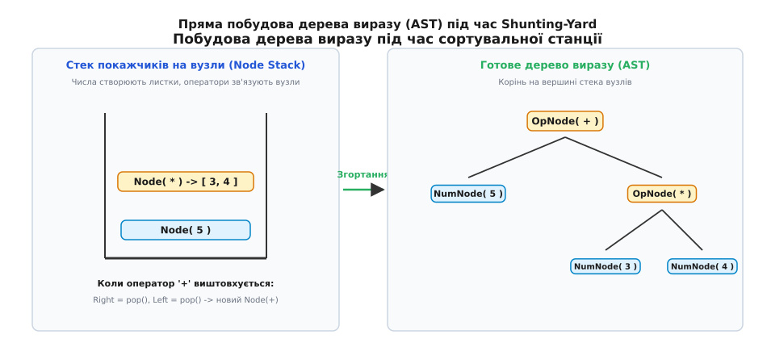

# Сортувальна станція Дейкстри

<preknowlist>
- [Черга: FIFO і кільцевий буфер](topic:algorithms/queue-fifo) — дисципліна «першим прийшов — першим пішов», буферизація вихідного потоку токенів.
- [Абстрактне синтаксичне дерево (AST)](topic:algorithms/abstract-syntax-tree) — ієрархічна модель зв'язків між операціями та даними.
- [Рекурсія](topic:algorithms/recursion) — обробка самоподібних вкладених структур та рекурсивний спуск.
- [Двійкове дерево](topic:algorithms/binary-tree) — анатомія вузлів із лівими та правими операндами.
</preknowlist>

Коли людина бачить арифметичний вираз `3 + 4 × 2`, вона миттєво обчислює спочатку `4 × 2 = 8`, а потім додає `3`, отримуючи `11`. Але якщо змусити комп'ютер читати цей же рядок зліва направо у прямому порядку надходження символів, наївний процесор виконає `3 + 4 = 7`, а потім помножить `7 × 2`, отримавши хибний результат `14`. Операція додавання `+` з'являється у потоці символів раніше за множення `×`, проте її виконання мусить бути відкладене доти, доки не буде обчислено операцію з вищим пріоритетом.

Ситуація стає критичною, коли у вираз додаються вкладені круглі дужки: `(3 + 4) × (2 + (5 - 1))`. Комп'ютер не має права виконати жодної дії, доки не знайде межу кожної вкладеної дужки. Наївний підхід вимагає багаторазового сканування вихідного рядка туди й назад у пошуках найглибших дужок, що перетворює час обробки на квадратичний `O(N²)`. На рядку довжиною всього 10 000 символів такий аналізатор змушений виконати понад 50 000 000 посимвольних операцій, що блокує роботу системи. Крім того, регулярні вирази чи скінченні автомати без додаткової пам'яті фізично не здатні відстежувати довільну глибину вкладеності дужок, оскільки не володіють апаратом магазинної пам'яті.

Щоб подолати цю перешкоду й обчислювати математичні формули за один лінійний прохід `O(N)`, видатний нідерландський науковець Едсгер Дейкстра (нід. *Edsger Wybe Dijkstra*) у 1961 році розробив алгоритм **«Сортувальна станція»** (англ. *Shunting-Yard Algorithm*). Цей алгоритм елегантно перетворює людську інфіксну форму запису на машинний постфіксний потік або безпосередньо вирощує дерево синтаксичного розбору за допомогою всього одного допоміжного стека операторів.

Детальний історичний контекст виникнення цієї ідеї під час створення першого компілятора мови ALGOL 60 для машини Electrologica X1 та її зв'язок із польською логічною школою 1920-х років розібрано у вставці [Історія сортувальної станції та польського запису](topic:algorithms/shunting-yard/hist-shunting-yard.md).

## Три нотації: чому комп'ютерам не підходить інфікс

Спосіб розташування знака операції відносно його операндів визначає синтаксичну форму математичного виразу. В обчислювальній математиці та комп'ютерних науках розрізняють три фундаментальні форми запису:

1. **Інфіксна нотація (Infix)** — оператор розташовується безпосередньо між своїми операндами: `A + B`. Це традиційний спосіб запису, до якого людство звикло з часів появи шкільної алгебри. Головний недолік інфіксу для обчислювальних машин — його синтаксична неоднозначність. Щоб правильно інтерпретувати рядок `A + B × C`, комп'ютер зобов'язаний тримати в пам'яті глобальну таблицю пріоритетів і постійно зазирати вперед або розставляти явні дужки `(A + (B × C))`. Якщо дужки пропущені, порядок виконання стає контекстно-залежним.
2. **Префіксна нотація (Prefix)**, або прямий польський запис — оператор записується строго перед своїми операндами: `+ A B` або `+ A × B C`. Винайдена польським логіком Яном Лукасевичем у 1924 році, вона повністю усуває потребу в дужках за умови фіксованої кількості операндів. Для комп'ютера префіксний запис зручний тим, що вираз розкривається однозначно при читанні справа наліво.
3. **Постфіксна нотація (Postfix)**, або **зворотний польський запис** (англ. *Reverse Polish Notation*, RPN) — оператор записується строго після своїх операндів: `A B +` або `A B C × +`.

| Властивість | Інфіксна (Infix) | Префіксна (Prefix) | Постфіксна (Postfix / RPN) |
| :--- | :--- | :--- | :--- |
| **Приклад для (3 + 4) × 5** | `(3 + 4) * 5` | `* + 3 4 5` | `3 4 + 5 *` |
| **Приклад для 3 + 4 × 5** | `3 + 4 * 5` | `+ 3 * 4 5` | `3 4 5 * +` |
| **Потреба в дужках** | Обов'язкова для зміни пріоритету | Відсутня (повністю бездужкова) | Відсутня (повністю бездужкова) |
| **Зручність для людини** | Висока (природний запис) | Низька (незвичний порядок) | Низька (вимагає тренування) |
| **Складність для машини** | Висока (потрібен синтаксичний парсер) | Проста (обхід справа наліво) | Тривіальна (лінійний стек чисел) |

Чому саме зворотний польський запис став золотим стандартом для компіляторів, віртуальних машин (Java Virtual Machine, WebAssembly, Forth) та інженерних калькуляторів?

У постфіксному записі порядок виконання операцій закодований у самій послідовності токенів. Коли обчислювальний автомат зустрічає число, він завантажує його в стек значень. Коли зустрічає знак операції (наприклад, `+`), він знімає два верхні числа зі стека, додає їх і повертає результат на вершину стека. Дужки стають непотрібними: структура зв'язків є абсолютно однозначною, а виконання відбувається строго зліва направо за лінійний час `O(N)` без жодного зазирання вперед чи повернень назад.

Завдання алгоритму сортувальної станції Дейкстри — бути швидким і безпомилковим мостом, який бере сирий інфіксний текст від користувача і транслює його в бездужковий RPN або синтаксичне дерево.

## Залізнична метафора сортувальної станції

Дейкстра пояснив логіку свого алгоритму через класичну задачу залізничного маневрування. На великих залізничних вузлах існують сортувальні станції (англ. *shunting yard* або *marshalling yard*), де потяги, що складаються з різних вагонів, перегруповуються перед відправленням за різними маршрутами призначення за допомогою тупикових колій та стрілочних переводів.


*Залізнична аналогія сортувальної станції Дейкстри: вхідний інфіксний потік рухається ліворуч, числа прямують транзитом на вихідну колію RPN, а оператори відводяться стрілочним переводом у тупиковий маневровий стек.*

Схема містить три ключові колійні елементи:
1. **Вхідна колія (Input Stream)**: по ній один за одним прибувають вагони вихідного виразу (числа, оператори, круглі дужки).
2. **Вихідна колія (Output Queue / RPN)**: сюди виїжджають вагони в остаточному порядку зворотного польського запису. Це черга (FIFO — перший зайшов, перший вийшов).
3. **Тупикова маневрова колія (Operator Stack)**: це тупик, який функціонує за принципом стека (LIFO — останнім зайшов, першим вийшов). Вагон, який заїхав у тупик, не може проїхати на вихідну колію, доки не виїдуть усі вагони, що заїхали після нього.

Поведінка вагонів на станції підпорядковується чітким механічним правилам:
- **Числа (вантажні вагони)** не мають пріоритету між собою і не змінюють свого взаємного порядку. Вони прямують стрілочним переводом транзитом прямо на вихідну колію.
- **Оператори (локомотиви)** не мають права опинитися на вихідній колії раніше, ніж прибудуть обидва їхні операнди. Тому вони звертають у маневровий тупик (стек).
- Якщо до тупика наближається новий оператор, він порівнює свою «потужність» (пріоритет) із локомотивом, що стоїть на вершині тупика. Якщо локомотив у тупику має вищий або такий самий пріоритет (за умови лівої асоціативності), він виштовхується заднім ходом із тупика на вихідну колію, поступаючись місцем новому оператору.

Дейкстра обрав залізничну термінологію не випадково: фізична наочність руху потягів дозволила команді розробників у 1961 році уникнути теоретичної плутанини та реалізувати надійний транслятор для машини з мізерними ресурсами оперативної пам'яті.

## Пріоритет та асоціативність операторів

Щоб алгоритм ухвалював однозначні рішення про виштовхування операторів зі стека, кожен оператор наділяється двома фундаментальними характеристиками: числовим рівнем пріоритету та вектором асоціативності.

### 1. Рівні пріоритету (Precedence)

Пріоритет (від лат. *prior* — «перший») визначає силу зв'язування оператора зі своїми операндами. Що вищий числовий ранг пріоритету, то раніше мусить виконатися відповідна математична операція:

```
Рівень 1 (найнижчий):  +  (бінарне додавання),  - (бінарне віднімання)
Рівень 2:              *  (множення),           / (ділення)
Рівень 3:              ^  (піднесення до степеня)
Рівень 4 (найвищий):   ~  (унарний мінус / заперечення знаку)
```

У розширених граматиках мов програмування (C, C++, Rust, Python) ця ієрархія містить значно ширший спектр операцій:
- логічні оператори диз'юнкції `||` (ранг 1) та кон'юнкції `&&` (ранг 2);
- побітові операції `|`, `^`, `&` (ранги 3, 4, 5);
- оператори порівняння `==`, `!=`, `<`, `>`, `<=`, `>=` (ранги 6, 7);
- побітові зсуви `<<`, `>>` (ранг 8);
- адитивні операції `+`, `-` (ранг 9);
- мультиплікативні операції `*`, `/`, `%` (ранг 10);
- операція піднесення до степеня `**` або `^` (ранг 11);
- унарні префіксні оператори `!`, `~`, `-`, `+` (ранг 12).

### 2. Асоціативність (Associativity)

Асоціативність (від лат. *associare* — «з'єднувати») визначає напрямок групування для послідовності операторів із однаковим рівнем пріоритету:
- **Лівоасоціативні оператори (Left-associative)**: групуються зліва направо. До них належать `+`, `-`, `*`, `/`. Наприклад, вираз `a - b - c` трактується як `(a - b) - c`. Перше віднімання має виконатися раніше за друге, тому перший мінус мусить вийти у вихідний потік раніше за другий.
- **Правоасоціативні оператори (Right-associative)**: групуються справа наліво. До них належать піднесення до степеня `^`, унарний мінус `-` та оператор присвоєння `=`. Наприклад, вираз `a ^ b ^ c` трактується як `a ^ (b ^ c)`. Якщо `a = 2`, `b = 3`, `c = 2`, то `2 ^ (3 ^ 2) = 2 ^ 9 = 512`, тоді як при лівому групуванні вийшло б `(2 ^ 3) ^ 2 = 8 ^ 2 = 64`.


*Вплив асоціативності: для лівоасоціативного виразу оператор того самого пріоритету виштовхується зі стека, утворюючи ліве розгалуження дерева; для правоасоціативного — залишається на стеку, утворюючи праве розгалуження.*

Математичне обґрунтування граматичної однозначності цих правил та строге доведення інваріантів стека наведено у вставці [Математичні засади та доведення лінійності алгоритму Дейкстри](topic:algorithms/shunting-yard/math-operator-precedence.md).

### Загальне правило виштовхування зі стека

Нехай у вхідному потоці з'явився новий оператор `op1`, а на вершині стека операторів лежить оператор `op2`. Оператор `op2` виштовхується зі стека у вихідну чергу, якщо виконується хоча б одна з двох умов:

```
precedence(op2) > precedence(op1)
АБО
(precedence(op2) == precedence(op1) І associativity(op1) == LEFT)
```

Оператор `op2` виштовхується багаторазово (у циклі `while`), доки стек не спорожніє, або на вершині не опиниться оператор меншого пріоритету, або не зустрінеться відкриваюча дужка `(`. Лише після цього новий оператор `op1` завантажується на вершину стека.

## Правила обробки круглих дужок та виявлення помилок

Круглі дужки `(` та `)` є спеціальними маркерами зміни природного порядку пріоритетів. Їхня обробка в алгоритмі Дейкстри асиметрична.

### 1. Відкриваюча дужка `(`

Коли алгоритм зустрічає `(`, він беззастережно кладе її на вершину стека операторів. Відкриваюча дужка поводиться як ізолюючий бар'єр (нове «дно стека»):
- Ззовні вона має найвищий пріоритет (ніколи не виштовхує попередні оператори, а лягає поверх них).
- Зсередини вона має найнижчий пріоритет: жоден наступний бінарний оператор (`+`, `*`, `^`) не має права виштовхнути `(` зі стека.

### 2. Закриваюча дужка `)`

Коли алгоритм зустрічає `)`, це сигнал про завершення формування підвиразу:
1. Алгоритм починає послідовно виштовхувати оператори з вершини стека у вихідну чергу, доки на вершині стека не опиниться відкриваюча дужка `(`.
2. Коли `(` досягнуто, вона знімається зі стека і **знищується**.
3. Сама закриваюча дужка `)` також відкидається. Жодна дужка ніколи не потрапляє у вихідну чергу RPN!
4. Якщо безпосередньо перед цією дужкою на стеку лежав виклик функції (наприклад, `sin` або `max`), цей токен функції також виштовхується у вихідну чергу.

### 3. Автоматичне виявлення синтаксичних дефектів

Алгоритм сортувальної станції має вбудовану здатність діагностувати помилки структури виразу без окремого проходу:

1. **Непарна закриваюча дужка (Mismatched Right Paren)**: якщо під час пошуку `(` стек операторів спорожнів, а відкриваючої дужки так і не знайдено — у виразі є зайва закриваюча дужка (наприклад, `(3 + 4) * 2)`).
2. **Незакрита відкриваюча дужка (Unclosed Left Paren)**: якщо після обробки всіх вхідних токенів у стеку операторів залишилася відкриваюча дужка `(` — у виразі забули закрити дужку (наприклад, `((3 + 4) * 2`).
3. **Пропущені операнди або злиплі оператори**: відстежуються станом лексера (два бінарні оператори поспіль `3 + * 4` або порожні дужки `()`).

## Покрокове простеження (Trace)

Щоб побачити роботу алгоритму в динаміці, розглянемо повний цикл обробки виразу з дужками та різними пріоритетами:

```
( 3 + 4 ) * 2 ^ 3
```


*Покроковий стан алгоритму сортувальної станції для виразу (3 + 4) * 2 ^ 3: динаміка наповнення стека операторів та вихідної черги на кожному кроці.*

Розглянемо докладну таблицю переходів станів автомата:

| Крок | Вхідний токен | Поточна дія алгоритму | Стек операторів (дно -> вершина) | Вихідний потік (RPN) |
| :---: | :---: | :--- | :--- | :--- |
| **1** | `(` | Відкриваюча дужка завантажується на стек | `(` | *порожньо* |
| **2** | `3` | Числовий операнд прямує прямо на вихід | `(` | `3` |
| **3** | `+` | Оператор `+` кладеться на стек (поверх `(`) | `( +` | `3` |
| **4** | `4` | Числовий операнд прямує прямо на вихід | `( +` | `3 4` |
| **5** | `)` | Закриваюча дужка: виштовхуємо `+` до `(`, дужки знищуються | *порожньо* | `3 4 +` |
| **6** | `*` | Стек порожній; оператор `*` лягає на стек | `*` | `3 4 +` |
| **7** | `2` | Числовий операнд прямує прямо на вихід | `*` | `3 4 + 2` |
| **8** | `^` | Пріоритет `^` (рівень 3) > `*` (рівень 2); `^` лягає на стек | `* ^` | `3 4 + 2` |
| **9** | `3` | Числовий операнд прямує прямо на вихід | `* ^` | `3 4 + 2 3` |
| **10** | *Кінець* | Вхідний потік вичерпано: виштовхуємо всі оператори зі стека | *порожньо* | `3 4 + 2 3 ^ *` |

Зверніть увагу на крок 5: у вихідному потоці операція додавання `+` опинилася **раніше** за число `2` і множення `*`, хоча у вхідному рядку дужка стояла першою. Алгоритм безпомилково відтворив необхідний порядок обчислень.

## Розширення 1: Виклики функцій та коми-роздільники

Класичний алгоритм Дейкстри описував лише бінарні оператори та круглі дужки. Проте в реальних математичних виразах повсюдно зустрічаються функції з одним або кількома аргументами: `sin(x)`, `max(a, b)`, `pow(x, y + 1)`, `clamp(val, min, max)`.

Для підтримки функцій алгоритм розширюється трьома правилами:

1. **Токен функції (`Function`)**: коли лексер розпізнає ідентифікатор функції (наприклад, `max`), цей токен завантажується на стек операторів так само як дужка. Одночасно створюється лічильник аргументів (за замовчуванням рівний 1).
2. **Кома-роздільник (`,`)**: кома слугує маркером завершення поточного аргументу функції. Зустрівши кому, алгоритм виштовхує всі оператори зі стека у вихідну чергу, доки на вершині не опиниться відкриваюча дужка `(`. Після цього відкриваюча дужка **залишається** на стеку, а лічильник аргументів поточної функції інкрементується на 1.
3. **Завершення функції**: коли зустрічається закриваюча дужка `)`, вона виштовхує залишки операторів останнього аргументу до `(`. Дужка `(` знищується, а токен функції знімається зі стека й записується у вихідну чергу разом із кількістю зібраних аргументів: `max/2`.

Приклад перетворення виразу `max(10, 2 * 3)`:

```
Вхід:     max ( 10 , 2 * 3 )
Постфікс: 10 2 3 * max/2
```

Обчислювач RPN, зустрівши токен `max/2`, знатиме, що потрібно витягнути зі стека рівно 2 значення і вибрати з них максимальне.

## Розширення 2: Унарний мінус проти бінарного віднімання

Однією з найпідступніших проблем синтаксичного розбору є омонімія символу дефіса `-`. Залежно від позиції у виразі він може бути:
- **Бінарним оператором віднімання**: `5 - 3` (вимагає двох операндів, лівоасоціативний, пріоритет 1).
- **Унарним оператором зміни знака**: `-5` або `3 * -x` (вимагає одного операнда, правоасоціативний, високий пріоритет 4).

### Механізм контекстного розпізнавання

Сортувальна станція розв'язує цю омонімію на етапі лексичного сканування, аналізуючи тип **попереднього токена** (`prev_token`):

Токен `-` є **унарним мінусом**, якщо він стоїть:
1. На самому початку виразу (`prev_token == NULL` або `START`).
2. Одразу після іншого оператора: `3 * -4` (`prev_token == OPERATOR`).
3. Одразу після відкриваючої дужки: `(-5 + 2)` (`prev_token == LPAREN`).
4. Одразу після коми в списку аргументів: `max(1, -2)` (`prev_token == COMMA`).

В усіх інших випадках (після числа, змінної або закриваючої дужки `)`) токен `-` є звичайним **бінарним відніманням**.

Унарний мінус позначається окремим внутрішнім символом (наприклад, `neg` або `~`), має пріоритет 4 і поводиться як правоасоціативний оператор: вираз `- - 5` обчислюється як `-(-5) = 5`.

## Обчислення значень у RPN за O(N)

Коли вираз перетворено на постфіксний потік, його обчислення стає елементарною лінійною процедурою, що використовує один стек чисел (операндів).


*Обчислення постфіксного виразу на стеку: послідовне завантаження чисел та згортання двох верхніх операндів при зустрічі оператора.*

### Алгоритм обчислення

Створюється порожній стек чисел. Токени вихідного RPN-потоку читаються зліва направо:
1. **Якщо токен — число**: число завантажується на вершину стека (`push`).
2. **Якщо токен — унарний оператор (наприклад, `neg`)**: зі стека знімається одне число `a = pop()`, обчислюється результат `res = -a`, який кладеться назад у стек.
3. **Якщо токен — бінарний оператор (`+`, `-`, `*`, `/`, `^`)**:
   - Зі стека знімається перший елемент: це **правий операнд** `b = pop()`.
   - Зі стека знімається другий елемент: це **лівий операнд** `a = pop()`.
   - Обчислюється результат операції `res = a op b`.
   - Результат завантажується назад у стек (`push(res)`).
4. **Якщо токен — функція з `k` аргументами**: зі стека виштовхуються `k` операндів, виконується функція, результат повертається у стек.

> ⚠️ **Критична пастка порядку операндів**: для некомутативних операцій (віднімання `-`, ділення `/`, піднесення до степеня `^`) порядок операндів має вирішальне значення. Оскільки стек повертає елементи у зворотному порядку (LIFO), перше зняте число є **правим** аргументом, а друге — **лівим**. Обчислення `b - a` або `b / a` замість `a - b` та `a / b` — найпоширеніша помилка реалізації.

Після обробки всіх токенів на стеку має залишитися **рівно одне число** — це і є кінцевий результат обчислення. Якщо на стеку залишилося більше чисел або стек спорожнів раніше часу — у вихідному виразі була допущена помилка кількості операндів.

## Пряма побудова синтаксичного дерева (AST)

Постфіксний запис зручний для швидкого виконання, але для оптимізації виразів, символьного диференціювання, генерації коду компілятором або побудови підказок у середовищах розробки (IDE) потрібне повноцінне **абстрактне синтаксичне дерево** (AST).

Сортувальна станція Дейкстри здатна будувати дерево AST безпосередньо в процесі синтаксичного аналізу, без проміжного збереження RPN-рядка.


*Пряма побудова AST під час сортувальної станції: вихідний потік замінено на стек покажчиків на вузли дерева. При виштовхуванні оператора створюється новий батьківський вузол.*

### Модифікація алгоритму

Замість запису токенів у вихідну чергу алгоритм використовує другий допоміжний стек — **стек покажчиків на вузли дерева (Node Stack)**:

1. **Коли зустрічається число**: створюється листовий вузол `Node(Number, 5)`, і покажчик на нього кладеться у стек вузлів.
2. **Коли оператор `op` виштовхується зі стека операторів**:
   - Замість запису в чергу створюється операторний вузол `Node(Op, op)`.
   - Зі стека вузлів витягуються два покажчики: `right = pop_node()`, `left = pop_node()`.
   - Вони призначаються дітьми нового операторного вузла: `node->left = left`, `node->right = right`.
   - Сам новий вузол завантажується у стек вузлів (`push_node(node)`).
3. Після завершення роботи у стеку вузлів залишається рівно один покажчик — це **корінь готового дерева виразу**.

Повну працюючу реалізацію лексера, алгоритму перетворення, стек-орієнтованого калькулятора та побудови дерева AST на мовах C та C++ наведено у вставці [Повний рушій синтаксичного аналізу та обчислення виразів](topic:algorithms/shunting-yard/proj-shunting-evaluator.md).

## Оптимізація дерева та згортання констант

Побудоване за допомогою сортувальної станції дерево виразу відкриває шлях до потужних оптимізацій часу компіляції. Найважливішою з них є **згортання констант** (англ. *constant folding*).

Якщо обидва дочірні вузли бінарного оператора є числовими літералами, операція може бути виконана компілятором заздалегідь:
- Вузол `BinaryOp(+, Literal(3), Literal(4))` замінюється на єдиний вузол `Literal(7)`.
- Підвираз `3 * (2 + 4) * x` згортається у `18 * x`.

Згортання констант виконується рекурсивним обходом дерева знизу догори (Post-order Traversal) за лінійний час `O(N)` від кількості вузлів дерева.

Крім того, дерево AST дозволяє виконувати алгебраїчні спрощення (англ. *algebraic rewrites*):
- `x * 1` або `1 * x` спрощується до `x`;
- `x * 0` або `0 * x` спрощується до `0` (за умови відсутності побічних ефектів);
- `x + 0` або `x - 0` спрощується до `x`;
- `x ^ 1` спрощується до `x`, а `x ^ 0` — до `1`.

Завдяки цим трансформаціям скомпільований код звільняється від зайвих інструкцій процесора ще до генерації асемблерного тексту.

## Пряма генерація стекового байткоду

Однією з найцінніших властивостей сортувальної станції є те, що вихідний потік RPN є практично готовою програмою для стекових віртуальних машин.

Компілятору не обов'язково формувати проміжний рядок чи текстовий список токенів: під час виштовхування елементів алгоритм може одразу записувати бінарні коди інструкцій (байткод) у вихідний буфер.

Розглянемо зіставлення виходу сортувальної станції з інструкціями віртуальної машини WebAssembly (Wasm) та Java Virtual Machine (JVM) для виразу `(x + 5) * 2`:

```
Вихід RPN:           x  5  +  2  *

WebAssembly (Wasm):
  local.get $x      ;; завантажити значення змінної x на стек
  i32.const 5       ;; покласти константу 5 на стек
  i32.add           ;; зняти два числа, додати, покласти результат
  i32.const 2       ;; покласти константу 2 на стек
  i32.mul           ;; зняти два числа, помножити, покласти результат

JVM Байткод:
  iload_1           ;; завантажити локальну змінну x
  iconst_5          ;; покласти константу 5
  iadd              ;; додати
  iconst_2          ;; покласти константу 2
  imul              ;; помножити
```

Це пряме ізоморфне відображення пояснює, чому JIT-компілятори мов програмування та інтерпретатори байткоду (Lua, Python, V8) використовують алгоритми на основі сортувальної станції для швидкої однопрохідної генерації виконуваного коду.

## Динамічний реєстр операторів та користувацькі рівні

У розширюваних математичних пакетах і предметно-орієнтованих мовах (DSL) часто виникає потреба додавати нові операції під час роботи програми без переписування синтаксичного аналізатора.

Алгоритм сортувальної станції ідеально підтримує динамічну конфігурацію:
- Таблиця операторів реалізується як асоціативний масив (хеш-таблиця `std::unordered_map<std::string, OpInfo>`).
- Користувач може реєструвати довільні багатосимвольні оператори (наприклад, матричне множення `**`, векторний добуток `><`, оператори порівняння `===` або `!=`).
- Кожен зареєстрований оператор дістає числовий ранг пріоритету та прапорець лівої або правої асоціативності (аналогічно директивам `infixl` та `infixr` у мові Haskell).

Завдяки тому, що логіка виштовхування зі стека спирається виключно на предикат `pop_cond`, ядро алгоритму залишається незмінним незалежно від кількості операторів у системі.

## Відновлення після синтаксичних помилок у промислових парсерах

У діалогових системах, таких як редактори коду, командні рядки REPL або математичні калькулятори, неприпустимо просто аварійно завершувати роботу при першій помилці у виразі.

Промислові парсери реалізують три стратегії відновлення:

1. **Панічний режим (Panic Mode Recovery)**: зустрівши некоректний токен (наприклад, два знаки множення поспіль `3 * * 4`), парсер пропускає символи до найближчого роздільника (коми, крапки з комою або закриваючої дужки) і продовжує аналіз наступного підвиразу.
2. **Автоматична синтетична вставка дужок**: якщо користувач ввів вираз із пропущеною кінцевою дужкою `sqrt(2 * (x + 1`, парсер наприкінці вхідного потоку автоматично генерує необхідну кількість закриваючих дужок `)`, дозволяючи обчислити результат і вивести попередження замість блокування інтерфейсу.
3. **Точна візуальна діагностика**: збереження початкових координат токенів (номер рядка та позиція стовпчика) дозволяє виводити інформативні повідомлення про помилку з підкресленням дефектного місця стрілкою `^^^`.

## Кеш-локальність та вирівнювання пам'яті

Швидкодія синтаксичного аналізу на сучасному обладнанні здебільшого лімітується не кількістю інструкцій процесора, а пропускною здатністю підсистеми пам'яті.

Сортувальна станція має величезну перевагу над рекурсивним спуском завдяки суміжній організації даних у пам'яті (Contiguous Memory Layout):
- Стек операторів і вихідний буфер розміщуються у неперервних масивах.
- Усі операції запису й читання відбуваються послідовно, що активує апаратний механізм попередньої вибірки даних процесора (Hardware Prefetcher).
- Розмір структур даних для типового виразу рідко перевищує 2–4 КБ, що дозволяє усьому стану алгоритму постійно перебувати у надшвидкому кеші першого рівня (L1 Data Cache із латентністю в 4–5 тактів).

Навпаки, рекурсивні парсери, що створюють окремі вузли в динамічній купі (`malloc` або `new`), розкидають об'єкти по всій адресній просторі, викликаючи часті промахи кешу (Cache Misses) та деградацію швидкодії через фрагментацію пам'яті.

Використання лінійного монотонного пулу пам'яті (Arena Allocator) разом із сортувальною станцією дозволяє виділяти всі вузли синтаксичного дерева за єдину операцію зсуву покажчика, зводячи накладні витрати на керування пам'яттю практично до абсолютного нуля.

## Архітектурні компроміси та практичне застосування

Сортувальна станція Дейкстри — один із найбільш ефективних та економних алгоритмів синтаксичного аналізу в комп'ютерних науках, але він має чітко окреслені межі застосування.

### Переваги сортувальної станції

1. **Мінімальні витрати пам'яті та лінійний час**: алгоритм вимагає строго `Theta(N)` операцій за часом і `O(N)` додаткової пам'яті. Усі структури даних є простими масивами або векторами, що забезпечує ідеальну просторову локальність даних у кеші процесора (L1 Data Cache).
2. **Імунітет до переповнення системного стека (Stack Overflow)**: на відміну від рекурсивного спуску, де кожен вкладений рівень дужок породжує новий фрейм виклику функції, сортувальна станція використовує явний плоский стек у динамічній пам'яті. Вираз із 100 000 вкладених дужок легко опрацьовується без загрози аварійного завершення програми.
3. **Простота реалізації на мікроконтролерах**: алгоритм не потребує сторонніх бібліотек, динамічного поліморфізму чи важких генераторів парсерів на зразок Bison/Yacc, завдяки чому ідеально підходить для вбудованих систем (STM32, ESP32, AVR).
4. **Використання у фронтендах сучасних компіляторів**: промислові оптимізуючі компілятори сімейств Clang/LLVM та GCC використовують комбінацію сортувальної станції та алгоритму сходження за пріоритетами (Precedence Climbing) для розбору складних бінарних операторів у виразах C++, що дозволяє уникнути глибоких рекурсивних викликів на виразах із тисячами операндів.

### Порівняння з іншими методами парсингу

| Критерій | Сортувальна станція Дейкстри | Парсер Пратта (Pratt Parser) | Рекурсивний спуск (Recursive Descent) | LALR(1) парсери (Bison/Yacc) |
| :--- | :--- | :--- | :--- | :--- |
| **Призначення** | Арифметичні й логічні вирази | Вирази будь-якої складності | Повноцінні мови програмування | Складні формальні граматики |
| **Складність коду** | Дуже низька (~150 рядків) | Середня (~250 рядків) | Середня/Висока | Висока (вимагає генератора) |
| **Витрати пам'яті** | Мінімальні (один стек) | Низькі (стек викликів) | Середні (стек викликів) | Високі (таблиці станів) |
| **Конструкції керування (if, while)** | Не підтримує | Обмежено | Повна підтримка | Повна підтримка |

> 🔧 **Де сортувальна станція використовується в реальних системах**:
> - **Електронні таблиці**: формула `=SUM(A1:A10) * (B1 - 5) ^ 2` у рушіях Microsoft Excel або LibreOffice Calc парситься сортувальною станцією у внутрішній байткод.
> - **SQL-рушії баз даних**: предикати фільтрації `WHERE (age > 18 AND status = 'active') OR role = 'admin'` у SQLite транслюються сортувальною станцією у дерево фільтрації.
> - **Графічні шейдери та фізичні рушії**: інтерпретація математичних кривих, функцій шуму Перліна та просторових формул у реальному часі.
> - **Наукові пакети**: швидкий символьний розбір функцій у бібліотеках для математичного моделювання.
