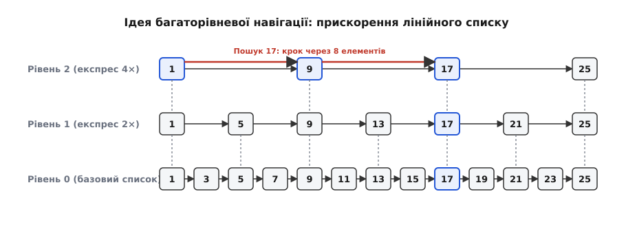
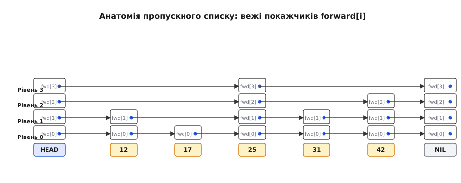
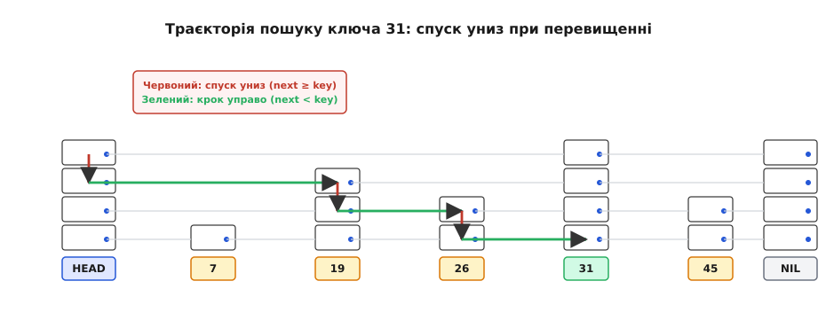
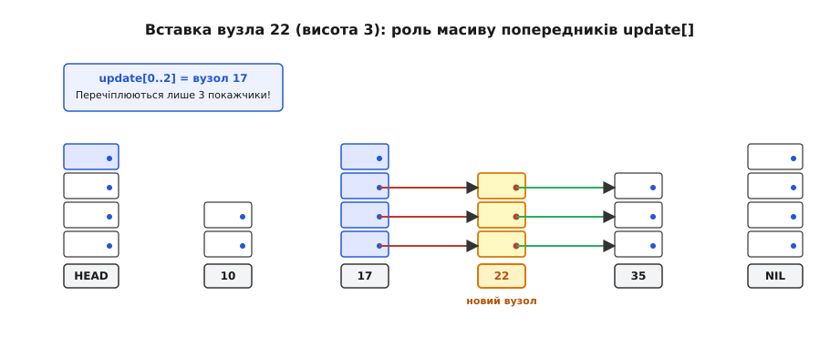
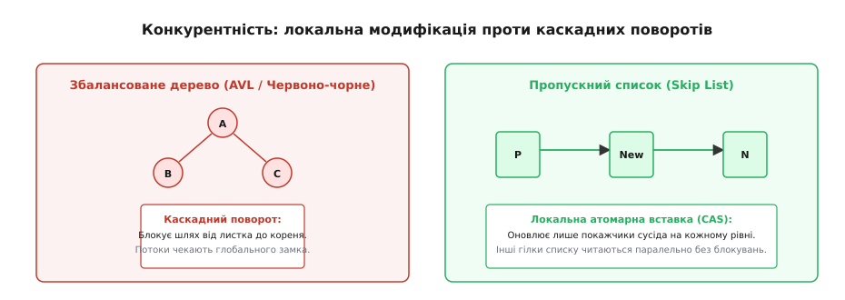

# Пропускний список (Skip List)

<preknowlist>
- [Зв'язаний список](topic:algorithms/linked-list) — лінійний однонапрямлений рух по покажчиках та ціна послідовного сканування O(n).
- [Бінарний пошук](topic:algorithms/binary-search) — логарифмічний поділ відсортованого простору пошуку за O(log n) у статичному масиві.
- [Двійкове дерево пошуку](topic:algorithms/binary-search-tree) — ієрархічне розгалуження ключів та проблема виродження незбалансованого дерева у лінійний ланцюг.
- [AVL-дерево](topic:algorithms/avl-tree) та [Червоно-чорне дерево](topic:algorithms/red-black-tree) — детерміноване самобалансування висоти через локальні повороти вузлів.
</preknowlist>

Динамічні структури даних для впорядкованого пошуку завжди стикаються з фундаментальним протиріччям між швидкістю доступу та простотою модифікації. Відсортований масив дозволяє знаходити будь-який елемент за логарифмічний час `O(log n)` за допомогою бінарного пошуку, проте вставка нового значення вимагає фізичного зсуву в середньому `n / 2` елементів у пам'яті, що займає лінійний час `O(n)`. Звичайний відсортований зв'язаний список розв'язує проблему вставки: перечіплення двох покажчиків після знаходження потрібної позиції виконується за константний час `O(1)`. Проте сам пошук позиції у зв'язаному списку неминуче вимагає послідовного перебору всіх вузлів від початку, що перетворює операцію на повільний скан `O(n)`. Для колекції з 1 000 000 записів пошук у зв'язаному списку змушений виконати до 1 000 000 розіменувань покажчиків, тоді як бінарний пошук у масиві впорався б лише за 20 порівнянь.

Збалансовані двійкові дерева пошуку — такі як AVL-дерева або червоно-чорні дерева — долають цю проблему в теорії, гарантуючи логарифмічний час `O(log n)` як для пошуку, так і для вставки та видалення. Однак ця гарантія досягається надзвичайно високою інженерною ціною. Підтримка жорстких структурних інваріантів вимагає складних рекурсивних процедур балансування: відстеження факторів балансу або кольорів вузлів, обробки численних асиметричних випадків поворотів та збереження покажчиків на батьківські вузли. У багатопотоковому середовищі ситуація стає критичною: один локальний поворот біля кореня дерева здатний заблокувати доступ до цілих піддерев, перетворюючи паралельні операції запису на вузьке місце всієї системи.

У 1989 році американський дослідник Вільям П'ю запропонував радикальний вихід із цього глухого кута. Замість жорсткого детермінованого контролю форми дерева він використав імовірнісний розподіл рівнів вузлів, створивши структуру під назвою **Пропускний список** (англ. *Skip List*). Про детальні обставини цієї публікації та академічну реакцію на відкриття можна дізнатися в окремому нарисі про [історію створення Вільямом П'ю](topic:algorithms/skip-list/hist-pugh-skiplist.md).

## 1. Від лінійного списку до швидкісних експрес-колій

Щоб зрозуміти принцип побудови пропускного списку, простежимо еволюцію звичайного однозв'язаного списку. Нехай список містить 16 відсортованих цілих чисел:

```
[1] -> [3] -> [7] -> [12] -> [17] -> [22] -> [25] -> [30] -> [35] -> [41] -> [48] -> [55] -> [62] -> [71] -> [85] -> [99]
```

Для пошуку числа `85` алгоритм повинен виконати 15 послідовних переходів. Головна причина повільності полягає в тому, що кожен вузол має покажчик лише на свого безпосереднього сусіда, позбавляючи можливості «перестрибнути» через великі блоки невідповідних даних.

Додамо над базовим списком другий рівень — «експрес-колію» (англ. *express lane*), до якої включимо кожен другий елемент:

```
Рівень 1:  [1] ---------> [7] ---------> [17] ---------> [25] ---------> [35] ---------> [48] ---------> [62] ---------> [85]
            |              |              |               |               |               |               |               |
Рівень 0:  [1]->[3]->[7]->[12]->[17]->[22]->[25]->[30]->[35]->[41]->[48]->[55]->[62]->[71]->[85]->[99]
```

Тепер пошук числа `85` кардинально змінюється. Алгоритм стартує з верхнього рівня і стрибає через один елемент: `1 -> 7 -> 17 -> 25 -> 35 -> 48 -> 62 -> 85`. Кількість кроків скоротилася вдвічі: замість 15 кроків знадобилося лише 7 переходів на рівні 1.

Додамо ще один рівень експрес-колій (Рівень 2), включивши туди кожен четвертий елемент, та Рівень 3 — з кожним восьмим елементом:


*Ієрархія експрес-колій: перехід від лінійного списку до багаторівневої структури.*

У такій 4-рівневій структурі пошук елемента `71` виглядає наступним чином:
1. На рівні 3 переходимо від `1` до `35` (`35 < 71`). Наступний крок на рівні 3 веде в `NULL` (або за межі списку).
2. Спускаємося на рівень 2 у вузлі `35`. Наступний стрибок веде до `62` (`62 < 71`). Наступний крок на рівні 2 веде в `NULL`.
3. Спускаємося на рівень 1 у вузлі `62`. Наступний стрибок веде до `85` (`85 > 71`, перевищення).
4. Спускаємося на рівень 0 у вузлі `62`. Робимо один локальний крок праворуч на рівні 0: потрапляємо точно на шуканий вузол `71`.

Сумарна кількість перевірок склала всього 5 кроків замість 14. Час пошуку в такій ідеальній структурі з `k` рівнями становить `O(log₂ n)`, оскільки на кожному кроці простір пошуку ділиться навпіл — точнісінько як у бінарному пошуку по масиву.

### Пастка детермінізму при вставці

Проте спроба підтримувати таку суворо детерміновану структуру при динамічних змінах миттєво зазнає краху. 

Уявімо, що у створений список вставляється нове число `15`. Якщо ми вимагатимемо, щоб на рівні 1 знаходився строго кожен другий елемент, вставка одного вузла змінить парність усіх наступних позицій у списку. Вузли `17, 25, 35, 48...` повинні будуть вибути з рівня 1, а вузли `22, 30, 41...` навпаки — піднятися на рівень 1. Зсув на рівні 1 неминуче зруйнує рівні 2 та 3. 

Таким чином, збереження суворої геометричної симетрії вимагає повної перебудови всіх покажчиків праворуч від точки вставки, що вимагає лінійного часу `O(n)`. Саме тут детермінований підхід стає безпорадним.

## 2. Ймовірнісний прорив: випадковий розподіл висоти вузлів

Ідея Вільяма П'ю полягала в тому, щоб **відмовитися від глобальної узгодженості позицій** і замінити її незалежним випадковим вибором для кожного окремого вузла.

Замість правила «кожен другий вузол зобов'язаний мати рівень 1», ми встановлюємо ймовірнісне правило: «кожен новостворений вузол отримує рівень 1 з імовірністю `p` (наприклад, `p = 1/2` або `p = 1/4`), рівень 2 — з імовірністю `p²`, рівень `k` — з імовірністю `p^k`».

Процедура визначення висоти вузла нагадує підкидання монети (англ. *coin tossing*):
- Новий вузол завжди присутній на рівні 0.
- Підкидаємо монету. Якщо випав «орел» (імовірність 1/2), вузол піднімається на рівень 1.
- Підкидаємо монету знову. Якщо знову «орел», піднімаємося на рівень 2.
- Процес триває доти, доки випадають «орли» або доки висота не досягне заздалегідь встановленого порогу `MaxLevel`. Перша поява «решки» зупиняє генерацію.

```
Вузол [ 3]: Рівень 0
Вузол [ 7]: Рівень 0 -> Орел -> Рівень 1
Вузол [12]: Рівень 0
Вузол [17]: Рівень 0 -> Орел -> Рівень 1 -> Орел -> Рівень 2 -> Орел -> Рівень 3
Вузол [22]: Рівень 0
Вузол [25]: Рівень 0 -> Орел -> Рівень 1
```

Висота кожного вузла визначається в момент його народження і **ніколи більше не змінюється** протягом усього перебування вузла у списку.


*Анатомія пропускного списку: вартовий вузол head, вежі покажчиків forward та геометричний розподіл висот.*

Це фундаментальне рішення кардинально спрощує модифікацію структури:
1. **Повна локальність змін:** вставка нового елемента будь-якої висоти ніяк не впливає на висоту його сусідів. Не потрібно нічого перераховувати чи зміщувати.
2. **Відсутність глобальних перебудов:** структура не знає поворотів піддерев і не вимагає перерахунку балансу.
3. **Статистична стійкість:** хоча розташування висот вузлів є випадковим, закон великих чисел гарантує, що при зростанні кількості елементів структура списку з надзвичайно високою ймовірністю залишається збалансованою, забезпечуючи логарифмічний час операцій.

Детальний математичний апарат, включно з виведенням очікуваної кількості покажчиків, дисперсії та меж Чернова, викладено в [математичному аналізі ймовірнісних меж](topic:algorithms/skip-list/math-probabilistic-analysis.md).

## 3. Анатомія пошуку: інваріант руху праворуч та вниз

Внутрішня організація пропускного списку базується на вартовому вузлі `head` (англ. *head sentinel*), який має максимальну дозволену висоту `MaxLevel` (зазвичай 32 або 64) і містить масив покажчиків `forward[0...MaxLevel-1]`.

Кожен фізичний вузол списку містить:
- Ключ `key` та значення `value`.
- Поле висоти `level`.
- Масив покажчиків `forward[0...level-1]`, де `forward[i]` вказує на наступний вузол, присутній на рівні `i`.

### Інваріант навігації

Пошук у пропускному списку підпорядковується двом простим і строгим правилам:

1. **Рух управо на поточному рівні `i`:** якщо покажчик `current->forward[i]` веде до вузла, ключ якого **строго менший** за шуканий (`current->forward[i]->key < target`), ми крокуємо вперед: `current = current->forward[i]`.
2. **Спуск униз на рівень `i - 1`:** якщо покажчик `current->forward[i]` дорівнює `NULL` або веде до вузла з ключем, **більшим або рівним** шуканому (`current->forward[i]->key >= target`), ми зупиняємо рух праворуч і опускаємося на один рівень нижче в тому самому поточному вузлі: `i = i - 1`.


*Траєкторія пошуку ключа: рух управо доки менше, крок униз при перевищенні.*

### Покроковий приклад пошуку

Нехай у списку збережено ключі `[3, 7, 12, 17, 25, 31, 42]`, а максимальний активний рівень списку дорівнює 4 (індекси від 3 до 0). Шукаємо ключ `25`:

1. **Старт:** вузол `head`, рівень 3. Покажчик `head->forward[3]` веде на вузол `17`. Оскільки `17 < 25`, переходимо на вузол `17`.
2. **На вузлі `17`, рівень 3:** покажчик `17->forward[3]` веде на `NULL`. Перехід праворуч неможливий. Спускаємося на рівень 2 у вузлі `17`.
3. **На вузлі `17`, рівень 2:** покажчик `17->forward[2]` веде на вузол `42`. Оскільки `42 >= 25`, перехід праворуч не виконується (ми проскочимо шукане число). Спускаємося на рівень 1 у вузлі `17`.
4. **На вузлі `17`, рівень 1:** покажчик `17->forward[1]` веде на вузол `25`. Оскільки `25 >= 25`, перехід праворуч знову не виконується. Спускаємося на рівень 0 у вузлі `17`.
5. **На вузлі `17`, рівень 0:** спуск досяг базового рівня. Робимо один крок уперед: `current = 17->forward[0]`, потрапляючи на вузол `25`.
6. **Перевірка результату:** порівнюємо ключ `current->key == 25`. Збіг підтверджено, пошук завершено успішно.

Якщо після спуску на рівень 0 елемент `current->forward[0]` дорівнює `NULL` або його ключ не збігається з шуканим, елемент гарантовано відсутній у структурі.

## 4. Алгоритм вставки та масив update[]

Операція вставки в пропускний список складається з трьох послідовних кроків:
1. Пошук позиції вставки та накопичення попередників у масиві `update[]`.
2. Генерація випадкової висоти нового вузла.
3. Створення нового вузла та локальне перечіплення покажчиків на всіх рівнях його висоти.

### Призначення масиву update[]

Під час вставки нового вузла висоти `k` нам потрібно оновити покажчики попередніх вузлів на всіх рівнях від 0 до `k - 1`. Проте оскільки однозв'язані списки не мають зворотних покажчиків, знайти попередників «знизу» неможливо.

Для цього під час стандартного спуску зверху вниз алгоритм записує в локальний масив `update[0...MaxLevel-1]` останній вузол, на якому відбувся спуск із кожного рівня `i`. Елемент `update[i]` — це саме той вузол, чий покажчик `forward[i]` повинен бути перенаправлений на новий елемент.


*Фіксація попередників у масиві update[] та локальне перечіплення покажчиків при вставці вузла.*

### Зв'язування покажчиків

Після генерації нового рівня `new_level` (нехай `new_level = 3`) створення зв'язків є елементарною операцією над однозв'язаним списком, повтореною для кожного шару:

:::tabs
```c
/* Локальне перечіплення покажчиків для кожного рівня нового вузла */
for (int i = 0; i < new_level; i++) {
    new_node->forward[i] = update[i]->forward[i];
    update[i]->forward[i] = new_node;
}
```
```cpp
// Ідіоматичне оновлення векторів переходів у C++
for (size_t i = 0; i < new_level; ++i) {
    new_node->forward[i] = update[i]->forward[i];
    update[i]->forward[i] = new_node;
}
```
:::

Якщо новий вузол виявився вищим за поточний максимальний рівень списку (`new_level > list->level`), елементи `update[]` для новостворених рівнів ініціалізуються вказівником на вартовий вузол `head`, а висота списку `list->level` збільшується до нового значення.

### Розбір особливих випадків вставки

1. **Вставка мінімального значення:** якщо новий ключ менший за всі присутні в списку, масив `update[0...k-1]` на всіх рівнях міститиме покажчик на вартовий вузол `head`. Новий елемент стає першим активним вузлом на кожному зі своїх рівнів.
2. **Вставка максимального значення:** якщо новий ключ перевищує всі наявні, масив `update[]` фіксує останні вузли відповідних рівнів, а покажчики `new_node->forward[i]` ініціалізуються значеннями `NULL`.
3. **Оновлення дублікатів ключів:** якщо на нульовому рівні виявлено вузол із таким самим ключем (`current->key == key`), алгоритм не виділяє пам'ять під новий вузол і не змінює структуру зв'язків, а просто перезаписує поле `value` у знайденому вузлі.

Повний виробничий код із коректним виділенням пам'яті, гнучкими масивами та шаблонними класами наведено в [практичній реалізації на C та C++](topic:algorithms/skip-list/proj-skip-list.md).

## 5. Алгоритм видалення та контроль висоти

Видалення елемента дзеркально повторює логіку вставки:

1. За допомогою стандартного спуску зверху вниз заповнюється масив `update[]`.
2. На нульовому рівні перевіряється кандидат на видалення: `target = update[0]->forward[0]`. Якщо `target == NULL` або `target->key != key`, операція завершується з ознакою невдачі без модифікації структури.
3. Якщо ключ знайдено, алгоритм проходить по рівнях знизу вгору. Якщо `update[i]->forward[i] == target`, покажчик попередника перемикається в обхід цільового вузла:
   ```
   update[i]->forward[i] = target->forward[i]
   ```
   Як тільки на черговому рівні виявляється, що `update[i]->forward[i] != target`, цикл негайно зупиняється: це означає, що висота видаленого вузла закінчилася, і на вищих рівнях він не присутній.
4. Пам'ять видаленого вузла повертається системі.
5. **Зниження верхівки списку:** якщо видалений вузол був єдиним представником найвищого рівня структури, покажчик `head->forward[list->level - 1]` стає рівним `NULL`. У такому разі алгоритм зменшує `list->level` на одиницю, запобігаючи зайвим холостим ітераціям при наступних пошуках.

Повні контракти перед- і післяумов кожної функції та зведену таблицю складності можна переглянути в [довіднику інтерфейсу та складності](topic:algorithms/skip-list/api-skip-list.md).

## 6. Чому пошук працює за O(log N): інтуїція ретроспективного аналізу

Щоб зрозуміти, чому середній час пошуку строго обмежений логарифмом, Вільям П'ю запропонував розглядати траєкторію пошуку не згори донизу, а **у зворотному напрямку — від знайденого вузла знизу вгору до вартового вузла `head`**.

Уявімо, що ми знаходимося в цільовому вузлі на рівні 0 і рухаємося назад:
- Якщо поточний вузол має покажчик на вищому рівні (тобто при підкиданні монети випав «орел» з імовірністю `p`), ми робимо крок **угору** на рівень 1.
- Якщо поточний вузол не має покажчика на вищому рівні (випала «решка» з імовірністю `1 - p`), ми змушені зробити крок **ліворуч** по поточному рівню до попереднього вузла.

Нехай `C(k)` — очікувана кількість кроків, необхідних для підйому на `k` рівнів угору. На кожному кроці з імовірністю `p` ми піднімаємося вгору (залишається піднятися на `k - 1` рівнів), а з імовірністю `1 - p` робимо крок ліворуч (залишаючись на тій самій висоті `k`):

```
C(k) = 1 + p · C(k - 1) + (1 - p) · C(k)
```

Розв'язуючи це елементарне рівняння відносно `C(k)`:

```
C(k) - (1 - p) · C(k) = 1 + p · C(k - 1)
```
```
p · C(k) = 1 + p · C(k - 1)
```
```
C(k) = (1 / p) + C(k - 1)
```

Оскільки на нульовому рівні `C(0) = 0`, розгортання рекурентності дає точну формулу:

```
C(k) = k / p
```

Очікувана максимальна висота списку для `n` елементів становить `k = log_{1/p} n`. Підставляючи це значення, отримуємо загальну очікувану вартість пошуку:

```
TotalCost = (1 / p) · log_{1/p} n
```

Для стандартного значення `p = 1/2`:
- Очікувана висота списку: `log₂ n`.
- Кількість кроків на кожному рівні: `1 / (1/2) = 2`.
- Загальна середня кількість переходів: `2 · log₂ n`.

Для списку з 1 000 000 елементів середня траєкторія пошуку становить лише `2 · 20 = 40` переходів по покажчиках.

## 7. Вибір параметра ймовірності: p = 1/2 проти p = 1/4

Параметр `p` визначає компроміс між витратами оперативної пам'яті та швидкістю пошуку:

| Характеристика | Конфігурація `p = 1/2` (50%) | Конфігурація `p = 1/4` (25%) |
| :--- | :--- | :--- |
| **Середня кількість покажчиків на вузол** | `1 / (1 - 1/2) = 2.00` | `1 / (1 - 1/4) = 1.33` |
| **Очікувана висота вежі (`n = 10⁶`)** | `log₂ 10⁶ ≈ 20` рівнів | `log₄ 10⁶ ≈ 10` рівнів |
| **Кількість порівнянь на рівень** | `1 / (1/2) = 2.00` | `1 / (1/4) = 4.00` (макс) / `2.67` |
| **Середня кількість переходів (`n = 10⁶`)** | `20 · 2 = 40` кроків | `10 · 2.67 ≈ 27` кроків |
| **Витрати пам'яті під покажчики** | 100% (базовий рівень) | **-33% економії пам'яті** |

При переході від `p = 1/2` до `p = 1/4` середня кількість покажчиків на один вузол зменшується з 2.0 до 1.33. Це означає, що **кожен вузол витрачає лише 1.33 покажчика (близько 11 байтів на 64-бітній системі)**, що значно менше, ніж у будь-якому бінарному дереві пошуку (де кожен вузол обов'язково містить 2 або 3 покажчики: `left`, `right`, `parent`).

Саме конфігурація `p = 1/4` є промисловим стандартом у високонавантажених сховищах даних, таких як Redis та RocksDB.

## 8. Пропускний список проти червоно-чорних та AVL-дерев

Зіставимо пропускний список із традиційними збалансованими деревами пошуку за ключовими інженерними критеріями:

### 1. Складність реалізації та надійність коду

Реалізація червоно-чорного дерева вимагає написання понад 400–600 рядків складного коду з обробкою 8 специфічних випадків балансування (повороти з перефарбовуванням вузлів, обробка «дядьків» та «племінників»). Найменша помилка в інваріанті кольору призводить до поступової непомітної деградації дерева у лінійний список.

Пропускний список реалізується менш ніж у 150 рядках простого, прямолінійного коду на C. Усі процедури — пошук, вставка, видалення — використовують єдиний шаблон навігації та масив `update[]`, що мінімізує ймовірність багів.

### 2. Витрати оперативної пам'яті

Вузол червоно-чорного дерева в 64-бітній системі містить:
- 3 покажчики по 8 байтів (`left`, `right`, `parent`) = 24 байти.
- Поле кольору `color` (1 байт) + 7 байтів вирівнювання = 8 байтів.
- Ключ і значення = 8–16 байтів.
- **Сумарно: 40–48 байтів на вузол.**

Вузол пропускного списку при `p = 1/4`:
- Заголовок вузла (`key`, `value`, `level`) = 16 байтів.
- Масив `forward[]` (у середньому 1.33 покажчика) = 10.67 байтів.
- **Сумарно: близько 26.67 байтів на вузол.**

Пропускний список заощаджує майже вдвічі більше пам'яті на метаданих структури.

### 3. Діапазонні вибірки (Range Queries) та ітерування

У червоно-чорному дереві послідовний обхід відсортованого діапазону вимагає збереження стеку викликів глибиною `O(log n)` або переходів по покажчиках на батьківські вузли з постійною зміною напрямку обходу (in-order traversal).

У пропускному списку всі вузли нульового рівня вже з'єднані в прямий лінійний відсортований список. Діапазонний запит виконується за один пошук початкового вузла `O(log n)`, після чого алгоритм просто біжить по покажчиках `forward[0]` зі швидкістю звичайного масиву.

### 4. Мікроархітектурна поведінка кешу та передбачення переходів

На рівні апаратного виконання сучасних процесорів (x86-64, ARM64) поведінка пропускного списку має виразні особливості:
- **Передбачення розгалужень (Branch Prediction):** внутрішній цикл пошуку в пропускному списку є винятково компактним. Умова `current->forward[i]->key < target` має високий рівень передбачуваності на верхніх рівнях, що знижує штрафи за скидання конвеєра інструкцій (англ. *pipeline flush*).
- **Кеш-локальність:** на відміну від B-дерев, де в одному вузлі розташовано від десятків до сотень ключів у суцільному масиві (що дає чудову кеш-локальність для читання з диска або оперативної пам'яті), пропускний список залишається структурою на базі покажчиків. Проте під час діапазонного сканування послідовне читання вузлів нульового рівня активує апаратний механізм попередньої вибірки пам'яті процесора (англ. *Hardware Prefetcher*), забезпечуючи високу пропускну здатність шини пам'яті.

## 9. Багатопотокова революція: Lock-Free Skip List у сучасних СУБД

Справжнім тріумфом пропускних списків стала поява багатоядерних процесорів та систем паралельної обробки даних реального часу.

У червоно-чорному або AVL-дереві операція вставки нового вузла може спричинити каскад обертань, які піднімаються від листків до самого кореня. Щоб гарантувати цілісність дерева під час багатопотокового запису, потік-письменник змушений блокувати цілі піддерева (а іноді й корінь усього дерева через глобальний `Mutex`). Коли десятки потоків намагаються одночасно записувати дані в одне дерево, продуктивність катастрофічно падає через взаємні блокування.


*Локальність модифікацій: потоки оновлюють неперетинні діапазони через CAS без глобальних блокувань.*

У пропускному списку модифікації є **суто локальними**:
- Вставка нового вузла впливає лише на його безпосередніх сусідів, зафіксованих у масиві `update[]`.
- Для зміни покажчиків не потрібні блокування м'ютексами: достатньо застосувати атомарну інструкцію процесора `Compare-And-Swap` (CAS).
- Письменники, які працюють у різних частинах діапазону ключів (наприклад, потік A вставляє ключ `15`, а потік B — ключ `88`), взагалі не конфліктують між собою і виконують вставки паралельно на повній швидкості процесорних ядер.
- Читачі виконують пошук без жодних блокувань (англ. *lock-free reads*), завжди бачачи консистентний стан списку завдяки атомарному оновленню покажчиків нульового рівня.

### Протокол безпечного неблокувального видалення (Harris-Michael)

Для безпечного видалення в паралельному режимі застосовують двоетапний підхід:
1. **Логічне видалення:** наймолодший біт покажчика `forward[i]` атомарно виставляється в `1` через інструкцію CAS. Це блокує можливість іншим потокам додавати нові вузли після нього, сигналізуючи про те, що вузол підлягає утилізації.
2. **Фізичне перечіплення:** попередник перемикається в обхід позначеного вузла.
3. **Безпечне звільнення пам'яті:** пам'ять вузла звільняється лише тоді, коли всі читачі, що могли його бачити, завершили свою роботу (через епохальні збирачі RCU або покажчики небезпеки Hazard Pointers).

### Де працюють пропускні списки сьогодні

1. **RocksDB та LevelDB:** впорядкований буфер пам'яті `MemTable` у цих популярних рушіях зберігання даних побудований виключно на базі високоефективного неблокувального `ConcurrentSkipList`. Усі операції запису в базах даних таких гігантів, як Meta, Google, Kafka та CockroachDB, проходять через пропускні списки.
2. **Redis Sorted Sets (`zset`):** високоефективні команди рейтингу та діапазонів (`ZRANGE`, `ZRANK`, `ZREVRANGEBYSCORE`) реалізовані на розширеному пропускному списку з масивом довжин переходів `span[]`.
3. **Java Virtual Machine (`java.util.concurrent`):** стандартна бібліотека Java містить клас `ConcurrentSkipListMap`, який використовується як де-факто стандарт масштабованого багатопотокового впорядкованого словника.

## 10. Розширення: Ранговий пропускний список та локалізований пошук

Пропускний список легко розширюється спеціалізованими можливостями, які у деревах пошуку вимагають громіздких модифікацій:

### 1. Ранговий пошук за O(log N) (Ranked Skip List)

Якщо в кожен покажчик `forward[i]` додати додаткове числове поле `span[i]`, яке фіксує кількість вузлів нульового рівня, що перестрибуються цим покажчиком, пропускний список перетворюється на **Ранговий список** (англ. *Ranked / Indexed Skip List*):
- Визначення рангу (1-індексованого порядкового номера) будь-якого елемента у відсортованій множині за час `O(log n)`.
- Пошук елемента за його номером (наприклад, знайти 500-й елемент) за логарифмічний час `O(log n)` шляхом додавання довжин `span[i]` під час спуску.

Саме ця модифікація лежить в основі миттєвих рейтингів у системі Redis.

### 2. Локалізований пошук від вказівника (Finger Search)

Якщо клієнтський додаток зберігає покажчик на попередньо знайдений вузол `finger` і наступний шуканий ключ розташований близько до нього (на відстані `d`), алгоритм може стартувати пошук безпосередньо з позиції `finger`, піднімаючись по його вежі покажчиків угору до потрібної висоти, а потім опускаючись до цілі. 

Час такого локалізованого пошуку зменшується з `O(log n)` до `O(log d)`, що забезпечує колосальне прискорення під час обробки локалізованих пакетних запитів.

## 11. Практичні патерни застосування у великих розподілених системах

Пропускний список став наріжним каменем архітектури сучасних баз даних завдяки вдалому поєднанню з трьома системними патернами:

### 1. Потокова генерація SSTable у дискових рушіях (LSM-Tree)

У системах зберігання даних на основі дерева зі структурованим журналом (LSM-дерево) дані спочатку потрапляють у пам'ять, а потім пакетно скидаються на диск. Оскільки дискові файли SSTable вимагають суворо впорядкованого запису ключів, пропускний список є ідеальним буфером: фоновому процесу злиття не потрібно сортувати масив перед скиданням на диск — достатньо пройтися по покажчиках `forward[0]` за час `O(n)`.

### 2. Просторові та геометричні індекси на базі кривих заповнення простору

Завдяки підтримці швидких діапазонних вибірок пропускний список часто використовується для багатовимірної індексації. Багатовимірні координати (наприклад, широта та довгота) перетворюються на одновимірний ключ за допомогою кривої Мортона (Z-order curve) або кривої Гільберта. Отримані 64-бітні ідентифікатори зберігаються у звичайному пропускному списку, дозволяючи виконувати геопросторові запити типу «знайти всі об'єкти в радіусі 5 км» як серію швидких діапазонних вибірок `[k_start, k_end]`.

### 3. Гібридні компактні структури пам'яті (Ziplist + Skiplist)

У системах керування кешем (наприклад, Redis) пам'ять є найбільш критичним ресурсом. Для колекцій невеликого розміру (до кількох сотень елементів) накладні витрати на покажчики пропускного списку можуть бути відчутними. Тому застосовується адаптивна стратегія: поки елементів мало, вони зберігаються у щільному лінійному байтовому масиві без покажчиків (`ziplist`). Як тільки кількість записів перевищує поріг, масив автоматично перетворюється на повнорозмірний пропускний список, гарантуючи захист від деградації часу доступу при зростанні навантаження.

## Підсумок архітектурних переваг

Пропускний список Вільяма П'ю демонструє один із найелегантніших прикладів того, як усвідомлений перехід від суворого детермінізму до керованої ймовірності дозволяє усунути надмірну складність без втрати ефективності. Замінюючи громіздкі обертання збалансованих дерев швидким побітовим підкиданням монети, пропускний список забезпечує логарифмічну швидкість `O(log n)`, виняткову простоту коду, вдвічі менші накладні витрати пам'яті та неперевершену масштабованість у багатопотокових системах зберігання даних нового покоління.
