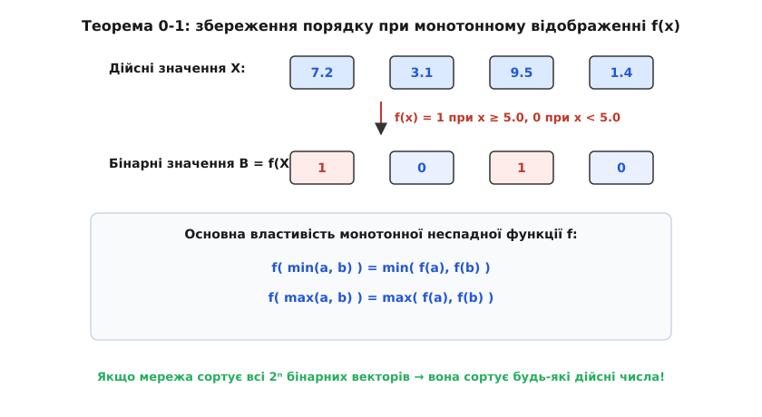

# 𝒪 Теорема 0-1 (Zero-One Principle) та комбінаторна складність мереж

Аналіз сортувальних мереж вимагає відповідей на два фундаментальні питання: як довести, що мережа правильно впорядковує будь-які можливі вхідні дані, і якими є нижні межі кількості компараторів та паралельних тактів.

## Формальне визначення сортувальної мережі

Нехай `N` — кількість входів (дротів). Вхідний вектор є послідовністю дійсних чисел `X = (x₀, x₁, …, x[N-1]) ∈ ℝᴺ`.

Компаратор `C(i, j)`, де `0 ≤ i < j < N`, визначено як оператор, що перетворює вектор `X` у новий вектор `X'`, змінюючи лише компоненти з індексами `i` та `j`:

```
x'_i = min(x_i, x_j)
x'_j = max(x_i, x_j)
x'_k = x_k  для всіх k ≠ i, j
```

Сортувальна мережа `R` розміру `S` — це впорядкована послідовність компараторів `(C₁, C₂, …, C[S])`. Мережа є **правильною сортувальною мережею**, якщо для будь-якого вхідного вектора `X ∈ ℝᴺ` вихідний вектор `R(X) = (y₀, y₁, …, y[N-1])` задовольняє умову монотонності:

```
y₀ ≤ y₁ ≤ y₂ ≤ ... ≤ y_{N-1}
```

Пряма перевірка правильності мережі за визначенням вимагає аналізу всіх можливих перестановок елементів. Для масиву з `N` унікальних елементів кількість можливих вхідних порядків дорівнює `N!`. Уже для `N = 16` це становить `16! ≈ 2.09 × 10¹³` комбінацій, що робить повний перебір для великих `N` практично неможливим.



## Теорема 0-1 (Zero-One Principle)

Теорема 0-1 значно спрощує верифікацію мереж, зменшуючи простір тестових даних із `N!` перестановок до `2ᴺ` бінарних векторів.

> **Теорема (Кнут, 1973):** Якщо сортувальна мережа з `N` дротів правильно сортує всі `2ᴺ` можливі вхідні послідовності з нулів та одиниць (тобто вектори `B ∈ {0, 1}ᴺ`), то вона правильно відсортує будь-яку послідовність із `N` довільних дійсних чисел `X ∈ ℝᴺ`.

### Лемма про монотонне перетворення
Для доведення теореми використаємо лему про комутативність компараторів із монотонно неспадною функцією.

**Лема:** Нехай `f: ℝ → ℝ` — монотонно неспадна функція, тобто якщо `a ≤ b`, то `f(a) ≤ f(b)`. Тоді для будь-яких дійсних чисел `a` та `b` виконуються тотожності:

```
f( min(a, b) ) = min( f(a), f(b) )
f( max(a, b) ) = max( f(a), f(b) )
```

**Доведення леми:**
Розглянемо два випадки:
1. Якщо `a ≤ b`, то `min(a, b) = a` та `max(a, b) = b`. Оскільки `f` монотонна, `f(a) ≤ f(b)`, тому `min(f(a), f(b)) = f(a) = f(min(a, b))` та `max(f(a), f(b)) = f(b) = f(max(a, b))`.
2. Якщо `a > b`, міркування аналогічні за симетрією.

Звідси випливає, що дія будь-якої сортувальної мережі `R` комутує з покомпонентним застосуванням монотонної функції `f`:

```
f( R(X) ) = R( f(X) )
```

де `f(X) = (f(x₀), f(x₁), …, f(x[N-1]))`.

### Доведення теореми 0-1 від супротивного

Припустимо протилежне: мережа `R` правильно сортує всі бінарні вектори з `{0, 1}ᴺ`, але існує вектор дійсних чисел `X = (x₀, x₁, …, x[N-1])`, який мережа сортує неправильно.

Нехай вихідний вектор `R(X) = Y = (y₀, y₁, …, y[N-1])` містить помилку впорядкування. Це означає, що знаходяться два сусідні елементи, для яких порушено порядок:

```
y_k > y_{k+1}  для деякого 0 ≤ k < N - 1
```

Побудуємо порогову монотонно неспадну функцію `f: ℝ → {0, 1}` за правилом:

```
f(t) = 0,  якщо t ≤ y_{k+1}
f(t) = 1,  якщо t > y_{k+1}
```

Оскільки `f` є монотонно неспадною, ми можемо застосувати лему комутативності. Застосуємо `f` до вихідного вектора `Y`:

```
f(y_k) = 1  (бо y_k > y_{k+1})
f(y_{k+1}) = 0  (бо y_{k+1} ≤ y_{k+1})
```

Отже, вектор `f(Y) = f(R(X))` містить вихідне значення `1` на позиції `k` і значення `0` на позиції `k+1`. Проте за лемою:

```
f( R(X) ) = R( f(X) )
```

Вектор `B = f(X)` складається виключно з нулів та одиниць, оскільки область значень `f` це `{0, 1}`. За нашим припущенням, мережа `R` зобов'язана правильно сортувати всі бінарні вектори. Отже, вихідний вектор `R(B)` мусить бути впорядкованим, тобто всі нулі мають передувати всім одиницям:

```
0 ≤ 0 ≤ ... ≤ 0 ≤ 1 ≤ 1 ... ≤ 1
```

У такому відсортованому бінарному векторі неможлива ситуація, коли на позиції `k` стоїть `1`, а на позиції `k+1` стоїть `0`. Ми отримали суперечність.

Отже, припущення хибне, і мережа `R` правильно сортує будь-який вектор дійсних чисел. Теорему доведено.

## Комбінаторні межі розміру та глибини

Ефективність сортувальної мережі оцінюється двома основними параметрами:
1. **Розмір `S(N)`**: загальна кількість компараторів у мережі.
2. **Глибина `D(N)`**: мінімальна кількість тактів (паралельних шарів), за яку мережа обчислює результат.

### Нижнє обмеження розміру `S(N)`
Будь-який послідовний алгоритм сортування порівняннями має нижню межу `Ω(N log₂ N)` операцій. Для сортувальних мереж ця межа також виконується:

```
S(N) ≥ ⌈ log₂ (N!) ⌉ ≈ N log₂ N - 1.44 N
```

Для бітонічного сортування Батчера розмір становить:

```
S_{bitonic}(N) = (N log₂² N + N log₂ N) / 4 = Θ(N log₂² N)
```

### Нижнє обмеження глибини `D(N)`
Шлях елемента від входу до виходу в мережі глибини `D` може пройти максимум через `D` компараторів. Кожен компаратор може роздвоїти кількість можливих інформаційних станів. Оскільки існує `N!` перестановок вхідних даних:

```
2^D ≥ N!  ⇒  D(N) ≥ ⌈ log₂ (N!) ⌉ / (N / 2) = Ω(log N)
```

### Точні мінімальні значення для малих N
Для малих значень `N` оптимальні розміри `S_min(N)` та глибини `D_min(N)` знайдено за допомогою комп'ютерного аналізу та методів SAT-solvers:

| N (дротів) | Мінімальний розмір S_min | Мінімальна глибина D_min | Алгоритм Батчера (S / D) |
|---|---|---|---|
| 1 | 0 | 0 | 0 / 0 |
| 2 | 1 | 1 | 1 / 1 |
| 3 | 3 | 3 | 3 / 3 |
| 4 | 5 | 3 | 6 / 3 |
| 5 | 9 | 5 | 9 / 5 |
| 6 | 12 | 5 | 12 / 5 |
| 7 | 16 | 6 | 18 / 6 |
| 8 | 19 | 6 | 19 / 6 |
| 16 | 60 | 9 | 80 / 10 |

Як видно з таблиці, для `N = 8` бітонічне сортування Батчера досягає математично мінімальної глибини (`D = 6`) та розміру (`S = 19`), що робить його абсолютно оптимальним для малих векторних регістрів.
