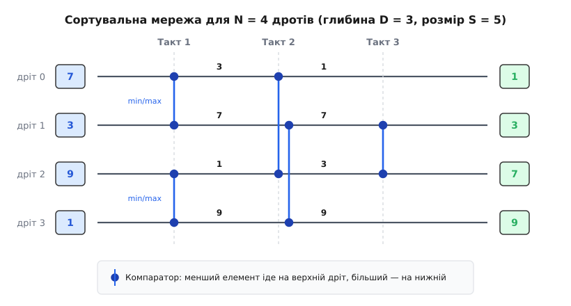
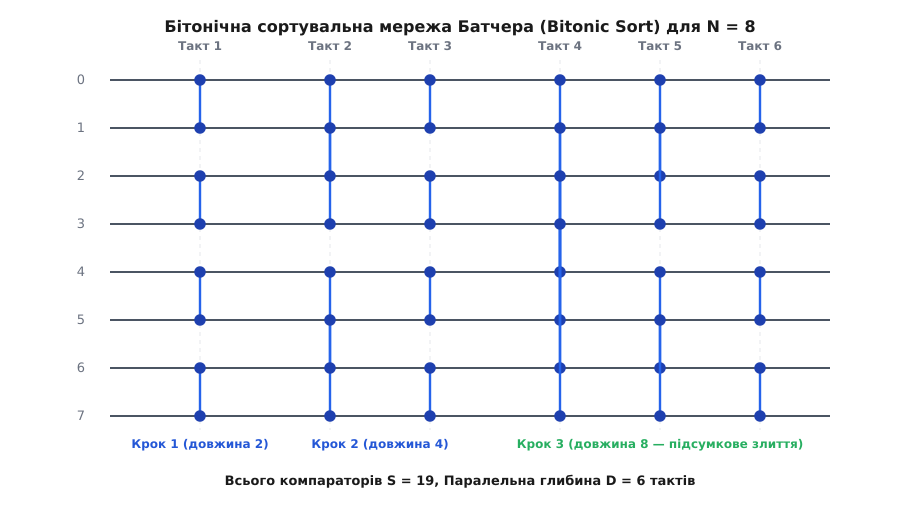

# Сортувальні мережі: сортування без розгалужень та паралельна обробка

<preknowlist>
- [Асимптотична складність](book:algorithms/asymptotic-complexity) — оцінка часу та пам'яті через O-нотацію.
- [Сортування вибором](book:algorithms/selection-sort) — класичний алгоритм порівняння та обміну.
- [Масив](book:algorithms/array) — послідовна структура даних у пам'яті.
</preknowlist>

Уявіть, що перед вашим обчислювальним сервером стоїть завдання: потрібно щосекунди сортувати мільйони малих масивів, кожен із яких містить усього по 8 або 16 елементів. Це типова задача для графічних рушіїв, обробки відеокадрів, систем стиснення даних, аналізу фінансових потоків або первинної обробки сигналів у цифрових радарах. 

Якщо ви спробуєте вирішити це завдання класичним швидким сортуванням (Quicksort), сортуванням купою (Heapsort) чи навіть оптимізованим сортуванням злиттям (Mergesort), ви швидко виявите, що сучасні процесори працюють далеко не на повну потужність. Центральний процесор витратить більше часу на передбачення напрямку умовних переходів (`if (a > b)`), ніж на безпосередні математичні обчислення. Сучасний конвеєр інструкцій буде постійно скидатися через промахи передбачувача розгалужень (branch mispredictions). Ще гірша ситуація виникне на графічних процесорах (GPU) або векторних прискорювачах (SIMD): сусідні обчислювальні канали розійдуться по різних гілках виконання, зводячи паралелізм до нуля та змушуючи ядра процесора чекати одне одного.

Як сортувати дані, коли традиційні умовні оператори `if` стають головним ворогом швидкодії? Відповідь дає фундаментальна концепція **сортувальних мереж (sorting networks)**. Це специфічний клас алгоритмів сортування, у яких послідовність порівнянь і обмінів є абсолютно статичною та фіксується ще до початку обчислень. Незалежно від того, які саме числа подано на вхід — вже відсортовані, впорядковані у зворотному порядку чи повністю випадкові — мережа виконає суворо визначену, заздалегідь відому послідовність операцій. 

Такий підхід повністю усуває залежність керування від даних, перетворюючи алгоритм сортування на жорсткий, статичний обчислювальний граф. Це відкриває двері для апаратної реалізації на мікросхемах FPGA, виконання над векторними регістрами AVX-2 / AVX-512 та ARM Neon, а також сортування мільйонів масивів у тисячах паралельних потоків на GPU без жодної затримки на синхронізацію чи розгалуження.

## ЧОМУ класичні сортування ламаються на сучасному залізі

Щоб зрозуміти глибоку мотивацію створення сортувальних мереж, варто розібратися у мікроархітектурних процесах сучасних обчислювальних систем. Класичні алгоритми сортування порівняннями спираються на динамічний вибір напрямку обчислень залежно від значення вхідних елементів:

```
ЯКЩО елемент_A > елемент_B:
    Поміняти місцями (A, B)
ІНАКШЕ:
    Залишити як є
```

На послідовному процесорі з класичною архітектурою фон Неймана цей код здається абсолютно природним. Проте сучасні процесори є суперскалярними та конвеєрними: вони виконують десятки інструкцій одночасно, намагаючись передбачити результат умовного переходу `ЯКЩО` ще до того, як фактичне порівняння буде завершено.

Якщо вхідні дані є випадковими числами, ймовірність правильно вгадати напрямок переходу для випадкової пари елементів становить близько 50%. Щоразу, коли передбачувач розгалужень (branch predictor) процесора помиляється, відбувається провал конвеєра (pipeline flush):
- Усі інструкції, які процесор встиг спекулятивно виконати за помилковою гілкою, повністю анулюються;
- Конвеєр очищається й завантажує інструкції з правильної гілки;
- Штраф за один такий промашок становить від 15 до 30 марно втрачених тактів процесора.

Для масиву з 16 елементів класичне сортування виконує близько 60 порівнянь. Якщо половина з них спричинить промахи передбачувача, процесор витратить на штрафні такти понад 450 тактів годинника, хоча самі обчислення вимагають лише кількох десятків тактів!

```
Динамічне сортування (Quicksort/Mergesort):
[Порівняння A > B] ──► [Галуження if] ──► [Промашок передбачувача] ──► [Скидання конвеєра: +20 тактів]

Статичне сортування (Сортувальна мережа):
[Векторний вхід] ────► [Компаратор min/max] ──► [Наступний такт] ──► [Результат без зупинок]
```

На векторних прискорювачах (SIMD) та графічних процесорах (GPU) ситуація стає ще критичнішою. GPU обробляє дані групами потоків (варпами по 32 потоки в NVIDIA CUDA або вейвфронтами по 64 потоки в AMD ROCm). Усі потоки всередині варпу виконані за архітектурою SIMD/SIMT (Single Instruction, Multiple Data/Threads) і змушені виконувати **одну й ту саму інструкцію** в кожен момент часу.

Якщо для 15 потоків усередині варпу умова `A > B` виявилася істинною, а для решти 17 — хибною, виникає **розходження потоків (thread divergence)**:
1. GPU тимчасово маскує 17 потоків і виконує гілку обміну `Swap` для перших 15 потоків.
2. Потім GPU маскує перші 15 потоків і виконує порожню гілку для решти 17 потоків.
3. Продуктивність апаратури падає вдвічі, оскільки обчислювальні ядра змушені послідовно відпрацьовувати обидві гілки коду.

Сортувальні мережі усувають цю проблему повністю: у них немає умовних операторів `if`. Послідовність порівнянь відома заздалегідь і не змінюється від вхідних даних.

## Анатомія та фізична модель сортувальної мережі

Логічна та фізична модель сортувальної мережі будується на двох фундаментальних поняттях: **дротах (wires)** та **компараторах (comparators)**.

### 1. Дроти (проводи даних)
Уявляються як паралельні горизонтальні лінії, якими дані рухаються ліворуч направо від входу до виходу. Якщо мережа сортує `N` елементів, вона має `N` дротів, які нумеруються від `0` до `N - 1`.
- У програмній реалізації дріт відповідає конкретному індексу масиву або векторного регістра;
- У фізичній апаратній реалізації (FPGA або ASIC) дріт — це реальна металева шина передачі даних шириною в 8, 16, 32 або 64 біти.

### 2. 2-вхідні компаратори
Уявляються як вертикальні відрізки, що з'єднують два дроти `i` та `j` (де `i < j`). 



Коли два значення `x[i]` та `x[j]` доходять до компаратора `C(i, j)`, компаратор порівнює їх і переставляє так, щоб менше значення пішло по верхньому дріту `i`, а більше — по нижньому дріту `j`:

```
Вихід верхнього дроту:  x'_i = min(x_i, x_j)
Вихід нижнього дроту:   x'_j = max(x_i, x_j)
```

В апаратурі або в програмі компаратор реалізується без умовних операторів за допомогою побітових масок або безнапрямних інструкцій мінімуму та максимуму (`std::min`/`std::max` у C++, `_mm256_min_epi32`/`_mm256_max_epi32` у SIMD):

```
x'_i = x_i ^ ((x_i ^ x_j) & -(x_i > x_j))
x'_j = x_i ^ x_j ^ x'_i
```

В архітектурі x86-64 для цього використовуються інструкції умовного пересилання `cmov` (conditional move), а в ARM64 — інструкції `csel` (conditional select). Жодного розгалуження в машиному коді при цьому не створюється.

> 🔧 **Навіщо це.**
> Сортувальні мережі є основою для побудови векторних сортувальників у сучасних комбінаторних бібліотеках (наприклад, `std::sort` у високопродуктивних реалізаціях C++ libstdc++ та LLVM libc++ використовує мережі сортування для фіксованих масивів розміром до 16 або 32 елементів). Вони також використовуються в апаратних сортувальних блоках у мережевих маршрутизаторах, де потрібно впорядковувати заголовки пакетів на швидкості 400 Гбіт/с без найменших затримок на розгалуження.

### Ключові метрики ефективності мережі: Розмір і Глибина
Ефективність сортувальної мережі вимірюється не просто загальною кількістю операцій, а двома геометричними й часовими параметрами:

- **Розмір мережі `S(N)`**: загальна кількість компараторів у схемі. Цей параметр визначає апаратні витрати (кількість логічних вентилів у мікросхемі або кількість інструкцій у коді).
- **Глибина мережі `D(N)`**: мінімальна кількість тактів (пакетів/шарів), за яку мережа виконує обчислення, якщо всі компаратори, які не мають спільних дротів, виконуються **одночасно**.

Розглянемо приклад: якщо в мережі на 4 дроти у першому такті діють два компаратори — на дріти `(0, 1)` та на дріти `(2, 3)`, вони не перетинаються за дрітами. Це означає, що апаратура може виконати їх абсолютно паралельно за **один часовий такт**. Якщо ж наступний компаратор діє на дріти `(1, 2)`, він має спільні дроти з попередніми, тому мусить виконуватися послідовно у другому такті.

Таким чином, якщо послідовний алгоритм вимагає `O(N log N)` порівнянь, то паралельна сортувальна мережа може виконувати сортування за глибину `D(N) = O(log² N)` або навіть `O(log N)` тактів!

## Теорема 0-1: Як верифікувати сортувальну мережу

Як переконатися, що створена нами сортувальна мережа з `N` дротів дійсно сортує будь-які можливі вхідні дані?

Масив із `N` унікальних дійсних чисел має `N!` можливих порядків прямування. Для масиву з `N = 16` елементів кількість перестановок становить `16! ≈ 20.9` трильйона комбінацій. Пряма перевірка мережі для всіх перестановок вимагала б кількох днів обчислень на суперкомп'ютері. На щастя, існує фундаментальне математичне відкриття Дональда Кнута — **Теорема 0-1 (Zero-One Principle)**.


> **Теорема 0-1 (Кнут, 1973):** Якщо сортувальна мережа правильно сортує всі `2ᴺ` можливих вхідних векторів, що складаються виключно з нулів та одиниць, то вона гарантовано правильно відсортує будь-який вектор з `N` довільних дійсних чисел.

Основна ідея доведення спирається на монотонні неспадні функції. Для будь-якої монотонної функції `f(x)` і будь-яких чисел `a, b` виконуються тотожності:

```
f( min(a, b) ) = min( f(a), f(b) )
f( max(a, b) ) = max( f(a), f(b) )
```

Це означає, що покомпонентне застосування монотонної порогової функції `f(x)` комутує з дією сортувальної мережі. Якщо мережа припускається помилки на якомусь масиві дійсних чисел, можна побудувати порогову функцію `f`, яка перетворить цей масив на бінарний вектор `0-1`, на якому мережа також припуститься помилки.

Детальний формальний математичний доказ та комбінаторні межі складності наведено у вставці [Теорема 0-1 та комбінаторна складність](book:algorithms/sorting-networks/math-zero-one-principle.md).

Завдяки теоремі 0-1 кількість необхідних перевірочних тестів для `N = 16` скорочується з `20.9` трильйона перестановок до всього `2¹⁶ = 65536` бінарних векторів! Це дозволяє повністю верифікувати будь-які сортувальні мережі за частки секунди за допомогою побітових автоматизованих засобів (SAT-solvers).

## Конструкції сортувальних мереж: від Батчера до AKS

Існують різні комбінаторні алгоритми побудови сортувальних мереж. Розглянемо найважливіші з них.

### 1. Бітонічне сортування Батчера (Bitonic Sort)
Винайдене американським математиком Кеном Батчером у 1968 році (детальніше про це — у вставці [Історія сортувальних мереж](book:algorithms/sorting-networks/hist-sorting-networks.md)), бітонічне сортування залишається найпопулярнішим практичним алгоритмом для апаратної та векторної реалізації.



В основі алгоритму лежить поняття **бітонічної послідовності** — масиву, який спочатку монотонно зростає, а потім монотонно спадає (наприклад, `1, 4, 7, 8, 5, 2, 0`), або який можна циклічно зсунути до такого стану.

Алгоритм побудовано за рекурсивним принципом:
1. **Формування бітонічних пар**: початкові компаратори сортують суміжні пари елементів у протилежних напрямках (одна пара за зростанням ⬆, сусідня — за спаданням ⬇).
2. **Утворення більших бітонічних блоків**: сполучення двох протилежно відсортованих послідовностей довжини `M` утворює єдину бітонічну послідовність довжини `2M`.
3. **Каскадне бітонічне злиття (Bitonic Merge)**: серія компараторів порівнює елементи `x[i]` та `x[i + M/2]`. Це розбиває бітонічну послідовність на дві менші бітонічні послідовності, де всі елементи лівої частини менші за будь-який елемент правої частини.

Характеристики бітонічного сортування для `N = 2ᵏ`:
- **Глибина `D(N)`**: `D(N) = log₂N·(log₂N + 1)/2 = Θ(log² N)` тактів.
- **Розмір `S(N)`**: `S(N) = (N·(log₂N)² + N·log₂N)/4 = Θ(N log² N)` компараторів.

Для `N = 8` дротів алгоритм Батчера потребує `S = 19` компараторів та `D = 6` паралельних тактів, що є абсолютним недосяжним математичним мінімумом для масивів такого розміру!

### 2. Непарно-парне злиття Батчера (Odd-Even Mergesort)
Другий алгоритм Батчера, який використовує принцип розділення масиву на елементи з непарними та парними індексами. Спочатку рекурсивно сортуються елементи з непарними індексами та елементи з парними індексами, після чого вони зливаються легким каскадом компараторів `(1, 2), (3, 4), (5, 6)...`.

За характеристиками глибини (`O(log² N)`) Odd-Even Mergesort подібне до бітонічного сортування, але має дещо меншу кількість компараторів для деяких розмірів `N`.

### 3. Теоретична мережа AKS (Ajtai-Komlós-Szemerédi)
У 1983 році математики Айтаї, Комлош та Семеребі створили теоретичну мережу сортування з логарифмічною глибиною `D(N) = O(log N)` та розміром `S(N) = O(N log N)`.

Проте мережа AKS має суто теоретичне значення і є яскравим прикладом так званого «галактичного алгоритму». Константа в оцінці `O(log N)` для мережі AKS перевищує `10⁸⁰`. Це означає, що на практиці для будь-яких реальних обсягів даних (`N < 10¹⁸`) бітонічне сортування Батчера з глибиною `O(log² N)` працює в десятки разів швидше за мережу AKS!

## Практична реалізація та апаратне застосування

Сортувальні мережі є основним практичним рішенням у трьох ключових областях сучасного програмування:

### 1. Векторна SIMD-оптимізація (C++ / Rust)
Замість того, щоб сортувати елементи по одному у звичайній оперативній пам'яті, векторний регістр AVX-512 (512 біт) може містити 16 цілих чисел 32-біт. За допомогою ітеративної сортувальної мережі 16 елементів сортуються прямо у векторних регістрах за 10 тактів інструкцій `_mm512_min_epi32` та `_mm512_max_epi32` без жодного звернення до RAM.

Детальний приклад реалізації бітонічного сортувальника мовами C++ та Python наведено у вставці [Практична реалізація бітонічного сортувальника](book:algorithms/sorting-networks/proj-bitonic-sort.md).

### 2. Графічні прискорювачі (GPU CUDA / ROCm)
На GPU сортувальні мережі є основним інструментом для швидкого сортування всередині одного варпу (32 потоки). Завдяки спеціальним інструкціям обміну регістрами між потоками (`__shfl_xor_sync`), потоки варпу можуть сортувати 32 значення взагалі без використання логіки Shared Memory, передаючи дані безпосередньо з регістра в регістр за 5 тактів!

### 3. Потокові схеми FPGA та ASIC
На FPGA сортувальна мережа будується у вигляді фізичного конвеєра з тригерів та логічних компараторів. Кожен такт годинника на вхід схеми подається новий невідсортований масив, а на виході із затримкою в `D` тактів видається готовий відсортований результат. Пропускна здатність становить **1 відсортований масив на кожен такт годинника**.

### Порівняльна характеристика алгоритмів сортування

| Алгоритм | Послідовний час | Паралельна глибина D(N) | Апаратне розгалуження (Branches) | Стійкість (Stability) | Придатність для SIMD / GPU / FPGA |
|---|---|---|---|---|---|
| **Quicksort** | `O(N log N)` | `O(N)` (найгірший) | Висока (динамічні `if`) | Ні | Низька |
| **Heapsort** | `O(N log N)` | `O(N log N)` | Висока (вибірка з купи) | Ні | Дуже низька |
| **Mergesort** | `O(N log N)` | `O(log N)` | Поміркована | **Так** | Середня |
| **Bitonic Sort (Мережа)** | `O(N log² N)` | `O(log² N)` | **Абсолютно відсутнє** | Ні (статична) | **Ідеальна** |
| **Odd-Even Merge (Мережа)**| `O(N log² N)` | `O(log² N)` | **Абсолютно відсутнє** | Ні (статична) | **Ідеальна** |

## Підсумок

Сортувальні мережі — це фундаментальний місток між теорією алгоритмів та фізичною архітектурою обчислювальних систем. Вони доводять, що відмова від динамічної гнучкості на користь статичної обчислювальної структури дозволяє усунути затори в конвеєрах процесорів, позбутися розходження потоків на GPU та будувати конвеєрні сортувальники в кремнії FPGA на частоті сотень мегагерц.
