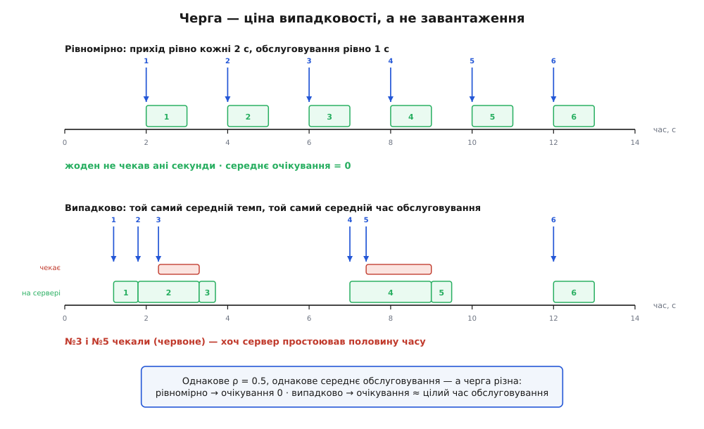
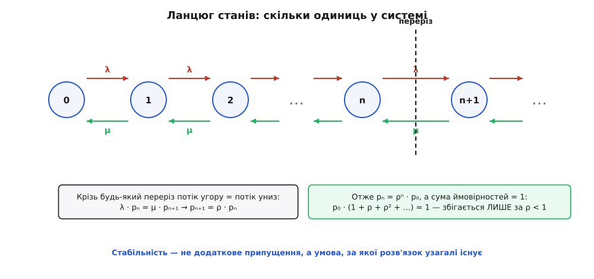
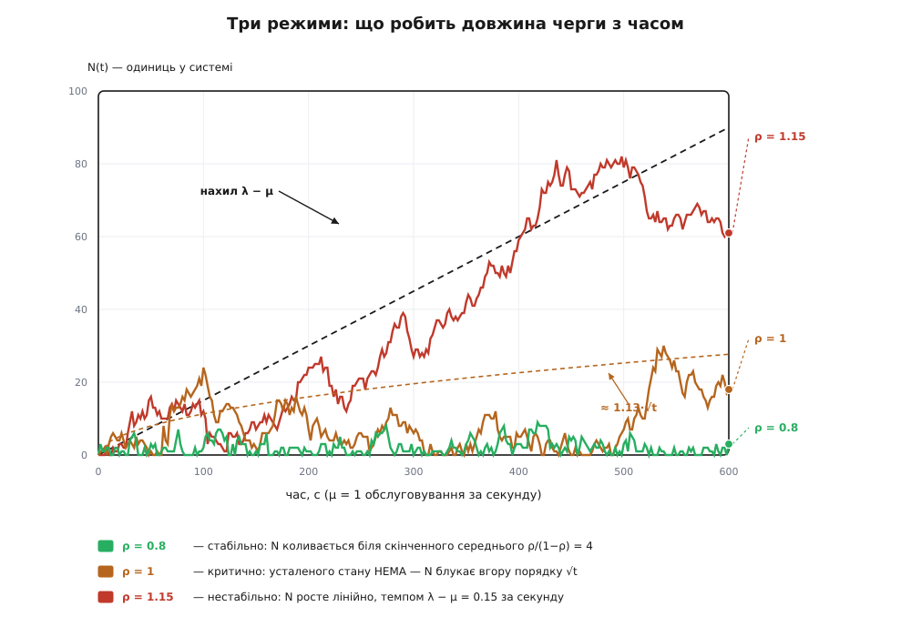
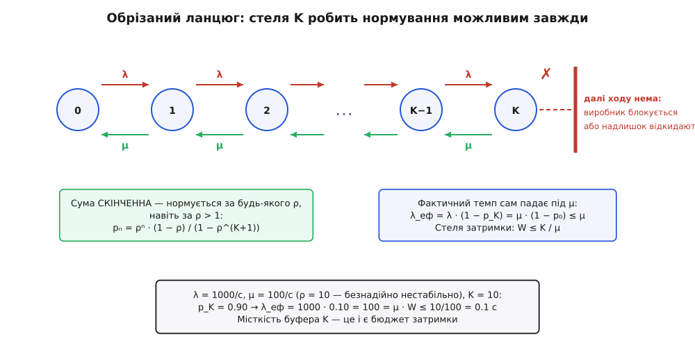

# 🧮 Математика стабільності черги

Про чергу зазвичай питають «яка вона завдовжки?». Але це друге питання. Перше — **чи існує відповідь**. Бо є режим, у якому «середня довжина черги» — це не велике число, а поняття без змісту: черга не має середнього, бо ніколи не осідає до сталого значення. Межа між «відповідь є» і «відповіді немає» зветься **стабільністю**, і далі — про те, де вона проходить, чому саме там, і що з нею робить протитиск.

Домовмося про три величини, і всі три виміряні в тому самому місці.

```
λ  — темп надходження, одиниць за секунду
μ  — темп обслуговування: скільки одиниць за секунду встигає сервер, коли він зайнятий
ρ  — завантаження (utilization),  ρ = λ / μ  — безрозмірне
```

`ρ` безрозмірне, бо це відношення двох темпів: секунди скорочуються. Воно каже, **яку частку часу сервер зайнятий**: за `μ = 100/с` кожна одиниця тримає сервер на 1/100 секунди; якщо їх приходить `λ = 50` за секунду, то з кожної секунди сервер працює 50 · (1/100) = 0.5 секунди — тобто `ρ = 0.5`.

Наївна відповідь про стабільність напрошується одразу: треба `λ < μ`, бо інакше робота надходить швидше, ніж зникає. Це правда, але правда порожня — вона нічого не пояснює. Вона не каже, чому за `λ = 0.9μ` система вже нездорова, хоч нерівність виконано з десятивідсотковим запасом. І не каже, чому за `λ = 0.5μ` черга взагалі є — адже сервер простоює половину часу.

Почнімо саме з другого питання, бо в ньому корінь усього.

## Чому черга взагалі існує

Питання здається дурним, поки не поставити його чесно. Візьмімо `λ = 0.5/с` і `μ = 1/с`, тобто `ρ = 0.5`. Але зробімо все **рівномірним**: одиниця приходить рівно кожні 2 секунди, обслуговування триває рівно 1 секунду.

Простежмо. Перша приходить на 2-й секунді, сервер вільний, обслуговування триває з 2-ї до 3-ї. Друга приходить на 4-й — сервер звільнився ще на 3-й і стоїть порожній, тож обслуговування йде з 4-ї до 5-ї. Третя на 6-й — те саме. **Ніхто не чекає жодної миті.** Не «мало в середньому» — рівно нуль, завжди, назавжди. Черги не існує як явища.

Тепер лишімо `λ = 0.5/с` і `μ = 1/с` незмінними, той самий `ρ = 0.5`, той самий середній час обслуговування — але зробімо надходження й обслуговування **випадковими** (проміжки розподілені експоненційно). Черга з'являється негайно, і середнє очікування в ній — **ціла секунда**, рівно стільки ж, скільки саме обслуговування.

Ось усі три випадки поруч; числа — з прямої симуляції, не з формул:

```
модель    прихід              обслуговування     очікування В ЧЕРЗІ
─────────────────────────────────────────────────────────────────────
D/D/1     рівно кожні 2 с     рівно 1 с          0.000 с   ← черги немає взагалі
M/D/1     у середньому 2 с    рівно 1 с          0.497 с
M/M/1     у середньому 2 с    у середньому 1 с   1.003 с
```

Завантаження в усіх трьох рядках однакове — `ρ = 0.5`. Середній час обслуговування однаковий — 1 секунда. Пропускна здатність однакова. А очікування стрибає від нуля до цілого часу обслуговування. Висновок, який варто прийняти серйозно:

**Черга — це ціна випадковості, а не завантаження.** Величина `ρ` каже, яку частку часу сервер зайнятий. Вона не каже нічого про те, чи приходи **збиваються в купи**. А черга народжується саме з куп.


*Однакове завантаження, різна черга. Угорі надходження рівномірні, обслуговування стале — сервер зайнятий половину часу, і жоден не чекає ані секунди. Унизу той самий середній темп і той самий середній час обслуговування, але все випадкове: одиниці збиваються в купи, і №3 та №5 стоять у черзі (червоне) — попри те, що сервер так само простоює половину часу. Різниця між нулем і чергою тут не в потужності, а виключно у випадковості.*

Причина, від першопринципу, — одна фраза: **простій не накопичується**. Секунда, коли сервер стояв без роботи, зникає назавжди; її не можна відкласти й витратити пізніше, коли набіжить купа. Потужність — не бак, що наповнюється в тихі хвилини. Це потік, який або тече, або втрачається. Тож коли на 7-й секунді надходить купа з трьох одиниць, простій, що був на 3-й, уже змарновано — і погасити купу нема чим, крім часу тих, хто в ній стоїть.

Ось чому рівномірний потік дає нуль: він **ніколи не створює куп**, і кожній одиниці дістається її власне вікно потужності точно тоді, коли вона потрібна. І ось чому будь-яка випадковість дає чергу за будь-якого `ρ > 0`: купи неминучі, а погасити їх нема з чого.

> 🔧 **Навіщо це.** Звідси випливає важіль, невидимий із самого `ρ`. Якщо черга — плата за нерівність потоку, то її можна вкоротити, **вирівнявши потік**, не купивши жодного сервера: розкидати запуски за розкладом замість «усі о рівній годині», розбити пакетне завдання на дрібні порції, поставити стелю на роботу в одному запиті. І навпаки — система, у якої `ρ = 0.4` і при цьому жахлива затримка, не потребує вдвічі більше заліза: у неї проблема з розподілом, а не з потужністю. Точну ціну розкиду — множник `(1+C²)/2` — виведено окремо: [математика черги: закон Літтла, коліно й хвіст](topic:programming/back-of-envelope/math-queueing.md).

## Формальний апарат: стани й переріз

Інтуїцію треба перетворити на число. Для цього потрібна модель, а модель починається з питання: **що досить знати про систему, щоб передбачити її майбутнє?**

Візьмімо за стан просто `n` — скільки одиниць у системі зараз (та, що на сервері, теж рахується). Здавалося б, цього замало: щоб знати, коли завершиться поточне обслуговування, треба ж знати, скільки воно вже триває. Але саме тут експоненційний розподіл робить дарунок. Він **без пам'яті**: якщо обслуговування триває вже 5 секунд, розподіл того, скільки лишилося, точнісінько такий самий, як на початку. Минуле не додає жодної інформації. Те саме з надходженнями [пуассонівського потоку](topic:math/poisson-process). Тому `n` — це **весь** стан, і система стає [ланцюгом Маркова](topic:math/markov-chain): майбутнє залежить від теперішнього й не залежить від того, як ми в нього потрапили. Модель із такими припущеннями позначають `M/M/1` — надходження марковські, обслуговування марковське, сервер один.

Переходи прості: надходження штовхає `n` на одиницю вгору з темпом `λ`, завершення обслуговування тягне на одиницю вниз із темпом `μ`.

Тепер головний трюк, і він вартий того, щоб побачити його як фізику, а не як алгебру. Проведімо **переріз** між станами `n` і `n+1` — уявну вертикальну лінію. Система стрибає туди-сюди через цю лінію протягом усього життя. Але щоб перетнути її вгору, треба бути в стані `n` (і дочекатися надходження), а щоб перетнути вниз — треба бути в стані `n+1` (і дочекатися завершення обслуговування). Ключове спостереження: **переходи через лінію мусять чергуватися** — вгору, вниз, угору, вниз. Не можна двічі поспіль перетнути її вгору, не повернувшись. Отже, за довгий час кількість перетинів угору й униз відрізняється щонайбільше на одиницю, а темпи їх — рівні:

```
темп перетинів угору  =  λ · pₙ        (треба бути в стані n, там надходження йдуть темпом λ)
темп перетинів униз   =  μ · pₙ₊₁      (треба бути в стані n+1, там обслуговування йде темпом μ)

λ · pₙ = μ · pₙ₊₁      →      pₙ₊₁ = (λ/μ) · pₙ = ρ · pₙ
```


*Ланцюг станів і переріз. Стан — це просто кількість одиниць у системі; надходження (λ) ведуть праворуч, завершення обслуговування (μ) — ліворуч. Крізь будь-який переріз потік імовірності вгору мусить дорівнювати потокові вниз, бо перетини чергуються. Звідси pₙ₊₁ = ρ·pₙ, отже pₙ = ρⁿ·p₀ — імовірності спадають геометрично. Нормування цієї геометричної прогресії й вирішує все: сума збігається лише за ρ < 1.*

Ця рівність тримається для **кожного** перерізу, тож застосуймо її по ланцюгу від нуля: `p₁ = ρp₀`, `p₂ = ρp₁ = ρ²p₀`, і взагалі

```
pₙ = ρⁿ · p₀
```

Лишилося знайти `p₀`. Тут працює єдина умова, яку ми ще не використали: система десь та є, тож сума всіх імовірностей дорівнює одиниці.

```
p₀ + p₁ + p₂ + …  =  p₀ · (1 + ρ + ρ² + ρ³ + …)  =  1
```

Суму в дужках порахуймо чесно, старим трюком. Позначмо `S = 1 + ρ + ρ² + ρ³ + …`, помножмо її на `ρ` — і віднімімо одне від одного:

```
S      =  1 + ρ + ρ² + ρ³ + …
ρ·S    =      ρ + ρ² + ρ³ + …
S − ρS =  1                        →   S · (1 − ρ) = 1   →   S = 1 / (1 − ρ)
```

І ось воно. Це віднімання **законне лише тоді, коли `S` — скінченне число**. За `ρ < 1` доданки `ρⁿ` спадають до нуля, сума збігається, все гаразд. За `ρ ≥ 1` доданки не спадають (за `ρ = 1` кожен дорівнює одиниці, за `ρ > 1` вони ростуть) — сума нескінченна, і жодного `S` не існує. Тоді не існує й `p₀`: будь-яке `p₀ > 0` дає нескінченну суму замість одиниці, а `p₀ = 0` дає нуль.

Отже за `ρ < 1` маємо `p₀ = 1 − ρ` і повний розподіл:

```
pₙ = (1 − ρ) · ρⁿ
```

Зверніть увагу, чим щойно виявилася стабільність. Ми **не додавали** умову `ρ < 1` як припущення й не вводили її ззовні. Вона випала з математики сама, як **умова існування розв'язку**. Стабільна черга — це не черга, яка «поводиться добре»; це черга, для якої усталений розподіл узагалі існує. За `ρ ≥ 1` немає жодного набору чисел `pₙ`, який був би розподілом імовірностей і задовольняв баланс. Питання «яка ймовірність застати в черзі трьох?» не має відповіді — не тому, що ми її не порахували, а тому, що усталеної ймовірності немає.

## Скільки в системі й скільки чекати

Тепер, маючи розподіл, дістати середні — справа арифметики. Середня кількість у системі `L` — це математичне сподівання `n`:

```
L = Σ n · pₙ = (1 − ρ) · Σ n · ρⁿ        (сума по n = 0, 1, 2, …)
```

Суму `Σ n·xⁿ` беруть похідною від уже відомої нам геометричної. Ми знаємо `Σ xⁿ = 1/(1−x)`. Продиференціюймо обидві частини по `x`:

```
Σ n · xⁿ⁻¹  =  1 / (1 − x)²           (похідна від 1/(1−x))
Σ n · xⁿ    =  x / (1 − x)²           (домножили обидві частини на x)
```

Підставмо `x = ρ`:

```
L = (1 − ρ) · ρ / (1 − ρ)²  =  ρ / (1 − ρ)
```

Тепер час перебування `W`. Модель `M/M/1` сама його не дає — вона описує стани, а не годинник кожної одиниці. Міст між ними — [закон Літтла](topic:math/littles-law), `L = λ·W`, який не припускає нічого про розподіли й тому працює тут задарма. Розгорнімо його в бік `W` і доведімо до кінця:

```
W = L / λ  =  [ρ / (1 − ρ)] / λ                 підставили L
           =  [(λ/μ) / (1 − ρ)] / λ             розписали ρ = λ/μ
           =  (1/μ) / (1 − ρ)                   скоротили λ
           =  1 / (μ · (1 − λ/μ))               розписали ρ назад
           =  1 / (μ − λ)
```

Два записи однієї формули, і кожен показує своє:

```
W = (1/μ) / (1 − ρ)        час обслуговування, помножений на 1/(1−ρ)
W = 1 / (μ − λ)            одиниця, поділена на АБСОЛЮТНИЙ запас потужності
```

Перевіримо симуляцією, щоб не вірити на слово (`μ = 1/с`):

```
ρ = 0.50:  W_вимір =  2.01   W = 1/(μ−λ) =  2.00
ρ = 0.80:  W_вимір =  4.97   W = 1/(μ−λ) =  5.00
ρ = 0.90:  W_вимір =  9.67   W = 1/(μ−λ) = 10.00
ρ = 0.95:  W_вимір = 21.64   W = 1/(μ−λ) = 20.00
```

Другий запис — `W = 1/(μ − λ)` — вартий окремої уваги, бо він робить видимим ресурс, за який ви насправді платите. Затримка — це **обернена величина до абсолютного запасу потужності**, поміряного в одиницях за секунду. Не «наскільки завантажено», а «скільки вільних одиниць за секунду лишилося».

Різниця не косметична. Порівняймо дві системи з **однаковим** `ρ = 0.9`:

```
μ = 100/с,    λ = 90/с    →  запас μ−λ = 10/с    →  W = 1/10   = 100 мс
μ = 10000/с,  λ = 9000/с  →  запас μ−λ = 1000/с  →  W = 1/1000 = 1 мс
```

Однакове завантаження — стократ різна затримка. Отже `ρ` **не визначає затримку**; воно визначає лише **множник** над часом обслуговування, а масштаб задає сам час обслуговування. Тому «ми тримаємо 90%» — саме по собі не діагноз ні в добрий, ні в поганий бік, поки не сказано, скільки це в абсолютних одиницях запасу.

А тепер — розбіжність, заради якої все й рахувалося. У записі `W = 1/(μ − λ)` вона очевидна: коли `λ` підповзає до `μ`, знаменник іде до нуля, і `W` має **полюс** у точці `λ = μ`. Не «швидко росте» — саме полюс, вертикальна асимптота. Кожне наближення `λ` до `μ` вдвічі (з погляду запасу) **подвоює** затримку:

```
запас 50% від μ  →  W = 2/μ
запас 25%        →  W = 4/μ
запас 12.5%      →  W = 8/μ
запас 1%         →  W = 100/μ
```

Читається це так: **важить не завантаження, а запас**, і кожне вполовинення запасу коштує подвоєння затримки — без кінця. Що з цього випливає для планування потужності, вибору цілі по завантаженню й перцентилів — окрема довга розмова: [математика черги: закон Літтла, коліно й хвіст](topic:programming/back-of-envelope/math-queueing.md).

## За межею: коли відповіді немає

Досі ми жили за `ρ < 1`. Що ж по той бік? Спокуса — просто підставити. Хай `λ = 200/с`, `μ = 100/с`, тобто `ρ = 2`:

```
L = ρ / (1 − ρ) = 2 / (1 − 2) = 2 / (−1) = −2
```

**Черга завдовжки мінус дві одиниці.** Формула не «стала великою» — вона видала нісенітницю. І це не прикра вада запису, а найчесніша річ, яку вона могла зробити: математика кричить, що її спитали не про те. Згадаймо, звідки взялося `1/(1−ρ)`: із суми `1 + ρ + ρ² + …`, законної **лише** за `ρ < 1`. За `ρ = 2` та сума — це `1 + 2 + 4 + 8 + …`, тобто нескінченність, і жодного `p₀` не існує. Формулу вивели в краю, де вона чинна, і потягли за його межу; від'ємна відповідь — це квитанція за таке перенесення.

Отже за `ρ ≥ 1` усталеного стану **немає**, і `L` не має значення — не великого, а **жодного**. Але щось же відбувається. Що саме?

Погляньмо на `N(t)` — кількість у системі — як на [випадкове блукання](topic:math/random-walk): кожне надходження робить крок `+1`, кожне завершення `−1`. Кроки вгору йдуть темпом `λ`, кроки вниз — темпом `μ` (поки сервер зайнятий, а за `ρ > 1` він зайнятий практично завжди). Отже за секунду накопичується **знос** (дрейф) `λ − μ`, і за законом великих чисел випадковість усереднюється:

```
N(t) ≈ (λ − μ) · t
```

Черга не «переповнюється» й не «вибухає» — вона **росте з постійною, передбачуваною, обчислюваною швидкістю**. Візьмімо `λ = 1000/с` і `μ = 100/с`: знос `900/с`. Симуляція проти передбачення:

```
t = 1 с:   N_вимір =  907      (λ−μ)·t =  900
t = 2 с:   N_вимір = 1790      (λ−μ)·t = 1800
t = 4 с:   N_вимір = 3619      (λ−μ)·t = 3600
```

За годину — `900 · 3600 = 3.24` мільйона необроблених одиниць. А час очікування? Той, хто прийшов у мить `t`, мусить дочекатися всіх, хто стоїть попереду, тобто `W(t) ≈ N(t)/μ ≈ (λ−μ)·t/μ`. Затримка **росте лінійно в часі** й теж не має усталеного значення: питання «яка тут середня затримка?» безглузде, бо відповідь залежить від того, коли спитати.

### Вістря ножа: рівно ρ = 1

Лишився найтонший випадок, на якому ламаються інтуїції. Хай `λ = μ` рівно. Знос нульовий. Здається, тут якраз рівновага: скільки прийшло, стільки й пішло, черга має тупцювати на місці.

Не має. **Нульовий знос — це не «стояти», це блукати без упину.** Незміщене випадкове блукання не лишається біля нуля; воно віддаляється від нього дедалі далі, просто без переваги в напрямку. Черга відбивається від нуля знизу (менше нуля одиниць не буває) — і тому блукає **вгору**. Формально такий ланцюг **нуль-рекурентний**: він неминуче колись повертається до порожньої черги, але **середній час повернення нескінченний**. Усталеного розподілу немає й тут.

Типовий розмах такого блукання росте як корінь із часу. Симуляція (`λ = μ = 1/с`):

```
t =  100 с:   E[N] ≈ 10.7        √t = 10.0
t =  400 с:   E[N] ≈ 22.5        √t = 20.0
t = 1600 с:   E[N] ≈ 47.7        √t = 40.0
t = 6400 с:   E[N] ≈ 84.4        √t = 80.0
```

Подивіться на крайні рядки: час виріс у **64 рази**, черга — у **8 разів**. Рівно `√64`. Черга справді росте повільніше, ніж за `ρ > 1` — не лінійно, а як `√t` — але росте **необмежено**. Стелі немає.

Але чи це загальний факт — чи примха саме `M/M/1` з його експонентами? Строгий результат є, і він далеко ширший: [Р. М. Лойнс](https://doi.org/10.1017/S0305004100036781) 1962 року (R. M. Loynes, *The stability of a queue with non-independent inter-arrival and service times*, Mathematical Proceedings of the Cambridge Philosophical Society, 58(3), с. 497–520) довів умови стабільності для черги з одним сервером за дуже загальних припущень — навіть коли проміжки між надходженнями й часи обслуговування залежні. Підкритичний випадок (`λ < μ`) стабільний, надкритичний (`λ > μ`) нестабільний, а **критичний випадок із взаємно незалежними потоками надходжень і обслуговування — нестабільний**. *(Усталений факт: теореми 2 і 3 названої праці.)*

Це важлива звістка. Поріг `ρ < 1` — **не артефакт експоненційних припущень**. Він тримається для практично будь-яких розподілів. Розподіли керують тим, наскільки велика черга **всередині** стабільної зони, — але саму межу зони вони не зсувають. І `ρ = 1` лежить **по той бік** межі, а не на ній.


*Три режими однієї черги. За ρ = 0.8 кількість у системі коливається біля скінченного середнього ρ/(1−ρ) = 4 — усталений стан існує. За ρ = 1.15 черга росте лінійно, точно з нахилом λ − μ (пунктир) — усталеного стану немає. А за рівно ρ = 1, де інтуїція обіцяє рівновагу, черга теж не осідає: вона блукає вгору порядку √t і не має стелі. Саме тому «зрівняти темпи» — не розв'язок: точка ρ = 1 лежить уже за межею стабільної зони.*

Практичний висновок жорсткий. «Просто зрівняймо темпи, хай `λ = μ`» — це не інженерія, а програш, розтягнутий у часі. Цільове завантаження мусить лишати **справжній** запас, і запас цей купують не для краси, а тому, що по той бік межі поняття «середня затримка» просто зникає.

## Що насправді робить протитиск

Тепер, коли межа окреслена, можна точно сказати, що з нею робить протитиск. Відповідей дві: одна арифметична, друга — глибша.

### Обрізаний ланцюг: нормування, яке не може не вдатися

Дамо черзі **стелю місткості `K`**: у системі не буває більше ніж `K` одиниць, а надлишок або блокує виробника, або його відкидають. Що зміниться в наших викладках?

Рівняння балансу — жодним чином. Той самий переріз, той самий аргумент про чергування перетинів, той самий результат `pₙ = ρⁿ·p₀`. Зміниться **тільки нормування** — і саме воно вирішувало все:

```
p₀ · (1 + ρ + ρ² + … + ρᴷ)  =  1        ← сума СКІНЧЕННА: рівно K+1 доданків
```

Скінченна сума завжди має значення. Тут нема чому розбігатися: `1 + ρ + … + ρᴷ = (1 − ρᴷ⁺¹)/(1 − ρ)` за `ρ ≠ 1`. Отже

```
pₙ = ρⁿ · (1 − ρ) / (1 − ρᴷ⁺¹)          для будь-якого ρ ≠ 1
pₙ = 1 / (K + 1)                        за ρ = 1 — усі стани рівноймовірні
```

Ось перша дія протитиску, і вона на рівні арифметики: **усталений розподіл тепер існує завжди.** Навіть за `ρ = 10`, де відкрита черга не мала жодного шансу. Розбіжності не стається, бо розбігатися нема чому — доданків скінченна кількість. Модель, яка щойно відмовлялася давати відповідь, дає її для будь-якого навантаження.

Скільки ж роботи справді входить? Частку `p_K` часу система повна, і надходження в цей час не приймаються, тож **фактичний темп**:

```
λ_еф = λ · (1 − p_K)
```

(Тут використано тонкість, яку варто назвати: `p_K` — це частка **часу**, коли буфер повний, а нам треба частку **надходжень**, які застали його повним. Ці дві величини збігаються не завжди — але для пуассонівського потоку збігаються завжди, бо він приходить у «випадкові» миті й тому бачить систему такою, якою вона є в середньому за часом.)

Візьмімо ту саму безнадійну пару — `λ = 1000/с`, `μ = 100/с`, `ρ = 10` — і поставмо стелю `K = 10`:

```
p_K   = 0.900                        буфер повний 90% часу
λ_еф  = 1000 · (1 − 0.900) = 100/с   = μ  ← фактичний темп сам сів на μ
L     = 9.89                         буфер стоїть майже повний
W     = L / λ_еф = 0.0989 с          затримка скінченна й стабільна
```

Але окремий приклад тут навіть не потрібен, бо є тотожність, яка робить результат неминучим. Погляньмо з боку сервера: він видає одиниці темпом `μ` рівно тоді, коли не порожній, тобто частку `(1 − p₀)` часу. В усталеному режимі скільки вийшло, стільки й увійшло:

```
λ_еф  =  μ · (1 − p₀)  ≤  μ            бо (1 − p₀) ≤ 1 завжди
```

**`λ_еф ≤ μ` — не мета, якої треба досягти, а тотожність, яку неможливо порушити.** Обмежений буфер робить арифметично неможливим, щоб прийнятий темп перевищив темп обслуговування, — незалежно від того, як сильно тисне джерело. `λ` може бути хоч мільйон; `λ_еф` все одно не перелізе через `μ`.


*Стеля перетворює розбіжність на арифметику. Рівняння балансу ті самі, що й у нескінченного ланцюга, — змінюється лише нормування: сума з K+1 доданків збігається за будь-якого ρ, навіть за ρ = 10. За станом K стоїть стіна: надлишок або блокує виробника, або його відкидають, і фактичний темп λ_еф сам сідає під μ. Місткість K одночасно задає стелю затримки W ≤ K/μ.*

### Стеля затримки: K — це і є бюджет

Друга дія протитиску міцніша за першу, бо їй **не потрібна жодна модель**. Ось міркування, у якому немає ані Маркова, ані експоненти, ані пуассонівського потоку.

Якщо правило тримає `N ≤ K` завжди, то одиниця, яку **прийняли**, застала перед собою щонайбільше `K−1` інших. Отже їй треба дочекатися щонайбільше `K−1` чужих обслуговувань плюс своє власне — усього не більше `K` обслуговувань. Ця межа на **кількість** роботи попереду — беззастережна: вона не залежить від того, як розподілені надходження, наскільки рвано вони приходять і чи взагалі випадкові.

Перевівши кількість у час для `M/M/1/K`, дістаємо чисту стелю (перевірено проти точних формул):

```
K =  4,  μ = 100/с  →  W = 0.0389 с  ≤  K/μ = 0.04 с
K = 10,  μ = 100/с  →  W = 0.0989 с  ≤  K/μ = 0.10 с
K = 50,  μ = 100/с  →  W = 0.4989 с  ≤  K/μ = 0.50 с
```

```
W  ≤  K / μ
```

Обираючи місткість буфера, ви обираєте **максимальну затримку** — і не «десь так», а числом:

```
K = 10   →  W ≤ 0.1 с
K = 100  →  W ≤ 1.0 с
K = 1000 →  W ≤ 10 с
```

(Для загального розподілу обслуговування стеля лишається пропорційною `K`, але стала при ній залежить від розкиду — того самого множника мінливості, розібраного в [математиці черги](topic:programming/back-of-envelope/math-queueing.md). Пропорційність до `K` не змінюється ніколи.)

> 🔧 **Навіщо це.** Ось точний сенс твердження «необмежена черга — антипатерн», у числах, а не в настрої. Місткість буфера **тотожна** обіцянці про затримку: `K/μ` — це і є найгірший час у черзі. Поставити `K = ∞` означає пообіцяти `W ≤ ∞`, тобто не пообіцяти нічого. Тому місткість не можна вибирати «щоб вистачило» — її вибирають із бюджету затримки навпаки: скільки максимум можна змусити чекати, помножити на `μ`, і це ваше `K`. Черга на мільйон елементів перед сервісом, що тягне 100/с, — це рішення змусити когось чекати майже три години; хтось його ухвалив, просто не помітивши.

### Найглибше: протитиск ламає передумову

Лишилася найважливіша річ, і вона не про арифметику. Побутове формулювання каже: «протитиск повертає `ρ < 1`». Воно правильне, але слабке — і ховає те, що насправді сталося.

Формула `W = 1/(μ − λ)` і катастрофа при `ρ → 1` — це **теорема**. У теореми є передумова, яку рідко промовляють уголос: **потік надходжень не залежить від стану системи**. Виробник жене свої `λ` за секунду, і йому байдуже, скільки вже стоїть у черзі; він її навіть не бачить. Модель **відкрита**: джерело зовні системи, воно не зазнає наслідків того, що робить.

Саме цю передумову й ламає блокувальний протитиск. Заблокований виробник — це джерело, яке **дивиться на стан черги**. Темп надходжень перестає бути незалежною сталою `λ` і стає функцією стану. Петля замикається: споживач → черга → виробник. Передумови теореми більше немає — а отже немає й висновку.

Що це не софістика, видно з чисел. Та сама пара `λ = 1000/с`, `μ = 100/с` зі стелею `K = 10`:

```
p₀      ≈ 9 · 10⁻¹¹              сервер порожній практично ніколи
ρ_еф    = 1 − p₀ ≈ 0.99999999991  ← завантаження = 1 з точністю до десятого знаку
W       = 0.0989 с                ← а затримка скінченна. І такою лишиться назавжди.
```

Погляньте на ці два рядки поруч. Завантаження — одиниця. Не «0.99, близько до одиниці» — одиниця з десятьма дев'ятками. У відкритій моделі це рівно та точка, де черга нуль-рекурентна й блукає в нескінченність як `√t`. А тут затримка тримається під сотою часткою секунди й не зрушить.

Отже точне формулювання таке: **протитиск не стільки повертає `ρ` під одиницю, скільки робить катастрофу при `ρ → 1` такою, що не стосується справи.** Та катастрофа була властивістю відкритої системи з незалежним джерелом. Замкнувши петлю, ви виводите систему з-під тієї теореми взагалі — і `ρ = 1` перестає бути смертним вироком, стаючи просто описом того, що сервер не байдикує.

Звідси й видно, що безпечних стратегій рівно дві, і вони різні по суті. Перша — **триматися далеко від стіни**: купити стільки `μ`, щоб `ρ` було з добрим запасом менше одиниці. Платиш залізом, і платиш назавжди, бо запас мусить покривати найгірший пік. Друга — **зробити так, щоб стіни не було**: замкнути петлю, обмежити буфер, змусити джерело чекати або свідомо викидати надлишок. Платиш блокуванням чи втратами — але ціна ця відома наперед і не залежить від того, наскільки лютий сплеск. Перша стратегія масштабується грошима, друга — ні. Тому в справжніх системах є обидві.

## Що з цього лишається

Три речі, і кожну ми вивели, а не постулювали.

**Черга — плата за випадковість.** За рівномірного потоку її нема взагалі, за будь-якого `ρ`. Величина `ρ` каже лише, яку частку часу сервер зайнятий, і мовчить про купи — а черга народжується з куп, бо простій не накопичується й погасити купу нема з чого.

**Стабільність — умова існування, а не якість.** Умова `ρ < 1` не додається ззовні: вона випадає з нормування геометричної прогресії `p₀·(1 + ρ + ρ² + …) = 1`, яке можливе лише за `ρ < 1`. Звідти `pₙ = (1−ρ)ρⁿ`, `L = ρ/(1−ρ)`, і через закон Літтла `W = 1/(μ − λ)` — затримка як обернена до абсолютного запасу потужності, з полюсом у точці `λ = μ`. По той бік межі формула чесно видає від'ємну чергу, бо усталеного стану там немає: за `ρ > 1` `N(t)` росте лінійно темпом `λ − μ`, за рівно `ρ = 1` — блукає вгору як `√t`, і поріг цей, за Лойнсом, майже не залежить від розподілів.

**Протитиск працює на рівні передумов, а не констант.** Стеля `K` робить нормування скінченним, тож усталений стан існує за будь-якого навантаження; тотожність `λ_еф = μ·(1 − p₀) ≤ μ` робить перевищення арифметично неможливим; межа `N ≤ K` дає стелю затримки `W ≤ K/μ` без жодних припущень про розподіли — тобто місткість буфера **тотожна** бюджетові затримки. А головне — замикання петлі скасовує саму передумову незалежного джерела, на якій трималася катастрофа при `ρ → 1`. Тому обмежена черга спокійно живе за `ρ_еф = 1` зі стабільною затримкою в сотню мілісекунд — там, де необмежена не має навіть означеного середнього.
