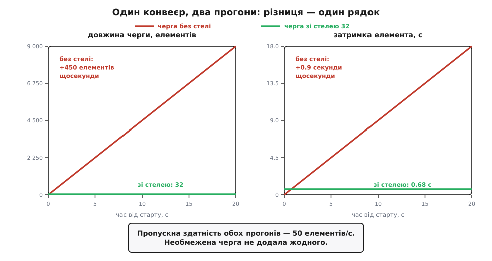
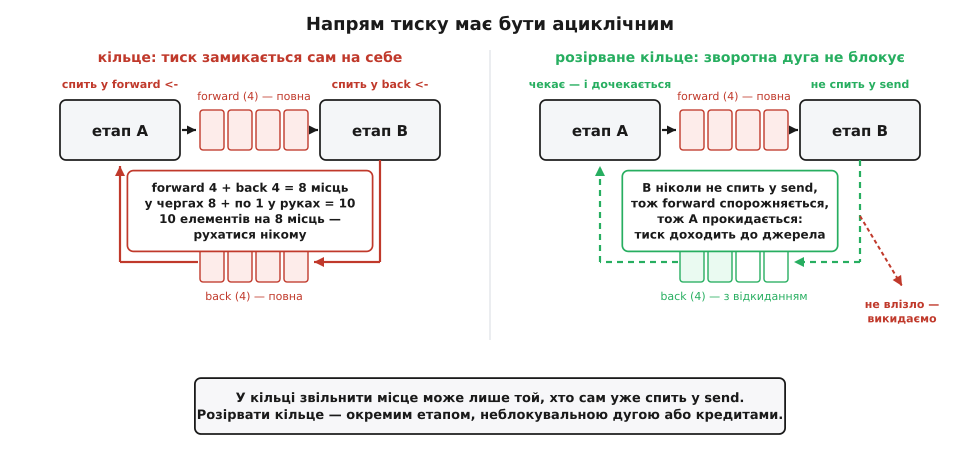

# ⚙️ Два прогони одного конвеєра

<preknowlist>
- [Канали і CSP](topic:programming/csp-channels) — горутина як окрема нитка виконання й канал як спосіб передати їй роботу; на цьому стоїть увесь код нижче.
- [Монітори й умовні змінні](topic:algorithms/monitor-sync) — замок плюс умовна змінна: як нитка засинає, доки не справдиться умова, і хто її будить; з цього зібрана черга без стелі.
- [Закон Літтла](topic:math/littles-law) — L = λ · W: довжина черги дорівнює темпу надходження, помноженому на час перебування; ми весь час читаємо його навпаки, W = L / μ.
</preknowlist>

Питання, на яке відповідає цей стенд, звучить наївно: **скільки коштує черга без стелі?** Здається, що самою лише пам'яттю — а пам'ять дешева, докупимо планку. Зараз ми запустимо один і той самий конвеєр двічі, змінивши рівно один рядок, і побачимо, що пам'ять — то найдешевше з утраченого.

Стенд навмисно жорстокий і навмисно чесний. Обидва прогони мають того самого виробника, того самого споживача, ту саму роботу з тією самою вартістю. Різниця — тільки в черзі між ними.

## Умова досліду

Виробник створює елемент кожні 2 мс, тобто не більше ніж 500 штук за секунду. Споживач витрачає на елемент 20 мс — це рівно 50 штук за секунду. Кожен елемент несе кілобайт вантажу: не заради драми, а тому, що порожній елемент і в реальності не ходить.

```
λ = 1 / 2 мс  = 500 елементів/с        темп виробника
μ = 1 / 20 мс =  50 елементів/с        темп споживача
ρ = λ / μ     = 10                     завантаження
надлишок      = λ − μ = 450/с          стільки НЕ вміщається щосекунди
```

ρ = 10 — це не «трохи не встигаємо». Це «не встигаємо вдесятеро», причому постійно, а не в піку. Такі числа здаються карикатурними, доки не глянеш на реальний випадок: служба читає з брокера, а на кожне повідомлення робить один запит до бази. Брокер віддає стільки, скільки в ньому лежить; база тримає свої сто запитів за секунду й більше не дасть. Десятикратне ρ виникає не з чиєїсь дурості, а з того, що дві сторони ніколи не домовлялися про темп.

## Найважливіше рішення — де поставити мітку часу

Перш ніж писати чергу, треба вирішити, що саме ми міряємо. Від цього рішення залежить, чи побачить стенд хоч щось.

Спокуса — обгорнути таймером виклик обробника: скільки він працював, стільки й тривала обробка. Так роблять майже всі, бо це один рядок і жодного клопоту. Але тоді ми міряємо **тривалість обробки** — час, який елемент провів **у руках** споживача. Очікування в черзі в це число не входить узагалі. Черга може містити дев'ять тисяч елементів і далі рости — тривалість обробки лишиться незворушними 20 мс.

Тому мітку часу — `born` — виробник ставить **у мить створення елемента**, ще до того, як віддасть його в чергу. Тоді споживач наприкінці має два різні числа:

```
тривалість обробки = кінець обробки − початок обробки     скільки коштує сама робота
затримка           = кінець обробки − born                скільки чекала людина
```

Перше число описує **обробник**. Друге — **систему**. Розходяться вони рівно настільки, наскільки система хвора: на здоровій різниця між ними мізерна, і саме тому на здоровій системі підміна одного числа іншим нікому не муляє.

## Стенд

Далі — чотири шматки одного файла `backpressure_demo.go`; складені по порядку, вони компілюються й біжать. Перший шматок задає числа досліду, одиницю роботи й той єдиний інтерфейс, реалізації якого відрізняють два прогони.

```go
// backpressure_demo.go — один конвеєр, два прогони.
//   go run backpressure_demo.go unbounded      // черга без стелі
//   go run backpressure_demo.go bounded 32     // черга зі стелею 32
package main

import (
	"fmt"
	"os"
	"runtime"
	"strconv"
	"sync"
	"time"
)

const (
	produceEvery = 2 * time.Millisecond  // виробник: не швидше ніж 500 елементів/с
	handleCost   = 20 * time.Millisecond // споживач: рівно 50 елементів/с
	payloadSize  = 1024                  // ~1 КіБ вантажу на елемент
	runFor       = 20 * time.Second
)

// Job — одиниця роботи. born — мить створення, ще до черги:
// саме від неї, а не від миті, коли елемент дістали з черги, лічимо затримку.
type Job struct {
	id      int
	born    time.Time
	payload []byte // вантаж: він і займатиме пам'ять, поки елемент чекає
}

// queue — єдине, що відрізняє два прогони. Усе інше в програмі — спільне.
type queue interface {
	put(Job)           // покласти: може блокувати, а може й ні — у цьому вся інтрига
	take() (Job, bool) // узяти; false = чергу закрито й вичерпано
	length() int       // скільки лежить просто зараз
	close()
}
```

Тепер обидві черги. Перша — та, що зі стелею, і вона коротша за свій опис.

```go
// ── Черга зі стелею: канал скінченної місткості.
// Протитиску тут не написано жодного рядка — він вбудований у сам факт стелі.
// Усередині каналу — кільцевий буфер: рухаються два індекси, елементи не їздять.
type boundedQueue struct{ ch chan Job }

func newBounded(capacity int) *boundedQueue { return &boundedQueue{make(chan Job, capacity)} }

// put у ПОВНИЙ канал присипляє горутину, доки споживач не звільнить місце. O(1).
func (q *boundedQueue) put(j Job) { q.ch <- j }

// take з ПОРОЖНЬОГО каналу присипляє споживача, доки не з'явиться робота. O(1).
func (q *boundedQueue) take() (Job, bool) { j, ok := <-q.ch; return j, ok }

func (q *boundedQueue) length() int { return len(q.ch) }
func (q *boundedQueue) close()      { close(q.ch) }

// ── Черга без стелі: у Go її немає, тож доводиться зібрати руками.
// Уже це мало б насторожити — мову спроєктували так, що небезпечне
// не дається задарма. (Канал на мільйон стелю має: це не «без стелі»,
// це «стеля на мільйон», і Go виділяє під неї весь масив одразу.)
type unboundedQueue struct {
	mu       sync.Mutex
	notEmpty *sync.Cond
	items    []Job
	closed   bool
}

func newUnbounded() *unboundedQueue {
	q := &unboundedQueue{}
	q.notEmpty = sync.NewCond(&q.mu)
	return q
}

// put НІКОЛИ не чекає: стану «повна» тут просто не існує.
// Амортизовано O(1) — append час від часу подвоює масив і копіює вміст.
func (q *unboundedQueue) put(j Job) {
	q.mu.Lock()
	q.items = append(q.items, j)
	q.mu.Unlock()
	q.notEmpty.Signal()
}

// take чекає лише на ПОРОЖНІЙ черзі. O(1): голову зсуваємо, хвіст не копіюємо.
func (q *unboundedQueue) take() (Job, bool) {
	q.mu.Lock()
	defer q.mu.Unlock()
	for len(q.items) == 0 && !q.closed {
		q.notEmpty.Wait()
	}
	if len(q.items) == 0 {
		return Job{}, false
	}
	j := q.items[0]
	q.items[0] = Job{}    // обнулити ОБОВ'ЯЗКОВО: інакше масив триматиме вантаж
	q.items = q.items[1:] // мертвого елемента, і збирач сміття його не забере
	return j, true
}

func (q *unboundedQueue) length() int {
	q.mu.Lock()
	defer q.mu.Unlock()
	return len(q.items)
}

func (q *unboundedQueue) close() {
	q.mu.Lock()
	q.closed = true
	q.mu.Unlock()
	q.notEmpty.Broadcast()
}
```

Придивися до `put` без стелі. У ній немає нічого злого — навпаки, вона бездоганно ввічлива: завжди приймає, ніколи не сперечається, повертається за наносекунди. Уся біда цієї черги — рівно в тому, чого в ній **немає**: жодного шляху, яким звістка «я не встигаю» дійшла б до того, хто кладе.

Третій шматок — вимірювання й дві дійові особи.

```go
// ── Вимірювання. Кожне число відповідає на своє питання.
type meters struct {
	mu      sync.Mutex
	done    int           // скільки оброблено від старту
	service time.Duration // тривалість САМОЇ обробки останнього елемента
	sojourn time.Duration // повне життя останнього елемента: від born до кінця обробки
	blocked time.Duration // сумарний час, який виробник простояв усередині put
}

func (m *meters) record(service, sojourn time.Duration) {
	m.mu.Lock()
	m.done++
	m.service, m.sojourn = service, sojourn
	m.mu.Unlock()
}

func (m *meters) addBlocked(d time.Duration) {
	m.mu.Lock()
	m.blocked += d
	m.mu.Unlock()
}

func (m *meters) snapshot() (done int, service, sojourn, blocked time.Duration) {
	m.mu.Lock()
	defer m.mu.Unlock()
	return m.done, m.service, m.sojourn, m.blocked
}

// Виробник нічого не знає про споживача й не має способу його спитати.
// Єдине, що здатне його вгамувати, — put, який не повертається.
func producer(q queue, m *meters, stop <-chan struct{}) {
	defer q.close() // він єдиний, хто пише в чергу, тож закриває її він
	for id := 0; ; id++ {
		select {
		case <-stop:
			return
		default:
		}
		time.Sleep(produceEvery) // тримає темп: не частіше ніж раз на 2 мс

		j := Job{id: id, born: time.Now(), payload: make([]byte, payloadSize)}

		t0 := time.Now()
		q.put(j) // ← увесь протитиск світу відбувається саме в цьому рядку
		m.addBlocked(time.Since(t0))
	}
}

// Споживач — вузьке місце. Його темп і є темпом усього конвеєра.
func consumer(q queue, m *meters, wg *sync.WaitGroup) {
	defer wg.Done()
	for {
		j, ok := q.take()
		if !ok {
			return
		}
		t0 := time.Now()
		handle(j)
		m.record(time.Since(t0), time.Since(j.born)) // два різні числа — у цьому вся сіль
	}
}

// handle — повільна ланка: запис у базу, виклик по мережі, кодування кадру.
// В обох прогонах вона однакова до останньої наносекунди. Змінюємо тільки чергу.
func handle(j Job) { time.Sleep(handleCost) }
```

Останній шматок друкує зріз щосекунди й складає програму докупи.

```go
// Репортер: раз на секунду — шість чисел.
func reporter(q queue, m *meters, stop <-chan struct{}, wg *sync.WaitGroup) {
	defer wg.Done()
	fmt.Printf("%4s %9s %9s %10s %11s %7s %10s\n",
		"t", "черга", "обробка", "затримка", "зроблено/с", "у put", "купа")

	tick := time.NewTicker(time.Second)
	defer tick.Stop()
	start := time.Now()
	prevDone, prevBlocked := 0, time.Duration(0)

	for {
		select {
		case <-stop:
			return
		case now := <-tick.C:
			done, service, sojourn, blocked := m.snapshot()

			// GC перед заміром — щоб побачити ЖИВИЙ набір, а не сміття,
			// яке збирач ще не встиг прибрати. У службі так не роблять:
			// це спиняє світ. Тут це чесність заміру, а не спосіб жити.
			runtime.GC()
			var ms runtime.MemStats
			runtime.ReadMemStats(&ms)

			fmt.Printf("%3.0fс %9d %6.0f мс %8.2f с %9d/с %5.0f %% %6.1f МіБ\n",
				now.Sub(start).Seconds(), q.length(),
				float64(service.Milliseconds()), sojourn.Seconds(),
				done-prevDone,                       // пропускна здатність за секунду
				100*(blocked-prevBlocked).Seconds(), // частка секунди, яку виробник простояв у put
				float64(ms.HeapAlloc)/(1<<20))
			prevDone, prevBlocked = done, blocked
		}
	}
}

func main() {
	mode, capacity := "bounded", 32
	if len(os.Args) > 1 {
		mode = os.Args[1]
	}
	if len(os.Args) > 2 {
		capacity, _ = strconv.Atoi(os.Args[2])
	}

	var q queue
	switch mode {
	case "unbounded":
		q = newUnbounded()
	case "bounded":
		q = newBounded(capacity)
	default:
		fmt.Println("вжиток: go run backpressure_demo.go [unbounded | bounded <місткість>]")
		return
	}

	m := &meters{}
	stop := make(chan struct{})
	var wg sync.WaitGroup
	start := time.Now()

	wg.Add(2)
	go consumer(q, m, &wg)
	go reporter(q, m, stop, &wg)
	go producer(q, m, stop) // отримавши stop, сам закриє чергу

	time.Sleep(runFor)
	close(stop)

	// Штатне вимкнення: чесно дочекатися, поки черга спорожніє.
	// Ось тут і з'ясується справжня ціна черги без стелі.
	fmt.Printf("\nвимикаємось: у черзі лишилося %d — це ще %v роботи\n",
		q.length(), time.Duration(q.length())*handleCost)
	t0 := time.Now()
	wg.Wait()

	done, _, _, blocked := m.snapshot()
	fmt.Printf("злив забрав %v; оброблено %d за %v (%.0f/с); виробник простояв у put %.1f с\n",
		time.Since(t0).Round(time.Millisecond), done,
		time.Since(start).Round(time.Second), float64(done)/time.Since(start).Seconds(),
		blocked.Seconds())
}
```

## Прогін перший: черга без стелі

```
go run backpressure_demo.go unbounded
```

Порахуймо наперед, що він має надрукувати. Дослід, чий результат порахований заздалегідь, набагато цінніший за дослід-одкровення: збіг підтвердить, що ми зрозуміли механізм, а розбіжність — що ні.

Черга: щосекунди прибуває 500, вибуває 50. Різниця осідає:

```
Q(t) = (λ − μ) · t = 450 · t                елементів у черзі на секунді t
```

Затримка вимагає одного зайвого кроку думки. На секунді `t` споживач саме добиває елемент номер `50·t` — більше він не встиг. Коли той елемент народився? Виробник жене вдесятеро швидше, тож 50·t елементів він випустив за `t/10` секунд. Отже:

```
W(t) = t − t/ρ = t · (1 − 1/10) = 0.9 · t   секунд
```

Пам'ять: у черзі лежить `Q(t)` елементів, кожен тягне кілобайт вантажу плюс 56 байтів полів:

```
купа(t) ≈ Q(t) · 1.05 КіБ ≈ 0.46 · t        МіБ
```

Три формули — і ось повна таблиця, ще до запуску:

```
   t     черга   обробка   затримка  зроблено/с   у put       купа
  1с       450     20 мс      0.90 с       50/с     0 %    0.5 МіБ
  5с      2250     20 мс      4.50 с       50/с     0 %    2.3 МіБ
 10с      4500     20 мс      9.00 с       50/с     0 %    4.6 МіБ
 20с      9000     20 мс     18.00 с       50/с     0 %    9.3 МіБ
```

Прогін дасть саме це, з точністю до планувальника: `time.Sleep` гарантує «не менше», тож фактичні темпи виходять на кілька відсотків нижчі за номінальні, і разом із ними трохи меншають усі числа. Пропорції не зрушать.

## Що показує перша таблиця

**Пропускна здатність не зрушила ні на елемент.** П'ятдесят за секунду — на першій секунді, на двадцятій і на кожній наступній аж до тієї, коли процес помре. Черга не додала конвеєрові ані краплі сили; вона додала тільки чергу. Це найважливіший рядок таблиці й найлегший для проґавлення, бо очі шукають, що змінилося, а тут суть — у тому, що не змінилося **нічого**. Буфер не пришвидшує споживача. Він лише зберігає роботу, яку споживач однаково зробить своїм темпом — або не зробить ніколи.

**Тривалість обробки бездоганна.** Двадцять мілісекунд, рівно, від першої секунди до останньої. Якщо на панелі метрик висить саме це число — а воно там висить, бо його найлегше зміряти, — то панель зелена, обробник «здоровий», алерти мовчать. Користувач у цю мить чекає вісімнадцять секунд.

**Навіть чесно зміряна затримка бреше — і бреше рівно вдесятеро.** Ось найпідступніше. Ми свідомо поставили `born` у мить створення й міряємо повне життя елемента — здавалося б, тепер нас не обдуриш. Але надрукована затримка описує елемент, який **уже завершився**, тобто той, що потрапив у чергу давно — коли вона була значно коротшою. А той, хто прибуває просто зараз, стане в хвіст із `Q(t)` елементів попереду:

```
надруковано (той, хто завершився):  W_друк(t) = t · (1 − 1/ρ)
чекає той, хто прибув щойно:        W_нов(t)  = Q(t)/μ = t · (ρ − 1)
відношення:                         W_нов / W_друк = ρ
```

Перевірмо на десятій секунді. Метрика показує 9 секунд. У черзі 4500 елементів, споживач бере 50 за секунду — отже, елемент, що прибув на десятій секунді, вийде звідти через 90 секунд. Метрика занизила правду рівно вдесятеро, тобто рівно в ρ разів.

І це не властивість нашого стенда, а алгебра: поки черга росте, будь-яка зміряна затримка — відлуння минулого, і воно тим глухіше, чим гірші справи. Спокійні цифри на панелі під час аварії з чергою — не помилка збору метрик, а прямий наслідок того, що метрика фізично не здатна бачити тих, хто ще стоїть.

**Пам'ять.** Пів мегабайта за секунду — сміховинно. Але помножмо на час і на контейнер із типовою межею 512 МіБ:

```
512 МіБ / 1.05 КіБ ≈ 497 000 елементів
497 000 / 450 за с ≈ 1104 с ≈ 18 хвилин
```

Через вісімнадцять хвилин процес зустрінеться з убивцею за браком пам'яті (OOM-killer) — і разом із ним загинуть усі 497 тисяч елементів, зокрема ті, які система ще могла б обробити. Причому за ці вісімнадцять хвилин служба зробила рівно стільки роботи, скільки зробила б із чергою на тридцять два елементи. Заплатили пів гігабайта пам'яті й смертю процесу — купили нуль.

**Вимкнення.** Наприкінці прогону програма друкує:

```
вимикаємось: у черзі лишилося 9000 — це ще 3m0s роботи
```

Двадцять секунд роботи залишили по собі три хвилини боргу. Штатне вимкнення (graceful shutdown) означає «дочекатися, поки почате доробиться» — тут воно перетворюється на трихвилинне очікування, а після години прогону в черзі лежатиме 1.6 мільйона елементів, тобто **дев'ять годин** роботи. Штатно вимкнути таку службу вже неможливо: її можна тільки вбити разом із чергою. Черга без стелі забирає не лише пам'ять — вона забирає саму можливість зупинитися по-людськи.

> 🔧 **Навіщо це.** Ось повний рахунок, який лишається в акті розтину після аварії з необмеженою чергою: пам'ять з'їдено, процес убито, вміст черги втрачено весь одразу, панель метрик усю аварію показувала зелене, а зміряна затримка занижувала правду в ρ разів. І за все це не куплено ані елемента на секунду пропускної здатності. Саме тому черга без стелі — не «менш акуратний варіант», а справжня вада, і саме тому вона довго лишається невидимою: усі числа, за якими ми звикли стежити, під час цієї аварії виглядають добре.

## Прогін другий: стеля 32

Один рядок різниці — та сама програма, той самий виробник, той самий двадцятимілісекундний обробник:

```
go run backpressure_demo.go bounded 32
```

```
   t     черга   обробка   затримка  зроблено/с   у put       купа
  1с        32     20 мс      0.68 с       50/с    90 %    0.1 МіБ
  5с        32     20 мс      0.68 с       50/с    90 %    0.1 МіБ
 10с        32     20 мс      0.68 с       50/с    90 %    0.1 МіБ
 20с        32     20 мс      0.68 с       50/с    90 %    0.1 МіБ
```

Найнудніша таблиця в цьому тексті — і нудьга тут є результатом. Чотири однакові рядки означають, що система знайшла усталений режим і сидить у ньому, скільки її не тримай: хоч двадцять секунд, хоч місяць.

Звідки взялися 0.68 с — рахується без жодної теорії:

```
елемент народився й став у put, доки звільниться місце     ≈  18 мс
ліг у буфер; попереду 32 (31 у буфері + 1 у руках)         = 32 · 20 = 640 мс
своя обробка                                               =        20 мс
                                                    разом  ≈       678 мс
```

Загальний вигляд цієї арифметики варто запам'ятати, бо він і є законом усього розділу:

```
W ≈ (N + 1) / μ           N — стеля місткості, μ — темп споживача
```

Звідки взялися 90 % у стовпчику «у put» — теж без теорії. Цикл виробника: 2 мс сну, потім put. Споживач звільняє місце раз на 20 мс, тож у put виробник простоює 18 мс із кожних 20. Дев'яносто відсотків свого життя виробник спить у виклику «покласти» — і саме це число є **єдиною чесною метрикою протитиску**, яку варто виводити назовні. Воно каже одразу три речі: протитиск є; винен той, хто нижче за течією; і темпи розходяться приблизно вдесятеро (виробник міг би бути вдесятеро швидший, бо працює лише десяту частину часу).

Промислові потокові рушії міряють рівно це. У Apache Flink кожна підзадача виводить трійцю `busyTimeMsPerSecond`, `idleTimeMsPerSecond` і `backPressuredTimeMsPerSecond` — скільки мілісекунд із кожної секунди вона працювала, скучала й стояла під протитиском; сума трьох приблизно дорівнює 1000. З цієї трійці випливає й рецепт пошуку винного: іди ланцюгом униз за течією й шукай перший оператор, який **не** під протитиском, але зайнятий, — оце і є вузьке місце. Усі, хто вище за нього, лише передають його біль угору.


*Двадцять секунд двох прогонів. Без стелі черга росте на 450 елементів за секунду, а затримка — на 0.9 секунди за секунду; обидві прямі не мають наміру спинятися. Зі стелею 32 черга стоїть на 32, затримка — на 0.68 с, і обидві зелені лінії лежать при самій осі: у цьому масштабі 32 елементи й дві третини секунди — то товщина лінії. Пропускна здатність обох прогонів однакова: 50 елементів за секунду.*

## Місткість вимірюється в секундах

Формула `W ≈ N/μ` має наслідок, вартий того, щоб зупинитися. Перепишімо її навпаки:

```
N = μ · W
```

Це закон Літтла, повернутий обличчям до інженера. Стеля місткості — **не міра пам'яті**. Це **бюджет затримки, помножений на пропускну здатність**. Тридцять два елементи — це багато чи мало? Питання поставлено неправильно: тридцять два — це **дві третини секунди**. Якщо служба обіцяла відповідати за 200 мс, стеля обчислюється, а не вгадується:

```
N ≤ μ · W_бюджет = 50/с · 0.2 с = 10 елементів
```

Десять. Не «тисяча, хай буде із запасом», а десять — і будь-яка тисяча в цьому місці означає двадцять секунд обіцяної затримки, тобто зламану обіцянку, просто написану не в тому файлі.

Знизу стелю підпирає інша сила. Виробник не подає рівно: у нього то пауза збирача сміття, то планувальник відібрав процесор, то мережа затнулася. Поки він мовчить `T_збій` секунд, споживачеві нема чого їсти — і ці порожні мілісекунди пропускної здатності втрачені назавжди, бо вчорашній простій не надолужиш. Щоб споживач пережив мовчанку, у буфері має лежати `μ · T_збій` елементів. Обидві межі разом:

```
μ · T_збій  ≤  N  ≤  μ · W_бюджет
```

Ось справжня роль буфера, і вона зовсім не та, за яку його тримають. Буфер — **амортизатор нерівномірності в часі**, а не ліки від нерівності темпів у середньому. Він чудово гасить брижі й безсилий проти хвилі. Різницю видно з арифметики: щоб проковтнути сплеск `λ_сплеск` тривалістю `T_сплеск`, треба

```
N ≥ (λ_сплеск − μ) · T_сплеск = (500 − 50) · 0.5 = 225 елементів
```

— і ці 225 елементів коштують `225/50 = 4.5 с` затримки **всім**, хто прийде слідом за сплеском. Ось вона, чесна ціна: проковтнути пів секунди сплеску без утрат — це на кілька секунд зіпсувати життя всім наступним. Іноді така угода вигідна (платежі), іноді безглузда (кадри відео); але це саме угода, а не безкоштовний запас міцності. І якщо нижня межа виявилася більшою за верхню — `μ·T_збій > μ·W_бюджет` — буфер тут не порадник: треба або швидший споживач, або [свідоме відкидання](topic:programming/load-shedding).

Лишається питання, чому взагалі виникає усталений режим із ρ = 1 і чому він тут безпечний, хоча в необмеженій черзі одиничне завантаження — вирок. Уся річ у тім, що стеля перетворює нескінченність на скінченне число: за ρ = 1 без стелі чекати доведеться необмежено довго, а зі стелею — щонайбільше `N/μ`, і виробник просто спить решту часу. Повне виведення, разом із тим, чому затримка злітає ще до ρ = 1, — [математика стабільності черги](topic:algorithms/backpressure/math-queue-stability.md).

## Пастка: кільце, у якому тиск замикається сам на себе

Протитиск тече проти течії даних: споживач тисне на того, хто вище. Доки цей напрям **ациклічний**, тиск має куди дійти — до самого джерела, яке зрештою просто пригальмує. А тепер додаймо в конвеєр найзвичайнісіньку річ — шлях повернення. Елемент, який етап B не зміг обробити, повертається на етап A на переробку:

```go
forward := make(chan Job, 4) // A → B
back := make(chan Job, 4)    // B → A: те, що треба переробити

// Етап A: бере з поворотної черги, віддає в пряму.
go func() {
	for j := range back {
		forward <- rework(j) // ← застрягне тут, коли forward повний
	}
}()

// Етап B: бере з прямої, частину повертає назад.
go func() {
	for j := range forward {
		if needsRework(j) {
			back <- j // ← застрягне тут, коли back повний
		}
	}
}()
```

Код невинний, кожна черга має стелю, обидва канали — зразковий протитиск. І одного дня цей конвеєр спиниться назавжди. Порахуймо місця:

```
місць у кільці:      forward 4 + back 4                    =  8
елементів в обігу:   8 у чергах + 1 у руках A + 1 у руках B = 10
```

Десять елементів на вісім місць. A спить у `forward <- ...` — місця немає, а звільнити його може лише B. B спить у `back <- j` — місця немає, а звільнити його може лише A. Кожен чекає на того, хто чекає на нього. Це звичайне [взаємне блокування](topic:programming/deadlock), тільки замками тут виступають самі буфери, а замкнув їх той самий механізм, який мав нас урятувати.

Загальне правило видно просто з арифметики: **населення кільця мусить бути строго меншим за сумарну кількість місць у ньому** — інакше настане мить, коли всі місця зайняті, а кожен учасник тримає в руках ще один елемент. І оскільки в живій системі за населенням кільця ніхто не стежить, надійне правило звучить простіше: **кільця не має бути**.

Найгірше в цій пастці — як вона поводиться. Якщо в програмі більше нічого не відбувається, Go її ловить сам і чесно кричить:

```
fatal error: all goroutines are asleep - deadlock!
```

Але детектор спрацьовує лише тоді, коли сплять **усі** горутини до одної. У справжній службі є ще HTTP-сервер, збирач метрик, таймери — вони живі, тож детектор мовчить. Конвеєр просто нишкне. Жодної помилки, жодної паніки, жодного рядка в журналі: темп падає в нуль, і про це доводиться дізнаватися з графіка.


*Ліворуч: тиск замкнувся в кільце. Обидві черги повні, обидва етапи сплять у відправленні, і звільнити місце може тільки той, хто вже спить. Десять елементів на вісім місць — рухатися нікому. Праворуч: кільце розірвано. Зворотна дуга не блокує — не влізло, значить, елемент іде у відкидання (або в окрему чергу зі своїм споживачем), і напрям тиску знову ациклічний.*

Розривають кільце трьома способами, і всі три чесні. Перший — переробку виносять окремим етапом із власним споживачем, тож граф знову стає деревом. Другий — зворотна дуга **не блокує**:

```go
select {
case back <- j:
	// вдалося повернути на переробку
default:
	// не влізло — свідомо викидаємо, лічильник для цього вже є
	dropped.Add(1)
}
```

Третій — кредити: у кільці ходить фіксована кількість перепусток, і їх строго менше, ніж місць.

Але тут-таки чигає дзеркальна пастка. Той самий `select` із `default` дуже спокушає прикласти й до **головного** шляху — адже він «прибирає блокування». Приберемо: черга не росте, метрики зелені, ніхто не спить. І кожен елемент, який не вліз, тихо зникає. Це вже не протитиск, це відкидання без обліку й без рішення. Різниця між ними — не в коді, а в тому, чи прийнято рішення втрачати дані свідомо: `default` на зворотній дузі — обґрунтований вибір, `default` на головному шляху — мовчазна втрата.

## Пастка: черга без стелі повертається сама

Ми щойно зібрали необмежену чергу вручну — і саме через це вона має вигляд екзотики, якої в житті не буває. Насправді її просто ніхто не пише руками: вона приходить сама — з дефолтом бібліотеки, з фабричним методом, із «тимчасовим» виправленням. Тому корисно знати в обличчя обидві черги свого рантайму: у кожного є і стеля, і її небезпечний двійник.

:::tabs
```go
// Стеля: канал скінченної місткості. Відправлення в повний БЛОКУЄ.
jobs := make(chan Job, 32)

// Двійника-черги немає: необмеженого каналу в Go не існує, його треба
// писати руками. Але є двійник, замаскований під невинність:
for j := range source {
	go handle(j) // ← черга без стелі; нею стала черга горутин у планувальнику
}

// Кожна горутина — це кілька кілобайтів стека й одне місце в черзі планувальника.
// Мільйон повільних викликів — мільйон горутин, і жоден рядок не натякає на чергу.
// Чесний варіант — семафор: канал-лічильник дозволів зі стелею.
sem := make(chan struct{}, 8) // не більше 8 обробників водночас
for j := range source {
	sem <- struct{}{} // на дев'ятому елементі цикл ЗУПИНИТЬСЯ тут — це і є протитиск
	go func(j Job) {  // (параметр явно: так код працює й до Go 1.22)
		defer func() { <-sem }()
		handle(j)
	}(j)
}
```
```rust
use std::sync::mpsc::{channel, sync_channel};
use std::thread;

// Стеля: sync_channel(32) — send() у повну чергу присипляє нитку.
// (sync_channel(0) — стеля нуль: передача з рук у руки, виробник
//  чекає особисто на споживача, між ними не лежить нічого.)
let (tx, rx) = sync_channel::<Job>(32);

thread::spawn(move || {
    for job in source {
        tx.send(job).unwrap(); // ← на повній черзі нитка засинає тут
    }
});

for job in rx {  // ітератор бере по одному; на порожній черзі — чекає
    handle(job); // повільна ланка: вона й диктує темп усього конвеєра
}

// Двійник: channel() — та сама черга, але БЕЗ стелі. send() той самий,
// тільки він ніколи не чекає: черга росте, доки є пам'ять.
let (tx_unbounded, rx_unbounded) = channel::<Job>();
```
```cpp
#include <condition_variable>
#include <mutex>
#include <queue>

// Стеля: у STL готової конкурентної черги немає — пишемо руками.
// Уся стеля — це друга умовна змінна notFull, на якій засинає той, хто кладе.
template <class T>
class bounded_queue {
    std::mutex              mu;
    std::condition_variable notFull, notEmpty;
    std::queue<T>           items;
    const std::size_t       cap;
public:
    explicit bounded_queue(std::size_t cap) : cap(cap) {}

    void put(T j) {                                    // на ПОВНІЙ черзі блокує
        std::unique_lock lk(mu);
        notFull.wait(lk, [&] { return items.size() < cap; });
        items.push(std::move(j));
        notEmpty.notify_one();
    }
    T take() {                                         // на ПОРОЖНІЙ — чекає
        std::unique_lock lk(mu);
        notEmpty.wait(lk, [&] { return !items.empty(); });
        T j = std::move(items.front());
        items.pop();
        notFull.notify_one();
        return j;
    }
};

// Двійник без стелі — це та сама черга, з якої вийняли один рядок:
// приберіть notFull разом із notFull.wait — і put уже НІКОЛИ не чекає,
// а черга росте до OOM. Саме так необмежена черга й повертається: хтось
// «спрощує» put, викинувши очікування, якого на швидкому споживачі й не видно.
```
```java
// Стеля: put() у повну чергу присипляє нитку.
BlockingQueue<Job> jobs = new ArrayBlockingQueue<>(32);

// Двійник: LinkedBlockingQueue без місткості. Її стеля — Integer.MAX_VALUE,
// тобто фактично вся пам'ять процесу.
BlockingQueue<Job> unbounded = new LinkedBlockingQueue<>();

// І найгірше: саме ця необмежена черга сидить усередині стандартної
// фабрики пулів — у документації JDK так і написано, що пул із фіксованим
// числом ниток працює над спільною НЕОБМЕЖЕНОЮ чергою.
ExecutorService pool = Executors.newFixedThreadPool(8);

// Чесний варіант — зібрати пул руками: стеля черги + явне рішення,
// що робити з тим, хто не вліз.
ExecutorService safe = new ThreadPoolExecutor(
        8, 8, 0L, TimeUnit.MILLISECONDS,
        new ArrayBlockingQueue<>(32),                 // стеля
        new ThreadPoolExecutor.CallerRunsPolicy());   // не вліз — виконуй сам, у своїй нитці
```
:::

Остання політика варта окремого погляду: `CallerRunsPolicy` віддає завдання, що не влізло, тому, хто його подав, — і той мусить виконати його власною ниткою, замість подавати наступні. Виробник, зайнятий чужою роботою, нічого не виробляє. Це протитиск, зібраний із того, що було під рукою: рантайм не має способу приспати подавача, тож він просто вантажить його роботою, доки той не вгамується.

Мораль усіх чотирьох вкладок однакова. Стеля майже ніколи не стоїть за замовчуванням — за замовчуванням стоїть ввічлива черга, яка приймає все. Ба більше: [пул ниток](topic:programming/thread-pool) із фіксованим числом виконавців створює **оманливе** відчуття стелі — виконавців справді восьмеро, але черга перед ними безмежна, тож обмежене тут те, що не переповнюється, і безмежне те, що переповниться. Тому «де тут черга і яка в неї стеля?» — питання, яке треба ставити кожній ланці конвеєра, а не лише тій, яку писав ти.

## Сторож: тест зі свідомо повільним споживачем

Необмежена черга повертається в код тихо, і жоден звичайний тест її не помітить: на швидкому споживачі обидві черги поводяться однаково. Помітить лише той тест, у якому споживач **навмисне** повільний або взагалі мовчить.

```go
// backpressure_demo_test.go
package main

import (
	"testing"
	"time"
)

// Свідомо повільний споживач — найдешевший доказ, що стеля є.
// З boundedQueue тест проходить. Підстав сюди unboundedQueue — і він упаде
// на першій же перевірці, показавши рівно те, що ми ловимо: виробник
// проштовхнув усе й нічого не помітив.
func TestSlowConsumerHoldsProducerBack(t *testing.T) {
	const capacity, total = 4, 100
	q := newBounded(capacity)

	accepted := make(chan struct{}, total) // позначка на кожен put, що ПОВЕРНУВСЯ
	go func() {
		for i := 0; i < total; i++ {
			q.put(Job{id: i, born: time.Now()})
			accepted <- struct{}{}
		}
		q.close()
	}()

	// Споживача поки що немає взагалі. За 50 мс виробник мусить упертися
	// у стелю: рівно capacity put'ів повернулися, наступний спить усередині.
	time.Sleep(50 * time.Millisecond)
	if got := len(accepted); got > capacity {
		t.Fatalf("у чергу зі стелею %d пролізло %d елементів — стелі немає", capacity, got)
	}

	// Тепер умикаємо повільного споживача: 5 мс на елемент.
	seen, maxLen := 0, 0
	for {
		if n := q.length(); n > maxLen {
			maxLen = n
		}
		if _, ok := q.take(); !ok {
			break
		}
		time.Sleep(5 * time.Millisecond)
		seen++
	}
	if seen != total {
		t.Fatalf("дійшло %d із %d — протитиск не сміє нічого губити", seen, total)
	}
	if maxLen > capacity {
		t.Fatalf("черга роздулася до %d за стелі %d", maxLen, capacity)
	}
}
```

Перевірок три, і кожна ловить свою біду. Перша — чи є стеля взагалі: без споживача виробник мусить стати, і зупинити його може лише повна черга. Друга — чи протитиск нічого не загубив: сто покладено, сто отримано; якби хтось «оптимізував» блокування в `select` із `default`, тут би недорахувалися. Третя — чи черга не роздулася попри стелю: для каналу це справджується за побудовою, але тест переживе заміну реалізації, а саме заміна й буває тим самим тихим поверненням необмеженої черги.

Цей тест не про швидкодію, і його не варто виносити в окремий «навантажувальний» набір, куди ніхто не заглядає. Він про **інваріант**, і біжить пів секунди. У ньому є ще одна чеснота: він виконується як звичайний `go test -race` і ловить водночас і перегони в черзі, і зникнення стелі.

## Що лишається

Дві таблиці й одна різниця в один рядок. Без стелі: черга росте, затримка росте, пам'ять росте, панель метрик зелена, зміряна затримка занижена в ρ разів, вимкнутися неможливо, а пропускна здатність — 50/с. Зі стелею: черга 32, затримка 0.68 с, черга важить 34 КіБ, виробник спить 90 % часу, вимкнення забирає 0.65 с, а пропускна здатність — ті самі 50/с.

Усе, що дала стеля, — вона змусила виробника **дізнатися правду в мить, коли та стала правдою**, а не через вісімнадцять хвилин у вигляді OOM. І все, що забрала необмежена черга, — це право знати. За гігабайт пам'яті вона купила рівно нуль елементів на секунду й натомість перетворила керовану повільність на некеровану смерть.
