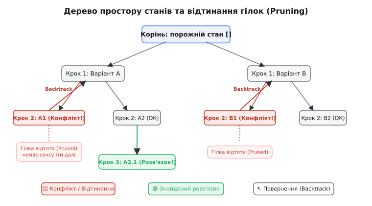
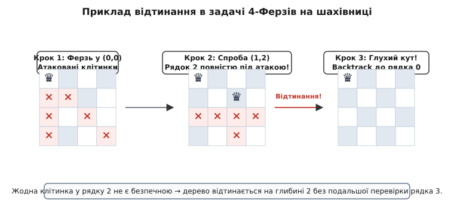

# Пошук із поверненням (backtracking)

<preknowlist>
- [Пошук у глибину (DFS)](book:algorithms/depth-first-search) — рекурсивне обходження графа з просуванням углиб до глухого кута.
- [Рекурсія](book:algorithms/recursion) — виклик функції з самої себе для розбиття задачі на самоподібні підзадачі.
- [Класи P і NP](book:algorithms/np-completeness) — поняття експоненціальної складності та перебору варіантів для комбінаторних задач.
</preknowlist>

Уявіть, що ви потрапили у величезний підземний лабіринт із сотнями заплутаних коридорів, розгалужень та зачинених дверей. Ваша єдина мета — знайти шлях до виходу на поверхню. Як чинитиме людина, якщо в неї немає перед очима карти підземелля?

Один із теоретично можливих підходів — **простий прямолінійний перебір (brute force)**. Ви можете заздалегідь виписати на аркуші всі можливі послідовності поворотів: «на першому роздоріжжі звернути ліворуч, на другому — ліворуч, на третьому — ліворуч...», пройти цей шлях до самого кінця, і якщо впираєтеся в глуху кам'яну стіну — повернутися назад **на самий початок до входу в лабіринт** та почати випробовувати наступну послідовність з нуля: «ліворуч, ліворуч, праворуч...». Якщо лабіринт має глибину всього у 20 роздоріж, а на кожному є 3 альтернативні повороти, повний перебір змусить вас перевірити 3²⁰ ≈ 3.48 мільярда послідовностей. Навіть найшвидший бігун загине від виснаження, повертаючись кожного разу до початкової точки входу.

Проте жодна мисляча людина так не чинить. У реальному житті ми йдемо вглиб лабіринту, приймаючи рішення на кожному черговому роздоріжжі й запам'ятовуючи свій вибір. Якщо ми робимо крок і бачимо перед собою глухий кут, ми **не біжимо назад до входу в лабіринт**. Ми робимо лише один крок назад — до останнього відвіданого роздоріжжя, де ще лишилися недосліджені відгалуження. Ми викреслюємо безнадійну стежку зі списку варіантів і куштуємо наступний напрямок. Якщо й усі напрямки на цьому роздоріжжі виявилися глухими кутами, ми відступаємо ще на один крок назад — до передостаннього роздоріжжя.

Цей природний, гнучкий та алгоритмічно системний спосіб розв'язання складних комбінаторних задач називається **пошуком із поверненням (backtracking)**. Це фундаментальна парадигма побудови алгоритмів, що полягає в інкрементальному (покроковому) формуванні розв'язку з можливістю скасування останніх зроблених виборів при виявленні неприпустимості чи конфліктності поточного стану.

---

## Інтуїція та логічна модель: Дерево простору станів

Щоб перетворити побутову інтуїцію лабіринту на суворий комп'ютерний алгоритм, процес прийняття рішень формалізують у вигляді **дерева простору станів (State Space Tree)**.

У цій абстрактній математичній моделі:
- **Корінь дерева** відповідає початковому порожньому стану, коли жодного вибору чи рішення ще не зроблено.
- **Кожен вузол на глибині k** представляє частковий розв'язок — конфігурацію, у якій зроблено вибір для перших k змінних або кроків.
- **Ребра дерева** відповідають виконанню конкретного вибору (вибору значення для чергової змінної).
- **Листки дерева** поділяються на дві категорії: допустимі повні розв'язки (мета успішно досягнута) або глухі кути (порушено жорсткі обмеження задачі).

### Пам'ять та просторова складність: Чому justement DFS?

Важливим питанням є спосіб обходу цього дерева. Пошук у ширину (BFS) вимагав би збереження в пам'яті всіх вузлів поточного фронту обходу. Для дерева з коефіцієнтом розгалуження b та глибиною d кількість вузлів на останньому рівні становить bᵈ, що вимагає експоненціального обсягу оперативної пам'яті. 

Пошук із поверненням спирається на **пошук у глибину (DFS)**. Завдяки цьому алгоритму потрібно зберігати у пам'яті лише один поточний шлях від кореня до поточного вузла. Це знижує просторову складність із експоненціальної O(bᵈ) до **строго лінійної O(d)**, де d — глибина дерева рішень. Саме ця властивість робить backtracking застосовним на пристроях із обмеженими ресурсами пам'яті.

Головна проблема багатьох комбінаторних задач полягає в тому, що повне дерево станів зростає з експоненціальною або факторіальною швидкістю. Наприклад, у задачі розміщення 8 ферзів на шахівниці безперервний перебір усіх можливих варіантів вимагає розгляду понад 4.4 мільярда конфігурацій, а для 16 ферзів кількість варіантів перевищує 18 квінтильйонів.

Саме тут вступає в дію головна таємниця ефективності backtracking — **відтинання гілок (Pruning)**.


*Дерево простору станів з показаним відтинанням неперспективних гілок та відступом назад.*

Замість того, щоб будувати й перевіряти дерево станів до самого низу (до листків), алгоритм пошуку з поверненням аналізує частковий стан на кожному проміжному кроці k за допомогою **предиката допустимості**. Якщо на глибині k виявляється, що поточна конфігурація **порушує правила задачі** (наприклад, два вже поставлені ферзі атакують один одного по діагоналі), алгоритм негайно припиняє рух углиб цього піддерева.

Одне-єдине відтинання на рівні k дозволяє викреслити з розгляду мільйони або мільярди потенційних продовжень, які виростають із цього вузла. Алгоритм негайно робить **відкат (backtrack)** на рівень k - 1 і продовжує перебір інших альтернатив.

---

## Формалізація алгоритму: Шаблон Choose–Explore–Unchoose

З точки зору програмної реалізації, backtracking найчастіше втілюється у вигляді рекурсивної функції. Стек викликів програмного забезпечення природно виконує роль пам'яті обходу: кожен новий рекурсивний виклик створює новий кадр стека (activation record), додаючи новий рівень глибини, а повернення з функції (return) автоматично відновлює стан батьківського вузла.

Уся внутрішня механіка алгоритму підпорядковується чіткому рекурсивному трикроковому шаблону: **Choose (Обрати) – Explore (Дослідити) – Unchoose (Скасувати вибір)**.

Розглянемо узагальнену структуру алгоритму пошуку з поверненням у псевдокоді:

```
Функція Backtrack(Поточний_Стан):
    1. Перевірка базового випадку (Успіх):
       Якщо Поточний_Стан є Повним і Допустимим Розв'язком:
           Занотувати_Розв'язок(Поточний_Стан)
           Якщо потрібно знайти лише один розв'язок: 
               Повернути TRUE
           Інакше: 
               Повернутися (продовжити пошук наступних розв'язків)

    2. Перебір кандидатів для наступного кроку:
       Для кожного Кандидата з Множини_Можливих_Виборів(Поточний_Стан):
           Якщо Предикат_Обмежень(Поточний_Стан, Кандидат) == TRUE:

               а) CHOOSE (Зробити вибір):
                  Додати Кандидата до Поточний_Стан
                  Оновити структури даних обмежень (наприклад, маски чи масиви)

               б) EXPLORE (Дослідити рекурсивно):
                  Успіх = Backtrack(Поточний_Стан)
                  Якщо Успіх == TRUE і потрібен лише один розв'язок:
                      Повернути TRUE

               в) UNCHOOSE / BACKTRACK (Скасувати вибір):
                  Вилучити Кандидата з Поточний_Стан
                  Відновити структури даних обмежень до попереднього стану

    3. Завершення перебору на поточному рівні:
       Повернути FALSE (усі кандидатні гілки вичерпано, розв'язку тут немає)
```

### Чому крок Unchoose є критично важливим?

Найпоширеніша помилка при самостійній реалізації backtracking — забудькуватість щодо кроку **Unchoose (скасування вибору)**.

Під час рекурсивного спуску функція модифікує спільний стан (наприклад, додає елемент у глобальний масив або встановлює біт у масці). Якщо після повернення з рекурсивного виклику `Backtrack()` стан не буде **точно відновлено** до початкового вигляду, наступна ітерація циклу виконуватиметься на «забруднених» даних. Це призведе або до хибного відтинання правильних гілок, або до вічного циклу, або до аварійного завершення програми.

Крок Unchoose гарантує локальну чистоту стану для кожного вузла дерева рішень: кожна гілка випробовується у строго вихідних умовах.

---

## Наочний приклад: Задача про 4-х Ферзів

Щоб остаточно закріпити логіку роботи backtracking, простежимо покроково розв'язання зменшеної задачі про розміщення 4 ферзів на шахівниці 4×4 так, щоб жоден із них не атакував іншого по горизонталі, вертикалі чи діагоналі.


*Аналіз конфліктних позицій ферзів на шахівниці та негайне відтинання гілок.*

Розставимо ферзів по рядках (по одному ферзю в кожному рядку від 0 до 3):

1. **Рядок 0**: Ставимо першого ферзя в стовпчик 0 -> Стан `[(0, 0)]`.
2. **Рядок 1**:
   - Спроба стовпчика 0: Конфлікт по вертикалі з `(0, 0)` -> Відтинання!
   - Спроба стовпчика 1: Конфлікт по головній діагоналі з `(0, 0)` -> Відтинання!
   - Спроба стовпчика 2: Безпечно! Ставимо ферзя -> Стан `[(0, 0), (1, 2)]`.
3. **Рядок 2**:
   - Спроба стовпчика 0: Конфлікт по вертикалі з `(0, 0)` -> Відтинання!
   - Спроба стовпчика 1: Конфлікт по побічній діагоналі з `(1, 2)` -> Відтинання!
   - Спроба стовпчика 2: Конфлікт по вертикалі з `(1, 2)` -> Відтинання!
   - Спроба стовпчика 3: Конфлікт по головній діагоналі з `(1, 2)` -> Відтинання!
   - **Глухий кут!** Жоден стовпчик у рядку 2 не є безпечним.
4. **BACKTRACKING до Рядка 1**:
   - Скасовуємо вибір ферзя у `(1, 2)` (Unchoose).
   - Випробовуємо наступний стовпчик 3 у рядку 1 -> Стан `[(0, 0), (1, 3)]`.
5. **Рядок 2**:
   - Спроба стовпчика 0: Конфлікт по побічній діагоналі з `(1, 3)` -> Відтинання!
   - Спроба стовпчика 1: Безпечно! Ставимо ферзя -> Стан `[(0, 0), (1, 3), (2, 1)]`.
6. **Рядок 3**:
   - Жоден стовпчик не є безпечним -> Знову глухий кут і Backtracking аж до Рядка 0!
7. **Рядок 0**:
   - Переставляємо першого ферзя в стовпчик 1 -> Стан `[(0, 1)]`.
   - Продовжуючи рекурсивний алгоритм далі, знаходимо повний допустимий розв'язок: `[(0, 1), (1, 3), (2, 0), (3, 2)]`!

Завдяки відтинанню конфліктних позицій алгоритм перевірив лише 27 вузлів замість 256 можливих варіантів розташування фігур.

---

## Задачі з обмеженнями (Constraint Satisfaction Problems — CSP)

Формально більшість задач, для яких застосовується пошук із поверненням, належать до класу **Задач задоволення обмежень (CSP)**.

Модель CSP визначається трійкою ⟨X, D, C⟩:
- **X = {X₁, X₂, ..., Xₙ}**: множина змінних задачі.
- **D = {D₁, D₂, ..., Dₙ}**: множина доменів (можливих значень) для кожної змінної.
- **C = {C₁, C₂, ..., Cₘ}**: множина обмежень, кожне з яких задає допустимі комбінації значень для підмножини змінних.

У цій формулюваній рамці backtracking виступає як загальний соловер для будь-якої задачі CSP: він послідовно призначає значення з домену Dᵢ для змінної Xᵢ та перевіряє, чи не порушено жодне з обмежень C.

### Параметрична складовість (Fixed-Parameter Tractability — FPT)
У теорії складності обчислень пошук із поверненням відіграє фундаментальну роль у контексті **параметризованої складності**. Багато NP-важких задач (наприклад, покриття вершин Vertex Cover або розфарбування графа) стають розв'язаними за поліноміальний час від розміру вхідних даних N, якщо один із внутрішніх параметрів k (наприклад, розмір шуканого покриття) є відносно малим. Backtracking дозволяє будувати FPT-алгоритми з часом виконання **O(f(k) · poly(N))**, де складність експоненціально залежить лише від параметра k, але не від загального розміру даних N.

### Широкий спектр застосувань
- **Комбінаторний пошук та головоломки**: Судоку (Sudoku), Обхід шаховою дошкою (Knight's Tour), Криптарифми (Cryptarithms).
- **Задачі на графах**: Розфарбування графа (Graph Coloring), Пошук Гамільтонового циклу, Знаходження максимальної кліки (Max Clique), Задача про суму підмножини (Subset Sum).
- **Автоматичне доведення теорем та SAT-соловери**: Задовольняшність булевих формул (SAT), верифікація мікропроцесорів та компіляторів.

---

## Паралелізація пошуку з поверненням (Parallel Backtracking)

Сучасні багатоядерні обчислювальні системи вимагають адаптації алгоритмів до паралельного виконання. Пошук із поверненням володіє високим потенціалом для паралелізації, оскільки різні гілки дерева станів є абсолютно незалежними.

Існує два основні підходи до паралелізації backtracking:

1. **Розбиття дерева за рівнем (Static Tree Decomposition)**:
   Верхні k рівнів дерева рішень досліджуються послідовно одним потоком. Сформовані піддерева на глибині k розподіляються між різними ядрами процесора для незалежного рекурсивного обходу.
2. **Динамічний баланс навантаження (Dynamic Work Stealing)**:
   Якщо один із потоків завершує обхід свого піддерева раніше за інших, він звертається до нерозглянутих гілок у стеці сусіднього потоку й «викрадає» піддерево для обробки. Це запобігає простоюванню обчислювальних ядер при нерівномірному відтинанні.

---

## Нехронологічне повернення та аналіз конфліктів (Backjumping)

Класичний backtracking виконує хронологічне повернення: при досягненні глухого кута на рівні k він повертається на рівень k - 1. Проте в багатьох складних задачах конфлікт на рівні k може спричинятися вибором, зробленим набагато раніше — наприклад, на рівні k - 5. Хронологічний відступ даремно перебирає всі альтернативи на рівні k - 1, k - 2, k - 3, хоча вони взагалі не впливають на виниклий конфлікт.

Сучасні модифікації алгоритму, такі як **нехронологічне повернення (Backjumping)** та **Conflict-Driven Clause Learning (CDCL)**, аналізують граф імплікацій при виникненні суперечності. Алгоритм визначає конкретні змінні, які викликали конфлікт, будує нове дійсне обмеження («конфліктний диз'юнкт») та виконує відкат одразу на кілька рівнів вгору — прямо до джерела проблеми. Це дозволяє миттєво оминати величезні безнадійні піддерева простору станів.

---

## Типові помилки та підводні камені реалізації

Під час проектування та програмування алгоритмів пошуку з поверненням початківці часто припускаються кількох типових помилок:

1. **Запізніла перевірка обмежень**: якщо предикат обмежень перевіряється лише у листках дерева станів (коли вже заповнені всі N змінних), алгоритм вироджується у звичайний повний перебір O(bᵈ). Перевірка мусить здійснюватися на **кожному проміжному кроці**.
2. **Забруднення стану (Відсутність Unchoose)**: якщо при відступі назад масиви, маски чи списки відвіданих позицій не повертаються до початкового стану, алгоритм видаватиме хибні результати або пропускатиме розв'язки.
3. **Зациклення на графах**: при пошуку шляхів у графах з циклами необхідно підтримувати структури даних відвіданих вершин (Visited Set), інакше рекурсія потрапить у нескінченний цикл.
4. **Переповнення стека (Stack Overflow)**: для задач із великою глибиною рекурсії (d > 10 000) глибокий рекурсивний стек може перевищити ліміт оперативної пам'яті. У таких випадках застосовують ітеративний backtracking з власноруч керованим стеком або хвостову рекурсію.

---

## Оптимізація та евристичні прискорення

Хоча класичний backtracking значно ефективніший за прямолінійний перебір, у найгіршому випадку його складність залишається експоненціальною O(bᵈ). Щоб кардинально прискорити обхід дерева станів на практиці, застосовують евристичні прийоми:

### 1. Евристика найменшої кількості залишкових значень (MRV — Minimum Remaining Values)
Замість того, щоб обирати наступну змінну для обробки по порядку (наприклад, переходити від рядка 0 до 1, 2...), алгоритм **обирає змінну, яка має найменшу кількість доступних кандидатів**. 
- Якщо у задачі Судоку якась клітинка має лише 1 можливий варіант цифри через наявні обмеження, її потрібно заповнити **першою**. Це дозволяє виявити конфлікти на найраніших етапах і різко зрізає висоту дерева рішень.

### 2. Евристика найменшого обмеження (LCV — Least Constraining Value)
При виборі конкретного значення для змінної алгоритм надає перевагу тому варіанту, який **залишає найбільше свободи (найбільше кандидатів) для сусідніх змінних**. Це підвищує шанс знайти перший розв'язок без додаткових відступів назад.

### 3. Усунення симетрій (Symmetry Breaking)
У багатьох комбінаторних задачах багато розв'язків є дзеркальними відображеннями чи обертаннями один одного. Додавання додаткових обмежень, що виключають симетричні стани, дозволяє скоротити простір пошуку у кілька разів.

### 4. Бітові оптимізації (Bitmasks)
Замість збереження станів у спискових структурах чи складних матрицях, обмеження записують у вигляді цілочисельних бітових масок. Операції перевірки доступності та оновлення стану виконуються за допомогою побітних операцій `AND`, `OR`, `XOR` та зсувів `<<`, `>>` за **O(1)** машинного часу.

---

## Порівняння з іншими алгоритмічними парадигмами

Щоб чітко розуміти, коли саме потрібно обирати пошук із поверненням, порівняємо його з суміжними підходами:

| Характеристика | Backtracking (Пошук із поверненням) | Dynamic Programming (Динамічне програмування) | Branch and Bound (Гілки та межі) | Жадібні алгоритми (Greedy) |
| :--- | :--- | :--- | :--- | :--- |
| **Мета застосування** | Пошук **усіх** або **будь-якого** допустимого розв'язку | Пошук **оптимального** значення (мінімум/максимум) | Пошук **оптимального** розв'язку в комбінаторних задачах | Швидкий пошук **наближеного** чи локального оптимуму |
| **Структура станів** | Глибоке дерево без перекриття станів | Перекривні підзадачі (Overlapping Subproblems) | Дерево станів із бальною оцінкою гілок | Лінійний шлях без повернень назад |
| **Пам'ять** | Дуже мала: **O(d)** (глибина дерева) | Велика: **O(N)** для збереження таблиці станів | Середня/Велика: для збереження черги пріоритетів | Мінімальна: **O(1)** або **O(N)** |
| **Механізм відтинання** | Предикат допустимості (Hard constraints) | Мемоізація / Табуляція вже розв'язаних станів | Верхня/Нижня межа оціночної функції (Bounds) | Відсутній (вибір робиться один раз і назавжди) |

- Якщо задача вимагає побудови **конкретних конфігурацій** (наприклад, виписати всі можливі розстановки ферзів або вийти з лабіринту) — обирають **Backtracking**.
- Якщо задача вимагає обчислення **кількості** варіантів або **найкращого значення** при наявності перекривних підзадач — обирають **Динамічне програмування**.
- Якщо задача є дискретною оптимізацією (наприклад, задача комівояжера TSP) і потрібно швидко відсікти гілки за нижньою оцінкою вартості — обирають **Branch and Bound**.
- Якщо локально найкращий вибір гарантовано веде до глобального оптимуму — обирають **Жадібний алгоритм**.

---

## Детальний розбір у вставках

Для глибшого занурення у теоретичні та практичні аспекти пошуку з поверненням зверніться до спеціалізованих вставок:

- `[📜 Від Лемера та N ферзів до SAT-соловерів](book:algorithms/backtracking/hist-backtracking.md)` — детальна історія виникнення алгоритму від створення обчислювальних машин SWAC у 1950-х роках до революції CDCL SAT-соловерів у сучасній формальній верифікації.
- `[🧮 Дерева станів, Pruning та складність O(b^d)](book:algorithms/backtracking/math-state-space-tree.md)` — математичний апарат: формальний аналіз гілок дерева станів, властивість монотонності обмежень, розрахунок ефективного коефіцієнта розгалуження b_eff та оцінювач Кнута.
- `[⚙️ Реалізація N-ферзів та Судоку](book:algorithms/backtracking/proj-backtracking-nqueens.md)` — практичний розбір вихідного коду для розв'язання N-ферзів із бітовими масками та розв'язувача Судоку 9×9 мовами C++ та Python у порівняльних вкладках.

---

## Підсумок

Пошук із поверненням — це елегантний міст між нездійсненним повним перебором та інтелектуальним орієнтованим пошуком. Завдяки системному поєднанню рекурсивного обходу вглиб із миттєвим відтинанням недопустимих гілок, backtracking дозволяє розв'язувати складні комбінаторні задачі за реальний час, викреслюючи мільярди марних обчислень на кожному кроці.

> 🔧 **Навіщо це.**
> Розуміння backtracking є фундаментальним для розробки будь-яких комбінаторних алгоритмів: від синтаксичних парсерів та компіляторів до автоматичних розв'язувачів головоломок, алгоритмів маршрутизації в графічних редакторах та індустріальних систем автоматизованого проєктування (CAD/EDA). Опанувавши шаблон Choose–Explore–Unchoose, ви отримуєте універсальний каркас для розв'язання будь-якої задачі, що зводиться до вибору серед багатьох альтернатив.
