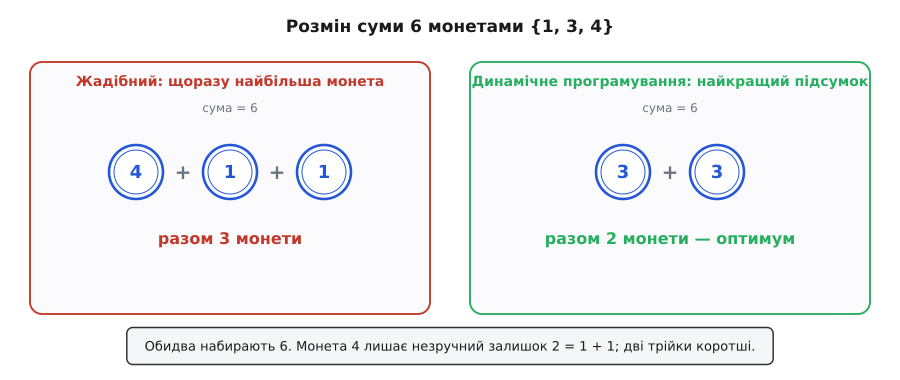
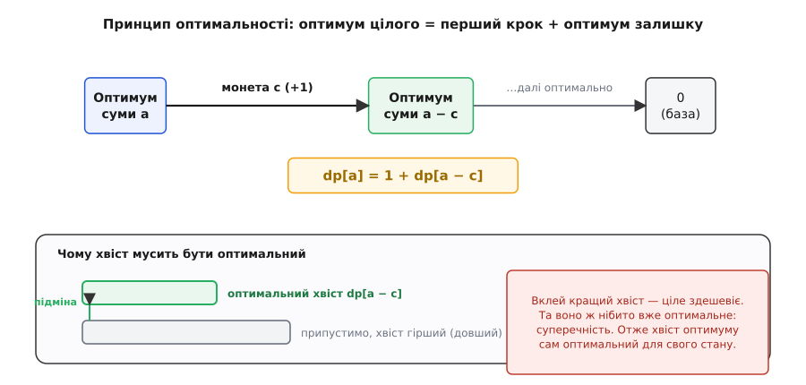
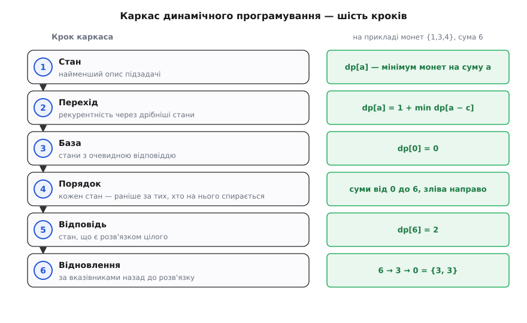

# Динамічне програмування

<preknowlist>
- [Рекурсія](topic:algorithms/recursion) — коли задачу зводять до менших копій себе; на цьому тримається саме поняття підзадачі.
- [Асимптотична складність (O великого)](topic:algorithms/asymptotic-complexity) — як росте обсяг роботи від розміру входу; без неї не побачити, чому наївний перебір експоненційний, а динамічне програмування поліноміальне.
- [Мемоізація](topic:algorithms/memoization) — запам'ятовування вже порахованих відповідей, щоб не рахувати їх удруге; це один із двох способів утілити динамічне програмування, і стаття на нього спирається.
</preknowlist>

Уявімо касира, що видає решту. Треба набрати суму 6 монетами номіналів 1, 3 і 4, і хочеться вкластися в якнайменше монет. Перший порух — **жадібний**: бери щоразу найбільшу монету, що не перевищує залишку. Найбільша монета, не більша за 6, — це 4; лишається 2; тоді 1 і ще 1. Разом три монети: 4 + 1 + 1. Здається, що оптимально, — ми ж щоразу відкушували якнайбільше.

Та це не оптимально. Дві трійки, 3 + 3, дають ту саму шістку **двома** монетами. Жадібний, погнавшись за миттєвою вигодою, проґавив кращий шлях: велика монета 4 загнала залишок у незручні 2, які інакше як двома одиницями не покрити. Такий спосіб — брати найбільше і не озиратися — зветься [жадібним алгоритмом](topic:algorithms/greedy-algorithms), і для деяких наборів монет він таки дає оптимум, а для цього — ні.


*Жадібний проти оптимального на розміні 6 монетами {1, 3, 4}. Жадібний хапає найбільшу монету 4, застряє на залишку 2 і докладає дві одиниці — три монети. Оптимальний бере дві трійки — дві монети. Різниця не в акуратності лічби, а в тому, що жадібний рішенець не переглядає наслідків свого першого кроку.*

Пастка ось у чому: щоб напевно знайти найкращий розмін, треба якось зважити **всі** варіанти першого кроку, а не хапати наосліп найбільший. Але «перебрати всі варіанти» звучить страшно — перша монета дає три можливості, під кожною знову три, і дерево варіантів розгалужується вибухово, як у наївних [числах Фібоначчі](topic:math/fibonacci-numbers). Потрібен спосіб перебрати всі можливості, **не платячи за перебір експонентою**. Саме цей спосіб і є динамічне програмування.

## Оптимум цілого зроблений з оптимумів частин

Почнімо з єдиного спостереження, на якому все тримається. Припустімо, найкращий розмін суми 6 починається з монети 3. Тоді решта того розміну — це розмін суми 3, і ось головне: цей залишок теж мусить бути **найкращим** розміном трійки. Бо якби трійку можна було розміняти дешевше, ми підмінили б цей хвіст на дешевший — і весь розмін шістки став би дешевшим, а він же нібито вже найкращий. Суперечність. Отже оптимальний розв'язок цілого складається з оптимальних розв'язків його частин — інакше й бути не може.

Ця властивість зветься **оптимальною підструктурою** (англ. *optimal substructure*), а сам принцип 1957 року чітко сформулював Річард Беллман як **принцип оптимальності**: хоч який перший крок ти зробив, подальші рішення мусять бути оптимальними вже для того стану, у який перший крок тебе привів. Міркування, яким ми щойно скористалися, — «якби хвіст був не оптимальний, я підмінив би його кращим і поліпшив ціле» — це доведення від супротивного, яке в цій царині називають аргументом «вирізати й вклеїти»; строго його розписано в [математиці оптимальної підструктури](topic:algorithms/dynamic-programming/math-optimal-substructure.md).


*Чому працює принцип оптимальності. Оптимальний розв'язок задачі = перше рішення + оптимальний розв'язок підзадачі, у яку це рішення привело. Якби хвіст (сірий) не був найкращим для свого стану, ми вклеїли б замість нього кращий (зелений) і здешевили ціле — а воно ж уже оптимальне. Суперечність замикає доведення: хвіст мусить бути оптимальним.*

Тепер ця властивість прямо диктує рівняння. Нехай `dp[a]` — найменша кількість монет на суму `a`. Перший крок — вибір якоїсь монети `c` з наявних (звісно, `c ≤ a`). Обравши `c`, ми лишаємось із підзадачею «розміняти `a − c`», і за принципом оптимальності далі її треба розв'язати оптимально, тобто взяти вже готове `dp[a − c]`. Ми не знаємо наперед, яка перша монета найкраща, тож пробуємо кожну й лишаємо найдешевший підсумок:

```
dp[a] = 1 + min( dp[a − c] )   по всіх монетах c ≤ a
dp[0] = 0                       порожню суму набирають нулем монет
```

Верхній рядок — **рекурентність**: рівняння, що виражає відповідь задачі через відповіді її ж менших підзадач. Нижній — **база**: найдрібніша підзадача, відповідь на яку очевидна без жодного рахунку. Ці два рядки повністю визначають задачу; усе інше — механіка їхнього обчислення.

## Ті самі підзадачі, знову і знову

Рекурентність так і проситься, щоб її записали рекурсією просто в лоб: щоб порахувати `dp[a]`, виклич себе на `a − 1`, `a − 3`, `a − 4`, візьми мінімум, додай одиницю. Логічно правильно — і згубно повільно. Щоб порахувати `dp[6]`, знадобиться `dp[5]`, `dp[3]`, `dp[2]`; але `dp[5]` знову тягне `dp[2]`, а `dp[2]` виринає ще й під `dp[3]`, і те саме `dp[2]` рахується наново в різних гілках. Нижче та сама біда множиться, і робота роздувається експоненційно — точнісінько хвороба наївного `fib`.

А тепер погляньмо, **скільки насправді є різних підзадач**. Це `dp[0]`, `dp[1]`, …, `dp[6]` — рівно сім штук, по одній на кожну суму від нуля до цільової. Не експонента різних шляхів, а коротка лінійка станів. Уся марнота була в тому, що ми ту саму жменьку станів перелічували безліч разів. Ліки очевидні: порахувати кожен стан **один раз** і запам'ятати. Це і є другий стовп динамічного програмування — **перекривні підзадачі**: дерево викликів наївної рекурсії насправді знову й знову впирається в ту саму невелику множину станів.

Механізм запам'ятовування — це [мемоізація](topic:algorithms/memoization): рахуємо звичайною рекурсією, але кожну відповідь кладемо в записник і, перш ніж рахувати, зазираємо туди. Експонента шляхів згортається до лінійки станів, бо кожен стан обчислюється рівно раз. Динамічне програмування — це і є поєднання двох речей: **рекурентність з оптимальною підструктурою** (щоб рівняння було правильне) плюс **перекривні підзадачі** (щоб його було вигідно рахувати з пам'яттю).

Тут проходить чітка межа з сусідньою парадигмою — [розділяй і володарюй](topic:algorithms/divide-and-conquer). Вона теж дробить задачу на підзадачі того самого ґатунку, але там підзадачі **не перетинаються**: сортуючи злиттям, ліву половину й праву рахують окремо, і той самий відрізок удруге не трапляється, тож кешувати нема чого. Динамічне програмування живе саме там, де підзадачі **густо перекриваються**. Звідси просте правило на роздоріжжі: підзадачі незалежні — розділяй і володарюй; перекриваються — запам'ятовуй, тобто динамічне програмування.

> 🔧 **Навіщо це.** Дві умови — оптимальна підструктура й перекривні підзадачі — це готовий тест, чи візьме задачу динамічне програмування, перш ніж писати бодай рядок. Оптимум цілого справді збирається з оптимумів частин? Якщо ні, рекурентність брехатиме — і жодна оптимізація коду не врятує неправильної формули. Підзадачі повторюються? Якщо кожна унікальна, кешувати нема чого, і це радше задача для поділу. Дві галочки — і можна впевнено сідати за таблицю.

## Каркас, придатний до будь-якої задачі

Розмін монет показав усі рухи наживо; тепер випишімо їх як каркас, до якого зводиться **будь-яка** задача динамічного програмування. Це не якийсь один алгоритм, а дисципліна з шести кроків — щоразу та сама, міняється лише начинка.


*Каркас динамічного програмування. Спершу назвати **стан** — найменший опис підзадачі; тоді **перехід** — рекурентність, що виражає стан через дрібніші; **база** — стани з очевидною відповіддю; **порядок** — так обходити стани, щоб кожен уже спирався на готові; **відповідь** — який стан і є розв'язком цілого; і за потреби **відновлення** — як від чисел у таблиці повернутися до самого розв'язку.*

1. **Стан.** Найменший опис підзадачі — рівно стільки, скільки треба, щоб відповідь від нього залежала, і жодної зайвої деталі. Для монет стан одновимірний: сума `a`, і `dp[a]` — відповідь на неї. Правильний стан — половина успіху: надто бідний плутатиме різні ситуації під одним записом, надто багатий роздує таблицю без потреби.
2. **Перехід.** Рекурентність — як виразити стан через дрібніші. Тут живе принцип оптимальності: перебрати перші кроки й скласти вартість кроку з оптимальною вартістю стану, у який він веде.
3. **База.** Стани, відповідь на які відома без рекурентності. `dp[0] = 0`. Без бази рекурсія падала б у безодню без дна.
4. **Порядок обчислення.** Кожен стан треба порахувати **раніше**, ніж на нього зіпруться інші. Стани й залежності між ними — це граф, а правильний порядок — його топологічне впорядкування: для монет досить іти від меншої суми до більшої, бо `dp[a]` спирається лише на менші суми.
5. **Відповідь.** Який саме стан і є розв'язком цілого. Тут — `dp[amount]`.
6. **Відновлення розв'язку.** Таблиця дає лише **число** — скільки монет, — а не самі монети. Щоб дістати їх, при кожному `dp[a]` запам'ятовують, який `c` дав мінімум, і потім ідуть від цілі назад по цих вказівниках.

> 🔧 **Навіщо це.** Ці шість кроків — робочий план штурму нової задачі, а не теорія для екзамену. Стикаєшся з оптимізаційною задачею й підозрюєш динамічне програмування — питай по черзі: що таке стан? який перехід? де база? в якому порядку рахувати? де відповідь? І майже вся творча частина роботи — у перших двох кроках; щойно стан і перехід названо правильно, решта — механіка. Саме тому досвід із динамічним програмуванням — це насамперед навичка **бачити стан**.

## Два боки: згори вниз і знизу вгору

Каркас можна виконати у два боки, і обидва дають ту саму відповідь. **Згори вниз** — записати рекурентність буквально як рекурсію й почепити на неї мемоізацію: рахуємо лише ті стани, до яких справді дійшли, а відповіді осідають у кеші. **Знизу вгору** — **табуляція**: завести масив і заповнити його від бази до відповіді циклом, у топологічному порядку, де кожен стан уже спирається на готові. Рекурсії немає, кеш-перевірок немає — просто цикл, що наповнює таблицю. Обидва напрямки — те саме динамічне програмування; докладно ця двоїстість розібрана в темі [мемоізація](topic:algorithms/memoization).

Ось розмін монет знизу вгору, разом із відновленням самих монет через масив вказівників `from`:

:::tabs
```py
def min_coins(coins, amount):
    INF = amount + 1
    dp   = [0] + [INF] * amount        # dp[0] = 0, решта — «поки недосяжно»
    frm  = [-1] * (amount + 1)         # яка монета дала мінімум для суми a
    for a in range(1, amount + 1):
        for c in coins:
            if c <= a and dp[a - c] + 1 < dp[a]:
                dp[a]  = dp[a - c] + 1
                frm[a] = c
    if dp[amount] >= INF:
        return None                    # такими монетами суму не набрати
    coins_used, a = [], amount         # відновлюємо розв'язок, ідучи назад
    while a > 0:
        coins_used.append(frm[a])
        a -= frm[a]
    return coins_used
```
```cpp
#include <vector>
#include <optional>

std::optional<std::vector<int>> min_coins(const std::vector<int>& coins, int amount) {
    const int INF = amount + 1;
    std::vector<int> dp(amount + 1, INF), from(amount + 1, -1);
    dp[0] = 0;                                   // база
    for (int a = 1; a <= amount; ++a)
        for (int c : coins)
            if (c <= a && dp[a - c] + 1 < dp[a]) {
                dp[a]   = dp[a - c] + 1;         // кращий перехід
                from[a] = c;                     // запам'ятати вибір для відновлення
            }
    if (dp[amount] >= INF) return std::nullopt;  // недосяжно
    std::vector<int> used;
    for (int a = amount; a > 0; a -= from[a])    // йдемо від цілі назад
        used.push_back(from[a]);
    return used;
}
```
:::

Простежмо роботу руками — саме так найясніше видно, що жоден стан не рахується двічі.

**Умова.** Монети {1, 3, 4}, сума 6. Заповнюємо `dp` зліва направо, від малих сум до великої.

```
dp[0] = 0                                          (порожньо)
dp[1] = 1 + dp[0]                       = 1        (1)
dp[2] = 1 + dp[1]                       = 2        (1, 1)
dp[3] = 1 + min( dp[2], dp[0] )         = 1        (3)      ← монета 3 б'є дві одиниці
dp[4] = 1 + min( dp[3], dp[1], dp[0] )  = 1        (4)
dp[5] = 1 + min( dp[4], dp[2], dp[1] )  = 2        (4, 1)
dp[6] = 1 + min( dp[5], dp[3], dp[2] )  = 2        (3, 3)   ← через dp[3], монета 3
```

Відповідь `dp[6] = 2`, а слід відновлення 6 → 3 → 0 називає самі монети: спершу взяли 3 (лишилось 3), потім ще 3 (лишилось 0). Розв'язок — {3, 3}, той самий, який жадібний рішенець проґавив.

![Заповнена таблиця dp для розміну монетами {1,3,4}: клітини від 0 до 6 зі значеннями 0,1,2,1,1,2,2; для клітини 6 показано три стрілки-переходи від dp[5], dp[3], dp[2] з підписами монет, і виділено найдешевший — через dp[3] монетою 3](/book/algorithms/design-paradigms/dynamic-programming/img/coin-table.svg)
*Таблиця підзадач розміну. Кожна клітина `dp[a]` — найменша кількість монет на суму `a`. Клітину 6 рахуємо, зазираючи в три раніші: `dp[5]` (взяли б монету 1), `dp[3]` (монету 3), `dp[2]` (монету 4). Найдешевша з трьох — `dp[3] = 1`, тож `dp[6] = 2` через монету 3 (зелена стрілка). Жовтий слід 6 → 3 → 0 відновлює самі монети — {3, 3}. Клітин лише сім, кожна порахована раз.*

## Скільки це коштує

Час динамічного програмування майже завжди читається однією формулою: **(кількість станів) × (робота на один перехід)**. Це прямий наслідок того, що кожен стан рахуємо рівно раз, а на кожному робимо перехід. Для монет станів `a + 1` (суми від 0 до `amount`), а на кожному переборюємо всі `k` монет — отже `O(amount · k)`. Порівняймо з наївним перебором: там кількість шляхів росла експоненційно, а тут — добуток двох невеликих чисел. Уся сила парадигми стиснута в цьому переході від «стільки, скільки шляхів» до «стільки, скільки станів».

Пам'ять у лоб — теж за кількістю станів: `O(amount)` на таблицю. Але часто її можна різко втяти. Придивившись до порядку заповнення, іноді видно, що для нового стану потрібні лише кілька найсвіжіших, а вся давніша частина таблиці більше не знадобиться, — тоді її викидають і тримають лише «ковзне вікно». У двовимірних задачах це зазвичай означає зберігати не цілу сітку, а кілька останніх рядків: так роблять і в [задачі про рюкзак](topic:algorithms/dynamic-programming/proj-knapsack.md), і в [редакційній відстані](topic:algorithms/memoization). Час лишається той самий, а пам'ять падає на порядок.

## Де ця відмичка не підходить

Динамічне програмування могутнє, але не всесильне, і корисно бачити його межу — інакше почнеш будувати таблиці там, де рекурентність тихо бреше.

Уся будова стоїть на **оптимальній підструктурі**, а вона дарована не завжди. Класичний контрприклад — **найдовший простий шлях** у графі (простий — без повторення вершин). Здавалося б, найдовший шлях з `A` до `C` через `B` мав би складатися з найдовшого від `A` до `B` і найдовшого від `B` до `C`. Але це неправда: два найдовші півшляхи можуть заходити в одні й ті самі вершини, а склеївши їх, ми повторимо вершину — і шлях уже не простий. Оптимальні частини не склеюються в оптимальне ціле, принцип оптимальності не діє, і наївна рекурентність дає неправильну відповідь. Розбір цього провалу — у [математиці оптимальної підструктури](topic:algorithms/dynamic-programming/math-optimal-substructure.md). Показово, що для **найкоротшого** шляху підструктура є (звідси й працює [алгоритм Беллмана–Форда](topic:algorithms/bellman-ford)), а для найдовшого — ні; парадигма чутлива до таких дрібниць.

Друга умова — **перекривні підзадачі**. Якщо оптимальна підструктура є, а підзадачі не перетинаються, динамічне програмування нічого не додасть проти звичайного поділу: кешувати нема що. Обидві умови мусять бути разом.

> 🔧 **Навіщо це.** Перш ніж заводити таблицю, варто чесно перевірити оптимальну підструктуру, а не припускати її. Найпідступніші помилки в динамічному програмуванні — не в коді, а саме тут: рекурентність виглядає правдоподібно, таблиця заповнюється, програма видає число — і воно неправильне, бо оптимум частин не збирається в оптимум цілого. Провалів такого штибу цілий звіринець: задачі, де вибір у одній підзадачі зв'язує руки в іншій (підзадачі не незалежні), або де стан не тримає всієї потрібної інформації. Коротка перевірка «чи справді хвіст оптимального розв'язку оптимальний для свого стану?» рятує від годин налагодження правильного коду з хибною формулою.

## Одна форма — багато облич

Щойно навчишся бачити стан і перехід, той самий каркас проступає в задачах, які на позір не мають нічого спільного. Різняться вони лише тим, **що таке стан** і **як записана рекурентність**:

- **[Задача про рюкзак](topic:algorithms/dynamic-programming/proj-knapsack.md)** — набрати найцінніший набір речей, не перевищивши місткості. Стан двовимірний: перші `i` речей і залишок місткості `w`; на кожному кроці рішення бінарне — взяти річ чи ні. Повний робочий код із відновленням набору й ощадною пам'яттю зібрано окремо.
- **[Редакційна відстань](topic:algorithms/memoization)** — за скільки правок один рядок перетворюється на інший; стан — пара префіксів, перехід — найдешевша з трьох операцій. Розібрана в темі про мемоізацію.
- **Найдовша спільна підпослідовність** і **найдовша зростальна підпослідовність** — вирівнювання й порядок; **множення ланцюжка матриць** — де найдешевше розставити дужки; **[алгоритм Беллмана–Форда](topic:algorithms/bellman-ford)** — найкоротші шляхи через рекурентність по кількості ребер. Скрізь та сама трійця: стан, перехід, порядок обчислення.

Динамічне програмування вражає навіть за межами інформатики: вирівнювання послідовностей ДНК у біології, розпізнавання мовлення (алгоритм Вітербі), керування запасами й оптимальні стратегії в економіці — усе це багатоетапні задачі рішень, для яких Беллман і придумав свій апарат.

## Звідки назва

Ім'я «динамічне програмування» звучить технічно, а народилося майже як маскування. Апарат розробив американський математик Річард Беллман у корпорації RAND (дослідницький центр при ВПС США) в середині 1950-х, вивчаючи багатоетапні задачі оптимального рішення. За його ж розповіддю в автобіографії «Око урагану» (*Eye of the Hurricane*, 1984), слово «програмування» він узяв у сенсі **планування** — складання оптимального розкладу чи плану, як у спорідненому «лінійному програмуванні», — а не в сенсі писання коду; а «динамічне» — щоб підкреслити багатоетапність у часі й водночас щоб назва звучала поважно й не давалася до зневаги. Беллман згадував, що тодішній міністр оборони мав хворобливу відразу до самого слова «дослідження», тож нейтральна назва оберігала фінансування. Історики (зокрема Стюарт Дрейфус) зауважують, що ця мила легенда хронологічно не сходиться — перша Беллманова праця з терміном вийшла ще 1952 року, до того як той міністр обійняв посаду, — тож анекдот радше прикрашений. Як там було насправді й чим був RAND — у [історії народження динамічного програмування](topic:algorithms/dynamic-programming/hist-bellman.md).

## Підсумок теми

Динамічне програмування — це загальний каркас, щоб розв'язати оптимізаційну задачу перебором усіх варіантів, **не платячи за перебір експонентою**. Він тримається на двох умовах. Перша — **оптимальна підструктура** (принцип оптимальності Беллмана): оптимум цілого складається з оптимумів його підзадач, бо гірший хвіст завжди можна підмінити кращим і поліпшити ціле. Ця властивість перетворює задачу на **рекурентність** — рівняння, що виражає стан через дрібніші стани, — плюс **базу** з очевидною відповіддю. Друга умова — **перекривні підзадачі**: наївна рекурсія знову й знову впирається в ту саму невелику множину станів, тож кожен стан рахують раз і запам'ятовують (мемоізацією згори вниз чи табуляцією знизу вгору). Разом це згортає експоненту різних шляхів до лінійки різних станів. Практична робота — це шість кроків: назвати **стан**, записати **перехід**, задати **базу**, обрати **порядок** обчислення (топологічний), указати, де **відповідь**, і за потреби **відновити** сам розв'язок за вказівниками. Час читається формулою «кількість станів × робота на перехід», а пам'ять часто вдається втяти до кількох останніх станів. Межа парадигми там, де оптимальної підструктури немає (найдовший простий шлях) або де підзадачі не перетинаються (тоді це просто розділяй і володарюй). Один каркас із різною начинкою стоїть за рюкзаком, редакційною відстанню, найдовшими підпослідовностями, множенням ланцюжка матриць, найкоротшими шляхами Беллмана–Форда і навіть вирівнюванням ДНК — усюди та сама трійця: стан, перехід, порядок.
