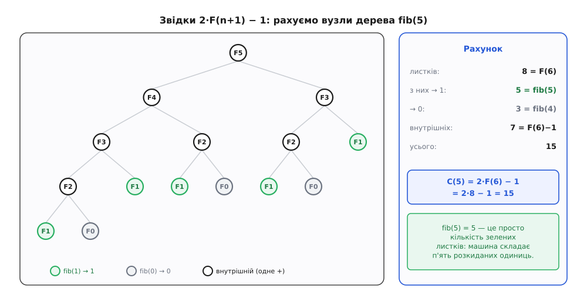
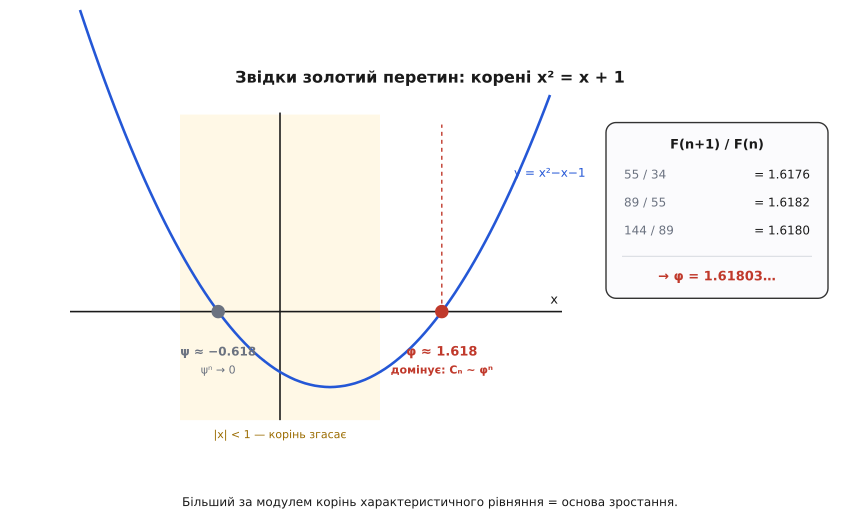
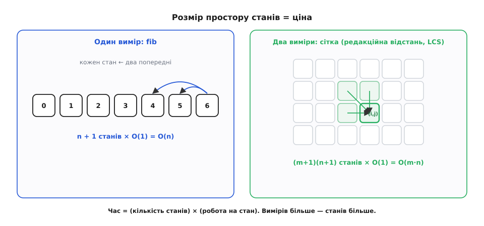

# 🧮 Скільки коштує наївний Фібоначчі: точний рахунок

Фразу «наївний `fib` росте експоненційно» повторюють так часто, що вона стає замовлянням — його промовляють, не заглядаючи всередину. А всередині ховається щось значно цікавіше за саме «експоненційно»: точна формула на кількість роботи, і вона виходить *тим самим* числом Фібоначчі, яке ми намагаємося порахувати. Тобто програма примудряється бути рівно настільки повільною, наскільки велике її ж власне значення. Розкладімо це до кісток — і заразом побачимо, звідки в задачі про кроликів береться золотий перетин і чому запам'ятовування зрізає роботу з експоненти до прямої.

Домовмося рахувати конкретну річ. Візьмімо найпряміший запис означення:

```py
def fib(n):
    if n < 2:
        return n
    return fib(n - 1) + fib(n - 2)
```

Нас цікавить **C(n)** — скільки всього разів буде викликано `fib`, поки ми обчислюємо `fib(n)`. Не час у секундах, не «приблизно багато», а точне ціле число звернень до функції. Це чесна одиниця виміру роботи: кожен виклик — це вхід у функцію, перевірка умови й або миттєве повернення, або одне додавання. Порахуємо виклики — знатимемо все.

## Рекурентність: кожен виклик тягне два і плюс себе

Подивімося на тіло функції очима лічильника. Один виклик `fib(n)` — це, по-перше, він сам: один. По-друге, якщо `n ≥ 2`, він породжує рівно два дочірні виклики — `fib(n−1)` і `fib(n−2)`, — і кожен з них тягне свій власний почет викликів. Складімо:

```
C(n) = C(n−1) + C(n−2) + 1        для n ≥ 2
C(0) = 1
C(1) = 1
```

Та «+1» — не косметика, а серце справи: це **сам поточний виклик**. Кожен вузол у дереві рекурсії доклав рівно одну одиницю до загального рахунку — за факт свого існування. База `C(0) = C(1) = 1`, бо для `n < 2` функція заходить, бачить `n < 2` і одразу виходить: один виклик, жодного дочірнього.

Прокрутімо рекурентність руками — числа скажуть більше за будь-яке пояснення:

```
C(0)  = 1
C(1)  = 1
C(2)  = 1 + 1 + 1  = 3
C(3)  = 3 + 1 + 1  = 5
C(4)  = 5 + 3 + 1  = 9
C(5)  = 9 + 5 + 1  = 15
C(6)  = 15 + 9 + 1 = 25
C(7)  = 25 + 15 + 1 = 41
C(8)  = 41 + 25 + 1 = 67
C(9)  = 67 + 41 + 1 = 109
C(10) = 109 + 67 + 1 = 177
```

Отже, `fib(5)` коштує 15 викликів, `fib(10)` — уже 177. Рахунок росте помітно швидше, ніж саме `n`: подвоюється приблизно кожні півтора кроки. Але поки що це просто таблиця. Хочеться **закритої форми** — формули, що дає `C(n)` одразу, без прокручування всього ланцюга.

## Закрита форма: C(n) = 2·F(n+1) − 1

Придивімося до колонки значень `C`: 1, 1, 3, 5, 9, 15, 25, 41, 67, 109, 177. Поруч випишімо [числа Фібоначчі](topic:math/fibonacci-numbers) `F(n)` (де `F(0) = 0`, `F(1) = 1`): 0, 1, 1, 2, 3, 5, 8, 13, 21, 34, 55, 89. Придивімося ще раз — і збіг вигулькне сам:

```
C(0) = 1   = 2·1  − 1 = 2·F(1)  − 1
C(1) = 1   = 2·1  − 1 = 2·F(2)  − 1
C(2) = 3   = 2·2  − 1 = 2·F(3)  − 1
C(3) = 5   = 2·3  − 1 = 2·F(4)  − 1
C(4) = 9   = 2·5  − 1 = 2·F(5)  − 1
C(5) = 15  = 2·8  − 1 = 2·F(6)  − 1
...
C(10) = 177 = 2·89 − 1 = 2·F(11) − 1
```

Гіпотеза очевидна: **C(n) = 2·F(n+1) − 1**. Але вгадана закономірність — ще не доведена; зробімо це двома способами, бо кожен світить своїм боком.

**Спосіб перший — прибрати «+1» заміною.** Та настирлива одиниця в рекурентності `C(n) = C(n−1) + C(n−2) + 1` заважає: без неї ми мали б чисту рекурентність Фібоначчі. То виженімо її. Введімо нову величину `G(n) = C(n) + 1` і подивімося, якій рекурентності підкоряється вона:

```
G(n) = C(n) + 1
     = ( C(n−1) + C(n−2) + 1 ) + 1
     = ( C(n−1) + 1 ) + ( C(n−2) + 1 )
     = G(n−1) + G(n−2)
```

Одиниця розклалася порівну між двома доданками й зникла! `G` підкоряється *чистій* рекурентності Фібоначчі, без жодного залишку. А починається вона з `G(0) = C(0)+1 = 2` і `G(1) = C(1)+1 = 2`. Послідовність, що росте за правилом Фібоначчі, але стартує з `2, 2` замість `1, 1`, — це просто подвоєна фібоначчієва: `G(n) = 2·F(n+1)` (перевірмо старт: `2·F(1) = 2`, `2·F(2) = 2` — сходиться). Повертаючись до `C`:

```
C(n) = G(n) − 1 = 2·F(n+1) − 1
```

Доведено. Але цей доказ, хоч і бездоганний, лишає відчуття фокуса: «одиниця чарівно розклалася». Другий спосіб прибирає магію й показує, *чому саме* двійка й Фібоначчі.

**Спосіб другий — порахувати вузли дерева.** Кожен виклик — це вузол у дереві рекурсії. Придивімося до форми цього дерева: вузол `fib(k)` для `k ≥ 2` має рівно двох дітей, а `fib(0)` і `fib(1)` — жодного. Отже, кожен вузол має **або двох дітей, або жодного** — це так зване *повне двійкове дерево*. А в будь-якому повному двійковому дереві діє залізна арифметика: якщо листків `L`, то внутрішніх вузлів рівно `L − 1`, а всього вузлів — `2L − 1`. (Інтуїція: почніть з одного листка й щоразу, «розкриваючи» листок у внутрішній вузол із двома новими листками, ви додаєте один внутрішній і один листок — баланс `внутрішні = листки − 1` тримається завжди.)

Лишилося порахувати листки. Листок — це виклик `fib(0)` або `fib(1)`. Позначмо їхню кількість `L(n)`. Листки `fib(n)` — це листки лівого піддерева `fib(n−1)` плюс листки правого `fib(n−2)`, тож `L(n) = L(n−1) + L(n−2)`, з базою `L(0) = L(1) = 1`. Знову рекурентність Фібоначчі, і `L(n) = F(n+1)`. Підставляємо в арифметику повного дерева:

```
усього викликів = 2·(листків) − 1 = 2·F(n+1) − 1 = C(n)
```

Той самий результат, але тепер видно його кістяк: **двійка — це «листків удвічі більше за внутрішні вузли з точністю до одного», а Фібоначчі — це кількість листків.** Жодної магії, сама геометрія дерева.


*Звідки береться `2·F(n+1) − 1`. Дерево `fib(5)` — повне двійкове: кожен вузол має двох дітей або жодного. Листків — 8 = F(6); внутрішніх — на один менше, 7; усього 15 = 2·8 − 1 = C(5). Зелені листки — виклики `fib(1)`, що повертають 1; їх рівно 5, і це саме значення `fib(5)`. Машина будує число 5, складаючи п'ять розкиданих одиниць.*

## Найглибше «чому»: алгоритм рахує одиницями

Друга картина відкриває те, чого не видно з формул. Що взагалі повертає наївний `fib`? Кожен листок віддає 0 (якщо це `fib(0)`) або 1 (якщо `fib(1)`), а кожен внутрішній вузол просто складає те, що прийшло знизу. Отже, підсумкове число `fib(n)` — це **сума всіх листкових одиничок**, тобто просто кількість листків-`fib(1)`. А скільки їх? Рівно `F(n)`: адже результат дорівнює `F(n)`, і зібраний він з одиниць.

Ось воно, справжнє дно. **Наївний алгоритм обчислює `F(n)`, буквально додаючи одиницю до одиниці `F(n)` разів**, розсипавши ці одиниці по листках дерева. Він не «повільний через неефективність» — він робить рівно стільки додавань одиниць, скільки одиниць у відповіді. Порахувати `F(50) ≈ 1.2·10¹⁰` цим способом — це те саме, що дорахувати до дванадцяти мільярдів по одному. Не дивно, що машина задумується: її попросили перелічити стовпчик з мільярдів паличок.

Це й пояснює, чому жодна дрібна оптимізація тут не рятує. Проблема не в тому, що виклик функції коштує дорого чи що додавання повільне. Проблема структурна: **обсяг роботи прив'язаний до величини відповіді, а відповідь росте експоненційно.** Поки алгоритм здобуває `F(n)` як суму `F(n)` одиниць, він приречений бути повільним рівно настільки, наскільки велике `F(n)`. Порятунок мусить розірвати саме цей зв'язок — перестати щоразу перескладати число з нуля.

Заразом ми отримали й точну ціну в додаваннях, а не лише у викликах. Кожне додавання виконує один внутрішній вузол, тож наївний `fib(n)` робить `F(n+1) − 1` додавань. Викликів `2·F(n+1) − 1`, додавань `F(n+1) − 1` — обидва ростуть як одне й те саме число Фібоначчі, обидва експоненційні.

> 🔧 **Навіщо це.** Уміння перевести «повільно» в точну формулу — це різниця між знахарством і медициною. Коли ви бачите рекурсію з перекривними викликами, той самий рахунок — «скільки всього вузлів у дереві та скільки з них різних» — одразу каже, скільки коштуватиме наївна версія і скільки зекономить кеш. Не треба запускати й чекати: формула `2·F(n+1) − 1` виводиться на папері за хвилину й дає відповідь для будь-якого `n`, зокрема для тих, до яких програма живою не дійде.

## Асимптотика: звідки в кроликах золотий перетин

Формула `C(n) = 2·F(n+1) − 1` точна, але як **швидко** росте саме `F`? Тут виходить на сцену золотий перетин, і його поява — не збіг і не містика, а неминучий наслідок вигляду рекурентності. Простежмо, звідки він береться, бо це модельний прийом для *будь-якої* лінійної рекурентності.

Питаємо: чи є в `F(n) = F(n−1) + F(n−2)` розв'язки простого вигляду? Найпростіше, що росте з постійним темпом, — це геометрична прогресія, `F(n) = xⁿ` для якогось `x`. Підставмо цей здогад у рекурентність і подивімося, який `x` його задовольнить:

```
xⁿ = xⁿ⁻¹ + xⁿ⁻²
```

Поділимо все на `xⁿ⁻²` (степінь, спільний для всіх доданків) — і рекурентність, що пов'язувала три сусідні члени, стискається до одного скромного квадратного рівняння:

```
x² = x + 1        ⟺        x² − x − 1 = 0
```

Це **характеристичне рівняння** послідовності. Його коріння — за шкільною формулою:

```
x = (1 ± √5) / 2

φ = (1 + √5) / 2 ≈ 1.6180339887…     (золотий перетин)
ψ = (1 − √5) / 2 ≈ −0.6180339887…
```

Ось де народжується `φ`. Він не «пов'язаний з красою квіток» і не приплетений ззовні — він просто корінь `x² = x + 1`, а це рівняння є не що інше, як стиснута форма правила «кожен член дорівнює сумі двох попередніх». Обидва корені дають розв'язки, а що рекурентність лінійна — підходить і будь-яка їхня суміш `F(n) = A·φⁿ + B·ψⁿ`. Сталі `A, B` підганяємо під старт `F(0) = 0`, `F(1) = 1`; виходить `A = 1/√5`, `B = −1/√5`, і отримуємо славнозвісну закриту форму Фібоначчі:

```
F(n) = ( φⁿ − ψⁿ ) / √5
```

Її звуть формулою Біне — за іменем француза Жака Філіппа Марі Біне, який опублікував її 1843 року. Та «перший» тут радше ярлик, що прилип: закриту форму знав Абрахам де Муавр ще близько 1718-го (він же дав загальний метод для лінійних рекурентностей), а Даниїл Бернуллі та Леонард Ойлер володіли нею в 1720-х. Тож формула стара, а прізвище на ній — пізніше й не найсправедливіше; це радше усталена назва, ніж запис про першовідкриття.

Тепер найважливіше — який із двох коренів керує зростанням. Поглянемо на модулі: `φ ≈ 1.618 > 1`, а `|ψ| ≈ 0.618 < 1`. Що це означає для доданків `φⁿ` і `ψⁿ` за великих `n`? `φⁿ` злітає вгору, а `ψⁿ` **згасає до нуля** — підносьте `0.618` до дедалі вищих степенів, і воно тане (уже `ψ¹⁰ ≈ 0.008`). Тому за великих `n` другий доданок можна викинути, і лишається чисте:

```
F(n) ≈ φⁿ / √5
```

Настільки чисте, що `F(n)` — це просто `φⁿ/√5`, заокруглене до найближчого цілого. А наш рахунок викликів `C(n) = 2·F(n+1) − 1` успадковує той самий темп:

```
C(n) ≈ (2/√5) · φⁿ⁺¹ = (2φ/√5) · φⁿ ≈ 1.447 · φⁿ
```

Отже, **C(n) = Θ(φⁿ)** — [асимптотично](topic:algorithms/asymptotic-complexity) кількість роботи росте як `φ` у степені `n`, з основою рівно `1.618…`. Оце й є те «приблизно 1.618ⁿ»: не підігнане під око число, а точна основа експоненти, і вона — золотий перетин.

Тут варто побачити ширшу правду, бо вона працює далеко за межами Фібоначчі. У будь-якій лінійній рекурентності темп зростання диктує **корінь характеристичного рівняння з найбільшим модулем** — рано чи пізно його степінь переганяє й затирає всі інші доданки. Той самий факт має й матричне обличчя: крок Фібоначчі `(F(n−1), F(n−2)) → (F(n), F(n−1))` — це множення на матрицю `[[1,1],[1,0]]`, а її власні числа — рівно `φ` і `ψ`. Зростання послідовності керує найбільше власне число, і це `φ`. Тож золотий перетин тут — не прикраса, а **множник, на який рахунок домножується щоразу, коли `n` підростає на одиницю**.


*Золотий перетин як корінь. Парабола `y = x² − x − 1` перетинає нуль у двох точках — `φ ≈ 1.618` і `ψ ≈ −0.618`. Смуга `|x| < 1` — зона згасання: корінь `ψ` у ній, тож `ψⁿ → 0` і зникає. Лишається `φ > 1`, і саме він стає основою експоненти: `Cₙ ~ φⁿ`. Відношення сусідніх значень `F(n+1)/F(n)` сходиться до `φ`: 1.6176, 1.6182, 1.6180, …*

## Мемоізована межа: один принцип на всі задачі

Тепер поставмо поруч дороговартісний наївний рахунок і його полагоджену версію — з кешем, що пам'ятає вже пораховане. Щоб оцінити її ціну, не потрібне нове дерево й нова рекурентність; вистачить одного загального принципу, який працює для *будь-якої* мемоізованої рекурсії:

```
загальна робота ≈ (кількість РІЗНИХ підзадач) × (робота на одну підзадачу)
```

Чому саме так? Бо кеш ділить усі виклики на два ґатунки. Перший раз для кожного аргументу — це «схиблення»: справжнє обчислення, реальна робота. Кожне наступне звернення з тим самим аргументом — «влучання»: миттєвий погляд у таблицю, без переобчислення. Різних аргументів рівно стільки, скільки різних підзадач; отже, справжня робота виконується рівно `(кількість різних підзадач)` разів, і кожна коштує стільки, скільки одне обчислення підзадачі *за умови, що її складники вже готові*.

Прикладімо до `fib`. Скільки різних підзадач? Аргументи пробігають `0, 1, 2, …, n` — це **`n + 1` різних значень**, не більше. Робота на одну підзадачу, коли двоє менших уже в кеші, — одне додавання, тобто `O(1)`. Перемножуємо:

```
робота ≈ (n + 1) · O(1) = O(n)
```

Було `Θ(φⁿ)`, стало `O(n)`. Уся прірва між експонентою та прямою — це різниця між «скільки вузлів у дереві» (`2·F(n+1) − 1`, експоненційно) і «скільки серед них *різних*» (`n + 1`, лінійно). Кеш не прискорює жодного окремого додавання — він лише не дає рахувати те саме двічі, і цього досить, щоб змінити клас складності.

Тут чесний математик мусить додати виноску, бо «`O(1)` на додавання» — зручне спрощення, а не вся правда. Числа Фібоначчі ростуть експоненційно, тож `F(n)` має близько `log₂(φⁿ) = n·log₂φ ≈ 0.694·n` двійкових розрядів. Додати два числа завдовжки `m` бітів коштує `O(m)` бітових операцій, а не `O(1)`. Якщо рахувати чесно, по бітах, `k`-те додавання коштує `≈ 0.694·k`, і сума по всіх `n` кроках дає:

```
Σ O(k)  за k від 1 до n  =  O(n²)   бітових операцій
```

Тобто в моделі, де кожна арифметична дія над машинним словом — `O(1)` (звична «word-RAM»), мемоізований `fib` — це `O(n)`; а якщо зважати на ріст самих чисел — `O(n²)`. Обидві оцінки поліноміальні, обидві — інша галактика проти `φⁿ`. Ця дрібниця не псує висновку, зате показує стиль чесного аналізу: спершу назви модель обчислення, тоді рахуй.

## Від прямої до сітки: розмір простору станів

Найкорисніше в принципі «різні підзадачі × робота на підзадачу» те, що він не про Фібоначчі. Він про **будь-яку** задачу, яку розкладають на перекривні підзадачі, — тобто про все [динамічне програмування](topic:algorithms/dynamic-programming). А раз так, він одразу дає рецепт оцінки: щоб знати ціну, злічи, **скільки всього різних підзадач буває**, і помнож на роботу кожної.

Для `fib` підзадача задається одним числом — аргументом `n`. Один параметр, що пробігає `n + 1` значень: підзадачі шикуються в **пряму**, лінійка клітинок `0…n`, і виходить `O(n)`. А що коли підзадача описується не одним числом, а двома?

Візьмімо класику на кшталт редакційної відстані чи найдовшої спільної підпослідовності. Там підзадача — це «скільки коштує узгодити перші `i` символів одного рядка з першими `j` символами іншого», тобто пара індексів `(i, j)` з `0 ≤ i ≤ m` і `0 ≤ j ≤ n`. Підзадачі вже не на прямій, а на **сітці** розміром `(m+1)×(n+1)`. Кожна клітинка спирається на кілька сусідніх (зверху, зліва, по діагоналі) — стала робота. Принцип рахує без роздумів:

```
робота ≈ (кількість клітинок) × (робота на клітинку)
       = (m+1)(n+1) · O(1)
       = O(m·n)
```

Та сама механіка, лише простір підзадач став двовимірним. Додайте третій параметр — і матимете куб станів `O(k·m·n)`; загалом задача з `d` індексами, кожен до `~n`, дає `O(nᵈ)` підзадач. **Кількість різних підзадач — це і є розмір простору станів динамічного програмування**, а він, помножений на роботу одного стану, і є час алгоритму. Уся мистецька частина ДП зводиться до двох питань: *що таке стан* (які параметри однозначно визначають підзадачу) і *скільки станів буває*. Відповіли — і час у вас у кишені, без жодного запуску.


*Розмір простору станів = ціна. Ліворуч `fib`: підзадача — одне число, стани лягають у пряму завдовжки `n+1`, кожен дивиться на двох попередників — разом `O(n)`. Праворуч сіткова задача (редакційна відстань, LCS): підзадача — пара `(i, j)`, стани заповнюють прямокутник `(m+1)×(n+1)`, кожна клітинка спирається на кількох сусідів — разом `O(m·n)`. Формула одна: `(кількість станів) × (робота на стан)`.*

За цією ж призмою видно й глибинну суть самої мемоізації. Наївна рекурсія розгортає **дерево** викликів, і в ньому вузлів може бути експоненційно багато — бо той самий аргумент трапляється знову і знову, породжуючи щоразу нове піддерево. Кеш ототожнює всі виклики з однаковим аргументом в один вузол — і дерево **сплющується в граф без повторів** (орієнтований ациклічний граф підзадач). Вузлів у цьому графі рівно стільки, скільки *різних* підзадач, тобто розмір простору станів. Перехід від `φⁿ` до `n` — це буквально перехід від «скільки шляхів/вузлів у дереві» до «скільки різних вершин у графі». Мемоізація не винаходить кращого способу рахувати число — вона лише помічає, що безліч гілок ведуть до тих самих вершин, і перестає ходити ними повторно.

Варто знати й межу цього оптимізму. «Поліноміальний розмір простору станів» іноді поліноміальний лише на позір: у задачах типу рюкзака стан — це `(номер речі, залишок місткості `W`)`, станів `O(n·W)`, і це чудово, поки `W` невелике. Але `W` — це число, а записується воно `log W` бітами; щодо *довжини входу* `O(n·W)` вже експоненційне. Такі оцінки звуть *псевдополіноміальними* — вони чесно рахують роботу, та «поліном» тут міряний величиною числа, а не розміром його запису. Принцип «стани × робота» лишається правильним завжди; просто питання «а скільки ж тих станів насправді» іноді має підступну відповідь.

## Одне число на дорогу

Уся ця математика тримається на одному переході погляду. Наївний `fib(n)` коштує `2·F(n+1) − 1 = Θ(φⁿ)` викликів, бо будує відповідь як суму `F(n)` розсипаних одиниць, а `F(n)` росте як `φⁿ` — де `φ` є не прикрасою, а найбільшим коренем характеристичного рівняння `x² = x + 1`, тобто множником зростання рекурентності. Мемоізація ж коштує `(кількість різних підзадач) × (робота на підзадачу)`: для прямої підзадач — `O(n)`, для сітки — `O(m·n)`, для `d` вимірів — `O(nᵈ)`. Різниця між цими двома світами — це різниця між кількістю вузлів у дереві й кількістю *різних* вузлів у графі, на який те дерево сплющується. Навчися рахувати друге число — розмір простору станів — і ти вмієш оцінити ціну будь-якого динамічного програмування ще до того, як напишеш перший рядок.
