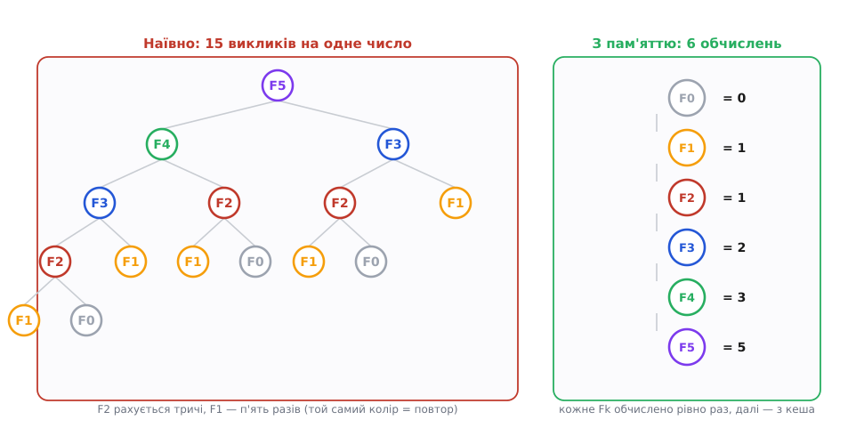
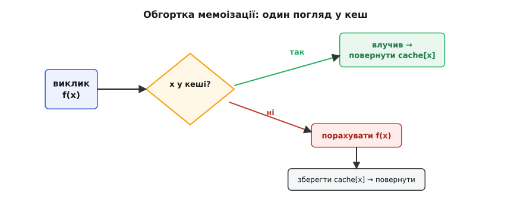
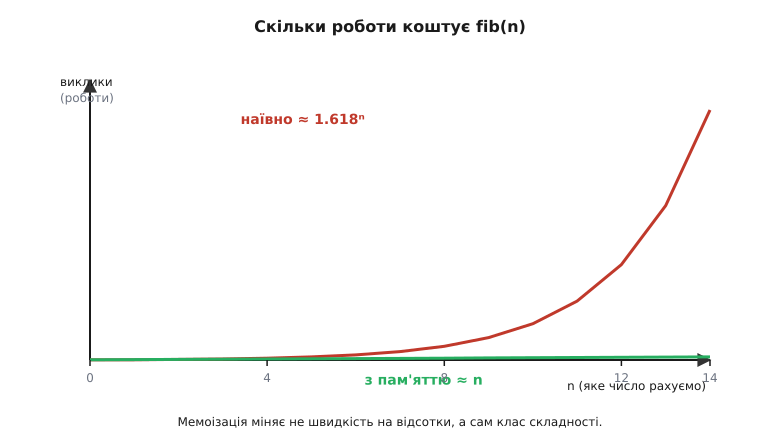
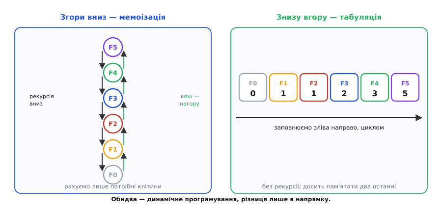

# Мемоізація

<preknowlist>
- [Рекурсія](book:algorithms/recursion) — функція, що викликає саму себе, зводячи задачу до менших копій себе.
- [Асимптотична складність](book:algorithms/asymptotic-complexity) — як росте обсяг роботи зі зростанням входу (нотація O великого); треба відрізняти експоненційне зростання від лінійного.
- [Чисті функції](book:programming/pure-functions-side-effects) — функція, чий результат залежить лише від аргументів, без побічних ефектів: той самий вхід завжди дає той самий вихід.
</preknowlist>

Візьмімо найкоротший спосіб порахувати [число Фібоначчі](book:math/fibonacci-numbers) — саме означення, слово в слово перекладене в код: n-те число дорівнює сумі двох попередніх.

```py
def fib(n):
    if n < 2:
        return n
    return fib(n - 1) + fib(n - 2)
```

Гарно ж — код читається як сама математика. Але спробуй порахувати ним `fib(50)`, і машина задумається на хвилини; `fib(100)` не дочекаєшся ніколи. Щось глибоко негаразд, і воно варте того, щоб роздивитися: саме з цієї болячки народжується одна з найкорисніших ідей усього програмування.

Простежмо, що насправді робить `fib(5)`. Щоб порахувати `fib(5)`, треба `fib(4)` і `fib(3)`. Щоб порахувати `fib(4)`, треба `fib(3)` і `fib(2)`. Ось воно: `fib(3)` рахується **двічі** — окремо для `fib(5)` і вдруге всередині `fib(4)`. Кожен `fib(3)` тягне свій `fib(2)`, а той — свій `fib(1)`, і так по колу. Дерево викликів розростається, і в ньому та сама дрібна робота повторюється знов і знов.


*Наліво — наївне дерево викликів `fib(5)`: 15 викликів заради одного числа, і однакові підзадачі (той самий колір) рахуються повторно — `fib(2)` тричі, `fib(1)` п'ять разів. Направо — та сама задача, коли кожне число обчислено рівно раз: 6 обчислень замість 15. Уся різниця в тому, чи пам'ятаємо ми вже пораховане.*

Порахуймо це марнотратство чесно. Тут `fib(2)` обчислюється тричі, `fib(1)` — п'ять разів, і що глибше дерево, то гірше. Кількість викликів росте не пропорційно до n, а **вибухово** — приблизно як 1.618ⁿ. Це золотий перетин, і те, що він виринув саме тут, не збіг: наївний `fib` за формою повторює саму послідовність Фібоначчі, тож і кількість викликів росте по ній. Для `fib(50)` це вже понад мільярд викликів заради одного числа. Машина не дурна й не повільна — вона слухняно перераховує одне й те саме мільярд разів, бо ми її буквально про це попросили. Точний підрахунок і те, звідки береться золотий перетин, розкладено в [математиці підрахунку підзадач](book:algorithms/memoization/math-subproblem-count.md).

## Ідея: не рахуй те, що вже знаєш

Тепер спостереження, з якого все випливає. `fib(3)` — це **завжди** 2. Не «іноді 2», не «2 за певних умов» — просто завжди 2, скільки не питай. Функція `fib` **чиста**: відповідь залежить лише від аргументу, і той самий аргумент дає той самий результат щоразу. А якщо так — навіщо рахувати `fib(3)` вдруге? Ми ж уже знаємо відповідь. Запиши її раз — і далі просто зазирай у записник.

Оце й є **мемоізація** (від лат. *memorandum* — «те, що слід запам'ятати», через коротке *memo* — «нотатка»; літеру «р» відкинули навмисне, щоб не плутати зі звичайним «запам'ятовуванням» тексту). Ідея дитинно проста: перш ніж рахувати, зазирни в записник; є там відповідь — бери готову; немає — порахуй раз, запиши й поверни. Термін увів британський дослідник Дональд Мічі 1968 року, назвавши такі функції «memo-функціями» й прямо пов'язавши їх із машинним навчанням — машина, що запам'ятовує вже пораховане, буквально вчиться на власному досвіді; ця історія [розказана окремо](book:algorithms/memoization/hist-memo-functions.md).

У коді потрібен лише кеш — таблиця «аргумент → результат», у ролі якої природно виступає [хеш-таблиця](book:algorithms/hash-table) (словник, `Map`) — і три рядки навколо обчислення: перевірити, порахувати за потреби, зберегти.

:::tabs
```py
cache = {}

def fib(n):
    if n < 2:
        return n
    if n in cache:            # уже рахували? — бери готове
        return cache[n]
    result = fib(n - 1) + fib(n - 2)
    cache[n] = result         # запам'ятай, щоб не рахувати вдруге
    return result
```
```js
const cache = new Map();

function fib(n) {
  if (n < 2) return n;
  if (cache.has(n)) return cache.get(n);   // уже рахували? — бери готове
  const result = fib(n - 1) + fib(n - 2);
  cache.set(n, result);                    // запам'ятай на майбутнє
  return result;
}
```
:::


*Механізм у трьох кроках. Виклик `f(x)` спершу зазирає в кеш. Влучив (є запис) — миттєво повертає збережене, не рахуючи нічого. Схибив — обчислює `f(x)` звичайним шляхом, кладе результат у кеш під ключем `x` і повертає. З другого разу той самий `x` піде швидким шляхом.*

Різниця в поведінці разюча. Без кешу `fib(50)` — мільярд викликів; із кешем кожне з чисел `fib(0)`, `fib(1)`, …, `fib(50)` обчислюється рівно раз, решта звернень — миттєвий погляд у таблицю. Було експоненційно, стало лінійно: **O(1.618ⁿ) → O(n)**. Ми не змінили ні формули, ні логіки — лише перестали робити ту саму роботу двічі.


*Скільки роботи коштує `fib(n)`. Наївна рекурсія (червона) росте як 1.618ⁿ і вже за невеликих n злітає в стелю. Мемоізована (зелена) росте лінійно — по одному обчисленню на кожне число. Це не оптимізація на відсотки, а зміна самого класу складності.*

> 🔧 **Навіщо це.** Мемоізація — це не трюк для задачок про Фібоначчі, а щоденний робочий інструмент скрізь, де чиста функція викликається повторно з тими самими аргументами. Розбір виразу, що зустрічається в тексті багато разів; дорога чиста оцінка, яку інтерфейс перераховує на кожен перемальовок (звідси `useMemo` й `useCallback` у React); відповідь на однаковий запит, який не змінюється між викликами. Скрізь однаковий важіль: перший раз рахуємо чесно, далі — віддаємо з пам'яті. Часто це різниця між «підвисає на секунду» і «миттєво».

## Дві умови, без яких воно не спрацює

Мемоізація виглядає безкоштовним пришвидшенням, але тримається на двох підпорах, і варто бачити обидві.

Перша — **чистота функції**. Кеш каже: «для цього входу відповідь ось така, назавжди». Це правда лише тоді, коли функція справді детермінована й без побічних ефектів. Мемоізувати `now()`, `random()` чи читання з бази, що змінюється, — значить намертво заморозити перше випадкове значення й повертати його всім наступним. Формально функцію можна мемоізувати тоді й лише тоді, коли її виклик **референційно прозорий**: замінити виклик на його результат нічого не міняє в поведінці програми. Немає прозорості — мемоізація не пришвидшує, а ламає.

Друга — **перекривні підзадачі**. Уся вигода в тому, що ті самі аргументи повертаються знову; кеш окупається лише на повторах. Якщо кожен виклик унікальний, записник розбухає, але ним ніхто не користується — саме витрати без зиску. Тому мемоізація блищить на `fib`, де підзадачі перетинаються густо, і майже нічого не дає, скажімо, [сортуванню злиттям](book:algorithms/divide-and-conquer): там рекурсія теж ділить задачу навпіл, але половини **різні**, той самий відрізок удруге не трапляється, і кешувати нема чого.

> 🔧 **Навіщо це.** Ці дві умови — готовий чекліст перед тим, як щось кешувати. Функція чиста? Якщо в ній ховається час, випадковість, глобальний стан чи звернення до мінливого джерела — спершу винеси їх назовні, бо інакше кеш роздаватиме застарілі відповіді, і це один із найпідступніших класів помилок: усе «працює», просто дані неправильні. Аргументи повторюються? Якщо ні — кеш лише з'їдатиме пам'ять. Дві галочки — і мемоізація безпечна.

## Два лики динамічного програмування

Коли задача розкладається на перекривні підзадачі, чиї відповіді складаються в загальну, — це [динамічне програмування](book:algorithms/dynamic-programming), і мемоізація є одним із двох його ликів.

Мемоізація — це підхід **згори вниз**: пишемо природну рекурсію від великої задачі до дрібних і ліниво кешуємо кожну відповідь на зворотному шляху. Обчислюються **лише ті** підзадачі, до яких рекурсія справді дійшла. Інший лик — **табуляція**, підхід **знизу вгору**: заводимо таблицю й заповнюємо її від найменших підзадач до найбільшої, у порядку, де кожна вже спирається на готові. Рекурсії немає, кеш-перевірок немає — просто цикл, що наповнює масив.


*Один результат — два шляхи. Згори вниз (мемоізація): починаємо з `fib(5)`, рекурсія спускається до бази, а відповіді осідають у кеші дорогою нагору — рахуємо лише потрібне. Знизу вгору (табуляція): заповнюємо `fib[0..5]` зліва направо циклом, без рекурсії. Обидва — динамічне програмування, різниця лише в напрямку.*

Кожен має свій козир. Мемоізація ближча до того, як ми думаємо про задачу (просто записуємо означення й додаємо кеш), і не рахує зайвого, коли потрібна лише частина простору підзадач. Табуляція не платить за рекурсію та хеш-пошук і часто дозволяє викинути стару частину таблиці, зберігаючи лише кілька останніх значень, — для `fib` вистачає двох чисел замість цілого масиву. Що обрати — залежить від того, чи зручніша тут рекурсія й чи справді потрібні всі підзадачі. Повний робочий приклад на класичній задачі — [редакційній відстані](book:algorithms/memoization/proj-edit-distance.md), із сіткою підзадач, кодом і порівнянням обох підходів, зібрано окремо.

## Обгортка на будь-яку функцію

Найкраще в мемоізації те, що вона **не втручається в саму функцію**. Логіка обчислення й логіка запам'ятовування — різні речі, тож кеш можна винести в окрему обгортку, що приймає будь-яку чисту функцію й повертає її пришвидшену версію. Ключем кеша слугують самі аргументи.

:::tabs
```py
def memoize(fn):
    cache = {}
    def wrapped(*args):
        if args not in cache:
            cache[args] = fn(*args)   # порахувати раз
        return cache[args]            # далі — з пам'яті
    return wrapped

slow_fib = memoize(slow_fib)          # та сама функція, тепер із пам'яттю
```
```js
function memoize(fn) {
  const cache = new Map();
  return (...args) => {
    const key = JSON.stringify(args);   // аргументи як ключ
    if (!cache.has(key)) cache.set(key, fn(...args));
    return cache.get(key);
  };
}
```
:::

Саме так мемоізація і живе в реальному коді — як [декоратор](book:programming/decorator), що обгортає функцію, не змінюючи її тіла. У Python цей інструмент уже є в стандартній бібліотеці: `@functools.cache` (чи `@lru_cache`) над означенням `fib` перетворює наївну рекурсію на лінійну одним рядком. Механіка всередині — точно той самий словник «аргументи → результат».

## Ціна й пастки

Мемоізація не безкоштовна — вона **міняє пам'ять на час**. Записник треба десь тримати, і що більше різних входів пройшло крізь функцію, то більший кеш. Для скінченного набору аргументів (числа Фібоначчі до якоїсь межі) це дрібниця. Але мемоізуй функцію, яку кличуть з мільйонами різних значень, — і кеш тихо росте, аж поки не з'їсть усю пам'ять. Тоді кешу дають **стелю** й правило витіснення старого — найчастіше «викидай те, чого найдовше не питали» (LRU); саме тому повна назва Python-декоратора — `lru_cache`, а сам компроміс свіжості й місця розглянуто в темі [кеш](book:programming/cache).

Ще три пастки трапляються найчастіше. **Неповний ключ**: якщо результат залежить не лише від явних аргументів, а й від якогось прихованого стану, а ключем ти взяв самі аргументи — кеш плутатиме різні ситуації під одним записом. Ключ мусить містити **все**, від чого залежить відповідь. **Мінливі аргументи**: ключем може бути лише те, що не змінюється й придатне для хешування, — список чи словник як ключ або впадуть, або поводитимуться підступно; передавай незмінні значення. І вже згадане **мемоізування нечистого**: щойно у функцію просочилися час, випадковість чи зовнішній стан — кеш починає роздавати неправду.

## Одне речення на дорогу

Мемоізація — це домовленість із власною програмою: обіцянка ніколи не рахувати те саме двічі. Уся її сила в одному спостереженні — що чиста функція на однаковому вході дає однакову відповідь, тож першу відповідь варто запам'ятати, а не здобувати заново. Із цієї дрібнички виростає перетворення експоненційного на лінійне, ціла половина динамічного програмування й рядок `@cache` над повільною функцією. Треба лише пам'ятати, на чому вона стоїть: функція має бути чистою, підзадачі — повторюваними, а кеш — не рости до небес. Дотримав цих умов — і отримав, мабуть, найдешевше прискорення, яке взагалі буває: просто перестав забувати.
