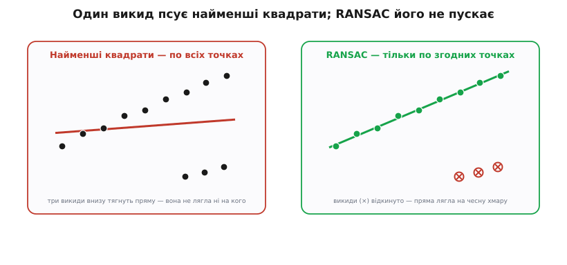
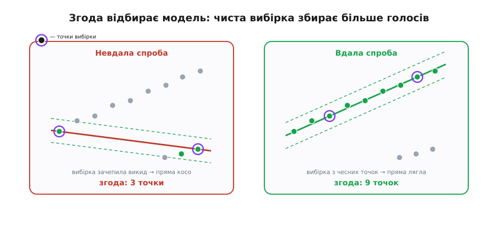

# RANSAC: згода на випадковій вибірці

<preknowlist>
- [Найменші квадрати](topic:math/least-squares) — стандартний спосіб провести модель крізь дані, мінімізуючи суму квадратів відхилень; саме його заступає RANSAC, коли серед даних трапляються грубі викиди.
- [Імовірність як міра непевності](topic:math/probability-basics) — шанс події та як перемножуються шанси незалежних спроб; на цьому тримається оцінка «скільки випадкових вибірок треба взяти».
</preknowlist>

Уявіть купку точок на аркуші, крізь яку явно проситься пряма. Дев'ять точок чесно лягли вздовж неї з дрібним розкидом, а три відскочили геть убік — хтось збився при вимірі, давач зморгнув, оператор ткнув не туди. Око миттю бачить пряму й ці три «сміттєві» точки окремо. А тепер спробуйте провести пряму формулою — і починається біда.

Класичний спосіб провести пряму крізь точки — [найменші квадрати](topic:math/least-squares): шукаємо таку пряму, щоб **сума квадратів відхилень** від неї до всіх точок була найменшою. Для чистих даних це ідеально. Але щойно в купу потрапляє викид, метод ламається — і зрозуміти, **чому саме**, важливо, бо ця поломка й народжує потребу в RANSAC.

## Чому найменші квадрати ламаються

Уся річ у слові **квадрат**. Точка, що лежить від прямої вдесятеро далі за інших, дає внесок у суму не вдесятеро, а **в сто разів** більший — бо відхилення підноситься до квадрата. Метод, який мінімізує цю суму, не може її знехтувати: щоб приборкати один величезний доданок, він **тягне всю пряму** в бік викиду. У підсумку пряма — це компроміс, що не влаштовує нікого: від чесних точок вона вже відійшла, а викид усе одно далеко. Один-єдиний грубий викид здатен зіпсувати оцінку по сотні добрих точок.


*Той самий набір точок, два підходи. Найменші квадрати (ліворуч) не знають, хто викид, тож чесно вминають суму квадратів по всіх — і три викиди внизу перекошують пряму так, що вона не лягає ні на кого. RANSAC (праворуч) знаходить, які точки чесні, відкидає решту й проводить пряму лише по них.*

Напрошується очевидне: а викиньмо викиди й проведімо пряму по решті. Слушно — але тут ховається зачароване коло. **Щоб дізнатися, які точки викиди, треба вже мати правильну пряму** (тоді викид — це той, хто від неї далеко). А **щоб знайти правильну пряму, треба вже знати, які точки чесні** (провести її по них). Курка і яйце: модель залежить від того, хто чесний, а хто чесний — залежить від моделі. Розірвати це коло в лоб не виходить, і майже сорок років люди морочилися хитрими зваженими підгонками, аж поки не з'явилася зухвало проста ідея.

## Ідея: вгадай і перевір

RANSAC (англ. *RANdom SAmple Consensus* — «згода на випадковій вибірці») розриває коло **здогадом**. Замість того щоб чесно вминати всі точки одразу, він каже: не знаю, хто чесний, — то **вгадаю навмання й перевірю догадку голосуванням**.

Ось суть одним рухом. Візьми **найменшу жменьку точок**, якої досить, щоб задати модель, — для прямої це дві точки. Проведи пряму рівно крізь них. А тепер спитай **усі інші точки**: наскільки ви згодні з цією прямою? Хто лежить близько до неї (ближче за поріг) — той голосує «за», його звуть **inlier** (англ. *in-lier* — «той, що лежить усередині», згодна точка). Хто далеко — той «проти», **outlier** (англ. *out-lier* — «той, що лежить назовні», викид). Полічи голоси «за» — це **згода** (англ. *consensus*, від лат. *consensus* — одностайність) цієї моделі.

Тепер головний фокус. Якщо у вгадану пару випадково затесався викид, пряма піде косо, і **майже ніхто** з чесної хмари з нею не погодиться — згода мізерна. А якщо обидві вгадані точки виявилися чесними, пряма ляже точно вздовж хмари, і **більшість** чесних точок дадуть їй голос — згода велика. Тобто **сама згода й показує, чи ми вгадали чисту вибірку**. Лишається повторити здогад багато разів із різними випадковими парами й наприкінці лишити ту модель, що зібрала **найбільшу згоду**.


*Чому згода відбирає правильну модель. Навколо кожної прямої — смуга допуску завширшки ±t; точки в ній голосують «за». Невдала вибірка (ліворуч) зачепила викид, пряма косо, згоди мало. Вдала вибірка (праворуч) — з двох чесних точок, пряма лягла на хмару, згоди багато. Переможе та, у кого голосів більше, — тобто вгадана по чесних точках.*

## Чотири кроки, що крутяться по колу

Розкладімо цей здогад на кроки — і вийде увесь алгоритм, вартий чотирьох рядків.

1. **Вибірка.** Візьми навмання **мінімум точок**, потрібний для моделі (пряма — 2, коло — 3, площина — 3).
2. **Модель.** Побудуй модель рівно по цій вибірці — без жодного усереднення, просто крізь узяті точки.
3. **Згода.** Полічи, скільки **всіх** точок лежать до цієї моделі ближче за поріг `t`. Це її згода.
4. **Рекорд.** Якщо згода більша, ніж у найкращої досі, — запам'ятай цю модель.

Повтори кроки 1–4 наперед задане число разів `k`. Переможе модель із найбільшою згодою, а наприкінці її зазвичай **уточнюють** найменшими квадратами — але вже **тільки по згодних точках**, коли викиди відсіяно. Так замикається коло: RANSAC спершу відділяє чесних від викидів (грубим здогадом), а потім чесним віддає точну підгонку.


*RANSAC як цикл. Чотири кроки крутяться `k` разів: вгадати модель по крихітній вибірці, дати решті точок проголосувати, тримати рекорд згоди. Наприкінці переможну модель уточнюють найменшими квадратами вже по самих згодних точках.*

Ключова хитрість — **чому вибірка мінімальна**. Здавалося б, узяти для прямої не дві точки, а двадцять — надійніше. Навпаки: що більше точок у вибірці, то **більший шанс**, що хоч одна з них — викид, а один викид псує всю модель. Найменша вибірка дає найвищий шанс ухопити **суцільно чесну** пару. RANSAC свідомо будує модель по абсолютному мінімуму даних — і саме тому виграє.

> 🔧 **Навіщо це.** Дрон зшиває карту з кадрів камери. [Зіставлення ключових точок](topic:algorithms/feature-matching) дає пари «ця цятка тут — і вона ж там», але серед сотні пар двадцять — хибні. Довіритеся всім — двадцять брехливих пар потягнуть суміщення кадрів урізнобіч, і шов карти поповзе. RANSAC мовчки вгадає єдине суміщення, з яким згодні вісімдесят чесних пар, а двадцять хибних відкине як викиди. Без цього запобіжника не працює жоден серйозний конвеєр зору — ні панорама, ні стереоглибина, ні відновлення руху камери.

## Одна перевірка зблизька

Крок «згода» — це просто вимір відстані від точки до моделі. Проведімо його руками для прямої, щоб побачити механіку. Пряму зручно задати не як `y = kx + b`, а рівнянням `a·x + b·y + c = 0` з нормованими коефіцієнтами (`a² + b² = 1`) — тоді величина `|a·x + b·y + c|` одразу дає **відстань** від точки `(x, y)` до прямої.

**Умова.** Вибірка — дві точки `(0, 0)` і `(3, 4)`. Поріг згоди `t = 0.5`. Перевірмо одну чесну точку й один викид.

```
пряма через вибірку:  0.8·x − 0.6·y = 0        (0.8² + 0.6² = 1 — коефіцієнти вже нормовані)

чесна точка (5, 6.5):
  відстань = |0.8·5 − 0.6·6.5| = |4.0 − 3.9| = 0.1   ≤ 0.5   →  голос «за» (inlier)

викид (2, 6):
  відстань = |0.8·2 − 0.6·6|   = |1.6 − 3.6| = 2.0   >  0.5   →  голос «проти» (outlier)
```

Чесна точка сидить за десяту частку від прямої — у смузі допуску, зараховано. Викид відстоїть на дві одиниці — учетверо далі за поріг, відкинуто. Пройдіть так усі точки, полічіть «за» — і матимете згоду цієї моделі. Весь RANSAC — це той самий підрахунок, обгорнутий у цикл випадкових вибірок:

:::tabs
```python
import random

def line_through(p, q):
    # пряма ax + by + c = 0 через дві точки, нормована (a² + b² = 1)
    a, b = q[1] - p[1], p[0] - q[0]
    c = -(a * p[0] + b * p[1])
    n = (a * a + b * b) ** 0.5
    return a / n, b / n, c / n

def ransac_line(pts, t, k):
    best_model, best_inliers = None, []
    for _ in range(k):
        p, q = random.sample(pts, 2)               # 1. мінімальна вибірка — 2 точки
        if p == q:
            continue
        a, b, c = line_through(p, q)               # 2. модель рівно по вибірці
        inliers = [pt for pt in pts                # 3. згода: хто ближче за t
                   if abs(a * pt[0] + b * pt[1] + c) <= t]
        if len(inliers) > len(best_inliers):       # 4. новий рекорд згоди
            best_model, best_inliers = (a, b, c), inliers
    return best_model, best_inliers                # уточнити по best_inliers — окремо
```
```cpp
#include <vector>
#include <array>
#include <cmath>
#include <cstdlib>

struct Pt { double x, y; };

// пряма ax + by + c = 0 через дві точки, нормована (a² + b² = 1)
std::array<double, 3> line_through(Pt p, Pt q) {
    double a = q.y - p.y, b = p.x - q.x, c = -(a * p.x + b * p.y);
    double n = std::hypot(a, b);
    return {a / n, b / n, c / n};
}

// найкращу модель кладе у best; повертає індекси згодних точок
std::vector<int> ransac_line(const std::vector<Pt>& pts, double t, int k,
                             std::array<double, 3>& best) {
    std::vector<int> best_in;
    int m = pts.size();
    for (int it = 0; it < k; ++it) {
        int i = rand() % m, j = rand() % m;        // 1. мінімальна вибірка — 2 точки
        if (i == j) continue;
        auto [a, b, c] = line_through(pts[i], pts[j]);   // 2. модель по вибірці
        std::vector<int> in;
        for (int r = 0; r < m; ++r)                // 3. згода: хто ближче за t
            if (std::fabs(a * pts[r].x + b * pts[r].y + c) <= t) in.push_back(r);
        if (in.size() > best_in.size()) {          // 4. новий рекорд згоди
            best = {a, b, c}; best_in = in;
        }
    }
    return best_in;                                // уточнити по best_in — окремо
}
```
:::

Повний робочий приклад із фінальним уточненням по згодних точках, розбором складності й типовими пастками (виродна вибірка, вибір порога) — у [проєкті підгонки прямої з RANSAC](topic:algorithms/ransac/proj-ransac-linefit.md).

## Скільки спроб треба

Лишається одне непокоєння: цикл випадковий — а раптом за `k` спроб жодного разу не влучимо в чисту вибірку? Ось де починається справжня краса методу: **потрібних спроб напрочуд мало**, і це можна порахувати наперед.

Нехай `w` — частка чесних точок серед усіх (скажімо, `0.5`, тобто половина — сміття). Щоб одна вибірка з `n` точок була суцільно чесною, кожна з `n` має виявитися чесною — а це шанс `wⁿ` (перемножуємо [незалежні шанси](topic:math/probability-basics)). Тоді `1 − wⁿ` — шанс, що вибірка **забруднена** хоч одним викидом. За `k` незалежних спроб шанс, що **всі** до одної забруднені, — `(1 − wⁿ)ᵏ`. А шанс, що **хоч одна** вибірка чиста, — доповнення до нього. Прирівняймо його до бажаної певності `p` й розв'яжімо щодо `k`:

**Умова.** Половина точок — викиди (`w = 0.5`), модель — пряма (`n = 2`), хочемо `p = 0.99` певності хоч раз ухопити чисту вибірку.

```
wⁿ        = 0.5² = 0.25              шанс, що одна вибірка — уся чесна
1 − wⁿ    = 0.75                     шанс, що вибірка забруднена викидом

k = log(1 − p) / log(1 − wⁿ)
  = log(0.01) / log(0.75)
  = −2 / −0.1249
  ≈ 16.0   →   17 спроб досить
```

Сімнадцять. Навіть коли **половина** ваших даних — суцільне сміття, сімнадцяти випадкових пар вистачить, щоб із певністю 99% хоч раз натрапити на чисту, а більше й не треба — одна чиста вибірка дає правильну модель, і згода її вивищить. Порівняйте з перебором усіх пар: для тисячі точок це майже **пів мільйона** пар. RANSAC бере сімнадцять. Ось чому цей метод живе там, де інші задихаються.

Формула ще й підказує, де RANSAC починає буксувати. Спроби ростуть **вибухово**, коли модель потребує багато точок (велике `n`) або викидів дуже багато (мале `w`) — бо `wⁿ` тоді крихітне. Для прямої з половиною викидів — 17 спроб; для моделі на 8 точок за тих самих умов — уже тисячі. Звідси й практичний висновок: RANSAC любить моделі з **малою** мінімальною вибіркою. Як вивести цю формулу до кінця, як на льоту **скорочувати** число спроб, підглядаючи за найкращою згодою, і як оцінити певність готового результату — у [математиці числа ітерацій](topic:algorithms/ransac/math-iterations.md).

## Три ручки, які крутить інженер

RANSAC простий, але має три налаштування, і кожне — компроміс.

**Поріг згоди `t`** — наскільки близько треба лежати, щоб голос зарахувався. Замалий поріг — і навіть чесні точки з дрібним шумом випадуть, згода схудне, модель стане крихкою. Завеликий — і викиди почнуть прослизати в «свої», підгонка попливе. Правильний `t` беруть із того, який шум чекають від чесних точок; для строгих задач його виводять зі стандартного відхилення шуму.

**Розмір вибірки `n`** — не ручка, а властивість моделі: скільки точок мінімально визначають її однозначно. Пряма — 2, коло — 3, [гомографія між двома знімками](topic:algorithms/feature-matching) — 4 пари. Менше `n` — швидша збіжність, тому моделі з малим `n` для RANSAC — рідні.

**Число спроб `k`** — скільки разів крутити цикл; його беруть за формулою вище під бажану певність. На практиці `w` наперед невідоме, тож `k` часто перераховують просто під час роботи: знайшли вибірку з більшою згодою — переоцінили частку чесних вгору — зменшили потрібне `k`.

RANSAC — не одинак, а ціла родина [робастних методів](topic:math/robust-estimators), стійких до викидів. Його рідня за духом — [перетворення Хафа](topic:algorithms/hough-transform), що теж шукає модель голосуванням, тільки навпаки: не вгадує вибірки, а дає **кожній** точці проголосувати за всі моделі, що крізь неї проходять, і бере найпопулярнішу. Хаф незамінний, коли моделей на зображенні багато (десяток прямих одразу); RANSAC — коли модель одна, зате викидів гора.

## Де це живе

Народився RANSAC не в теорії, а з практичної муки: 1981 року Мартін Фішлер і Роберт Боллс у SRI International розв'язували задачу, як за фотознімком місцевості з відомими орієнтирами визначити, **звідки** його зроблено, — коли частина розпізнаних орієнтирів хибна. Класична підгонка тонула у цих хибних відповідниках, і вони запропонували протилежне до тодішньої догми: не усереднювати якнайбільше даних, а стартувати з **найменшого** можливого набору й нарощувати згоду. Як ця думка перевернула звичне «даних чим більше, тим краще» — у [історії народження RANSAC](topic:algorithms/ransac/hist-ransac.md).

Відтоді RANSAC став тихим робочим конем усюди, де модель треба видобути з брудних даних. [Зіставлення ключових точок](topic:algorithms/feature-matching) очищає ним пари перед склеюванням панорами. [Відновлення пози камери за точками](topic:algorithms/pose-estimation) — прямий нащадок тієї задачі 1981 року — відсіює ним хибні відповідники орієнтирів. Ним підганяють площини до хмар точок лідара, кола до країв деталей на конвеєрі, траєкторії до зашумлених координат. Скрізь той самий каркас: **вгадай модель по дрібці даних, хай решта проголосує, лиши найкращу згоду**.

## Підсумок теми

RANSAC — це загальний каркас, щоб видобути модель із даних, у яких засіли **грубі викиди**. Найменші квадрати тут безпорадні: квадрат відхилення робить далекий викид непереборно вагомим, і той тягне підгонку на себе; а відкинути викиди наперед не можна — щоб їх упізнати, уже треба знати правильну модель. RANSAC розриває це коло **здогадом**: бере навмання найменшу вибірку (для прямої — дві точки), будує модель рівно по ній і питає решту точок, скільки з них згодні — лежать ближче за поріг `t`. Вибірка з викидом дає косу модель із мізерною згодою; чиста вибірка — точну модель, з якою згодна більшість. Повторивши здогад `k` разів і лишивши найбільшу згоду, отримуємо і чесні точки, і саму модель, яку наприкінці уточнюють по самих згодних. Дивовижа в тому, скільки треба спроб: за формулою `k = log(1−p) / log(1−wⁿ)` навіть із половиною викидів досить **сімнадцяти** випадкових пар на 99% певності — там, де повний перебір потребував би сотень тисяч. Метод любить моделі з малою мінімальною вибіркою й керується трьома ручками — порогом `t`, розміром вибірки `n` і числом спроб `k`. Саме цей каркас чистить пари в зіставленні точок, відновлює позу камери й підганяє геометрію до зашумлених вимірів.
