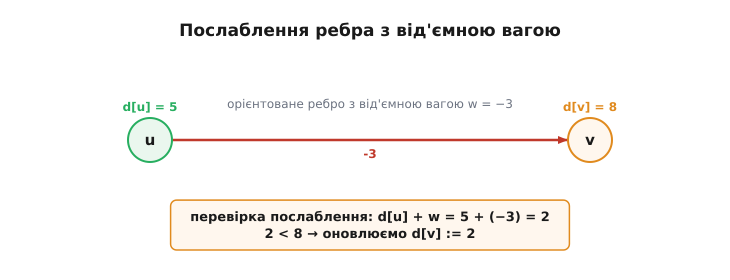
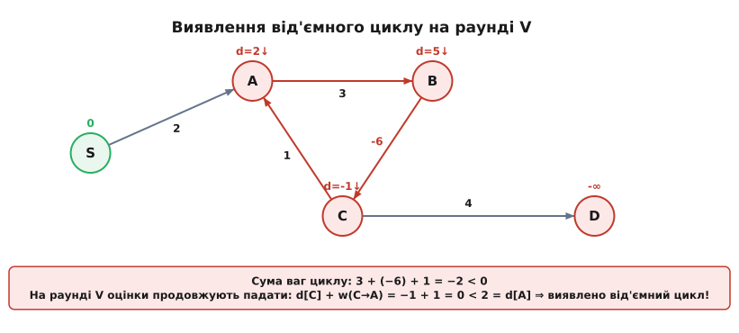
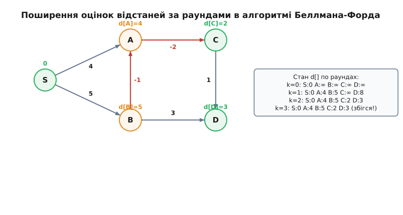

# Алгоритм Беллмана–Форда

<preknowlist>
- [Алгоритм Дейкстри](book:algorithms/dijkstra) — жадібний пошук найкоротших шляхів у графі з невід'ємними вагами.
- [Теорія графів](book:math/graph-theory) — орієнтовані графи, ваги ребер, шляхи та цикли.
- [Динамічне програмування](book:algorithms/dynamic-programming) — принцип оптимальності Беллмана та інваріанти підзадач.
</preknowlist>

Уявіть фінансову мережу міжнародних валютних обмінів, де вузли — це валюти, а орієнтовані ребра між ними відповідають транзакційним переходам. Кожна операція обміну супроводжується логарифмом курсу: деякі переходи коштують комісійних витрат (додатна вага), але інші — через субсидії, спекуляційні сплески чи знижки на ліквідність — дають чистий виграш, який математично виражається **від'ємною вагою** ребра. Якщо запустити в такій мережі класичний [алгоритм Дейкстри](book:algorithms/dijkstra), він миттєво зазнає краху. Його жадібна логіка «один раз зафіксували найближчий вузол — і більше ніколи до нього не повертаємося» базується на непорушному припущенні: майбутні кроки можуть лише збільшувати вартість шляху. Та щойно на сцені з'являється від'ємна вага, довгий обхідний маршрут через дорогі на першому кроці вузли може раптово упасти в глибокий мінус і виявитися значно вигіднішим за прямий шлях.

Задача пошуку найкоротших шляхів у графах із довільними вагами ребер вимагає кардинально іншого мислення. Замість поспішного жадібного фіксування вершин алгоритм Беллмана–Форда спирається на систематичне динамічне програмування. Він не припускає, що локальний вибір є остаточним, а натомість хвилеподібно розгортає оцінки відстаней, дозволяючи від'ємним вагам коригувати попередні результати. Понад те, Беллман–Форд володіє унікальною властивістю: він не просто коректно шукає найдешевші маршрути в умовах від'ємних ваг, а й здатен виявляти катастрофічний математичний феномен — **від'ємний цикл** (замкнений контур, сумарна вага якого є від'ємною), розпізнаючи ситуації, де найкоротший шлях прямує до мінус нескінченності.

---

### Чому жадібність ламається: анатомія конфлікту

Щоб зрозуміти неминучість алгоритму Беллмана–Форда, треба в деталях розібрати момент, де ламається жадібний підхід Дейкстри. В алгоритмі Дейкстри кожна вершина дістає статус остаточно зафіксованої у той момент, коли її поточна оцінка відстані є найменшою серед усіх ще не зафіксованих кандидатів. Математичне обґрунтування цього вибору бездоганне, але тільки за однієї умови: `w(u, v) ≥ 0` для кожного ребра.

Розглянемо конкретну ситуацію. Уявімо трійку вершин: `S` (старт), `A` та `B`. Зі `S` ведуть два орієнтовані ребра: `S → A` вагою 4 та `S → B` вагою 5. Окрім цього, існує сполучення `B → A` з від'ємною вагою `-4`.

1. **Як вчинить Дейкстра:** На першому кроці він порівняє нефіксовані оцінки `d[A] = 4` та `d[B] = 5`. Оскільки 4 < 5, Дейкстра оголосить відстань до `A` остаточною й закріпить `d[A] = 4`. Наступним кроком він зафіксує `B` із відстанню 5. Після цього Дейкстра розгляне ребро `B → A` вагою `-4`. Шлях `S → B → A` має вагу `5 + (-4) = 1`. Але вершину `A` вже зафіксовано у скарбниці! Дейкстра відмовляється переглядати зафіксовану вершину, і у результаті видає хибну відповідь `d[A] = 4` замість істинної `d[A] = 1`.

2. **У чому суть помилки:** Жадібний вибір припустився хиби, бо взяв локальний мінімум `d[A] = 4` за остаточну правду. Від'ємне ребро `B → A` дало «знижку», яка повністю компенсувала початкову дорожнечу маршруту через `B`.

Для графа з від'ємними вагами узагалі неможливо завчасно сказати, яка вершина зафіксована остаточно, а яка ще може отримати вигідне послаблення від віддалених частин мережі. Нам потрібен алгоритм, який відмовляється від ранньої фіксації і чесно перевіряє **усі** можливі варіанти покращення шляхів.

---

### Операція послаблення у графі з від'ємними вагами

Фундаментальною цеглиною алгоритму є операція **послаблення** (лат. *relaxatio* — послаблення натягу) ребра. Назва походить із фізичної механіки: уяви оцінку відстані `d[v]` як натягнуту вгору (завищену) гумову стрічку, а кожне вдале послаблення ребра трохи її відпускає вниз ближче до істинної найкоротшої відстані.

Нехай для кожної вершини `v` зберігається поточна оцінка найкоротшої відстані `d[v]` від стартової вершини `s`. Початково `d[s] = 0`, а для всіх інших вершин `d[v] = +∞` (песимістичне припущення про недосяжність).

Якщо у графі існує орієнтоване ребро `(u, v)` вагою `w`, то ми висуваємо гіпотезу: «А чи не можна покращити шлях до `v`, якщо дійти спочатку до `u`, а потім перейти по ребру `(u, v)`?». Вартість такого альтернативного маршруту дорівнює `d[u] + w`.

Якщо ця вартість строго менша за поточну відому оцінку `d[v]`, ми збиваємо оцінку вниз:

```
якщо d[u] != +∞ та d[u] + w < d[v]:
    d[v] := d[u] + w
    prev[v] := u
```


*Послаблення орієнтованого ребра u → v. Оцінка вершини u дорівнює 5. Від'ємна вага ребра w = −3 пропонує новий шлях до v вартістю 5 + (−3) = 2. Оскільки 2 < 8 (поточна оцінка v), оцінку d[v] оновлюємо до 2.*

Зверніть увагу на важливу деталь: на відміну від Дейкстри, де послаблення виконується лише для вихідних ребер щойно зафіксованої вершини, алгоритм Беллмана–Форда застосовує операцію послаблення **до всіх ребер графа послідовно у декілька раундів**.

> 🔧 **Навіщо це.** Перевірка `d[u] != +∞` перед додаванням ваги є критичною інженерною запобіжною мірою. Якщо вершина `u` ще недосяжна (`d[u] = +∞`), а вага ребра `w` від'ємна (наприклад `-5`), то безумовна арифметика `+∞ + (-5)` у комп'ютерній пам'яті призведе до переповнення цілих чисел (значення `LLONG_MAX - 5`), і алгоритм хибно поверне недосяжну вершину як досяжну з від'ємною відстанню.

---

### Ідея динамічного програмування: підзадачі обмеженої довжини

Справжня краса алгоритму Беллмана–Форда криється в його математичному фундаменті динамічного програмування. Замість спроби одразу обчислити підсумкову відстань, ми розбиваємо задачу на послідовність підзадач із суворим обмеженням за кількістю ребер у шляху.

Сформулюємо підзадачу: **нехай `d^(k)[v]` — це вага найкоротшого шляху від старту `s` до вершини `v`, який містить не більше ніж `k` ребер.**

Побудуємо рекурентне співвідношення:
1. **Базовий стан (`k = 0`):** Шлях з 0 ребер існує лише від `s` до `s` і має вагу 0. Для всіх інших вершин шляхів з 0 ребер не існує:
   - `d^(0)[s] = 0`
   - `d^(0)[v] = +∞` для всіх `v ≠ s`

2. **Перехід стану (`k-1 → k`):** Найкоротший шлях до `v`, що містить не більше `k` ребер, може бути двох типів:
   - Або він взагалі не використовує `k`-те ребро, і тоді його вага дорівнює `d^(k-1)[v]`;
   - Або він складається з найкращого шляху до деякого сусіда `u` завдовжки не більше `k-1` ребер, плюс останнє ребро `(u, v) ∈ E`.

Отже, оптимальне значення обчислюється через мінімум:

```
d^(k)[v] = min( d^(k-1)[v],  min_{(u, v) ∈ E} (d^(k-1)[u] + w(u, v)) )
```

Ця формула означає: якщо ми знаємо точні найкоротші відстані з використанням не більше ніж `k-1` ребер для всіх вершин графа, то один повний перегляд усіх ребер `E` дає нам точні найкоротші відстані з використанням не більше ніж `k` ребер!

#### Безпечність обчислення «на місці» (In-place Relaxation)
Класична теоретична формула вимагає двох масивів: `d^(k-1)` (попередній раунд) та `d^(k)` (поточний раунд). Проте на практиці алгоритм Беллмана–Форда використовує лише **один одновимірний масив** `d[v]`, який оновлюється прямо під час перегляду ребер.

Виникає питання: якщо під час раунду `k` ми оновили `d[u]` за допомогою одного ребра, а пізніше у цьому ж раунді використовуємо нове `d[u]` для оновлення `d[v]`, чи не порушить це коректність?

Відповідь: **ні, це не порушує коректність!** Таке «раніше» оновлення означає лише те, що оцінка `d[v]` отримала інформацію про шлях, який містить більше ніж `k` ребер. Оскільки ваги найкоротших шляхів можуть лише зменшуватися, отримання коротшого шляху раніше за теоретичний раунд є корисною прискореною збіжністю. Інваріант `d[v] ≥ δ(s, v)` залишається непорушним на кожному кроці.

#### Чому достатньо `V - 1` раундів

Скільки раундів `k` потрібно виконати, щоб гарантувати збіжність до підсумкових найкоротших відстаней?

Відповідь дає фундаментальна властивість орієнтованих графів: **якщо граф з `V` вершинами не містить від'ємних циклів, то найкоротший шлях між будь-якими двома вершинами завжди є простим шляхом** (тобто не містить вершин, що повторюються).

Доведення цього факту від зворотного просте й вишукане. Уяви детально розібраний математичний доказ у 🧮 [математичній вставці інваріантів Беллмана-Форда](book:algorithms/bellman-ford/math-bellman-ford.md): якби найкоротший шлях містив цикл, ми могли б вилучити цей цикл. Якщо вага циклу додатна або нульова, його вилучення робить шлях коротшим або не змінює його ваги, зменшуючи кількість ребер. А від'ємних циклів у графі за припущенням немає.

Оскільки простий шлях у графі з `V` вершинами може з'єднувати щонайбільше `V` вершин, він містить не більше ніж **`V - 1` ребер**.

Звідси робимо головний висновок: **після виконання `V - 1` раундів суцільного послаблення всіх ребер, алгоритм Беллмана–Форда гарантовано обчислює істинні найкоротші відстані `δ(s, v)` для всіх вершин, досяжних зі старту.**

---

### Вплив порядку перегляду ребер на швидкість збіжності

Хоча теоретична верхня межа кількості раундів становить `V - 1`, реальне число ітерацій, необхідних для збіжності, надзвичайно сильно залежить від того, у якому порядку ребра зберігаються в масиві `E`.

Розглянемо виражений приклад: лінійний граф-ланцюжок із 5 вершин `v₁ → v₂ → v₃ → v₄ → v₅`, де кожне ребро має вагу 1, а стартовою вершиною є `v₁` (`d[v₁] = 0`).

1. **Ідеальний порядок ребер (топологічний):**
   Нехай ребра в масиві розташовані у порядку прямування шляху: `(v₁, v₂), (v₂, v₃), (v₃, v₄), (v₄, v₅)`.
   Під час **першого ж раунду** (`k = 1`), завдяки оновленню «на місці»:
   - Ребро `(v₁, v₂)` дає `d[v₂] = 0 + 1 = 1`.
   - Ребро `(v₂, v₃)` негайно бачить оновлене `d[v₂] = 1` і дає `d[v₃] = 1 + 1 = 2`.
   - Ребро `(v₃, v₄)` бачить `d[v₃] = 2` і дає `d[v₄] = 3`.
   - Ребро `(v₄, v₅)` дає `d[v₅] = 4`.

   Завдяки вдалому порядку масиву ребер **усі найкоротші відстані обчислилися за 1 раунд!** На 2-му раунді жодне ребро не змінить оцінку, прапорець `updated` залишиться `false`, і алгоритм миттєво зупиниться.

2. **Найгірший порядок ребер (зворотний):**
   Нехай ті самі ребра записані у зворотному порядку: `(v₄, v₅), (v₃, v₄), (v₂, v₃), (v₁, v₂)`.
   - На раунді 1 змінити відстань зможе лише ребро `(v₁, v₂)`, бо тільки `d[v₁] = 0 ≠ +∞`. Отримуємо `d[v₂] = 1`. Решта ребер бачать `+∞` у своїх джерелах і нічого не міняють.
   - На раунді 2 ребро `(v₂, v₃)` обчислює `d[v₃] = 2`.
   - На раунді 3 ребро `(v₃, v₄)` обчислює `d[v₄] = 3`.
   - На раунді 4 ребро `(v₄, v₅)` обчислює `d[v₅] = 4`.

   У найгіршому випадку алгоритму знадобилися всі `V - 1 = 4` раунди!

Цей контраст показує важливий інженерний висновок: **сортування або групування ребер за вихідними вершинами або попередній топологічний аналіз здатні прискорити збіжність Беллмана–Форда у рази**, дозволяючи прапорцю ранньої зупинки `updated` спрацьовувати вже на перших ітераціях.

---

### Детекція від'ємних циклів: V-та ітерація як детектор катастрофи

Що станеться, якщо у графі є досяжний зі старту цикл, сумарна вага ребер якого є від'ємною (`W(C) < 0`)?

У такому разі поняття «найкоротшого шляху» втрачає математичний сенс. Блукаючи по цьому циклу по колу, ми можемо зменшувати вагу шляху до нескінченності: після 1 кола вага зменшиться на `|W(C)|`, після 10 кіл — на `10 · |W(C)|`, і так далі до `-∞`.

Усі алгоритми найкоротших шляхів розбиваються об від'ємний цикл. Але Беллман–Форд не просто не зациклюється нескінченно, а перетворює цю проблему на свою головну перевагу — він працює як надійний детектор від'ємних циклів.

Механізм детекції неймовірно простий: **виконаємо додатковий, `V`-й раунд послаблення ребер.**

- Якщо граф **не містить** від'ємних циклів, то після `V - 1` раундів усі найкоротші шляхи (які мають `≤ V - 1` ребер) вже знайдені. На `V`-му раунді жодне ребро в графі не зможе зменшити оцінку `d[v]`. Жодного оновлення не відбудеться.
- Якщо ж на `V`-му раунді знайдеться бодай одне ребро `(u, v)`, для якого `d[u] + w(u, v) < d[v]`, це є строгим математичним доказом: шлях до `v` містить більше ніж `V - 1` ребер. За принципом Диріхле, такий шлях обов'язково містить цикл, і цей цикл є від'ємним!


*Детекція від'ємного циклу. Сума ваг циклу A → B → C → A дорівнює 3 + (−6) + 1 = −2 < 0. На раунді V ребро C → A продовжує збивати оцінку d[A] вниз (0 < 2), що сигналізує про наявність від'ємного циклу і розповсюдження відстаней -∞.*

> 🔧 **Навіщо це.** В автоматизованих торгівельних системах валютного та криптовалютного арбітражу графи створюються так, що вершини — це валюти, а ваги ребер — від'ємні логарифми обмінних курсів `w = -ln(rate)`. У такій моделі замкнений цикл з від'ємною сумарною вагою означає існування **арбітражного вікна** — послідовності обмінів, яка з повітря приносить чистий прибуток. Запуск `V`-го раунду Беллмана–Форда миттєво знаходить такі циклічні ланцюжки.

#### Двофазний механізм маркування нескінченності `-∞`
Якщо на `V`-му раунді знайдено вершини від'ємного циклу, звичайне числове значення `d[v]` стає невалідним. Проста фіксація оновлення на `V`-му раунді показує лише факт наявності циклу, але не дає коректного стану для решти графа.

Будь-яка вершина `z`, до якої існує орієнтований шлях від будь-якої вершини від'ємного циклу, також отримує найкоротшу відстань `d[z] = -∞`. Адже ми можемо прокрутитися по від'ємному циклу довільну кількість разів, зменшивши накопичену вагу до `-∞`, а потім перейти у вершину `z`.

Для коректного розповсюдження значення `-∞` використовують двофазну процедуру:
1. **Фаза детекції:** Запускається `V`-й раунд Беллмана–Форда. Усі вершини `v`, для яких на `V`-му раунді виконується `d[u] + w(u, v) < d[v]`, додаються у спеціальну чергу або стек джерел аномалії.
2. **Фаза поширення (BFS / DFS):** Запускається класичний обхід графа в ширину або глибину від усіх зібраних джерел. Кожна вершина, відвідана під час цього обходу, маркується як `d[z] = -∞`.

Без цієї другої фази система може повернути додатне числове значення відстані для вершини, яка насправді здатна отримувати безкінечний виграш від від'ємного циклу.

---

### Покроковий прогін алгоритму на конкретному графі

Щоб побачити роботу алгоритму в динаміці, простежимо його крок за кроком на конкретному графі з 5 вершин (`S, A, B, C, D`).

Задамо орієнтовані ребра графа з їхніми вагами:
- `S → A (4)`
- `S → B (5)`
- `B → A (-1)`
- `A → C (-2)`
- `B → D (3)`
- `C → D (1)`

Зверніть увагу: у графі є від'ємні ребра (`B → A` та `A → C`), але немає від'ємних циклів. Загальна кількість вершин `V = 5`, тому алгоритм виконає максимум `V - 1 = 4` раунди послаблень.


*Покрокове поширення хвилі послаблень. На кожному раунді k оцінки d[] оновлюються вздовж довших шляхів. На раунді k=2 оцінки повністю збігаються до оптимальних значений.*

Розглянемо детально перебіг процесів по раундах:

#### Ініціалізація (`k = 0`)
Задаємо початкові оцінки відстаней:
- `d[S] = 0`
- `d[A] = +∞`, `d[B] = +∞`, `d[C] = +∞`, `d[D] = +∞`
- Батьківський вектор: `prev = {S: -1, A: -1, B: -1, C: -1, D: -1}`

#### Раунд 1 (`k = 1`)
Переглядаємо всі ребра графа у списку. Зі значенням `!= +∞` на початку раунду є тільки `S (d[S] = 0)`:
1. Ребро `S → A (4)`: `d[S] + 4 = 0 + 4 = 4 < +∞` ⇒ оновлюємо `d[A] := 4`, `prev[A] := S`.
2. Ребро `S → B (5)`: `d[S] + 5 = 0 + 5 = 5 < +∞` ⇒ оновлюємо `d[B] := 5`, `prev[B] := S`.
3. Ребро `B → A (-1)`: оскільки `d[B]` щойно стало 5, при перевірці в тому ж раунді: `d[B] + (-1) = 5 - 1 = 4`. Нерівність `4 < 4` не справджується.
4. Ребро `A → C (-2)`: оскільки `d[A]` стало 4, `d[A] + (-2) = 4 - 2 = 2 < +∞` ⇒ оновлюємо `d[C] := 2`, `prev[C] := A`.
5. Ребро `B → D (3)`: `d[B] + 3 = 5 + 3 = 8 < +∞` ⇒ оновлюємо `d[D] := 8`, `prev[D] := B`.
6. Ребро `C → D (1)`: `d[C] + 1 = 2 + 1 = 3 < 8` ⇒ оновлюємо `d[D] := 3`, `prev[D] := C`.

Складність першого раунду дала значне просування завдяки вдалому порядку списку ребер!

#### Раунд 2 (`k = 2`)
Перевіряємо всі ребра повторно:
1. Ребро `S → A (4)`: `0 + 4 = 4`, змін немає.
2. Ребро `S → B (5)`: `0 + 5 = 5`, змін немає.
3. Ребро `B → A (-1)`: `5 - 1 = 4`, змін немає.
4. Ребро `A → C (-2)`: `4 - 2 = 2`, змін немає.
5. Ребро `B → D (3)`: `5 + 3 = 8`, не менше ніж `d[D] = 3`, змін немає.
6. Ребро `C → D (1)`: `2 + 1 = 3`, змін немає.

Жодне ребро в раунді 2 не зафіксувало оновлень!

#### Рання зупинка (`Early Termination`)
Прапорець `updated` після раунду 2 залишився дорівнювати `false`. Алгоритм фіксує повну збіжність оцінок і негайно зупиняє роботу, зекономивши раунди 3 та 4.

Підсумкові найкоротші відстані від `S`:
- До `A`: 4 (маршрут `S → A`)
- До `B`: 5 (маршрут `S → B`)
- До `C`: 2 (маршрут `S → A → C`)
- До `D`: 3 (маршрут `S → A → C → D`)

---

### Спеціальний випадок: Безциклічні орієнтовані графи (DAG)

Якщо заздалегідь відомо, що орієнтований граф є безциклічним (DAG — *Directed Acyclic Graph*), класичний алгоритм Беллмана–Форда можна прискорити від `O(V · E)` до строго лінійного часу **`O(V + E)`**.

У безциклічному графі від'ємні цикли неможливі в принципі. Якщо виконати [топологічне сортування вершин](book:algorithms/topological-sort), ми отримаємо послідовність вершин `v₁, v₂, ..., vₙ`, у якій будь-яке орієнтоване ребро `(u, v)` веде строго зліва направо (від вершини з меншим номером до вершини з більшим номером).

#### Алгоритм для DAG:
1. Виконуємо топологічне сортування графа за `O(V + E)`.
2. Ініціалізуємо `d[s] = 0`, усі інші `d[v] = +∞`.
3. Переглядаємо вершини `u` у порядку топологічного сортування.
4. Для кожної вершини `u` виконуємо релаксацію всіх вихідних ребер `(u, v)`.

Оскільки після обробки вершини `u` жодне майбутнє ребро вже не зможе повернутися назад до `u`, оцінка `d[u]` на момент її черги є **остаточною й точною**! Кожне ребро графа розглядається рівно один раз.

Це показує структурний зв'язок: топологічне сортування є «ідеальним порядком послаблень», де кожен раунд зведений до обробки однієї вершини.

---

### Модифікація Єна (Yen's Improvement, 1970)

У 1970 році американський науковець Цзінь Юй Єн (англ. *Jin Y. Yen*) запропонував просту, але дуже ефективну оптимізацію класичного Беллмана–Форда, яка зменшує кількість раундів удвічі.

Ен запропонував довільно пронумерувати вершини графа від 1 до `V` і розбити множину всіх ребер `E` на два диз'юнктні класи:
- **Прямі ребра `E_f` (Forward Edges):** ребра `(u, v)`, де `u < v`.
- **Зворотні ребра `E_b` (Backward Edges):** ребра `(u, v)`, де `u > v`.

У кожному раунді виконується два проходи:
1. Спочатку послаблюються тільки прямі ребра `E_f` під час перегляду вершин у порядку зростання їхніх номерів від 1 до `V`.
2. Потім послаблюються тільки зворотні ребра `E_b` під час перегляду вершин у зворотному порядку від `V` до 1.

Єн довів, що будь-який простий шлях у графі може змінювати напрямок між прямими та зворотними ребрами щонайбільше `V / 2` разів. Отже, модифікація Єна вимагає не більше ніж **`V / 2` раундів**, зменшуючи загальну кількість обчислень у 2 рази без збільшення просторової складності.

---

### Практична оптимізація: SPFA (Shortest Path Faster Algorithm)

Класичний алгоритм Беллмана–Форда у найгіршому випадку робить `(V - 1) · E` операцій. Для великих розріджених графів (наприклад, `V = 100 000`, `E = 300 000`) це означає близько `3 · 10¹⁰` операцій, що є надто повільним для систем реального часу.

У 1959 році Едвард Мур, а пізніше у 1994 році Фань Чінь запропонували вишукану оптимізацію, відому як **SPFA** (англ. *Shortest Path Faster Algorithm*).

#### Головна ідея SPFA
Помітимо: ребро `(u, v)` може реально зменшити оцінку `d[v]` на поточному раунді **лише у тому випадку, якщо сама оцінка `d[u]` змінювалася на попередньому кроці!** 

Якщо оцінка `d[u]` залишалася незмінною, то і вираз `d[u] + w(u, v)` не надасть жодної нової інформації.

Тому замість марного перегляду **всіх** `E` ребер на кожному раунді, SPFA підтримує **чергу активних кандидатів** (англ. *FIFO Queue*):
1. У чергу поміщається тільки стартова вершина `s`.
2. На кожному кроці з черги дістається вершина `u`.
3. Переглядаються лише ті ребра `(u, v)`, що виходять із `u`.
4. Якщо вдається послабити оцінку `d[v]`, ми оновлюємо `d[v]` і додаємо `v` до черги (якщо її там ще немає).
5. Процес триває, доки черга не спорожніє або доки одна з вершин не буде додана до черги більше ніж `V` разів (що є ознакою від'ємного циклу).

#### Складність SPFA
- **У середньому на реальних графах:** SPFA працює за майже лінійний час `O(E)`.
- **У найгіршому випадку:** На спеціально згенерованих складних графах (так званих сітках з багатьма паралельними обходами) SPFA деградує назад до повного квадратичного часу `O(V · E)`.

---

### Системи різницевих обмежень (System of Difference Constraints)

Особливою сферою застосування Беллмана–Форда в операційних дослідженнях та проектуванні інтегральних мікросхем є розв'язання **систем різницевих обмежень**.

Нехай задано систему з `m` лінійних нерівностей відносно `n` змінних `x₁, x₂, ..., xₙ`, де кожна нерівність має вигляд різниці двох змінних:

```
x_j - x_i ≤ b_k
```

де `b_k` — довільна дійсна константа. Прикладом такої системи є часові допуски у проектуванні процесорів: «сигнал на крок `j` мусить прийти не пізніше ніж через `b_k` наносекунд після кроку `i`».

#### Побудова графа обмежень
Побудуємо орієнтований граф `G = (V, E)` за такими правилами:
1. Кожній змінній `x_i` зіставляємо вершину `v_i ∈ V`. Додаємо також додаткову вершину `v₀`.
2. Кожній нерівності `x_j - x_i ≤ b_k` зіставляємо орієнтоване ребро `(v_i, v_j)` вагою `b_k`.
3. Від вершини `v₀` додаємо ребра `(v₀, v_i)` вагою 0 до всіх вершин.

#### Теорема про сумісність
Система різницевих обмежень **має сумісний розв'язок тоді і тільки тоді, коли відповідний граф обмежень не містить від'ємних циклів**.

Якщо граф не містить від'ємних циклів, то вектор найкоротших відстаней `x = (d[v₁], d[v₂], ..., d[vₙ])`, обчислений алгоритмом Беллмана–Форда від вершини `v₀`, є точним істинним розв'язком усієї системи нерівностей!

Нерівність `d[v_j] ≤ d[v_i] + b_k` під час релаксації прямо гарантує виконання нерівності `d[v_j] - d[v_i] ≤ b_k`.

---

### Алгоритм Джонсона: перезважування для Graph All-Pairs Shortest Paths

Для задачі пошуку найкоротших шляхів **між усіма парами вершин** (англ. *All-Pairs Shortest Paths*) у графі з від'ємними вагами алгоритм Беллмана–Форда вимагав би запуску `V` разів, що дає час `O(V² · E)`. На щільних графах це становить `O(V⁴)`.

Американський науковець Дональд Джонсон (англ. *Donald B. Johnson*) у 1977 році винайшов геніальний комбінований алгоритм, який використовує Беллмана–Форда як **попередній крок перезважування ребер**.

Ідея Джонсона полягає у тому, щоб змінити ваги всіх ребер графа на нові невід'ємні ваги `ŵ(u, v) ≥ 0`, не змінивши при цьому конфігурацію найкоротших шляхів!

1. Додається супер-вершина `s` з ребрами вагою 0 до всіх вершин.
2. Запускається один раз алгоритм Беллмана–Форда від `s` для обчислення потенціалів `h(v) = d[v]`.
3. Кожне ребро `(u, v)` перезважується за формулою:
   ```
   ŵ(u, v) = w(u, v) + h(u) - h(v)
   ```
   За нерівністю трикутника `d[v] ≤ d[u] + w(u, v)`, тому `w(u, v) + h(u) - h(v) ≥ 0`! Усі нові ваги ребер стають строго невід'ємними.
4. Після цього від кожної вершини запускається швидкий [алгоритм Дейкстри](book:algorithms/dijkstra) на невід'ємних вагах `ŵ`.

Загальний час алгоритму Джонсона становить `O(V · E + V · (V + E) log V)`, що на розріджених графах значно швидше за алгоритм Флойда–Воршелла (`O(V³)`).

---

### Розподілений Беллман–Форд та феномен Count-to-Infinity

У розподілених комп'ютерних мережах (протокол дистанційно-векторної маршрутизації RIP, RFC 1058) кожен маршрутизатор діє незалежно, не володіючи повного карткою мережі. Замість глобального централізованого обчислення кожен роутер обмінюється своїм вектором відстаней із сусідніми роутерами та локально застосовує рекурентне рівняння Беллмана–Форда.

Проте в розподіленому середовищі виникає фундаментальна пастка, відома як **Count-to-Infinity** (рахунок до нескінченності).

Розглянемо трійку вузлів-маршрутизаторів `A — B — C`, де початково всі ребра мають вагу 1. Маршрутизатор `A` знає, що відстань до `C` дорівнює 2 (маршрут `A → B → C`).

Нехай лінія `B — C` раптово обривається (її вага стає `+∞`):
1. `B` бачить обрив і намагається знайти новий шлях до `C`. Вузол `A` повідомляє `B`: «У мене є шлях до `C` вагою 2!» (маючи на увазі свій старий шлях через `B`).
2. `B` хибно послаблює свій шлях: `d[B → C] = d[A → C] + 1 = 2 + 1 = 3`, записуючи `A` своїм наступним кроком.
3. На наступному шагу `A` отримує новий вектор від `B` і оновлює свій шлях: `d[A → C] = d[B → C] + 1 = 3 + 1 = 4`.
4. Вузли `A` та `B` потрапляють у зациклену ілюзію, покроково збільшуючи оцінку відстані: `5, 6, 7, 8, ...` до тих пір, поки лічильник не досягне умовної протокольної нескінченності (у протоколі RIP це число 16).

Для усунення цієї вади розробники мережевих протоколів застосовують такі інженерні прийоми:
- **Split Horizon (розщеплення горизонту):** роутер `A` ніколи не відправляє маршрут до `C` назад вузлу `B`, якщо цей маршрут проходить через `B`.
- **Poison Reverse (отруєне повернення):** роутер `A` явно надсилає вузлу `B` відстань `+∞` до `C`, роблячи зациклення неможливим.

---

### Паралелізація на GPU та апаратна ефективність пам'яті

Класичні алгоритми найкоротших шляхів, такі як Дейкстра, спираються на глобальну пріоритетну чергу, що створює послідовне вузьке місце (англ. *serial bottleneck*): на кожному кроці можна зафіксувати лише одну вершину з мінімальною відстанню. Це унеможливлює ефективну масову паралелізацію на графічних процесорах (GPU) чи масивах SIMD.

Алгоритм Беллмана–Форда позбавлений цієї вади. Його структура є синхронно-масовою: **усі `|E|` ребер графа послаблюються абсолютно незалежно одне від одного**.

У реалізації на мові CUDA чи OpenCL кожен обчислювальний потік GPU призначається одному ребру графа. На кожному раунді тисячі ядер одночасно виконують атомну операцію порівняння та послаблення в спільній глобальній пам'яті:

```
__global__ void relax_edges_kernel(const Edge* edges, long long* dist, bool* updated, int num_edges) {
    int idx = blockIdx.x * blockDim.x + threadIdx.x;
    if (idx < num_edges) {
        int u = edges[idx].src;
        int v = edges[idx].dest;
        long long w = edges[idx].weight;
        if (dist[u] != INF) {
            long long new_dist = dist[u] + w;
            if (new_dist < dist[v]) {
                atomicMin((unsigned long long*)&dist[v], (unsigned long long)new_dist);
                *updated = true;
            }
        }
    }
}
```

Така паралельна схема виконує кожен раунд послаблень за `O(1)` паралельних кроків на GPU, що знижує загальний час обчислення найкоротших шляхів до `O(V)` паралельних раундів. Для суперкомп'ютерної обробки графів мільйонної розмірності це робить Беллмана–Форда суттєво швидшим за послідовного Дейкстру.

---

### Прикладні застосування та екосистема

Алгоритм Беллмана–Форда — це не просто теоретична конструкція з підручників, а практичний інструмент у кількох критичних галузях інженерії.

#### 1. Дистанційно-векторна маршрутизація в комп'ютерних мережах (RIP)
У мережевих протоколах маршрутизації (таких як RIP — *Routing Information Protocol*, RFC 1058) кожен роутер не володіє повного карткою Інтернету. Замість цього кожен маршрутизатор регулярно надсилає своїм безпосереднім сусідам свій вектор відстаней `dist[]`.

Отримавши вектор від сусіда `u`, роутер `v` виконує локальне послаблення Беллмана–Форда: `dist[target] = min(dist[target], cost(v, u) + dist_from_u[target])`. Уся глобальна мережа Інтернет у перші роки свого існування збігалася до оптимальних маршрутів саме завдяки розподіленому алгоритму Беллмана–Форда.

#### 2. Фінансовий арбітраж на валютних та криптовалютних ринках
У торгівлі активами крос-курси між валютами утворюють орієнтований граф. Якщо перемножити курси вздовж циклу `R = r₁(A→B) · r₂(B→C) · r₃(C→A)`, і виявиться, що `R > 1.0`, виникає можливість безризикового прибутку (арбітраж).

Якщо взяти від обох частин нерівності від'ємний логарифм `-ln()`:
`-ln(r₁) + -ln(r₂) + -ln(r₃) < 0`

Задача пошуку прибуткового арбітражного циклу тотожно зводиться до пошуку від'ємного циклу у графі з вагами `w = -ln(rate)`. Запуск алгоритму Беллмана–Форда дозволяє автоматизованим торговим роботам виявляти такі можливості за мілісекунди.

---

### Історичний вимір, математичне доведення та реалізація

Для повного занурення у тему Беллмана–Форда скористайтеся спеціалізованими матеріалами:

- 📜 **Історія винайдення:** У 📜 [Історії алгоритму Беллмана–Форда](book:algorithms/bellman-ford/hist-bellman-ford.md) описано складний науковий пошук 1950-х років у RAND Corporation та Bell Labs, розкрито роль Альфонса Шімбеля, Лестера Форда, Річарда Беллмана та Едварда Мура.
- 🧮 **Строга математика:** У 🧮 [Математиці інваріантів Беллмана–Форда](book:algorithms/bellman-ford/math-bellman-ford.md) наведено повні математичні доведення леми про прості шляхи, індукції `k`-крокових оцінок та теореми про `V`-й раунд детекції циклів.
- ⚙️ **Виробничий код:** У ⚙️ [Реалізації алгоритму Беллмана–Форда в коді](book:algorithms/bellman-ford/proj-bellman-ford.md) подано готові вихідні тексти мовами C та C++ з виявленням від'ємних циклів та відновленням маршрутів.

---

### Порівняльний синтез алгоритмів найкоротших шляхів

Щоб чітко орієнтуватися, коли варто обирати саме Беллмана–Форда, а коли інші інструменти теорії графів, зверніться до підсумкової порівняльної таблиці:

| Алгоритм | Ваги ребер | Виявлення від'ємних циклів | Часова складність | Найкраще застосування |
| :--- | :--- | :--- | :--- | :--- |
| **BFS (Пошук у ширину)** | Одинакові (незважений граф) | Ні | `O(V + E)` | Незважені графи, найменша кількість кроків |
| **Алгоритм Дейкстри** | Тільки `w ≥ 0` | Ні (дає хибну відповідь) | `O((V + E) log V)` | Навігація, гео-маршрутизація, мережі без знижок |
| **Алгоритм Беллмана–Форда** | Довільні (`w < 0`, `w ≥ 0`) | **Так (гарантовано)** | `O(V · E)` | Графи з від'ємними вагами, арбітраж, RIP-маршрутизація |
| **Оптимізація SPFA** | Довільні (`w < 0`, `w ≥ 0`) | **Так (за лічильником)** | `O(E)` сер., `O(V · E)` найгірш. | Практичне прискорення Беллмана–Форда |
| **Алгоритм Флойда–Воршелла**| Довільні (`w < 0`, `w ≥ 0`) | **Так (по діагоналі `d[i][i]`)**| `O(V³)` | Найкоротші шляхи між **усіма парами** вершин |
| **Алгоритм Джонсона** | Довільні (`w < 0`, `w ≥ 0`) | **Так (через Беллмана-Форда)**| `O(V · E + V² log V)` | Усі пари найкоротших шляхів у розріджених графах |

Алгоритм Беллмана–Форда залишається незамінним золотим стандартом повсюди, де від'ємні ваги є природною частиною моделі задачі, а надійність виявлення аномальних циклів є фундаментальною вимогою безпеки й коректності системи.
