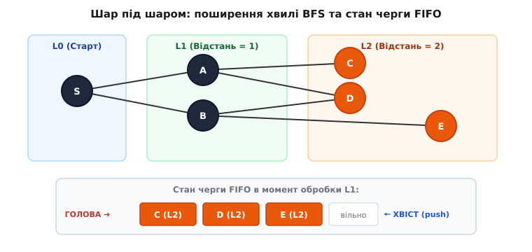
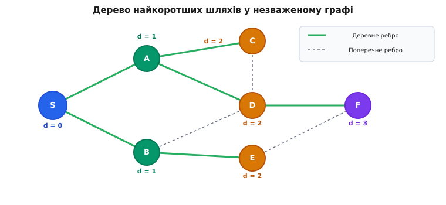
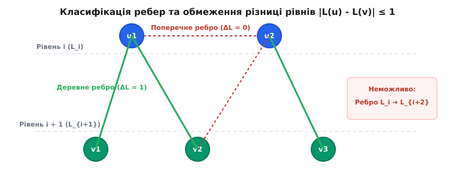

# Пошук у ширину (BFS)

<preknowlist>
- [Пошук у глибину (DFS)](topic:algorithms/depth-first-search) — альтернативний метод обходу графів із заглибленням убік окремих гілок.
- [Черга FIFO](topic:algorithms/queue-fifo) — структура даних «першим прийшов — першим вийшов» для черговості хвилі.
- [Алгоритм Дейкстри](topic:algorithms/dijkstra) — узагальнення пошуку найкоротших шляхів на графи зі зваженими ребрами.
</preknowlist>

Коли навігаційний модуль обчислює оптимальний маршрут у незваженому графі міських вулиць, де кожен проліт між перехрестями має однакову умовну вартість, або коли мережевий комутатор шукає шлях із найменшою кількістю проміжних ретрансляторів (англ. *hop count*), задача зводиться до розрахунку найкоротших шляхів у графах з однаковими вагами ребер. Спроба розв'язувати таку задачу випадковим перебором чи хаотичним заглибленням в один із маршрутів призводить до нескінченних блукань тупиковими гілками. Натомість природне рішення підказує фізика хвильових процесів: якщо кинути камінь у спокійну воду, хвильовий фронт поширюється концентричними колами в усіх напрямках одночасно. Спершу хвиля досягає точок на відстані в 1 одиницю, потім на відстані 2 одиниці, і так далі. Саме цей принцип послідовного та рівномірного розширення фронту покладено в основу алгоритму **пошуку у ширину** (англ. *Breadth-First Search*, BFS): він відвідує вершини графа суворими шарами за зростанням відстані від початкового вузла.

Завдяки принципу рівномірного поширення фронту BFS гарантує знаходження шляху з найменшою кількістю ребер у незваженому графі за один послідовний прохід без повторного перегляду раніше зафіксованих вузлів. Детальний розбір історії виникнення цього принципу у працях Конрада Цузе та Едварда Мура наведено в [Історії виникнення алгоритму](topic:algorithms/breadth-first-search/hist-breadth-first-search.md).

### Механізм хвилі та математична роль черги FIFO

Уявімо граф як просторову сітку точок, з'єднаних нитками одинакової довжини. Якщо підняти початкову вершину `s` вгору, під дією сили тяжіння спершу натягнуться нитки до її прямих сусідів — вони утворять перший шар (відстань 1). Далі ці сусіди потягнуть своїх сусідів — утвориться миттєво другий шар (відстань 2), і так далі. Щоб відтворити цей механізм у комп'ютерній програмі, алгоритм має дотримуватися строгого порядку: жодна вершина шару `k + 1` не повинна оброблятися раніше, ніж будуть повністю вивчені всі вершини шару `k`.

Для забезпечення цього порядку звичайна рекурсія чи стек LIFO не придатні, оскільки вони заглиблюються вбік однієї гілки. Інструментом збереження справедливої черговості виступає структура даних **черга FIFO** (англ. *First-In, First-Out* — «першим прийшов, першим вийшов»).

Формально хвильовий фронт на кроці `k` визначається як множина вершин `L_k`, точна найкоротша відстань до яких від старту `s` дорівнює `k`. Ініціалізація починається з шару `L_0 = {s}`. На кожному наступному кроці новий шар утворюється шляхом об'єднання всіх незайнятих сусідів вершин поточного шару:

```text
L_{k+1} = N(L_k) \ (L_0 ∪ L_1 ∪ ... ∪ L_k)
```

де `N(L_k)` — множина всіх вершин, суміжних з вершинами шару `L_k`.

Внутрішній стан алгоритму описується двома основними масивами та однією динамічною структурою даних:
1. **Черга `Q`**, яка тримає активний фронт хвилі — вершини, які вже виявлені та помічені, але чиї власні вихідні ребра ще не були повністю досліджені.
2. **Масив відстаней `d[]`**, де `d[v]` зберігає довжину найкоротшого відомого шляху від джерела `s` до вершини `v`. Початково для всіх вершин, крім `s`, це значення встановлюється у нескінченність (`∞` або `-1`).
3. **Масив відвіданості `visited[]`**, який запобігає повторному додаванню тієї самої вершини до черги та виключає зациклення в орієнтованих і неорієнтованих циклах.
4. **Масив предків `parent[]`**, де `parent[v]` зберігає номер вершини, з якої було вперше відкрито `v`. Цей масив дозволяє відновити точну послідовність вершин найкоротшого шляху у зворотному напрямку.

Повний алгоритмічний цикл обходу складається з таких кроків:

```text
 Крок 1 (Ініціалізація):
   - Встановлюємо d[s] = 0, d[v] = ∞ для всіх v ≠ s.
   - Встановлюємо visited[s] = true, visited[v] = false для всіх v ≠ s.
   - Встановлюємо parent[s] = -1, parent[v] = -1 для всіх v ≠ s.
   - Очищаємо чергу Q і додаємо в неї початкову вершину s (push s).

 Крок 2 (Основний цикл):
   - Поки черга Q не порожня:
       a) Вилучаємо вершину u з голови черги Q (pop u).
       b) Для кожного сусіда v вершини u у списку сусідості adj[u]:
            - Якщо visited[v] == false:
                * Позначаємо visited[v] = true.
                * Обчислюємо відстань: d[v] = d[u] + 1.
                * Запам'ятовуємо предка: parent[v] = u.
                * Додаємо v у кінець черги Q (push v).
```


*Поширення хвилі BFS по шарах. Стартова вершина S (шар L0) уже оброблена; вершини A та B (шар L1) вилучені з черги, а їхні непомічені сусіди C, D та E (шар L2) додані в кінець черги FIFO.*

> 🔧 **Навіщо це.** Прапорець `visited` обов'язково встановити негайно у момент **додавання** вершини до черги (push), а не у момент її вилучення з голови (pop). Це одна з найпоширеніших практичних помилок: якщо відкласти встановлення прапорця до моменту вилучення, одна й та сама вершина `v`, яка є спільним сусідом кількох вузлів поточного шару, буде додана до черги багато разів. Це спричиняє вибухове зростання споживання пам'яті та руйнує лінійну складність `O(V + E)`.

### Крайові та вироджені випадки в роботі BFS

При розробці системних бібліотек обробки графів алгоритм BFS повинен коректно опрацьовувати серію вироджених топологій та критичних крайових умов:

1. **Порожній граф (`V = ∅`):** Передана кількість вершин дорівнює 0. Алгоритм зупиняє виконання на етапі перевірки стартового індексу і повертає статус помилки без алокації масивів.
2. **Ізольована стартова вершина (`s` без вихідних ребер):** Початковий вузол додається у чергу, після чого негайно з неї вилучається. Цикл обходу завершується за 1 ітерацію, лишаючи відстань `d[s] = 0`, а для всіх інших вершин — `d[v] = -1`.
3. **Повний граф (`K_n`):** Кожна вершина з'єднана з усіма іншими. На першій же ітерації при обробці старту `s` до черги одночасно додаються всі решта `N-1` вершин. Розмір черги досягає максимальної ширини `W = N-1`. Алгоритм завершується за 2 кроки основного циклу, встановивши відстань 1 до всіх вузлів.
4. **Зірчастий граф (`K_{1, N-1}`):** Якщо стартувати з центральної вершини зірки, усі периферійні вузли відкриваються за 1 крок, створюючи максимальне пікове навантаження на чергу.
5. **Лінійний граф-ланцюг (`P_n`):** Вершини вишикувані в одну лінію `s → v_1 → v_2 → ... → v_n`. Черга в будь-який момент часу містить рівно 1 елемент (`W = 1`). Просторова складність черги є мінімальною `O(1)`, але глибина обходу дорівнює `N-1`.
6. **Граф із паралельними ребрами та петлями (Мультиграф):** Наявність петель видаляється перевіркою `visited[u] == true`, а паралельні ребра між тими самими вершинами просто ігноруються при повторному розпуску, не порушуючи коректності обчислення відстаней.

### Вплив топології графа на профіль використання пам'яті черги

Максимальна ємність оперативної пам'яті, яку споживає черга FIFO під час обходу, напряму визначається геометрією та топологією дослідницького графа.

#### 1. Графи типу «Малий світ» (Small-World / Power-Law Networks)
У соціальних мережах, топологіях інтернету та графах цитувань наукових праць розподіл ступенів вершин підпорядковується степеневому закону (Power-Law Distribution). У таких графах існують вузли-хаби (Hubs) із мільйонами вихідних ребер. Коли хвиля BFS досягає такого хаба, розмір черги робить стрімкий стрибок від кількох одиниць до мільйонів елементів за 1 ітерацію. Профіль пам'яті має вигляд гострого піку.

#### 2. Двовимірні та тривимірні сітки (Spatial Grids)
У задачах обробки фізичних сіток `N × N` хвильовий фронт розгортається у формі концентричного ромба чи кола. Кількість вершин на фронті радіуса `r` зростає лінійно `O(r)`. Піковий розмір черги досягає пропорції `O(N)` (периметр хвильового кола), що робить використання пам'яті передбачуваним і детермінованим.

#### 3. Повні двійкові та `k`-арні дерева (Balanced Trees)
У повній двійковій ієрархії з `N` вузлами кількість вершин на рівні `k` дорівнює `2^k`. На останньому рівні знаходиться `W ≈ N / 2` вершин. Таким чином, черга BFS досягає свого абсолютного максимуму на останній ітерації, утримуючи в пам'яті половину всіх вузлів дерева.

### Покрокове трасування стану даних

Розглянемо детальний прогін алгоритму на прикладі орієнтованого графа з 6 вершин (`S, A, B, C, D, E`) та наступним списком ребер:
`S → A`, `S → B`, `A → C`, `A → D`, `B → D`, `B → E`, `C → E`.

Простежимо вміст черги `Q`, масивів `dist` та `parent` на кожній ітерації:

```text
Початковий стан:
  Q = [S]
  visited = {S: true, A: false, B: false, C: false, D: false, E: false}
  dist    = {S: 0, A: ∞, B: ∞, C: ∞, D: ∞, E: ∞}
  parent  = {S: -1, A: -1, B: -1, C: -1, D: -1, E: -1}

Ітерація 1:
  Вилучаємо з голови: u = S.
  Розглядаємо ребра з S:
    - Ребро S → A: A не відвідано.
        visited[A] = true; dist[A] = dist[S] + 1 = 1; parent[A] = S; Q.push(A)
    - Ребро S → B: B не відвідано.
        visited[B] = true; dist[B] = dist[S] + 1 = 1; parent[B] = S; Q.push(B)
  Стан черги: Q = [A, B]

Ітерація 2:
  Вилучаємо з голови: u = A. (В черзі лишився B)
  Розглядаємо ребра з A:
    - Ребро A → C: C не відвідано.
        visited[C] = true; dist[C] = dist[A] + 1 = 2; parent[C] = A; Q.push(C)
    - Ребро A → D: D не відвідано.
        visited[D] = true; dist[D] = dist[A] + 1 = 2; parent[D] = A; Q.push(D)
  Стан черги: Q = [B, C, D]

Ітерація 3:
  Вилучаємо з голови: u = B. (В черзі лишилися C, D)
  Розглядаємо ребра з B:
    - Ребро B → D: D ВЖЕ відвідано (visited[D] == true)! Ігноруємо.
    - Ребро B → E: E не відвідано.
        visited[E] = true; dist[E] = dist[B] + 1 = 2; parent[E] = B; Q.push(E)
  Стан черги: Q = [C, D, E]

Ітерація 4:
  Вилучаємо з голови: u = C.
  Розглядаємо ребро C → E: E ВЖЕ відвідано (visited[E] == true)! Ігноруємо.
  Стан черги: Q = [D, E]

Ітерація 5:
  Вилучаємо з голови: u = D. Вихідних ребер немає. Стан черги: Q = [E]

Ітерація 6:
  Вилучаємо з голови: u = E. Вихідних ребер немає. Стан черги: Q = []

Черга порожня — алгоритм завершено.
Остаточні відстані від S: dist = {S: 0, A: 1, B: 1, C: 2, D: 2, E: 2}.
```

Цей приклад демонструє важливу властивість: хоча вершина `E` досяжна двома різними шляхами (`S → A → C → E` довжиною 3 та `S → B → E` довжиною 2), BFS першою знайшов саме коротший шлях довжиною 2, оскільки вершину `B` було оброблено на шар раніше, ніж `C`.

Для відновлення найкоротшого шляху від старту `S` до обраної цілі, наприклад `E`, ми рухаємося назад за допомогою масиву `parent`:
1. Починаємо з цільової вершини `curr = E`.
2. Знаходимо предка `parent[E] = B`.
3. Знаходимо предка `parent[B] = S`.
4. Знаходимо предка `parent[S] = -1` (досягли старту).
5. Перевертаємо отриману послідовність `[E, B, S]`, отримуючи найкоротший шлях: `S → B → E`.

### Дерево найкоротших шляхів та класифікація ребер

Під час виконання BFS орієнтовані ребра `(u, v)`, які приводять до відкриття нових вершин (`visited[v] == false`), утворюють остовний ліс або **дерево найкоротших шляхів BFS** (англ. *BFS Shortest-Path Tree*).


*Формування дерева найкоротших шляхів. Суцільні зелені лінії показують деревні ребра (Tree Edges), які задають parent[v], а пунктирні сірі — поперечні ребра (Cross Edges), які з'єднують вершини одного або суміжних шарів.*

Усі ребра початкового графа `G = (V, E)` під час BFS класифікуються на два основні типи:
1. **Деревні ребра (Tree Edges):** Ребра, які вперше відкривають вершину `v` з вершини `u`. Саме вони утворюють дерево найкоротших шляхів. Для кожного деревного ребра справджується рівність:

```text
dist[v] = dist[u] + 1
```

2. **Поперечні ребра (Cross / Non-tree Edges):** Ребра, які ведуть до вже відвіданої вершини. У неорієнтованому графі поперечні ребра можуть з'єднувати лише вершини одного й того самого шару (`dist[v] = dist[u]`) або двох сусідніх шарів (`dist[v] = dist[u] + 1` чи `dist[v] = dist[u] - 1`).


*Структурне обмеження на ребра у неорієнтованому графі. Жодне ребро не може з'єднувати вершини, рівні яких відрізняються більше ніж на 1, оскільки вершина шару L_{i+2} була б відкрита з L_i ще на попередньому кроці.*

Строгий індукційний аналіз та леми про монотонність черги висвітлено у [Математичному доведенні коректності](topic:algorithms/breadth-first-search/math-bfs-correctness.md).

### Аналіз структур даних для подання графа у системній пам'яті

Швидкодія та споживання пам'яті BFS у реальних обчислювальних системах істотно залежать від того, як граф представлений в пам'яті.

#### 1. Матриця сусідості (Adjacency Matrix)
Граф зберігається як двовимірний масив `bool matrix[V][V]`.
- **Пам'ять:** `O(V²)` байт.
- **Час BFS:** `O(V²)`, оскільки для кожної вилученої з черги вершини необхідно просканувати весь рядок довжиною `V`.
- **Оцінка:** Використовується лише для дуже щільних графів (`E ≈ V²`) або графів малого розміру (`V ≤ 1000`).

#### 2. Список сусідості (Adjacency List)
Граф зберігається як масив динамічних списків/векторів `std::vector<int> adj[V]`.
- **Пам'ять:** `O(V + E)`.
- **Час BFS:** `O(V + E)` — ідеальна лінійна складність.
- **Недоліки:** Динамічні масиви `std::vector` можуть виділятися у різних ділянках купи (Heap Fragmentation), викликаючи промахи L1/L2 кешу при переході між вершинами.

#### 3. Стиснутий формат рядків (Compressed Sparse Row — CSR)
Найбільш високопродуктивне системне подання графів для нативних C/C++ рушіїв та GPU-обчислень (CUDA/OpenCL). Усі ребра графа упаковуються у два суцільні неперервні масиви:
1. `col_ind[E]` — містить кінцеві вершини всіх ребер.
2. `row_ptr[V + 1]` — містить зміщення в масиві `col_ind`, де починаються сусіди `i`-ї вершини.

:::tabs
```c
// Перебір сусідів вершини u у CSR-форматі:
int start_idx = row_ptr[u];
int end_idx   = row_ptr[u + 1];
for (int i = start_idx; i < end_idx; ++i) {
    int v = col_ind[i];
    // Обробка ребра (u, v)
}
```
```cpp
// Перебір сусідів вершини u у CSR-форматі на C++:
for (int i = row_ptr[u]; i < row_ptr[u + 1]; ++i) {
    int v = col_ind[i];
    // Обробка ребра (u, v)
}
```
:::

Завдяки суцільному розташуванню даних у пам'яті CSR-формат гарантує максимальну кеш-локальність (Cache Locality) та ідеально завантажує кеш-лінії процесора.

#### 4. Оптимізація бітових масок для прапорців `visited` (Bitset Optimization)
У високонавантажених C-системах виділення масиву `bool visited[V]` вимагає `V` байт пам'яті (оскільки в C/C++ `sizeof(bool) == 1`). Заміна `bool` масиву на побітовий масив `uint64_t visited_bits[(V + 63) / 64]` зменшує обсяг пам'яті у **8 разів**. Перевірка та встановлення прапорця відвіданості виконуються за допомогою швидких бітових масок:

:::tabs
```c
bool is_visited(const uint64_t* visited, int v) {
    return (visited[v / 64] & (1ULL << (v % 64))) != 0;
}

void mark_visited(uint64_t* visited, int v) {
    visited[v / 64] |= (1ULL << (v % 64));
}
```
```cpp
bool is_visited(const std::vector<uint64_t>& visited, int v) {
    return (visited[v / 64] & (1ULL << (v % 64))) != 0;
}

void mark_visited(std::vector<uint64_t>& visited, int v) {
    visited[v / 64] |= (1ULL << (v % 64));
}
```
:::

Така бітова згортка підвищує щільність завантаження даних у кеш-лінії L1 процесора, підвищуючи загальну швидкість виконання обходу.

### Порівняльний аналіз стратегій обходу: BFS vs DFS vs Dijkstra

Для вибору оптимального інструменту порівняємо три фундаментальні алгоритми обходу графів:

1. **BFS (Breadth-First Search):**
   Призначений для незважених графів (де ваги всіх ребер `w(e) = 1`). Гарантує найкоротший шлях за час `O(V + E)` і споживає пам'ять пропорційно ширині графа `O(W)`.
2. **DFS (Depth-First Search):**
   Призначений для глибокого дослідження структур (пошук компонент сильнов'язності, мостів, сортування топологічне). Не гарантує найкоротших шляхів, але споживає пам'ять пропорційно глибині `O(D)`.
3. **Алгоритм Дейкстри (Dijkstra's Algorithm):**
   Призначений для графів із довільними невід'ємними вагами ребер (`w(e) ≥ 0`). Використовує пріоритетну купу (Min-Priority Queue) замість FIFO черги. BFS є прямим окремим випадком алгоритму Дейкстри, коли всі ваги ребер тотожно дорівнюють 1. В цьому випадку пріоритетна купа спрощується до черги FIFO, знижуючи складність з `O((V + E) log V)` до строго лінійної `O(V + E)`.

| Критерій порівняння | BFS (Пошук у ширину) | DFS (Пошук у глибину) | Алгоритм Дейкстри |
| :--- | :--- | :--- | :--- |
| **Тип графа** | Незважений (`w = 1`) | Довільний | Невід'ємні ваги (`w ≥ 0`) |
| **Структура даних** | Черга FIFO | Стек LIFO | Пріоритетна купа (Min-Heap) |
| **Часова складність** | `O(V + E)` | `O(V + E)` | `O((V + E) log V)` |
| **Просторова складність** | `O(W)` (Ширина) | `O(D)` (Глибина) | `O(V)` |
| **Гарантія найкоротшого шляху** | Так (у незваженому) | Ні | Так (у зваженому без `<0`) |

### Аналіз складності: Час, Пам'ять та Форма представлення

Обчислимо ресурсні витрати алгоритму залежно від способу збереження графа в пам'яті.

#### 1. Часова складність (Time Complexity)

Розглянемо випадок подання графа у вигляді **списків сусідості** (англ. *Adjacency List*):
- Ініціалізація масивів `dist` та `visited` потребує `O(V)` операцій.
- Кожна вершина `u ∈ V` потрапляє в чергу `Q` рівно один раз і вилучається з неї рівно один раз. Операції `push` та `pop` виконуються за `O(1)`, що дає `O(V)` в сумі.
- Внутрішній цикл за сусідами для вершини `u` виконується `deg(u)` разів, де `deg(u)` — ступінь виходу вершини `u`.
- Сума ступенів усіх вершин у графі дорівнює кількості ребер `∑ deg(u) = E` (для орієнтованого) або `2E` (для неорієнтованого).

Отже, сумарний час виконання при використанні списків сусідості є strictly **лінійним**:

```text
T(V, E) = O(V + E)
```

Якщо граф подано у вигляді **матриці сусідості** (англ. *Adjacency Matrix*) розміром `V × V`:
- Для кожної з `V` вершин, вилучених із черги, необхідно переглянути весь рядок матриці довжиною `V`, щоб знайти суміжні вузли.
- В результаті часова складність зростає до:

```text
T(V, E) = O(V²)
```

Тому для розріджених графів (`E ≪ V²`) матриця сусідості є катастрофічно неефективною.

#### 2. Просторова складність (Space Complexity)

Пам'ять алгоритму складається з трьох частин:
- Масиви `dist`, `parent` та `visited`: `O(V)` слів пам'яті.
- Динамічна черга `Q`: У найгіршому випадку (наприклад, у дводольному графі `K_{1, N-1}`, де зіркова вершина з'єднана з усіма іншими) черга одночасно тримає `O(V)` вершин.
- Представлення самого графа: `O(V + E)` для списків сусідості.

Отже, додаткова пам'ять алгоритму без урахування самого графа оцінюється як:

```text
S(V) = O(V)
```

Максимальний розмір черги відповідає найбільшій **ширині графа** (максимальній кількості вершин у межах одного шару `W = max |L_k|`). Для збалансованого двійкового дерева з `N` вузлами глибина `D = log₂ N`, а ширина останнього рівня `W ≈ N / 2`. У цьому випадку BFS споживає `O(N)` пам'яті під чергу, тоді як DFS потребує лише `O(log N)` пам'яті під стек рекурсії. Натомість для бамбукоподібного графа-ланцюга шириною `W = 1` BFS споживає `O(1)` пам'яті черги, тоді як DFS витрачає `O(N)` пам'яті на стек.

### Оптимізації та виняткові варіації BFS

У практичному інжинірингу стандартна схема BFS зазнає модифікацій для прискорення обчислень або адаптації під специфічні умови.

#### 1. Двосторонній BFS (Bidirectional BFS)

Якщо задано як початкову вершину `s`, так і чітку цільову вершину `t`, класичний односторонній BFS розширює хвилю у формі кулі об'ємом `O(b^d)`, де `b` — середній коефіцієнт розгалуження графа (англ. *branching factor*), а `d` — відстань між `s` та `t`.

Двосторонній BFS запускає **дві одночасні хвилі**: одну від джерела `s` вперед, а другу від цілі `t` назад. Обхід зупиняється негайно у момент, коли дві хвилі перетинаються у деякій проміжній вершині `m` (`visited_forward[m] && visited_backward[m]`).

```text
Односторонній BFS:   Пошукова зона ≈ b^d
Двосторонній BFS:    Пошукова зона ≈ 2 · b^(d/2)
```

Для графа з розгалуженням `b = 10` та відстанню `d = 6`:
- Односторонній BFS перегляне `10⁶ = 1,000,000` вершин.
- Двосторонній BFS перегляне `2 · 10³ = 2,000` вершин (прискорення у 500 разів!).

Щоб досягти максимальної ефективності, на кожному кроці алгоритм обирає для розширення саме ту чергу, яка має менший поточний розмір. Це дозволяє уникнути роздування фронту в асиметричних графах.

#### 2. Напрямково-оптимізований паралельний BFS (Direction-Optimizing BFS)

При обробці надвеликих графів типу «малий світ» (Small-World Networks, такі як граф соціальних мереж чи веб-павутина з мільярдами ребер) коефіцієнт розгалуження в центральних вузлах (Hubs) є гігантським. Класичний підхід **Top-Down** (коли кожна вершина поточного фронту переглядає всі свої вихідні ребра) генерує мільйони непотрібних перевірок `visited[v]`.

У 2012 році Скотт Бімер (Scott Beamer et al.) запропонував гібридний метод **Direction-Optimizing BFS**:
- **Режим Top-Down (Прямий):** Використовується на початку та наприкінці обходу, коли активний фронт містить мало вершин.
- **Режим Bottom-Up (Зворотний):** Вмикається тоді, коли активний фронт охоплює значну частку графа. У цьому режимі **всі невідвідані вершини** перевіряють свої вхідні ребра: як тільки невідвідана вершина знаходить **хоча б одного** сусіда в активному фронті, вона вважається відкритою і перевірка її решти ребер припиняється.

Цей гібридний підхід зменшує кількість оглянутих ребер на 80–90% і скорочує час обходу графів соціальних мереж на багатоядерних системах у 10–100 разів.

#### 3. Багатопотоковий розподілений BFS (Distributed Multi-Threaded BFS)

Для обробки графів терабайтного обсягу, які не поміщаються у RAM одного сервера (наприклад, повнотекстовий індекс Google або граф зв'язків метавсесвіту), BFS паралелиться між багатьма обчислювальними вузлами кластера:
- **Модель обміну повідомленнями (MPI):** Вершини графа розділяються між вузлами кластера за допомогою функцій хешування `v ↦ Node_ID`.
- **Локальні черги та фази синхронізації:** Кожен вузол обробляє свою чергу локальних вершин і надсилає повідомлення-запити відкриття іншим вузлам на межі кроку шару.
- **Балансування навантаження (Work Stealing):** У разі нерівномірного розподілу вершин між ядрами застосовуються алгоритми перехоплення задач для усунення простою обчислювачів.
- **Урахування топології NUMA (NUMA-Aware Memory Allocation):** На сучасних багатопроцесорних серверах із нерівномірним доступом до пам'яті (NUMA) локальні черги потоків виділяються у вузлах оперативної пам'яті, фізично підключених до відповідного процесорного сокета, що усуває міжсокетові затримки шини QPI/UPI.

#### 4. Синхронізація потоків, хибне розділення кешу та безблокувальні черги (Lock-Free Queues)
У багатиядерних реалізаціях паралельного BFS на C++17/C++20 додавання нових відкритих вершин у спільну чергу із використанням `std::mutex` викликає високий рівень конкуренції потоків (Contention) і блокування ядер. Оптимальним рішенням є використання дводев'єрних безблокувальних черг (Lock-Free Queues) на базі атомарних інструкцій `std::atomic` та примітивів `Compare-And-Swap` (CAS). 

Особлива увага надається запобіганню **хибного розділення кеш-ліній (False Sharing)**: коли змінні індексів різних потоків знаходяться в межах однієї 64-байтової кеш-лінії, ядра процесора витрачають сотні тактів на інвалідацію кешів через протокол MESI/MOESI. Застосування вирівнювання `alignas(64)` для локальних лічильників потоків усуває цей системний оверхед.

```cpp
// Концептуальний приклад безблокувальної публікації у фронт з вирівнюванням:
template <typename T>
class alignas(64) LockFreeFrontier {
    std::vector<T> data;
    alignas(64) std::atomic<std::size_t> tail{0};
public:
    void push(T val) {
        std::size_t idx = tail.fetch_add(1, std::memory_order_relaxed);
        data[idx] = val;
    }
};
```

Використання подібних атомарних масивів-буферів усуває виклики системних функцій блокування ОС і дозволяє досягати масштабованості обходу BFS до 64+ паралельних потоків CPU.

#### 5. Алгоритм 0-1 BFS (Двостороння черга)

Якщо ребра графа мають не однакову вагу, але ваги обмежені лише двома значеннями `{0, 1}` (наприклад, перехід без коштів або перехід із платою в 1 монетку), стандартний BFS дає збій, а використання алгоритму Дейкстри з пріоритетною чергою дає оверхед `O((V + E) log V)`.

Для збереження лінійної складності `O(V + E)` замість звичайної черги FIFO застосовується **двостороння черга `std::deque`**:
- Якщо ребро `(u, v)` має вагу `w = 0`, нову вершину `v` додають у **голову черги** (`push_front`), оскільки вона належить тому самому шару відстані `d[v] = d[u]`.
- Якщо ребро `(u, v)` має вагу `w = 1`, нову вершину `v` додають у **хвіст черги** (`push_back`), оскільки вона належить наступному шару `d[v] = d[u] + 1`.

Ця проста адаптація гарантує монотонність відстаней в `deque` без коштовного перешикування купи (heap).

#### 6. Лексикографічний BFS (LexBFS)

Лексикографічний BFS є спеціалізованим розширенням алгоритму BFS, яке замінює звичайні прапорці відвіданості на впорядковані списки міток вершин. LexBFS обчислює правильне впорядкування вершин за час `O(V + E)`, яке використовується у теорії графів для швидкого розпізнавання **хордальних графів** (англ. *Chordal Graphs*), виявлення інтервальних графів та оптимального розфарбування графів обмеженого класу.

### Зв'язок BFS з іншими фундаментальними алгоритмами

Пошук у ширину є ключовим базовим блоком складніших алгоритмів на графах:

1. **Алгоритм Едмондса-Карпа (Edmonds-Karp Algorithm) для максимального потоку:**
   Використовує BFS на кожному кроці для пошуку найкоротшого (за кількістю ребер) збільшувального шляху (Augmenting Path) у залишковій мережі `G_f`. Використання саме BFS гарантує поліноміальну верхню межу часу виконання `O(V E²)` незалежно від величини пропускних спроможностей ребер, захищаючи від безкінечних ітерацій алгоритму Форда-Фалкерсона.
2. **Алгоритм Дініца (Dinitz Algorithm):**
   Використовує BFS для побудови **шаруватої мережі** (Level Graph), у якій ребра спрямовані строго з шару `i` до шару `i+1`. Після цього блоки DFS знаходять блоки блокуральних потоків (Blocking Flows), досягаючи складності `O(V² E)`.
3. **Алгоритм Хопкрофта-Карпа (Hopcroft-Karp Algorithm):**
   Використовує BFS для одночасного пошуку множини найкоротших збільшувальних шляхів у дводольних графах для знаходження максимального паросполучення за час `O(E √V)`.

### Напрямки розвитку та алгебраїчні концепції графів (GraphBLAS)

У сучасній теорії алгоритмів обхід у ширину розглядається як фундаментальна матрично-векторна операція в алгебрі тропічних напівкілець (Min-Plus / Max-Plus Algebra). У цій формалізації крок обходу BFS подається як помноження вектора стану фронту на матрицю сусідості графа у напівкільці `(R ∪ {∞}, min, +)`. Цей підхід дозволяє виразити обхід BFS через високоефективні матричні операції (GraphBLAS API) і виконувати його на тензорних ядрах графічних процесорів (Nvidia Tensor Cores) та нейропроцесорних прискорювачах (NPU) зі швидкістю у десятки мільярдів оброблених ребер за секунду (GTEPS — Giga Traversed Edges Per Second).

### Системні застосування та низкорівневий аналіз

Пошук у ширину лежить у основі ключових підсистем сучасних операційних систем, компіляторів та мережевих стеків.

1. **Маршрутизація в мережевих протоколах (Link-State Routing):** Протоколи маршрутизації (такі як IS-IS та OSPF) будують топологію автономної системи та обчислюють таблиці просування пакетів (FIB — Forwarding Information Base). У незважених топологіях або при мінімізації кількості хопів саме BFS обчислює найкоротші шляхи до кожної підмережі.
2. **Збирачі сміття (Garbage Collection):** У виконувальних середовищах (JVM, V8, .NET CLR) збирач сміття (наприклад, алгоритм Чені — *Cheney's Copying Collector*) використовує хвильовий BFS для трасування живих об'єктів від кореневих вказівників (Root Set) і їх переміщення у нову область пам'яті (To-Space).
3. **Аналіз залежностей у системах збірки:** Системи ініціалізації (systemd) та збірники проектів (CMake, Ninja) будують орієнтований граф залежностей служб або модулів. BFS використовується для пошарового паралельного запуску задач, які не мають між собою прямих блокуючих зв'язків.
4. **Файлові системи та dentry-кеш ядра Linux:** У викликах пошуку файлів по каталогах (подібно до команди `find` або сканування дерев `sysfs`) ядро операційної системи використовує пошаровий обхід для запобігання зацикленню в умовах символьних посилань (symlinks) та оптимізації читання секторів диска.
5. **Апаратні прискорювачі та обчислення в пам'яті (Processing-In-Memory — PIM):** Сучасні графічні процесори (GPU) та прискорювачі обробки графів (наприклад, архітектури CXL / HBM2E) інтегрують спрощені ядерні обчислювачі BFS безпосередньо у кристали оперативної пам'яті. Це усуває вузьке місце шини даних (Memory Wall) при зчитуванні випадкових елементів списку сусідості, прискорюючи аналіз великих графів у 10–25 разів.

Готові реалізації практичних задач (Flood Fill, пошук у 2D-сітці, перевірка дводольності, 0-1 BFS) наведено у [Практичних алгоритмах та прикладних задачах](topic:algorithms/breadth-first-search/proj-bfs-applications.md).

Опис універсального C/C++ API та подійного шаблону відвідувача доступний у [Інтерфейсі та шаблоні відвідувача](topic:algorithms/breadth-first-search/api-bfs-traversal.md).
