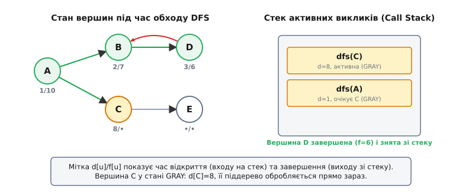
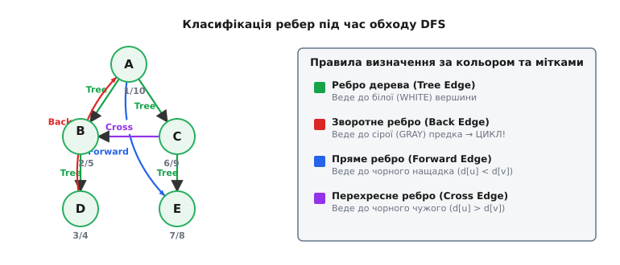
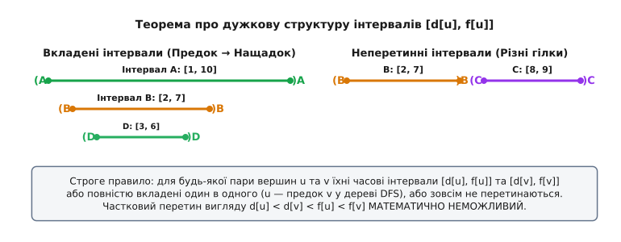

# Пошук у глибину (DFS)

<preknowlist>
- [Способи подання графів](book:algorithms/graph-representation) — списки суміжності, матриці суміжності, вершини та ребра.
- [Рекурсія](book:algorithms/recursion) — стек викликів, фрейми рекурсії, порядок LIFO (Last-In, First-Out).
</preknowlist>

При дослідженні складних обчисливальних графів станів, аналізі вихідного коду в компіляторах, трасуванні мережевих залежностей чи формальній верифікації програмного забезпечення система регулярно опиняється перед задачею повного й систематичного перебору всіх досяжних вузлів. Якщо орієнтуватися на безсистемне блукання, алгоритм неминуче потрапить у нескінченні цикли повторних викликів або блискавично вичерпає оперативну пам'ять для збереження фронту відкритих вершин.

**Пошук у глибину** (англ. *Depth-First Search*, скорочено **DFS**) розв'язує цю задачу шляхом безапеляційного просування вздовж кожного обраного шляху настільки глибоко, наскільки це можливо, перш ніж виконати **пошук із поверненням (backtracking)** до останньої нерозглянутої вилки. Там, де [пошук у ширину (BFS)](book:algorithms/breadth-first-search) рівномірно розширює фронт обходу концентричними кола на однакову відстань від старту, DFS веде себе як точкове свердло: занурюється на саме дно графа, накопичуючи поточний ланцюжок вершин у стековій структурі даних.

Така стратегія робить DFS фундаментальним інструментом не просто для перебору вершин, а для аналізу внутрішньої **топології, зв'язності та глибоких структурних властивостей** графа. З виявлення орієнтованих циклів, побудови топологічного сортування залежностей, знаходження компонент сильно зв'язності та критичних точок розчленування починається розлогий спектр застосування алгоритму, чий внутрішній механізм ми розберемо до найменших деталей.

---

### Явні та неявні графи: де виникає потреба в обході

Перш ніж зануритися у механіку роботи алгоритму, важливо розрізняти два класи об'єктів, до яких застосовують DFS у реальних обчисливальних системах:

1. **Явні графи (Explicit Graphs):** Структури даних, повністю побудовані в оперативній пам'яті комп'ютера у вигляді списків або матриць суміжності. Прикладами слугують графи соціальних мереж, топологія комп'ютерних мереж, графи залежностей пакетів у менеджерах збірки (npm, cargo, apt) або веб-метрики посилань між сторінками.
2. **Неявні графи (Implicit Graphs):** Мережі станів, де вершини та ребра не існують у пам'яті заздалегідь, а генеруються «на льоту» за допомогою правил переходів. Прикладами є дерева станів у шахах чи судоку, простір конфігурацій кубика Рубіка, графи досяжності в системному верифікаторі (Model Checking) або пошук виходу у динамічно генерованих лабіринтах.

Для неявних графів розмірність простору станів може виражатися астрономічними числами (`10²⁰` і більше). У таких умовах побудова явного графа в пам'яті є фізично неможливою, і лише алгоритми класу DFS, здатні досліджувати один конкретний гіллястий шлях із мінімальними накладними витратами пам'яті, дозволяють аналізувати такі системи.

---

### Пам'ять та характер руху: чому саме глибина

Щоб зрозуміти приборкану обчислювальну силу DFS, порівняємо його споживання ресурсів із пошуком у ширину (BFS) на абстрактній математичній моделі великого графа станів.

Нехай задано дерево рішень із коефіцієнтом розгалуження `b = 10` та висотою `H = 8`. Загальна кількість вершин у такому дереві становить:

```
1 + 10¹ + 10² + ... + 10⁸ ≈ 111 111 111 вершин
```

При пошуку в ширину (BFS) алгоритм вимушений одночасно тримати у черзі весь поточний «шар» (фронт) вершин. На глибині `d = 7` кількість вершин у черзі досягає `10⁷`. Якщо кожна вершина кодується лише 32-бітним цілим числом (4 байти), розмір черги становить понад 40 мегабайтів строго активної оперативної пам'яті лише для збереження адресації фронту. Пам'ять BFS росте пропорційно **максимальній ширині фронту `O(W)`**.

DFS працює принципово інакше. Оскільки він досліджує лише один активний шлях від кореня до поточного листка, у пам'яті одночасно зберігаються тільки ті вершини, які лежать строго на поточному маршруті. Пам'ять DFS росте пропорційно **максимальній глибині графа `O(H)`**, а не його ширині. Для дерева з коефіцієнтом `b = 10` та глибиною `H = 8` у стеку буде перебувати лише 8 вершин.

> 🔧 **Навіщо це.** Якщо у задачах штучного інтелекту, системного аналізу або іграх потрібне виявлення хоча б одного коректного ланцюжка рішень чи вихід із глибокої системи станів, і не має значення, чи буде цей шлях найкоротшим за кількістю кроків, — DFS є незіставно ощадливішим за пам'яттю за BFS. Складність за пам'яттю `O(H)` проти `O(W)` стає вирішальним фактором при роботі із графами мільйонної розмірності.

---

### Вплив способу подання графа на швидкодію

Ефективність виконання DFS безпосередньо залежить від того, в якій структурі даних збережено ребра графа `G = (V, E)`:

1. **Матриця суміжності `A[|V|][|V|]`:** Двовимірний булевий масив, де елемент `A[u][v] = 1` означає наявність ребра `u → v`. Щоб знайти всіх сусідів вершини `u`, алгоритм змушений сканувати весь рядок матриці довжиною `|V|`. У результаті підсумкова часова складність обходу DFS на матриці суміжності стає `O(|V|²)`, навіть якщо граф є дуже розрідженим і містить лише кілька ребер.
2. **Списки суміжності `adj[|V|]`:** Масив динамічних списків або векторів, де для кожної вершини `u` зберігаються строго ті вершини `v`, куди виходять ребра з `u`. Сума довжин усіх списків дорівнює `|E|` (або `2|E|` для неорієнтованого графа). Під час обходу DFS переглядаються лише реально існуючі ребра, що забезпечує оптимальну часову складність `O(|V| + |E|)`.
3. **Упакований формат CSR (Compressed Sparse Row):** Найбільш ефективний спосіб подання графів у системному програмуванні на C/C++. Всі суміжні вершини упаковуються в один суцільний масив, а другий масив зберігає зсуви (offsets) початків списків. Це забезпечує ідеальну кеш-локальність процесора під час виконання DFS.

---

### Механізм обходу та кодування трьох кольорів

Головною небезпекою при обході довільного графа є цикли: потрапивши у замкнений контур `A → B → C → A`, алгоритм без спеціального обліку буде нескінченно блукати тими самими вузлами.

Щоб гарантувати, що кожна вершина буде відкрита рівно один раз і обхід не потрапить у вічний цикл, алгоритм приписує кожній вершині один із **трьох кольорів** (формалізм Роберта Тар'яна та Дональда Кнута):

1. **Білий (WHITE / 0):** Початковий стан вершини. Вона ще не була відкрита алгоритмом, до неї не торкався жоден прохід.
2. **Сірий (GRAY / 1):** Вершина відкрита й перебуває в процесі дослідження. Це означає, що вона знаходиться у поточному системному або користувацькому стеку викликів (на активному шляху рекурсії), але її власний список суміжних вершин або піддерево ще обробляються.
3. **Чорний (BLACK / 2):** Обхід вершини повністю завершено. Усі її вихідні ребра перевірені, всі її нащадки оброблені й пофарбовані у чорний колір, а саму вершину знято зі стеку.

Поряд із кольорами кожній вершині `u` приписують дві цілочисельні **часові мітки**:
- `d[u]` (англ. *discovery time*) — крок глобального таймера, коли вершина `u` вперше стала сірою;
- `f[u]` (англ. *finish time*) — крок глобального таймера, коли вершина `u` повністю оброблена і стала чорною.

Глобальний таймер ініціалізується нулем і збільшується на 1 кожного разу, коли якась вершина змінює колір. У результаті кожна з `|V|` вершин отримує унікальні мітки з діапазону від `1` до `2·|V|`.


*Процес обходу графа алгоритмом DFS. Вершина A є коренем (d=1). Вершина C наразі сіра (d=8) — вона перебуває на стеку викликів разом із предками. Вершини B та D вже чорні (завершені). Завдяки стеку LIFO алгоритм пам'ятає, куди повернутися після завершення C.*

Розглянемо покрокову реалізацію базового алгоритму обходу DFS:

:::tabs
```c
#include <stdio.h>
#include <stdlib.h>
#include <stdbool.h>

typedef enum { WHITE = 0, GRAY = 1, BLACK = 2 } Color;

typedef struct Node {
    int target;
    struct Node* next;
} Node;

typedef struct {
    int num_vertices;
    Node** adj;
} Graph;

void dfs_visit(const Graph* g, int u, Color* color, int* d, int* f, int* timer) {
    color[u] = GRAY;           // 1. Вхід у вершину: позначаємо активною
    d[u] = ++(*timer);         // 2. Фіксуємо час відкриття

    for (Node* edge = g->adj[u]; edge != NULL; edge = edge->next) {
        int v = edge->target;
        if (color[v] == WHITE) { // Якщо сусід білий — занурюємося вглиб
            dfs_visit(g, v, color, d, f, timer);
        }
    }

    color[u] = BLACK;          // 3. Завершення вершини: усі нащадки оброблені
    f[u] = ++(*timer);         // 4. Фіксуємо час завершення
}
```
```cpp
#include <vector>
#include <cstdint>

enum class Color : std::uint8_t { White, Gray, Black };

class Graph {
public:
    explicit Graph(std::size_t n) : adj_(n) {}
    void add_edge(int u, int v) { adj_[u].push_back(v); }
    [[nodiscard]] std::size_t num_vertices() const noexcept { return adj_.size(); }
    [[nodiscard]] const std::vector<int>& neighbors(int u) const { return adj_[u]; }
private:
    std::vector<std::vector<int>> adj_;
};

void dfs_visit(const Graph& g, int u, std::vector<Color>& color,
               std::vector<int>& d, std::vector<int>& f, int& timer) {
    color[u] = Color::Gray;     // 1. Вхід у вершину: позначаємо активною
    d[u] = ++timer;             // 2. Фіксуємо час відкриття

    for (int v : g.neighbors(u)) {
        if (color[v] == Color::White) { // Якщо сусід білий — занурюємося вглиб
            dfs_visit(g, v, color, d, f, timer);
        }
    }

    color[u] = Color::Black;    // 3. Завершення вершини
    f[u] = ++timer;             // 4. Фіксуємо час завершення
}
```
:::

> 🔧 **Навіщо це.** Часові мітки `d[u]` та `f[u]` — це не просто лічильники для логування, а суворий математичний каркас. Співвідношення часових інтервалів `[d[u], f[u]]` дає миттєву відповідь на питання, чи є одна вершина предком або нащадком іншої. Математичну теорію цих інтервалів викладено у [математичних основах DFS](book:algorithms/depth-first-search/math-dfs.md).

---

### Покрокове трасування обходу на прикладі

Щоб детально усвідомити рух таймера та зміну кольорів, протрасуємо роботу DFS на орієнтованому графі з 4 вершин: `0 -> 1`, `0 -> 2`, `1 -> 3`, `3 -> 1` (цикл між 1 та 3).

| Крок | Дія / Ребро | Стек (LIFO) | Стан кольорів (0, 1, 2, 3) | Часові мітки `d/f` | Примітка |
| :--- | :--- | :--- | :--- | :--- | :--- |
| **1** | Вхід у 0 | `[0]` | `G, W, W, W` | `d[0]=1` | Стартова вершина 0 стала сірою |
| **2** | Перехід `0 -> 1` | `[0, 1]` | `G, G, W, W` | `d[1]=2` | Ребро `TREE`, занурення у 1 |
| **3** | Перехід `1 -> 3` | `[0, 1, 3]` | `G, G, W, G` | `d[3]=3` | Ребро `TREE`, занурення у 3 |
| **4** | Огляд `3 -> 1` | `[0, 1, 3]` | `G, G, W, G` | — | Вершина 1 сіра → **BACK EDGE (ЦИКЛ!)** |
| **5** | Завершення 3 | `[0, 1]` | `G, G, W, B` | `f[3]=4` | Сусіди 3 вичерпані → 3 стала чорною |
| **6** | Завершення 1 | `[0]` | `G, B, W, B` | `f[1]=5` | Сусіди 1 вичерпані → 1 стала чорною |
| **7** | Перехід `0 -> 2` | `[0, 2]` | `G, B, G, B` | `d[2]=6` | Ребро `TREE`, занурення у 2 |
| **8** | Завершення 2 | `[0]` | `G, B, B, B` | `f[2]=7` | Вершина 2 без вихідних ребер → чорна |
| **9** | Завершення 0 | `[]` | `B, B, B, B` | `f[0]=8` | Корінь 0 завершено, стек порожній |

З підсумкових міток видно: `d[0]=1, f[0]=8`. Всі інші вершини мають інтервали `[2,5]`, `[6,7]`, `[3,4]`, які строго вкладені у `[1,8]`. Це підтверджує, що всі вершини стали нащадками кореня 0.

---

### Класифікація ребер: чотири породи зв'язків

Під час обходу графа алгоритм DFS робить більше, ніж просто перелічує вершини. Він будує орієнтований ліс (DFS Forest) і класифікує **кожне ребро графа** `u → v` у момент його першого огляду. Категорія ребра визначається кольором цільової вершини `v` під час перевірки з вершини `u`:

1. **Ребра дерева (Tree Edges):** Ребра, за якими відбувається перший перехід у білу вершину `v` (`color[v] == WHITE`). Вони утворюють остовні дерева або ліс DFS (граф `G_π`).
2. **Зворотні ребра (Back Edges):** Ребра, що ведуть із поточного вузла `u` у **сіру** вершину `v` (`color[v] == GRAY`). Вершина `v` на цей момент перебуває вище за `u` у стеку викликів. **Виявлення хоча б одного зворотного ребра є строгою необхідною і достатньою умовою наявності орієнтованого циклу у графі!**
3. **Прямі ребра (Forward Edges):** Ребра, що ведуть із `u` у **чорну** вершину `v` (`color[v] == BLACK`), причому `v` є нащадком `u` у дереві обходу (`d[u] < d[v]`). Це альтернативний «короткий» шлях углиб уже обробленого піддерева.
4. **Перехресні ребра (Cross Edges):** Ребра, що ведуть із `u` у **чорну** вершину `v` (`color[v] == BLACK`), яка НЕ є нащадком `u` (`d[u] > d[v]`). Це місток між незалежними гілками дерева або між окремими компонентами зв'язності.


*Чотири класи ребер: Ребро дерева (зелене), Зворотне ребро (червоне, створює цикл), Пряме ребро (синє) та Перехресне ребро (фіолетове). Кожен тип визначається кольором та мітками відкриття цільової вершини.*

У **неорієнтованих графах** класифікація суттєво спрощується: прямого та перехресного ребер не існує взагалі. Будь-яке ребро неорієнтованого графа є або ребром дерева, або зворотним ребром. Формальне доведення цієї теореми винесено у [математичні основи DFS](book:algorithms/depth-first-search/math-dfs.md).

---

### Теорема про дужкову структуру часових інтервалів

Фундаментальне відкриття Роберта Тар'яна полягає у тому, що часові інтервали відкриття й завершення вершин `[d[u], f[u]]` поводяться точно як вкладені дужкові послідовності `(u ... )u`.

Якщо замінити кожне відкриття `d[u]` символом відкриваючої дужки `(u`, а кожне завершення `f[u]` символом закриваючої дужки `)u`, то вся послідовність міток утворює строго правильний дужковий вираз.

Для довільної пари вершин `u` та `v` виконується строго одна з двох ситуацій:
1. Інтервали `[d[u], f[u]]` та `[d[v], f[v]]` **повністю не перетинаються** — вершини `u` та `v` належать паралельним гілкам або окремим компонентам.
2. Один інтервал **строго вкладений** у інший (наприклад, `d[u] < d[v] < f[v] < f[u]`) — вершина `v` є нащадком `u` у дереві DFS.


*Геометричне представлення інтервалів відкриття й завершення. Інтервал нащадка D [3, 6] строго лежить усередині інтервалів предків B [2, 7] та A [1, 10]. Частковий перетин інтервалів є математично неможливим.*

Частковий перетин інтервалів вигляду `d[u] < d[v] < f[u] < f[v]` є **математично неможливим** завдяки LIFO-структурі викликів: вершина `v`, відкрита під час обробки `u`, не може завершитися після того, як `u` знято зі стеку.

---

### Теорема про білий шлях (White-Path Theorem)

Теорема про білий шлях дає точний топологічний критерій того, коли саме одна вершина стане нащадком іншої в результаті обходу DFS.

**Формулювання:** У лісі DFS графа `G` вершина `v` є нащадком вершини `u` тоді й тільки тоді, коли на момент часу `d[u]` (точне виміряне відкриття `u`) існує шлях від `u` до `v`, що складається **виключно з білих (ще не відвіданих) вершин**.

Це означає, що якщо на момент входу в `u` між `u` та `v` є хоча б один незламаний ланцюжок повністю невідвіданих вузлів, обхід DFS гарантовано досягне `v` раніше, ніж завершить `u`, і включить `v` у піддерево `u`.

---

### Рекурсивний та ітеративний DFS: захист від Stack Overflow

Найпростіший спосіб опису DFS — це рекурсія. Проте в реальних продуктових системах рекурсивний DFS приховує критичну вразливість.

Кожен рекурсивний виклик додає новий стек-фрейм у системний стек викликів (System Call Stack). Розмір системного стеку за замовчуванням у більшості ОС становить від 1 до 8 мегабайтів. 

На 64-бітних архітектурах x86-64 один стек-фрейм функції `dfs_visit` з урахуванням збереження регістрів, вказівника повернення `rip`, локальних змінних та вирівнювання адреси займає від 32 до 64 байтів. 

Якщо граф являє собою довгий ланцюг із `N = 10⁶` вершин (наприклад, лінійний список станів або глибокий зв'язаний список), рекурсивний DFS створить мільйон послідовних фреймів:

```
1 000 000 фреймів × 48 байтів = 48 000 000 байтів ≈ 45.7 МБ
```

Це значно перевищує системний ліміт стеку у 8 МБ, що призводить до катастрофічного переповнення стеку — **Stack Overflow** та аварійного падіння програми із помилкою `Segmentation Fault`.

Для безпечної обробки графів довільної глибини застосовують **ітеративний DFS** із власним виділеним стеком у купі (Heap Memory).

:::tabs
```c
#include <stdio.h>
#include <stdlib.h>
#include <stdbool.h>

typedef struct {
    int u;
    int neighbor_idx;
} StackFrame;

void dfs_iterative(const Graph* g, int start_node) {
    int n = g->num_vertices;
    Color* color = (Color*)calloc(n, sizeof(Color));
    int* d = (int*)malloc(n * sizeof(int));
    int* f = (int*)malloc(n * sizeof(int));
    int timer = 0;

    StackFrame* stack = (StackFrame*)malloc(n * sizeof(StackFrame));
    int top = -1;

    color[start_node] = GRAY;
    d[start_node] = ++timer;
    stack[++top] = (StackFrame){start_node, 0};

    while (top >= 0) {
        int u = stack[top].u;
        Node* curr = g->adj[u];
        int idx = 0;

        while (curr && idx < stack[top].neighbor_idx) {
            curr = curr->next;
            idx++;
        }

        if (curr != NULL) {
            stack[top].neighbor_idx++;
            int v = curr->target;

            if (color[v] == WHITE) {
                color[v] = GRAY;
                d[v] = ++timer;
                stack[++top] = (StackFrame){v, 0}; // Занурення
            }
        } else {
            color[u] = BLACK;
            f[u] = ++timer;
            top--; // Зняття зі стеку після повного завершення нащадків
        }
    }

    free(color);
    free(d);
    free(f);
    free(stack);
}
```
```cpp
#include <vector>
#include <stack>
#include <cstddef>

void dfs_iterative(const Graph& g, int start_node) {
    const std::size_t n = g.num_vertices();
    std::vector<Color> color(n, Color::White);
    std::vector<int> d(n, 0);
    std::vector<int> f(n, 0);
    int timer = 0;

    struct Frame {
        int u;
        std::size_t neighbor_idx;
    };

    std::stack<Frame> st;
    color[start_node] = Color::Gray;
    d[start_node] = ++timer;
    st.push({start_node, 0});

    while (!st.empty()) {
        auto& [u, idx] = st.top();
        const auto& nbrs = g.neighbors(u);

        if (idx < nbrs.size()) {
            int v = nbrs[idx++];
            if (color[v] == Color::White) {
                color[v] = Color::Gray;
                d[v] = ++timer;
                st.push({v, 0}); // Занурення вглиб
            }
        } else {
            color[u] = Color::Black;
            f[u] = ++timer;
            st.pop(); // Завершення вершини u (Post-Order)
        }
    }
}
```
:::

Повні працездатні програми із тестовими даними та оптимізаціями пам'яті наведено у [практичній реалізації DFS](book:algorithms/depth-first-search/proj-dfs.md).

---

### Обчислювальна складність та ресурсні вимоги

Для графа `G = (V, E)` із `|V|` вершинами та `|E|` ребрами складність обходу аналізується за двома параметрами:

1. **Часова складність: `O(|V| + |E|)`**.
   - Кожна вершина потрапляє на стек і змінює колір з білого на сірий та чорний строго **один раз**, що дає `O(|V|)` операцій.
   - Усі вихідні ребра переглядаються строго один раз (або двічі у неорієнтованому графі). Сума довжин усіх списків суміжності становить `|E|` для орієнтованих або `2|E|` для неорієнтованих графів, що дає `O(|E|)` операцій.
   - Підсумковий час виконується за лінійну залежність від розміру графа.

2. **Просторова складність: `O(|V|)`**.
   - Для зберігання кольорів, міток `d/f` та списків предків потрібні масиви розміру `O(|V|)`.
   - Стек у найгіршому випадку (довгий ланцюг) містить `O(|V|)` елементів.

---

### Фундаментальні прикладні застосування

Обхід у глибину слугує базовим конструктивним блоком для багатьох складних графових алгоритмів:

#### 1. Детекція орієнтованих циклів (Cycle Detection)
У компіляторах (аналіз цикличності заторів `import` / `#include`) та у транзакційних базах даних (виявлення deadlocks у графах очікування ресурсів) виявлення принаймні одного зворотного ребра (`color[v] == GRAY`) сигналізує про наявність циклу.

#### 2. Топологічне сортування (Topological Sort)
Для орієнтованих безциклічних графів (DAG) впорядкування вершин за **зменшенням часу завершення `f[u]`** дає строго валідний топологічний порядок. Це використовується у системах збірки (Make, Ninja, CMake) та планувальниках задач. Детально це описано у матеріалі [топологічне сортування](book:algorithms/topological-sort).

#### 3. Компоненти сильно зв'язності (SCC)
Алгоритми Тар'яна та Косараю–Шаріра обчислюють максимально зв'язані підграфи за один або два проходи DFS за лінійний час `O(|V| + |E|)`.
- **Алгоритм Косараю–Шаріра:** Перший прохід DFS зберігає порядок завершення вершин `f[u]`. Граф транспонується (ребра розвертаються `E^T`). Другий прохід DFS запускається у порядку зменшення `f[u]` на транспонованому графі, і кожен новий запуск відкриває точну компоненту сильно зв'язності.
- **Алгоритм Тар'яна:** Використовує один прохід DFS із додатковим стеком та обчисленням величини `lowlink[u]`. Якщо після обходу всіх сусідів `lowlink[u] == d[u]`, то `u` є коренем компоненти сильно зв'язності, а всі її елементи вилучаються зі стеку.
Детально це розглянуто у матеріалі [компоненти сильно зв'язності](book:algorithms/strongly-connected-components).

#### 4. Точки розчленування та мости (Articulation Points & Bridges)
У мережах маршрутизації та інфраструктурних графах вилучення точок розчленування (вершин) або мостів (ребер) розриває граф на окремі незв'язані компоненти.
Алгоритм Тар'яна на основі DFS обчислює для кожної вершини `u` величину `lowlink[u]` — мінімальний час відкриття `d[w]`, досяжний із піддерева `u` через не більше ніж одне зворотне ребро:

```
lowlink[u] = min( d[u],
                  min { d[w] : (u, w) є зворотним ребром },
                  min { lowlink[v] : (u, v) є ребром дерева } )
```

- Ребро дерева `u -> v` є **мостом** тоді й тільки тоді, коли `lowlink[v] > d[u]` (з піддерева `v` немає жодного зворотного шляху до `u` або вище).
- Вершина `u` є **точкою розчленування**, якщо вона є коренем дерева DFS із щонайменше двома дітьми, або якщо вона не є коренем і має дитину `v` з `lowlink[v] >= d[u]`.

#### 5. Бектрекінг та пошук у дереві станів (State Space Search)
У комп'ютерній алгебрі, розв'язувачах булевої здійсненності (SAT Solvers) та алгоритмах альфа-бета відсікання для ігор обхід у глибину дозволяє відсікати завідомо неефективні гілки пошукового дерева без витрат пам'яті.

---

### Порівняльний аналіз DFS та BFS

| Параметр | Пошук у глибину (DFS) | Пошук у ширину (BFS) |
| :--- | :--- | :--- |
| **Базова структура даних** | Стек (LIFO) — системний або `std::stack` | Черга (FIFO) — `std::queue` |
| **Траєкторія руху** | Проникає вглиб вздовж гілки до упору | Розгортається концентричними хвилями |
| **Обсяг пам'яті** | Пропорційний глибині `O(H)` | Пропорційний ширині фронту `O(W)` |
| **Найкоротший шлях** | Не гарантує у незваженому графі | Гарантує у незваженому графі |
| **Сфера застосування** | Топосорт, цикли, SCC, мости, бектрекінг | Найкоротші шляхи, хвильові алгоритми |
| **Пастки реалізації** | Переповнення стеку (Stack Overflow) | Переповнення пам'яті фронтом (Out of Memory) |

---

### Історичний контекст та еволюція

Алгоритми обходу лабіринтів з'явилися задовго до комп'ютерів. У 1882 році Шарль П'єр Тремо запропонував метод мічення стін крейдою для безпечного виходу з лабіринтів. У 1970-х роках Роберт Тар'ян і Джон Гопкрофт формалізували DFS як інструмент аналізу структур графів із лінійним часом `O(|V| + |E|)`, за що у 1986 році отримали премію Тюрінга. Детальну хронологію викладено у [історії розвитку DFS](book:algorithms/depth-first-search/hist-dfs.md).

---

### Програмні інтерфейси та Visitor

Для побудови гнучких графових бібліотек логіку обходу відокремлюють від прикладної задачі за допомогою шаблону **Visitor (Відвідувач)**. Події `discover_vertex`, `tree_edge`, `back_edge` та `finish_vertex` дозволяють адаптувати один і той самий алгоритм обходу під довільну задачу. Повну специфікацію API наведено у [довіднику інтерфейсу Visitor](book:algorithms/depth-first-search/api-dfs.md).
