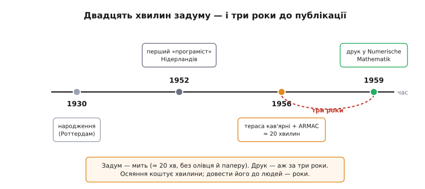

# 📜 Двадцять хвилин на терасі кав'ярні

> Найвживаніший алгоритм пошуку шляху у світі — той, що щомиті прокладає маршрути в навігаторах, роутерах і роботах, — його автор придумав **подумки за двадцять хвилин**, сидячи з нареченою за кавою, без олівця й паперу. І це не переказ із третіх вуст: так розповів сам **Едсгер Вібе Дейкстра** (нідерл. *Edsger Wybe Dijkstra*) наприкінці життя. Історія цього алгоритму — не про геніальне осяяння як таке, а про дві речі, які інженер мусить затямити: чому **відсутність паперу** зробила рішення красивим, і чому людина, що тримала в руках майбутню класику, **не поспішала її друкувати** цілих три роки.

Розповімо все по порядку — бо кожна деталь тут щось важить.

## Хто був той чоловік за кавою

Спершу — про людину, бо контекст пояснює вчинок. Дейкстра народився **11 травня 1930 року в Роттердамі** (нідерл. *Rotterdam*) — і запам'ятай це місто, воно ще спливе в самій задачі. Батько був хіміком і шкільним учителем, мати — математиком (щоправда, без офіційної посади: сиділа вдома, але математику знала глибоко й, за спогадами сина, навчила його думати чітко). Освіту Едсгер здобув не як програміст — таких тоді просто не існувало, — а як **фізик-теоретик** у Лейденському університеті (нідерл. *Leiden*).

І тут стається розвилка, яка й привела його до нашого алгоритму. Ще студентом, 1951 року, Дейкстра поїхав на курси програмування до Кембриджа, а невдовзі, у **березні 1952 року**, дістав посаду в Амстердамському математичному центрі (нідерл. *Mathematisch Centrum*) — і став **першим офіційно найнятим «програмістом» у Нідерландах**. Слово в лапках навмисне: професії ще не було, посаду доводилося вигадувати. Дейкстра згодом згадував свою розмову з керівником, коли вагався, лишатися фізиком чи ні: чи не міг би він стати одним із тих, хто зробить програмування **поважною дисципліною** в роки, що надходять? Це рішення визначило все — і саме тому в 1956 році він сидить у Математичному центрі не як стороння людина, а як той, кому доручають показувати, на що здатні нові машини.


*Стиснута хронологія. Народження в Роттердамі (1930) → перша в країні посада «програміста» (1952) → двадцятихвилинний задум на терасі й показ на ARMAC (1956) → друк аж 1959-го. Дві події поруч показують головну іронію: **сам алгоритм** народився за хвилини, а **його публікація** прийшла за три роки.*

> 🔧 **Навіщо це.** Важливо, що алгоритм придумав **не математик-теоретик графів**, а практик, чия щоденна робота — змусити конкретну машину зробити щось корисне. Це видно в самому рішенні: воно не про красиві властивості графів заради краси, а про те, як за один ощадливий прохід дати машині відповідь. Коли ти пишеш прошивку, ти в тій самій ролі, що й Дейкстра 1956 року, — не доводиш теореми, а робиш, щоб залізо працювало; і найкращі алгоритми часто родяться саме з цього кута, а не з абстракції.

## Замовлення: показати машину так, щоб зрозумів кожен

Тепер — **навіщо** алгоритм узагалі знадобився. Причина цілком приземлена, і без неї історія розсипається.

У Математичному центрі саме добудовували нову обчислювальну машину — **ARMAC** (скорочення від *Automatische Rekenmachine Mathematisch Centrum* — «автоматична обчислювальна машина Математичного центру»). За мірками сьогодення це був монстр-немовля: близько **1200 радіоламп**, десь **тисяча операцій за секунду**, крихітний буфер на магнітних осердях над барабанною пам'яттю. Її готували до **урочистого відкриття**, і Дейкстрі дали делікатне завдання: придумати демонстрацію, яка вразила б **не інженерів**, а звичайну публіку — людей, що прийдуть подивитися на диво техніки й нічого не тямлять у двійкових кодах.

Ось де народжується задача. Показувати, як машина множить стовпчики чисел, — нудно й незрозуміло: глядач не відчує, навіщо це. Дейкстрі потрібна була задача, яку **будь-хто впізнає з власного життя** й одразу оцінить, що машина її розв'язує. І він обрав дорогу: **яким найкоротшим шляхом доїхати з одного міста до іншого?** Кожен, хто хоч раз планував поїздку, миттю розуміє питання й бачить, що відповідь непроста. За його власним формулюванням у пізнішому інтерв'ю, питання звучало так: *«Який найкоротший шлях із Роттердама до Гронінгена?»* (нідерл. *Groningen* — місто на протилежному, північному кінці країни). Роттердам — рідне місто Дейкстри; Гронінген — майже діагональ через усі Нідерланди.

Щоб машина впоралася, карту довелося спростити: Дейкстра взяв **64 нідерландські міста**. Число не випадкове — рівно `2⁶`:

```
64 міста = 2⁶  →  номер будь-якого міста влазить у 6 бітів
```

> 🔧 **Навіщо це.** Ця дрібниця — чистий урок вбудованого програміста, і 1956 рік тут нічим не відрізняється від сьогодні. Пам'ять ARMAC була мізерна, тож кожен біт на рахунку: обмеживши карту саме **64** містами, Дейкстра вклав номер міста в **шість бітів** і заощадив дорогу пам'ять. Це та сама думка, з якою ти й досі підбираєш `uint8_t` замість `int`, коли значень не більше 256, чи пакуєш прапорці в один байт. Обмеження заліза диктує форму даних — Дейкстра розв'язував цю задачу шістдесят років тому за буквально тих самих правил.

Отже, замовлення було чітке: **зрозуміла всім задача + мала пам'ять машини**. Лишалося придумати, **як** її розв'язати, — і ось тут починається найцікавіше.

## Двадцять хвилин без олівця

Найкраще про це сказав сам Дейкстра — тож наведімо його слова майже дослівно (з інтерв'ю історикові **Філіпові Франі**, опублікованого в *Communications of the ACM* у серпні 2010 року, за два роки до Дейкстриної смерті). Ось як він згадував той день:

> *«…Це алгоритм для найкоротшого шляху, який я спроєктував хвилин за двадцять. Одного ранку я ходив по крамницях в Амстердамі зі своєю молодою нареченою, і, втомлені, ми сіли на терасі кав'ярні випити по чашці кави, і я саме розмірковував, чи зможу це зробити, і тоді спроєктував алгоритм для найкоротшого шляху. Як я вже сказав, це був двадцятихвилинний винахід».*

Розберімо, що тут відбулося, бо за буденністю сцени ховається кілька дуже нетривіальних речей.

Наречену звали **Марія (Ріа) Дебетс** (нідерл. *Maria «Ria» Debets*) — вони побралися наступного, 1957 року. Це була звичайна субота, звичайний похід по магазинах, звичайна втома й кава. Ніякого письмового стола, ніяких чернеток, ніякої дошки. І саме **в цих умовах** — без жодного інструмента, крім власної голови, — Дейкстра прокрутив задачу й вийшов із-за столика з готовим методом. Не з начерком, який ще доводити, а з **робочим алгоритмом**, який потім майже без змін ліг у код ARMAC.

Тут природно спитати: як таке взагалі можливо — спроєктувати алгоритм подумки? Відповідь у самій **природі** цього алгоритму. Він зроблений з однієї-єдиної повторюваної дії (взяти найближче ще не зафіксоване місто й оновити оцінки його сусідів) — і саме тому його **можна втримати в голові цілком**, не розкладаючи на папері. Складний метод із десятком переплетених випадків так не вигадаєш за кавою; простий, зроблений з одного повторюваного кроку, — можна. Форма рішення й спосіб його народження тут нероздільні.

## Чому саме брак паперу зробив його красивим

І ось — центральна думка всієї цієї історії, яку Дейкстра проговорив прямо. Продовження тієї самої цитати:

> *«Власне, його опублікували в 59-му, три роки по тому. Публікація й досі читабельна, вона, фактично, доволі гарна. Одна з причин, чому вона така гарна, — те, що я спроєктував алгоритм без олівця й паперу. Пізніше я дізнався, що одна з переваг проєктування без олівця й паперу в тому, що ти майже змушений уникати всіх уникних складнощів».*

Зупинися на цьому, бо це не красива фраза, а справжній інженерний принцип. Чому папір **шкодить**?

Коли перед тобою аркуш, ти можеш дозволити собі складність. Заплутався — допишеш ще один випадок збоку. Не сходиться — приліпиш латку, окрему гілку «а якщо отут інакше». Папір **тримає** цю складність за тебе, тож вона непомітно накопичується, і врешті виходить рішення, що працює, але обросло винятками, яких **можна було уникнути**. Папір — милиця, яка дозволяє не тримати всю конструкцію в голові, а отже, дозволяє їй розповзатися.

А тепер прибери папір. Тепер **уся** конструкція мусить поміститися в робочій пам'яті твоєї голови — а туди складне просто не влазить. Кожен зайвий випадок, кожна необов'язкова гілка — це те, що ти мусиш **пам'ятати одночасно**, і мозок починає безжально викидати все, без чого можна обійтися. Ти не з доброї волі шукаєш простоту — тебе **фізично змушує** обмеженість власної пам'яті. Те, що лишається, коли викинуто все уникне, і є найпростіше можливе рішення. Саме тому алгоритм Дейкстри вийшов таким чистим: не тому, що автор був геній (хоч і був), а тому, що **умови не дозволили йому бути складним**.

> 🔧 **Навіщо це.** Це один із найкорисніших уроків для будь-кого, хто пише код. Обмеження — не завжди ворог; часто це **редактор**, який відсіює зайве краще за тебе самого. Той самий ефект працює, коли ти вкладаєш алгоритм у мікроконтролер із кількома кілобайтами пам'яті: тіснота **не дає** написати роздутий код, змушує шукати найпростішу форму — і та форма нерідко виявляється не лише меншою, а й **правильнішою**, з меншою кількістю кутів, де ховаються помилки. Дейкстрин папір — це твої обмежені кілобайти. Наступного разу, коли тіснота дратує, згадай: вона щойно змусила тебе викинути складність, яку на «вільному» залізі ти б і не помітив.

Є в цьому й тонший бік. Дейкстра сказав «уникних» складнощів — не «всіх». Задача найкоротшого шляху має свою **невід'ємну** складність, її нікуди не подінеш. Мистецтво — відрізнити її від **уникної**, яку ми самі ж і навішуємо. Голова без паперу — грубий, але напрочуд надійний фільтр: усе штучне вона відкидає, бо не тягне, а суттєве лишає, бо без нього задача не розв'яжеться. Дейкстрі пощастило (чи він це інтуїтивно знав), що обмеження спрацювало саме так.

## Показ, що вдався

Задум народився за кавою — але задум ще не демонстрація. Дейкстра переклав алгоритм на код ARMAC, і на **офіційному відкритті машини 1956 року** публіка побачила, як залізо за секунди знаходить найкоротшу дорогу між двома з тих 64 міст. Ефект був саме такий, якого й хотіли: люди, що нічого не тямили в обчисленнях, **упізнавали задачу** — «як доїхати звідси туди» — і на власні очі бачили, що машина її розв'язує швидше й певніше за людину з картою. Абстрактне «комп'ютер рахує» обернулося на конкретне, зрозуміле кожному диво.

Варто оцінити, наскільки вдалим був сам **вибір** задачі для показу. Дейкстрі треба було щось, що (а) кожен упізнає з життя, (б) має очевидно непросту відповідь — щоб глядач відчув, що машина робить справжню роботу, а не дурницю, і (в) влазить у крихітну пам'ять. Найкоротший шлях між містами влучив у всі три умови одразу. Це вже не про алгоритми — це про вміння **пояснити цінність** роботи неспеціалістові, показавши її на впізнаваному прикладі; уміння, якого й досі бракує багатьом інженерам, коли треба донести, навіщо потрібне те, що вони зробили.

## Чому три роки мовчання

Тепер — друга загадка, не менш повчальна за першу. Алгоритм працював на публіці **1956 року**. Опублікував його Дейкстра аж **1959-го**. Чому такий винахід три роки лежав ненадрукованим?

Причина — у самому Дейкстрі та в **дусі часу**. У ті роки нове поле обчислень ще не мало усталеної звички **швидко друкувати** кожен результат, а сам Дейкстра ставився до писаного слова вимогливо: публікація мала бути **того варта** — чиста, коротка, доведена. Він не гнався за пріоритетом і не поспішав «застовпити» ідею. Алгоритм для нього був радше **робочим інструментом** для конкретної демонстрації, ніж науковою заявкою, яку треба мерщій оприлюднити. Лише коли з'явився привід — треба було подати задачу в письмовій, строгій формі, — Дейкстра сів і виклав її так, як вважав за гідне друку.

І коли він нарешті це зробив, вийшло щось напрочуд компактне. Стаття називалася **«A note on two problems in connexion with graphs»** («Замітка про дві задачі у зв'язку з графами») і побачила світ **1959 року** в журналі *Numerische Mathematik* — на **трьох сторінках** (том 1, стор. 269–271). Уже сама назва скромна: не «нова теорія», а **замітка**. І в ній — не одна, а **дві** задачі: перша — як побудувати дерево найменшої сумарної довжини, що з'єднує всі точки (те, що ми звемо мінімальним кістяковим деревом), а друга — власне найкоротший шлях між двома заданими точками. Той самий алгоритм, що вразив публіку три роки тому, займав ледве кілька абзаців.


*Та сама вісь під іншим кутом. Дуга «три роки» між показом (1956) і друком (1959) — не про лінощі, а про вимогливість до писаного: Дейкстра друкував лише те, що вважав вартим друку. Наслідок — не багатослівний трактат, а замітка на три сторінки, яка пережила пів століття.*

Помітна тут іронія, яку сам Дейкстра оцінив із поблажливою усмішкою в тому ж інтерв'ю: цей побіжний двадцятихвилинний винахід, зроблений мимохідь за кавою й надрукований як скромна «замітка», став, за його словами, *«одним із наріжних каменів моєї слави»* — на його **превеликий подив**. Людина, що зробила фундаментальний внесок у структуроване програмування, семафори, взаємне виключення, у саму культуру **доведення** програм правильними, — прославилася найбільше тим, що придумала між магазинами за кавою.

> 🔧 **Навіщо це.** Тут два уроки, і обидва живі. Перший — від протилежного до історії [швидкого перетворення Фур'є](book:algorithms/fft/hist-fft.md), де геніальний Ґауссів метод пролежав у шухляді півтора століття невідомим і **марним**, бо його не опублікували: рішення, про яке ніхто не знає, однаково що не існує. Дейкстра, на щастя, свою ідею таки оприлюднив — нехай і за три роки, — і саме тому вона живе. Другий урок — про **якість** над кількістю: три сторінки, написані тоді, коли є що сказати й коли воно доведене, важать більше за товстий том поспіху. Вимогливість до того, що ти випускаєш у світ — чи то стаття, чи то бібліотека для давача, — окупається довголіттям того, що зробив.

## Що з цього винести

Історія алгоритму Дейкстри виглядає як анекдот — «придумав за двадцять хвилин за кавою» — але за анекдотом стоять три речі, які варто забрати з собою.

Перше: **найпростіше рішення часто народжується під тиском обмежень**, а не на волі. Брак паперу змусив Дейкстру викинути все зайве й лишити чисту серцевину — і саме тіснота зробила результат красивим. Твої кілобайти пам'яті й такти процесора працюють так само: вони редактор, що відсіює складність, якої ти б інакше й не помітив.

Друге: **зрозуміла задача важить не менше за розумне рішення**. Дейкстра переміг публіку не хитрістю коду, а вдалим вибором прикладу — «як доїхати з Роттердама до Гронінгена», що впізнає кожен. Уміти показати цінність роботи на впізнаваному прикладі — окреме, рідкісне вміння.

Третє: **ідея живе, лише коли її оприлюднено** — але оприлюднювати варто те, що доведене й того варте. Дейкстра не поспішав три роки й видав три сторінки, що пережили пів століття. Між «швидко й багато» та «повільно, але вагомо» він обрав друге — і не прогадав.

Отже, наступного разу, коли навігатор за мить прокладе тобі дорогу через півкраїни, згадай терасу амстердамської кав'ярні 1956 року, втомлену пару за кавою й чоловіка, що без олівця й паперу тримав у голові весь майбутній алгоритм — і саме тому зробив його таким простим, що ним досі користується весь світ.
