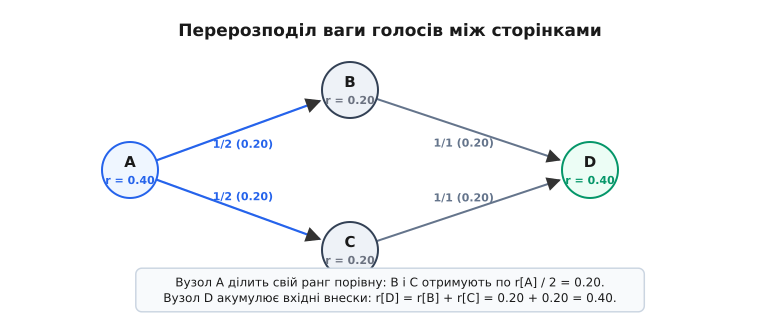
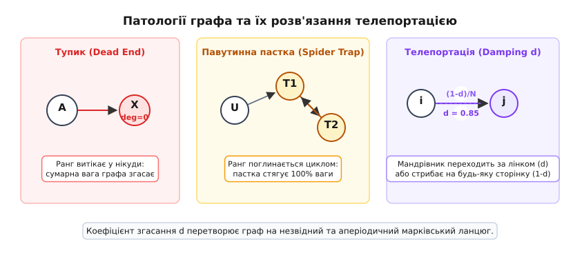
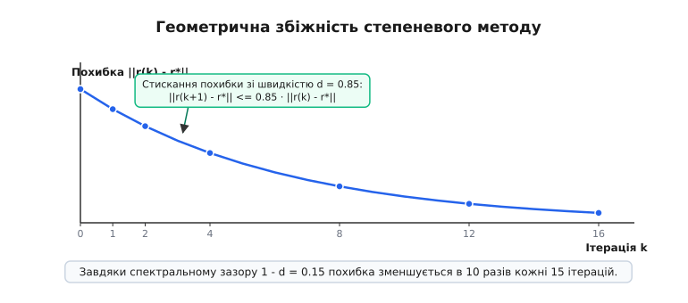

# Алгоритм ранжування графів PageRank

<preknowlist>
- [Представлення графів](book:algorithms/graph-representation) — матриця та списки суміжності для збереження зв'язків у пам'яті.
- [Власні вектори та власні значення](book:math/eigenvalues) — характеристичний розклад матриць, де лінійне перетворення масштабує вектор.
- [Ланцюги Маркова](book:math/markov-chain) — випадкові блукання дискретними станами та їхні стаціонарні розподіли ймовірностей.
</preknowlist>

Ранні пошукові системи інтернету сортували знайдені документи виключно за відповідністю тексту: що частіше пошукове слово повторювалося в заголовку чи тілі сторінки, то вище вона опинялася у видачі. Це призвело до швидкого колапсу якості: творці сайтів почали масово наповнювати сторінки невидимим повторюваним текстом (англ. *keyword stuffing*), виводячи на перші позиції сміттєві каталоги замість авторитетних джерел. Спроба рахувати звичайну кількість вхідних гіперпосилань (ступінь заходження вершини в графі) також провалилася: зловмисник міг за лічені хвилини згенерувати тисячу порожніх сайтів, які посилалися на його головну сторінку, штучно піднімаючи її лічильник.

Проблема полягала в тому, що простий підрахунок трактував усі посилання однаково: голос із випадкової беззмістовної вебсторінки мав таку саму вагу, як рекомендація з головного каталогу Стенфордського університету чи провідного наукового порталу. Щоб отримати стійке до маніпуляцій ранжування, знадобилася принципово нова концепція: **авторитетність сторінки визначається авторитетністю сторінок, які на неї посилаються**. Цю рекурсивну ідею втілив алгоритм PageRank (англ. *PageRank*, названий як за грою слів на честь автора Ларрі Пейджа, так і за позначенням вебсторінки англ. *web page*), перетворивши структуру гіперпосилань усього глобального інтернету на велетенську систему демократичного зваженого голосування.

Детальний історичний контекст виникнення алгоритму, передумови в бібліометрії та перебіг проєкту BackRub висвітлено в [історичному нарисі створення PageRank](book:algorithms/pagerank-algorithm/hist-pagerank-origins.md).

### Модель голосування та передача ваги

Уявімо інтернет як орієнтований граф (гр. *grapho* — креслю, пишу) `G = (V, E)`, де множина вершин `V` представляє вебсторінки, а орієнтовані ребра `(u, v) ∈ E` — гіперпосилання зі сторінки `u` на сторінку `v`. Загальна кількість сторінок у мережі дорівнює `N = |V|`.

Кожній сторінці `v` приписується невід'ємне дійсне число `r[v]` — її ранг (показник важливості або авторитету). Сума рангів усіх сторінок мережі нормується до одиниці:

```
∑ r[v] = 1    [v ∈ V: сумарний авторитет мережі сталий]
```

Гіперпосилання зі сторінки `u` на сторінку `v` розглядається як голос довіри, який `u` віддає за `v`. Якщо сторінка `u` має власний ранг `r[u]` і містить `L(u)` вихідних посилань (вихідний степінь вершини), вона не може помножити свій вплив, проголосувавши за сотню інших сторінок із повною силою. Її авторитет ділиться порівну між усіма адресатами: кожне вихідне посилання передає частку `r[u] / L(u)`.

Тоді підсумковий ранг сторінки `v` визначається як сума всіх часток авторитету, що надходять до неї від сторінок-донорів:

```
r[v] = ∑ (r[u] / L(u))    [сума за всіма u, для яких існує орієнтоване ребро u → v]
```


*Схема голосування: сторінка A з високим рангом 0.40 має два вихідні посилання, тому передає по 0.20 сторінкам B і C. Сторінки B і C віддають свій повний ранг вузлу D, акумулюючи в ньому сумарний авторитет 0.40.*

З наведеної формули виникає фундаментальна замкненість: щоб дізнатися ранг сторінки `v`, нам потрібні ранги всіх сторінок `u`, що посилаються на неї; але щоб дізнатися ранг кожної з них, нам потрібні ранги їхніх вхідних сусідів. Замість послідовного обчислення маємо систему з `N` лінійних рівнянь з `N` невідомими, у якій усі змінні взаємопов'язані.

> 🔧 **Навіщо це.** Розподіл власної ваги `r[u] / L(u)` запобігає створенню так званих ферм посилань: якщо спамер створить одну сторінку й розмістить на ній мільйон посилань на свої сайти, кожне з таких посилань передасть лише одну мільйонну частину від мізерного рангу спам-сторінки, що зводить ефективність атаки до нуля.

### Матрична форма та модель випадкового мандрівника

Запишемо систему рівнянь у матричному вигляді. Для графа з `N` вершин побудуємо матрицю переходів `M` розміру `N × N`. Її елемент у рядку `v` та стовпці `u` визначає частку ваги, яку сторінка `u` передає сторінці `v`:

```
M[v, u] = 1 / L(u),  якщо існує посилання u → v
M[v, u] = 0,         якщо посилання u → v відсутнє
```

Якщо сторінка `u` має хоча б одне вихідне посилання, сума елементів у її стовпці дорівнює одиниці: `∑_{v} M[v, u] = L(u) · (1 / L(u)) = 1`. Така матриця називається стохастичною (гр. *stochastikos* — здогадливий, випадковий) за стовпцями.

Об'єднаємо ранги всіх сторінок у вектор-стовпець `r = [r[1], r[2], ..., r[N]]ᵀ`. Тоді базове рівняння набуває компактного вигляду:

```
r = M · r
```

Це рівняння означає, що вектор рангів `r` є власним вектором матриці `M`, який відповідає власному значенню `λ = 1`.

У такої лінійної системи є наочна ймовірнісна інтерпретація — **модель випадкового мандрівника** (англ. *Random Surfer Model*). Уявімо користувача, який нескінченно блукає інтернетом:
1. Мандрівник перебуває на певній сторінці `u`.
2. Він вибирає одне з наявних на сторінці посилань із рівномірною ймовірністю `1 / L(u)` і переходить за ним на сторінку `v`.
3. Цей процес повторюється крок за кроком.

Цей процес утворює дискретний ланцюг Маркова, де множина станів — це вебсторінки, а ймовірності переходів задаються матрицею `M`. Якщо такий процес досягає статистичної рівноваги, то значення `r[v]` показує точну ймовірність того, що в довільний випадковий момент часу мандрівник опиниться саме на сторінці `v`. Сторінки, де мандрівник буває найчастіше, і є найважливішими вузлами графа.

### Патології реального графа: тупики та павутинні пастки

Ідеальна формула `r = M · r` бездоганно працює на сильно зв'язаних графах без крайових аномалій. Проте структура реального інтернету далека від математичного ідеалу. На ній наївна модель випадкового мандрівника стикається з двома руйнівними проблемами:

1. **Тупики / висячі вузли (англ. *dangling nodes* або *dead ends*):** це сторінки, які не мають жодного вихідного посилання (файли PDF, зображення, кінцеві статті без навігації). Для такої сторінки `L(u) = 0`, і відповідний стовпець матриці `M` складається з одних нулів. Коли мандрівник потрапляє на таку сторінку, йому нікуди йти далі — авторитет «витікає» з мережі. При ітераційному множенні `r⁽ᵏ⁺¹⁾ = M · r⁽ᵏ⁾` сумарна довжина вектора щокроку зменшується, і весь вектор рангів неминуче прямує до нульового вектора: `r → 0`.

2. **Павутинні пастки (англ. *spider traps*):** це підграфи або групи сторінок, які посилаються одна на одну, але не мають жодного вихідного посилання назовні (найпростіший випадок — сторінка, що посилається лише сама на себе). Мандрівник може зайти в таку пастку ззовні, але вибратися з неї за посиланнями неможливо. З кожним кроком авторитет мережі стікається в пастку й акумулюється в ній, доки всі сторінки за межами пастки не отримають ранг 0.


*Дві фундаментальні проблеми реального вебграфа: тупики викликають витікання сумарного рангу, а циклічні пастки повністю поглинають авторитет мережі. Введення телепортації гарантує вільний вихід із будь-якого вузла.*

### Коефіцієнт згасання та матриця Гугла

Щоб позбутися обох патологій, Ларрі Пейдж і Сергій Брін ввели механізм **випадкової телепортації** (англ. *random jump / teleportation*). Поведінку мандрівника модифікували:

- З імовірністю `d` (коефіцієнт згасання або демпфування, англ. *damping factor*) мандрівник переходить за одним із гіперпосилань поточної сторінки.
- З імовірністю `1 - d` мандрівнику набридає поточна гілка переходів, і він «телепортується» — відкриває абсолютно випадкову сторінку серед усіх `N` сторінок інтернету з рівною ймовірністю `1 / N`.
- Якщо ж мандрівник потрапляє у висячий вузол (де посилань немає зовсім), він телепортується на випадкову сторінку з імовірністю 1.

Типовим емпіричним значенням, обраним творцями алгоритму, є `d = 0.85`. Це означає, що користувач у середньому переходить підряд приблизно за 6 посиланнями (`1 / (1 - 0.85) ≈ 6.67`), після чого починає новий перегляд із довільної адреси.

Математично це перетворює вихідне рівняння на фінальну формулу PageRank для сторінки `v`:

```
r[v] = d · ∑ (r[u] / L(u)) + (1 - d) / N    [для всіх u, що посилаються на v]
```

Якщо в графі присутні висячі вузли `u` (де `L(u) = 0`), їхній ранг рівномірно розсіюється по всіх вершинах мережі:

```
r[v] = d · ∑ (r[u] / L(u)) + d · (S_dangling / N) + (1 - d) / N
```
де `S_dangling = ∑_{u: L(u)=0} r[u]` — сумарний ранг усіх тупикових сторінок на поточному кроці.

У матричному вигляді це відповідає заміні вихідної матриці переходів `M` на повністю зв'язану, строго додатну матрицю `G` (матрицю Гугла):

```
G = d · M̂ + ((1 - d) / N) · E
```
де `M̂` — матриця `M`, у якій нульові стовпці висячих вузлів замінено на `1 / N`, а `E` — матриця розміру `N × N`, заповнена одиницями.

Кожен елемент матриці `G` строго додатний: `G[i, j] ≥ (1 - d) / N > 0`. Це означає, що між будь-якими двома сторінками інтернету існує ненульова ймовірність переходу за один крок (хоча б через телепортацію).

### Математична коректність: теорема Перрона — Фробеніуса

Чому ми можемо бути впевнені, що розв'язок рівняння `r = G · r` взагалі існує, єдиний і не залежить від того, з яких початкових значень ми почнемо обчислення?

Відповідь дає класична [теорема Перрона — Фробеніуса для невід'ємних матриць](book:algorithms/pagerank-algorithm/math-perron-frobenius.md). Завдяки додаванню матриці телепортації матриця Гугла `G` набуває трьох ключових властивостей:

1. **Стохастичність за стовпцями:** сума елементів кожного стовпця строго дорівнює 1. Звідси випливає, що максимальне за модулем власне значення матриці дорівнює `λ₁ = 1`.
2. **Незвідність (англ. *irreducibility*):** оскільки всі елементи `G[i, j] > 0`, граф станів є сильно зв'язаним — з будь-якої вершини можна дістатися до будь-якої іншої за один крок.
3. **Аперіодичність (примітивність):** відсутні періодичні цикли, у яких блукання могло б зациклитися з фіксованим кроком.

Згідно з теоремою Перрона — Фробеніуса, така матриця має **єдиний** домінантний власний вектор `r*`, який відповідає власному значенню `λ₁ = 1`. Усі компоненти цього вектора строго додатні (`r*[i] > 0`), а їхня сума дорівнює 1. Усі інші власні значення матриці за модулем строго менші за коефіцієнт згасання:

```
|λ₂| ≤ d < 1
```

Різниця `1 - |λ₂| ≥ 1 - d = 0.15` називається спектральним зазором (англ. *spectral gap*). Саме вона гарантує, що будь-який ітераційний процес знаходження вектора `r*` збігається з експоненційною швидкістю.

### Степеневий метод обчислення

Безпосереднє розв'язання системи `(I - G) · r = 0` методом виключення Гауса вимагає часу `O(N³)` та пам'яті `O(N²)`. Для глобального графа інтернету з мільярдами сторінок (`N > 10¹⁰`) такий підхід неможливий фізично.

На практиці вектор рангів обчислюють **степеневим методом** (англ. *power iteration*):

1. **Ініціалізація:** задаємо початковий вектор рівномірного розподілу:
```
r⁽⁰⁾ = [1/N, 1/N, ..., 1/N]ᵀ
```

2. **Ітераційний крок:** послідовно множимо вектор на матрицю Гугла:
```
r⁽ᵏ⁺¹⁾ = G · r⁽ᵏ⁾
```

3. **Критерій зупинки:** процес повторюється, доки зміна вектора за L1-нормою не стане меншою за задану точність `ε` (наприклад, `ε = 10⁻⁷`):
```
∑ |r⁽ᵏ⁺¹⁾[i] - r⁽ᵏ⁾[i]| < ε
```


*Геометрична збіжність: на кожній ітерації норма похибки зменшується щонайменше в `d = 0.85` раза. Завдяки спектральному зазору 0.15 похибка зменшується на порядок кожні 15 ітерацій.*

Оскільки похибка на кроці `k` обмежена величиною `||r⁽ᵏ⁾ - r*|| ≤ dᵏ · ||r⁽⁰⁾ - r*||`, швидкість збіжності залежить виключно від `d`. При `d = 0.85` для досягнення високої точності достатньо всього 40–60 ітерацій незалежно від загальної кількості сторінок у графі.

### Обчислення на розріджених графах без збереження матриці `N × N`

Матриця `G` є щільною (у ній немає нульових елементів). Збереження в пам'яті таблиці розміром `10¹⁰ × 10¹⁰` чисел вимагало б сотень ексабайтів. Проте структуру множення можна розділити на розріджену частину вихідного графа та скалярну поправку:

```
r⁽ᵏ⁺¹⁾[v] = d · ( ∑_{u ∈ In(v)} (r⁽ᵏ⁾[u] / L(u)) ) + C⁽ᵏ⁾
```
де константа зсуву `C⁽ᵏ⁾` однакова для всіх вершин і обчислюється за один прохід:

```
S_dangling = ∑_{u: L(u)=0} r⁽ᵏ⁾[u]
C⁽ᵏ⁾ = (d · S_dangling + (1 - d)) / N
```

Завдяки цьому ми зберігаємо в пам'яті лише вихідні ребра графа (наприклад, у форматі списків суміжних вершин або CSR). Оскільки середня кількість посилань на вебсторінці становить від 10 до 50, кількість ненульових елементів дорівнює `|E| ≈ 50 · N`, що лінійно залежить від `N`.

Один ітераційний крок виконується за час `O(N + |E|)` і потребує лише пам'яті під збереження двох векторів довжиною `N` та списку ребер.

Повний програмний рушій із розрідженим представленням CSR, оптимізацією кешу та обробкою крайових випадків наведено у [вставці проєкту обчислювача PageRank](book:algorithms/pagerank-algorithm/proj-pagerank-engine.md).

### Порівняння з іншими мірами центральності графа

Щоб оцінити переваги PageRank, порівняємо його з класичними графовими метриками центральності (англ. *centrality measures*):

1. **Ступенева центральність (англ. *Degree Centrality*):**
   - *Принцип:* рахує кількість вхідних ребер `deg⁻(v)`.
   - *Складність:* `O(N + E)`.
   - *Вада:* повністю локальна; не розрізняє вагу донорів і легко фальсифікується генерацією спам-посилань.

2. **Центральність за близькістю (англ. *Closeness Centrality*):**
   - *Принцип:* обернена сума найкоротших відстаней від `v` до всіх інших вершин `∑_{u} dist(v, u)`.
   - *Складність:* `O(N · (N + E))` для невзважених графів (вимагає запуску BFS із кожної вершини).
   - *Вада:* обчислювально нездійсненна для мереж масштабу інтернету та некоректна на незв'язних графах (`dist = ∞`).

3. **Центральність за посередництвом (англ. *Betweenness Centrality*):**
   - *Принцип:* частка найкоротших шляхів між усіма парами вершин `(s, t)`, що проходять крізь вершину `v`.
   - *Складність:* `O(N · E)` за алгоритмом Брандеса.
   - *Вада:* надвисока обчислювальна вартість та чутливість до дрібних локальних змін топології.

4. **Центральність Каца (англ. *Katz Centrality*):**
   - *Принцип:* рахує всі шляхи довжиною `k`, згасаючи їх із вагою `αᵏ`: `r = α · Aᵀ · r + β · e`.
   - *Вада:* вершина з високим авторитетом передає свою повну вагу кожному зі своїх сусідів, не ділячи її на кількість вихідних посилань `L(u)`. Через це вузол із тисячами вихідних лінків стає джерелом необмеженої «емісії авторитету», що спотворює глобальний баланс мережі.

PageRank поєднує глобальний рекурсивний авторитет, збереження закону збереження ваги через ділення на `L(u)` та лінійну складність `O(N + E)` за ітерацію.

### Практичні розширення: персоналізація та боротьба зі спамом

Базовий PageRank обчислює універсальний статичний авторитет сторінок, але сучасні алгоритми ранжування розвинули цю ідею в кількох напрямках:

1. **Тематичний та персоналізований PageRank (англ. *Topic-Sensitive / Personalized PageRank*):**
Замість рівномірного вектора телепортації `[1/N, ..., 1/N]ᵀ` використовується вектор персональних уподобань `p = [p₁, p₂, ..., p_N]ᵀ`, де `∑ p_i = 1`. Якщо користувач цікавиться програмуванням, вага `p_i` зосереджується на сайтах технічної тематики. Тоді випадковий мандрівник телепортується не на випадкові сайти, а переважно в межах вибраної теми.

2. **TrustRank та боротьба з фермами посилань (англ. *Link Farms*):**
Для фільтрації спаму формується початкова множина сайтів, перевірених експертами вручну (університети, державні органи, авторитетні енциклопедії). Вектор телепортації на 100% зосереджується на цих надійних сайтах. Оскільки коефіцієнт згасання `d` зменшує передачу авторитету на кожному кроці, сайти, віддалені від надійного ядра на багато переходів, отримують експоненційно низький TrustRank.

3. **Розподілена архітектура обчислень (MapReduce та Pregel):**
Для графів із трильйонами ребер матрично-векторне множення виконується на розподілених кластерах: граф розбивається на смуги (англ. *Block-Stripe partition*), де кожен обчислювальний вузол обробляє свою підмножину цільових вершин `v`, отримуючи повідомлення з частками рангу від сусідніх серверів.

> 🔧 **Навіщо це.** Сьогодні PageRank рідко застосовується як єдиний фактор сортування пошукової видачі — пошукові системи враховують сотні сигналів (контекстні ембедінги нейромереж, поведінкові фактори, геопозицію). Проте PageRank залишається головним структурним фільтром первинного індексування: саме за його показником пошукові роботи вирішують, які мільярди сторінок сканувати щогодини, а які ігнорувати місяцями.
