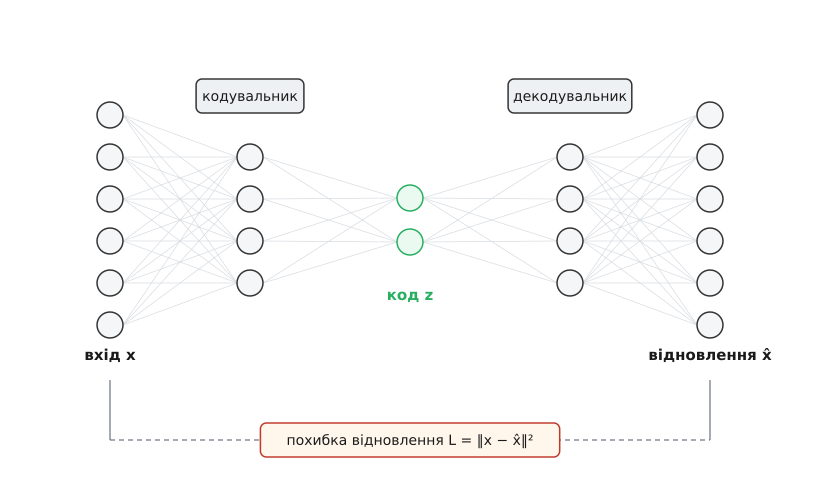
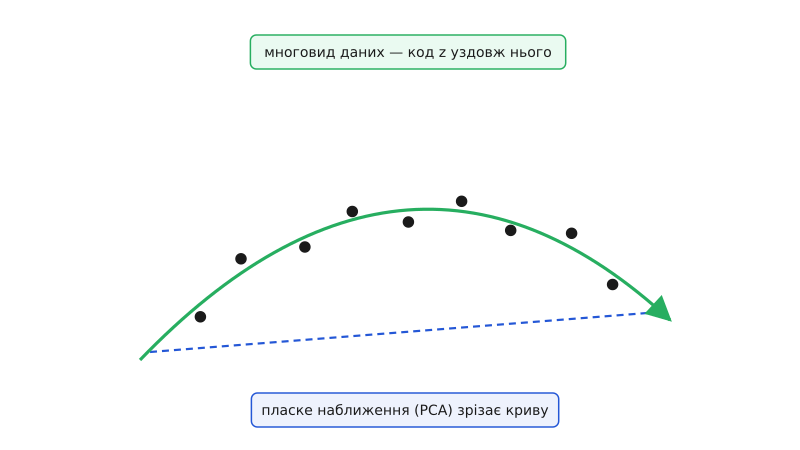

# Автокодер: навчити мережу копіювати саму себе — і цим змусити її зрозуміти дані

<preknowlist>
- [Нейрон і шар](book:algorithms/neuron-layer) — що обчислює один шар мережі: зважена сума входів плюс нелінійність.
- [Зворотне поширення помилки](book:algorithms/backpropagation) — як градієнт похибки протікає крізь мережу назад і підказує, куди рухати кожну вагу.
- [Градієнтний спуск](book:algorithms/gradient-descent) — крок за кроком зменшувати похибку, зсуваючи ваги проти градієнта.
- [Функції втрат](book:algorithms/loss-functions) — як одне число міряє розбіжність між виходом і ціллю; зокрема середньоквадратична похибка.
- [Навчання без учителя](book:algorithms/unsupervised-learning) — шукати структуру в даних, до яких ніхто не дав правильних відповідей.
</preknowlist>

Уяви задачу, безглуздішу за яку важко вигадати: навчи мережу видавати на виході рівно те, що подали на вхід. Подав вектор чисел — отримай ті самі числа. Подав фото — отримай те саме фото. Навіщо тримати для цього нейромережу, якщо копію дає простий провід?

Уся сіль — в одній умові, яку ми накладаємо на шлях від входу до виходу. Посередині ми ставимо **вузьке місце** (англ. *bottleneck* — «пляшкове горло»): шар, у якому чисел набагато менше, ніж на вході. Тепер копія «наскрізь» неможлива фізично: тисячу чисел не проштовхнути крізь десяток, нічого не втративши. Мережа мусить спершу **стиснути** тисячу входів до десяти, а потім із тих десяти **відновити** всю тисячу. І щойно ми вимагаємо, щоб відновлене збіглося з поданим, копіювання перестає бути дурницею. Щоб відбудувати ціле з десяти чисел, треба знати, **як це ціле влаштоване**. Оце і є автокодер (гр. *autós* — «сам» + англ. *encoder* — «кодувальник»): мережа, що кодує й розкодовує саму себе, а платою за успіх стає розуміння структури даних.

### Чому стиснення взагалі можливе — і чому воно дорівнює розумінню

Спершу треба зрозуміти, чому вузьке місце не вбиває задачу відразу. Здавалося б, стиснути тисячу довільних чисел до десяти без утрат неможливо — і це правда, **якщо числа довільні**. Але реальні дані ніколи не довільні. Пікселі сусідніх точок фото майже завжди близькі; на знімку обличчя ліве око передбачає праве; у таблиці зріст у сантиметрах жорстко зв'язаний зі зростом у дюймах. Дані **надлишкові**: у них повно повторів, залежностей, закономірностей — бо світ, що їх породив, сам не хаотичний.

Саме цей надлишок і дає простір для стиснення. Якщо десять ознак насправді крутяться довкола двох незалежних причин, то двох чисел досить, щоб описати всі десять, а решту вісім відновити за завченими зв'язками. Випадковий шум стиснути не можна — у ньому нема чого завчати; структуровані дані можна — рівно настільки, наскільки вони структуровані. Тому «пропхати дані крізь вузьке горло без втрат» і «знайти закономірності в даних» — це **одна й та сама задача**, сказана двома мовами. Автокодер розв'язує першу, а винагородою дістає розв'язок другої. Він близький родич звичайних [стискачів даних](book:algorithms/why-compress) — тільки правило стиснення не задане людиною, а **вивчене** з самих даних.

Найпростіші числа роблять це відчутним.

**Ту саму стиску 2→1 роблять або майже дарма, або катастрофічно — залежно від того, чи є в даних надлишок.** Стиснемо дві ознаки до одного числа `z` — середнього — і відновимо обидві як це `z`. Спершу візьмемо ознаки, що дублюють одна одну (той самий вимір, знятий двічі), потім — незалежні:

```
надлишкові дані (x2 ≈ x1):
  (10.0, 10.2) → z = 10.10 → (10.10, 10.10)   похибка² = 0.01 + 0.01 = 0.020
  (20.0, 19.8) → z = 19.90 → (19.90, 19.90)   похибка² = 0.01 + 0.01 = 0.020
  (30.0, 30.1) → z = 30.05 → (30.05, 30.05)   похибка² = 0.0025 + 0.0025 = 0.005
  середня похибка² ≈ 0.015          ← стиснули майже без втрат

незалежні дані (x2 не пов'язане з x1):
  (10.0, 90.0) → z = 50.00 → (50.00, 50.00)   похибка² = 1600 + 1600 = 3200
  (20.0, 15.0) → z = 17.50 → (17.50, 17.50)   похибка² = 6.25 + 6.25 = 12.5
  (30.0, 60.0) → z = 45.00 → (45.00, 45.00)   похибка² = 225 + 225 = 450
  середня похибка² ≈ 1221            ← стиснення все зруйнувало
```

*Одна й та сама операція «два числа в одне» майже безболісна там, де друга ознака повторює першу, і руйнівна там, де вона несе окрему інформацію. Вузьке місце дешеве рівно там, де в даних є надлишок; знайти цей надлишок — і є вся робота автокодера. Тут ми взяли грубе фіксоване стиснення (середнє); справжній автокодер сам добирає, що саме класти в код, щоб похибка була найменшою.*

### З чого автокодер складається

Тепер дамо частинам імена — і вони точно опишуть механізм. Автокодер — це дві мережі, зшиті вузьким місцем.

Перша, **кодувальник** (англ. *encoder*), бере вхід `x` (наприклад, тисячу чисел) і стискає його до короткого вектора `z` — це **код** (він же латентний вектор, від лат. *latens* — «прихований», бо лежить прихованим усередині мережі). Друга, **декодувальник** (англ. *decoder*), бере код `z` і розгортає його назад у `x̂` — **відновлення**, спробу відтворити початковий вхід тієї самої розмірності, що й `x`. Коротко весь шлях:

```
x  ──кодувальник──▶  z  ──декодувальник──▶  x̂
   (тисяча чисел)  (десять)   (знову тисяча)
```

Якість роботи міряють однією величиною — **похибкою відновлення**: наскільки `x̂` розійшлося з `x`. Найчастіше це середньоквадратична похибка, сума квадратів різниць по всіх координатах:

```
L = ‖x − x̂‖²  =  (x₁−x̂₁)² + (x₂−x̂₂)² + … + (xₙ−x̂ₙ)²
```

Мета навчання — зробити `L` якомога меншою на всіх прикладах даних. І тут криється те, що робить автокодер особливим серед мереж.


*Форма автокодера — пісочний годинник. Ліва половина (кодувальник) стискає широкий вхід до тонкого коду в центрі; права (декодувальник) розгортає код назад до повної ширини. Усе навчання тримається на одній дузі внизу: похибка між входом `x` і відновленням `x̂`. Вузьке горло посередині — не декорація, а причина, з якої мережа взагалі мусить щось вивчити.*

### Мітка — це сам вхід

Придивись, чого тут **нема**. У звичайному навчанні з учителем моделі дають пари «вхід → правильна відповідь»: фото і підпис «кіт», лист і мітку «спам». Хтось мусив ці відповіді проставити — а це довго й дорого. Автокодер такого не потребує зовсім. Його правильна відповідь для входу `x` — це **сам** `x`. Мета вже лежить у даних; підписувати нічого не треба. Тому автокодер належить до [навчання без учителя](book:algorithms/unsupervised-learning): сигнал для навчання він добуває з голих, непідписаних даних, яких завжди на порядки більше, ніж підписаних.

Саме навчання йде звично. Проганяємо `x` крізь кодувальник і декодувальник, дістаємо `x̂`, міряємо похибку `L`. Далі [зворотним поширенням](book:algorithms/backpropagation) рахуємо, як кожна вага в обох мережах вплинула на цю похибку, і [градієнтним спуском](book:algorithms/gradient-descent) трохи зсуваємо всі ваги в бік меншого `L`. Повторюємо на всьому наборі багато разів. Ніякої нової математики — уся хитрість не в тому, **як** учити, а в тому, **що поставили ціллю**: вимога відтворити власний вхід крізь вузьке горло.

Робочий автокодер із нуля — кодувальник, декодувальник, прямий і зворотний хід, тренувальний цикл — розібраний по кроках із оцінкою складності: [реалізація автокодера на C](book:algorithms/autoencoder/proj-autoencoder-c.md).

### Що насправді живе в коді: многовид

Після навчання код `z` — це стислий опис входу. Але який опис? Щоб відповісти, треба побачити, де насправді лежать реальні дані.

Візьмемо чорно-білі картинки 28×28 пікселів — точку в просторі з 784 координат. Простір величезний, та майже весь він порожній: якщо накидати 784 випадкові числа, вийде телевізійний «сніг», а не осмислена картинка. Осмислені зображення — скажімо, рукописні цифри — тісняться на тонесенькому викривленому клапті всередині цього простору. Клапоть тонкий, бо справжніх ступенів свободи в цифрі мало: нахил, товщина штриха, яка це цифра, скільки в ній завитка — жменя чисел, а не 784. Оцю тонку викривлену поверхню меншої вимірності, на якій купчаться дані, називають **многовидом** (нім. *Mannigfaltigkeit* — «розмаїття»; в українській математиці — «многовид»).

Тепер видно, що робить код. Кодувальник кладе на цей многовид **систему координат**: код `z` — це координати точки вздовж поверхні, а не в усьому просторі. Декодувальник — зворотна карта: з координат він відновлює повну точку в об'ємному просторі. Стиснення далося дешево не завдяки фокусу, а тому, що дані **від початку** були малорозмірні — купчились на тонкому многовиді. Автокодер лише знайшов його й розкреслив по ньому осі.


*Реальні дані (точки) не заповнюють простір, а тягнуться вздовж тонкої викривленої поверхні — многовида. Код автокодера — це координата вздовж цієї поверхні: одне число, що каже, де на дузі сидить точка. Пряма — найкраще, що може зробити лінійне стиснення: вона зрізає кути й місцями проходить далеко від даних, бо крива поверхня в пряму не вкладається. Здатність вигнути координату слідом за поверхнею — і є те, заради чого беруть мережу, а не пряму.*

### Лінійний випадок — це PCA, і саме тут криється сенс нелінійності

Що, як прибрати з кодувальника й декодувальника всі нелінійності — лишити чисте множення на матриці? Тоді автокодер зможе хіба спроєктувати дані на найкращу **пласку** підплощину — і це рівно те, що робить [метод головних компонент](book:algorithms/pca) (PCA): він знаходить напрямки найбільшого розкиду даних і відкидає решту. Що лінійний автокодер із середньоквадратичною похибкою збігається саме з PCA — не збіг, а доведений факт (П'єр Балді й Курт Горнік, 1989): оптимальний код лінійної мережі натягує ту саму головну підплощину, що й PCA. Виведення цієї рівності — [чому лінійний автокодер дає PCA](book:algorithms/autoencoder/math-linear-pca.md).

Але многовиди реальних даних **викривлені**, а не пласкі. Пряма підплощина, проведена крізь загнутий клапоть, або ріже порожнечу, або відстає від поверхні — як на малюнку вище. І щойно ми повертаємо в мережу [нелінійні активації](book:algorithms/activation-functions), кодувальник дістає змогу **вигинати** координатну сітку слідом за поверхнею. Автокодер стає, по суті, нелінійним PCA: він лягає на криву поверхню, якої жодна пласка підплощина не спіймає. Ось точна відповідь на питання «навіщо тут мережа, а не проста PCA»: бо поверхні, на яких живе реальний світ, — криві.

### Пастка тотожності, або чому вузьке місце таке важливе

Повернімось до вузького горла й спитаймо: а що, як його **не** робити вузьким? Хай код буде такий самий завширшки, як вхід, або й ширший (англ. *overcomplete* — «надповний»). Іноді ширший код бажаний — більше ознак, а не менше.

Тут мережа знаходить ганебну лазівку. Якщо коду вистачає місця, найлегший спосіб мінімізувати похибку — вивчити **тотожність**: просто скопіювати кожну координату входу в код, а звідти — у вихід. Похибка нульова, відновлення ідеальне — і мережа не навчилась **нічого**. Уся цінність автокодера трималася на тому, що вузьке місце **не давало** так змахлювати: стиснення було примусом, який робив копіювання змістовним. Прибрали примус — копіювання знову стало пустим фокусом.


*Дві крайнощі. Ліворуч: коли код широкий, мережа може змахлювати — пропустити вхід прямо у вихід (тотожність) і дістати нульову похибку, нічого не вивчивши. Праворуч: знешумлювальний автокодер відбирає лазівку — вхід псують шумом, а вимагають відтворити **чистий** оригінал; скопіювати зіпсоване тепер марно, тож мережа мусить зрозуміти, який вигляд мають неушкоджені дані.*

Але ширший код буває корисним — як же втримати мережу чесною без вузького горла? Перенести тиск деінде — **зарегуляризувати** (додати обмеження, що робить тотожність невигідною). Так виростає ціла родина автокодерів, і кожен забороняє мережі лінуватися по-своєму:

- **Знешумлювальний** (англ. *denoising*): вхід навмисне псують — домішують шум, гасять частину пікселів, — а відтворити просять **чистий** оригінал. Тепер скопіювати вхід — значить відтворити й псування, тобто програти. Щоб дописати знищене, мережа мусить знати, як виглядають неушкоджені дані: які пікселі випливають з інших. Псування вбиває тотожність, а вимога його прибрати змушує вчити структуру.
- **Розріджений** (англ. *sparse*): коду дають бути широким, але штрафують за те, **скільки** його координат «горить» одночасно — женуть майже всі до нуля на кожному прикладі. Код широкий, а насправді активних чисел мало, тож кожен вхід усе одно описаний жменею величин — м'яке вузьке місце, своє для кожного прикладу. Цей штраф — типовий приклад [регуляризації](book:algorithms/regularization).
- **Стискальний** (англ. *contractive*): штрафують за чутливість коду до дрібних змін входу, щоб код ворушився лише вздовж многовида й не зважав на тремтіння впоперек нього.

Спільна нитка одна: щось мусить зробити ідеальну копію недосяжною, інакше автокодер не вивчить нічого. Вузьке місце — найпростіший такий тиск; регуляризація — загальніший.

### Навіщо це все на практиці

Стисла картина застосувань показує, чому автокодер узагалі тримають в інструментарії.

**Зниження вимірності й ознаки.** Код — це готове компактне подання. Замість тисячі сирих чисел у наступну модель (класифікатор, пошук) подають десять чисел коду, зберігши суть і викинувши надлишок.

**Знешумлення й відновлення.** Декодувальник видає чисті дані із зіпсованого входу — на цьому тримається відбілювання зашумлених зображень, звуку, показів давачів.

> 🔧 **Навіщо це — виявлення аномалій.** Найпрактичніше застосування виростає з того, що автокодер добре відновлює лише те, на чому вчився. Навчи його **тільки на нормальних** даних — справних деталях, чесних транзакціях, здоровому гулі двигуна. Нормальний приклад він відтворить точно (мала похибка), а от аномалію, якої ніколи не бачив, відбудувати не зможе — похибка підскочить. Похибка відновлення стає **оцінкою дивності**: перевищила поріг — б'ємо на сполох. Так ловлять шахрайські платежі, браковані вироби на конвеєрі, збої давачів — не описуючи наперед, який вигляд має несправність, а лише знаючи, який вигляд має норма.

**Попереднє навчання (історичний слід).** Колись, коли глибокі мережі не піддавалися навчанню з нуля, автокодери складали стосом, щоб гарно **ініціалізувати** ваги перед донавчанням на підписаних даних. Саме глибокі автокодери 2006 року знову розбудили цілу галузь. Сьогодні цей прийом здебільшого витіснений кращими способами, але свою роль в історії він зіграв — як саме, розказано в нарисі [звідки взявся автокодер](book:algorithms/autoencoder/hist-birth.md).

### Де автокодер спотикається

Чесно знати межі методу важливіше, ніж його вихваляти.

**Середньоквадратична похибка розмиває.** Коли мережа вагається між двома різкими, але несумісними варіантами відновлення, квадратичну похибку найкраще зменшує їхнє **середнє** — а середнє двох різких картинок є розмазаною. Тому відновлення складних даних під таку похибку виходять м'якими, наче не в фокусі.

**Код не впорядкований для породження нового.** Спокусливо взяти випадковий код і розкодувати його, щоб отримати нові, небачені дані. Але простий автокодер гарантує добре відновлення **лише** для тих кодів, що прийшли зі справжніх входів; він ніколи не обмежував, який вигляд має простір кодів **між** цими точками. Тицьни в порожнечу між ними — і декодувальник видасть безлад. У латентному просторі зяють діри. Полагодити це — змусити коди рівномірно заповнити гладкий, придатний до вибірки розподіл — і є задача [варіаційного автокодера](book:algorithms/variational-autoencoder), який добудовує над автокодером імовірнісний шар і перетворює його на справжній породжувач.

**Код не зобов'язаний бути осмисленим.** Похибка відновлення дбає лише про те, щоб `x̂ ≈ x`; вона не вимагає, щоб координати коду відповідали зрозумілим людині чинникам — нахилу, розміру, кольору. Найчастіше вони переплутані між собою, і читати код як осмислені ознаки просто так не вийде.

### Одна ідея, ціла родина

Усе тримається на одному русі: змусь мережу відтворити власний вхід — і перетвориш туманне «вивчи структуру даних» на чітке «зменши похибку відновлення», яке градієнтний спуск уже вміє розв'язувати. Але сам по собі цей рух порожній — його наповнює **обмеження**, що ти накладаєш на копіювання. Звузив код — і мережа мусить стискати, вчиться надлишку. Зіпсував вхід — і вона вчиться відрізняти сигнал від шуму. Загнав коди в гладкий розподіл — і дістаєш породжувач нового. Автокодер — не один алгоритм, а сімейство, і в цьому сімействі кожен член заданий однією відповіддю: **що саме ти забороняєш мережі скопіювати навпростець**.
