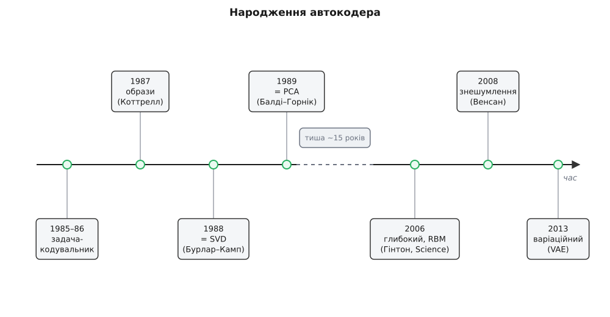

# 📜 Звідки взявся автокодер

Це розповідь про те, як мережу, що копіює саму себе, спершу тримали за навчальну іграшку, потім за математичну курйозність, а зрештою вона підпалила ціле відродження глибокого навчання. Ідея не впала готовою: вона визрівала майже тридцять років, і на кожному повороті хтось питав одне й те саме — а що, власне, коїться всередині вузького горла?


*Часова смуга від задачі-кодувальника (1985–86) до варіаційного автокодера (2013). Розрив посередині невипадковий: після теорії 1988–89 років автокодер майже на півтора десятиліття завмер, поки розігрів через машини Больцмана 2006-го не зробив його глибокі версії тренованими.*

### Спершу була задача-кодувальник

Автокодер народився не як зухвалий задум, а як **перевірка**. У середині 1980-х, коли [зворотне поширення помилки](book:algorithms/backpropagation) щойно навчилося тренувати багатошарові мережі, треба було переконливо показати, що воно знаходить корисні внутрішні подання, а не просто зазубрює відповіді. Для цього вигадали «задачу-кодувальник» (англ. *encoder problem*):

```
4 входи → 2 нейрони → 4 виходи,   ціль = вхід
щоб проштовхнути 4 сигнали крізь 2 нейрони й відтворити їх,
мережа мусить винайти 2-бітний код: 00 01 10 11 — по коду на вхід
```

Крихітна мережа 4–2–4 мусила пропустити чотири розрізнені сигнали крізь двійко нейронів і відтворити їх без утрат — а це можливо лише тоді, коли вона сама винайде для них компактний код. Ця дрібничка вже містила все, чим є автокодер: вхід дорівнює цілі, посередині — вузьке горло, а тиск стиснення робить копіювання змістовним. Така задача-кодувальник слугувала показовим прикладом у працях із машин Больцмана (Ackley, Hinton, Sejnowski, 1985) та в демонстраціях зворотного поширення (Rumelhart, Hinton, Williams, 1986) — задокументовані публікації тих років. Джефрі Гінтон (Geoffrey Hinton, британо-канадець) з'являється тут не востаннє: саме він через двадцять років витягне автокодер із забуття.

### Перші справжні дані: образи, потім мовлення

Іграшку швидко нацькували на реальність. Гаррісон Коттрелл, Пол Манро й Девід Зіпсер (Garrison Cottrell, Paul Munro, David Zipser) у Каліфорнійському університеті в Сан-Дієго 1987 року пропустили **зображення** крізь вузький шар і відновили їх — прихований код спрацював як навчений стискач образів. Наступного року Джефрі Елман і той самий Зіпсер (Jeffrey Elman, David Zipser, 1988) повторили дослід із **мовленням**, і вузьке горло виловило структуру звуків мови. Обидві роботи — задокументовані. Те, що на 4–2–4 скидалося на трюк, на справжніх сигналах виявилося способом видобути стислу суть даних геть без міток.

### Що насправді рахує вузьке горло

Практики мали робочу річ — а теоретики спитали, що вона обчислює. Відповіли дві споріднені праці 1988–89 років, і саме вони перевели автокодер із розряду вдалого трюку в розряд зрозумілого явища.

Ерве Бурлар і Ів Камп (Hervé Bourlard, Yves Kamp — бельгійці, дослідна лабораторія Philips у Брюсселі) 1988 року в журналі *Biological Cybernetics* довели: якщо кодувальник і декодувальник лінійні, а похибку міряють середньоквадратично, то найкраще досяжне відновлення дає **сингулярний розклад** матриці даних (англ. *SVD*) — та сама лінійна алгебра, що стоїть за проєкцією на головні напрямки. Рік по тому П'єр Балді й Курт Горнік (Pierre Baldi — італо-американець, народжений у Римі; Kurt Hornik — австрієць із Відня; 1989) додали погляд із боку оптимізації: у лінійного автокодера з квадратичною похибкою **немає підступних локальних мінімів** — усі критичні точки, крім єдиного глобального оптимуму, є сідлами, а сам оптимум натягує ту саму підплощину, що й [метод головних компонент](book:algorithms/pca) (PCA).

Висновок був гострий: лінійний автокодер — це PCA, переказаний мовою мереж. Отже, весь власний сенс мережі ховається в **нелінійності**, бо пласка версія нічого нового над давнім методом не дає. Думку «поверни нелінійні активації — і дістанеш нелінійний PCA» викристалізував Марк Крамер (Mark Kramer, 1991) п'ятишаровою автоасоціативною мережею; а корінь усієї лінії «нейрон — це головна компонента» сягає ще правила Еркі Ої (Erkki Oja, фін, 1982).

### Довга зима й пробудження 2006 року

Теорія була, дрібні мережі працювали — а глибокі автокодери вперто не вчилися. Скласти багато шарів і натренувати з нуля не вдавалося: похибка, протікаючи назад крізь десяток шарів, множилася на малі числа й [згасала](book:algorithms/vanishing-gradient), тож найглибші шари майже не рухалися. Мало не п'ятнадцять років автокодер пролежав цікавинкою без вагомого практичного зиску.

Пробудження настало 2006 року. Джефрі Гінтон і його аспірант Руслан Салахутдінов (Ruslan Salakhutdinov — народжений у Ташкенті, татарського походження) надрукували в *Science* статтю «Reducing the Dimensionality of Data with Neural Networks» (том 313, с. 504–507). Хитрість була не в новій формі мережі, а в **розігріві**: перш ніж тренувати глибокий автокодер цілком, кожну пару сусідніх шарів попередньо навчали окремо як [обмежену машину Больцмана](book:algorithms/restricted-boltzmann-machine) (англ. *RBM*) — двошарову стохастичну мережу, що вчиться розподілу власних входів. Стос таких RBM давав добрі початкові ваги, а вже з них зворотне поширення дотреновувало всю глибоку мережу. Сенс розігріву був простий: замість стартувати з випадкових ваг, де градієнт одразу губиться, мережа починала вже з осмисленого місця, звідки донавчанню лишалося тільки навести лад. Результат промовляв сам за себе: глибокий автокодер стискав дані відчутно краще за PCA.

Струс вийшов далеко за межі автокодерів. Ця стаття — поряд із тогорічною працею Гінтона, Осіндеро й Те (Osindero, Teh) про глибокі мережі переконань — показала, що глибокі мережі **взагалі піддаються** навчанню, якщо з розумом їх ініціалізувати. Саме її широко вважають однією з іскор, від яких зайнялося сучасне глибоке навчання. (Згодом кращі активації, більші набори даних і швидкі відеокарти зробили сам трюк із RBM зайвим — але свою історичну роль розігрів через автокодери відіграв сповна.)

### Родина розростається

Щойно глибокі автокодери запрацювали, одна ідея розгалузилася в цілу родину, і кожен її член забороняв мережі свою лазівку.

2008 року Паскаль Венсан, Гюго Лярошель, Йошуа Бенжіо й П'єр-Антуан Мандзаголь (Pascal Vincent, Hugo Larochelle, Yoshua Bengio, Pierre-Antoine Manzagol — монреальська школа) представили **знешумлювальний автокодер** (ICML 2008): вхід навмисне псують шумом, а відтворити просять чистий оригінал. Скопіювати вхід наскрізь тепер марно — щоб прибрати шум, мережа змушена завчити, який вигляд мають неушкоджені дані.

А 2013 року Дідерік Кінгма й Макс Веллінг (Diederik Kingma, Max Welling — нідерландці, Амстердамський університет) зробили крок, що вивів автокодер за межі самого стиснення. У праці «Auto-Encoding Variational Bayes» (arXiv, грудень 2013) вони надбудували над ним імовірнісний шар — [варіаційний автокодер](book:algorithms/variational-autoencoder). Тепер коди примушені рівно заповнити гладкий розподіл, з якого можна **тягнути навмання** й розкодовувати випадкову точку в новий, небачений зразок. Мережа, що народилася копіювати наявне, навчилася породжувати те, чого не було.
