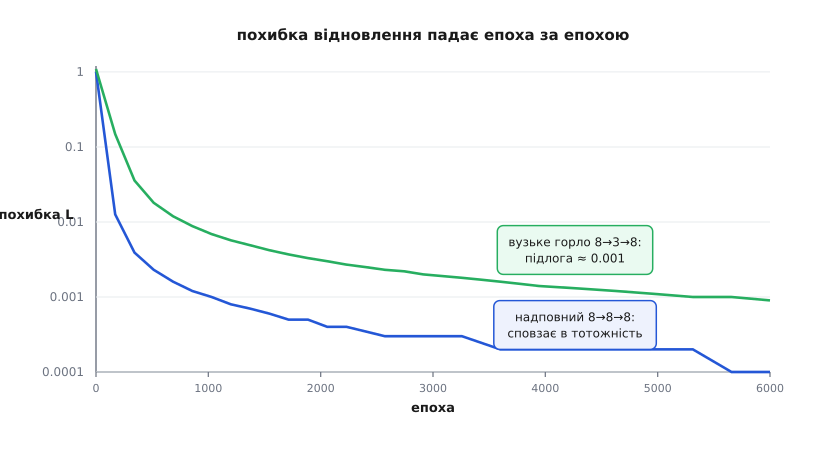

# ⚙️ Автокодер на C з нуля: кодер, декодер і зворотне поширення вручну

Зберемо робочий автокодер у чистому C — без бібліотек, без фреймворку, самими масивами й трьома вкладеними циклами — і побачимо, як вузьке горло з трьох чисел саме, ніхто не підказував, винаходить двійковий код для восьми шаблонів. Уся мета цієї збірки — щоб під «навчанням» не лишилося магії: там усього дві матриці, ланцюгове правило й крок проти градієнта.

Візьмемо класичну навчальну задачу-кодувальник **8→3→8**. На вході — вісім однобітних шаблонів (англ. *one-hot*): у кожному рівно одна одиниця, решта нулі, тобто просто рядки одиничної матриці 8×8. Посередині — код усього з трьох чисел. Мережа мусить кожен із восьми входів стиснути до трьох чисел і з них відновити назад усі вісім. Три числа, вісім шаблонів: 2³ = 8 — рівно стільки двійкових кодів довжини 3, скільки в нас шаблонів. Питання, на яке відповість код, поставлене самою задачею: чи знайде спуск це двійкове кодування сам?

![Схема мережі 8→3→8: зліва стовпчик із восьми вхідних вузлів x[8], у центрі тонкий стовпчик коду z[3] зеленим, справа вісім вузлів відновлення x̂[8]; на ребрах підписані ваги W1 розміру 3×8 і W2 розміру 8×3](img/arch-838.svg)
*Уся мережа — дві матриці. Кодувальник `W1` (3×8) тисне вісім входів до трьох чисел коду; декодувальник `W2` (8×3) розгортає три числа назад у вісім. Плюс два вектори зсувів. Разом 59 параметрів — оце й весь автокодер.*

### Ідея: дві матриці, сигмоїда і половина суми квадратів

Кожен шар робить одне: множить вхід на матрицю ваг, додає зсув і пропускає крізь [нелінійну функцію](topic:algorithms/activation-functions). Візьмемо сигмоїду `σ(t) = 1/(1+e⁻ᵗ)` — вона тисне будь-яке число в проміжок (0, 1). Для наших цілей це зручно двічі: вхідні шаблони самі складаються з нулів і одиниць, тож вихід у (0, 1) природно на них лягає, а похідна сигмоїди пишеться через саме її значення: `σ′ = σ·(1−σ)`. Прямий хід на одному прикладі `x`:

```
z  = σ(W1·x + b1)      # код: 3 числа
x̂ = σ(W2·z + b2)      # відновлення: знову 8 чисел
```

Якість одного відновлення міряємо половиною суми квадратів відхилень:

```
L = ½·‖x̂ − x‖²  =  ½·[(x̂₁−x₁)² + … + (x̂₈−x₈)²]
```

Множник `½` — не косметика. Диференціюючи квадрат, ми витягнемо двійку; `½` її скоротить, і сигнал похибки на виході вийде чистий — просто `(x̂ − x)`, без зайвого коефіцієнта. На суть це не впливає: сталий множник перед `L` лише перемасштабовує темп навчання. Мета навчання одна — зробити `L` найменшою в середньому по всіх восьми шаблонах.

### Ваги, ініціалізація, прямий хід

Оголосимо пам'ять і напишемо перші три частини. Це початок файла — усе далі дописується під ним.

```c
#include <stdio.h>
#include <stdlib.h>
#include <math.h>

#define N  8            /* розмір входу й виходу       */
#define H  3            /* розмір коду — вузьке горло  */
#define EPOCHS 6000
#define LR   1.0        /* темп навчання               */

static double W1[H][N], b1[H];   /* кодувальник:   x[8] -> z[3] */
static double W2[N][H], b2[N];   /* декодувальник: z[3] -> x̂[8] */

static double sigmoid(double t) { return 1.0 / (1.0 + exp(-t)); }

/* рівномірний шум у [-0.5, 0.5) — дрібна випадкова ініціалізація */
static double frand(void) { return (double)rand() / RAND_MAX - 0.5; }

static void init_weights(void)
{
    for (int j = 0; j < H; j++) {
        for (int k = 0; k < N; k++) W1[j][k] = 0.6 * frand();
        b1[j] = 0.0;
    }
    for (int i = 0; i < N; i++) {
        for (int j = 0; j < H; j++) W2[i][j] = 0.6 * frand();
        b2[i] = 0.0;
    }
}
```

Ваги стартують **дрібними й випадковими** — не нулями. Чому саме так, стане видно наприкінці; поки прийми на віру, що симетрію треба розбити з першого кроку.

### Зворотний хід: ланцюгове правило — це та сама матриця, тільки транспонована

Ось серце автокодера. Похибку `L` треба «протягнути» назад крізь обидва шари й дізнатися, як кожна вага на неї вплинула. Це [зворотне поширення](topic:algorithms/backpropagation) — механічне застосування ланцюгового правила шар за шаром. Виведемо всі чотири градієнти на пальцях.

На **виході** похибка залежить від `x̂`, а `x̂` — від входу сигмоїди `o = W2·z + b2`. Дві ланки ланцюга:

```
dL/dx̂ᵢ = (x̂ᵢ − xᵢ)                    # похідна ½-квадрата
dL/doᵢ = (x̂ᵢ − xᵢ)·x̂ᵢ·(1 − x̂ᵢ)      # ×σ′(o), а σ′ = x̂·(1−x̂)
```

Позначимо цей вихідний сигнал `d_o`. Градієнт по вагах декодера — це `d_o`, помножений на те, що входило у вагу, тобто на код `z`; градієнт по зсуву — сам `d_o`:

```
dL/dW2ᵢⱼ = d_oᵢ · zⱼ            dL/db2ᵢ = d_oᵢ
```

Тепер **проштовхуємо сигнал у код**. Кожне `zⱼ` живило всі вісім виходів через стовпчик `W2`, тож його частка провини — сума по всіх виходах. Це та сама матриця `W2`, тільки пройдена в інший бік (транспонована). Далі — крізь сигмоїду коду, помноживши на її похідну `z·(1−z)`:

```
dL/dzⱼ = Σᵢ d_oᵢ · W2ᵢⱼ                  # зібрати з усіх виходів
d_aⱼ  = dL/dzⱼ · zⱼ·(1 − zⱼ)            # крізь σ′ коду
```

І градієнти кодера — за тим самим правилом «сигнал × вхід ваги», де вхід тепер сам `x`:

```
dL/dW1ⱼₖ = d_aⱼ · xₖ            dL/db1ⱼ = d_aⱼ
```

Помітив візерунок? Прямий хід — множення на матрицю, зворотний — множення на **ту саму** матрицю навпаки. Уся глибока мережа — це чергування двох цих рухів. У коді все зливається в одну функцію: прямий хід, похибка, зворотний хід і одразу [крок градієнтного спуску](topic:algorithms/gradient-descent) — зсунути кожну вагу на `LR` проти її градієнта.

```c
/* один приклад: прямий хід, похибка, зворотний хід, крок спуску.
   Повертає ½‖x̂−x‖² для цього прикладу.                          */
static double train_one(const double *x)
{
    /* ---- прямий хід ---- */
    double z[H];
    for (int j = 0; j < H; j++) {
        double s = b1[j];
        for (int k = 0; k < N; k++) s += W1[j][k] * x[k];
        z[j] = sigmoid(s);                       /* код */
    }
    double xhat[N];
    for (int i = 0; i < N; i++) {
        double s = b2[i];
        for (int j = 0; j < H; j++) s += W2[i][j] * z[j];
        xhat[i] = sigmoid(s);                    /* відновлення */
    }

    /* ---- похибка й сигнал на виході ---- */
    double L = 0.0, d_o[N];
    for (int i = 0; i < N; i++) {
        double e = xhat[i] - x[i];
        L += 0.5 * e * e;
        d_o[i] = e * xhat[i] * (1.0 - xhat[i]);  /* dL/d(вхід сигмоїди) */
    }

    /* ---- зворотний хід: сигнал на коді (СПЕРШУ, поки W2 старе) ---- */
    double d_a[H];
    for (int j = 0; j < H; j++) {
        double g = 0.0;
        for (int i = 0; i < N; i++) g += d_o[i] * W2[i][j];
        d_a[j] = g * z[j] * (1.0 - z[j]);        /* крізь σ′ коду */
    }

    /* ---- крок спуску: тепер можна псувати ваги ---- */
    for (int i = 0; i < N; i++) {
        for (int j = 0; j < H; j++) W2[i][j] -= LR * d_o[i] * z[j];
        b2[i] -= LR * d_o[i];
    }
    for (int j = 0; j < H; j++) {
        for (int k = 0; k < N; k++) W1[j][k] -= LR * d_a[j] * x[k];
        b1[j] -= LR * d_a[j];
    }
    return L;
}
```

> 🔧 **Навіщо це — порядок дій.** Сигнал у коді `d_a` рахуємо **до** того, як чіпаємо `W2`: він спирається на ті самі ваги, крізь які щойно йшов прямий хід. Оновиш `W2` раніше — і зворотний хід протягне похибку крізь уже спотворену матрицю, градієнт кодера вийде неправильний, а помилку не спіймаєш: мережа просто вчитиметься гірше без жодного повідомлення. Тому спершу всі градієнти, і лише потім усі оновлення.

### Тренування: похибка падає, а код стає двійковим

Лишилось завести дані й прокрутити цикл. Однобітні шаблони — це рядки одиничної матриці; ціль для входу `x` — сам `x`.

```c
int main(void)
{
    double X[N][N];                              /* 8 one-hot шаблонів */
    for (int s = 0; s < N; s++)
        for (int k = 0; k < N; k++)
            X[s][k] = (k == s) ? 1.0 : 0.0;

    srand(1);
    init_weights();

    for (int epoch = 0; epoch < EPOCHS; epoch++) {
        double total = 0.0;
        for (int s = 0; s < N; s++) total += train_one(X[s]);
        if (epoch % 1000 == 0 || epoch == EPOCHS - 1)
            printf("епоха %4d   середня похибка = %.4f\n", epoch, total / N);
    }

    puts("\nшаблон -> код z[3]");               /* що вивчив код */
    for (int s = 0; s < N; s++) {
        double z[H];
        for (int j = 0; j < H; j++) {
            double a = b1[j];
            for (int k = 0; k < N; k++) a += W1[j][k] * X[s][k];
            z[j] = sigmoid(a);
        }
        printf("  %d:  %.2f %.2f %.2f   ~  %d%d%d\n", s, z[0], z[1], z[2],
               (int)(z[0] + 0.5), (int)(z[1] + 0.5), (int)(z[2] + 0.5));
    }
    return 0;
}
```

Три частини разом — це весь файл; збирається як `cc ae.c -lm -o ae`. Похибка падає монотонно (конкретні числа залежать від випадкового зерна):

```
епоха    0   середня похибка = 0.7552
епоха 1000   середня похибка = 0.0084
епоха 2000   середня похибка = 0.0034
епоха 3000   середня похибка = 0.0021
епоха 4000   середня похибка = 0.0015
епоха 5000   середня похибка = 0.0012
епоха 5999   середня похибка = 0.0010
```


*Похибка відновлення падає епоха за епохою. Зелена — наше вузьке горло 8→3→8: воно виходить на підлогу близько 0.001, бо три числа не вміщають вісім шаблонів ідеально. Синя — надповний код 8→8→8 тієї самої мережі: він сповзає далі, до нуля, бо може просто пропустити вхід наскрізь. Ця різниця — уся суть вузького місця.*

А тепер винагорода. Роздрук коду показує, що зробили три числа (яка комбінація дістанеться якому шаблону — залежить від зерна, але картина щоразу така):

```
шаблон -> код z[3]
  0:  0.00 0.21 0.02   ~  000
  1:  0.98 0.01 0.94   ~  101
  2:  0.97 0.99 0.99   ~  111
  3:  0.65 0.00 0.01   ~  100
  4:  1.00 0.75 0.03   ~  110
  5:  0.01 0.97 0.88   ~  011
  6:  0.04 0.02 0.97   ~  001
  7:  0.29 0.99 0.01   ~  010
```

Значення позлипались до країв 0 і 1, а вісім шаблонів дістали вісім **різних** трибітних кодів — усі комбінації від `000` до `111`. Ніхто не задавав двійкового кодування; спуск знайшов його сам, бо це найощадніший спосіб розрізнити вісім речей трьома числами. Оце й означає «вузьке горло змушує зрозуміти дані»: примус стиснути обернувся на винайдений код.

### Складність

Порахуймо роботу на один приклад. Прямий хід — це `H·N` множень у кодері плюс `N·H` у декодері. Зворотний хід симетричний: зібрати сигнал коду коштує ще `N·H`, оновити обидві матриці — знову по `N·H`. Усі доданки одного порядку, тож на приклад — **O(N·H)**, рівно стільки, скільки в мережі ваг. Далі просто:

```
на приклад:  O(N·H)
на епоху:    O(S·N·H)          S — кількість прикладів
усього:      O(E·S·N·H)        E — кількість епох
```

Для нашого прогону це `6000·8·8·3 ≈ 1.2` мільйона множень-додавань — мілісекунди. Пам'ять — `O(N·H)` на ваги плюс `O(N)` на активації одного прикладу. Узагальнення на глибоку мережу пряме: робота на приклад дорівнює **числу ваг** `P` (кожна вага бере участь раз у прямому й раз у зворотному ході), тож усього — `O(E·S·P)`, а пам'ять на ваги — `O(P)`. Автокодер не дорожчий за звичайну мережу тієї самої ваги.

### Три пастки, на яких усе ламається

**Темп навчання.** `LR` — довжина кроку проти градієнта, і вона крихка з обох боків. Замалий (скажімо, 0.05) — і за ті самі 6000 епох мережа дочалапає лише до похибки ~0.08 замість 0.001. Завеликий (від ~30 на цій задачі) — крок щоразу перестрибує мінімум, ваги смикаються туди-сюди, і похибка застрягає високо, коло 0.3, так і не осівши. З необмеженим лінійним виходом усе було б ще різкіше: завеликий крок роздуває ваги, і `L` за пару епох злітає в нескінченність (NaN). Сигмоїда обмежує вихід і рятує від вибуху, але не від тупцювання. Робочий `LR` для цієї задачі — коло одиниці.

**Ініціалізація ваг.** Оце найпідступніше. Постав усі ваги в нуль — і мережа застрягне на похибці ~0.32, ніколи не діставшись 0.001. Причина в симетрії: якщо всі три нейрони коду стартують однаково, вони й отримують однаковий градієнт щокроку, а отже, лишаються однаковими **назавжди**. Три однакові біти розрізняють щонайбільше дві речі, а не вісім. Симетрію мусить розбити випадковий старт — тому в `init_weights` ваги дрібні, але випадкові. Дрібні — щоб не заганяти сигмоїду в насичення, де `σ′ ≈ 0` і градієнт гасне; випадкові — щоб нейрони роз'їхалися. Це окремий сюжет [ініціалізації ваг](topic:algorithms/weight-initialization), і навіть на 59 параметрах він вирішує все.

**Надповний код — пастка тотожності.** Постав `H = 8` замість 3 (`#define H 8`) і перезбери. Похибка провалиться нижче за вузьке горло — до 0.0001, синя крива на малюнку вище. Тріумф? Ні: код завширшки як вхід дозволяє мережі просто **скопіювати** вхід крізь себе й нічого не вивчити. Ідеальне відновлення, нульове розуміння. Уся цінність трималася на тому, що трьом числам бракувало місця на копію — і вони мусили шукати структуру. Прибрав вузьке горло — прибрав і причину вчитися. Тому для чесного автокодера код мусить лишатися **вужчим** за вхід (або його тримає інший тиск — регуляризація).

### Те саме у фреймворку — і що він ховає

Заради контрасту — той самий автокодер у PyTorch. Ті самі дві лінійні матриці, та сама сигмоїда, той самий спуск:

```python
import torch, torch.nn as nn

X = torch.eye(8)                                  # 8 one-hot шаблонів
net = nn.Sequential(nn.Linear(8, 3), nn.Sigmoid(),   # кодер
                    nn.Linear(3, 8), nn.Sigmoid())   # декодер
opt = torch.optim.SGD(net.parameters(), lr=1.0)

for epoch in range(6000):
    loss = 0.5 * ((net(X) - X) ** 2).sum(1).mean()
    opt.zero_grad(); loss.backward(); opt.step()      # увесь зворотний хід — тут
```

Увесь наш ручний висновок про чотири градієнти стиснувся в один рядок — `loss.backward()`. Фреймворк рахує їх сам, [автоматичним диференціюванням](topic:algorithms/automatic-differentiation): він запам'ятовує кожну операцію прямого ходу й проходить її назад тим самим ланцюговим правилом, яке ми виписали руками. Різниця не в математиці — вона однакова, — а в тому, що видно. Десяток рядків PyTorch зручні для роботи, але backprop у них — чорна скринька; майже сотня рядків C показують кожне множення, що в тій скриньці діється. Коли зворотний хід колись поведеться не так — а він поведеться, — розумітиме його той, хто хоч раз склав його з масивів.
