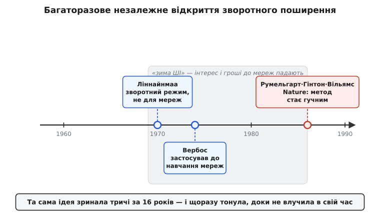

# 📜 Ідея, яку відкривали тричі й тричі забували

Є речі, які винаходять один раз, і на цьому історія скінчена. Зворотне поширення — не з таких. Той самий математичний трюк — пронести похибку назад крізь ланцюжок обчислень, множачи локальні чутливості, — незалежно придумали щонайменше тричі протягом шістнадцяти років. Придумали, записали, надрукували — і щоразу він тонув, ніби його й не було. Аж доки одна стаття 1986 року нарешті не влучила в потрібний момент і не зробила його відомим усьому світу.

Це не просто кумедний збіг. Історія цього забування пояснює дещо важливе про те, як узагалі рухається наука: чому «хто перший» майже ніколи не має чистої відповіді, чому добра ідея може лежати надрукованою десять років і не спрацювати, і чому «винайшов» — це насправді кілька дуже різних дій, які ми зазвичай звалюємо в одне слово. Пройдімося по трьох незалежних появах — і придивімося, що саме кожен зробив, а чого не зробив.

*Та сама ідея зринала тричі за шістнадцять років — 1970, 1974, 1986 — і щоразу тонула. Дві перші появи (сині) припали на «зиму ШІ», коли інтерес і гроші до нейромереж падали, і майже нікого не зацікавили. Третя (червона) вийшла, коли клімат уже змінювався, — і саме вона зробила метод гучним, хоч і не була першою.*

## Фінська магістерська, у якій ще немає жодної нейромережі

Почнімо з людини, яка про нейромережі, схоже, взагалі не думала. **Сеппо Ліннайнмаа** (фін. *Seppo Ilmari Linnainmaa*, нар. 1945) — фінський математик; 1970 року він захистив у Гельсінському університеті магістерську роботу з дивовижно вузькою на перший погляд темою. Оригінальна фінська назва — «Algoritmin kumulatiivinen pyöristysvirhe yksittäisten pyöristysvirheiden Taylor-kehitelmänä», тобто «представлення накопиченої похибки округлення алгоритму як розкладу Тейлора локальних похибок округлення» *(усталено: робота існує, назву й рік підтверджують і біографічні джерела, і сам Ліннайнмаа; згодом надрукована в журналі BIT 1976 року)*.

Звучить як щось геть далеке від навчання мереж — і воно справді про інше. Ліннайнмаа розбирався, як **похибки округлення** (ті крихітні неточності, що їх комп'ютер робить на кожній арифметичній дії, бо число має скінченну кількість знаків) накопичуються вздовж довгого обчислення. Питання суто інженерне: якщо алгоритм робить тисячі дій, і на кожній трохи бреше в останньому знаку, наскільки збрехає результат наприкінці?

Щоб відповісти, треба знати, наскільки кінцевий результат **чутливий до збурення на кожному кроці** — тобто похідну результату по кожній проміжній величині. І тут Ліннайнмаа зробив красиву річ. Він зауважив, що якщо йти ланцюжком обчислень **назад** — від результату до входів, — то ці всі чутливості можна дістати одним проходом, накопичуючи добуток локальних похідних. Він назвав це **зворотним режимом** накопичення (те, що сьогодні звуть зворотним режимом автоматичного диференціювання), розписав механіку й навіть навів код на **Фортрані**, який це рахує *(усталено: код на Фортрані у самій роботі — деталь, яку окремо відзначають дослідники історії методу)*.

Помітьте, що це **точно той самий обчислювальний скелет**, який згодом навчатиме нейромережі: пройти граф обчислень назад, на кожному вузлі помножити те, що прийшло, на локальну похідну. Але в роботі Ліннайнмаа немає ані слова про нейрони, ваги чи навчання. Він розв'язував задачу чисельної математики — оцінку похибки, — і зворотний обхід графа був для нього інструментом саме для цього *(усталено: Вікіпедія й огляди прямо зазначають, що метод подано «без згадки про нейромережі»)*. Ідея вже цілком була на світі, у надрукованому вигляді, — просто повернута зовсім іншим боком. Той, хто шукав спосіб навчати мережі, ніколи не додумався б гортати магістерську про округлення чисел фінською.

> 🔧 **Навіщо це.** Ось перший урок про «хто винайшов». Ліннайнмаа мав **весь механізм** — і зворотний прохід, і множення локальних похідних, і навіть робочий код. Але він не мав **задачі**, до якої цей механізм згодом виявиться золотим. Мати інструмент і бачити, де він потрібен, — це дві окремі речі, і історія раз по раз показує, що вони можуть розійтися на роки. Тому питання «хто перший придумав зворотне поширення?» одразу розсипається: перший, хто описав механізм, і перший, хто побачив його користь для мереж, — різні люди, з різних галузей, які й не чули одне про одного.

## Гарвардська дисертація, що потонула в «зимі»

Тепер — людина, яка задачу мала. **Пол Вербос** (англ. *Paul John Werbos*, американець) 1974 року захистив у Гарварді докторську дисертацію під керівництвом політолога Карла Дойча (нім. *Karl W. Deutsch*). Назва — «Beyond Regression: New Tools for Prediction and Analysis in the Behavioral Sciences», «поза межами регресії: нові інструменти для передбачення й аналізу в науках про поведінку» *(усталено: назву, рік, наукового керівника й заклад підтверджують біографічні джерела та сама перевидана дисертація)*.

Шлях Вербоса до ідеї був, м'яко кажучи, нетиповий. Він шукав спосіб будувати системи, що навчаються, — і, за власним пізнішим свідченням, відштовхувався від ідеї Фрейда про «психічну енергію», яка перетікає зворотними зв'язками; цю метафору він переклав у математичний алгоритм, що згодом дістав назву зворотного поширення *(правдоподібно-але-специфічно: це власна розповідь Вербоса про походження ідеї, її наводять біографічні джерела; сприймати як його реконструкцію мотивації, а не як зовнішньо перевірений факт)*. Ключове ж, що він **застосував зворотне диференціювання саме до навчання штучних нейромереж** — вивів, як роздати похибку вагам багатошарової мережі, пронісши її назад. Те, чого не було в Ліннайнмаа — зв'язку з мережами, — Вербос зробив явно.

І тут його спіткала лиха хвиля часу. Дисертація вийшла в самий розпал **«зими ШІ»** — періоду, коли інтерес і фінансування нейромереж різко впали. Причину варто назвати точно, бо вона теж частина цієї історії. 1969 року **Марвін Мінський** (англ. *Marvin Minsky*) і **Сеймур Пейперт** (англ. *Seymour Papert*) видали книжку «Perceptrons», де математично суворо показали, на що **не здатен** одношаровий перцептрон: він розв'язує лише лінійно роздільні задачі й не може, наприклад, обчислити функцію «виключне або» (XOR). Це був чесний і правильний результат. Але книжка додала припущення — як згодом виявилося, **хибне**, — що й багатошарові мережі, найпевніше, впруться в подібну стіну *(усталено: зміст книжки й помилковість цього припущення визнані в історії галузі; сам факт «зими» багатопричинний, і роль книжки історики оцінюють по-різному — від «спускового гачка» до «одного з чинників»)*.

Наслідок для мереж був важкий: якщо навіть авторитети кажуть, що напрям упирається в стіну, гроші й уми відпливають в інше. І саме тоді, у цю зимову тишу, Вербос приносить рівно те, що стіну пробиває, — спосіб **навчати багатошарову мережу**, який робить XOR-заперечення неактуальним. Ідея, що могла б скасувати похорон, вийшла на самому похороні — і її майже ніхто не почув. Механізм був правильний, момент — найгірший з можливих.

> 🔧 **Навіщо це.** Другий урок про «хто винайшов»: правильна ідея в неправильний час майже нічого не важить. Вербос мав і механізм, і застосування до мереж — тобто більше, ніж Ліннайнмаа, — і все одно ідея пролежала непоміченою роки. Наука не рухається чистою логікою «хто довів, той і переміг»; вона рухається ще й увагою спільноти, а увагу тоді відвернули від мереж геть. Тому «винайшов» — це не лише «зробив і записав»; це ще й «зробив тоді, коли світ був готовий почути». Вербос зробив — але світ не слухав.

Тут варто чесно позначити один спірний вузол атрибуції. Наскільки **явно** саме дисертація 1974 року вже виписувала застосування до нейромереж — питання, у якому джерела розходяться. Частина каже, що дисертація вже містила навчання мереж; історик методу Юрген Шмідгубер (нім. *Jürgen Schmidhuber*) обстоює обережнішу хронологію: у роботі 1974 року був радше загальний апарат «упорядкованих похідних», а **явне** застосування до нейромереж Вербос розписав пізніше, у роботі 1982 року *(спірно: різні джерела датують «явне застосування до мереж» по-різному — 1974 або 1982; безсумнівне те, що Вербос зробив цей зв'язок задовго до 1986 року й що галузь тривалий час його недооцінювала)*. Хай там як із точним роком — суть незмінна: до гучної публікації середини 1980-х зв'язок «зворотне диференціювання ↔ навчання мереж» уже існував на папері й був забутий.

## Стаття 1986 року, яка нарешті влучила в час

І ось третя поява — та, після якої ідея вже не потонула. У жовтні 1986 року в журналі *Nature* вийшла стаття **Девіда Румельгарта, Джефрі Гінтона й Рональда Вільямса** (англ. *David E. Rumelhart, Geoffrey E. Hinton, Ronald J. Williams*) під назвою «Learning representations by back-propagating errors», «навчання представлень через зворотне поширення похибок» *(усталено: Nature, том 323, сторінки 533–536, 1986 — точна бібліографія підтверджена)*.

За механізмом там не було нічого принципово нового щодо того, що вже мали Ліннайнмаа й Вербос: той самий зворотний прохід, те саме множення локальних чутливостей. Румельгарт, за пізнішим свідченням Гінтона, дійшов до ідеї **незалежно**, не знаючи про попередників *(правдоподібно: це версія Гінтона, її наводять інтерв'ю; вона узгоджується із загальною картиною, де кожна поява була незалежною)*. Що ж тоді зробило саме цю статтю поворотною, якщо ідея була не нова?

Дві речі, і обидві — не про механізм. Перша: **час нарешті став правильним**. Зима відступала, обчислювальні машини подужчали, і спільнота знову шукала спосіб навчати багатошарові мережі — рівно те, що метод давав. Друга, і головна: автори не просто описали алгоритм, а **переконливо показали, що він робить щось цінне** — що прихованим шарам мережі він дає самим виробити корисні внутрішні ознаки задачі, «представлення», яких людина в мережу не закладала. Не «ось формула», а «дивіться, що вона вміє». Це вже було видовище, у яке хотілося вкластися.

Тут — найтонший вузол усієї історії, і його треба назвати чесно, бо саме він породив десятиліття суперечок. Сам **Гінтон ніколи не стверджував, що винайшов зворотне поширення**. У пізніших інтерв'ю він прямо казав, що базову ідею придумав Румельгарт — незалежно й набагато пізніше за тих, хто вже зробив це в інших галузях, — і що коли вони публікували, то не знали повної історії й не послалися на попередників. А внеском своєї групи він називав не винахід методу, а **демонстрацію**, що метод здатен навчати цікаві внутрішні представлення *(усталено: ці слова Гінтона задокументовані в інтерв'ю; він послідовно відводить собі роль популяризатора, а не першовідкривача)*.

І все-таки саме за цією статтею світ запам'ятав зворотне поширення. Її цитували, від неї відштовхувалися, у масовій свідомості метод «народився» 1986 року — хоча насправді це була вже щонайменше третя його поява. Тому й спалахнула суперечка про атрибуцію: Шмідгубер роками наполягає, що галузь несправедливо обійшла Ліннайнмаа, Вербоса й інших ранніх авторів, приписавши все команді 1986 року *(спірно як оцінка справедливості, але фактична основа тверда: пріоритет за механізмом належить попередникам, гучність — статті 1986 року)*. Обидві сторони, як не дивно, мають рацію в тому, що стверджують, — бо стверджують про **різні дії**.

> 🔧 **Навіщо це.** Ось третій, найважливіший урок, і заради нього ця розповідь. Слово «винайшов» злипає щонайменше з п'яти різних учинків: **придумати механізм**, **побачити, до чого його застосувати**, **строго вивести**, **переконливо показати, що він працює**, і **зробити це тоді, коли світ готовий слухати**. Ліннайнмаа дав механізм. Вербос побачив застосування до мереж. Команда 1986 року переконливо показала користь і влучила в час. Жоден із них не зробив усього — і жоден не «винайшов сам». Коли наступного разу почуєте чисте «X винайшов Y», варто спитати: яку саме з цих дій зробив X — і хто зробив решту?

## Чому вона щоразу забувалася

Лишається питання, від якого стає трохи не по собі: чому **та сама** ідея тонула тричі? Одна випадковість — буває; але три поспіль — це вже закономірність, і в ній видно, як улаштоване забування в науці.

Перша причина — **розрізненість галузей**. Ліннайнмаа писав у чисельній математиці, фінською, про похибки округлення. Вербос — у науках про поведінку, відштовхуючись від психології. Ті, кому це найбільше знадобилося б — дослідники нейромереж, — читали зовсім інші журнали й говорили іншою термінологією. Ідея лежала на видноті, але **не в тому місці**, де її шукали. Наука розділена на ділянки з власними словниками, і чудова думка, висловлена «не тим діалектом», для сусідньої ділянки просто невидима.

Друга причина — **клімат моменту**. Дві перші появи припали на «зиму», коли самий напрям мереж вважали глухим кутом. У такому кліматі навіть правильна ідея не має за що зачепитися: немає спільноти, яка підхопить, немає задач, у які її вставлять, немає грошей, під які її розвиватимуть. Ідея — не насінина, що проросте будь-де; їй потрібен ґрунт готової спільноти, а взимку ґрунт промерз.

Третя причина — **різні імена й різні цілі**. У Ліннайнмаа це «зворотний режим накопичення похибки округлення», у Вербоса — «упорядковані похідні», у команди 1986 року — «зворотне поширення похибок». Три назви для одного скелета, вбудованого в три різні задачі. Ніхто не бачив, що це **те саме**, бо кожен дивився крізь свою задачу й називав по-своєму. Часом найбільша перешкода — навіть не відсутність ідеї, а те, що її вже мають під іншим ім'ям і не впізнають.

І аж коли клімат змінився, машини подужчали, а автори показали не формулу, а **вражаючий результат** — ідея нарешті зачепилася й лишилася. Не тому, що стала правильнішою (правильною вона була вже 1970-го), а тому, що всі три умови — місце, час і переконлива демонстрація — зійшлися вперше. Зворотне поширення не «винайшли» в якусь одну мить; його **доносили** до світу тричі, і світ почув із третього разу.
