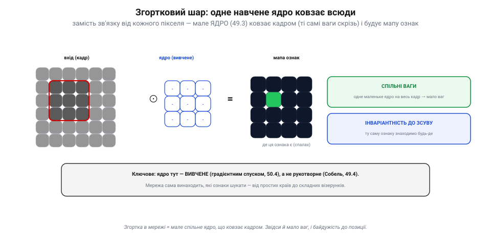

# Згорткові мережі (CNN) для зображень

Маючи [нейрони й шари](book:algorithms/neuron-layer) та вміючи [їх навчати](book:algorithms/gradient-descent), здавалося б — бери та нацькуй мережу на зображення. Але «звичайна» (повноз'єднана) мережа на картинках **захлинається**. Рятунок: занести [згортку](book:algorithms/convolution-filters) всередину мережі — тільки тепер із **вивченими** ядрами. Так народилися **згорткові мережі** (*CNN*) — архітектура, на якій стоїть **кожен** сучасний [зоровий детектор](book:algorithms/nn-detectors).

> 📜 Історія теми: [Ян Лекун і згорткова мережа, що читала поштові індекси (1989)](hist-lecun-cnn.md) — як CNN із наукової ідеї стала першою, що працювала в реальному світі.

### Чому звичайна мережа давиться зображенням

У [повноз'єднаному шарі](book:algorithms/neuron-layer) **кожен** вхід тягне зв'язок до **кожного** нейрона. Для зображення це катастрофа.

*Рис. Чому звичайна мережа давиться. **Вибух ваг**: кадр 200×200×3 — це 120 000 входів, і шар із 1000 нейронів дає вже **120 мільйонів** ваг (один шар — і не влазить). **Не ділить знання за позицією**: той самий кіт у лівому кутку й у правому — для повноз'єднаної мережі це **два різні** входи, тож вона мусить учити кожну позицію наново, марнуючи і ваги, і приклади.*

Дві біди. Перша — **вибух ваг**: кадр 200×200×3 — це 120 тисяч входів, і навіть один шар із тисячі нейронів дає **120 мільйонів** ваг; такого не вивчити й не вмістити. Друга, тонша — **немає спільного знання за позицією**: для повноз'єднаної мережі кіт у лівому кутку й кіт у правому — **геть різні** входи, тож вона мусить вивчати «кота» **окремо** для кожного місця кадру. Марнотратство і ваг, і прикладів. Потрібен інший підхід — і він уже був у нас у руках.

### Згортковий шар: одне навчене ядро ковзає всюди

Замість тягти зв'язок від кожного пікселя, візьмімо **маленьке [ядро](book:algorithms/convolution-filters)** і **проведімо** ним по всьому кадру ([згортка](book:math/convolution)), шукаючи ознаку. Ті самі ваги ядра працюють **скрізь** — це і є **згортковий шар**.

*Рис. Згортковий шар. Замість зв'язку від кожного пікселя — мале **ядро** ковзає кадром і будує **мапу ознак** (де ця ознака спалахує). Два виграші: **спільні ваги** — одне маленьке ядро на весь кадр, тож ваг мало (і не залежить від розміру кадру); **інваріантність до зсуву** — ту саму ознаку знаходимо будь-де. Ключове: ядро тут **вивчене** ([градієнтним спуском](book:algorithms/gradient-descent)), а не рукотворне ([Собель](book:algorithms/edge-detection)).*

Звідси — два величезні виграші. **Спільні ваги** (*parameter sharing*): одне ядро 3×3 — це лиш дев'ять чисел замість зв'язку до кожного пікселя, тож ваг **мізерно мало** (і байдуже, наскільки великий кадр). **Інваріантність до зсуву**: оскільки ядро ковзає всюди, ознаку воно знайде **в будь-якому** кутку — кіт зліва чи справа спрацює однаково. І найголовніше: на відміну від [Собеля](book:algorithms/edge-detection), це ядро **ніхто не малював руками** — мережа **сама вивчає** його ваги [градієнтним спуском](book:algorithms/gradient-descent), винаходячи, які ознаки шукати. Багато ядер у шарі → багато **мап ознак**.

### Пулінг: стиснути мапу й стерпіти зсув

Між згортковими шарами мапу зазвичай **зменшують** — це **пулінг** (підвибірка). Найпоширеніший — **макс-пулінг**: у кожному маленькому віконці (скажімо, 2×2) лишають **максимум**.

*Рис. Пулінг. Мапу ознак ріжуть на віконця 2×2 й беруть **максимум** кожного — мапа 4×4 стискається в 2×2. Два зиски: **менше даних** (дешевше й швидше далі рахувати) і **стійкість до дрібного зсуву** — якщо ознака трохи зсунулась у межах віконця, максимум той самий, тож мережа цього й не помітить.*

Пулінг дає два зиски. **Менше даних** — мапа меншає, отже, наступні шари рахувати дешевше. І **стійкість до дрібного зсуву** — якщо ознака трохи посунулась у межах віконця, її максимум не змінився, тож мережа не здригнеться. Це, по суті, та сама терпимість до позиції, що й у згортки, лише на іншому рівні (а корінням — у «складних клітинах» [зорової кори](book:algorithms/nn-detectors)).

### Стос CNN: від країв до об'єктів

Тепер складімо все докупи. **Згортка → активація (ReLU) → пулінг** — і так **багато разів**; наприкінці — кілька повноз'єднаних шарів, що з ознак роблять відповідь.

*Рис. Стос CNN. Кадр проходить повторювані ланки «згортка + ReLU + пулінг»: мапи **меншають**, але їх стає **більше** (глибше). Наприкінці **повноз'єднані** шари перетворюють ознаки на відповідь (клас чи рамки). А головне — **ієрархія**: перші шари ловлять **краї** й плями, середні складають із них **форми й частини**, глибокі — **цілі об'єкти**. Це і є [детектор](book:algorithms/nn-detectors), відкритий зсередини, — рукотворна луна зорової кори (Г'юбел–Візел).*

З кожною ланкою мапи стають **меншими**, зате **глибшими** (більше ознак). І виникає те, заради чого все затівалося, — **ієрархія ознак**: перші шари ловлять прості **краї** (точнісінько Собель, але вивчений), середні складають із країв **форми й частини**, а глибокі — **цілі об'єкти**. Це достоту простими→складними клітини [зорової кори](book:algorithms/nn-detectors) (Г'юбел і Візел), тільки рукотворні й навчені. Наприкінці повноз'єднані шари дивляться на знайдені об'єкти-ознаки й видають відповідь. Ось вона, «чорна скриня» [детектора](book:algorithms/nn-detectors), розкрита: стос вивчених згорток і пулінгів, що сходить від країв до сенсу.

> 📜 **Неокогнітрон: Фукусіма будує зорову кору із S- і C-клітин (1980).** Архітектуру CNN — згортки плюс пулінг плюс ієрархія — придумали не для комп'ютерів, а **списавши з мозку**, ще до того, як її навчилися тренувати. 1980 року японський інженер **Куніхіко Фукусіма** взяв відкриття Г'юбела й Візела (прості й складні клітини [зорової кори](book:algorithms/nn-detectors)) і втілив їх у багатошаровій мережі — **неокогнітроні**. Він поклав у неї два роди клітин навперемін: **S-клітини** (від *simple*) — детектори ознак на кшталт країв у певному місці (рівно те, що робить згортка) і **C-клітини** (від *complex*) — що відгукуються на ознаку **незалежно** від точного положення (рівно те, що робить пулінг). Складені шарами, вони ловили прості ознаки внизу й цілі образи вгорі — і впізнавали візерунки **попри зсув** у кадрі. Це й була перша **згорткова мережа** за духом — прямий предок усього, чим бачить твій дрон. Фукусімі бракувало лише способу її **зручно навчати**; цей останній шматок — і реальне застосування — додасть за дев'ять років Ян Лекун (історія до цієї теми). Та кістяк сучасного машинного зору виклав саме неокогнітрон, змайстрований за лекалами котячої зорової кори.

> 🔧 **Навіщо це.** Затям головне: **кожен** сучасний [зоровий детектор](book:algorithms/nn-detectors) на дроні — це **CNN**, тобто вивчена, навчена версія тієї [згортки](book:algorithms/convolution-filters), що робиться руками. Її сила — зі **спільних ваг** (мало параметрів попри величезні кадри) і **пулінгу** (дешевизна + стійкість до зсуву), а «розум» — з **ієрархії** (краї → об'єкти). На апарат ти ставиш **готову, наперед навчену** CNN ([вивід](book:algorithms/train-vs-inference)) і береш **компактну** архітектуру (як-от MobileNet), щоб улізти в [бортовий чип](book:algorithms/tinyml). І коли наступного разу детектор «не бачить» цілі — згадай, що всередині не магія, а стос навчених фільтрів «край → форма → об'єкт», обмежений тим, на чому його тренували.

### Підсумок теми

Повноз'єднані мережі **давляться** зображеннями: вибух ваг і жодного спільного знання між позиціями. Рятунок — **згортковий шар**: мале **вивчене** [ядро](book:algorithms/convolution-filters) ковзає кадром зі **спільними вагами** (мало параметрів) і **інваріантністю до зсуву** (ознака знаходиться будь-де), даючи **мапи ознак**. **Пулінг** стискає мапи й додає стійкості до дрібного зсуву. Складені в стос (згортка → ReLU → пулінг, багато разів, тоді повноз'єднані), вони утворюють **ієрархію** — від країв до об'єктів — і це є **CNN**, архітектура кожного сучасного [детектора](book:algorithms/nn-detectors), навчена/тренована рідня ручної згортки. А кістяк цей виклав ще 1980-го неокогнітрон Фукусіми, списаний із зорової кори.
