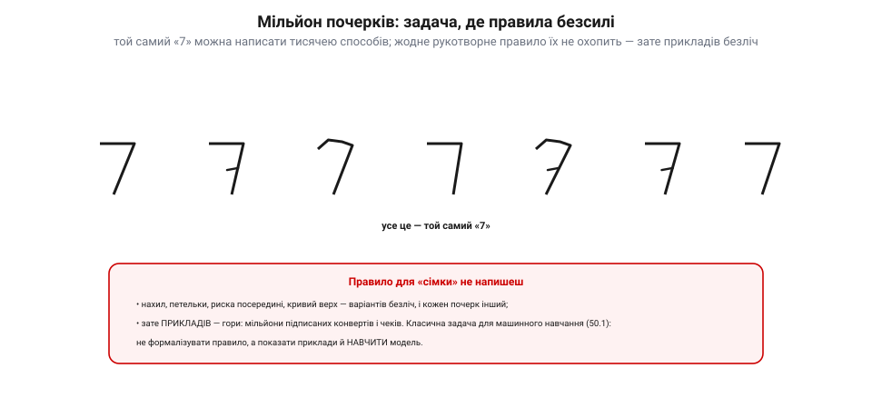
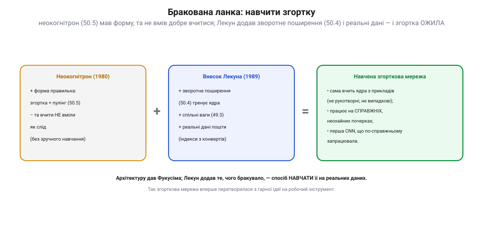
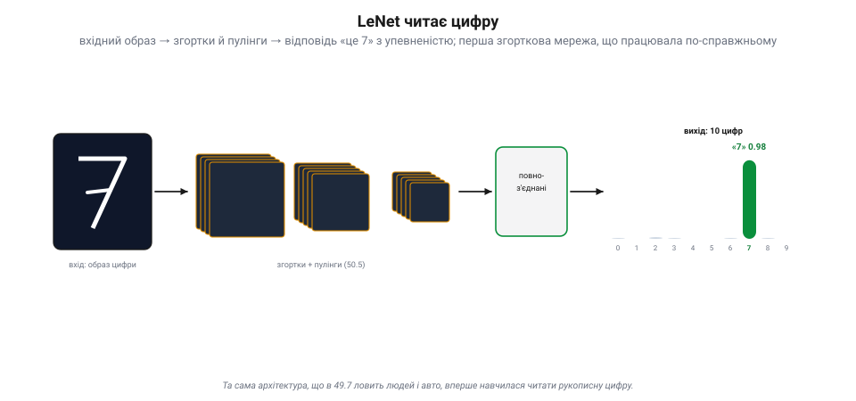
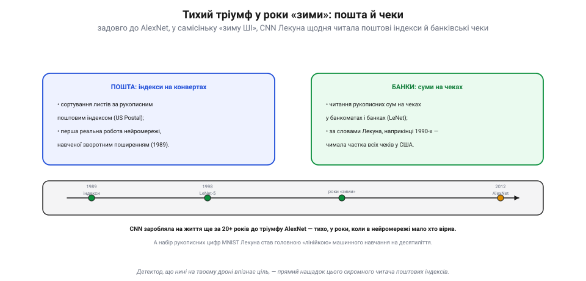

# Історія: Ян Лекун і згорткова мережа, що читала поштові індекси

Фукусіма дав [згортковій мережі](topic:algorithms/cnn) **форму**, списавши її з зорової кори, — але вона лишалася гарною теорією, що нічого корисного не робила. Бракувало останнього: навчити цю форму на **справжніх** даних — і змусити **працювати**. Цей крок зробив француз **Ян Лекун** наприкінці 1980-х. І першою справжньою роботою його мережі стало… читати **рукописні цифри** на конвертах. Ось як згорткова мережа з ідеї перетворилася на робочий інструмент — за двадцять із гаком років до того, як про «глибоке навчання» заговорив світ.

## Мільйон почерків: задача, де правила безсилі

Уяви завдання поштамту: автоматично сортувати **мільйони** листів за рукописним поштовим **індексом**. Здавалося б, дрібниця — прочитати кілька цифр. Та спробуй написати **правило**, що впізнає «сімку»: у когось вона з рискою, у когось крива, нахилена, з петелькою чи без. Скільки людей — стільки почерків.

*Мільйон почерків. Той самий «7» пишуть тисячею способів — з рискою посередині, кривим верхом, різним нахилом. Жодне рукотворне правило цього не охопить. Зате **прикладів** — гори: мільйони підписаних конвертів. Класична задача для [машинного навчання](topic:algorithms/what-is-ml): не формалізувати правило, а показати приклади й **навчити** модель.*

Це рівно той випадок, заради якого існує [машинне навчання](topic:algorithms/what-is-ml): правило написати **неможливо**, зате **прикладів** — скільки завгодно. Ідеальна для нього робота. Бракувало лише архітектури, що добре впоралася б із зображеннями, — і способу її **навчити**.

## Бракована ланка: навчити згортку

Архітектура вже існувала — **неокогнітрон** Фукусіми: згортки плюс пулінг, ієрархія від країв до образів. Та він **не вмів як слід учитися** — не було зручного способу підібрати його ваги під дані. Лекун, який починав із роботи над зворотним поширенням (і деякий час працював з Гінтоном), додав саме цю **браковану ланку**.

*Бракована ланка. **Неокогнітрон** (1980) мав правильну форму — згортка + пулінг, — але вчити його як слід не вміли. **Лекун** (1989) додав, чого бракувало: **[зворотне поширення](topic:algorithms/gradient-descent)**, що тренує самі ядра, **[спільні ваги](topic:algorithms/convolution-filters)** і **реальні дані** пошти. Вийшла **навчена** згорткова мережа, що сама виводить ядра з прикладів і працює на справжніх, неохайних почерках.*

У лабораторії **Bell Labs** (AT&T) 1989 року Лекун із колегами склали все докупи: згорткову архітектуру, **[спільні ваги](topic:algorithms/convolution-filters)**, і **[зворотне поширення](topic:algorithms/gradient-descent)**, що тренувало самі ядра під реальні дані поштамту США. Сам метод зворотного поширення був відомий і раніше (його гучно описали Румельгарт, Гінтон і Вільямс 1986-го), та саме тут згорткову мережу вперше навчили ним на **справжній, практичній** задачі — і вона запрацювала. Згортка з гарної ідеї перетворилася на **робочий інструмент**, що сам винаходить, які ознаки шукати, прямо з прикладів.

## LeNet читає цифру

Цю мережу довели до серії, відомої як **LeNet** (вершина — LeNet-5, 1998). Її будова — точно та, що в будь-якій [згортковій мережі](topic:algorithms/cnn): образ цифри тече крізь згортки й пулінги, а наприкінці повноз'єднані шари кажуть, **яка це цифра**.

*LeNet читає цифру. Вхідний образ цифри проходить [згортки й пулінги](topic:algorithms/cnn), тоді повноз'єднані шари дають десять чисел — упевненість, що це 0, 1, …, 9. Тут найвищий стовпчик у «7» (0.98) — мережа прочитала сімку. Та сама архітектура, що в [нейромережних детекторах](topic:algorithms/nn-detectors) ловить людей і авто, вперше навчилася читати рукописну цифру.*

Та сама послідовність «згортка → пулінг → … → повноз'єднані → відповідь», що нині [розпізнає на дроні людей і авто](topic:algorithms/nn-detectors), уперше довела себе на скромній задачі — прочитати закарлючку, написану від руки. І робила це **надійно**, на справжніх, неохайних почерках, яких жодне правило не здолало б.

## Тихий тріумф у роки «зими»

А далі сталося найдивовижніше: ця мережа пішла **в роботу** — і працювала роками, поки решта світу вважала нейромережі глухим кутом (друга «зима ШІ»).

*Тихий тріумф. Мережа Лекуна сортувала листи за рукописним **індексом** (пошта США) і читала рукописні **суми на чеках** у банкоматах — за словами самого Лекуна, наприкінці 1990-х це була чимала частка всіх чеків у США. Усе це — **за 20+ років до AlexNet** (2012), у самісіньку «зиму», коли в нейромережі мало хто вірив. А набір рукописних цифр **MNIST** Лекуна став головною «лінійкою» машинного навчання на десятиліття.*

CNN Лекуна сортувала пошту й читала рукописні **суми на банківських чеках** у банкоматах — за його ж словами, наприкінці 1990-х його система обробляла чималу частку всіх чеків у США. Тобто згорткова мережа **заробляла на життя** ще тоді, коли до галасливого тріумфу AlexNet (2012) лишалося понад **двадцять років**. Вона робила це тихо, без фанфар, у роки, коли нейромережі були не в моді. А зібраний Лекуном набір рукописних цифр — **MNIST** — став на десятиліття головною «лінійкою», на якій міряли кожну нову ідею машинного навчання.

## Що з цього в нашому апараті

Детектор, що сьогодні на твоєму дроні [впізнає людину, авто чи посадкову мітку](topic:algorithms/nn-detectors), — **прямий нащадок** того скромного читача поштових індексів. Архітектура та сама (згортки, пулінг, ієрархія), навчання те саме ([зворотне поширення](topic:algorithms/gradient-descent)), і принцип той самий: не правило, а приклади. Змінилися лише масштаб даних і потужність заліза — саме їх бракувало до 2012-го.

І ще урок, дорожчий за техніку. Велике рідко приходить із гуркотом: іноді воно **тихо працює** роками на буденній задачі, поки світ дивиться в інший бік. Згорткова мережа не «вистрілила» 2012-го з нуля — вона два десятиліття **сортувала пошту й читала чеки**, чекаючи, поки до неї доростуть дані й обчислення. Історія дала нам **робочу** згортку; а чи буде вона корисною, вирішує головний клопіт — **[дані, перенавчання й узагальнення](topic:algorithms/overfitting)**.
