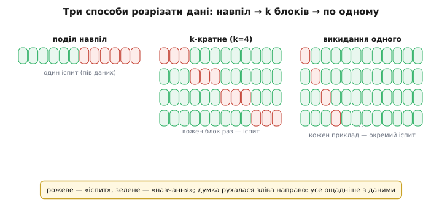
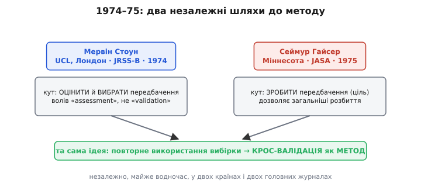

# 📜 Як «поділи навпіл» доросло до методу

Спокуса перевірити модель на тих самих даних, на яких її навчено, стара, як сама статистика, — і так само стара засторога, що це самообман. Якщо підігнати криву під двадцять точок, а тоді спитати ту саму криву, як добре вона лягла на ці двадцять точок, — вона, звісно, похвалиться. Вона їх **бачила**. Число вийде красиве й брехливе. Уся історія крос-валідації — це історія одного повільного усвідомлення: щоб дізнатися, як модель поведеться на **новому**, треба випробувати її на тому, чого вона **не бачила** під час навчання, — і робити це чесно, не даючи їй підглянути.

Здавалося б, думка очевидна. Але від першого чіткого зауваження, що «на бачених даних оцінка завищена», до строгого методу з ім'ям, теоремами й практичними рекомендаціями минуло **понад шістдесят років** і кілька незалежних відкриттів того самого. Люди в різних кутах науки — психометристи, що будували формули профвідбору; медичні статистики, що розділяли хворих і здорових; британські й американські теоретики статистики — раз за разом натикалися на ту саму ідею й давали їй різні імена. Простежмо цей ланцюг так, як він справді був: не як список дат, а як низку моментів, де кожен розв'язував рівно те, об що спіткнувся попередній. І, за звичкою чесної історії, розрізнятимемо три різні речі — **побачити проблему**, **запропонувати прийом** і **зробити з прийому загальний метод із гарантіями**: їх дали різні руки й з різницею в десятиліття.

## Ларсон бачить «усадку»: число на бачених даних бреше

Почнімо з 1931 року й з галузі, від машинного навчання, здавалося б, далекої, — освітньої психології. Американський дослідник **Селіг Ларсон** (Selig C. Larson) надрукував статтю з назвою, що вже все каже: «The Shrinkage of the Coefficient of Multiple Correlation» — «Усадка коефіцієнта множинної кореляції» (*Journal of Educational Psychology*, том 22, число 1, с. 45–55).

Що його бентежило? Тодішня психометрія будувала **рівняння передбачення**: узяти кілька вимірів людини (бали тестів, показники) і скласти з них формулу, що передбачає щось важливе — успішність, придатність до фаху. Якість такої формули міряли **коефіцієнтом множинної кореляції** R — числом від 0 до 1, що показує, наскільки тісно передбачення тримається справжнього результату. І от люди помітили прикру річ: коли ту саму формулу, виведену на одній групі, застосовували до **іншої** групи людей, її R **падав**. Формула, що на «своїй» групі давала блискучі 0.7, на новій групі сповзала до 0.5. Наче тканина, що після прання **сідає**, — звідси й слово «shrinkage», усадка.

Ларсон не просто повторив цю поголоску — він **виміряв** її на 800 випадках і показав кількісно: усадка **реальна**, вона не артефакт, і вона **тим більша, чим більше змінних** ти запхав у формулу. Ось де перший твердий доказ того, що згодом назвуть **перенавчанням**: додаси в модель більше ручок, щоб краще лягти на **бачені** дані, — і тим гірше вона впаде на **небачених**. Формула тим часом не стала розумнішою; вона просто підігнала себе під випадкові дрібнички своєї конкретної групи, а на новій групі ці дрібнички інші.

> 🔧 **Навіщо це.** Ларсонова «усадка» 1931 року — це рівно та хвороба, проти якої за півстоліття винайдуть ліки. Він назвав діагноз: **число, зміряне на тих самих даних, на яких будували модель, систематично завищене** — модель хвалиться знанням, яке насправді є підгляданням у власний навчальний набір. Усе подальше — це різні способи дістати **чесне** число, зміряне на тому, чого модель не бачила. Без цього діагнозу не було б чого лікувати.

Що Ларсон зробив далі — характерно для доби без обчислювальних машин. Він не міг просто взяти й **багато разів** переділити дані та усереднити (кожне таке переділення означало б заново рахувати кореляції вручну, тижнями). Тому він вивів **поправкову формулу** — аналітичну оцінку того, наскільки R «сяде» на новій групі, залежно від кількості змінних і розміру вибірки. Це була ціла традиція, яка тяглася далі (того ж таки 1931 року Роберт Веррі (Robert J. Wherry) дав свою знамениту поправкову формулу, згодом — інші), — латати завищену оцінку **обрахунком**, а не **повторним випробуванням**. Ідея «а візьмімо-но й перевіримо на відкладених людях» уже висіла в повітрі, але робити це систематично, багато разів, було просто надто дорого руками.

*(Статус: реквізити статті Ларсона — назва, журнал, том, сторінки, 1931 рік, 800 випадків, висновок «усадка тим більша, чим більше змінних» — звірені за кількома незалежними бібліографічними записами й оглядами; це задокументований факт. Ім'я подають як S. C. Larson; повне «Selig» трапляється рідше й певності щодо нього менше — тож обмежуся ініціалами як надійнішим.)*

Побіжна, але доречна деталь про **саме слово**. Термін «крос-валідація» (cross-validation) закріпив не Ларсон, а трохи згодом — **Чарльз Мозьє** (Charles I. Mosier) 1951 року, теж у психології кадрового відбору, для процедури «побудуй формулу на одній вибірці — перевір на другій». Тобто ім'я методу народилося в **психометрії**, ще до того, як метод здобув математичну форму. *(Статус: авторство терміна за Мозьє 1951 подають кілька оглядів історії CV; усталено як загальноприйняте, хоч і не аж настільки гучне, як пізніші праці.)*

## Двічі 1968: leave-one-out кристалізується — незалежно, у двох галузях

Перескочмо на тридцять сім років, у 1968-й. До цього моменту «крос-валідація» жила переважно як **поділ навпіл**: розріж дані на дві половини, на одній навчи, на другій перевір. Просто, але марнотратно — половину дорогих даних ти взагалі не використав для навчання, а оцінка з однієї половини сама хитка. Наступний крок думки напрошувався: а що, як відкладати не половину, а **лише один приклад**? Навчити на всіх, крім одного, перевірити на ньому, і так по черзі для кожного. Тоді на навчання щоразу йдуть майже всі дані, а перевіркою побуває кожен приклад. Це — **валідація з викиданням одного** (leave-one-out).

Дивовижа історії в тім, що цю кристалізацію зробили **того самого 1968 року двоє незалежних авторських колективів у двох різних галузях**, не спираючись один на одного.

**Перший — Пітер Лаченбрух і М. Рей Мікі** (Peter A. Lachenbruch, M. Ray Mickey), медична й математична статистика. Їхня стаття «Estimation of Error Rates in Discriminant Analysis» — «Оцінювання частоти помилок у дискримінантному аналізі» (*Technometrics*, том 10, число 1, с. 1–11) — б'ється над дуже конкретним болем. Дискримінантний аналіз — це коли ти будуєш правило, що відносить новий випадок до одного з класів (хворий/здоровий, придатний/непридатний) за набором вимірів. Питання: **як зміряти, наскільки часто це правило помиляється**?

Найпростіша відповідь — «порахуй помилки на тих самих даних, на яких будував правило» — і є та сама Ларсонова пастка, тільки в класифікації. Правило вже підігналося під ці приклади, тож на них помиляється рідко, а на нових помилятиметься частіше. Лаченбрух і Мікі згенерували на комп'ютері багато штучних вибірок із **відомою** справжньою частотою помилок і чесно порівняли способи її оцінити. Висновок: два найпоширеніші методи дають **значно гіршу** оцінку, ніж кілька нових, що їх автори пропонують, — і серед цих нових центральним був саме прийом «викинь один приклад, збудуй правило наново на решті, перевір на викинутому, повтори для кожного». У сучасній літературі leave-one-out у класифікації відлічують саме від цієї статті.

**Другий — Фредерік Мостеллер і Джон Тьюкі** (Frederick Mosteller, John W. Tukey), два титани американської статистики, — того ж 1968 року дали чітке формулювання тієї самої ідеї в зовсім іншому контексті: у розлогому оглядовому розділі «Data Analysis, Including Statistics» для другого видання «Handbook of Social Psychology» (том 2, розділ 10, с. 80–203). Багато сучасних оглядів історії крос-валідації називають саме Мостеллера й Тьюкі авторами **ранньої ясної постановки leave-one-out** як загального прийому оцінювання передбачень.


*Родина розбиттів, що визрівала десятиліттями. Ліворуч — найдавніше: **поділ навпіл** (половина на навчання, половина на перевірку — марнотратно й хитко). Посередині — **k-кратне**: дані ділять на k блоків, кожен по черзі стає «іспитом». Праворуч — гранична межа, **викидання одного** (leave-one-out): кожен окремий приклад побуває іспитом, на навчання щоразу йде майже все. Історично думка рухалася зліва направо — від грубого поділу до дедалі економнішого використання скупих даних.*

Що тут важливо не переплутати. Це **не** випадок «хтось перший, а хтось украв». Це випадок, коли ідея **дозріла** — обчислювальні машини щойно зробили можливим те, що за Ларсона було немислимо (навчити модель сотні разів поспіль), — і тому проросла **водночас у кількох головах**, кожна зі свого боку: у медичній статистиці як спосіб зміряти частоту помилок класифікатора, у загальному аналізі даних як спосіб оцінити передбачення. Обидві праці 1968 року — **американська статистична лінія**; жодних імперських чи національних ярликів тут чіпляти нема куди.

> 🔧 **Навіщо це.** Момент 1968 року — це перехід від «поділи навпіл» до **викидання одного**, і за ним ховається дуже практична вигода, важлива саме там, де даних мало. Поділ навпіл викидає половину дорогих прикладів із навчання; leave-one-out викидає **по одному** — навчання щоразу майже повне, а перевіркою встигає побути **кожен** приклад. Коли розмітка коштує тижнів праці лікаря чи інженера, ця економія — не дрібниця, а різниця між «оцінка є» і «даних забракло навіть на оцінку».

## 1974–75: з прийому — метод. Стоун і Гайсер, незалежно

Тепер найголовніший поворот. До середини 1970-х крос-валідація була **збіркою прийомів**: тут поділ навпіл, там викидання одного, деінде поправкова формула. Не було **загальної теорії** — чіткої відповіді на питання «а що це взагалі за операція, коли її можна застосовувати, і що саме вона оцінює». Цю теорію дали, знову-таки **незалежно й майже одночасно**, двоє: британець Мервін Стоун і американець Сеймур Гайсер.

**Мервін Стоун** (Mervyn Stone, 1932–2020) — статистик Університетського коледжу Лондона (UCL), куди перейшов саме 1968 року. Його праця «Cross-Validatory Choice and Assessment of Statistical Predictions» — «Крос-валідаційний вибір і оцінювання статистичних передбачень» — має особливий статус: це **дискусійна доповідь**, яку він прочитав перед Королівським статистичним товариством у грудні 1973 року, а надрукували її в *Journal of the Royal Statistical Society, Series B* (том 36, число 2, с. 111–147) на початку 1974-го, разом із коментарями **тринадцятьох** дискутантів — знак, що робота одразу зачепила фахову спільноту.

Що зробив Стоун? Він **формалізував** крос-валідацію: подав її як загальну процедуру, дав чітке означення leave-one-out у цьому загальному вигляді й показав, як нею **вибирати** й **оцінювати** передбачення — не тільки судити готову модель, а й **обирати** з-поміж моделей та їхніх налаштувань. Є в цій статті й тонкий, але промовистий штрих про наукову скромність. Стоун навмисне волів слово **«assessment»** (оцінювання, зважена оцінка), а не **«validation»** (валідація, підтвердження) — бо, за його думкою, «валідація» має присмак **надмірної впевненості**, ніби число щось остаточно «підтверджує». Це не педантизм: сама назва застерігає, що крос-валідація дає **оцінку якості**, а не печатку істини.

**Сеймур Гайсер** (Seymour Geisser, 1929–2004) — американський статистик, народжений у Нью-Йорку, засновник і багаторічний директор Школи статистики Університету Міннесоти. Наступного, 1975 року, він надрукував «The Predictive Sample Reuse Method with Applications» — «Метод передбачувального повторного використання вибірки із застосуваннями» (*Journal of the American Statistical Association*, том 70, число 350, с. 320–328). Прийшов він до крос-валідації з трохи іншого боку — з боку **передбачення** як самостійної мети (Гайсер узагалі був палким прихильником «передбачувального висновку», де центр ваги статистики — не оцінити параметри моделі, а якнайкраще **передбачити нове спостереження**). Його «повторне використання вибірки» дозволяло й **загальніші** розбиття, ніж лише викидання одного, і не спиралося обов'язково на параметричну модель.


*Дві школи, одна ідея. Ліворуч — **Мервін Стоун** (Лондон, 1974): крос-валідація як загальний спосіб **оцінити й вибрати** передбачення; він же волів обережне слово «assessment» замість «validation». Праворуч — **Сеймур Гайсер** (Міннесота, 1975): та сама операція з боку **передбачення** як мети, з дозволом на загальніші розбиття. Незалежно, майже водночас, у двох країнах і двох головних журналах — так ідея з набору прийомів стала методом.*

І тут же поруч — третя, тихіша ланка того самого 1974 року. **Девід Аллен** (David M. Allen) у короткій нотатці «The Relationship between Variable Selection and Data Augmentation and a Method for Prediction» (*Technometrics*, том 16, число 1, с. 125–127) увів статистику **PRESS** (Predicted Residual Error Sum of Squares) — по суті, суму квадратів помилок leave-one-out у регресії, — як критерій **відбору змінних**. Тобто ту саму думку «міряй якість на викинутому прикладі» він одночасно застосував до дуже практичної задачі: які стовпці лишити в моделі, а які викинути. Три праці за два роки (Аллен 1974, Стоун 1974, Гайсер 1975), три різні кути — і всі про те саме серце.

> 🔧 **Навіщо це.** Різниця між «прийомом» і «методом» тут не академічна причепа, а вся суть цього повороту. Поки крос-валідація була **збіркою трюків**, кожен застосовував її навмання й наосліп. Коли Стоун і Гайсер дали їй **загальну форму**, стало ясно головне: це універсальний спосіб **вибирати** — між моделями, між налаштуваннями, між кількістю ознак, — а не лише виставляти оцінку готовому. Саме тому крос-валідація сьогодні стоїть у серці підбору моделей: не «оціни оце», а «з-поміж усього оцього обери найкраще, чесно міряючи на небаченому». Цю роль їй дали 1974–75.

Знову-таки — **незалежність** двох відкриттів варта наголосу, бо вона типова для науки й повчальна. Стоун і Гайсер не списували один в одного; вони прийшли до тієї самої формалізації з різних традицій — британської статистичної теорії та американського передбачувального висновку — приблизно в один рік. Це не «хто перший», а «ідея дозріла, і її зірвали двоє». Обидва — **британсько-американська статистична лінія**; жодного імперського чи національного обрамлення тут немає й бути не може.

## 1995: крос-валідацію нарешті **зважують** — понад пів мільйона прогонів

Лишалося ще одне велике питання, суто **практичне**, на яке теорія 1970-х відповіді не давала. Гаразд, крос-валідація — метод. Але яку **саме** її версію брати в реальній роботі? Скільки блоків — два, п'ять, десять, а чи взагалі викидати по одному (k = N)? Стратифікувати блоки чи ні? Теорія казала «метод правильний», а от **яке число k** дає найнадійнішу оцінку на справжніх даних — це вже не виведеш із формул, це треба **зміряти дослідом**. І поки цього досліду не зробили, у практиків гуляли найрізніші звички.

Зробив його **Рон Кохаві** (Ron Kohavi) 1995 року. Тоді він був аспірантом Стенфорду (докторат — під керівництвом, серед інших, **Джерома Фрідмана**, одного з батьків статистичного навчання) і водночас вів там бібліотеку машинного навчання MLC++. Його стаття «A Study of Cross-Validation and Bootstrap for Accuracy Estimation and Model Selection» — «Дослідження крос-валідації та бутстрепу для оцінювання точності й вибору моделі» (Proceedings of the 14th IJCAI, с. 1137–1145) — узяла питання не теорією, а **грубою емпіричною силою**.

Масштаб для 1995 року вражав. Кохаві прогнав **понад пів мільйона** запусків двох дуже різних алгоритмів — дерева рішень **C4.5** і **наївного баєсового** класифікатора — на низці реальних наборів даних, щоразу міняючи, як саме розбито дані: скільки блоків, стратифіковано чи ні, скільки бутстреп-вибірок. По суті, він поставив крос-валідацію **на терези** й дивився, яка її версія дає оцінку, найближчу до правди, і водночас найстійкішу.

З цього народилися дві речі, що донині формують практику. Перша — розуміння **компромісу**, який ховається у виборі k. Кохаві показав емпірично те, що звучить майже парадоксально: **викидання одного** (leave-one-out), попри те що воно навчає на максимумі даних і має найменше **зміщення**, страждає на **велику дисперсію** — його оцінка сама сильно скаче від набору до набору, тобто **ненадійна**. А з іншого боку, замало блоків (k = 2, 3) дає завелике зміщення — оцінка систематично занижена, бо на навчання щоразу йде надто мало даних. Десь посередині лежить золота середина.

Друга — конкретна, практична **рекомендація**, яку відтоді цитують у кожному підручнику. Дослівно з висновку статті: найкращий метод для вибору моделі — **десятикратна стратифікована крос-валідація**, «*even if computation power allows using more folds*» — тобто **навіть якщо обчислень стало б і на більше блоків**. Це був сильний і трохи несподіваний хід: не «бери якнайбільше k, якщо потягне залізо», а **саме десять** — бо далі стійкість не росте, зате дисперсія починає шкодити. Разом із порадою про стратифікацію (щоб частка класів у кожному блоці була як у всьому наборі) це й закріпило **k = 5** та **k = 10** як робочі стандарти, що їх ти зустрічаєш скрізь дотепер.

> 🔧 **Навіщо це.** Праця Кохаві — це момент, коли крос-валідацію перестали брати **на віру** й почали брати **за виміром**. Теорія 1974-го казала, що метод правильний; Кохаві 1995-го сказав, **якою саме цифрою k** ним користуватися, щоб оцінка була і майже незміщена, і надійна. Звідси й практична мудрість: бери **десятикратну стратифіковану** — не тому, що «десять гарне число», а тому, що великий дослід показав: більше блоків уже не додає стійкості, а викидання одного, попри малу похибку, надто скаче. Це рідкісний випадок, коли пораду підручника підперто пів мільйоном чесних прогонів, а не смаком автора.

Статус усіх цих фактів міцний і добре задокументований: понад пів мільйона запусків C4.5 і наївного баєса, рекомендація десятикратної стратифікованої CV із дослівним застереженням «навіть якщо потягнув би більше блоків», авторство Кохаві, місце публікації (IJCAI-95), його стенфордське аспірантство під Фрідманом — усе звірено за кількома незалежними джерелами.

## Що з цього ланцюга винести

Стисну хронологію — і в стисненні видно головний урок, той самий, що й у більшості наукових ідей: «хто винайшов крос-валідацію» не має однієї відповіді, бо винаходили **різні речі**.

```
1931  Ларсон (освітня психологія): ДІАГНОЗ.
      «Усадка» R — число на бачених даних систематично завищене.
      Ліки — ще обрахунок-поправка, не повторне випробування.

1951  Мозьє: сам ТЕРМІН «cross-validation» (кадрова психологія).

1968  Лаченбрух & Мікі (Technometrics)  |  Мостеллер & Тьюкі (Handbook).
      НЕЗАЛЕЖНО, у двох галузях — чітке leave-one-out.
      Машини дозволили те, що за Ларсона було немислиме.

1974  Стоун (JRSS-B, доповідь у RSS 1973)  |  Аллен (Technometrics, PRESS).
1975  Гайсер (JASA).
      З прийому — МЕТОД: загальна форма, вибір і оцінювання моделей.
      Стоун і Гайсер — незалежно; Стоун волів «assessment», не «validation».

1995  Кохаві (IJCAI): метод ЗВАЖЕНО.
      >500 000 прогонів C4.5 і наївного баєса → 10-кратна
      стратифікована CV; звідси стандарт k = 5 / k = 10.
```

Три різні дії, розтягнуті на понад шістдесят років. **Побачити хворобу** («на бачених даних число бреше») — це Ларсон, 1931. **Запропонувати чіткий прийом** («викидай по одному») — це двоє незалежних колективів 1968-го. **Зробити з прийому загальний метод із теорією** — це Стоун і Гайсер, незалежно, 1974–75. І, нарешті, **зміряти, якою версією методу користуватися** — це Кохаві, 1995. На кожному кроці внесок був або **поділений** між співавторами, або **продубльований** незалежними людьми, які дійшли того самого зі свого боку.

Ось чому фраза «крос-валідацію винайшов той-то» завжди буде хибною — не з ввічливості до інших авторів, а тому, що вона плутає **діагноз**, **прийом**, **метод** і **вимір**, розділені десятиліттями й багатьма руками, у різних країнах і галузях. А ще ця історія добра тим, чого в ній **немає**: жодного імперського міфу, жодної фабрикованої «першості». Це спокійна, чесна, переважно **британсько-американська статистична лінія** — від психометриста, що виміряв усадку кореляції на 800 випадках, до аспіранта, що прогнав пів мільйона класифікаторів, аби сказати нам просте: бери десять блоків, стратифікуй — і не вір числу, зміряному на тому, що модель уже бачила.

---

*Джерела (звірено): S. C. Larson, «The Shrinkage of the Coefficient of Multiple Correlation», Journal of Educational Psychology 22(1):45–55, 1931 (DOI 10.1037/h0072400); C. I. Mosier про походження терміна «cross-validation» (1951) — за оглядами історії CV; P. A. Lachenbruch, M. R. Mickey, «Estimation of Error Rates in Discriminant Analysis», Technometrics 10(1):1–11, 1968; F. Mosteller, J. W. Tukey, «Data Analysis, Including Statistics», у Handbook of Social Psychology (2-ге вид.), т. 2, розд. 10, с. 80–203, 1968; D. M. Allen, «The Relationship between Variable Selection and Data Augmentation and a Method for Prediction», Technometrics 16(1):125–127, 1974; M. Stone, «Cross-Validatory Choice and Assessment of Statistical Predictions», JRSS Series B 36(2):111–147, 1974 (доповідь у RSS, грудень 1973; 13 дискутантів); біографія M. Stone (1932–2020), UCL Statistical Science; S. Geisser, «The Predictive Sample Reuse Method with Applications», JASA 70(350):320–328, 1975; біографія S. Geisser (1929–2004), School of Statistics, Univ. of Minnesota; R. Kohavi, «A Study of Cross-Validation and Bootstrap for Accuracy Estimation and Model Selection», Proc. 14th IJCAI, с. 1137–1145, 1995 (понад пів мільйона прогонів C4.5 і наївного баєса; рекомендація 10-кратної стратифікованої CV); біографія та докторат R. Kohavi (Stanford, наук. кер. J. Friedman та ін.); оглядова праця S. Arlot, A. Celisse, «A Survey of Cross-Validation Procedures for Model Selection», Statistics Surveys 4:40–79, 2010.*
