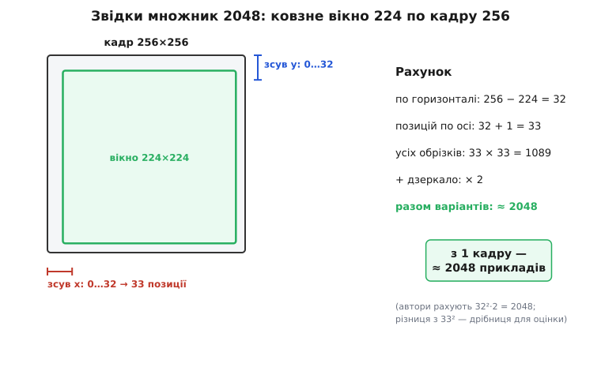
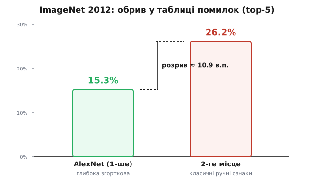

# 📜 Як AlexNet зробив аугментацію знаменитою

До осені 2012 року аугментація даних була старим, майже нудним трюком. Дзеркалити й зсувати картинки, щоб мережа не чіплялася за позицію об'єкта, придумали ще у 1990-х — цим користувався Ян Лекун (фр. Yann LeCun) на своїх мережах для розпізнавання поштових індексів. Прийом жив на периферії, як домашній засіб: усі знали, мало хто вважав його вартим окремої розмови. А потім три людини з Торонто взяли його, помножили набір із півтора мільйона картинок **у дві тисячі разів** — і виграли головне змагання з комп'ютерного зору з таким відривом, що поле не оговталося досі. Ця історія — про те, як скромний трюк раптом став тим, без чого велика нейромережа просто не працює.

## Змагання, яке всі програвали однаково

Щоб зрозуміти масштаб, треба спершу відчути, у що вони влізли. ImageNet — це база з мільйонів фотографій, зібрана під керівництвом Фей-Фей Лі (кит. 李飛飛, Fei-Fei Li), американської дослідниці, яка започаткувала проєкт наприкінці 2000-х; кожна картинка підписана одним із тисячі класів: «золотистий ретривер», «шкільний автобус», «мухомор». Щороку на її підмножині проводили змагання ILSVRC: команди приганяли свої програми, і ті намагалися вгадати, що на фотографії. Мірили похибкою **top-5** — частка картинок, де правильної відповіді не було навіть серед п'яти найкращих здогадів моделі. Планка була висока: тисяча класів, багато з них плутаних (скільки порід тер'єрів ти розрізниш?), тому навіть добра програма помилялася на чверті знімків.

І роками всі помилялися приблизно однаково. Переможці ILSVRC-2010 і 2011 будували складні конвеєри з **ручно придуманих ознак** — інженер сідав і вручну описував, за якими рисами шукати кути, текстури, кольорові плями (SIFT, Fisher-вектори), а зверху ставив класифікатор. Це була вершина класичного комп'ютерного зору, відшліфована десятиліттями. Найкращий результат 2011 року застряг близько 26 % похибки top-5, і рух уперед ішов повільно — по частці відсотка на рік. Здавалося, тут уже майже стеля можливого.

## Троє з Торонто й ставка на глибину

Виклик прийняла лабораторія Джеффрі Гінтона (англ. Geoffrey Hinton) в Університеті Торонто — того самого Гінтона, який десятиліттями, наперекір моді, вірив у нейромережі, коли їх мало хто сприймав усерйоз. Роботу зробили двоє його аспірантів: **Алекс Крижевський** (Alex Krizhevsky) і **Ілля Суцкевер** (Ilya Sutskever). Крижевського джерела описують як канадського науковця; Суцкевер народився в Росії й виріс в Ізраїлі, а тоді теж перебрався до Канади. У наукову історію вони ввійшли як дослідники торонтської школи Гінтона — і саме так їх коректно називати: це праця конкретної лабораторії Університету Торонто, а не якоїсь «національної» школи.

Їхня ставка була проста й зухвала: замість вигадувати ознаки руками — дати **глибокій згортковій мережі** самій навчитися, які ознаки шукати, прямо з пікселів. Мережа вийшла величезною для того часу: близько **60 мільйонів параметрів** (вагових коефіцієнтів). Тренували її на двох ігрових відеокартах паралельно — сам по собі рідкісний на той час хід, бо звична наука рахувала на процесорах.

> 🔧 **Навіщо це знати.** Це поворотна точка, після якої «навчати ознаки з даних» перемогло «придумувати ознаки руками» — і весь сучасний зір, від камери твого телефона до бортової моделі дрона, виріс саме звідси. А трюк, що зробив ту перемогу можливою, ти застосовуєш дослівно тим самим кодом.

## Пастка: 60 мільйонів ваг легко все зазубрять

І тут вони вперлися в стіну, яку добре знає кожен, хто тренував велику модель. 60 мільйонів параметрів — це неймовірно гнучка штука. Такій мережі нічого не варто просто **запам'ятати** тренувальні картинки: підігнати ваги так, щоб кожен конкретний знімок вона впізнавала напам'ять — а на новому, якого не бачила, безпорадно провалилася. Це і є [перенавчання](book:algorithms/overfitting): модель зубрить випадкові дрібниці навчального набору замість справжньої закономірності.

> 📎 **[Перенавчання](book:algorithms/overfitting).** Коли модель надто гнучка для кількості даних, вона підганяється під шум і особливості саме тренувальних прикладів (це тло, цей ракурс), а не під суть класу. На навчанні похибка падає майже до нуля, а на нових даних лишається великою — модель завчила, а не зрозуміла.

Півтора мільйона картинок — багато. Але проти 60 мільйонів ваг цього **мало**: параметрів на порядки більше, ніж потрібно, щоб просто запам'ятати весь набір. Автори сформулювали це у своїй статті прямо й без прикрас: без спеціальних заходів проти зубріння їхня мережа страждала б від **істотного перенавчання**, і це змусило б їх узяти **значно меншу** мережу — тобто відмовитися від самої ідеї глибини, заради якої все затівалося. Дилема була гостра: велика мережа потрібна, щоб схопити тисячу складних класів, — але велика мережа завчить дані напам'ять і провалиться на іспиті.

Проти цього вони застосували два леки. Один — новий на той час прийом «дропаут» (англ. dropout — «викидання»): на кожному кроці навчання половину нейронів випадково «вимикають», не даючи їм змовитися й завчити дані спільно. А другий, дешевший і давніший, — саме **аугментація даних**.

## Дві тисячі картинок з однієї

Перший спосіб аугментації в AlexNet був до смішного простий. Кожну картинку заздалегідь стиснули до розміру **256×256** пікселів. А мережа на вхід брала менший квадрат — **224×224**. Отже, з кожного кадру 256×256 можна **вирізати** квадрат 224×224 у різних місцях: посунути рамку трохи ліворуч, трохи вниз — і це вже інший набір пікселів, хоча об'єкт на ньому той самий.

Порахуймо, скільки таких різних обрізків. По горизонталі рамку можна зсувати від краю до краю на 256 − 224 = 32 пікселі, тобто вона має 33 різні положення (від 0 до 32 включно). Так само по вертикалі — 33 положення. А ще кожен обрізок можна **віддзеркалити** по горизонталі (ліво-право), бо для більшості сцен це нічого не міняє. Множимо:

```
по горизонталі:  256 − 224 = 32  →  33 положення
по вертикалі:    256 − 224 = 32  →  33 положення
усіх обрізків:   33 × 33      =  1089
+ горизонтальне дзеркало:      × 2
разом варіантів з ОДНОГО кадру: ≈ 2048
```

Самі автори записали цей множник як **32²·2 = 2048** (вони рахували по 32 зсуви замість 33 — різниця в кілька відсотків для оцінки «на порядок» несуттєва). Головне число — **2048**. З кожної однієї розміченої картинки вони дешево, просто в пам'яті під час навчання, робили близько двох тисяч різних входів. Півтора мільйона кадрів обернулися на мільярди варіантів — і мережа практично ніколи не бачила двох цілком однакових картинок.


*Множник 2048 — це проста геометрія. Вікно 224 має 33 положення по кожній осі кадру 256 (33×33 ≈ 1089 обрізків), а горизонтальне дзеркало подвоює це число. Автори записали оцінку як 32²·2 = 2048 — і саме стільки різних входів вони діставали з однієї фотографії, майже задарма.*

Тут є чесна засторога, яку самі автори не приховували: ці дві тисячі картинок **сильно залежні** одна від одної. Сусідні обрізки перекриваються майже повністю — це не дві тисячі незалежних нових спостережень. Але навіть залежні варіанти б'ють по зубрінню: мережа не може завчити «об'єкт стоїть отут, у цих пікселях», бо щоразу він трохи зсунутий і, може, віддзеркалений. Немає сталого розташування — нема що запам'ятати напам'ять.

## Другий трюк: похитати кольори через PCA

Другу аугментацію вони придумали тоншу — і саме вона показує, як добре автори розуміли **природу** своїх даних. Освітлення в реальному світі гуляє: та сама сцена то тепліша, то холодніша, сонце то жовтіше, то білявіше. Хотілося навчити мережу, що **колір освітлення** — деталь несуттєва: золотистий ретривер лишається ретривером і в теплому надвечірньому світлі, і в холодному ранковому. Наївно було б просто випадково крутити канали R, G, B — але кольори в природних знімках змінюються не абияк, а вздовж певних узгоджених напрямків (коли світло тепліше, червоне й зелене ростуть разом).

Щоб зловити саме ці природні напрямки, вони порахували по всьому наборові ImageNet **головні компоненти** кольору — через розклад PCA (англ. principal component analysis, аналіз головних компонент). Це дає три власні вектори матриці 3×3 коваріацій пікселів RGB — три «осі», вздовж яких колір у природних сценах гуляє найбільше, — і три власні числа λ, що кажуть, наскільки сильно він гуляє по кожній осі. Тоді до кожного тренувального кадру додавали зсув уздовж цих осей:

```
до кожного пікселя RGB додати:   Σᵢ  pᵢ · (λᵢ · αᵢ)

pᵢ  — i-й власний вектор кольору (напрямок)
λᵢ  — i-те власне число (наскільки цей напрямок «широкий»)
αᵢ  — випадкове число, αᵢ ~ N(0, 0.1)   (одне на кадр, спільне для всіх пікселів)
```

Тобто кадр цілком зсували в бік «тепліше» чи «холодніше» — але лише вздовж тих напрямків і в тих масштабах, що бувають у справжніх фотографіях. Величина αᵢ мала (стандартне відхилення 0.1), тож зсув делікатний, а λᵢ стежить, щоб «широку» вісь можна було хитати сильніше, а «вузьку» — лише трохи. Ефект цього єдиного трюку автори виміряли прямо: він **знизив похибку top-1 більш ніж на 1 %**. Один процент здається дрібницею, але на такому змаганні, де прогрес роками йшов по частках відсотка, «більш ніж 1 %» від однієї делікатної операції з кольором — це багато.

## Обрив у таблиці

Восени 2012 року результати ILSVRC оприлюднили — і сталося те, чого поле не бачило доти. AlexNet узяв похибку top-5 **15.3 %**. Найкраща з решти команд, зі щойно відшліфованими класичними ознаками, — **26.2 %**.

```
AlexNet (глибока згорткова мережа):   15.3 %  top-5
2-ге місце (класичні ручні ознаки):   26.2 %  top-5
розрив:                              ≈ 10.9 відсоткового пункту
```


*Розрив, який струсонув поле. Роками похибка top-5 повзла вниз по частці відсотка на рік — а AlexNet зрізав її з ~26 % одразу до 15.3 %. Це не поступове покращення класичного підходу, а обрив: у таблиці утворилася десятивідсоткова прірва, яку не пояснити тонким налаштуванням старих методів.*

Це був не поступ, а **обрив**. Прірва майже в одинадцять відсоткових пунктів на змаганні, де рухалися по частці відсотка, означала лише одне: глибокі згорткові мережі — інша ліга. Наступного року на ILSVRC уже майже всі команди принесли нейромережі; класичний конвеєр ручних ознак фактично зник за один сезон. Стаття «ImageNet Classification with Deep Convolutional Neural Networks» стала однією з найцитованіших у всій історії інформатики, а сам момент заведено вважати початком сучасної хвилі глибокого навчання.

*(Числа усталені: результат ILSVRC-2012 — top-5 15.3 % проти 26.2 % — і множник аугментації 2048, і зниження top-1 «більш ніж на 1 %» від PCA-зсуву кольору наведені в самій статті Крижевського, Суцкевера й Гінтона 2012 року. Не плутати з іншими цифрами тієї ж роботи: 37.5 % / 17.0 % — це похибки на окремому, старішому наборі ILSVRC-2010, який стаття теж описує.)*

## Що з цього лишилося нам

Найважливіший урок цієї історії — не самі числа, а **чому** аугментація тут спрацювала. У статті чорним по білому сказано: обидві форми аугментації — це **перетворення, що зберігають ярлик** (label-preserving). Обрізок ретривера — це той самий ретривер; віддзеркалений ретривер — теж ретривер; той самий кадр у трохи теплішому світлі — знову ретривер. Пікселі щоразу інші, а **правда підпису лишається**. Саме тому такі перетворення можна плодити тисячами: кожне дає мережі новий вхід, не збрехавши їй про відповідь. Це та сама залізна межа, на якій тримається будь-яка аугментація й донині.

Другий урок — **тверезість** авторів. Вони не оголосили аугментацію магією; вони чесно записали, що варіанти сильно залежні, порахували реальний множник і виміряли внесок кожного трюку окремо. І прямо назвали причину, чому без цього не обійтися: велика мережа без аугментації **нищівно перенавчилася б** — завчила б ImageNet напам'ять і провалилася на іспиті. Дешевий трюк, який десятиліття жив на периферії, виявився тим самим, що дає **гнучкій** мережі право бути гнучкою, не збиваючись у зубріння. Відтоді жоден серйозний зоровий проєкт без нього не обходиться — і той код, що дзеркалить і зсуває твої кадри перед подачею в модель, тягне пряму лінію просто в осінь 2012 року.
