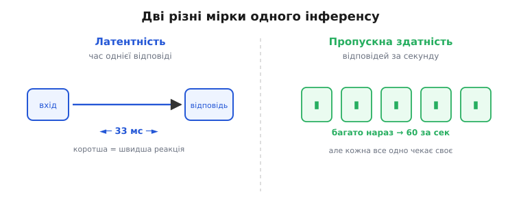

# Латентність інференсу: скільки чекати одну відповідь

Коли навчену модель ставлять на апарат, найперше запитання інженера — не «наскільки вона розумна», а куди простіше: **як довго вона думає над одним входом**. Дрон бачить кадр — і мусить за долю секунди сказати, чи є там перешкода, поки та ще далеко. Ось цей проміжок від «дали вхід» до «отримали відповідь» і є **латентність інференсу** (лат. *latens* — прихований, притаєний; те, що спливає з затримкою). Вона вимірюється в мілісекундах і майже завжди вирішує, чи взагалі модель придатна для задачі — бо правильна відповідь, яка спізнилася, часто гірша за наближену вчасну.

Сам поділ на навчання й [вивід (inference)](topic:algorithms/train-vs-inference) уже каже, що на борту йдеться лише про застосування замороженої моделі. Латентність — це вартість **одного** такого застосування в часі. І перше, що варто зрозуміти: це зовсім не те саме, що «скільки відповідей за секунду».

### Латентність — це не пропускна здатність

Дві мірки постійно плутають, а вони відповідають на різні питання.

**Латентність** — скільки чекати **одну** відповідь. Дав кадр — за скільки мілісекунд маєш результат. Це про **реакцію**: наскільки швидко апарат відгукнеться на конкретну подію.

**Пропускна здатність (throughput)** — скільки відповідей система видає **за секунду** сумарно. Це про **обсяг**: скільки кадрів чи запитів вона перемеле за одиницю часу.

Здається, ніби вони — одне й те саме навпаки: менша затримка — більший потік. Насправді їх легко розвести. Уяви конвеєр: деталь проходить складання за годину (велика латентність кожної), але з кінця стрічки нова деталь сходить щохвилини (великий потік). Так само й тут: якщо давати моделі кадри **пачкою** (batch), залізо порахує їх майже одночасно й видасть високий потік — але **кожен окремий кадр** усе одно чекав, поки набереться повна пачка, тож його особиста затримка **зросла**.


*Дві різні мірки. **Латентність** — час однієї відповіді (як швидко відгукнешся на подію); **пропускна здатність** — скільки відповідей за секунду сумарно. Пачка (batch) роздуває потік, але **збільшує** затримку кожного окремого кадру, бо той чекає, поки набереться пачка. У хмарі, де важливо обслужити мільйон запитів, женуть потік; на дроні, де важлива миттєва реакція на кадр, женуть **малу латентність** — і тому найчастіше рахують по одному входу (batch = 1).*

Звідси й розкол за призначенням. Хмарний сервіс, що обслуговує мільйон запитів, оптимізують під **потік** — байдуже, що окремий запит зачекав зайві 20 мс, аби система не захлиналась. Апарат, який керує собою в реальному світі, оптимізують під **латентність** — бо кожен кадр веде до негайної дії, і чекати пачку немає коли. Тому на борту інференс майже завжди роблять **по одному входу за раз** (batch = 1) — і саме цей режим, як не парадоксально, найгірший для заліза.

> 🔧 **Навіщо це.** Перш ніж міряти чи оптимізувати, визнач, що тобі болить. Керуєш апаратом у реальному часі — твоя мета **латентність одного кадру**, і бенчмарки «X тисяч зображень за секунду» тебе оманюють: вони про потік на великих пачках, а ти працюєш із batch = 1. Обробляєш архів на сервері — навпаки, ганяй пачки й міряй потік. Плутанина цих двох чисел — найчастіша причина, чому «швидка на папері» модель гальмує на дроні.

### Бюджет часу: чому 33 мілісекунди

Латентність стає жорсткою межею, коли апарат працює в ритмі реального світу. Камера дає, скажімо, **30 кадрів за секунду** — це один кадр кожні:

```
1 секунда / 30 кадрів = 0.0333 с = 33.3 мс на кадр
```

Це і є **бюджет** (англ. *budget* — кошторис): якщо обробка кадру не вкладається в 33 мс, кадри починають накопичуватись, черга росте, і апарат бачить світ **із запізненням**, що дедалі більшає. Реакція на перешкоду приходить, коли перешкода вже поруч. Тому просте правило: модель придатна для реального часу на цьому залізі, лише якщо її повна латентність кадру **менша за інтервал між кадрами**. Для 30 к/с — менша за 33 мс; для 60 к/с — менша за 16 мс.

І тут криється пастка, на якій спотикаються найчастіше: **латентність кадру — це не час проходу мережі**. Мережа — лише одна ланка в довгому ланцюгу.

### Куди насправді тече час

Коли кажуть «інференс зайняв 8 мс», зазвичай мають на увазі лише **прохід моделі вперед**. Але від камери до дії кадр проходить кілька ланок, і час — це їхня **сума**.


*Латентність одного кадру — сума **всіх** ланок, не лише проходу мережі. Захоплення кадру з камери → підготовка (масштабувати під вхід моделі, нормалізувати числа) → прохід мережі → розбір виходу (напр. [прибрати дублікатні рамки, NMS](book:algorithms/nn-detectors)) → перетворити на команду. Мережа часто НЕ найбільша ланка: підготовка й розбір разом легко з'їдають стільки ж часу. Оптимізувати саму лише модель, а тоді дивуватись, що кадр досі гальмує, — класична помилка.*

Розкладімо ланцюг:

- **Захоплення** — витягнути кадр із камери в пам'ять (копіювання, іноді розпаковка формату).
- **Підготовка (preprocessing)** — привести кадр до того, що очікує модель: масштабувати під її розмір входу, перевести кольори, **нормалізувати** числа (звести яскравість пікселів у діапазон, на якому мережу вчили). На великих зображеннях саме масштабування буває дорожчим за прохід крихітної моделі.
- **Прохід мережі (forward)** — власне множення входу крізь шари до виходу.
- **Розбір виходу (postprocessing)** — перетворити сирий вихід на корисне: у детекторі це, зокрема, [прибрати перекривні дублікатні рамки](topic:algorithms/nn-detectors), відсіяти слабкі — і це теж коштує часу, іноді на диво багато.
- **Дія** — скласти команду й віддати її далі.

Головний висновок: **оптимізувати треба весь ланцюг, а не лише мережу**. Інженер, що місяцями стискав модель із 8 мс до 5 мс, легко проґавить, що підготовка кадру мовчки з'їдає 15 мс — і кадр усе одно не влазить у бюджет. Спершу зміряй **кожну** ланку, знайди найтовщу — і бий по ній.

### Несподіванка: прохід упирається в пам'ять, не в лічбу

Здавалося б, час проходу мережі визначає **кількість множень**: більше операцій — довше рахувати. Для великих пачок так і є. Але для одного входу (batch = 1 — саме режим апарата) головним стає зовсім інше — **час прочитати ваги з пам'яті**.

Причина проста й фізична. Щоб порахувати шар, процесору потрібні дві речі: **вхідні числа** й **ваги** цього шару. Ваги живуть у пам'яті, і їх треба звідти **привезти** до обчислювальних блоків. Коли вхід один-єдиний, множень небагато — і лічильники встигають усе перемолоти майже миттєво, а тоді **простоюють**, чекаючи, поки з пам'яті доїде наступна порція ваг. Вузьке місце — не арифметика, а **пропускна здатність пам'яті** (скільки байтів за секунду вона віддає).

Порахуймо межі окремо. Є дві стелі, і реальний час — це **більша** з них (повільніша ланка диктує темп):

```
лічильна межа  = кількість множень (FLOPs) / швидкість лічби заліза
пам'ятева межа = обсяг ваг у байтах        / пропускна здатність пам'яті
час проходу ≈ max(лічильна, пам'ятева)
```


*Для одного входу прохід тримає **більша** з двох меж. Лічильна (множення ÷ швидкість) часто мала — лічильники встигають; пам'ятева (байти ваг ÷ пропускна) велика — ваги не встигають доїхати. Реальний час = більша = **пам'ятева**: кажуть, що прохід **упирається в пам'ять** (memory-bound). Прямий наслідок: аби прискорити, треба зменшувати не стільки число множень, скільки **обсяг ваг у байтах** — саме тому [квантування](book:algorithms/model-quantization) (менші числа замість більших) б'є точно в межу. Загальний апарат «пам'ять чи лічба» — [roofline-модель](book:algorithms/roofline-model).*

Це переставляє всю оптимізацію з ніг на голову. Якщо прохід **упирається в пам'ять** (memory-bound), то скорочувати кількість множень майже марно — лічильники й так простоюють. Ефект дає лише **зменшення обсягу ваг у байтах**. Ось чому [квантування](topic:algorithms/model-quantization) — заміна кожної ваги з 32-бітного числа на 8-бітне — прискорює інференс так відчутно: ваг стільки ж, але кожна тепер займає **вчетверо менше байтів**, тож і привезти їх із пам'яті вчетверо швидше. Удар лягає точно в межу. (Загальний спосіб питати «пам'ять чи лічба?» для будь-якого обчислення — [roofline-модель](topic:algorithms/roofline-model): вона малює обидві стелі й показує, у яку саме впирається твоє навантаження.)

### Хвіст, а не середнє: тайл-латентність

Зміряти латентність один раз мало — вона **гуляє** від кадру до кадру. Іноді втручається операційна система, спрацьовує збирач сміття, гарячий процесор скидає частоту, — і окремий кадр раптом рахується вдвічі довше. Тому дивитись треба не лише на **середнє**, а на **хвіст** розподілу.

Стандартна мірка хвоста — **процентилі**. Латентність **p99** означає: 99% кадрів опрацьовано **швидше** за це число, і лише найгірший 1% — повільніше. Це і є **тайл-латентність** (англ. *tail* — хвіст: рідкі, але найповільніші випадки на «хвості» розподілу).

Чому саме хвіст, а не середнє? Бо катастрофу спричиняє **найгірший** кадр, не типовий. Якщо середня латентність — приємні 20 мс, але p99 стрибає до 60 мс, то приблизно кожен сотий кадр **вилітає** за бюджет 33 мс — і саме в ту мить, коли перед дроном раптом виринула перешкода, реакція може спізнитися. Система, у якої середнє чудове, а хвіст жахливий, **непередбачувана** — а керуванню в реальному світі передбачуваність потрібніша за низьке середнє. Тому й міряють p99 (а іноді p99.9): вони кажуть, наскільки погано буває в найгірші, вирішальні моменти.

> 🔧 **Навіщо це.** Ніколи не оцінюй придатність моделі за одним заміром чи за середнім. Зроби багато прогонів, збери **p99** — і саме його порівнюй із бюджетом кадру. Дві моделі з однаковим середнім можуть поводитись зовсім по-різному: одна тримає рівний темп, друга періодично «затинається». Для реального часу друга небезпечна, хоч «у середньому» не гірша. Окремо стережися заліза, схильного до стрибків латентності: рівний, передбачуваний темп часто цінніший за трохи менше, але «дерготливе» середнє.

### Виміряти чесно: worked-приклад

Правильно зміряти латентність нескладно, але легко зіпсувати кількома типовими промахами. Ось як це роблять на прошивці — з урахуванням цих пасток.

**Задача: зміряти латентність проходу моделі й отримати не лише середнє, а хвіст (максимум).**

:::tabs
```c
#include <stdint.h>

// Повертає час у мікросекундах (реалізація залежить від платформи).
uint64_t now_us(void);

extern void model_infer(const float *input, float *output);  // один прохід
extern float g_input[INPUT_SIZE];
extern float g_output[OUTPUT_SIZE];

void measure_latency(void) {
    const int N = 200;

    // 1) Прогрів: перші прогони завжди повільніші (кеш холодний,
    //    залізо ще не «розкрутилось»). Їх у статистику НЕ беремо.
    for (int i = 0; i < 20; i++)
        model_infer(g_input, g_output);

    // 2) Заміри: кожен прохід — окремо, щоб бачити РОЗКИД, не лише суму.
    uint64_t worst = 0;
    uint64_t sum   = 0;
    for (int i = 0; i < N; i++) {
        uint64_t t0 = now_us();
        model_infer(g_input, g_output);
        uint64_t dt = now_us() - t0;      // латентність цього кадру

        sum += dt;
        if (dt > worst) worst = dt;       // стежимо за ХВОСТОМ
    }

    uint64_t mean = sum / N;
    // mean  — типова латентність; worst — найгірший кадр (наближення до p99).
    // Для бюджету 30 к/с придатність вирішує саме worst, а не mean:
    //   worst < 33000 мкс  →  укладаємось навіть у найгіршому кадрі.
    report(mean, worst);
}
```
```cpp
#include <cstdint>
#include <chrono>

// Один прохід моделі та її вхід/вихід (реалізація залежить від платформи).
void model_infer(const float *input, float *output);
extern float g_input[INPUT_SIZE];
extern float g_output[OUTPUT_SIZE];

// Час у мікросекундах від монотонного годинника (не стрибає при зміні системного).
static uint64_t now_us() {
    using namespace std::chrono;
    return duration_cast<microseconds>(steady_clock::now().time_since_epoch()).count();
}

void measure_latency() {
    constexpr int N = 200;

    // 1) Прогрів: перші прогони завжди повільніші (кеш холодний,
    //    залізо ще не «розкрутилось»). Їх у статистику НЕ беремо.
    for (int i = 0; i < 20; ++i)
        model_infer(g_input, g_output);

    // 2) Заміри: кожен прохід — окремо, щоб бачити РОЗКИД, не лише суму.
    uint64_t worst = 0;
    uint64_t sum   = 0;
    for (int i = 0; i < N; ++i) {
        uint64_t t0 = now_us();
        model_infer(g_input, g_output);
        uint64_t dt = now_us() - t0;      // латентність цього кадру

        sum += dt;
        worst = std::max(worst, dt);      // стежимо за ХВОСТОМ
    }

    uint64_t mean = sum / N;
    // mean  — типова латентність; worst — найгірший кадр (наближення до p99).
    // Для бюджету 30 к/с придатність вирішує саме worst, а не mean:
    //   worst < 33000 мкс  →  укладаємось навіть у найгіршому кадрі.
    report(mean, worst);
}
```
```python
import time

# model_infer(input, output) — один прохід; g_input / g_output — вхід і вихід.
# time.perf_counter_ns — монотонний годинник високої роздільності.

def measure_latency():
    N = 200

    # 1) Прогрів: перші прогони завжди повільніші (кеш холодний,
    #    залізо ще не «розкрутилось»). Їх у статистику НЕ беремо.
    for _ in range(20):
        model_infer(g_input, g_output)

    # 2) Заміри: кожен прохід — окремо, щоб бачити РОЗКИД, не лише суму.
    worst = 0
    total = 0
    for _ in range(N):
        t0 = time.perf_counter_ns()
        model_infer(g_input, g_output)
        dt = (time.perf_counter_ns() - t0) // 1000   # латентність цього кадру, мкс

        total += dt
        worst = max(worst, dt)                        # стежимо за ХВОСТОМ

    mean = total // N
    # mean  — типова латентність; worst — найгірший кадр (наближення до p99).
    # Для бюджету 30 к/с придатність вирішує саме worst, а не mean:
    #   worst < 33000 мкс  →  укладаємось навіть у найгіршому кадрі.
    report(mean, worst)
```
```go
package main

import "time"

// model_infer робить один прохід; g_input / g_output — вхід і вихід моделі.

func measureLatency() {
    const N = 200

    // 1) Прогрів: перші прогони завжди повільніші (кеш холодний,
    //    залізо ще не «розкрутилось»). Їх у статистику НЕ беремо.
    for i := 0; i < 20; i++ {
        modelInfer(gInput, gOutput)
    }

    // 2) Заміри: кожен прохід — окремо, щоб бачити РОЗКИД, не лише суму.
    var worst, sum time.Duration
    for i := 0; i < N; i++ {
        t0 := time.Now()
        modelInfer(gInput, gOutput)
        dt := time.Since(t0) // латентність цього кадру (монотонний годинник)

        sum += dt
        if dt > worst {
            worst = dt // стежимо за ХВОСТОМ
        }
    }

    mean := sum / N
    // mean  — типова латентність; worst — найгірший кадр (наближення до p99).
    // Для бюджету 30 к/с придатність вирішує саме worst, а не mean:
    //   worst < 33*time.Millisecond  →  укладаємось навіть у найгіршому кадрі.
    report(mean, worst)
}
```
:::

Три пастки, які цей код обходить. **Перша — прогрів**: якщо міряти з першого ж прогону, отримаєш завищене число (холодний кеш, залізо ще не на повній частоті), тож кілька прогонів роблять «на викид». **Друга — усереднення на льоту**: складати все в одну суму й ділити зручно, але тоді **зникає розкид** — а нам потрібен саме найгірший кадр, тому `worst` стежимо окремо. **Третя, найпідступніша, тут навмисно НЕ показана**: міряти лише `model_infer` — і забути, що реальна латентність кадру включає ще й підготовку та розбір виходу. Чесний замір бюджету обгортає таймером **увесь** ланцюг від кадру до команди, а не тільки прохід мережі.

### Важелі: чим збивають латентність

Коли модель не влазить у бюджет, тягнуть за кілька важелів — кожен б'є в свою ланку ланцюга:

- **Менша модель** — менше шарів і ваг. Найпряміше рішення, але коштує **точністю**: маленька мережа й бачить гірше. Компроміс «швидкість ↔ точність» — центральний у [TinyML](topic:algorithms/tinyml).
- **[Квантування](topic:algorithms/model-quantization)** — числа меншої розрядності (8 біт замість 32). Б'є точно в **пам'ятеву межу** (менше байтів ваг возити) і часто в лічбу теж; майже задарма за точність, тому це перший важіль на борту.
- **Дешевша підготовка** — не масштабувати гігантський кадр, якщо моделі вистачить меншого; тримати вхід у форматі, який не треба конвертувати. Часто найшвидший виграш, бо цю ланку зазвичай ніхто не оптимізує.
- **Пропустити кадри** — обробляти не кожен кадр, а кожен другий-третій, а між ними **екстраполювати** рухом. Латентність окремого проходу не змінюється, але апарат встигає за потоком.
- **Швидше залізо** — спеціалізований прискорювач інференсу (з широкою швидкою пам'яттю під ваги) б'є одразу по обох межах; але це вже вибір [заліза, а не алгоритму](topic:algorithms/edge-computing).

Порядок дій майже завжди той самий: спершу **зміряй кожну ланку** й знайди найтовщу, тоді бий саме по ній. Оптимізувати те, що й так швидке, — марнувати зусилля.

Наскільки малою буває латентність на практиці — залежить від заліза й моделі, і діапазон широкий. На спеціалізованому прискорювачі інференсу компактна мережа розпізнавання об'єктів проходить один кадр приблизно за **2 мс** — глибоко в межах будь-якого відеобюджету. Та сама модель на слабкому універсальному процесорі легко забирає **десятки мілісекунд** і в 30 к/с уже не влазить. А історію того, як інференс узагалі переселився з дата-центрів на дешеві чипи в реальному часі, [варто розповісти окремо](topic:algorithms/inference-latency/hist-realtime-inference.md).

> 🔧 **Навіщо це.** Латентність — не властивість самої моделі, а **пари «модель + залізо + весь конвеєр»**. Одна й та сама мережа на прискорювачі летить, а на кволому процесорі гальмує. Тому вибір моделі й вибір заліза роблять **разом**, під конкретний бюджет кадру, а не окремо. І перш ніж стискати мережу — переконайся, що вузьке місце справді в ній, а не в підготовці чи розборі виходу.

### Підсумок теми

Латентність інференсу — час від входу до відповіді на **одному** прикладі, і саме вона (а не пропускна здатність — потік за секунду) вирішує, чи придатна модель для реального часу. Її межа — **бюджет кадру**: при 30 к/с прохід мусить укластися в 33 мс. Але латентність кадру — це **сума всього ланцюга** (захоплення → підготовка → прохід → розбір → дія), а не лише проходу мережі, тож оптимізують ланцюг цілком. Сам прохід при batch = 1 частіше **впирається в пам'ять**, ніж у лічбу, — тому [квантування](topic:algorithms/model-quantization) (менші ваги в байтах) прискорює так відчутно. Оцінювати треба **хвіст** (p99), не середнє: непередбачувані стрибки небезпечніші за трохи вищу типову затримку. А коли бюджет тисне — тягнуть за важелі (менша модель, квантування, дешевша підготовка, пропуск кадрів, швидше залізо), завжди починаючи з **виміру** найтовщої ланки.
