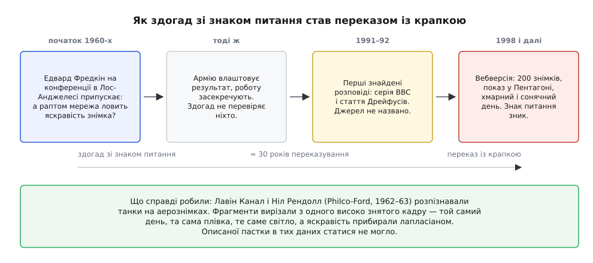
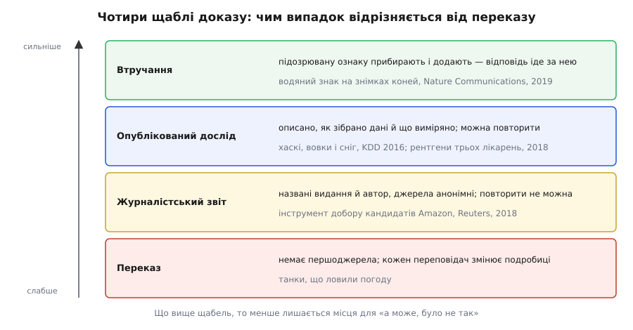

# 📜 Танки, сніг і резюме: як фах учився не вірити високій точності

Найгучніша пересторога галузі — переказ про нейромережу, що начебто розпізнавала танки, а насправді відрізняла хмарний день від сонячного, — не має жодного першоджерела, тоді як менш ефектні випадки поруч мають імена, дати й числа. Розібрати цю різницю варто не заради педантизму: переказ і перевірений випадок навчають протилежного, і той, хто засвоїв лише переказ, шукатиме підміну не там, де вона трапляється.

## Переказ, який чув кожен

Найпоширеніша вебверсія з'явилася у вересні 1998 року — сторінка «Neural Network Follies» Ніла Фрейзера. Там усе на місці: військові знімають сотню кадрів із танками, схованими за деревами, і сотню кадрів самого лісу; половину кадрів замикають у сейфі, на другій половині навчають мережу. Мережа розділяє навчальні кадри бездоганно, тоді бездоганно розділяє й відкладену половину — і Пентагон замовляє незалежну перевірку на свіжих знімках. Відповіді виходять цілком випадкові. Аж тоді хтось помічає, що всі кадри з танками знято хмарного дня, а всі кадри без танків — сонячного. Мережа навчилася бачити колір неба.

Історія тримається на трьох речах, і всі три працюють бездоганно. Вона повна: є зав'язка, є розв'язка, є несподіванка наприкінці. Мораль її правильна: висока точність нічого не каже про те, на що модель дивиться. І вона лестить — помилка в ній така недоладна, що читач одразу почувається розумнішим за тих військових. Сам Фрейзер, до речі, одразу застерігає, що історія, можливо, апокрифічна, і додає, що це не так уже й важливо. Ця приписка — головна прикмета: розповідач сам не знає, звідки взяв, і вважає це дрібницею.

## Що показує звірка версій

Дослідник, що пише під іменем Gwern, зібрав докупи всі версії, які зміг знайти, у розвідці «The Neural Net Tank Urban Legend». Найраніша знайдена друкована — 1992 рік: Г'юберт Дрейфус і Стюарт Дрейфус, стаття «What artificial experts can and cannot do» в журналі *AI & Society*. Там мережа навчилася відрізняти ліс із тінями від лісу без тіней. Приблизно тоді ж історія звучить у серіалі BBC «The Machine That Changed the World» (листопад 1991). 1993-го її переказує Еріх Гарт у книжці *The Creative Loop*. А 1994-го Ройстон Ґудейкр із співавторами наводить її у **хімічній** статті — і як джерело посилається на телепередачу BBC «Horizon».

На цьому місці варто спинитися. Наукова стаття посилається на телевізор. Телевізор не посилається ні на що. Далі йдуть тисячі переказів, які посилаються один на одного або ні на що.

А самі подробиці розходяться так:

| Що саме | Розкид по версіях |
| --- | --- |
| Коли | 1960-ті, 1980-ті, 1990-ті, «Буря в пустелі» |
| Хто замовляв | армія США, Пентагон, НАТО, приватні підрядники |
| Скільки знімків | сто, двісті, тисячі |
| Звідки знімали | супутник, літак, із землі |
| Що замість танка | хмарність, тіні, яскравість, кут сонця, брак плівки |
| Коли викрили | за кілька годин, під час показу, уже після впровадження |
| Де | ліс, поле, пустеля, болото |

У справжньому спогаді подробиці тримаються міцніше за мораль: людина, яка там була, пам'ятає, скільки було кадрів і хто саме помітив. Тут навпаки — пливе все, крім моралі. І ніде, в жодній версії, не названо ані свідка, ані звіту, ані бодай прізвища.

## Питання, з якого це, найпевніше, почалося

Слід усе-таки є, і він веде до одного речення. На початку 1960-х Едвард Фредкін був на конференції в Лос-Анджелесі — сам він не пригадує напевно, чи то був Каліфорнійський технологічний, чи RAND. Там доповідали про мережі з випадковими зв'язками, які навчали розпізнавати танки на аерознімках; це була доба, коли довкола [перцептрона](topic:algorithms/perceptron) будували перші машини, здатні вчитися з прикладів. Фредкін підвівся й висловив сумнів: а що, коли мережа навчилася лише відрізняти яскравий знімок від тьмяного? Він переказав це листом 2013 року й наголосив на головному — то був його здогад, а не перевірений висновок. Роботу невдовзі засекретили, і з'ясувати, чи мав він рацію, не випало нікому.

Оце і є вся відстань між джерелом і переказом. Речення Фредкіна закінчувалося знаком питання: можливо, мережа дивиться на яскравість. Переказ закінчується крапкою: мережа дивилася на яскравість, і ось як це виявили. Між першим і другим не додалося жодного нового факту — додалося тридцять років переказування.


*Ланцюг переказу поруч із тим, що справді робили. Кожна ланка додає подробиць і жодна не додає джерела; зникає з ланцюга рівно одна річ — знак питання наприкінці першого речення.*

Цікаво, чим була та справжня робота. Лавін Канал і Ніл Рендолл у Philco-Ford 1962–63 років розпізнавали танки на аерознімках на замовлення армії США; опис вийшов 1964-го під назвою «Recognition System Design by Statistical Analysis» — ієрархія порогових логічних елементів над ділянками кадру, що перекриваються. Результати армію влаштували настільки, що їх засекретили, тож звіту про провал немає взагалі; у пізнішій передмові Канал називає ту роботу перспективною. І найцікавіше: описаної пастки в тих даних статися не могло. Фрагменти вирізали з окремих високо знятих кадрів — той самий день, та сама плівка, те саме світло і для танків, і для порожнього лісу, — а перед аналізом знімки бінаризували й пропускали через лапласіан, який абсолютну яскравість якраз і викидає.

## Розумний Ганс: як виглядає перевірена історія

Щоб побачити, чого переказові бракує, зручно взяти історію такої самої форми, яку таки перевірили. Берлін, початок 1900-х: кінь на прізвисько Розумний Ганс (нім. *Kluger Hans*), власність Вільгельма фон Остена, вистукував копитом відповіді на арифметичні питання. 1904 року справу розглядала офіційна комісія на чолі з психологом Карлом Штумпфом — ветеринар, цирковий директор, кавалерійський офіцер, учителі. Комісія обману не знайшла.

На цьому історія могла й скінчитися — з висновком «перевірили, шахрайства немає», тобто рівно там, де назавжди застряг переказ про танки. Але помічник Штумпфа Оскар Пфунгст зробив те, чого комісія не робить: почав по одному змінювати умови. Він помітив, що поки кінь стукає, у того, хто питає, напружуються дихання й постава, а на потрібному числі напруга спадає. Тоді він прибрав цю підказку — став ставити питання, відповіді на які сам питальник не знав, і закривати питальника від коня.

```
питальник знає відповідь і його видно  → 89 % правильних відповідей
питальник не знає або його не видно    →  6 % правильних відповідей
```

Ганс не рахував — він читав людину. Але для нас важить не сама відповідь, а те, як її здобули: названо здогад, навмисне змінено одну умову, отримано числа з обох боків. Саме тому випадок цитують і через сто двадцять років — і цитують поіменно: Себастьян Лапушкін із співавторами назвали свою працю 2019 року в *Nature Communications* «Unmasking Clever Hans predictors», бо в моделей та сама звичка.

## Хаскі, вовк і сніг

Тепер той самий сюжет, але зроблений навмисне. У праці про метод пояснень LIME (Рібейру, Сінґх, Ґестрін, конференція KDD, серпень 2016) пастку не знайшли — її збудували. Автори взяли двадцять навчальних знімків і добрали їх так, щоб за кожним вовком був сніг, а за жодним хаскі — ні. Про ці дані нічого не треба вгадувати: у статті написано, скільки їх і як їх дібрано.

І виміряли автори не модель, а людей. Двадцяти сімом випробуваним — кожен прослухав щонайменше один університетський курс машинного навчання — показали відповіді класифікатора. До пояснень моделі довіряли десятеро, а сніг як підозру назвали дванадцятеро. Після того, як інструмент [пояснюваності](topic:algorithms/model-explainability) підсвітив вирішальні пікселі, довіряли троє, а сніг назвали двадцять п'ятеро.

Зверніть увагу, як міняється сам предмет твердження. Переказ стверджує подію: це сталося, ось як. Дослід стверджує вимір: за таких умов — стільки з двадцяти семи. Подію спростувати нема як, бо нема за що вхопитися. Вимір спростувати можна: повтори збірку й дістань інші числа.

## Коли ознаку вмикають і вимикають

Найміцніший рід свідчення — не спостереження, а втручання.

Лапушкін із співавторами (*Nature Communications*, 2019) розібрали класифікатор, навчений на наборі PASCAL VOC 2007. Коней він упізнавав здебільшого не по конях: приблизно на п'ятій частині кінських знімків у лівому нижньому куті стояла позначка джерела, і саме її модель і шукала. Далі почалося цікаве. Позначку стерли — кінь із відповіді зник. Ту саму позначку наліпили на знімок автомобіля — модель назвала автомобіль конем. Тут уже нема чому вірити чи не вірити: ознаку вмикають і вимикають, а відповідь ходить за нею слідом.

Те саме, тільки в лікарні. Джон Зек із співавторами (*PLOS Medicine*, 6 листопада 2018) узяли 158 323 рентгенограми грудної клітки з трьох закладів і перевірили, як модель пневмонії переносить зміну лікарні:

```
AUC на пневмонії
  у своїй лікарні        → 0.931
  у чужій лікарні        → 0.815

Точність відповіді «яка це лікарня»
  NIH                    → 99.95 %
  Mount Sinai            → 99.98 %
```

Мережа впізнає заклад майже безпомилково, а переносні знімки з палат відділяє від решти взагалі без похибки — і в цих груп різна частка пневмонії. Металева позначка боку, яку рентген-лаборант кладе на пацієнта, у кожній лікарні своя; знімок несе на собі адресу місця, де його зроблено. Це і є [зсув розподілу](topic:algorithms/distribution-shift) у найконкретнішому вигляді: модель вивчила не хворобу, а лікарню. Через три роки Алекс Деґрейв, Джозеф Джанізек і Су-Ін Лі показали (*Nature Machine Intelligence*, 2021) те саме на розпізнавачах COVID-19 за рентгеном: ті спиралися на спосіб, яким склали набір — хворі з одного джерела, здорові з іншого, — а не на легені.

## Астма, що «знижувала ризик»

Найгостріший із задокументованих випадків узагалі не про знімки. Річ Каруана зі співавторами (KDD, 2015) розповіли про дані пневмонії, зібрані в середині 1990-х: система, що виводила правила, вивела серед інших таке — наявність астми **знижує** ризик смерті.

У даних це була чиста правда. Пацієнта з пневмонією й астмою в анамнезі вважали дуже небезпечним випадком, вели одразу до реанімації й лікували наполегливо — і його виміряна смертність справді виходила нижчою за середню. Модель, що діяла б за цим правилом, відсилала б додому саме тих, кого треба класти в реанімацію.

Помітили це лише тому, що та модель була читаним списком правил: правило можна прочитати очима й викреслити. Нейромережі, навчені на тих самих даних, вивчили те саме — і не показали нічого. Автори тоді відмовилися від нейромереж не через точність, а через просте міркування: якщо це правило знайшлося майже випадково, скільки таких самих лишилося в мережі невидимими.

## Amazon: третій рід свідчень

Про згорнутий інструмент добору кандидатів Amazon відомо з розслідування Reuters — Джеффрі Дастін, 10 жовтня 2018 року. Приблизно десяток людей в единбурзькому осередку компанії від 2014 року будували систему, що ставила кандидатові від однієї до п'яти зірок: близько п'ятисот моделей на приблизно 50 000 термінів із резюме, навчених на резюме, які надходили компанії протягом десяти років. Уже 2015-го виявилося, що оцінка не нейтральна до статі: слово «women's» (як у звороті «women's chess club captain») знижувало резюме, випускниці двох жіночих коледжів отримували менше, а звороти, частіші в чоловічих резюме, — більше. Систему спробували зробити нейтральною до цих конкретних слів, але гарантії, що вона не знайде інших замінників, не було; на початку 2017-го групу розпустили. Коментувати сам інструмент в Amazon відмовилися.

Тепер про статус цієї звістки, і назвати його треба вголос. Джерело — п'ятеро обізнаних із проєктом людей, які говорили на умовах анонімності. Це набагато більше за переказ: є дата, місце, послідовність подій, названий журналіст і видання, яке відповідає за матеріал своїм ім'ям. Але статті немає, даних немає, моделі немає — повторити ззовні нема чого. Між легендою про танки й дослідом із хаскі цей випадок стоїть посередині, і сказати про нього саме так нічого не коштує, а сплутати його з котримсь із країв коштує дорого.


*Той самий сюжет — «модель дивиться не туди» — може стояти на будь-якому з чотирьох щаблів. Щабель визначає не те, наскільки історія цікава, а те, скільки в ній лишається місця для «а може, було не так».*

> 🔧 **Навіщо це.** Коли збираєшся навести випадок як доказ — у розмові, у звіті, у листі керівництву, — спитай про нього три речі. Чи є першоджерело з іменем і датою, а не переказ переказу. Чи описано все так, щоб можна було повторити. Чи хтось втручався в підозрювану ознаку, чи лише спостерігав збіг. Танки не проходять жодної з трьох перевірок, Amazon проходить першу, хаскі — першу й другу, кінь із водяним знаком — усі три. Це не заважає розповідати переказ; це заважає спиратися на нього так, ніби він щабель.

## Чому підміну жодного разу не «помітили» самі собою

Ось де переказ і запис розходяться остаточно.

Переказ каже, що підміна безглузда й видна: небо, хмари, колір. Що виявляється вона гучно — на незалежній перевірці, перед генералами, коли відповіді раптом стають випадковими. З цього виходить два хибні уроки: таке трапляється з недбалими, і коли трапиться, ти це побачиш.

Запис каже інше. Ознакою була металева позначка в куті знімка, значок правовласника в лівому нижньому куті, одне слово в резюме, лікарняний порядок ведення астматиків із 1990-х. Ніхто б не здогадався туди подивитися. І точність нікуди не падала: не «випадкові відповіді», а 0.815 замість 0.931 — рівно те число, повз яке звіт проходить, знизавши плечима. Жоден із задокументованих випадків не викрили тим, що показ провалився. Кожен викрили тому, що хтось навмисне пішов шукати — з інструментом у руках, з наперед висловленим здогадом, з умовою, яку можна змінити.

Історія про танки шкідлива не тим, що вигадана. Вона шкідлива тим, що ставить планку не туди: після неї здається, ніби підміну видно неозброєним оком і трапляється вона з іншими. Перевірені випадки кажуть протилежне — видно її лише тому, хто пішов її шукати, і трапляється вона з усіма.
