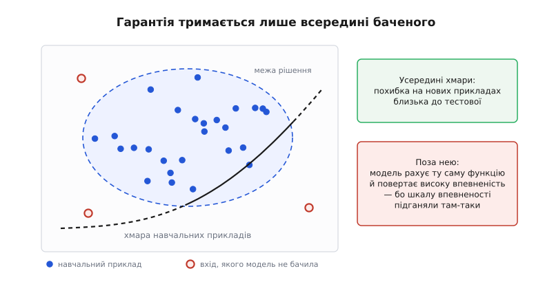
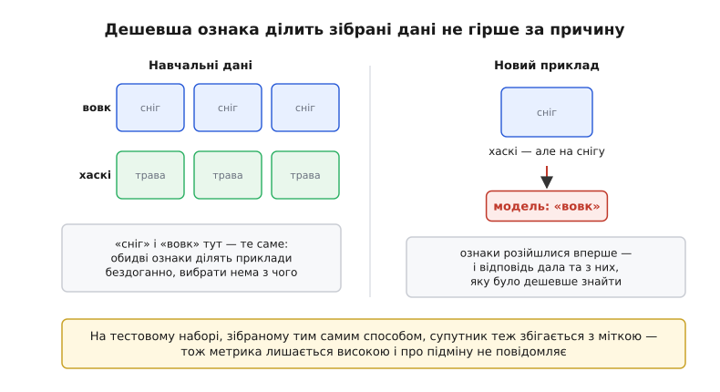
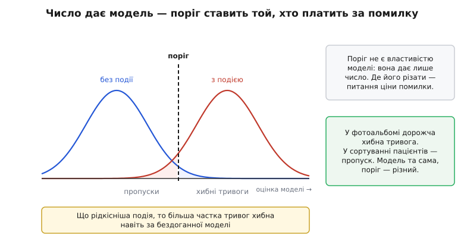

# Межі й етика машинного навчання

<preknowlist>
- [Що таке ML](topic:algorithms/what-is-ml) — модель не пишуть правилами, її підбирають під зібрані приклади.
- [Навчання vs вивід](topic:algorithms/train-vs-inference) — спершу ваги підганяють під дані, потім готову функцію застосовують до нового входу.
- [Перенавчання](topic:algorithms/overfitting) — модель може вхопитися за особливість вибірки замість закономірності; звідси окремий тестовий набір.
- [Умовна ймовірність](topic:math/conditional-probability) — імовірність події за наявної умови; без неї не прочитати, що насправді означає «модель відповіла 0.9».
</preknowlist>

Модель показала 97% на тестовому наборі, її поставили в роботу — і за місяць виявилося, що на цілому класі випадків вона хибить систематично. Прикро не те, що вона помилялася, а те, що не подала знаку: на кожному з тих випадків вона видала таку саму впевнену відповідь, як там, де мала рацію. Це не недогляд програміста. Причина видна, щойно придивитися, що саме робить навчання.

Навчання шукає функцію, яка мінімізує похибку на зібраних прикладах. У цій процедурі немає кроку, де від знайденої залежності вимагалося б бути тією, що породжує явище: досить, щоб вона збігалася з відповіддю на наявних прикладах. Усе, що називають межами машинного навчання, — прямі наслідки цього одного факту, а не хиби конкретної бібліотеки чи архітектури.

### Гарантія тримається лише всередині баченого

Гарантія тут є, але вона умовна: якщо нові приклади надходять із того самого розподілу, що й навчальні, похибка на них буде близька до виміряної на тесті. Цю гарантію дає статистична теорія навчання; її виведення тут не потрібне — важить сама умова, за якої вона діє. «З того самого розподілу» — не формальність, а весь зміст твердження: про вхід, не схожий на бачене, воно не каже нічого.

Гірше, що модель не має способу про це попередити. Вона рахує ту саму функцію від будь-якого входу й повертає число. Шкалу впевненості підганяли на тих самих даних, тож «0.95» на незнайомому вході означає лише «цей вхід схожий на те, що під час навчання діставало 0.95». Наскільки ця шкала відповідає справжній частоті правильних відповідей — окреме питання [калібрування](topic:algorithms/confidence-calibration), і поза баченим воно вже не має на чому триматися.

*Модель ділить увесь простір ознак, хоча приклади бачила лише в межах хмари. Усередині межа рішення спирається на дані; поза хмарою вона продовжена навмання — але відповідь звідти виглядає точно так само, як зсередини.*

Скільки це коштує, показують незалежні перевірки медичних моделей. Модель передбачення сепсису, вбудовану в поширену систему електронних медичних записів, розробник оцінював показником AUC 0.76–0.83 (англ. *area under the curve* — площа під кривою якості: 0.5 — вгадування навмання, 1 — бездоганний поділ). Перевірка на 38 455 госпіталізаціях Мічиганського університету (Wong та ін., *JAMA Internal Medicine*, 2021) дала 0.63: модель пропустила 1709 випадків сепсису з 2552 — дві третини — і водночас здіймала тривогу на 18% усіх госпіталізацій. Інша лікарня — інший склад пацієнтів, інші правила запису в картку, і числа розробника перестали діяти. Це явище зветься [зсувом розподілу](topic:algorithms/distribution-shift): дані на роботі поступово або раптово перестають бути схожими на навчальні.

### Модель бере дешевшу ознаку, а не причину

Якщо в зібраних даних щось збігається з відповіддю й обчислюється простіше, ніж справжня причина, оптимізація візьме простіше. Ні самі дані, ні [функція втрат](topic:algorithms/loss-functions), якою міряють розходження відповіді з міткою, не відрізняють причину від супутньої ознаки — обидві бачать саму лише спільну появу. Це і є [різниця між кореляцією та причиною](topic:math/correlation-causation) у щоденній інженерній подобі: у прикладах обидві ознаки виглядають однаково правильними, і навчанню нема з чого віддати перевагу одній.

Найяскравіший дослід поставили автори методу пояснень LIME (Ribeiro, Singh, Guestrin, KDD 2016). Вони навмисне зібрали 20 навчальних знімків так, щоб на всіх фото вовків був сніг, а на фото хаскі — ні, і навчили на них класифікатор. Далі його відповіді показали 27 фахівцям, кожен з яких прослухав принаймні один університетський курс машинного навчання: десятеро моделі довіряли, і лише дванадцятеро запідозрили, що вона дивиться на сніг. Після пояснення, яке підсвітило вирішальні пікселі, довіряли троє, а сніг назвали двадцять п'ятеро. Різниця між «модель працює» і «модель дивиться не туди» була невидима, доки її не витягли навмисне.

*У зібраних даних дві ознаки ділять приклади однаково добре, тож навчанню нема з чого вибирати причину. Розходяться вони вперше вже на роботі — і відповідь дає та ознака, яку було дешевше знайти.*

Тестовий набір тут не рятує: зібраний тим самим способом, він містить ту саму супутню ознаку, тож метрика лишається високою. Біда ця давня й устигла обрости легендами — [історія того, як інженерія вчилася не вірити високій точності](topic:algorithms/ml-limits-ethics/hist-shortcut-legends.md) розрізняє задокументовані випадки й переказ про танки, що десятиліттями ходить без джерела.

### Зсув у даних стає зсувом у висновках

Дані — не світ, а протокол того, як їх зібрали: хто потрапив у вибірку, хто ставив мітки й які людські рішення минулого ті мітки породили. Коли мітка — це чиєсь колишнє рішення, модель вчиться відтворювати саме його, разом із усіма перекосами.

Показовий випадок оприлюднило агентство Reuters у жовтні 2018 року з посиланням на працівників компанії: Amazon згорнула внутрішній інструмент добору кандидатів, навчений на резюме, що надходили компанії десять років поспіль. Наймали в тій галузі переважно чоловіків, тож система занижувала оцінку там, де траплялося слово «women's», і підвищувала за звороти, частіші в чоловічих резюме. Прибрати стать із переліку ознак не рятує: у даних лишаються її замінники — назва коледжу, формулювання, гуртки. Тому й лагодять таке не у функції втрат, а там, де дані міряють: у доборі вибірки, правилах розмітки й перевірці, чи однаково модель поводиться на різних зрізах даних — окремо на жінках і чоловіках, на нічних і денних кадрах, на кожній моделі камери.

### Спитати «чому» немає в кого

Відповідь моделі — це мільйони зважених сум; місця, де лежить причина, у ній немає. Пояснення доводиться будувати окремим інструментом, який припасовує до поведінки моделі просту й зрозумілу заміну поблизу конкретного входу; така [пояснюваність](topic:algorithms/model-explainability) дає правдоподібну версію, а не протокол міркування. Саме тому в експерименті зі снігом підказку побачили лише з інструментом у руках.

Звідси практичний висновок: вимагати від моделі причину марно, а от **відтворюваності рішення** вимагати можна й треба. Яка версія моделі відповідала, на яких даних її навчали, який поріг стояв, що було на вході — усе це або зафіксовано, або рішення неможливо навіть оскаржити. Модель у робочій системі через це перестає бути «файлом ваг» і стає [версійованим артефактом із родоводом](topic:programming/model-artifact).

### Поріг ставить не модель

Модель повертає число, а рішення ухвалює поріг — і поріг із даних не випливає. Він випливає з того, що дорожче: [хибна тривога чи пропуск](topic:algorithms/detection-metrics). Ці ціни живуть поза моделлю, у тій справі, куди її поставили: у фотоальбомі дорожча зайва тривога, у сортуванні пацієнтів — пропуск.

*Зсув порога не покращує модель, а лише обмінює один рід помилок на другий. Куди його поставити — питання ціни, а не даних.*

До цього додається арифметика рідкісних подій: що рідкісніша подія, то більша частка тривог хибна — навіть за чудових показників на кожному класі окремо. [Числа цього обміну](topic:algorithms/ml-limits-ethics/math-base-rate-threshold.md) варто прорахувати до впровадження, а не після.

Та сама арифметика показує, чому вимога «зробіть модель справедливою» не є технічним завданням, доки не сказано, яка саме рівність мається на увазі. За різних базових частот у групах не можна водночас мати однакову достовірність оцінки (однаковий бал — однакова частка справджень) і однакові частки хибних тривог: це доведено (Chouldechova, 2017; Kleinberg та ін., 2016), і жодна архітектура тут не зарадить. Саме на цьому трималася суперечка навколо системи оцінки ризику рецидиву COMPAS 2016 року: розслідування ProPublica й відповідь розробника міряли [різні критерії справедливості](topic:algorithms/fairness-criteria), і кожна сторона мала рацію у своїх числах. Вибір критерію — рішення тих, хто впроваджує систему, і сховати його всередині моделі не вийде.

### Хто відповідає

Модель не суб'єкт: у неї немає ні наміру, ні змоги відповісти за наслідки. Відповідає той, хто обрав дані, поставив поріг і вирішив, де систему застосувати. Право вже стало на цей самий бік: стаття 22 GDPR дає право не бути об'єктом суто автоматичного рішення зі значущими наслідками, а там, де таке рішення все ж дозволене, — вимагати перегляду живою людиною й оскаржити його; натомість «право на пояснення» записане лише в необов'язковій преамбулі, не в самій статті. Тобто вимога падає на архітектуру системи, а не на модель: рішення має лишати слід і бути оскаржуваним.

> 🔧 **Навіщо це.** Одне число якості нічого не каже про межі — [розкладай похибку по зрізах даних і стеж за зсувом розподілу входів](topic:algorithms/ml-limits-ethics/proj-slice-audit.md), бо саме там модель ламається першою. Тестовий набір збирай окремо від навчального (інший день, інше місце, інший оператор), інакше він успадкує ті самі супутні ознаки. Логуй версію моделі, поріг і вхід — без цього рішення не відтворити й не оскаржити. А там, де помилка незворотна, лишай у контурі людину: не тому, що вона точніша, а тому, що вона може відповісти на запитання «чому».

Сильніша модель зсуває край хмари, але не прибирає його. Питання, де поставити поріг, що коштує помилка й хто за неї відповідає, взагалі не адресовані моделі — на них відповідають ті, хто її ставить у роботу. Модель не має входу для слова «не знаю»; хтось мусить його добудувати ззовні.
