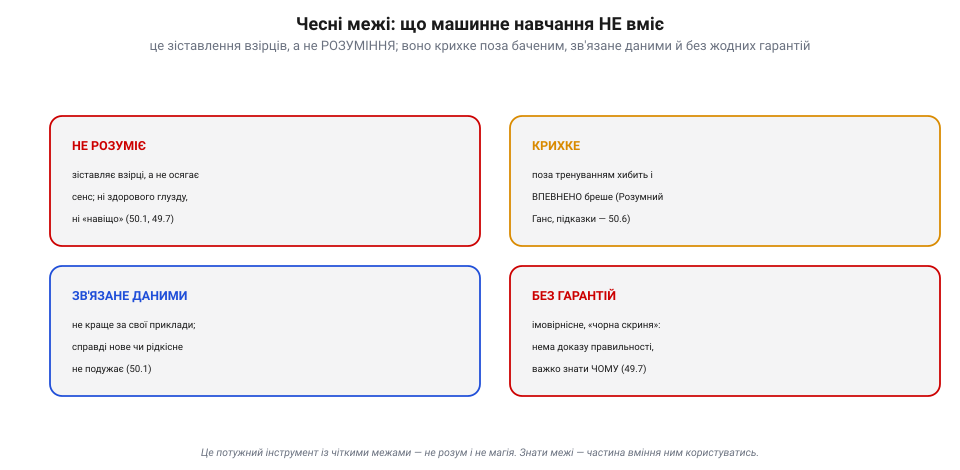
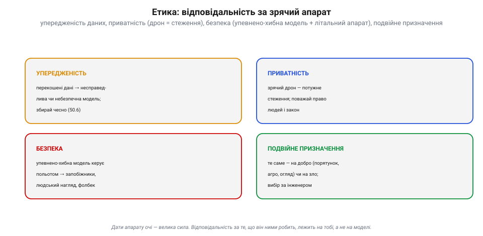
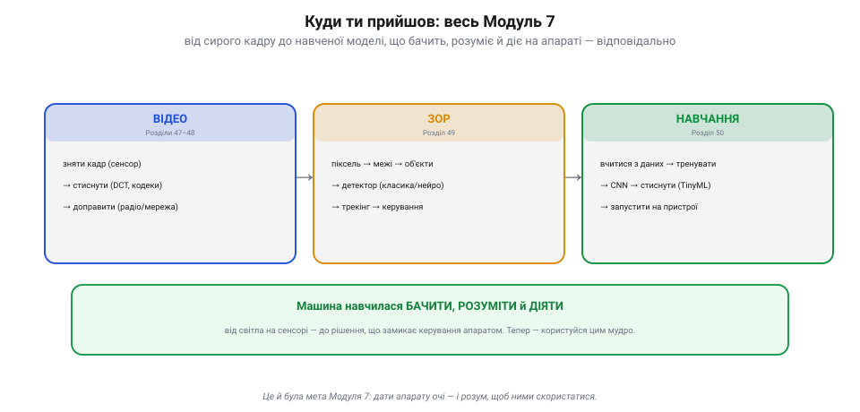

# Куди далі: межі, етика, практичні кроки

Інженер, що ставить [машинне навчання](book:algorithms/what-is-ml) на літальний апарат, вирізняється не лише вмінням **будувати**, а й чесністю про те, **чого** його інструмент не може, відповідальністю за те, як його застосовують, і тверезим планом, **з чого почати**. Про ці три речі — межі, етику й практичні кроки — і йдеться тут.

### Чесні межі: що машинне навчання НЕ вміє

Почнімо без ілюзій. Хай яким разючим здається сучасний зір, у нього **чіткі межі**, і знати їх — частина майстерності.

*Чесні межі. **Не розуміє**: зіставляє взірці, а не осягає сенс — ні здорового глузду, ні «навіщо». **Крихке**: поза тренуванням хибить і **впевнено** бреше (Розумний Ганс, спадкові підказки). **Зв'язане даними**: не краще за свої приклади; справді нове чи рідкісне не подужає. **Без гарантій**: імовірнісне, «чорна скриня» — нема доказу правильності, важко знати чому.*

Варто триматися цих чотирьох меж у голові. Модель **не розуміє** — вона [зіставляє взірці](book:algorithms/what-is-ml), без сенсу й здорового глузду. Вона **крихка**: поза тим, що бачила, хибить, та ще й **упевнено** — це і є [перенавчання](book:algorithms/overfitting). Вона **зв'язана даними**: не краща за свої приклади, і справді нове їй не до снаги. І вона **без гарантій**: імовірнісна «чорна скриня», що не доводить своєї правоти. Це потужний інструмент — але **інструмент**, не розум і не магія. Хто плутає одне з іншим, рано чи пізно дорого платить.

### Етика: відповідальність за зрячий апарат

Дати літальному апарату **очі** — велика сила, а з нею й велика **відповідальність**. Зрячий, автономний дрон зачіпає речі, важливіші за код.

*Етика. **Упередженість**: перекошені дані дають несправедливу чи небезпечну модель — збирай чесно. **Приватність**: зрячий дрон — потужне стеження; поважай право людей і закон. **Безпека**: упевнено-хибна модель, що керує польотом, — це загроза, тож запобіжники, людський нагляд, аварійні режими. **Подвійне призначення**: те саме вміння служить порятунку, агро й огляду — або злу; вибір за інженером.*

Чотири осі відповідальності. **Упередженість**: перекошені чи вузькі [дані породжують несправедливу модель](book:algorithms/overfitting) — тож збирай їх чесно й широко. **Приватність**: камера з розпізнаванням у небі — це потужне **стеження**; поважай право людей і закон. **Безпека**: [упевнено-хибна модель](book:algorithms/nn-detectors), що керує польотом, небезпечна — **ніколи** не довіряй їй наосліп, тримай запобіжники, людський нагляд і аварійні режими, а критичне [рахуй на борту](guide:embedded/where-to-compute). І **подвійне призначення**: ті самі очі служать порятунку в горах, огляду мостів чи врожаю — або стеженню й зброї. Техніка нейтральна; **вибір — за тобою**. Відповідальність за те, що апарат робить очима, лежить на інженері, а не на моделі.

### Практичні кроки: як почати

Досить теорії — як **узятися** за справу, не потонувши? Кілька перевірених правил.

*Практичні кроки. **1.** Найдешевший метод спершу — класика (поріг, Хаф) перед нейромережею. **2.** Бери **готову** натреновану модель і **донавчи** під себе, а не тренуй з нуля. **3.** Збирай **добрі різноманітні** дані й **чесний тест** — знімай в усіх умовах. **4.** Постав **запобіжники** й аварійні режими: ML не керує польотом сама. **5.** Простий → виміряй → покращ, ітеруючи малими кроками. Інструменти: OpenCV, TensorFlow/PyTorch + TFLite, ArduPilot + MAVLink, Raspberry Pi / Jetson.*

Починай із **найдешевшого** методу, що працює — [класичне розпізнавання](book:algorithms/object-detection) часто рятує там, де нейромережу й не варто тягти. Якщо потрібна модель — бери **готову, наперед навчену** й **донавчи** її під свою задачу (перенесення навчання), а не тренуй з нуля. Збирай **добрі, різноманітні** дані й суворо тримай [**чесний тестовий набір**](book:algorithms/overfitting) — і перевіряй у **справжніх** умовах, не лише в лабораторії. Будуй **запобіжники**: жодна модель не керує польотом одноосібно — людський нагляд і аварійний режим обов'язкові. І рухайся **ітераціями**: простий варіант → виміряй → покращ, не забуваючи про [бортовий бюджет обчислень](book:algorithms/compute-cost) і [квантування під мікроконтролер](book:algorithms/tinyml). Інструменти готові й безкоштовні: **OpenCV** для класики, **TensorFlow/PyTorch** із **TFLite** для ML, **ArduPilot** із **MAVLink** для інтеграції, **Raspberry Pi** чи **Jetson** для заліза.

> 📜 **Машина, що вдавала розуміння: ELIZA Вайценбаума (1966).** Найважливішу пересторогу всього цього модуля дав не критик ШІ, а його **творець** — і дав ще 1966 року. Професор MIT **Джозеф Вайценбаум** написав **ELIZA** — першу в світі «балакучу» програму. Її найвідоміший сценарій, **DOCTOR**, удавав психотерапевта: він **віддзеркалював** твої ж фрази назад відкритими питаннями («Мене непокоїть мати» → «Розкажіть більше про вашу матір»). Усередині не було **жодного розуміння** — лише прості правила, що ловили ключові слова й перетасовували їх. Вайценбаум і будував ELIZA, **щоб показати**, як легко створити **ілюзію** розуму. Та сталося неочікуване: люди повірили. Його власна секретарка, знаючи, що це програма, просила залишити її **наодинці** з ELIZA, щоб «поговорити»; інші **відкривали їй душу**, приписуючи машині співчуття й мудрість, яких у ній не було ні краплі. Цей «**ефект ELIZA**» так вразив Вайценбаума, що він став одним із найгостріших критиків ШІ: у книзі «Computer Power and Human Reason» (1976) він доводив, що машина може переконливо **вдавати** розуміння, не маючи його, — і що деякі рішення, які потребують мудрості й совісті, **не можна** віддавати машинам. Це і є серце цієї теми: твоя модель, як ELIZA, [**зіставляє взірці, а не розуміє**](book:algorithms/what-is-ml); і хоч би як впевнено вона звучала, **остаточне судження** — особливо там, де на кону безпека, — лишай за людиною. Творець першого чат-бота застеріг нас про це шістдесят років тому.

> 🔧 **Навіщо це.** Шануй **межі**: твоя модель зіставляє взірці, а не розуміє, — тож **ніколи** не довіряй їй наосліп, надто в критичному за безпекою (запобіжники, нагляд людини, аварійні режими, а критичне — [рахувати на борту](guide:embedded/where-to-compute)). Думай про **етику** з першого дня: [різноманітні дані проти упередженості](book:algorithms/overfitting), повага до приватності (зрячий дрон — це стеження), тверезе ставлення до подвійного призначення. Дій **практично**: [класика перед нейромережею](book:algorithms/object-detection), готова модель + перенесення замість навчання з нуля, добрі дані + чесний тест, ітерації малими кроками. І, як Вайценбаум, не плутай **переконливість** із **розумінням**: машина може звучати впевнено й помилятися — останнє слово лишай за собою. А далі — **учись далі**: галузь біжить, та засади, які ти тут заклав, лишаються.

### Три опори й вічна пересторога

Зрячий апарат тримається на трьох опорах разом. Машинне навчання має **чесні межі** (зіставлення взірців, а не розуміння; крихкість поза баченим; залежність від даних; жодних гарантій), вимагає **етичної** відповідальності (упередженість, приватність, безпека, подвійне призначення) і береться **практично** (класика спершу, готова модель із перенесенням, добрі дані з чесним тестом, запобіжники, ітерації). А вічна пересторога ELIZA — не приймати переконливе вдавання за справжнє розуміння й лишати остаточне судження людині.

Так замикається весь шлях зрячого апарата: він уміє не лише **передати** картинку, а **бачити**, **розуміти** й **діяти** з побаченого — відповідально.

*Шлях зрячого апарата. **Відео**: зняти кадр → стиснути (DCT, кодеки) → доправити (радіо/мережа). **Зір**: піксель → межі → об'єкти → детектор → трекінг → керування. **Навчання**: вчитися з даних → тренувати → CNN → стиснути (TinyML) → запустити на пристрої. Машина навчилася **бачити, розуміти й діяти** — від світла на сенсорі до рішення, що замикає керування апаратом.*

Мета — дати апарату **очі й розум, щоб ними скористатися**. Коли вони є, лишається найважливіше, і це вже за тобою: **користуватися ними мудро**.
